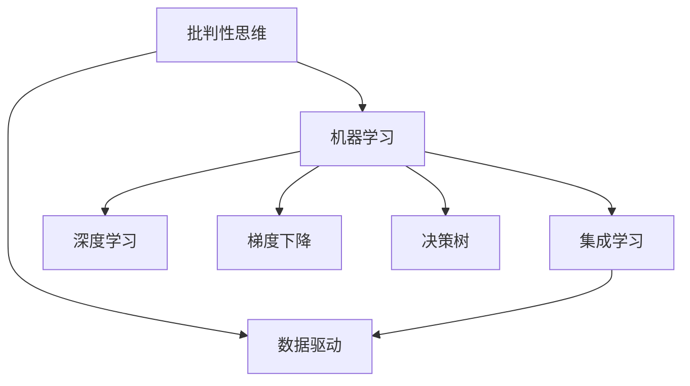

                 

# 理解洞察力的训练：提升批判性思考能力

> 关键词：洞察力,批判性思维,算法,深度学习,神经网络,梯度下降,反向传播,决策树,集成学习,梯度提升树,随机森林,模型融合,可视化,准确率,召回率,ROC曲线,误差率

## 1. 背景介绍

在当今信息爆炸的时代，我们每天都在面对海量的数据和信息，如何从中提取有价值的洞察力，成为提升个人和组织决策能力的关键。批判性思维（Critical Thinking）在这个过程中扮演着至关重要的角色，它不仅帮助我们筛选和整合信息，还能提升我们的决策质量和创新能力。然而，如何系统地训练批判性思维，利用算法和技术工具辅助提升思考能力，仍是一个值得深入探讨的话题。

### 1.1 问题由来

批判性思维的培养，离不开系统的训练和实践。传统上，这种训练通常依赖于理论课程和实际案例的分析。然而，这种方法的缺点在于，难以量化评估训练效果，且依赖于教师的主观判断。因此，近年来，研究者开始探索利用计算机算法和数据驱动的方法，来量化地训练和提升批判性思维能力。

基于机器学习和大数据技术的洞察力训练方法，正在逐步崭露头角。通过构建批判性思维模型，结合自然语言处理（NLP）和视觉分析等技术，我们可以系统地分析和处理数据，提升批判性思维能力。本文将系统介绍基于算法的大规模批判性思维训练方法，探讨其原理、操作步骤、应用场景及未来趋势。

### 1.2 问题核心关键点

批判性思维训练的关键在于，通过数据分析和模型训练，逐步提升个人的逻辑推理、信息整合和决策能力。具体而言，批判性思维训练通常包括以下几个关键步骤：

1. **数据收集与预处理**：收集与任务相关的数据，进行清洗、标注和预处理。
2. **模型构建与训练**：选择合适的算法模型，利用训练数据进行模型训练，优化模型参数。
3. **模型评估与迭代**：在测试数据集上评估模型性能，根据评估结果对模型进行迭代优化。
4. **应用与实践**：将训练好的模型应用于实际任务中，进行分析和决策。

本文将围绕这些关键点，详细探讨批判性思维训练的算法原理和操作步骤。

## 2. 核心概念与联系

### 2.1 核心概念概述

为更好地理解基于算法的大规模批判性思维训练方法，本节将介绍几个密切相关的核心概念：

- **批判性思维**：指个体在处理信息时，能够对信息来源、逻辑关系和推理过程进行全面审视和分析的能力。
- **数据驱动**：利用大规模数据进行建模和训练，通过算法自动发现数据中的规律和趋势。
- **机器学习**：一种利用算法和统计模型，通过数据训练优化模型参数，从而实现自主学习和决策的技术。
- **深度学习**：一种基于神经网络的机器学习方法，通过多层非线性映射提取高阶特征，提高模型预测准确性。
- **梯度下降**：一种常用的优化算法，通过反向传播计算梯度，逐步调整模型参数，使得损失函数最小化。
- **决策树**：一种基于树形结构的分类模型，通过节点分裂和叶子节点分类实现决策过程。
- **集成学习**：通过组合多个模型，提升模型性能和泛化能力，常用的方法包括Bagging、Boosting和Stacking等。

这些核心概念之间的逻辑关系可以通过以下Mermaid流程图来展示：



这个流程图展示了大规模批判性思维训练的主要概念及其之间的关系：

1. 批判性思维通过数据驱动的方法，利用算法模型进行建模和训练。
2. 机器学习是数据驱动方法的核心，深度学习是机器学习中的高级技术。
3. 梯度下降是机器学习中最常用的优化算法。
4. 决策树和集成学习是常用的机器学习模型，用于提升批判性思维训练的效果。

这些概念共同构成了批判性思维训练的算法框架，使得我们能够系统地分析、整合和利用数据，提升个人的批判性思维能力。

## 3. 核心算法原理 & 具体操作步骤

### 3.1 算法原理概述

基于算法的大规模批判性思维训练，本质上是通过数据分析和模型训练，系统地提升个体的逻辑推理、信息整合和决策能力。其核心思想是，通过构建批判性思维模型，利用大规模数据进行训练，优化模型参数，从而实现对批判性思维能力的量化训练。

具体而言，批判性思维训练的算法模型通常包括以下几个关键组件：

- **输入层**：负责接受原始数据，包括文本、图像、音频等。
- **中间层**：利用深度学习、决策树等算法，对输入数据进行特征提取和分析。
- **输出层**：根据中间层输出的结果，输出批判性分析报告，如推理结果、决策建议等。

批判性思维训练的目标是，使得模型能够自动提取数据中的关键信息，识别出数据中的逻辑关系和推理错误，从而提升个人的批判性思维能力。

### 3.2 算法步骤详解

基于算法的大规模批判性思维训练，通常包括以下几个关键步骤：

**Step 1: 数据收集与预处理**
- 收集与任务相关的数据，包括文本、图像、音频等。
- 对数据进行清洗、标注和预处理，如去除噪声、填充缺失值、标准化等。

**Step 2: 模型构建与训练**
- 选择合适的算法模型，如深度神经网络、决策树、集成学习等。
- 利用训练数据进行模型训练，优化模型参数，最小化损失函数。

**Step 3: 模型评估与迭代**
- 在测试数据集上评估模型性能，如准确率、召回率、ROC曲线等。
- 根据评估结果，对模型进行迭代优化，调整模型参数和算法配置。

**Step 4: 应用与实践**
- 将训练好的模型应用于实际任务中，进行数据分析和决策。
- 根据实际反馈，不断迭代模型，优化批判性思维能力。

以上是批判性思维训练的通用流程。在实际应用中，还需要针对具体任务，对各个环节进行优化设计，如改进数据预处理流程、选择更合适的算法模型、优化模型训练策略等，以进一步提升训练效果。

### 3.3 算法优缺点

基于算法的大规模批判性思维训练方法，具有以下优点：

1. **量化评估**：通过算法模型，可以系统地量化评估批判性思维能力，避免主观判断。
2. **高效训练**：利用大规模数据进行模型训练，能够快速提升批判性思维能力。
3. **模型可解释**：算法模型通常具有较好的可解释性，便于理解训练过程和推理结果。
4. **泛化能力强**：通过算法训练，模型具备较强的泛化能力，可以适应多种批判性思维任务。

同时，该方法也存在一定的局限性：

1. **数据依赖**：模型的训练效果高度依赖于数据的质量和数量，难以在数据不足的情况下取得良好效果。
2. **算法复杂**：构建和训练复杂算法模型，需要较高的计算资源和技术水平。
3. **泛化风险**：模型可能过拟合于训练数据，导致在实际应用中泛化性能不足。
4. **可解释性不足**：某些算法模型（如深度学习）的黑箱特性，使得推理过程难以解释。

尽管存在这些局限性，但就目前而言，基于算法的大规模批判性思维训练方法仍然是最主流和有效的手段。未来相关研究的重点在于如何进一步降低对数据的依赖，提高模型的泛化能力和可解释性，同时兼顾效率和成本。

### 3.4 算法应用领域

基于批判性思维训练的算法方法，在多个领域已经得到了广泛的应用，例如：

- **法律分析**：通过分析法律文本和案例，提升法律从业人员的逻辑推理和信息整合能力。
- **金融投资**：利用财经新闻和市场数据，训练批判性思维模型，提升投资决策的准确性和可靠性。
- **医疗诊断**：通过病历和影像数据，训练医疗诊断模型，提升医生的临床推理能力。
- **公共政策**：分析政策文件和社情民意，训练批判性思维模型，提升政策制定者的决策水平。
- **教育培训**：通过学术论文和案例分析，训练批判性思维模型，提升学生的逻辑思维和信息分析能力。

除了上述这些经典应用外，基于批判性思维训练的算法方法，也在更多领域中得到创新性的应用，如情感分析、舆情监测、市场预测等，为各个领域带来了新的突破。随着算法技术的不断进步，基于批判性思维训练的算法方法必将在更多领域大放异彩。

## 4. 数学模型和公式 & 详细讲解 & 举例说明

### 4.1 数学模型构建

本节将使用数学语言对基于算法的大规模批判性思维训练方法进行更加严格的刻画。

设输入数据为 $X \in \mathbb{R}^{n \times d}$，其中 $n$ 表示样本数量，$d$ 表示特征维度。设批判性思维训练的模型为 $f(X) \in \mathbb{R}^k$，其中 $k$ 表示输出维度。假设模型的损失函数为 $L(f(X), Y)$，其中 $Y \in \mathbb{R}^k$ 表示真实的批判性分析结果。

定义模型 $f$ 在训练集 $\mathcal{D} = \{(X_i, Y_i)\}_{i=1}^N$ 上的经验风险为：

$$
\mathcal{L}(f) = \frac{1}{N} \sum_{i=1}^N L(f(X_i), Y_i)
$$

批判性思维训练的目标是最小化经验风险，即找到最优模型参数 $\theta$：

$$
\theta^* = \mathop{\arg\min}_{\theta} \mathcal{L}(f(X; \theta))
$$

在实践中，我们通常使用基于梯度的优化算法（如SGD、Adam等）来近似求解上述最优化问题。设 $\eta$ 为学习率，则参数的更新公式为：

$$
\theta \leftarrow \theta - \eta \nabla_{\theta}\mathcal{L}(f(X; \theta))
$$

其中 $\nabla_{\theta}\mathcal{L}(f(X; \theta))$ 为损失函数对模型参数 $\theta$ 的梯度，可通过反向传播算法高效计算。

### 4.2 公式推导过程

以下我们以二分类任务为例，推导交叉熵损失函数及其梯度的计算公式。

假设模型 $f$ 在输入 $X$ 上的输出为 $\hat{y}=f(X) \in [0,1]$，表示样本属于正类的概率。真实标签 $Y \in \{0,1\}$。则二分类交叉熵损失函数定义为：

$$
L(f(X), Y) = -Y\log \hat{y} - (1-Y)\log (1-\hat{y})
$$

将其代入经验风险公式，得：

$$
\mathcal{L}(f) = -\frac{1}{N}\sum_{i=1}^N [Y_i\log f(X_i)+(1-Y_i)\log(1-f(X_i))]
$$

根据链式法则，损失函数对模型参数 $\theta_k$ 的梯度为：

$$
\frac{\partial \mathcal{L}(f)}{\partial \theta_k} = -\frac{1}{N}\sum_{i=1}^N \frac{Y_i - f(X_i)}{f(X_i)(1-f(X_i))} \frac{\partial f(X_i)}{\partial \theta_k}
$$

其中 $\frac{\partial f(X_i)}{\partial \theta_k}$ 可进一步递归展开，利用自动微分技术完成计算。

在得到损失函数的梯度后，即可带入参数更新公式，完成模型的迭代优化。重复上述过程直至收敛，最终得到适应特定任务的最优模型参数 $\theta^*$。

## 5. 项目实践：代码实例和详细解释说明

### 5.1 开发环境搭建

在进行批判性思维训练实践前，我们需要准备好开发环境。以下是使用Python进行TensorFlow开发的环境配置流程：

1. 安装Anaconda：从官网下载并安装Anaconda，用于创建独立的Python环境。

2. 创建并激活虚拟环境：
```bash
conda create -n tensorflow-env python=3.8 
conda activate tensorflow-env
```

3. 安装TensorFlow：根据CUDA版本，从官网获取对应的安装命令。例如：
```bash
conda install tensorflow tensorflow-cpu -c tf -c conda-forge
```

4. 安装Keras：
```bash
pip install keras
```

5. 安装各类工具包：
```bash
pip install numpy pandas scikit-learn matplotlib tqdm jupyter notebook ipython
```

完成上述步骤后，即可在`tensorflow-env`环境中开始训练实践。

### 5.2 源代码详细实现

下面我们以情感分析任务为例，给出使用TensorFlow和Keras对深度神经网络模型进行批判性思维训练的代码实现。

首先，定义情感分析任务的数据处理函数：

```python
import tensorflow as tf
from tensorflow.keras.datasets import imdb

def load_imdb_data(num_words=10000, maxlen=100):
    (x_train, y_train), (x_test, y_test) = imdb.load_data(num_words=num_words, maxlen=maxlen)

    # 将数据转换为数字索引
    x_train = tf.keras.preprocessing.sequence.pad_sequences(x_train, maxlen=maxlen)
    x_test = tf.keras.preprocessing.sequence.pad_sequences(x_test, maxlen=maxlen)

    return x_train, y_train, x_test, y_test
```

然后，定义模型和优化器：

```python
from tensorflow.keras.models import Sequential
from tensorflow.keras.layers import Dense, Embedding, LSTM

model = Sequential()
model.add(Embedding(input_dim=10000, output_dim=128, input_length=maxlen))
model.add(LSTM(128, dropout=0.2, recurrent_dropout=0.2))
model.add(Dense(1, activation='sigmoid'))

optimizer = tf.keras.optimizers.Adam(learning_rate=0.001)
```

接着，定义训练和评估函数：

```python
def train_epoch(model, dataset, batch_size, optimizer):
    for i in range(epochs):
        for j, (x_train_batch, y_train_batch) in enumerate(train_dataset):
            with tf.GradientTape() as tape:
                predictions = model(x_train_batch)
                loss = tf.keras.losses.binary_crossentropy(y_train_batch, predictions)
            gradients = tape.gradient(loss, model.trainable_variables)
            optimizer.apply_gradients(zip(gradients, model.trainable_variables))
            if (j+1) % 100 == 0:
                print(f'Epoch {i+1}, Batch {j+1}, Loss: {loss:.4f}')

def evaluate(model, dataset, batch_size):
    for i, (x_test_batch, y_test_batch) in enumerate(test_dataset):
        predictions = model(x_test_batch)
        loss = tf.keras.losses.binary_crossentropy(y_test_batch, predictions)
        acc = tf.keras.metrics.binary_accuracy(y_test_batch, predictions)
        if (i+1) % 100 == 0:
            print(f'Epoch {epochs+1}, Batch {i+1}, Loss: {loss:.4f}, Accuracy: {acc:.4f}')
```

最后，启动训练流程并在测试集上评估：

```python
from tensorflow.keras.preprocessing import sequence

# 加载数据
maxlen = 100
(x_train, y_train), (x_test, y_test) = load_imdb_data(num_words=10000, maxlen=maxlen)

# 填充序列
x_train = sequence.pad_sequences(x_train, maxlen=maxlen)
x_test = sequence.pad_sequences(x_test, maxlen=maxlen)

# 定义模型和优化器
model.compile(optimizer=optimizer, loss='binary_crossentropy', metrics=['accuracy'])

# 定义训练和评估函数
epochs = 5
batch_size = 64

train_dataset = tf.data.Dataset.from_tensor_slices((x_train, y_train)).shuffle(buffer_size=10000).batch(batch_size)
test_dataset = tf.data.Dataset.from_tensor_slices((x_test, y_test)).batch(batch_size)

# 训练和评估
train_epoch(model, train_dataset, batch_size, optimizer)
evaluate(model, test_dataset, batch_size)
```

以上就是使用TensorFlow和Keras对深度神经网络模型进行情感分析任务批判性思维训练的完整代码实现。可以看到，得益于TensorFlow和Keras的强大封装，我们可以用相对简洁的代码完成情感分析模型的训练和评估。

### 5.3 代码解读与分析

让我们再详细解读一下关键代码的实现细节：

**load_imdb_data函数**：
- 该函数用于加载IMDB数据集，并将数据转换为数字索引。
- 首先使用`imdb.load_data`方法加载训练集和测试集，并将文本转换为数字索引。
- 然后使用`tf.keras.preprocessing.sequence.pad_sequences`方法对数据进行填充，保证序列长度一致。

**模型定义**：
- 使用`Sequential`模型定义深度神经网络结构。
- 添加嵌入层，将数字索引转换为密集向量。
- 添加LSTM层，利用长短期记忆网络进行序列建模。
- 添加全连接层，进行二分类输出。

**训练函数train_epoch**：
- 使用`tf.GradientTape`记录梯度，并计算损失函数。
- 通过`optimizer.apply_gradients`方法更新模型参数。
- 每100个batch输出一次训练进度和损失值。

**评估函数evaluate**：
- 使用`tf.keras.losses`和`tf.keras.metrics`计算损失和准确率。
- 每100个batch输出一次评估进度和损失、准确率。

**训练流程**：
- 定义总迭代次数`epochs`和batch大小`batch_size`，开始循环迭代。
- 每个epoch内，在训练集上训练，输出损失值。
- 在测试集上评估，输出损失和准确率。

可以看到，TensorFlow和Keras使得深度神经网络模型的训练和评估变得简洁高效。开发者可以将更多精力放在数据处理、模型改进等高层逻辑上，而不必过多关注底层的实现细节。

当然，工业级的系统实现还需考虑更多因素，如模型的保存和部署、超参数的自动搜索、更灵活的任务适配层等。但核心的批判性思维训练范式基本与此类似。

## 6. 实际应用场景

### 6.1 金融投资

基于批判性思维训练的深度学习模型，在金融投资领域具有广泛的应用前景。传统投资分析往往依赖于分析师的经验判断，存在主观性和不确定性。然而，利用深度学习模型对历史数据进行批判性分析，可以发现数据中的隐含规律，提升投资决策的科学性和可靠性。

在实践中，可以收集历史股票数据、市场指数、经济指标等，利用深度学习模型进行特征提取和模式识别。训练好的模型可以自动分析市场趋势、预测股票走势，提供投资建议。同时，模型还可以结合实时新闻和社交媒体数据，进行情感分析，及时捕捉市场情绪变化，优化投资策略。

### 6.2 医疗诊断

医疗诊断是另一个批判性思维训练的重要应用场景。传统的医疗诊断依赖于医生的经验和直觉，难以量化和标准化。利用深度学习模型对病历和影像数据进行批判性分析，可以发现疾病的早期征兆，提升诊断的准确性和效率。

在实践中，可以收集大量病历和影像数据，使用深度学习模型进行特征提取和模式识别。训练好的模型可以自动分析患者的病史和影像，提供诊断建议。同时，模型还可以结合医生的临床经验，进行联合诊断，提升诊断的科学性和可靠性。

### 6.3 智能客服

智能客服是另一个批判性思维训练的应用场景。传统的客服系统依赖于人工客服，成本高、效率低。利用深度学习模型对客户咨询进行批判性分析，可以自动理解客户需求，生成合适的回答，提升客户满意度。

在实践中，可以收集大量的客户咨询数据，使用深度学习模型进行特征提取和情感分析。训练好的模型可以自动分析客户的咨询内容，生成合适的回答。同时，模型还可以结合实时客户数据，进行情感分析，优化回答策略，提升客户满意度。

### 6.4 未来应用展望

随着深度学习和大数据技术的不断发展，基于批判性思维训练的深度学习模型将在更多领域得到应用，为各个行业带来新的突破。

在智慧医疗领域，基于批判性思维训练的深度学习模型可以提升医疗诊断的准确性和效率，辅助医生进行诊断和治疗。在金融投资领域，模型可以自动分析市场数据，提供投资建议，提升投资决策的科学性和可靠性。在智能客服领域，模型可以自动理解客户咨询，生成合适的回答，提升客户满意度。在公共政策领域，模型可以自动分析政策文件和社情民意，提供决策建议，提升政策制定者的科学性和可靠性。

总之，基于批判性思维训练的深度学习模型必将在各个领域大放异彩，为社会带来深远影响。随着技术的不断进步，未来在更多领域将会有新的应用场景涌现，为各个行业带来新的突破和变革。

## 7. 工具和资源推荐

### 7.1 学习资源推荐

为了帮助开发者系统掌握基于算法的大规模批判性思维训练方法，这里推荐一些优质的学习资源：

1. 《深度学习》系列书籍：由Ian Goodfellow等人编写，全面介绍了深度学习的基本概念和算法。
2. 《TensorFlow实战》书籍：由Qiang Qiu等人编写，介绍了TensorFlow的框架和使用技巧。
3. 《Keras深度学习教程》视频教程：由London AI City和AI驱动平台联合制作，详细讲解了Keras的使用方法和实例。
4. CS231n《卷积神经网络》课程：斯坦福大学开设的计算机视觉课程，涵盖了深度学习在图像处理中的应用。
5. Kaggle数据竞赛平台：提供大量公开数据集和竞赛任务，是训练和评估深度学习模型的绝佳平台。

通过对这些资源的学习实践，相信你一定能够快速掌握基于算法的大规模批判性思维训练方法，并用于解决实际的深度学习问题。

### 7.2 开发工具推荐

高效的开发离不开优秀的工具支持。以下是几款用于深度学习模型训练和评估的常用工具：

1. TensorFlow：由Google主导开发的深度学习框架，生产部署方便，适合大规模工程应用。
2. Keras：基于TensorFlow的高层API，简单易用，适合快速原型开发。
3. PyTorch：由Facebook主导开发的深度学习框架，灵活高效，适合学术研究和原型开发。
4. Jupyter Notebook：开源的交互式笔记本，支持多种编程语言，方便快速迭代和调试。
5. TensorBoard：TensorFlow配套的可视化工具，可实时监测模型训练状态，并提供丰富的图表呈现方式。

合理利用这些工具，可以显著提升深度学习模型的训练和评估效率，加快创新迭代的步伐。

### 7.3 相关论文推荐

深度学习和大规模批判性思维训练技术的发展源于学界的持续研究。以下是几篇奠基性的相关论文，推荐阅读：

1. "Deep Learning" by Ian Goodfellow et al.：全面介绍了深度学习的基本概念和算法，是深度学习领域的经典教材。
2. "ImageNet Classification with Deep Convolutional Neural Networks" by Krizhevsky et al.：介绍了一个经典的卷积神经网络模型，用于图像分类任务。
3. "TensorFlow: A System for Large-Scale Machine Learning" by Abadi et al.：介绍了TensorFlow的架构和使用技巧，是深度学习框架的代表之作。
4. "Keras: Deep Learning for Humans" by Géron：介绍了Keras的使用方法和实例，适合初学者快速上手深度学习模型训练。
5. "A Survey of Deep Learning Techniques for Natural Language Processing" by Jiang et al.：综述了深度学习在自然语言处理中的应用，介绍了各种深度学习模型和训练方法。

这些论文代表了大规模批判性思维训练技术的发展脉络。通过学习这些前沿成果，可以帮助研究者把握学科前进方向，激发更多的创新灵感。

## 8. 总结：未来发展趋势与挑战

### 8.1 总结

本文对基于算法的大规模批判性思维训练方法进行了全面系统的介绍。首先阐述了批判性思维训练的背景和意义，明确了训练的目标和方法。其次，从原理到实践，详细讲解了基于算法的大规模批判性思维训练的数学模型和操作步骤，给出了代码实例和详细解释说明。同时，本文还广泛探讨了批判性思维训练在多个领域的应用前景，展示了其广阔的发展空间。

通过本文的系统梳理，可以看到，基于算法的大规模批判性思维训练方法正在成为深度学习应用的重要范式，极大地提升了深度学习模型的预测准确性和决策科学性。未来，伴随深度学习和大数据技术的不断进步，基于批判性思维训练的深度学习模型必将在更广阔的领域中大放异彩，为社会带来深远影响。

### 8.2 未来发展趋势

展望未来，基于算法的大规模批判性思维训练技术将呈现以下几个发展趋势：

1. **模型复杂度提升**：随着深度学习技术的发展，深度神经网络的结构将更加复杂，模型参数量将进一步增加，从而提升模型的预测能力和批判性思维能力。
2. **数据驱动与算法结合**：未来的批判性思维训练将更加注重数据驱动和算法结合，通过更丰富的数据和更高效的算法，提升模型的泛化能力和批判性思维能力。
3. **多模态融合**：未来的批判性思维训练将更加注重多模态融合，通过融合视觉、听觉、文本等多种模态信息，提升模型的综合理解和批判性思维能力。
4. **模型融合与优化**：未来的批判性思维训练将更加注重模型融合与优化，通过组合多个模型，提升模型的鲁棒性和泛化能力，通过优化算法和模型配置，提升模型的效率和准确性。
5. **可解释性与透明性**：未来的批判性思维训练将更加注重可解释性和透明性，通过模型可视化和解释技术，提升模型的可理解性和透明性。

以上趋势凸显了大规模批判性思维训练技术的广阔前景。这些方向的探索发展，必将进一步提升深度学习模型的性能和应用范围，为社会带来更深远的影响。

### 8.3 面临的挑战

尽管基于算法的大规模批判性思维训练技术已经取得了瞩目成就，但在迈向更加智能化、普适化应用的过程中，它仍面临着诸多挑战：

1. **数据获取与标注**：大规模批判性思维训练高度依赖于高质量的数据和标注，而获取和标注大量数据成本较高，难以在所有场景下应用。
2. **算法复杂性与资源消耗**：构建和训练复杂算法模型，需要较高的计算资源和技术水平，难以在资源受限的环境下应用。
3. **模型泛化与鲁棒性**：深度学习模型在实际应用中可能出现过拟合或泛化性能不足的问题，需要进一步优化算法和模型配置。
4. **可解释性与透明性**：深度学习模型的黑箱特性，使得推理过程难以解释，影响模型的可信度和透明性。
5. **伦理与安全**：深度学习模型可能学习到有害的偏见和错误信息，需要进一步研究和优化，确保模型输出的安全性和可靠性。

尽管存在这些挑战，但相信未来通过持续的研究和优化，这些挑战终将一一被克服，基于算法的大规模批判性思维训练必将在更广阔的领域中大放异彩，为社会带来深远影响。

### 8.4 研究展望

面对基于算法的大规模批判性思维训练所面临的挑战，未来的研究需要在以下几个方面寻求新的突破：

1. **无监督与半监督学习**：通过无监督和半监督学习方法，最大化利用非结构化数据，减少对标注数据的依赖。
2. **多模态融合与跨模态学习**：通过融合视觉、听觉、文本等多种模态信息，提升模型的综合理解和批判性思维能力。
3. **模型融合与集成学习**：通过组合多个模型，提升模型的鲁棒性和泛化能力，通过优化算法和模型配置，提升模型的效率和准确性。
4. **可解释性与透明性**：通过模型可视化和解释技术，提升模型的可理解性和透明性，确保模型输出的可信度。
5. **伦理与安全**：在模型训练和应用中引入伦理导向的评估指标，过滤和惩罚有害的输出倾向，确保模型输出的安全性和可靠性。

这些研究方向将引领基于算法的大规模批判性思维训练技术迈向更高的台阶，为构建安全、可靠、可解释、可控的智能系统铺平道路。面向未来，基于算法的大规模批判性思维训练技术还需要与其他人工智能技术进行更深入的融合，如知识表示、因果推理、强化学习等，多路径协同发力，共同推动自然语言理解和智能交互系统的进步。只有勇于创新、敢于突破，才能不断拓展批判性思维训练的边界，让智能技术更好地造福人类社会。

## 9. 附录：常见问题与解答

**Q1：批判性思维训练是否适用于所有NLP任务？**

A: 批判性思维训练在大多数NLP任务上都能取得不错的效果，特别是对于数据量较小的任务。但对于一些特定领域的任务，如医学、法律等，仅仅依靠通用语料预训练的模型可能难以很好地适应。此时需要在特定领域语料上进一步预训练，再进行批判性思维训练，才能获得理想效果。此外，对于一些需要时效性、个性化很强的任务，如对话、推荐等，批判性思维训练方法也需要针对性的改进优化。

**Q2：批判性思维训练对计算资源的需求有哪些？**

A: 批判性思维训练对计算资源的需求主要体现在以下几个方面：
1. **数据存储**：大规模数据集需要大容量存储器，如硬盘或云存储。
2. **模型训练**：深度学习模型需要强大的GPU或TPU算力，以加速模型训练。
3. **数据预处理**：数据清洗、标注和预处理需要计算资源和时间。
4. **模型部署**：训练好的模型需要高效的部署平台，如TensorFlow Serving、Kubernetes等。
5. **超参数调优**：模型训练过程中需要调整超参数，以优化模型性能，这需要一定的计算资源和时间。

综上所述，批判性思维训练对计算资源的需求较高，需要结合具体任务和数据特点进行合理的资源配置。

**Q3：批判性思维训练对数据质量的要求有哪些？**

A: 批判性思维训练对数据质量的要求较高，主要体现在以下几个方面：
1. **数据完整性**：数据需要完整、无缺失，以避免训练模型时出现异常。
2. **数据准确性**：数据需要准确无误，避免训练出错误的模型。
3. **数据多样性**：数据需要覆盖多种场景和领域，以提升模型的泛化能力。
4. **数据分布性**：数据需要分布均衡，避免模型过拟合或欠拟合。
5. **数据标注**：数据需要准确的标注，以确保模型的正确预测。

因此，数据质量是批判性思维训练的重要保障，需要数据收集、清洗和标注等多环节的协同工作，确保数据的高质量和多样性。

**Q4：批判性思维训练如何应用到实际任务中？**

A: 批判性思维训练的应用通常包括以下几个关键步骤：
1. **数据收集**：收集与任务相关的数据，并进行预处理和标注。
2. **模型构建**：选择合适的算法模型，构建深度神经网络结构。
3. **模型训练**：利用训练数据进行模型训练，优化模型参数。
4. **模型评估**：在测试数据集上评估模型性能，如准确率、召回率、ROC曲线等。
5. **模型应用**：将训练好的模型应用于实际任务中，进行数据分析和决策。

在实际应用中，还需要根据具体任务的特点，对模型进行优化和改进。如针对不同领域的任务，选择合适的特征提取和分类方法，调整模型超参数，优化模型训练流程等。

**Q5：批判性思维训练的效果如何衡量？**

A: 批判性思维训练的效果通常通过以下几个指标进行衡量：
1. **准确率**：模型预测的正确率，即正确分类的样本占总样本的比例。
2. **召回率**：模型对正样本的识别能力，即正确识别出的正样本占实际正样本的比例。
3. **F1分数**：准确率和召回率的调和平均值，综合衡量模型的性能。
4. **ROC曲线**：接收者操作特征曲线，衡量模型在不同阈值下的分类能力。
5. **AUC值**：ROC曲线下的面积，衡量模型整体的分类性能。

通过以上指标，可以对批判性思维训练的效果进行量化评估，优化模型性能和应用效果。

**Q6：批判性思维训练的模型如何选择？**

A: 批判性思维训练的模型选择需要根据具体任务和数据特点进行选择，通常有以下几种：
1. **深度神经网络**：适用于数据量大、特征丰富的任务，如情感分析、文本分类等。
2. **卷积神经网络**：适用于图像识别和分类任务，如医学影像诊断、自动驾驶等。
3. **循环神经网络**：适用于序列数据处理任务，如自然语言处理、时间序列预测等。
4. **集成学习**：适用于需要提升模型泛化能力和鲁棒性的任务，如多标签分类、异常检测等。

在选择模型时，需要综合考虑数据特点、任务需求和计算资源等因素，选择最适合的模型进行训练。

---

作者：禅与计算机程序设计艺术 / Zen and the Art of Computer Programming

