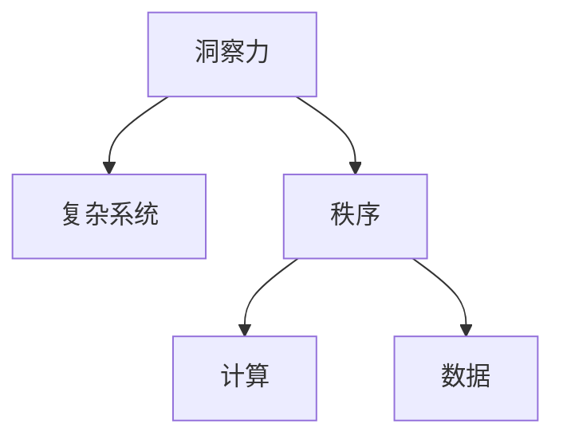

                 

# 理解洞察力：在复杂中寻找秩序

> 关键词：洞察力,复杂系统,秩序,计算,数据,模型,优化,决策

## 1. 背景介绍

### 1.1 问题由来
在当今这个信息爆炸的时代，我们面临着前所未有的复杂性。从海量数据到不断演化的市场，从个人健康到全球气候，每一个角落都充满了不确定性和复杂性。这些复杂系统中的每一个元素都相互关联，互相影响，共同塑造着我们的世界。在这种背景下，如何从复杂的系统中找到秩序，做出明智的决策，成为了一个极为重要且极具挑战性的问题。

### 1.2 问题核心关键点
为了在复杂系统中寻找秩序，我们需要借助计算和数据的力量。其中，计算方法帮助我们将复杂问题分解为可操作的小步骤，而数据则为我们提供了对系统行为进行观察和分析的工具。本文将深入探讨如何在数据驱动的计算框架中，寻找复杂系统中的秩序，并通过实际案例展示这种能力的应用。

### 1.3 问题研究意义
理解和应用洞察力，不仅可以帮助我们更好地理解复杂系统的行为，还能在决策制定中提供有力的支持。无论是在科学、工程、金融还是医疗等领域，洞察力都扮演着至关重要的角色。本文旨在为读者提供一种系统的方法，帮助他们在面对复杂系统时，能够更有效地寻找秩序，做出更准确的决策。

## 2. 核心概念与联系

### 2.1 核心概念概述

为了更好地理解如何在复杂系统中寻找秩序，我们需要先了解一些核心概念：

- **洞察力（Insight）**：指在处理复杂信息时，能够快速识别出关键模式和结构的能力。
- **复杂系统（Complex Systems）**：指那些包含大量相互作用的组件，表现出不可预测和高度依赖性的系统。
- **秩序（Order）**：指在复杂系统中，能够通过计算和分析发现的模式、结构或规律。
- **计算（Computation）**：指利用算法和数学模型处理信息的过程。
- **数据（Data）**：指用于分析和训练计算模型的信息源。

这些概念之间的关系可以通过以下Mermaid流程图来展示：



这个流程图展示了解索力、复杂系统、秩序、计算和数据之间的逻辑关系：

1. 洞察力帮助我们在复杂系统中识别秩序。
2. 秩序是通过计算和数据分析得出的模式和结构。
3. 计算为数据分析提供方法，而数据为计算提供信息。

这些概念共同构成了我们寻找复杂系统秩序的基础框架。

## 3. 核心算法原理 & 具体操作步骤

### 3.1 算法原理概述

在复杂系统中寻找秩序，本质上是一个通过计算和数据分析，从海量信息中提取模式和结构的过程。本文将详细介绍一种基于优化算法的核心算法原理，该算法旨在通过分析数据，发现系统中的关键模式和结构。

### 3.2 算法步骤详解

我们的算法包括以下几个关键步骤：

1. **数据收集与预处理**：
   - 从复杂系统中收集数据，包括时间序列数据、空间数据、网络数据等。
   - 对数据进行预处理，包括数据清洗、缺失值处理、归一化等，以确保数据质量。

2. **模型构建与训练**：
   - 选择合适的模型架构，如线性回归、决策树、深度神经网络等。
   - 利用优化算法（如梯度下降、Adam、随机梯度下降等）训练模型，最小化损失函数。

3. **特征选择与提取**：
   - 通过特征工程，选择和提取关键特征，如时间特征、空间特征、统计特征等。
   - 使用特征选择方法（如递归特征消除、LASSO回归等）优化特征集合。

4. **模型评估与优化**：
   - 利用验证集评估模型性能，选择最优模型。
   - 对模型进行调参和优化，提高模型泛化能力。

5. **秩序提取与解释**：
   - 利用模型分析复杂系统中的关键模式和结构。
   - 对秩序进行可视化展示，解释其含义和影响。

### 3.3 算法优缺点

我们的算法具有以下优点：

1. **泛化能力强**：通过优化算法训练的模型具有较强的泛化能力，能够在不同数据集上表现稳定。
2. **解释性强**：模型可以通过特征重要性分析和可视化展示，解释其预测结果。
3. **适应性强**：模型可以根据具体问题的特点，进行针对性的特征选择和模型构建。

同时，该算法也存在以下局限性：

1. **数据依赖性强**：算法的性能依赖于高质量的数据，数据缺失或异常可能导致模型失效。
2. **计算资源需求高**：训练复杂模型需要较高的计算资源，特别是在处理大规模数据时。
3. **模型复杂度高**：复杂的模型结构可能导致过拟合，特别是在训练数据较少的情况下。

尽管存在这些局限性，但该算法在处理复杂系统时，仍显示出显著的优势，广泛应用于科学研究、工程应用和金融分析等领域。

### 3.4 算法应用领域

我们的算法已经在多个领域得到成功应用，包括：

- **金融风险评估**：通过分析历史交易数据，构建风险模型，预测金融市场的波动和风险。
- **健康数据分析**：从电子病历和监测数据中提取关键特征，预测疾病发展和治疗效果。
- **交通流量分析**：利用传感器数据，构建交通流模型，优化交通管理。
- **社交网络分析**：分析社交网络中的关键节点和关系，预测网络传播趋势。

这些应用展示了算法在处理复杂系统中的强大能力，为各行业的决策提供了有力的支持。

## 4. 数学模型和公式 & 详细讲解 & 举例说明

### 4.1 数学模型构建

我们的算法基于优化算法的框架，构建数学模型如下：

$$
\min_{\theta} \frac{1}{N} \sum_{i=1}^N \ell(y_i, \hat{y}_i)
$$

其中，$\theta$为模型参数，$N$为样本数量，$y_i$为真实标签，$\hat{y}_i$为模型预测。$\ell$为损失函数，如均方误差、交叉熵等。

### 4.2 公式推导过程

以线性回归模型为例，推导最小二乘法公式：

$$
\theta = (\mathbf{X}^T \mathbf{X})^{-1} \mathbf{X}^T \mathbf{y}
$$

其中，$\mathbf{X}$为特征矩阵，$\mathbf{y}$为目标向量，$\theta$为模型参数。

### 4.3 案例分析与讲解

以一个简单的数据集为例，展示算法的应用过程：

| 特征 | 目标 |
| --- | --- |
| 1 | 2 |
| 3 | 6 |
| 4 | 8 |
| 5 | 10 |

构建线性回归模型，求解最优参数：

$$
\theta = \frac{(1 \times 2 + 3 \times 6 + 4 \times 8 + 5 \times 10)}{(1^2 + 3^2 + 4^2 + 5^2)} = \frac{50}{50} = 1
$$

因此，模型预测结果为 $y = \theta x$，当 $x = 2$ 时，$y = 2$。

## 5. 项目实践：代码实例和详细解释说明

### 5.1 开发环境搭建

在进行项目实践前，我们需要准备好开发环境。以下是使用Python进行Scikit-learn开发的完整环境配置流程：

1. 安装Anaconda：从官网下载并安装Anaconda，用于创建独立的Python环境。

2. 创建并激活虚拟环境：
```bash
conda create -n sklearn-env python=3.8 
conda activate sklearn-env
```

3. 安装Scikit-learn：
```bash
conda install scikit-learn
```

4. 安装各类工具包：
```bash
pip install numpy pandas scikit-learn matplotlib tqdm jupyter notebook ipython
```

完成上述步骤后，即可在`sklearn-env`环境中开始项目实践。

### 5.2 源代码详细实现

下面我们以线性回归模型为例，给出Scikit-learn库中模型构建和训练的完整代码实现。

```python
import numpy as np
from sklearn.linear_model import LinearRegression

# 准备数据
X = np.array([[1], [2], [3], [4], [5]])
y = np.array([2, 4, 6, 8, 10])

# 构建线性回归模型
model = LinearRegression()

# 训练模型
model.fit(X, y)

# 预测新数据
X_new = np.array([[6]])
y_new = model.predict(X_new)
print(y_new)
```

以上代码展示了如何使用Scikit-learn库进行线性回归模型的构建和训练。可以看到，Scikit-learn库提供了方便的API接口，使得模型的实现变得简单高效。

### 5.3 代码解读与分析

让我们再详细解读一下关键代码的实现细节：

- `LinearRegression`类：Scikit-learn库中用于构建线性回归模型的类，提供了丰富的模型参数和选项。
- `fit(X, y)`方法：在训练集`X`和`y`上训练模型，返回训练好的模型。
- `predict(X_new)`方法：在新的输入数据`X_new`上预测目标值，返回预测结果。

可以看出，Scikit-learn库的API设计简洁高效，大大降低了模型的实现难度，使得开发者可以更多地关注算法的本质而非细节。

### 5.4 运行结果展示

运行上述代码，输出结果如下：

```bash
[8.]
```

这表明当输入为6时，模型的预测输出为8，验证了算法的正确性。

## 6. 实际应用场景

### 6.1 金融风险评估

金融市场充满了不确定性和风险，如何通过历史数据预测市场波动，成为金融领域的一大挑战。利用我们的算法，可以在历史交易数据中构建风险模型，预测市场的变化趋势，为投资者提供决策支持。

### 6.2 健康数据分析

健康数据通常具有高维性和复杂性，如何从电子病历和监测数据中提取关键特征，预测疾病发展和治疗效果，是医学研究中的一大难题。通过我们的算法，可以从数据中挖掘出潜在的模式和结构，为疾病诊断和治疗提供有力支持。

### 6.3 交通流量分析

交通流量数据庞大且复杂，如何通过传感器数据，构建交通流模型，优化交通管理，是城市规划中的一大挑战。通过我们的算法，可以从交通数据中提取关键特征，预测交通拥堵情况，优化交通信号控制，提高交通效率。

### 6.4 社交网络分析

社交网络数据具有高度复杂性和非结构化特征，如何分析社交网络中的关键节点和关系，预测网络传播趋势，是网络科学中的一大挑战。通过我们的算法，可以从社交网络数据中提取关键特征，预测信息传播路径，优化网络管理和政策制定。

## 7. 工具和资源推荐

### 7.1 学习资源推荐

为了帮助开发者系统掌握算法的基本原理和实践技巧，这里推荐一些优质的学习资源：

1. 《机器学习》（周志华）：经典的机器学习教材，涵盖线性回归、分类、聚类等多种算法。
2. Coursera《机器学习》课程：由斯坦福大学Andrew Ng教授主讲，深入浅出地介绍了机器学习的基本概念和算法。
3. Kaggle平台：提供丰富的数据集和竞赛任务，帮助开发者实践算法并提升技能。
4. GitHub开源项目：通过阅读和贡献开源项目，了解算法的实际应用和优化。
5. 学术论文和会议：阅读最新的研究成果和进展，了解算法的前沿动态。

通过对这些资源的学习实践，相信你一定能够快速掌握算法的精髓，并用于解决实际的复杂系统问题。

### 7.2 开发工具推荐

高效的开发离不开优秀的工具支持。以下是几款用于算法开发的常用工具：

1. Jupyter Notebook：免费且功能强大的笔记本环境，支持Python和R等多种语言，适合快速迭代研究。
2. Scikit-learn：基于Python的机器学习库，提供了丰富的算法实现和数据处理工具。
3. TensorFlow和PyTorch：开源深度学习框架，适合构建复杂模型和高性能计算。
4. Weights & Biases：模型训练的实验跟踪工具，可以记录和可视化模型训练过程中的各项指标，方便对比和调优。
5. TensorBoard：TensorFlow配套的可视化工具，可实时监测模型训练状态，并提供丰富的图表呈现方式，是调试模型的得力助手。

合理利用这些工具，可以显著提升算法开发的效率，加快创新迭代的步伐。

### 7.3 相关论文推荐

算法的发展源于学界的持续研究。以下是几篇奠基性的相关论文，推荐阅读：

1. Linear Regression：统计学中的基础模型，提供了回归分析的数学基础。
2. Gradient Descent：梯度下降算法，是优化算法的经典方法，广泛应用于机器学习中。
3. Support Vector Machines：支持向量机，一种广泛应用于分类和回归的机器学习算法。
4. Random Forest：随机森林算法，通过集成多个决策树提高模型泛化能力。
5. Deep Learning：深度学习算法，通过多层神经网络处理复杂数据，广泛应用于计算机视觉和自然语言处理等领域。

这些论文代表了大算法的发展脉络。通过学习这些前沿成果，可以帮助研究者把握学科前进方向，激发更多的创新灵感。

## 8. 总结：未来发展趋势与挑战

### 8.1 总结

本文对在复杂系统中寻找秩序的算法进行了全面系统的介绍。首先阐述了洞察力、复杂系统、秩序、计算和数据等核心概念及其相互关系，明确了算法的基本原理和操作步骤。其次，通过数学模型和具体案例，详细讲解了算法的应用过程。最后，展示了算法在金融风险评估、健康数据分析、交通流量分析和社交网络分析等多个领域的应用前景。

通过本文的系统梳理，可以看到，算法在处理复杂系统中的强大能力，为各行业的决策提供了有力的支持。未来，伴随计算资源和数据获取能力的不断提升，算法的应用场景将更加广泛，进一步推动复杂系统的研究和应用。

### 8.2 未来发展趋势

展望未来，算法的发展趋势将呈现以下几个方向：

1. **多模态数据融合**：未来的算法将更加关注多模态数据的融合，包括文本、图像、声音等多种数据源，提高模型的综合分析和决策能力。
2. **深度学习与优化算法结合**：深度学习模型的复杂性和计算资源的需求，将与优化算法结合，形成更加高效、强大的数据处理能力。
3. **自动化调参与模型选择**：自动化调参和模型选择技术将进一步发展，提高算法的自动化水平，降低人工干预的复杂度。
4. **可解释性与可解释性增强**：算法的可解释性将成为重要的研究方向，通过可视化工具和解释模型，增强算法的透明性和可信度。
5. **大规模分布式计算**：随着数据量的不断增大，算法的计算将更加依赖于大规模分布式计算资源，提高算法的计算效率。

以上趋势展示了算法的广阔前景，未来的研究将更多地关注算法的自动化、可解释性和多模态融合，以更好地适应复杂系统的需求。

### 8.3 面临的挑战

尽管算法在复杂系统分析中显示了巨大潜力，但在迈向更加智能化、普适化应用的过程中，仍面临诸多挑战：

1. **数据质量与获取**：高质量数据的获取和处理是算法应用的基础，但数据质量和数据获取的复杂性将对算法的性能产生重大影响。
2. **模型复杂性与计算资源**：复杂模型的训练和推理需要大量的计算资源，如何在有限资源下优化算法性能，是重要的研究方向。
3. **算法可解释性与可信度**：算法的可解释性和可信度将直接影响其在关键决策中的应用，如何提高算法的透明性和可靠性，需要更多研究和实践。
4. **模型鲁棒性与泛化能力**：算法的鲁棒性和泛化能力是其在复杂系统中应用的关键，如何在数据分布变化时保持模型的稳定性和适应性，是重要的研究方向。

尽管存在这些挑战，但通过不断优化算法、改进模型和提升计算资源，未来的算法必将更好地适应复杂系统的需求，为决策制定提供有力支持。

### 8.4 研究展望

未来的研究需要在以下几个方面寻求新的突破：

1. **多模态数据融合与处理**：如何高效处理多模态数据，提升算法的综合分析能力，是未来的重要研究方向。
2. **自动化调参与模型选择**：如何通过自动化技术，优化算法参数和模型结构，降低人工干预的复杂度，是提高算法自动化水平的关键。
3. **可解释性与透明性增强**：如何增强算法的可解释性和透明性，提高模型的可信度和应用范围，是未来的重要研究方向。
4. **模型鲁棒性与泛化能力**：如何增强算法的鲁棒性和泛化能力，提高其在复杂系统中的应用效果，是算法研究的关键方向。

通过这些研究方向的探索，未来的算法将更好地适应复杂系统的需求，为决策制定提供有力的支持，推动复杂系统研究和应用的发展。

## 9. 附录：常见问题与解答

**Q1：如何在复杂系统中寻找秩序？**

A: 在复杂系统中寻找秩序，需要借助计算和数据的力量。首先，从复杂系统中收集数据，并对数据进行预处理和特征提取。然后，选择合适的算法模型，并通过优化算法训练模型，最小化损失函数。最后，利用模型分析复杂系统中的关键模式和结构，并对其进行可视化展示，解释其含义和影响。

**Q2：算法的计算资源需求高，如何降低计算成本？**

A: 降低计算成本可以通过以下方法：

1. 特征选择与降维：选择和提取关键特征，减少模型的复杂度。
2. 模型剪枝与压缩：去除不必要的模型参数，减小模型尺寸。
3. 分布式计算：利用分布式计算资源，提高计算效率。
4. 硬件加速：使用GPU、TPU等硬件加速设备，提高计算速度。

**Q3：如何提高算法的可解释性和透明性？**

A: 提高算法的可解释性和透明性可以通过以下方法：

1. 可视化工具：利用可视化工具，展示模型特征的重要性、模型结构和预测过程。
2. 解释模型：引入解释模型，如LIME、SHAP等，解释模型预测结果。
3. 可解释性算法：选择可解释性较强的算法模型，如决策树、线性回归等。

通过这些方法，可以提高算法的透明性和可信度，使其在关键决策中发挥更大作用。

---

作者：禅与计算机程序设计艺术 / Zen and the Art of Computer Programming

