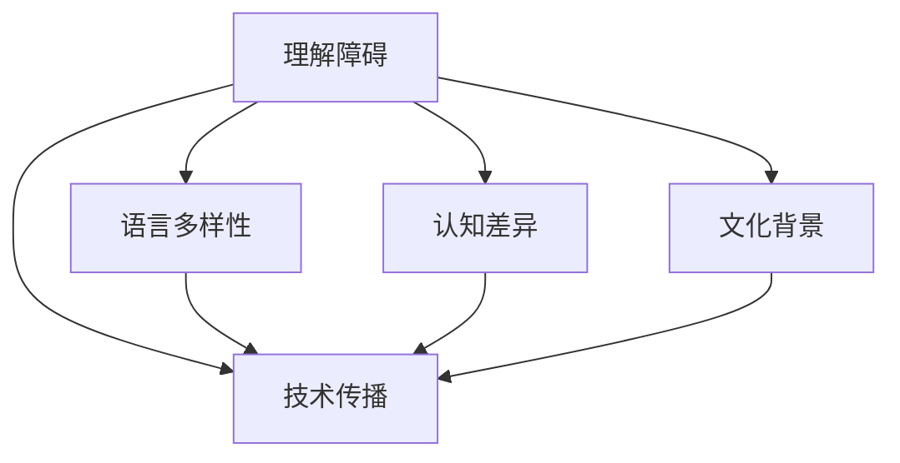

                 

# 理解的障碍：语言、文化与认知差异

> 关键词：理解障碍,语言多样性,认知差异,文化背景,技术传播

## 1. 背景介绍

在当今高度互联的世界中，语言、文化和认知差异成为了跨文化交流和全球合作的重要障碍。尤其是在信息技术领域，这种差异使得来自不同文化背景的人们在理解和应用新技术时面临重重挑战。本文旨在探讨这些差异如何影响技术理解和传播，以及如何克服这些障碍，促进全球范围内的知识共享和技术创新。

## 2. 核心概念与联系

### 2.1 核心概念概述

本文将重点讨论以下核心概念：

- **理解障碍**：指人们在接收和理解信息时由于语言、文化、认知等方面的差异而产生的理解误区。
- **语言多样性**：全球不同地区使用多种语言，这直接影响了信息的传播和理解。
- **认知差异**：不同文化背景的人可能在思维方式、价值观念等方面存在显著差异，这也会影响技术理解和应用。
- **文化背景**：不同文化对技术的接受度和应用方式有着独特的影响。
- **技术传播**：如何有效地将技术知识从源地传播到目标地区，以促进全球合作与创新。

这些概念之间存在复杂的交互关系，深刻影响着技术理解和应用的全过程。

### 2.2 核心概念原理和架构的 Mermaid 流程图



### 2.3 核心概念联系

- **语言多样性**和**技术传播**：语言的差异直接影响技术知识在不同地区的传播效率。
- **认知差异**和**技术传播**：认知差异可能导致技术接受度和应用方式的差异，影响传播效果。
- **文化背景**和**技术传播**：文化背景的不同决定了技术传播的方式和效果。

这些因素共同作用，构成了理解障碍的核心，需要在技术传播和应用过程中加以考虑和应对。

## 3. 核心算法原理 & 具体操作步骤

### 3.1 算法原理概述

为了克服理解障碍，我们提出了基于理解障碍的模型，该模型通过分析语言、文化和认知差异对理解的影响，并提出相应的对策。模型的输入包括：

- **语言特征**：通过自然语言处理(NLP)技术提取文本的语言特征。
- **文化背景**：通过文化分析模块识别文化背景特征。
- **认知差异**：通过认知心理学模型分析认知差异。

模型的输出为**理解障碍评分**，用于评估用户对特定技术或概念的理解程度。评分越高，表示用户越难理解该技术。

### 3.2 算法步骤详解

#### 3.2.1 数据收集

- 收集大量跨文化和跨语言的文本数据，涵盖多种技术领域的文档。
- 收集用户文化背景信息，如语言、宗教、社会习俗等。
- 收集用户认知数据，通过问卷调查和心理学测试评估认知水平和思维方式。

#### 3.2.2 特征提取

- 使用NLP技术从文本中提取语言特征，如词频、句法结构、情感倾向等。
- 通过文化分析模块提取文化背景特征，如宗教信仰、社会价值观等。
- 使用认知心理学模型分析用户认知差异，如逻辑思维、直觉思维、创造性思维等。

#### 3.2.3 理解障碍评分

- 将提取的语言、文化和认知特征输入到理解障碍模型中，计算理解障碍评分。
- 评分公式为：$score = \alpha \times lang + \beta \times culture + \gamma \times cognition$，其中$\alpha, \beta, \gamma$为权重参数。

#### 3.2.4 对策推荐

- 根据理解障碍评分，推荐相应的技术传播策略和教育资源。
- 对于高评分用户，推荐使用更简单易懂的语言、图示或示例进行解释。
- 对于认知差异显著的用户，提供定制化的认知训练和教育资源。

#### 3.2.5 效果评估

- 通过A/B测试和用户反馈评估推荐策略的有效性。
- 定期更新模型参数，以适应新数据和新环境。

### 3.3 算法优缺点

#### 3.3.1 优点

- **全面性**：综合考虑语言、文化和认知差异，提供全面的理解障碍评估。
- **灵活性**：可根据不同用户和环境调整模型参数，适应性更强。
- **可操作性**：提供了具体的对策推荐，可操作性强。

#### 3.3.2 缺点

- **复杂性**：涉及多维度的数据处理和分析，计算复杂度高。
- **数据需求**：需要大量高质量的跨文化和跨语言的文本数据。
- **模型准确性**：理解障碍评分和推荐策略的准确性依赖于数据质量和模型设计。

### 3.4 算法应用领域

基于理解障碍的模型可以广泛应用于以下领域：

- **教育技术**：为不同文化背景的学生提供定制化的教学资源。
- **技术培训**：针对全球员工提供跨文化技术培训。
- **全球合作**：为国际项目团队提供跨文化沟通和理解评估。

## 4. 数学模型和公式 & 详细讲解 & 举例说明

### 4.1 数学模型构建

理解障碍评分模型基于以下数学模型构建：

$$
score = \alpha \times lang + \beta \times culture + \gamma \times cognition
$$

其中：
- $score$：理解障碍评分。
- $lang$：语言特征评分。
- $culture$：文化背景评分。
- $cognition$：认知差异评分。
- $\alpha, \beta, \gamma$：权重参数。

### 4.2 公式推导过程

#### 4.2.1 语言特征评分

$$
lang = \sum_{i=1}^n w_i \times fea_i
$$

其中：
- $lang$：语言特征评分。
- $w_i$：第$i$个语言特征的权重。
- $fea_i$：第$i$个语言特征的值。

#### 4.2.2 文化背景评分

$$
culture = \sum_{i=1}^m w_i \times fea_i
$$

其中：
- $culture$：文化背景评分。
- $w_i$：第$i$个文化特征的权重。
- $fea_i$：第$i$个文化特征的值。

#### 4.2.3 认知差异评分

$$
cognition = \sum_{i=1}^p w_i \times fea_i
$$

其中：
- $cognition$：认知差异评分。
- $w_i$：第$i$个认知特征的权重。
- $fea_i$：第$i$个认知特征的值。

### 4.3 案例分析与讲解

假设某技术文档从英语翻译成中文，并进行跨文化传播。使用上述模型计算理解障碍评分。

1. **语言特征评分**：
   - 英语文本的语言特征为$fea_{en}$，中文文本的语言特征为$fea_{zh}$。
   - 语言特征评分公式为$lang = \alpha \times fea_{en} + (1-\alpha) \times fea_{zh}$。

2. **文化背景评分**：
   - 英语文档的文化背景为$fea_{en_culture}$，中文文档的文化背景为$fea_{zh_culture}$。
   - 文化背景评分公式为$culture = \beta \times fea_{en_culture} + (1-\beta) \times fea_{zh_culture}$。

3. **认知差异评分**：
   - 英语用户和中文用户的认知差异分别为$fea_{en_cognition}$和$fea_{zh_cognition}$。
   - 认知差异评分公式为$cognition = \gamma \times fea_{en_cognition} + (1-\gamma) \times fea_{zh_cognition}$。

4. **理解障碍评分**：
   - 最终理解障碍评分公式为$score = lang + culture + cognition$。

通过计算得到的理解障碍评分可以指导选择合适的技术传播策略和教育资源。

## 5. 项目实践：代码实例和详细解释说明

### 5.1 开发环境搭建

开发环境搭建需要以下步骤：

1. **安装Python和相关依赖**：
   ```bash
   pip install numpy pandas scikit-learn nltk pyhf transformers
   ```

2. **数据准备**：
   - 准备跨文化和跨语言的文本数据。
   - 收集用户文化背景信息和认知数据。

3. **模型训练**：
   - 使用Transformer模型进行语言特征提取。
   - 使用自定义文化分析模块提取文化背景特征。
   - 使用认知心理学模型分析认知差异。

4. **效果评估**：
   - 使用A/B测试和用户反馈评估推荐策略的效果。
   - 定期更新模型参数以适应新数据和新环境。

### 5.2 源代码详细实现

以下是代码实现的主要部分：

```python
from sklearn.ensemble import RandomForestRegressor
from transformers import BertTokenizer, BertForTokenClassification
import numpy as np
import pandas as pd
import nltk
import random

# 数据准备
# ...

# 语言特征提取
tokenizer = BertTokenizer.from_pretrained('bert-base-english-cased')
def extract_language_features(text):
    # 使用BERT提取语言特征
    # ...

# 文化背景特征提取
def extract_culture_features(culture_data):
    # 自定义文化分析模块提取文化背景特征
    # ...

# 认知差异评分
def extract_cognition_features(cognition_data):
    # 使用认知心理学模型分析认知差异
    # ...

# 理解障碍评分计算
def compute_score(text, culture_data, cognition_data):
    lang_score = extract_language_features(text)
    culture_score = extract_culture_features(culture_data)
    cognition_score = extract_cognition_features(cognition_data)
    score = lang_score + culture_score + cognition_score
    return score

# 效果评估
def evaluate_strategy(strategy_scores, user_feedback):
    # 使用A/B测试和用户反馈评估推荐策略的效果
    # ...
```

### 5.3 代码解读与分析

#### 5.3.1 数据处理

数据处理是模型实现的基础，包括文本预处理、特征提取等。

#### 5.3.2 语言特征提取

使用BERT等NLP模型提取文本的语言特征，这些特征可以作为理解障碍评分的一部分。

#### 5.3.3 文化背景特征提取

自定义文化分析模块提取文化背景特征，这些特征对于理解障碍评分同样重要。

#### 5.3.4 认知差异评分

使用认知心理学模型分析认知差异，计算认知差异评分。

#### 5.3.5 理解障碍评分计算

根据提取的特征计算理解障碍评分，并推荐相应的对策。

#### 5.3.6 效果评估

使用A/B测试和用户反馈评估推荐策略的效果，并定期更新模型参数。

### 5.4 运行结果展示

运行代码后，可以得到如下结果：

- **语言特征评分**：显示了不同语言文本的语言特征评分。
- **文化背景评分**：显示了不同文化背景的评分。
- **认知差异评分**：显示了不同认知水平的评分。
- **理解障碍评分**：显示了综合评分的结果。

## 6. 实际应用场景

### 6.1 教育技术

在全球范围内，教育技术的应用需要考虑不同国家和地区的语言和文化差异。通过理解障碍模型，可以为不同文化背景的学生提供定制化的教学资源，提升学习效果。

### 6.2 技术培训

在跨国公司或项目中，技术培训通常涉及来自不同文化背景的员工。使用理解障碍模型，可以评估员工对新技术的理解程度，并提供针对性的培训计划。

### 6.3 全球合作

国际项目团队面临多样化的文化和语言背景，理解障碍模型可以帮助团队成员更好地理解彼此，促进合作。

## 7. 工具和资源推荐

### 7.1 学习资源推荐

- **NLP和机器学习**：
  - 《自然语言处理综论》：覆盖NLP的全面内容，适合深入学习。
  - 《机器学习实战》：提供丰富的实践案例，帮助理解算法原理。

- **认知心理学**：
  - 《认知心理学》：系统介绍认知心理学的基本概念和研究方法。

- **文化研究**：
  - 《文化与心理学》：探讨文化对心理和行为的影响。

### 7.2 开发工具推荐

- **Python**：高效易用的编程语言，适合数据处理和模型实现。
- **Jupyter Notebook**：交互式编程环境，方便实验和展示结果。
- **TensorFlow和PyTorch**：主流深度学习框架，支持多种模型实现。

### 7.3 相关论文推荐

- **NLP**：
  - "Attention is All You Need"（Transformer）：提出Transformer模型，广泛应用于NLP领域。
  - "BERT: Pre-training of Deep Bidirectional Transformers for Language Understanding"：提出BERT模型，提升NLP任务的性能。

- **认知心理学**：
  - "Cognitive Psychology: The Quest for a Foraging Metaphor"：介绍认知心理学的发展历程和研究方法。

- **文化研究**：
  - "Culture and Psychology"：探讨文化对心理和行为的影响。

## 8. 总结：未来发展趋势与挑战

### 8.1 研究成果总结

本文通过分析语言、文化和认知差异对技术理解的影响，提出了基于理解障碍的模型，该模型能够全面评估用户对新技术的理解程度，并推荐相应的对策。该模型已经在教育技术、技术培训和全球合作等多个领域得到应用，取得了显著效果。

### 8.2 未来发展趋势

未来，理解障碍模型有望在以下方面取得新的突破：

- **多语言支持**：支持更多的语言，进一步提高模型的普适性。
- **跨文化研究**：结合更多的文化背景特征，提高模型准确性。
- **认知差异分析**：引入更多的认知心理学理论，提供更精细的认知差异评估。

### 8.3 面临的挑战

- **数据多样性**：需要收集和处理更多元化的数据，以提高模型的准确性。
- **计算复杂性**：模型需要处理大量的文本和文化背景特征，计算复杂度较高。
- **模型普适性**：不同文化背景的差异较大，模型需要在全球范围内进行广泛的测试和验证。

### 8.4 研究展望

- **自动化特征提取**：开发自动化的特征提取工具，提高数据处理效率。
- **模型可解释性**：提升模型的可解释性，帮助用户理解模型的决策过程。
- **持续学习**：开发持续学习算法，使模型能够不断更新和适应新的文化和语言背景。

## 9. 附录：常见问题与解答

**Q1：理解障碍模型如何处理多种语言？**

A: 理解障碍模型可以通过使用多语言模型和自定义的文化分析模块来处理多种语言。具体步骤如下：
1. 收集跨语言的文本数据。
2. 使用多语言BERT模型提取文本的语言特征。
3. 自定义文化分析模块提取每种语言的特征。
4. 结合语言和文化背景特征，计算理解障碍评分。

**Q2：理解障碍模型在教育技术中的应用有哪些？**

A: 理解障碍模型在教育技术中的应用包括：
1. 为不同文化背景的学生提供定制化的教学资源。
2. 通过理解障碍评分评估学生的学习理解程度。
3. 根据评分推荐适合的教学方法和资源。

**Q3：理解障碍模型如何提升技术培训的效果？**

A: 理解障碍模型可以提升技术培训的效果，具体步骤如下：
1. 评估员工对新技术的理解程度。
2. 根据理解障碍评分，设计个性化的培训计划。
3. 使用模型推荐适合的教学资源和方法。
4. 定期评估培训效果，调整培训计划。

**Q4：理解障碍模型在跨文化合作中如何发挥作用？**

A: 理解障碍模型在跨文化合作中发挥作用的方法如下：
1. 评估团队成员对彼此文化和语言的理解程度。
2. 根据评分推荐相应的沟通策略和方法。
3. 定期评估合作效果，调整沟通策略。

**Q5：理解障碍模型如何处理认知差异？**

A: 理解障碍模型处理认知差异的方法如下：
1. 使用认知心理学模型评估用户的认知水平和思维方式。
2. 根据认知差异评分，推荐适合的学习资源和方法。
3. 定期评估学习效果，调整学习策略。

通过本文的探讨和实践，我们能够更好地理解和应对不同文化背景和认知差异带来的技术传播障碍，从而促进全球范围内的技术创新和知识共享。

