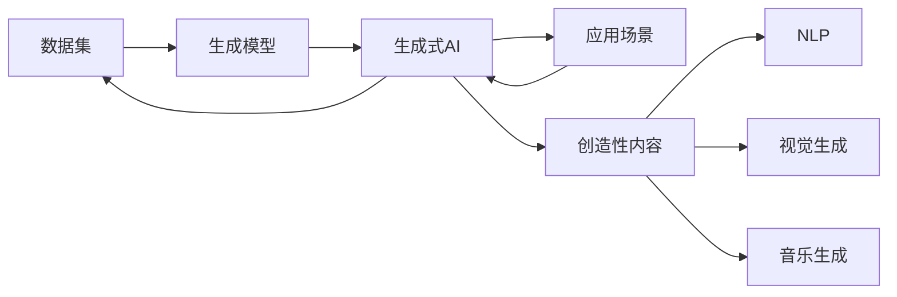

                 

# 生成式人工智能的优势：创造性内容

> 关键词：生成式AI, 创造性内容, 深度学习, 神经网络, 生成模型, 自然语言处理, 视觉生成, 音乐生成

## 1. 背景介绍

在人工智能领域，生成式AI (Generative AI) 技术正逐渐崭露头角，展现其独特的创造力和应用潜力。传统的人工智能多聚焦于决策和预测，而生成式AI则致力于生成全新的、具有创造性的内容，如文本、图像、音频等。这种技术不仅能生成高度逼真的模拟数据，还能创作艺术作品、音乐、电影剧情等，甚至在某些场景下，生成式AI还能超越人类创造力的界限。

### 1.1 问题由来
随着深度学习技术的发展，尤其是神经网络的成熟，生成式AI逐步成为了人工智能领域的热门话题。早期的生成模型多依赖于简单的统计模型，而如今，基于深度学习框架的生成式AI已经能够学习复杂的数据分布，生成高质量的、具有创造性的内容。这一技术的进步，为艺术创作、内容生成、数据分析等领域带来了革命性的变革。

### 1.2 问题核心关键点
生成式AI的核心在于其强大的生成能力。生成式AI通过学习数据分布，能够随机生成符合特定分布的新样本，这些样本在形式上、内容上都可能具有创新性。它的主要优点包括：

- **创新性**：能够创作出独特的、前所未有的内容。
- **多样性**：在特定数据分布下，生成多样化的、具有变异性质的样本。
- **实时性**：一旦模型训练完成，可以实时生成内容，适应各种应用场景。

然而，生成式AI也面临一些挑战：如生成内容的合理性、真实性、多样性、质量等。此外，模型的可解释性、安全性、公平性等问题也是研究者关注的焦点。

### 1.3 问题研究意义
研究生成式AI技术的创新性和应用前景，对于推动人工智能的广泛应用、促进创新文化的发展、优化数据生成方式、提升内容创作效率等具有重要意义：

1. **推动技术发展**：生成式AI技术的发展为人工智能领域注入了新的活力，推动了深度学习、自然语言处理、计算机视觉等领域的进步。
2. **促进创新文化**：生成式AI能够创作出新颖的、具有个性化的内容，为文化产业带来新的创作模式，激发更多创新灵感。
3. **优化数据生成**：生成式AI可以用于生成模拟数据，提高数据质量，降低数据标注成本，助力数据驱动的研究和应用。
4. **提升创作效率**：生成式AI可以辅助艺术家、编剧、设计师等进行内容创作，提高创作效率，降低创作门槛。

## 2. 核心概念与联系

### 2.1 核心概念概述

为了更好地理解生成式AI技术，我们首先介绍几个关键概念：

- **生成式AI**：指使用机器学习技术生成全新的、具有创新性的数据，如文本、图像、音频等。
- **创造性内容**：指通过AI技术生成的，具有创新性、个性化、多样化特征的内容，能够满足特定场景下的需求。
- **深度学习**：一种基于神经网络的机器学习方法，通过学习数据分布生成新样本。
- **神经网络**：生成式AI的核心组成部分，能够学习复杂的数据分布，生成高质量的内容。
- **生成模型**：包括变分自编码器(VAE)、生成对抗网络(GAN)、语言模型等，是生成式AI的核心技术。
- **自然语言处理(NLP)**：涉及文本数据的生成、理解和生成等，是生成式AI的一个重要应用领域。
- **视觉生成**：使用生成式AI生成图像、视频等视觉内容，是AI艺术和娱乐产业的重要分支。
- **音乐生成**：通过生成式AI创作新的音乐作品，推动音乐创作的新形式。

这些概念之间通过数据流、模型结构、应用场景等紧密联系在一起，共同构成了生成式AI的技术体系和应用框架。

### 2.2 核心概念原理和架构的 Mermaid 流程图

以下是一个简单的Mermaid流程图，展示了生成式AI的总体架构及其与各核心概念的联系：



这个流程图表明：
1. 数据集是生成式AI的基础，提供学习和生成的依据。
2. 生成模型是核心组件，学习数据分布并生成新样本。
3. 生成式AI通过生成模型产生创造性内容，适用于多种应用场景。
4. 创造性内容包括文本、图像、音乐等多种形式，能够满足不同领域的需要。
5. 自然语言处理、视觉生成、音乐生成等应用场景分别对创造性内容进行不同形式的加工和输出。

## 3. 核心算法原理 & 具体操作步骤

### 3.1 算法原理概述

生成式AI的核心原理是利用机器学习模型学习数据分布，并生成符合该分布的新样本。这一过程通常基于深度学习框架，尤其是神经网络模型，能够捕捉数据中的复杂关系，生成高质量的创新性内容。

形式化地，假设数据集为 $D=\{x_1,...,x_n\}$，其中 $x_i \in \mathcal{X}$，$\mathcal{X}$ 为样本空间。生成模型为 $G_\theta$，参数 $\theta \in \mathbb{R}^d$。生成式AI的目标是找到最优参数 $\theta^*$，使得 $G_{\theta^*}$ 生成的样本 $G_{\theta^*}(x)$ 与数据集 $D$ 具有相似的分布，即满足：

$$
P(G_{\theta^*}(x)) \approx P(x)
$$

其中 $P$ 表示概率分布。通过最大似然估计等方法，优化参数 $\theta$ 最小化模型输出与真实数据之间的差异。

### 3.2 算法步骤详解

基于深度学习的生成式AI通常包括以下关键步骤：

**Step 1: 准备数据集**
- 收集和处理生成模型所需的数据集。数据集可以是文本、图像、音频等多种形式，需要满足一定量的数据需求。
- 对于文本数据，通常需要进行预处理，如分词、去停用词等。

**Step 2: 选择生成模型**
- 根据应用场景选择合适的生成模型。如文本生成通常使用语言模型，图像生成使用GAN等。
- 确定模型的结构和参数。深度学习模型一般包括卷积神经网络、循环神经网络、变分自编码器等。

**Step 3: 设计损失函数**
- 根据具体任务设计损失函数。如文本生成通常使用负对数似然损失，图像生成使用均方误差损失等。
- 损失函数的设计应能够最大化生成模型的似然，最小化与真实数据分布的差异。

**Step 4: 训练模型**
- 使用优化算法（如Adam、SGD等）和训练集对模型进行训练。优化算法通过计算梯度，更新模型参数，使得模型输出的样本分布与真实数据分布尽可能接近。
- 在训练过程中，应采用数据增强、正则化、对抗训练等策略，避免过拟合和提高泛化能力。

**Step 5: 评估与生成**
- 使用验证集和测试集评估模型性能。常用的评估指标包括KL散度、生成样本的似然等。
- 在评估通过后，模型可以用于生成新的样本。

### 3.3 算法优缺点

生成式AI的主要优点包括：
1. **创新性**：生成模型能够生成新的、具有创新性的内容，拓展了内容创作的边界。
2. **多样性**：通过调整模型参数，生成模型能够产生多样化的、变异性质的样本。
3. **实时性**：一旦模型训练完成，可以实时生成内容，适应各种应用场景。

然而，生成式AI也存在一些局限性：
1. **质量不稳定**：生成的内容质量受模型训练、超参数设置等因素影响，不稳定。
2. **真实性问题**：生成的内容有时可能缺乏真实性，需要后期人工审核。
3. **可解释性不足**：生成式AI的决策过程缺乏可解释性，难以理解和调试。
4. **安全性风险**：生成内容可能包含有害信息，需要严格控制和管理。
5. **伦理问题**：生成式AI可能复制、侵权他人作品，引发版权问题。

### 3.4 算法应用领域

生成式AI在多个领域得到了广泛应用，具体包括：

- **文本生成**：包括机器翻译、自然语言生成、对话系统等。生成式AI能够自动生成高质量的文本，适用于自动摘要、文本补全、智能写作等任务。
- **图像生成**：用于生成逼真的图像、视频、动画等，广泛应用于游戏、影视、广告等领域。
- **音乐生成**：创作新的音乐作品，推动音乐创作和音乐教育的发展。
- **艺术创作**：生成艺术作品，包括绘画、雕塑、建筑设计等，为艺术创作提供新的灵感。
- **虚拟现实**：生成虚拟场景和角色，提升虚拟现实体验的逼真度和互动性。
- **数据生成**：用于生成模拟数据，辅助数据驱动的研究和应用。

## 4. 数学模型和公式 & 详细讲解 & 举例说明

### 4.1 数学模型构建

在生成式AI中，常用的数学模型包括变分自编码器(VAE)和生成对抗网络(GAN)等。

**变分自编码器(VAE)**
- 输入数据 $x$，生成模型 $G_\theta$，潜在变量 $z$，编码器 $E_\phi$，解码器 $D_\theta$。
- VAE的目标是最小化重构损失 $L_{rec}$ 和潜变量分布损失 $L_{latent}$：
$$
L_{VAE} = L_{rec} + \beta L_{latent}
$$
其中 $L_{rec} = ||x - D_\theta(z)||^2$，$L_{latent} = \frac{1}{2}\mathbb{E}_q(D_\theta(z))||z||^2$。

**生成对抗网络(GAN)**
- 生成模型 $G_\theta$，判别模型 $D_\phi$。
- GAN的目标是最大化生成模型输出样本的似然，最小化生成样本与真实样本的差异：
$$
L_G = -\mathbb{E}_z \log D_\phi(G_\theta(z))
$$
$$
L_D = \mathbb{E}_x \log D_\phi(x) + \mathbb{E}_z \log (1 - D_\phi(G_\theta(z)))
$$
其中 $L_{G}$ 是生成器的损失函数，$L_{D}$ 是判别器的损失函数。

### 4.2 公式推导过程

以下是VAE和GAN的基本推导过程：

**VAE**
$$
\begin{aligned}
L_{rec} &= ||x - D_\theta(z)||^2 \\
&= ||x - D_\theta(E_\phi(x))||^2 \\
&= ||x - \hat{x}||^2
\end{aligned}
$$

**GAN**
$$
\begin{aligned}
L_G &= -\mathbb{E}_z \log D_\phi(G_\theta(z)) \\
&= -\int p(z) \log D_\phi(G_\theta(z)) dz \\
&= -\int \mathcal{N}(z|0, I) \log D_\phi(G_\theta(z)) dz
\end{aligned}
$$

### 4.3 案例分析与讲解

以文本生成为例，展示如何使用VAE进行文本生成。假设训练集为文本数据集 $D=\{x_1,...,x_n\}$，其中 $x_i \in \mathcal{X}$，$\mathcal{X}$ 为样本空间。

**VAE文本生成步骤**
1. 收集文本数据，并进行预处理。
2. 设计VAE模型结构，包括编码器和解码器。
3. 训练编码器和解码器，最小化重构损失。
4. 利用训练好的VAE模型生成新文本。

**实例分析**
假设使用VAE生成一段关于“未来城市”的文本：
- 收集并处理有关未来城市的文本数据集。
- 设计VAE模型，包括编码器和解码器。
- 训练VAE模型，最小化重构损失。
- 生成关于“未来城市”的文本，并评估文本质量。

## 5. 项目实践：代码实例和详细解释说明

### 5.1 开发环境搭建

在进行生成式AI项目实践前，需要准备好开发环境。以下是使用Python进行TensorFlow开发的环境配置流程：

1. 安装Anaconda：从官网下载并安装Anaconda，用于创建独立的Python环境。

2. 创建并激活虚拟环境：
```bash
conda create -n tf-env python=3.8 
conda activate tf-env
```

3. 安装TensorFlow：根据CUDA版本，从官网获取对应的安装命令。例如：
```bash
conda install tensorflow=2.8
```

4. 安装相关库：
```bash
pip install numpy pandas matplotlib
```

完成上述步骤后，即可在`tf-env`环境中开始生成式AI项目的开发。

### 5.2 源代码详细实现

这里我们以GAN生成图像为例，展示使用TensorFlow进行图像生成的代码实现。

```python
import tensorflow as tf
import numpy as np

# 定义生成器模型
def make_generator_model():
    model = tf.keras.Sequential()
    model.add(tf.keras.layers.Dense(256, use_bias=False, input_shape=(100,)))
    model.add(tf.keras.layers.BatchNormalization())
    model.add(tf.keras.layers.LeakyReLU())
    model.add(tf.keras.layers.Dense(512))
    model.add(tf.keras.layers.BatchNormalization())
    model.add(tf.keras.layers.LeakyReLU())
    model.add(tf.keras.layers.Dense(1024))
    model.add(tf.keras.layers.BatchNormalization())
    model.add(tf.keras.layers.LeakyReLU())
    model.add(tf.keras.layers.Dense(784, activation='tanh'))
    return model

# 定义判别器模型
def make_discriminator_model():
    model = tf.keras.Sequential()
    model.add(tf.keras.layers.Input(shape=(784,)))
    model.add(tf.keras.layers.Flatten())
    model.add(tf.keras.layers.Dense(1024))
    model.add(tf.keras.layers.LeakyReLU())
    model.add(tf.keras.layers.Dropout(0.3))
    model.add(tf.keras.layers.Dense(512))
    model.add(tf.keras.layers.LeakyReLU())
    model.add(tf.keras.layers.Dropout(0.3))
    model.add(tf.keras.layers.Dense(1, activation='sigmoid'))
    return model

# 定义损失函数
def make_gan_loss():

    def generator_loss(fake_output):
        return tf.reduce_mean(tf.keras.losses.BinaryCrossentropy()(tf.ones_like(fake_output), fake_output))

    def discriminator_loss(real_output, fake_output):
        real_loss = tf.keras.losses.BinaryCrossentropy()(tf.ones_like(real_output), real_output)
        fake_loss = tf.keras.losses.BinaryCrossentropy()(tf.zeros_like(fake_output), fake_output)
        total_loss = real_loss + fake_loss
        return total_loss

    return generator_loss, discriminator_loss

# 定义训练函数
def train_gan(generator, discriminator, loss_fn, dataset, epochs=200, batch_size=32):
    generator_optimizer = tf.keras.optimizers.Adam(1e-4)
    discriminator_optimizer = tf.keras.optimizers.Adam(1e-4)

    @tf.function
    def train_step(images):
        noise = tf.random.normal([batch_size, 100])

        with tf.GradientTape() as gen_tape, tf.GradientTape() as disc_tape:
            generated_images = generator(noise, training=True)

            real_output = discriminator(images, training=True)
            fake_output = discriminator(generated_images, training=True)

            gen_loss = loss_fn.generator_loss(fake_output)
            disc_loss = loss_fn.discriminator_loss(real_output, fake_output)

        gradients_of_generator = gen_tape.gradient(gen_loss, generator.trainable_variables)
        gradients_of_discriminator = disc_tape.gradient(disc_loss, discriminator.trainable_variables)

        generator_optimizer.apply_gradients(zip(gradients_of_generator, generator.trainable_variables))
        discriminator_optimizer.apply_gradients(zip(gradients_of_discriminator, discriminator.trainable_variables))

    for epoch in range(epochs):
        for image_batch in dataset:
            train_step(image_batch)

# 加载数据集
mnist = tf.keras.datasets.mnist
(x_train, y_train), _ = mnist.load_data()
x_train = x_train / 255.0

# 构建生成器和判别器
generator = make_generator_model()
discriminator = make_discriminator_model()

# 初始化损失函数
loss_fn = make_gan_loss()

# 训练模型
train_gan(generator, discriminator, loss_fn, x_train)
```

### 5.3 代码解读与分析

让我们再详细解读一下关键代码的实现细节：

**make_generator_model函数**：
- 定义生成器模型结构，包括多个全连接层和激活函数。
- 生成器模型的输入为100维的随机噪声，输出为784维的图像像素。

**make_discriminator_model函数**：
- 定义判别器模型结构，包括多个全连接层和激活函数。
- 判别器模型的输入为784维的图像像素，输出为二分类结果（真实或假冒）。

**make_gan_loss函数**：
- 定义生成器和判别器的损失函数。生成器的损失函数为二分类交叉熵损失，判别器的损失函数为真实样本和假冒样本的交叉熵损失之和。
- 损失函数用于指导生成器和判别器进行训练，使其分别生成高质量的图像和准确区分真实与假冒图像。

**train_gan函数**：
- 定义训练函数，包含训练循环和训练步骤。
- 在每个训练步骤中，先生成噪声，然后通过生成器和判别器进行前向传播和损失计算，最后反向传播更新模型参数。
- 通过Adam优化器对生成器和判别器进行优化，使得模型能够生成高质量的图像并准确区分真实与假冒图像。

**训练流程**：
- 收集并处理MNIST数据集，将其转换为浮点型数据。
- 构建生成器和判别器模型。
- 定义生成器和判别器的损失函数。
- 通过Adam优化器对生成器和判别器进行优化。
- 在每个训练步骤中，先生成噪声，然后通过生成器和判别器进行前向传播和损失计算，最后反向传播更新模型参数。
- 重复训练步骤，直至模型收敛。

## 6. 实际应用场景

### 6.1 智能写作与内容创作

生成式AI在内容创作领域有着广泛应用。智能写作助手、自动摘要、文章补全等功能，均能通过生成式AI技术实现。智能写作助手可以根据用户的写作风格和主题，自动生成文章草稿，辅助用户进行创作。自动摘要功能能够从长文中提取出关键信息，生成简洁精炼的摘要，提升阅读效率。文章补全功能则可以在用户填写部分内容后，自动补全文章剩余部分，提高写作效率。

### 6.2 艺术创作与设计

生成式AI在艺术创作和设计领域也有着显著应用。例如，使用GAN可以生成逼真的绘画、雕塑、建筑设计等，为艺术创作提供新的灵感。艺术家可以通过修改GAN的参数，生成不同风格的艺术作品，拓展艺术创作的边界。设计公司也可以使用生成式AI进行创意设计，如生成新的广告设计、服装设计等，提升设计效率和创新性。

### 6.3 游戏与虚拟现实

游戏和虚拟现实是生成式AI的重要应用场景。例如，使用生成式AI可以生成逼真的虚拟场景和角色，提升游戏体验。在游戏开发中，生成式AI可以用于生成任务场景、对话内容、NPC行为等，为游戏玩家提供更加逼真和互动的体验。虚拟现实领域则可以利用生成式AI生成虚拟环境，提升用户的沉浸感和互动性。

### 6.4 未来应用展望

随着生成式AI技术的不断发展，未来其在以下领域将会有更广泛的应用：

- **教育领域**：生成式AI可以用于辅助教育内容的创作和智能教学，为学生提供个性化的学习材料和辅导。
- **金融领域**：生成式AI可以用于生成模拟数据，辅助金融风险评估和投资分析。
- **医疗领域**：生成式AI可以用于生成模拟病历、医疗图像等，提升医疗诊断和研究水平。
- **法律领域**：生成式AI可以用于生成法律文书、合同等，提高法律服务的效率和准确性。

## 7. 工具和资源推荐

### 7.1 学习资源推荐

为了帮助开发者系统掌握生成式AI的理论基础和实践技巧，这里推荐一些优质的学习资源：

1. **深度学习课程**：斯坦福大学开设的《CS231n: 卷积神经网络与视觉识别》课程，深入浅出地介绍了深度学习在计算机视觉中的应用。

2. **GAN入门指南**：arXiv上的《A Guide to Generative Adversarial Networks》，详细介绍了GAN的基本原理和应用。

3. **生成式AI论文**：arXiv上的《Generative Adversarial Networks》论文，介绍了GAN的基本原理和应用。

4. **TensorFlow官方文档**：TensorFlow官方文档，提供了丰富的生成式AI样例代码和模型架构。

5. **Python深度学习框架**：PyTorch、TensorFlow等深度学习框架，提供了强大的模型构建和训练能力。

通过对这些资源的学习实践，相信你一定能够快速掌握生成式AI的精髓，并用于解决实际的生成式AI问题。

### 7.2 开发工具推荐

高效的开发离不开优秀的工具支持。以下是几款用于生成式AI开发的常用工具：

1. **PyTorch**：基于Python的开源深度学习框架，支持动态计算图，适合快速迭代研究。

2. **TensorFlow**：由Google主导开发的开源深度学习框架，生产部署方便，适合大规模工程应用。

3. **TensorBoard**：TensorFlow配套的可视化工具，可实时监测模型训练状态，并提供丰富的图表呈现方式。

4. **Weights & Biases**：模型训练的实验跟踪工具，可以记录和可视化模型训练过程中的各项指标。

5. **Keras**：高层次的深度学习框架，提供了简单易用的API，方便快速搭建生成式AI模型。

合理利用这些工具，可以显著提升生成式AI的开发效率，加快创新迭代的步伐。

### 7.3 相关论文推荐

生成式AI领域的研究论文众多，以下是几篇奠基性的相关论文，推荐阅读：

1. **Generative Adversarial Networks**：Ian Goodfellow等人于2014年发表的论文，介绍了GAN的基本原理和应用。

2. **A Tutorial on Generative Adversarial Networks**：Yoshua Bengio等人于2017年发表的论文，详细介绍了GAN的训练流程和关键技术。

3. **Generative Adversarial Text**：Alexander M. Rush等人于2017年发表的论文，介绍了基于GAN的文本生成技术。

4. **Training GANs by Maximizing Mean Cross-Entropy**：Karol Kurach等人于2019年发表的论文，提出了通过最大化均值交叉熵损失训练GAN的新方法。

5. **Generating High-Resolution Images with Improved GANs and Mixed Models**：Alexey Kurakin等人于2019年发表的论文，介绍了通过改进GAN生成高分辨率图像的方法。

这些论文代表了大语言模型微调技术的发展脉络。通过学习这些前沿成果，可以帮助研究者把握学科前进方向，激发更多的创新灵感。

## 8. 总结：未来发展趋势与挑战

### 8.1 总结

本文对生成式AI技术的创新性和应用前景进行了全面系统的介绍。首先阐述了生成式AI的背景和研究意义，明确了其在内容创作、艺术设计、游戏开发等方面的独特价值。其次，从原理到实践，详细讲解了生成式AI的基本原理和关键步骤，给出了生成式AI的代码实现。同时，本文还探讨了生成式AI在实际应用中的各种场景，展示了其广泛的应用潜力。

通过本文的系统梳理，可以看到，生成式AI技术正迅速崛起，成为人工智能领域的热门话题。其强大的生成能力、多样化的应用场景，预示着未来生成式AI将带来更多创新和变革。

### 8.2 未来发展趋势

展望未来，生成式AI将呈现以下几个发展趋势：

1. **模型规模不断增大**：随着算力资源的提升和预训练数据量的增加，生成式AI模型的规模将持续增大，生成能力将更加强大。
2. **应用场景不断拓展**：生成式AI将应用于更多领域，如教育、金融、医疗等，推动各行业的数字化转型。
3. **实时性进一步提升**：通过优化模型结构和训练策略，生成式AI将实现更高的实时性，满足更多实时应用的需求。
4. **多样性和创新性提升**：通过改进生成模型的结构和训练方法，生成式AI将生成更多样化和更具创新性的内容。
5. **伦理和安全性改进**：生成式AI将引入更多的伦理和安全机制，确保生成的内容符合道德标准，避免有害信息的传播。

### 8.3 面临的挑战

尽管生成式AI技术已经取得了瞩目成就，但在迈向更加智能化、普适化应用的过程中，它仍面临诸多挑战：

1. **生成内容的真实性**：生成的内容可能缺乏真实性，需要后期人工审核。
2. **生成内容的合理性**：生成的内容可能存在不合理的现象，需要进一步优化模型。
3. **模型的可解释性**：生成式AI的决策过程缺乏可解释性，难以理解和调试。
4. **伦理和安全问题**：生成的内容可能存在版权问题，需要严格控制和管理。
5. **数据和计算资源**：生成式AI需要大量的数据和计算资源，对于小规模用户可能存在门槛问题。

### 8.4 研究展望

面对生成式AI所面临的种种挑战，未来的研究需要在以下几个方面寻求新的突破：

1. **生成内容的真实性和合理性**：通过改进模型结构和训练方法，生成高质量、真实合理的内容。
2. **模型的可解释性和公平性**：引入因果分析和博弈论工具，增强模型的可解释性和公平性。
3. **伦理和安全机制**：引入伦理和安全机制，确保生成的内容符合道德标准，避免有害信息的传播。
4. **优化数据和计算资源**：通过分布式训练、模型压缩等技术，降低生成式AI的资源需求。
5. **多模态融合**：将生成式AI与其他AI技术（如强化学习、知识图谱等）进行融合，提升生成内容的广度和深度。

这些研究方向的探索，必将引领生成式AI技术迈向更高的台阶，为内容创作、艺术设计、游戏开发等领域带来更多创新和变革。面向未来，生成式AI技术还需要与其他AI技术进行更深入的融合，共同推动人工智能技术的进步。只有勇于创新、敢于突破，才能不断拓展生成式AI的边界，让智能技术更好地造福人类社会。

## 9. 附录：常见问题与解答

**Q1：生成式AI是否会取代人类创造力？**

A: 生成式AI能够创作出新颖的、具有创新性的内容，但不会取代人类创造力。生成式AI更多是在人类创意的基础上进行辅助和扩展，为人类提供更多的创作灵感和工具。

**Q2：生成式AI生成的内容是否可以用于商业用途？**

A: 生成式AI生成的内容需要遵循相关的版权和法律法规。对于商业用途，生成式AI内容需要经过版权方授权，才能合法使用。

**Q3：生成式AI是否会带来负面影响？**

A: 生成式AI可能会带来一些负面影响，如生成的内容可能包含有害信息，需要严格控制和管理。此外，生成的内容可能存在版权问题，需要合理使用。

**Q4：生成式AI在实际应用中需要注意哪些问题？**

A: 在实际应用中，生成式AI需要注意以下问题：
1. 数据质量：保证输入数据的质量，避免数据噪声对生成的内容产生不良影响。
2. 模型训练：选择适当的模型结构、损失函数和优化器，避免过拟合和欠拟合。
3. 内容审核：对生成的内容进行人工审核，确保内容真实、合理、安全。
4. 版权问题：注意生成式AI内容的版权问题，避免侵权和不当使用。

**Q5：如何评估生成式AI模型的性能？**

A: 生成式AI模型的性能评估通常包括：
1. 生成内容的质量：通过人工评估或自动评估指标（如PSNR、SSIM等），评估生成内容的逼真度和清晰度。
2. 生成内容的数量：评估模型在特定数据集上的生成效率和多样性。
3. 生成内容的多样性：通过多样性指标（如熵）评估模型生成的内容多样性。
4. 生成内容的公平性：评估模型生成内容的公平性，避免生成内容的偏见和歧视。

通过本文的系统梳理，可以看到，生成式AI技术正迅速崛起，成为人工智能领域的热门话题。其强大的生成能力、多样化的应用场景，预示着未来生成式AI将带来更多创新和变革。未来，伴随生成式AI技术的不断演进，其在各行业的数字化转型将发挥更加重要的作用。

