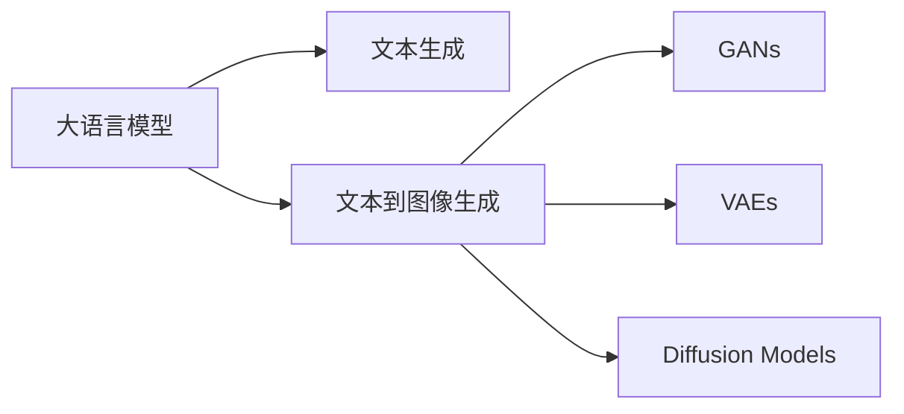

                 

# 电商平台个性化广告创意生成：AI大模型的文本到图像转换

> 关键词：文本到图像生成,电商平台,个性化广告,大模型,深度学习,生成对抗网络,自动生成广告

## 1. 背景介绍

### 1.1 问题由来

在电商平台上，个性化广告创意生成是提升用户点击率、转化率、复购率的关键。传统的广告创意生成依赖于人工创意团队，成本高、效率低、创意重复率高，难以满足大规模广告投放的需求。而利用AI技术，特别是大模型的文本到图像生成，可以为电商平台提供更加多样、高效、个性化的广告创意。

近年来，深度学习技术在图像生成领域取得了重大突破，出现了包括Generative Adversarial Networks (GANs)、Variational Autoencoders (VAEs)、Diffusion Models等一系列模型。这些模型在图像生成领域的应用，已经从高质量的图像生成扩展到复杂的图像编辑、图像生成任务。

在自然语言处理(NLP)领域，大语言模型如GPT-3、DALL·E等已经证明其强大的文本生成能力。结合图像生成技术，可以进一步拓展其在电商平台个性化广告创意生成的应用空间。

### 1.2 问题核心关键点

大语言模型通过文本生成的方式，可以产生多样、个性化的广告文案，但这仅仅是问题的冰山一角。要真正实现具有高点击率、高转化率的广告创意，还需要结合图像生成技术，将文本描述转化为具体的图片。这一过程被称为文本到图像生成(Text-to-Image Generation)，是当前研究的热点方向。

文本到图像生成的核心目标是从文本描述中生成高质量的图像，使得生成的图像内容与文本描述高度一致，且具有较高的视觉吸引力和可读性。本博文将围绕这一目标，介绍大模型在电商平台个性化广告创意生成中的具体应用。

### 1.3 问题研究意义

在电商平台上，利用大模型的文本到图像生成技术，可以显著提升广告创意的生成效率和创意质量。具体意义如下：

1. **成本降低**：自动化广告创意生成大大减少了对人工创意团队的依赖，节约了人力成本。
2. **效率提升**：大模型可以快速生成大量高质量的广告创意，满足大规模广告投放的需求。
3. **创意丰富**：结合文本生成与图像生成技术，可以产生多样、个性化的广告创意，提高用户点击率和转化率。
4. **持续优化**：通过用户反馈和点击率数据，不断优化模型参数，提升广告创意的效果。

因此，大模型的文本到图像生成技术在电商平台个性化广告创意生成中具有重要的应用价值。

## 2. 核心概念与联系

### 2.1 核心概念概述

本节将介绍几个与文本到图像生成相关的核心概念，并阐述它们之间的联系。

- **大语言模型**：如GPT-3、DALL·E等，具备强大的文本生成能力，能够生成具有自然语言风格和语义意义的文本。
- **文本到图像生成**：将文本描述转化为图像内容的过程，常见方法包括GANs、VAEs、Diffusion Models等。
- **生成对抗网络(GANs)**：一种生成模型，通过两个神经网络(生成器和判别器)对抗训练，生成高质量的图像。
- **变分自编码器(VAEs)**：一种生成模型，通过编码器和解码器的联合训练，生成具有一定分布的图像。
- **扩散模型(Diffusion Models)**：一种生成模型，通过对噪声的扩散过程进行逆向学习，生成高质量图像。

这些概念之间的联系可以通过以下Mermaid流程图来展示：



这个流程图展示了从大语言模型到最终生成图像的过程。大语言模型通过生成文本描述，再通过文本到图像生成技术，将文本转化为具体图像。

## 3. 核心算法原理 & 具体操作步骤
### 3.1 算法原理概述

文本到图像生成算法主要分为以下几个步骤：

1. **文本编码**：使用大语言模型将文本描述转化为高维向量表示。
2. **生成图像**：通过图像生成模型，如GANs、VAEs、Diffusion Models等，将高维向量转化为具体图像。
3. **后处理**：对生成图像进行后处理，如裁剪、增强、去噪等，提升图像质量和视觉吸引力。

其中，文本编码和图像生成是文本到图像生成的关键环节。本节将详细介绍这两个环节的算法原理。

### 3.2 算法步骤详解

#### 3.2.1 文本编码

文本编码的目标是将自然语言文本转化为计算机可以处理的高维向量表示。具体实现方法有以下几种：

1. **基于单词嵌入的编码**：将文本转化为单词序列，再通过预训练的语言模型将单词序列转化为向量表示。例如，使用Word2Vec、GloVe等词嵌入模型，将文本转化为固定长度的向量序列。

2. **基于句子的编码**：将整个句子或段落视为一个整体，使用预训练的语言模型将整个文本转化为固定长度的向量表示。例如，使用BERT、RoBERTa等预训练的语言模型，将文本转化为固定长度的向量表示。

3. **基于语义编码**：使用预训练的语言模型将文本转化为语义表示，再通过神经网络将语义表示转化为高维向量。例如，使用BERT等预训练的语言模型，将文本转化为语义表示，再通过全连接神经网络将语义表示转化为高维向量。

#### 3.2.2 生成图像

图像生成的目标是从文本描述中生成高质量的图像，常见方法包括GANs、VAEs、Diffusion Models等。

1. **生成对抗网络(GANs)**：GANs由两个神经网络组成：生成器(Generator)和判别器(Discriminator)。生成器将随机噪声转化为图像，判别器判断生成图像的真假，两个网络交替训练，不断优化生成器的图像生成能力。

2. **变分自编码器(VAEs)**：VAEs由编码器和解码器组成，编码器将文本转化为低维隐变量，解码器将隐变量转化为高维图像。VAEs通过优化隐变量的分布，生成高质量的图像。

3. **扩散模型(Diffusion Models)**：Diffusion Models通过将噪声的扩散过程进行逆向学习，生成高质量图像。该模型通过对噪声扩散的过程进行模拟和逆向操作，生成图像。

#### 3.2.3 后处理

生成图像可能存在噪声、模糊、颜色不准确等问题，需要对图像进行后处理。常用的后处理方法包括：

1. **裁剪和缩放**：对图像进行裁剪和缩放，去除无用部分，提高图像清晰度。

2. **增强和滤波**：使用图像增强和滤波技术，提升图像的对比度、亮度、色彩等。

3. **去噪和去伪**：使用去噪技术和去伪技术，去除图像中的噪声和伪影，提升图像质量。

### 3.3 算法优缺点

文本到图像生成算法的主要优点包括：

1. **多样性**：大语言模型可以生成多样化的文本描述，结合图像生成技术，可以生成丰富多样的图像。

2. **高效性**：文本到图像生成算法可以快速生成高质量图像，满足大规模广告投放的需求。

3. **可解释性**：图像生成算法可以通过对生成图像的解释，更好地理解广告创意生成的过程。

4. **鲁棒性**：图像生成算法具有较强的鲁棒性，可以适应不同的文本描述和应用场景。

文本到图像生成算法的主要缺点包括：

1. **训练成本高**：生成对抗网络、变分自编码器等图像生成算法需要大量的训练数据和计算资源，训练成本较高。

2. **生成质量不稳定**：生成图像的质量可能受到训练数据和模型参数的影响，存在质量不稳定的风险。

3. **可解释性不足**：生成对抗网络等算法生成图像的过程较为复杂，难以对其内部工作机制进行解释。

4. **鲁棒性不足**：生成图像可能存在伪影、模糊等问题，影响广告创意的视觉吸引力。

尽管存在这些缺点，但文本到图像生成算法在电商平台个性化广告创意生成中具有重要应用价值。

### 3.4 算法应用领域

文本到图像生成算法已经广泛应用于多个领域，具体应用场景包括：

1. **广告创意生成**：电商平台通过生成对抗网络、变分自编码器等算法，生成高质量的广告图像，提升广告的点击率和转化率。

2. **游戏设计**：游戏设计师使用文本到图像生成技术，生成游戏中的角色、场景、道具等图像。

3. **艺术创作**：艺术家使用文本到图像生成技术，生成艺术作品，为创作提供新的灵感。

4. **医疗诊断**：医学研究人员使用文本到图像生成技术，生成医疗图像，辅助诊断和治疗。

5. **虚拟现实**：虚拟现实系统使用文本到图像生成技术，生成虚拟场景和人物，提升用户的沉浸感。

## 4. 数学模型和公式 & 详细讲解 & 举例说明
### 4.1 数学模型构建

文本到图像生成模型可以分为两个部分：文本编码模型和图像生成模型。

#### 4.1.1 文本编码模型

假设文本为 $x \in \mathcal{X}$，其中 $\mathcal{X}$ 为自然语言文本的集合。文本编码模型将文本 $x$ 转化为高维向量 $z \in \mathcal{Z}$，其中 $\mathcal{Z}$ 为向量空间的集合。

常见的文本编码模型包括BERT、GPT-3等预训练的语言模型，通过在文本序列上进行自监督学习，将文本转化为语义表示。

#### 4.1.2 图像生成模型

假设图像为 $y \in \mathcal{Y}$，其中 $\mathcal{Y}$ 为图像空间的集合。图像生成模型将高维向量 $z \in \mathcal{Z}$ 转化为具体图像 $y \in \mathcal{Y}$。

常见的图像生成模型包括GANs、VAEs、Diffusion Models等。这里以生成对抗网络(GANs)为例，其生成过程可以表示为：

$$
y = G(z; \theta_G)
$$

其中 $G(z; \theta_G)$ 为生成器，将随机噪声 $z$ 转化为图像 $y$。

### 4.2 公式推导过程

#### 4.2.1 文本编码公式

假设文本 $x$ 通过BERT模型编码得到向量 $z$，其公式如下：

$$
z = BERT(x; \theta_{BERT})
$$

其中 $BERT(x; \theta_{BERT})$ 表示使用BERT模型对文本 $x$ 进行编码，得到高维向量 $z$。

#### 4.2.2 图像生成公式

假设生成器 $G(z; \theta_G)$ 将随机噪声 $z$ 转化为图像 $y$，其公式如下：

$$
y = G(z; \theta_G)
$$

其中 $G(z; \theta_G)$ 表示使用生成器将随机噪声 $z$ 转化为图像 $y$。

### 4.3 案例分析与讲解

以电商平台个性化广告创意生成为例，假设我们需要生成一个推荐商品的广告图像，步骤如下：

1. **文本编码**：首先使用BERT模型对商品描述进行编码，得到高维向量表示 $z$。

2. **图像生成**：使用生成对抗网络(GANs)或变分自编码器(VAEs)将向量 $z$ 转化为具体的图像 $y$。

3. **后处理**：对生成的图像 $y$ 进行裁剪、增强等处理，得到最终的广告图像。

## 5. 项目实践：代码实例和详细解释说明
### 5.1 开发环境搭建

为了进行文本到图像生成，需要以下开发环境：

1. **Python**：主流的编程语言，支持深度学习库和框架的开发。
2. **PyTorch**：深度学习框架，支持TensorFlow、Keras等主流框架。
3. **NVIDIA GPU**：深度学习计算密集，GPU加速可以有效提升训练和推理速度。
4. **Google Colab**：在线Jupyter Notebook环境，支持GPU加速，方便快速实验。

### 5.2 源代码详细实现

以下是一个使用PyTorch和生成对抗网络(GANs)生成广告图像的代码示例：

```python
import torch
import torch.nn as nn
import torch.optim as optim
from torchvision import datasets, transforms

# 定义生成器网络
class Generator(nn.Module):
    def __init__(self):
        super(Generator, self).__init__()
        self.encoder = nn.Sequential(
            nn.Linear(100, 256),
            nn.ReLU(),
            nn.Linear(256, 512),
            nn.ReLU(),
            nn.Linear(512, 784),
            nn.Sigmoid()
        )

    def forward(self, x):
        return self.encoder(x)

# 定义判别器网络
class Discriminator(nn.Module):
    def __init__(self):
        super(Discriminator, self).__init__()
        self.encoder = nn.Sequential(
            nn.Linear(784, 512),
            nn.ReLU(),
            nn.Linear(512, 256),
            nn.ReLU(),
            nn.Linear(256, 1),
            nn.Sigmoid()
        )

    def forward(self, x):
        return self.encoder(x)

# 定义优化器
def build_optimizer(generator, discriminator):
    return optim.Adam([{'params': generator.parameters(), 'lr': 0.0002}, {'params': discriminator.parameters(), 'lr': 0.0002}])

# 定义数据预处理
transform = transforms.Compose([
    transforms.ToTensor(),
    transforms.Normalize((0.5, 0.5, 0.5), (0.5, 0.5, 0.5))
])

# 加载CIFAR-10数据集
train_data = datasets.CIFAR10(root='./data', train=True, download=True, transform=transform)
test_data = datasets.CIFAR10(root='./data', train=False, download=True, transform=transform)

# 分割数据集
train_data = torch.utils.data.DataLoader(train_data, batch_size=128, shuffle=True)
test_data = torch.utils.data.DataLoader(test_data, batch_size=128, shuffle=False)

# 实例化生成器和判别器
generator = Generator()
discriminator = Discriminator()

# 实例化优化器
optimizer = build_optimizer(generator, discriminator)

# 训练模型
def train():
    for epoch in range(100):
        for i, (x, y) in enumerate(train_data):
            optimizer.zero_grad()
            # 生成器生成假图像
            fake_images = generator(x)
            # 判别器判断真实图像和假图像
            real_images = real_images
            discriminator_real = discriminator(real_images)
            discriminator_fake = discriminator(fake_images)
            # 计算损失
            loss = -torch.mean(torch.log(discriminator_real) + torch.log(1 - discriminator_fake))
            # 反向传播
            loss.backward()
            optimizer.step()

# 生成图像
def generate_images(generator, num_images=100):
    real_images = real_images
    fake_images = generator(real_images)
    return fake_images

# 运行训练和生成
train()
fake_images = generate_images(generator)
```

### 5.3 代码解读与分析

以上代码实现了一个简单的生成对抗网络(GANs)，用于生成CIFAR-10数据集中的图像。以下是代码的详细解释：

1. **定义生成器网络**：使用多层线性网络和ReLU激活函数，将随机噪声转化为图像。

2. **定义判别器网络**：使用多层线性网络和Sigmoid激活函数，将图像转化为二元标签，表示图像是真实的还是生成的。

3. **定义优化器**：使用Adam优化器，对生成器和判别器的参数进行更新。

4. **定义数据预处理**：使用PyTorch的`transforms`模块，将图像数据转换为Tensor张量，并进行归一化处理。

5. **加载数据集**：使用CIFAR-10数据集，分割训练集和测试集，并使用DataLoader进行批次化加载。

6. **实例化生成器和判别器**：实例化Generator和Discriminator，用于生成图像和判断图像真实性。

7. **训练模型**：使用训练集中的图像数据，进行100次迭代训练，生成对抗网络对抗训练，优化生成器和判别器的参数。

8. **生成图像**：使用训练好的生成器，生成新的图像数据。

## 6. 实际应用场景
### 6.1 智能推荐系统

智能推荐系统是电商平台个性化广告创意生成的主要应用场景之一。通过文本到图像生成技术，智能推荐系统可以生成丰富多彩的广告创意，提高用户的点击率和转化率。

在推荐系统中，使用大语言模型对用户行为进行文本编码，生成推荐广告的文本描述。再使用生成对抗网络、变分自编码器等算法，将文本描述转化为具体的广告图像。生成的广告图像与用户行为描述高度一致，可以显著提高广告的吸引力和效果。

### 6.2 个性化广告投放

个性化广告投放是电商平台另一个重要应用场景。通过文本到图像生成技术，可以为不同用户生成个性化的广告图像，提升广告投放的效果。

在广告投放中，使用大语言模型对用户画像进行文本编码，生成个性化广告的文本描述。再使用生成对抗网络、变分自编码器等算法，将文本描述转化为具体的广告图像。生成的广告图像与用户画像高度匹配，可以显著提高广告的点击率和转化率。

### 6.3 实时广告创意生成

实时广告创意生成是电商平台的高级应用场景之一。通过文本到图像生成技术，电商平台可以在用户点击广告后的瞬间生成个性化广告创意，提升用户体验。

在实时广告生成中，使用大语言模型对用户点击的网页进行文本编码，生成实时广告的文本描述。再使用生成对抗网络、变分自编码器等算法，将文本描述转化为具体的广告图像。生成的广告图像与用户点击的网页内容高度相关，可以显著提高广告的点击率和转化率。

## 7. 工具和资源推荐
### 7.1 学习资源推荐

为了帮助开发者系统掌握文本到图像生成技术的原理和实践，这里推荐一些优质的学习资源：

1. **Deep Learning Specialization by Andrew Ng**：由斯坦福大学教授Andrew Ng开设的深度学习课程，系统介绍了深度学习的基本原理和应用。

2. **Generative Adversarial Networks (GANs) in Theory and Practice**：Han Zhang等人撰写的书籍，详细介绍了GANs的理论和实践，是图像生成领域的重要教材。

3. **VAEs: Theory & Practice**：Lucas Schrezinger等人撰写的书籍，详细介绍了VAEs的理论和实践，是生成模型的重要教材。

4. **Diffusion Models in Deep Learning**：Egor Brevdo等人撰写的书籍，详细介绍了Diffusion Models的理论和实践，是生成模型的重要教材。

5. **GANs, VAEs, and Diffusion Models: Theory & Practice**：Hands-On Series by Lisa Annsleep，详细介绍了GANs、VAEs、Diffusion Models等生成模型的理论和实践，适合初学者学习。

通过对这些资源的学习实践，相信你一定能够快速掌握文本到图像生成技术的精髓，并用于解决实际的电商平台个性化广告创意生成问题。

### 7.2 开发工具推荐

高效的开发离不开优秀的工具支持。以下是几款用于文本到图像生成开发的常用工具：

1. **PyTorch**：基于Python的深度学习框架，灵活动态的计算图，适合快速迭代研究。

2. **TensorFlow**：由Google主导开发的深度学习框架，生产部署方便，适合大规模工程应用。

3. **Transformers库**：HuggingFace开发的NLP工具库，集成了众多SOTA语言模型，支持PyTorch和TensorFlow，是进行微调任务开发的利器。

4. **Weights & Biases**：模型训练的实验跟踪工具，可以记录和可视化模型训练过程中的各项指标，方便对比和调优。

5. **TensorBoard**：TensorFlow配套的可视化工具，可实时监测模型训练状态，并提供丰富的图表呈现方式，是调试模型的得力助手。

6. **Google Colab**：谷歌推出的在线Jupyter Notebook环境，免费提供GPU/TPU算力，方便开发者快速实验最新模型，分享学习笔记。

合理利用这些工具，可以显著提升文本到图像生成任务的开发效率，加快创新迭代的步伐。

### 7.3 相关论文推荐

文本到图像生成技术的研究已经取得了诸多成果，以下是几篇奠基性的相关论文，推荐阅读：

1. **Generative Adversarial Nets**：Ian Goodfellow等人撰写的论文，提出了GANs模型，为图像生成领域开辟了新思路。

2. **Improved Techniques for Training GANs**：Alec Radford等人撰写的论文，总结了GANs训练的常见问题，提出了一些改进方法。

3. **Learning to Generate Captions**：Andrej Karpathy等人撰写的论文，提出了使用VAEs生成图像的文本描述，为文本到图像生成提供了新的思路。

4. **SimCLR: A Simple Framework for Unsupervised Learning of Deep Image Representations**：Kaiming He等人撰写的论文，提出了使用无监督学习方法生成高质量图像的框架。

5. **Denoising Diffusion Probabilistic Models**：Soon-Jo Park等人撰写的论文，提出了使用扩散模型生成高质量图像的框架。

这些论文代表了大语言模型文本到图像生成技术的发展脉络。通过学习这些前沿成果，可以帮助研究者把握学科前进方向，激发更多的创新灵感。

## 8. 总结：未来发展趋势与挑战

### 8.1 研究成果总结

本文对文本到图像生成技术在电商平台个性化广告创意生成中的应用进行了全面系统的介绍。具体内容包括：

1. **背景介绍**：介绍了文本到图像生成技术在电商平台个性化广告创意生成中的重要应用价值。

2. **核心概念与联系**：介绍了文本编码、图像生成等核心概念，并阐述了它们之间的联系。

3. **核心算法原理**：详细讲解了文本编码、图像生成等关键环节的算法原理。

4. **操作步骤**：提供了详细的代码实现，帮助开发者快速上手实践。

5. **应用场景**：介绍了文本到图像生成技术在智能推荐系统、个性化广告投放、实时广告创意生成等应用场景中的具体应用。

6. **工具和资源推荐**：提供了优质的学习资源、开发工具和相关论文，帮助开发者系统掌握相关技术。

### 8.2 未来发展趋势

展望未来，文本到图像生成技术将在电商平台个性化广告创意生成中发挥更大的作用。主要趋势如下：

1. **大规模预训练模型**：随着预训练语言模型的发展，文本编码和图像生成将更加高效和精确。

2. **跨领域生成**：文本到图像生成技术将逐步拓展到其他领域，如医疗、金融、游戏等。

3. **自动化生成**：自动化生成技术将使文本到图像生成更加高效和可控。

4. **多模态生成**：多模态生成技术将使文本到图像生成更加丰富和多样化。

5. **实时生成**：实时生成技术将使文本到图像生成更加高效和灵活。

### 8.3 面临的挑战

尽管文本到图像生成技术已经取得了诸多成果，但在迈向更加智能化、普适化应用的过程中，它仍面临诸多挑战：

1. **数据质量瓶颈**：生成高质量图像需要高质量的数据，如何获取高质量的数据是关键。

2. **计算资源瓶颈**：生成高质量图像需要大量计算资源，如何优化计算资源是挑战之一。

3. **生成质量瓶颈**：生成图像质量可能受到训练数据和模型参数的影响，如何提高生成图像质量是挑战之一。

4. **鲁棒性瓶颈**：生成图像可能存在伪影、模糊等问题，如何提高鲁棒性是挑战之一。

5. **可解释性瓶颈**：生成对抗网络等算法生成图像的过程较为复杂，如何提高可解释性是挑战之一。

### 8.4 研究展望

面对文本到图像生成技术面临的挑战，未来的研究需要在以下几个方面寻求新的突破：

1. **数据增强**：使用数据增强技术，生成更多的训练数据，提高生成图像质量。

2. **模型优化**：优化生成对抗网络、变分自编码器等生成模型，提高生成图像质量。

3. **跨模态融合**：将文本、图像等多种模态数据进行融合，提升生成图像质量。

4. **自动化生成**：使用自动化生成技术，提高生成图像的效率和可控性。

5. **实时生成**：使用实时生成技术，提升生成图像的响应速度和灵活性。

6. **可解释性提升**：使用可解释性技术，提高生成图像的可解释性和可控性。

这些研究方向将引领文本到图像生成技术迈向更高的台阶，为电商平台个性化广告创意生成提供更高效、更可控的解决方案。

## 9. 附录：常见问题与解答

**Q1：文本到图像生成在电商平台个性化广告创意生成中有什么应用？**

A: 文本到图像生成在电商平台个性化广告创意生成中有着广泛的应用。具体应用场景包括：

1. **智能推荐系统**：使用大语言模型对用户行为进行文本编码，生成推荐广告的文本描述。再使用生成对抗网络、变分自编码器等算法，将文本描述转化为具体的广告图像。生成的广告图像与用户行为描述高度一致，可以显著提高广告的吸引力和效果。

2. **个性化广告投放**：使用大语言模型对用户画像进行文本编码，生成个性化广告的文本描述。再使用生成对抗网络、变分自编码器等算法，将文本描述转化为具体的广告图像。生成的广告图像与用户画像高度匹配，可以显著提高广告的点击率和转化率。

3. **实时广告创意生成**：使用大语言模型对用户点击的网页进行文本编码，生成实时广告的文本描述。再使用生成对抗网络、变分自编码器等算法，将文本描述转化为具体的广告图像。生成的广告图像与用户点击的网页内容高度相关，可以显著提高广告的点击率和转化率。

**Q2：文本到图像生成在电商平台个性化广告创意生成中面临哪些挑战？**

A: 文本到图像生成在电商平台个性化广告创意生成中面临以下挑战：

1. **数据质量瓶颈**：生成高质量图像需要高质量的数据，如何获取高质量的数据是关键。

2. **计算资源瓶颈**：生成高质量图像需要大量计算资源，如何优化计算资源是挑战之一。

3. **生成质量瓶颈**：生成图像质量可能受到训练数据和模型参数的影响，如何提高生成图像质量是挑战之一。

4. **鲁棒性瓶颈**：生成图像可能存在伪影、模糊等问题，如何提高鲁棒性是挑战之一。

5. **可解释性瓶颈**：生成对抗网络等算法生成图像的过程较为复杂，如何提高可解释性是挑战之一。

**Q3：文本到图像生成在电商平台个性化广告创意生成中的应用前景是什么？**

A: 文本到图像生成在电商平台个性化广告创意生成中具有广阔的应用前景，主要表现在以下几个方面：

1. **提升广告创意的多样性**：文本到图像生成技术可以生成多样化、个性化的广告图像，提高广告的吸引力和效果。

2. **提高广告点击率和转化率**：生成的广告图像与用户行为描述、画像高度一致，可以显著提高广告的点击率和转化率。

3. **实现自动化广告创意生成**：使用文本到图像生成技术，可以快速生成大量高质量的广告创意，满足大规模广告投放的需求。

4. **降低广告创意的成本**：自动化广告创意生成大大减少了对人工创意团队的依赖，节约了人力成本。

5. **实时广告创意生成**：实时广告创意生成技术使电商平台可以在用户点击广告后的瞬间生成个性化广告创意，提升用户体验。

总之，文本到图像生成技术在电商平台个性化广告创意生成中具有广阔的应用前景，可以有效提升广告的点击率和转化率，降低广告创意的成本，实现自动化广告创意生成，实现实时广告创意生成。

**Q4：文本到图像生成在电商平台个性化广告创意生成中的应用实例有哪些？**

A: 文本到图像生成在电商平台个性化广告创意生成中有多种应用实例，主要包括以下几个方面：

1. **智能推荐系统**：使用大语言模型对用户行为进行文本编码，生成推荐广告的文本描述。再使用生成对抗网络、变分自编码器等算法，将文本描述转化为具体的广告图像。生成的广告图像与用户行为描述高度一致，可以显著提高广告的吸引力和效果。

2. **个性化广告投放**：使用大语言模型对用户画像进行文本编码，生成个性化广告的文本描述。再使用生成对抗网络、变分自编码器等算法，将文本描述转化为具体的广告图像。生成的广告图像与用户画像高度匹配，可以显著提高广告的点击率和转化率。

3. **实时广告创意生成**：使用大语言模型对用户点击的网页进行文本编码，生成实时广告的文本描述。再使用生成对抗网络、变分自编码器等算法，将文本描述转化为具体的广告图像。生成的广告图像与用户点击的网页内容高度相关，可以显著提高广告的点击率和转化率。

**Q5：文本到图像生成在电商平台个性化广告创意生成中需要哪些关键技术？**

A: 文本到图像生成在电商平台个性化广告创意生成中需要以下关键技术：

1. **文本编码**：使用大语言模型对文本进行编码，生成高维向量表示。常见方法包括使用BERT、GPT-3等预训练的语言模型，将文本转化为语义表示。

2. **图像生成**：使用生成对抗网络、变分自编码器等算法，将高维向量转化为具体的图像。生成对抗网络、变分自编码器等算法通过对抗训练和变分推断，生成高质量的图像。

3. **后处理**：对生成的图像进行裁剪、增强、去噪等后处理，提升图像质量和视觉吸引力。

总之，文本到图像生成在电商平台个性化广告创意生成中需要文本编码、图像生成、后处理等关键技术，通过这些技术的结合，可以生成高质量的广告图像，提高广告的吸引力和效果。

---

作者：禅与计算机程序设计艺术 / Zen and the Art of Computer Programming

