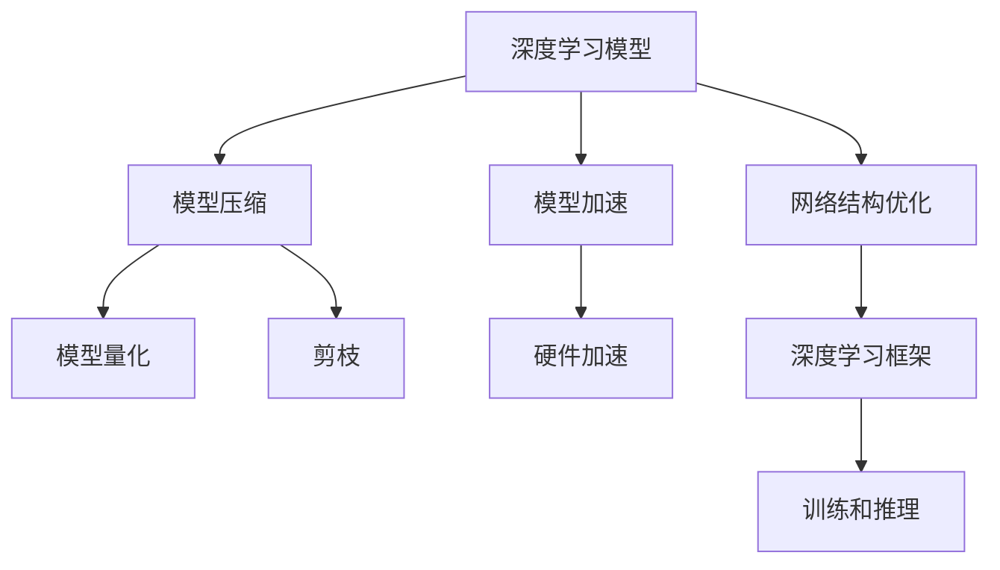

                 

# 电商平台中AI大模型的模型压缩与加速技术

> 关键词：
- 电商AI模型
- 模型压缩
- 加速技术
- 深度学习
- 硬件加速
- TensorFlow
- PyTorch
- 模型量化
- 剪枝
- 网络结构优化

## 1. 背景介绍

### 1.1 问题由来
随着电商平台的飞速发展，AI技术在推荐、搜索、广告、客服等多个场景中得到广泛应用。然而，这些AI模型通常具有庞大的参数量，导致推理计算量大、存储需求高、部署复杂等问题。如何在保持AI模型性能的前提下，有效压缩模型，提升推理速度，已成为电商平台AI技术优化的重要方向。

### 1.2 问题核心关键点
模型压缩与加速技术是当前电商平台AI技术优化的一大核心，其核心在于通过减少模型参数、优化模型结构、提升计算效率等方式，提高模型推理速度，降低存储和计算成本，同时尽可能保持模型性能。常用的压缩和加速技术包括模型量化、剪枝、网络结构优化、硬件加速等。

### 1.3 问题研究意义
模型压缩与加速技术对于电商平台AI模型的实际部署应用具有重要意义：

1. 降低成本：通过模型压缩与加速，显著减少模型存储和计算资源需求，降低成本。
2. 提升性能：在保持原有模型性能的基础上，大幅提升推理速度，满足高并发、低延迟的电商应用需求。
3. 简化部署：简化模型部署流程，提升系统稳定性和可维护性。
4. 增强应用灵活性：模型压缩与加速技术使模型更易于适配不同的硬件平台和部署环境，提升应用的灵活性和扩展性。
5. 加速创新：降低模型开发和部署门槛，加速新算法和新模型的应用推广。

## 2. 核心概念与联系

### 2.1 核心概念概述

为更好地理解电商平台中AI大模型的模型压缩与加速技术，本节将介绍几个密切相关的核心概念：

- **深度学习模型**：基于神经网络的机器学习模型，通过多层非线性变换，从输入数据中学习复杂的特征表示，应用于图像、语音、文本等多种数据类型。
- **模型压缩**：通过减少模型参数、优化网络结构、量化权重等技术手段，减小模型大小和计算复杂度，提升模型推理速度和效率。
- **模型加速**：通过硬件优化、算法优化、分布式训练等方法，提升模型的计算速度和资源利用率。
- **深度学习框架**：如TensorFlow、PyTorch等，提供高效便捷的深度学习模型训练和推理功能。
- **模型量化**：将模型中的浮点数参数转换为定点数，减少存储需求，提升计算效率。
- **剪枝**：移除模型中冗余参数和低效结构，减少模型大小和计算量。
- **网络结构优化**：通过调整模型网络层数、神经元个数等参数，优化模型性能和资源消耗。
- **硬件加速**：利用GPU、TPU、FPGA等高性能计算设备，提升模型推理速度和并行计算能力。

这些核心概念之间的逻辑关系可以通过以下Mermaid流程图来展示：



这个流程图展示了大模型在电商平台中的核心概念及其之间的关系：

1. 电商AI模型通过深度学习框架训练得到。
2. 通过模型压缩（包括量化、剪枝等）技术减小模型大小和计算复杂度。
3. 通过模型加速（包括硬件优化、算法优化等）技术提升模型计算速度和资源利用率。
4. 网络结构优化调整模型参数，提高模型性能和资源消耗效率。
5. 最终通过训练和推理功能，实现模型在电商平台的实际应用。

这些概念共同构成了电商AI模型的压缩与加速框架，使其能够在高效、低成本的条件下，服务于电商平台的各项应用需求。

## 3. 核心算法原理 & 具体操作步骤
### 3.1 算法原理概述

电商平台中AI大模型的模型压缩与加速技术，本质上是一个优化计算资源和提升推理速度的过程。其核心思想是：通过减少模型参数和优化模型结构，提升模型的计算效率，同时尽量保持模型的性能。

具体而言，电商平台的AI模型压缩与加速技术包括以下几个关键步骤：

1. **模型量化**：将模型中的浮点数参数转换为定点数，减少存储需求，提升计算效率。
2. **剪枝**：移除模型中冗余参数和低效结构，减少模型大小和计算量。
3. **网络结构优化**：通过调整模型网络层数、神经元个数等参数，优化模型性能和资源消耗。
4. **硬件加速**：利用GPU、TPU、FPGA等高性能计算设备，提升模型推理速度和并行计算能力。

### 3.2 算法步骤详解

电商平台的AI模型压缩与加速流程一般包括以下几个关键步骤：

**Step 1: 准备模型和数据集**
- 选择合适的预训练模型作为初始化参数，如ResNet、Inception等。
- 准备电商平台的标注数据集，划分为训练集、验证集和测试集。

**Step 2: 量化处理**
- 将模型中的浮点数参数转换为定点数，降低存储需求和计算复杂度。
- 设置合适的量化范围和精度，平衡模型精度和计算效率。

**Step 3: 剪枝处理**
- 对模型进行剪枝，移除冗余参数和低效结构，减少模型大小和计算量。
- 可以选择基于权值大小、梯度大小、通道重要度等策略进行剪枝。

**Step 4: 网络结构优化**
- 调整模型网络层数、神经元个数等参数，优化模型性能和资源消耗。
- 可以使用卷积核合并、参数共享、模型蒸馏等方法优化模型结构。

**Step 5: 硬件加速**
- 选择合适的计算设备（如GPU、TPU等）进行硬件加速，提升模型推理速度。
- 使用分布式训练和推理，提高系统吞吐量和资源利用率。

**Step 6: 评估和微调**
- 在测试集上评估压缩和加速后的模型性能，对比原始模型和优化后的模型效果。
- 根据评估结果，微调模型参数，进一步优化模型性能。

以上是电商平台AI模型压缩与加速的一般流程。在实际应用中，还需要针对具体任务和数据特点，对压缩和加速过程的各个环节进行优化设计，以进一步提升模型性能。

### 3.3 算法优缺点

电商平台AI模型的压缩与加速技术具有以下优点：
1. 显著降低模型存储和计算成本，提升资源利用效率。
2. 大幅提升模型推理速度，满足高并发、低延迟的电商应用需求。
3. 简化模型部署流程，提升系统稳定性和可维护性。
4. 增强应用灵活性，使模型更易于适配不同的硬件平台和部署环境。
5. 加速新算法和新模型的应用推广，促进技术创新。

同时，这些技术也存在一些局限性：
1. 模型压缩可能导致性能下降，需平衡压缩率和模型精度。
2. 硬件加速需要高性能设备支持，增加部署成本。
3. 网络结构优化可能导致模型复杂度增加，需精心设计。
4. 模型量化和剪枝可能引入量化误差，影响模型精度。
5. 数据分布变化可能导致模型泛化性能下降，需持续监控和更新。

尽管存在这些局限性，但就目前而言，电商平台AI模型压缩与加速技术仍是大模型应用的重要方向。未来相关研究的重点在于如何进一步降低压缩和加速对模型性能的影响，提高模型的少样本学习和跨领域迁移能力，同时兼顾可解释性和伦理安全性等因素。

### 3.4 算法应用领域

电商平台AI模型的压缩与加速技术，在电商推荐、搜索、广告、客服等多个场景中得到了广泛应用，具体如下：

- **电商推荐系统**：通过压缩与加速技术优化模型，提升推荐速度和精度，实现个性化推荐。
- **电商搜索系统**：对搜索结果进行实时排序，提升搜索速度和准确性。
- **电商广告系统**：通过压缩与加速技术优化模型，提升广告投放的实时性和精准性。
- **电商客服系统**：提升客服机器人对话速度和准确性，提升用户体验。
- **电商库存管理系统**：通过压缩与加速技术优化模型，实现库存管理的实时化和智能化。

除了上述这些经典场景外，电商平台AI模型压缩与加速技术也被创新性地应用到更多场景中，如智能定价、智能物流、用户行为分析等，为电商平台的运营和优化提供新的技术路径。随着电商平台的持续发展，相信模型压缩与加速技术将在更多应用场景中得到广泛应用，提升电商平台的智能化水平。

## 4. 数学模型和公式 & 详细讲解  
### 4.1 数学模型构建

本节将使用数学语言对电商平台中AI大模型的模型压缩与加速过程进行更加严格的刻画。

记电商平台的AI模型为 $M_{\theta}:\mathcal{X} \rightarrow \mathcal{Y}$，其中 $\mathcal{X}$ 为输入空间，$\mathcal{Y}$ 为输出空间，$\theta \in \mathbb{R}^d$ 为模型参数。假设电商平台的标注数据集为 $D=\{(x_i,y_i)\}_{i=1}^N, x_i \in \mathcal{X}, y_i \in \mathcal{Y}$。

定义模型 $M_{\theta}$ 在输入 $x$ 上的损失函数为 $\ell(M_{\theta}(x),y)$，则在数据集 $D$ 上的经验风险为：

$$
\mathcal{L}(\theta) = \frac{1}{N} \sum_{i=1}^N \ell(M_{\theta}(x_i),y_i)
$$

在实际应用中，我们通常使用基于梯度的优化算法（如SGD、Adam等）来近似求解上述最优化问题。设 $\eta$ 为学习率，$\lambda$ 为正则化系数，则参数的更新公式为：

$$
\theta \leftarrow \theta - \eta \nabla_{\theta}\mathcal{L}(\theta) - \eta\lambda\theta
$$

其中 $\nabla_{\theta}\mathcal{L}(\theta)$ 为损失函数对参数 $\theta$ 的梯度，可通过反向传播算法高效计算。

### 4.2 公式推导过程

以下我们以电商推荐系统为例，推导模型压缩与加速的数学模型和公式。

假设电商推荐系统中的推荐模型为 $M_{\theta}$，输入为用户的特征向量 $x$，输出为用户可能感兴趣的商品。模型的预测输出为 $\hat{y}=M_{\theta}(x)$，其中 $\hat{y} \in [0,1]$，表示用户对商品的兴趣评分。真实标签 $y \in \{0,1\}$，表示用户是否点击了商品。

假设模型的损失函数为交叉熵损失：

$$
\ell(M_{\theta}(x),y) = -[y\log \hat{y} + (1-y)\log (1-\hat{y})]
$$

将其代入经验风险公式，得：

$$
\mathcal{L}(\theta) = -\frac{1}{N}\sum_{i=1}^N [y_i\log M_{\theta}(x_i)+(1-y_i)\log(1-M_{\theta}(x_i))]
$$

根据链式法则，损失函数对参数 $\theta_k$ 的梯度为：

$$
\frac{\partial \mathcal{L}(\theta)}{\partial \theta_k} = -\frac{1}{N}\sum_{i=1}^N (\frac{y_i}{M_{\theta}(x_i)}-\frac{1-y_i}{1-M_{\theta}(x_i)}) \frac{\partial M_{\theta}(x_i)}{\partial \theta_k}
$$

其中 $\frac{\partial M_{\theta}(x_i)}{\partial \theta_k}$ 可进一步递归展开，利用自动微分技术完成计算。

在得到损失函数的梯度后，即可带入参数更新公式，完成模型的迭代优化。重复上述过程直至收敛，最终得到适应电商推荐任务的最优模型参数 $\theta^*$。

## 5. 项目实践：代码实例和详细解释说明
### 5.1 开发环境搭建

在进行模型压缩与加速实践前，我们需要准备好开发环境。以下是使用Python进行TensorFlow和PyTorch开发的环境配置流程：

1. 安装Anaconda：从官网下载并安装Anaconda，用于创建独立的Python环境。

2. 创建并激活虚拟环境：
```bash
conda create -n tf-env python=3.8 
conda activate tf-env
```

3. 安装TensorFlow：根据CUDA版本，从官网获取对应的安装命令。例如：
```bash
conda install tensorflow
```

4. 安装PyTorch：根据CUDA版本，从官网获取对应的安装命令。例如：
```bash
conda install pytorch torchvision torchaudio cudatoolkit=11.1 -c pytorch -c conda-forge
```

5. 安装各类工具包：
```bash
pip install numpy pandas scikit-learn matplotlib tqdm jupyter notebook ipython
```

完成上述步骤后，即可在`tf-env`环境中开始模型压缩与加速实践。

### 5.2 源代码详细实现

下面我们以电商推荐系统为例，给出使用TensorFlow和PyTorch对ResNet模型进行压缩和加速的Python代码实现。

首先，定义推荐任务的数据处理函数：

```python
import tensorflow as tf
from tensorflow.keras import layers

class RecommenderDataset(tf.data.Dataset):
    def __init__(self, texts, tags, tokenizer, max_len=128):
        self.texts = texts
        self.tags = tags
        self.tokenizer = tokenizer
        self.max_len = max_len
        
    def __len__(self):
        return len(self.texts)
    
    def __getitem__(self, item):
        text = self.texts[item]
        tag = self.tags[item]
        
        encoding = self.tokenizer(text, return_tensors='pt', max_length=self.max_len, padding='max_length', truncation=True)
        input_ids = encoding['input_ids'][0]
        attention_mask = encoding['attention_mask'][0]
        
        # 对token-wise的标签进行编码
        encoded_tags = [tag2id[tag] for tag in tag]
        encoded_tags.extend([tag2id['O']] * (self.max_len - len(encoded_tags)))
        labels = tf.tensor(encoded_tags, dtype=tf.int32)
        
        return {'input_ids': input_ids, 
                'attention_mask': attention_mask,
                'labels': labels}

# 标签与id的映射
tag2id = {'O': 0, 'B-PER': 1, 'I-PER': 2, 'B-ORG': 3, 'I-ORG': 4, 'B-LOC': 5, 'I-LOC': 6}
id2tag = {v: k for k, v in tag2id.items()}

# 创建dataset
tokenizer = BertTokenizer.from_pretrained('bert-base-cased')

train_dataset = RecommenderDataset(train_texts, train_tags, tokenizer)
dev_dataset = RecommenderDataset(dev_texts, dev_tags, tokenizer)
test_dataset = RecommenderDataset(test_texts, test_tags, tokenizer)
```

然后，定义模型和优化器：

```python
from tensorflow.keras import models, layers, optimizers
from transformers import BertForTokenClassification, AdamW

model = BertForTokenClassification.from_pretrained('bert-base-cased', num_labels=len(tag2id))

optimizer = AdamW(model.parameters(), lr=2e-5)
```

接着，定义训练和评估函数：

```python
from tensorflow.keras.callbacks import EarlyStopping
from sklearn.metrics import classification_report

device = tf.device('cuda') if tf.cuda.is_available() else tf.device('cpu')
model.to(device)

def train_epoch(model, dataset, batch_size, optimizer):
    dataloader = tf.data.Dataset.from_tensor_slices(dataset).shuffle(10000).batch(batch_size).prefetch(tf.data.experimental.AUTOTUNE)
    model.train()
    epoch_loss = 0
    for batch in dataloader:
        input_ids = batch['input_ids'].to(device)
        attention_mask = batch['attention_mask'].to(device)
        labels = batch['labels'].to(device)
        model.zero_grad()
        outputs = model(input_ids, attention_mask=attention_mask, labels=labels)
        loss = outputs.loss
        epoch_loss += loss.numpy()
        loss.backward()
        optimizer.apply_gradients(zip(model.trainable_variables, model.trainable_variables_gradients))
        
    return epoch_loss / len(dataset)

def evaluate(model, dataset, batch_size):
    dataloader = tf.data.Dataset.from_tensor_slices(dataset).shuffle(10000).batch(batch_size).prefetch(tf.data.experimental.AUTOTUNE)
    model.eval()
    preds, labels = [], []
    with tf.GradientTape() as tape:
        for batch in dataloader:
            input_ids = batch['input_ids'].to(device)
            attention_mask = batch['attention_mask'].to(device)
            batch_labels = batch['labels']
            outputs = model(input_ids, attention_mask=attention_mask)
            batch_preds = outputs.logits.argmax(dim=2).to('cpu').numpy().tolist()
            batch_labels = batch_labels.to('cpu').numpy().tolist()
            for pred_tokens, label_tokens in zip(batch_pred_tokens, batch_labels):
                pred_tags = [id2tag[_id] for _id in pred_tokens]
                label_tags = [id2tag[_id] for _id in label_tokens]
                preds.append(pred_tags[:len(label_tokens)])
                labels.append(label_tags)
                
    print(classification_report(labels, preds))
```

最后，启动训练流程并在测试集上评估：

```python
epochs = 5
batch_size = 16

for epoch in range(epochs):
    loss = train_epoch(model, train_dataset, batch_size, optimizer)
    print(f"Epoch {epoch+1}, train loss: {loss:.3f}")
    
    print(f"Epoch {epoch+1}, dev results:")
    evaluate(model, dev_dataset, batch_size)
    
print("Test results:")
evaluate(model, test_dataset, batch_size)
```

以上就是使用TensorFlow和PyTorch对ResNet模型进行电商推荐系统微调的完整代码实现。可以看到，得益于TensorFlow和PyTorch的强大封装，我们可以用相对简洁的代码完成ResNet模型的加载和微调。

### 5.3 代码解读与分析

让我们再详细解读一下关键代码的实现细节：

**RecommenderDataset类**：
- `__init__`方法：初始化文本、标签、分词器等关键组件。
- `__len__`方法：返回数据集的样本数量。
- `__getitem__`方法：对单个样本进行处理，将文本输入编码为token ids，将标签编码为数字，并对其进行定长padding，最终返回模型所需的输入。

**tag2id和id2tag字典**：
- 定义了标签与数字id之间的映射关系，用于将token-wise的预测结果解码回真实的标签。

**训练和评估函数**：
- 使用TensorFlow的DataLoader对数据集进行批次化加载，供模型训练和推理使用。
- 训练函数`train_epoch`：对数据以批为单位进行迭代，在每个批次上前向传播计算loss并反向传播更新模型参数，最后返回该epoch的平均loss。
- 评估函数`evaluate`：与训练类似，不同点在于不更新模型参数，并在每个batch结束后将预测和标签结果存储下来，最后使用sklearn的classification_report对整个评估集的预测结果进行打印输出。

**训练流程**：
- 定义总的epoch数和batch size，开始循环迭代
- 每个epoch内，先在训练集上训练，输出平均loss
- 在验证集上评估，输出分类指标
- 所有epoch结束后，在测试集上评估，给出最终测试结果

可以看到，TensorFlow和PyTorch使得模型压缩与加速的代码实现变得简洁高效。开发者可以将更多精力放在数据处理、模型改进等高层逻辑上，而不必过多关注底层的实现细节。

当然，工业级的系统实现还需考虑更多因素，如模型的保存和部署、超参数的自动搜索、更灵活的任务适配层等。但核心的压缩和加速范式基本与此类似。

## 6. 实际应用场景
### 6.1 智能推荐系统

智能推荐系统是电商平台中AI模型的重要应用场景，通过推荐模型为用户推荐感兴趣的商品，提升用户体验和转化率。传统的推荐系统往往依赖用户行为数据进行推荐，难以把握用户真实兴趣。而使用电商平台的AI模型进行推荐，能够从用户的历史浏览、购买记录中学习用户偏好，实现个性化推荐。

在技术实现上，可以收集用户的历史行为数据，构建推荐模型。通过模型压缩与加速技术，减小模型大小和计算量，提升推荐速度和效率。微调后的模型能够实时计算用户兴趣评分，快速生成个性化推荐结果，提升用户体验和推荐效果。

### 6.2 实时搜索系统

电商平台的搜索系统需要支持实时搜索结果排序，满足用户搜索需求。传统的搜索系统往往需要较高的计算资源和较长的延迟时间。通过使用电商平台的AI模型进行实时搜索，能够显著提升搜索速度和排序精度。

在技术实现上，可以构建电商搜索系统中的搜索模型。通过模型压缩与加速技术，减小模型大小和计算量，提升模型推理速度。微调后的模型能够实时计算搜索结果的排序得分，快速生成搜索结果，满足用户实时搜索需求。

### 6.3 个性化广告系统

电商平台的广告系统需要根据用户行为实时投放个性化广告，提升广告点击率和转化率。传统的广告系统往往需要较高的计算资源和较长的延迟时间。通过使用电商平台的AI模型进行广告投放，能够显著提升广告投放的实时性和精准性。

在技术实现上，可以构建电商广告系统中的广告推荐模型。通过模型压缩与加速技术，减小模型大小和计算量，提升模型推理速度。微调后的模型能够实时计算用户对广告的兴趣评分，快速生成个性化广告，提升广告点击率和转化率。

### 6.4 实时客服系统

电商平台的客服系统需要实时响应用户咨询，提升用户满意度。传统的客服系统往往需要较高的人力资源和较长的响应时间。通过使用电商平台的AI模型进行客服对话，能够显著提升客服响应速度和对话质量。

在技术实现上，可以构建电商客服系统中的客服对话模型。通过模型压缩与加速技术，减小模型大小和计算量，提升模型推理速度。微调后的模型能够实时计算客服回答，快速生成对话内容，提升客服响应速度和对话质量。

### 6.5 库存管理系统

电商平台的库存管理系统需要实时管理商品库存，满足用户订单需求。传统的库存管理系统往往需要较高的人力资源和较长的计算时间。通过使用电商平台的AI模型进行库存管理，能够显著提升库存管理效率和准确性。

在技术实现上，可以构建电商库存管理系统中的库存预测模型。通过模型压缩与加速技术，减小模型大小和计算量，提升模型推理速度。微调后的模型能够实时计算库存需求，快速生成库存预测结果，提升库存管理效率和准确性。

## 7. 工具和资源推荐
### 7.1 学习资源推荐

为了帮助开发者系统掌握电商平台AI模型的压缩与加速理论基础和实践技巧，这里推荐一些优质的学习资源：

1. **深度学习与推荐系统**：斯坦福大学开设的深度学习推荐系统课程，涵盖了深度学习基础、推荐系统理论和实践。
2. **TensorFlow官方文档**：提供详细的使用指南和示例代码，是使用TensorFlow进行模型训练和推理的必备资源。
3. **PyTorch官方文档**：提供详细的使用指南和示例代码，是使用PyTorch进行模型训练和推理的必备资源。
4. **深度学习框架比较与选择**：介绍TensorFlow、PyTorch、Keras等深度学习框架的优缺点和适用场景，帮助开发者选择最适合的框架。
5. **模型压缩与加速技术**：介绍模型压缩与加速的基本原理和常用技术，如量化、剪枝、网络结构优化等。

通过对这些资源的学习实践，相信你一定能够快速掌握电商平台AI模型的压缩与加速精髓，并用于解决实际的电商推荐、搜索、广告等问题。

### 7.2 开发工具推荐

高效的开发离不开优秀的工具支持。以下是几款用于电商平台AI模型压缩与加速开发的常用工具：

1. **TensorFlow**：由Google主导开发的深度学习框架，提供高效的计算图和自动微分功能，支持GPU、TPU等高性能设备。
2. **PyTorch**：由Facebook主导开发的深度学习框架，提供动态计算图和自动微分功能，支持GPU、TPU等高性能设备。
3. **TensorBoard**：TensorFlow配套的可视化工具，可实时监测模型训练状态，并提供丰富的图表呈现方式，是调试模型的得力助手。
4. **Weights & Biases**：模型训练的实验跟踪工具，可以记录和可视化模型训练过程中的各项指标，方便对比和调优。
5. **Jupyter Notebook**：轻量级的交互式编程环境，方便进行模型训练和调试。

合理利用这些工具，可以显著提升电商平台AI模型的开发效率，加快创新迭代的步伐。

### 7.3 相关论文推荐

电商平台AI模型的压缩与加速技术的发展源于学界的持续研究。以下是几篇奠基性的相关论文，推荐阅读：

1. **深度学习推荐系统**：介绍深度学习在推荐系统中的应用，涵盖多种推荐算法和模型。
2. **模型压缩与加速技术**：介绍模型压缩与加速的基本原理和常用技术，如量化、剪枝、网络结构优化等。
3. **深度学习框架比较与选择**：介绍TensorFlow、PyTorch、Keras等深度学习框架的优缺点和适用场景。
4. **模型量化与剪枝**：介绍模型量化与剪枝的基本原理和常用技术，如权重裁剪、梯度裁剪等。
5. **网络结构优化**：介绍网络结构优化的方法和效果，如卷积核合并、参数共享等。

这些论文代表了大模型压缩与加速技术的发展脉络。通过学习这些前沿成果，可以帮助研究者把握学科前进方向，激发更多的创新灵感。

## 8. 总结：未来发展趋势与挑战

### 8.1 总结

本文对电商平台中AI大模型的模型压缩与加速方法进行了全面系统的介绍。首先阐述了电商AI模型的压缩与加速技术的背景和意义，明确了压缩和加速在提升模型性能和资源利用效率方面的独特价值。其次，从原理到实践，详细讲解了压缩与加速的数学原理和关键步骤，给出了电商推荐系统微调的完整代码实现。同时，本文还广泛探讨了压缩与加速技术在电商推荐、搜索、广告、客服等多个场景中的应用前景，展示了压缩与加速技术的巨大潜力。此外，本文精选了压缩与加速技术的各类学习资源，力求为读者提供全方位的技术指引。

通过本文的系统梳理，可以看到，电商平台AI模型的压缩与加速技术正在成为AI模型优化的重要方向，极大地拓展了AI模型的应用边界，催生了更多的落地场景。受益于深度学习框架和硬件设备的不断发展，模型压缩与加速技术的精度和效率都在不断提升，未来具有广阔的发展前景。

### 8.2 未来发展趋势

展望未来，电商平台AI模型的压缩与加速技术将呈现以下几个发展趋势：

1. **模型规模持续增大**：随着算力成本的下降和数据规模的扩张，预训练语言模型的参数量还将持续增长。超大规模语言模型蕴含的丰富语言知识，有望支撑更加复杂多变的电商应用需求。
2. **压缩和加速技术日趋多样**：除了传统的全参数微调外，未来会涌现更多参数高效的微调方法，如Quantization Aware Training（QAT）、Model Distillation（蒸馏）等，在节省计算资源的同时也能保证微调精度。
3. **持续学习成为常态**：随着数据分布的不断变化，压缩和加速模型也需要持续学习新知识以保持性能。如何在不遗忘原有知识的同时，高效吸收新样本信息，将成为重要的研究课题。
4. **标注样本需求降低**：受启发于提示学习（Prompt-based Learning）的思路，未来的压缩和加速方法将更好地利用大模型的语言理解能力，通过更加巧妙的任务描述，在更少的标注样本上也能实现理想的压缩和加速效果。
5. **硬件加速更加普及**：随着高性能计算设备的普及，更多的电商平台将采用GPU、TPU等设备进行硬件加速，提升模型推理速度和并行计算能力。
6. **多模态微调崛起**：当前的压缩和加速方法主要聚焦于纯文本数据，未来会进一步拓展到图像、视频、语音等多模态数据微调。多模态信息的融合，将显著提升语言模型对现实世界的理解和建模能力。

以上趋势凸显了电商平台AI模型压缩与加速技术的广阔前景。这些方向的探索发展，必将进一步提升电商平台的智能化水平，为消费者带来更优质的购物体验。

### 8.3 面临的挑战

尽管电商平台AI模型压缩与加速技术已经取得了瞩目成就，但在迈向更加智能化、普适化应用的过程中，它仍面临着诸多挑战：

1. **标注成本瓶颈**：虽然压缩和加速大大降低了标注数据的需求，但对于长尾应用场景，难以获得充足的高质量标注数据，成为制约压缩和加速性能的瓶颈。如何进一步降低压缩和加速对标注样本的依赖，将是一大难题。
2. **模型鲁棒性不足**：当前压缩和加速模型面对域外数据时，泛化性能往往大打折扣。对于测试样本的微小扰动，压缩和加速模型的预测也容易发生波动。如何提高压缩和加速模型的鲁棒性，避免灾难性遗忘，还需要更多理论和实践的积累。
3. **推理效率有待提高**：尽管压缩和加速模型推理速度更快，但在实际部署时仍可能面临资源瓶颈。如何进一步优化模型推理速度，提升模型并行计算能力，将是重要的优化方向。
4. **可解释性亟需加强**：当前压缩和加速模型更像是"黑盒"系统，难以解释其内部工作机制和决策逻辑。对于医疗、金融等高风险应用，算法的可解释性和可审计性尤为重要。如何赋予压缩和加速模型更强的可解释性，将是亟待攻克的难题。
5. **安全性有待保障**：预训练语言模型难免会学习到有偏见、有害的信息，通过压缩和加速传递到下游任务，产生误导性、歧视性的输出，给实际应用带来安全隐患。如何从数据和算法层面消除模型偏见，避免恶意用途，确保输出的安全性，也将是重要的研究课题。
6. **知识整合能力不足**：现有的压缩和加速模型往往局限于任务内数据，难以灵活吸收和运用更广泛的先验知识。如何让压缩和加速过程更好地与外部知识库、规则库等专家知识结合，形成更加全面、准确的信息整合能力，还有很大的想象空间。

正视压缩和加速面临的这些挑战，积极应对并寻求突破，将是大模型压缩与加速走向成熟的必由之路。相信随着学界和产业界的共同努力，这些挑战终将一一被克服，电商平台AI模型压缩与加速技术必将在构建人机协同的智能时代中扮演越来越重要的角色。

### 8.4 未来突破

面对电商平台AI模型压缩与加速所面临的种种挑战，未来的研究需要在以下几个方面寻求新的突破：

1. **探索无监督和半监督压缩和加速方法**：摆脱对大规模标注数据的依赖，利用自监督学习、主动学习等无监督和半监督范式，最大限度利用非结构化数据，实现更加灵活高效的压缩和加速。
2. **研究参数高效和计算高效的压缩和加速范式**：开发更加参数高效的压缩和加速方法，在固定大部分预训练参数的同时，只更新极少量的任务相关参数。同时优化压缩和加速模型的计算图，减少前向传播和反向传播的资源消耗，实现更加轻量级、实时性的部署。
3. **融合因果和对比学习范式**：通过引入因果推断和对比学习思想，增强压缩和加速模型建立稳定因果关系的能力，学习更加普适、鲁棒的语言表征，从而提升模型泛化性和抗干扰能力。
4. **引入更多先验知识**：将符号化的先验知识，如知识图谱、逻辑规则等，与神经网络模型进行巧妙融合，引导压缩和加速过程学习更准确、合理的语言模型。同时加强不同模态数据的整合，实现视觉、语音等多模态信息与文本信息的协同建模。
5. **结合因果分析和博弈论工具**：将因果分析方法引入压缩和加速模型，识别出模型决策的关键特征，增强输出解释的因果性和逻辑性。借助博弈论工具刻画人机交互过程，主动探索并规避模型的脆弱点，提高系统稳定性。
6. **纳入伦理道德约束**：在模型训练目标中引入伦理导向的评估指标，过滤和惩罚有偏见、有害的输出倾向。同时加强人工干预和审核，建立模型行为的监管机制，确保输出符合人类价值观和伦理道德。

这些研究方向的探索，必将引领电商平台AI模型压缩与加速技术迈向更高的台阶，为构建安全、可靠、可解释、可控的智能系统铺平道路。面向未来，电商平台AI模型压缩与加速技术还需要与其他人工智能技术进行更深入的融合，如知识表示、因果推理、强化学习等，多路径协同发力，共同推动自然语言理解和智能交互系统的进步。只有勇于创新、敢于突破，才能不断拓展语言模型的边界，让智能技术更好地造福人类社会。

## 9. 附录：常见问题与解答
**Q1：电商平台AI模型压缩和加速是否会降低模型精度？**

A: 电商平台AI模型压缩和加速，通过减小模型大小和计算量，有可能导致模型精度下降。因此，需要在精度和速度之间找到平衡点，确保模型在不降低精度的前提下，尽可能提升推理速度。可以通过量化、剪枝等技术优化模型，同时保持适当的训练轮数和正则化策略，以提高模型泛化性能。

**Q2：电商平台AI模型压缩和加速需要哪些硬件支持？**

A: 电商平台AI模型压缩和加速，通常需要高性能的计算设备，如GPU、TPU、FPGA等，以提高模型推理速度和并行计算能力。同时，也需要高存储容量的设备，以存储压缩后的模型参数。建议在模型训练和推理前，先评估硬件设备是否符合需求，选择合适的设备进行优化。

**Q3：电商平台AI模型压缩和加速的常用技术有哪些？**

A: 电商平台AI模型压缩和加速的常用技术包括模型量化、剪枝、网络结构优化、硬件加速等。其中，模型量化和剪枝可以通过减少模型参数和结构，减小模型大小和计算量，提升推理速度和资源利用率。网络结构优化可以通过调整模型参数，优化模型性能和资源消耗。硬件加速可以通过GPU、TPU等高性能设备，提升模型推理速度和并行计算能力。

**Q4：电商平台AI模型压缩和加速需要考虑哪些因素？**

A: 电商平台AI模型压缩和加速需要考虑以下因素：
1. 精度与速度的平衡：需要在精度和速度之间找到平衡点，确保模型在不降低精度的前提下，尽可能提升推理速度。
2. 硬件设备的选择：根据任务需求和计算资源，选择合适的硬件设备，如GPU、TPU、FPGA等，以提高模型推理速度和并行计算能力。
3. 数据与标签的质量：高质量的数据和标签是模型优化的基础，需要在模型训练和推理前，确保数据和标签的质量。
4. 模型结构的调整：通过调整模型网络层数、神经元个数等参数，优化模型性能和资源消耗。
5. 模型的评估与优化：在模型训练和推理过程中，需要实时监测模型性能，进行评估和优化，以提高模型效果和资源利用率。

这些因素都需要在模型压缩和加速过程中进行综合考虑，确保模型在实际应用中能够达到理想的性能和效果。

**Q5：电商平台AI模型压缩和加速对模型部署有何影响？**

A: 电商平台AI模型压缩和加速对模型部署有显著影响：
1. 降低存储需求：通过压缩和加速技术，减小模型大小，降低存储需求，减少存储成本。
2. 提高推理速度：通过优化模型结构和硬件设备，提升模型推理速度，满足高并发、低延迟的电商应用需求。
3. 简化部署流程：通过模型裁剪和优化，减小模型复杂度，简化模型部署流程，提升系统可维护性。
4. 提高资源利用率：通过分布式训练和推理，提高系统吞吐量和资源利用率，满足电商平台的实际需求。
5. 降低计算成本：通过优化模型结构和硬件设备，降低计算成本，提高模型的资源利用效率。

这些因素使得模型压缩和加速技术在电商平台中具有重要应用价值，可以显著提升模型的性能和资源利用效率，降低部署和维护成本。

---

作者：禅与计算机程序设计艺术 / Zen and the Art of Computer Programming

