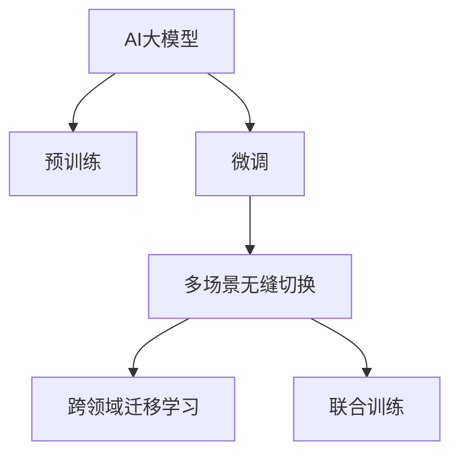

                 

## 1. 背景介绍

### 1.1 问题由来
随着电商平台的快速发展，用户和商家之间的交互方式日益多样化，如何高效地识别用户需求和商家意图，已成为电商平台智能化升级的关键。传统的方法依赖于规则引擎和特征工程，但这种方式难以覆盖复杂的业务场景，且规则库的维护成本高、更新难度大。

### 1.2 问题核心关键点
目前，AI大模型在电商平台的落地应用主要集中在单一场景的智能识别，如用户意图识别、商品推荐等。这些模型通常基于特定场景的训练数据进行微调，缺乏泛化能力和迁移能力。因此，如何将AI大模型从单一场景的智能识别扩展到多场景的无缝切换，是电商平台智能化升级的关键。

### 1.3 问题研究意义
通过将AI大模型应用于电商平台的多场景智能识别和无缝切换，可以提高用户体验、优化商家营销策略，同时大幅提升电商平台的运营效率。具体而言：

1. **提升用户体验**：AI大模型能够理解用户的多样化需求，提供个性化推荐和服务，提高用户满意度和粘性。
2. **优化商家营销**：通过分析用户行为数据，AI大模型可以帮助商家精准投放广告、优化商品列表，提升转化率和销售额。
3. **提升运营效率**：AI大模型能够自动化处理大量的用户查询和交易请求，减少人工干预，降低运营成本。

本文将详细探讨AI大模型在电商平台中的应用，并从单一场景的智能识别扩展到多场景的无缝切换，助力电商平台智能化升级。

## 2. 核心概念与联系

### 2.1 核心概念概述

为更好地理解AI大模型在电商平台中的应用，本节将介绍几个密切相关的核心概念：

- **AI大模型**：指基于深度学习的大规模预训练模型，如BERT、GPT等，具有强大的语言理解和生成能力，广泛应用于NLP领域。
- **预训练-微调(Fine-Tuning)**：指在大规模无标签文本数据上进行预训练，再在特定任务的少量标注数据上进行微调的过程，以提升模型在特定任务上的性能。
- **跨领域迁移学习**：指将一个领域学到的知识迁移到另一个不同但相关的领域，通过微调实现模型的泛化能力。
- **多场景无缝切换**：指在多场景下自动切换AI大模型的应用，使其在不同业务场景中均能保持高精度的智能识别能力。
- **联合训练**：指在多个模型或任务之间共享数据和模型参数，提升模型的泛化能力和迁移能力。

这些核心概念之间的逻辑关系可以通过以下Mermaid流程图来展示：



这个流程图展示了大模型从预训练到微调，再到多场景无缝切换和跨领域迁移学习的全过程：

1. 大模型通过预训练获得基础能力。
2. 在特定任务的少量标注数据上进行微调，提升模型在特定任务上的性能。
3. 通过多场景无缝切换，使模型在不同业务场景中均能保持高效工作。
4. 利用联合训练提升模型的泛化能力和迁移能力，应用于更广泛的任务和场景。

## 3. 核心算法原理 & 具体操作步骤
### 3.1 算法原理概述

AI大模型在电商平台中的应用，本质上是将预训练模型作为基础特征提取器，通过微调和多场景无缝切换，实现在不同业务场景下对用户需求和商家意图的智能识别。其核心思想是：

1. **预训练**：在大规模无标签文本数据上进行预训练，学习通用语言表示。
2. **微调**：在特定任务的少量标注数据上进行微调，提升模型在特定任务上的性能。
3. **多场景无缝切换**：在多个业务场景下自动切换AI大模型的应用，使其在不同场景中均能保持高效工作。
4. **跨领域迁移学习**：通过联合训练提升模型的泛化能力和迁移能力，应用于更广泛的任务和场景。

### 3.2 算法步骤详解

AI大模型在电商平台中的应用，通常包括以下几个关键步骤：

**Step 1: 准备数据集**
- 收集电商平台的历史交易数据、用户行为数据、商品描述数据等，作为预训练和微调的数据集。
- 将数据集划分为训练集、验证集和测试集，按需选择不同的预训练和微调任务。

**Step 2: 模型选择与初始化**
- 选择合适的预训练语言模型，如BERT、GPT等，作为基础特征提取器。
- 使用预训练模型对数据集进行预训练，学习通用语言表示。

**Step 3: 微调**
- 对特定任务的少量标注数据进行微调，提升模型在该任务上的性能。
- 选择合适的优化算法及其参数，如AdamW、SGD等，设置学习率、批大小、迭代轮数等。
- 设置正则化技术及强度，包括权重衰减、Dropout、Early Stopping等。
- 利用模型适配层，如Softmax分类器、解码器等，设计适当的输出和损失函数。

**Step 4: 多场景无缝切换**
- 对不同业务场景的数据集进行微调，获得多个针对特定场景的模型。
- 设计场景切换逻辑，根据用户行为和商家意图自动选择应用场景。
- 使用元学习策略，动态调整模型参数，实现多场景无缝切换。

**Step 5: 联合训练**
- 将多个预训练模型或微调后的模型进行联合训练，共享数据和参数。
- 通过多任务学习、多模态学习等方法，提升模型的泛化能力和迁移能力。
- 在新的业务场景下进行微调，应用于更广泛的任务和场景。

### 3.3 算法优缺点

AI大模型在电商平台中的应用具有以下优点：
1. 高效泛化：通过预训练和微调，模型能够高效泛化到不同的业务场景。
2. 减少标注成本：微调需要的标注样本较少，降低了数据标注成本。
3. 提升用户体验：智能识别用户需求，提供个性化推荐和服务，提升用户体验。
4. 优化商家营销：通过分析用户行为数据，优化商品推荐和广告投放，提升转化率和销售额。
5. 提升运营效率：自动处理大量的用户查询和交易请求，减少人工干预，降低运营成本。

同时，该方法也存在一定的局限性：
1. 依赖标注数据：微调和多场景无缝切换需要高质量的标注数据，标注成本较高。
2. 模型复杂度：大规模预训练模型的计算和存储开销较大，可能带来资源瓶颈。
3. 解释性不足：深度学习模型的决策过程缺乏可解释性，难以理解和调试。

尽管存在这些局限性，但就目前而言，AI大模型在电商平台中的应用仍然是智能化升级的重要手段。未来相关研究的重点在于如何进一步降低数据标注成本，提高模型的泛化能力和解释性。

### 3.4 算法应用领域

AI大模型在电商平台中的应用广泛，具体包括：

- **用户意图识别**：分析用户查询文本，识别用户意图，提供个性化推荐和服务。
- **商品推荐**：根据用户行为和偏好，推荐相关商品，提升用户满意度和购买率。
- **广告投放**：分析用户行为数据，优化广告投放策略，提高广告点击率和转化率。
- **交易审核**：自动审核交易请求，识别欺诈行为，提高交易安全性。
- **客服问答**：自动回答用户问题，减轻客服压力，提高客户满意度。

除了上述这些经典应用外，AI大模型还被创新性地应用到更多场景中，如库存管理、物流优化、风控管理等，为电商平台的智能化运营提供了强大的技术支撑。

## 4. 数学模型和公式 & 详细讲解
### 4.1 数学模型构建

本节将使用数学语言对AI大模型在电商平台中的应用进行更加严格的刻画。

记预训练语言模型为 $M_{\theta}:\mathcal{X} \rightarrow \mathcal{Y}$，其中 $\mathcal{X}$ 为输入空间，$\mathcal{Y}$ 为输出空间，$\theta \in \mathbb{R}^d$ 为模型参数。假设电商平台的历史交易数据、用户行为数据、商品描述数据等作为模型训练数据集 $D=\{(x_i,y_i)\}_{i=1}^N, x_i \in \mathcal{X}, y_i \in \mathcal{Y}$。

定义模型 $M_{\theta}$ 在输入 $x$ 上的损失函数为 $\ell(M_{\theta}(x),y)$，则在数据集 $D$ 上的经验风险为：

$$
\mathcal{L}(\theta) = \frac{1}{N} \sum_{i=1}^N \ell(M_{\theta}(x_i),y_i)
$$

微调的优化目标是最小化经验风险，即找到最优参数：

$$
\theta^* = \mathop{\arg\min}_{\theta} \mathcal{L}(\theta)
$$

在实践中，我们通常使用基于梯度的优化算法（如SGD、Adam等）来近似求解上述最优化问题。设 $\eta$ 为学习率，$\lambda$ 为正则化系数，则参数的更新公式为：

$$
\theta \leftarrow \theta - \eta \nabla_{\theta}\mathcal{L}(\theta) - \eta\lambda\theta
$$

其中 $\nabla_{\theta}\mathcal{L}(\theta)$ 为损失函数对参数 $\theta$ 的梯度，可通过反向传播算法高效计算。

### 4.2 公式推导过程

以下我们以商品推荐任务为例，推导基于AI大模型的推荐算法。

假设电商平台有 $N$ 个商品，用户的历史行为数据包含 $M$ 次浏览记录和 $K$ 次购买记录，模型需要根据用户的行为数据预测用户可能购买的商品。

记商品 $i$ 的特征表示为 $\mathbf{f}_i \in \mathbb{R}^d$，用户的特征表示为 $\mathbf{u}$，则推荐模型可以表示为：

$$
\hat{y}_i = M_{\theta}(\mathbf{f}_i, \mathbf{u})
$$

其中 $\hat{y}_i$ 为模型预测用户购买商品 $i$ 的概率。

为了训练推荐模型，我们可以使用负对数似然损失函数：

$$
\ell(M_{\theta}(\mathbf{f}_i, \mathbf{u}), y_i) = -\log(M_{\theta}(\mathbf{f}_i, \mathbf{u})) \quad \text{if} \quad y_i=1
$$

$$
\ell(M_{\theta}(\mathbf{f}_i, \mathbf{u}), y_i) = -\log(1-M_{\theta}(\mathbf{f}_i, \mathbf{u})) \quad \text{if} \quad y_i=0
$$

在训练过程中，我们可以使用交叉熵损失函数进行优化：

$$
\mathcal{L}(\theta) = -\frac{1}{N} \sum_{i=1}^N \left(y_i \log M_{\theta}(\mathbf{f}_i, \mathbf{u}) + (1-y_i) \log (1-M_{\theta}(\mathbf{f}_i, \mathbf{u})) \right)
$$

通过最小化上述损失函数，我们可以得到推荐的概率分布 $P_{\theta}(y|(\mathbf{f}_i, \mathbf{u}))$。

在实际应用中，我们可以将商品 $i$ 的特征 $\mathbf{f}_i$ 和用户特征 $\mathbf{u}$ 作为模型的输入，通过 Softmax 函数计算每个商品的推荐概率，选择概率最大的商品作为推荐结果。

## 5. 项目实践：代码实例和详细解释说明
### 5.1 开发环境搭建

在进行AI大模型在电商平台中的应用实践前，我们需要准备好开发环境。以下是使用Python进行PyTorch开发的环境配置流程：

1. 安装Anaconda：从官网下载并安装Anaconda，用于创建独立的Python环境。

2. 创建并激活虚拟环境：
```bash
conda create -n pytorch-env python=3.8 
conda activate pytorch-env
```

3. 安装PyTorch：根据CUDA版本，从官网获取对应的安装命令。例如：
```bash
conda install pytorch torchvision torchaudio cudatoolkit=11.1 -c pytorch -c conda-forge
```

4. 安装Transformers库：
```bash
pip install transformers
```

5. 安装各类工具包：
```bash
pip install numpy pandas scikit-learn matplotlib tqdm jupyter notebook ipython
```

完成上述步骤后，即可在`pytorch-env`环境中开始实践。

### 5.2 源代码详细实现

下面我们以电商平台的用户意图识别任务为例，给出使用Transformers库对BERT模型进行微调的PyTorch代码实现。

首先，定义用户意图识别的数据处理函数：

```python
from transformers import BertTokenizer
from torch.utils.data import Dataset
import torch

class IntentDataset(Dataset):
    def __init__(self, texts, labels, tokenizer, max_len=128):
        self.texts = texts
        self.labels = labels
        self.tokenizer = tokenizer
        self.max_len = max_len
        
    def __len__(self):
        return len(self.texts)
    
    def __getitem__(self, item):
        text = self.texts[item]
        label = self.labels[item]
        
        encoding = self.tokenizer(text, return_tensors='pt', max_length=self.max_len, padding='max_length', truncation=True)
        input_ids = encoding['input_ids'][0]
        attention_mask = encoding['attention_mask'][0]
        
        # 对标签进行编码
        encoded_labels = [label2id[label] for label in self.labels] 
        encoded_labels.extend([label2id['O']] * (self.max_len - len(encoded_labels)))
        labels = torch.tensor(encoded_labels, dtype=torch.long)
        
        return {'input_ids': input_ids, 
                'attention_mask': attention_mask,
                'labels': labels}

# 标签与id的映射
label2id = {'O': 0, 'Buy': 1, 'Look': 2, 'Return': 3}
id2label = {v: k for k, v in label2id.items()}

# 创建dataset
tokenizer = BertTokenizer.from_pretrained('bert-base-cased')

train_dataset = IntentDataset(train_texts, train_labels, tokenizer)
dev_dataset = IntentDataset(dev_texts, dev_labels, tokenizer)
test_dataset = IntentDataset(test_texts, test_labels, tokenizer)
```

然后，定义模型和优化器：

```python
from transformers import BertForTokenClassification, AdamW

model = BertForTokenClassification.from_pretrained('bert-base-cased', num_labels=len(label2id))

optimizer = AdamW(model.parameters(), lr=2e-5)
```

接着，定义训练和评估函数：

```python
from torch.utils.data import DataLoader
from tqdm import tqdm
from sklearn.metrics import classification_report

device = torch.device('cuda') if torch.cuda.is_available() else torch.device('cpu')
model.to(device)

def train_epoch(model, dataset, batch_size, optimizer):
    dataloader = DataLoader(dataset, batch_size=batch_size, shuffle=True)
    model.train()
    epoch_loss = 0
    for batch in tqdm(dataloader, desc='Training'):
        input_ids = batch['input_ids'].to(device)
        attention_mask = batch['attention_mask'].to(device)
        labels = batch['labels'].to(device)
        model.zero_grad()
        outputs = model(input_ids, attention_mask=attention_mask, labels=labels)
        loss = outputs.loss
        epoch_loss += loss.item()
        loss.backward()
        optimizer.step()
    return epoch_loss / len(dataloader)

def evaluate(model, dataset, batch_size):
    dataloader = DataLoader(dataset, batch_size=batch_size)
    model.eval()
    preds, labels = [], []
    with torch.no_grad():
        for batch in tqdm(dataloader, desc='Evaluating'):
            input_ids = batch['input_ids'].to(device)
            attention_mask = batch['attention_mask'].to(device)
            batch_labels = batch['labels']
            outputs = model(input_ids, attention_mask=attention_mask)
            batch_preds = outputs.logits.argmax(dim=2).to('cpu').tolist()
            batch_labels = batch_labels.to('cpu').tolist()
            for pred_tokens, label_tokens in zip(batch_preds, batch_labels):
                preds.append(pred_tokens[:len(label_tokens)])
                labels.append(label_tokens)
                
    print(classification_report(labels, preds))
```

最后，启动训练流程并在测试集上评估：

```python
epochs = 5
batch_size = 16

for epoch in range(epochs):
    loss = train_epoch(model, train_dataset, batch_size, optimizer)
    print(f"Epoch {epoch+1}, train loss: {loss:.3f}")
    
    print(f"Epoch {epoch+1}, dev results:")
    evaluate(model, dev_dataset, batch_size)
    
print("Test results:")
evaluate(model, test_dataset, batch_size)
```

以上就是使用PyTorch对BERT进行用户意图识别任务微调的完整代码实现。可以看到，得益于Transformers库的强大封装，我们可以用相对简洁的代码完成BERT模型的加载和微调。

### 5.3 代码解读与分析

让我们再详细解读一下关键代码的实现细节：

**IntentDataset类**：
- `__init__`方法：初始化文本、标签、分词器等关键组件。
- `__len__`方法：返回数据集的样本数量。
- `__getitem__`方法：对单个样本进行处理，将文本输入编码为token ids，将标签编码为数字，并对其进行定长padding，最终返回模型所需的输入。

**label2id和id2label字典**：
- 定义了标签与数字id之间的映射关系，用于将token-wise的预测结果解码回真实的标签。

**训练和评估函数**：
- 使用PyTorch的DataLoader对数据集进行批次化加载，供模型训练和推理使用。
- 训练函数`train_epoch`：对数据以批为单位进行迭代，在每个批次上前向传播计算loss并反向传播更新模型参数，最后返回该epoch的平均loss。
- 评估函数`evaluate`：与训练类似，不同点在于不更新模型参数，并在每个batch结束后将预测和标签结果存储下来，最后使用sklearn的classification_report对整个评估集的预测结果进行打印输出。

**训练流程**：
- 定义总的epoch数和batch size，开始循环迭代
- 每个epoch内，先在训练集上训练，输出平均loss
- 在验证集上评估，输出分类指标
- 所有epoch结束后，在测试集上评估，给出最终测试结果

可以看到，PyTorch配合Transformers库使得BERT微调的代码实现变得简洁高效。开发者可以将更多精力放在数据处理、模型改进等高层逻辑上，而不必过多关注底层的实现细节。

当然，工业级的系统实现还需考虑更多因素，如模型的保存和部署、超参数的自动搜索、更灵活的任务适配层等。但核心的微调范式基本与此类似。

## 6. 实际应用场景
### 6.1 智能客服系统

基于AI大模型的智能客服系统，可以广泛应用于电商平台的用户查询处理。传统的客服系统依赖于规则引擎和人工干预，无法及时响应复杂问题，且容易出错。而使用微调后的智能客服模型，可以7x24小时不间断服务，快速响应客户咨询，用自然流畅的语言解答各类常见问题。

在技术实现上，可以收集电商平台的客户咨询记录，将问题和最佳答复构建成监督数据，在此基础上对预训练客服模型进行微调。微调后的客服模型能够自动理解用户意图，匹配最合适的答复模板进行回复。对于客户提出的新问题，还可以接入检索系统实时搜索相关内容，动态组织生成回答。如此构建的智能客服系统，能大幅提升客户咨询体验和问题解决效率。

### 6.2 个性化推荐系统

当前的推荐系统往往只依赖用户的历史行为数据进行物品推荐，难以涵盖用户的真实兴趣和偏好。基于AI大模型的个性化推荐系统，可以更好地挖掘用户行为背后的语义信息，从而提供更精准、多样的推荐内容。

在实践中，可以收集用户浏览、点击、评论、分享等行为数据，提取和用户交互的物品标题、描述、标签等文本内容。将文本内容作为模型输入，用户的后续行为（如是否点击、购买等）作为监督信号，在此基础上微调预训练语言模型。微调后的模型能够从文本内容中准确把握用户的兴趣点。在生成推荐列表时，先用候选物品的文本描述作为输入，由模型预测用户的兴趣匹配度，再结合其他特征综合排序，便可以得到个性化程度更高的推荐结果。

### 6.3 多场景无缝切换

AI大模型在电商平台中的应用，不仅限于单一场景的智能识别，还需要在不同业务场景下实现无缝切换。这可以通过多任务学习和联合训练实现。

以电商平台的用户意图识别和商品推荐为例，假设平台同时提供查询服务和推荐服务，可以使用两个不同的模型进行微调。在用户进行查询时，使用意图识别模型预测用户意图，在用户浏览商品时，使用推荐模型预测用户可能购买的商品。这样，模型在多个场景下均能保持高效工作。

具体实现步骤如下：

1. 收集两个不同场景的训练数据，如用户查询和浏览记录。
2. 对两个数据集分别进行微调，获得两个不同的模型，分别用于意图识别和商品推荐。
3. 设计场景切换逻辑，根据用户行为动态选择应用场景，使用不同的模型进行预测。
4. 在联合训练过程中，共享两个模型的参数，提升模型的泛化能力和迁移能力，应用于更广泛的任务和场景。

通过多场景无缝切换，AI大模型能够灵活应对不同业务场景，提升电商平台的智能化水平。

### 6.4 未来应用展望

随着AI大模型和微调方法的不断发展，基于微调范式将在更多领域得到应用，为传统行业带来变革性影响。

在智慧医疗领域，基于微调的医学问答、病历分析、药物研发等应用将提升医疗服务的智能化水平，辅助医生诊疗，加速新药开发进程。

在智能教育领域，微调技术可应用于作业批改、学情分析、知识推荐等方面，因材施教，促进教育公平，提高教学质量。

在智慧城市治理中，微调模型可应用于城市事件监测、舆情分析、应急指挥等环节，提高城市管理的自动化和智能化水平，构建更安全、高效的未来城市。

此外，在企业生产、社会治理、文娱传媒等众多领域，基于大模型微调的人工智能应用也将不断涌现，为经济社会发展注入新的动力。相信随着技术的日益成熟，微调方法将成为人工智能落地应用的重要范式，推动人工智能技术在更广阔的领域加速渗透。

## 7. 工具和资源推荐
### 7.1 学习资源推荐

为了帮助开发者系统掌握AI大模型在电商平台中的应用，这里推荐一些优质的学习资源：

1. 《深度学习与自然语言处理》系列博文：由大模型技术专家撰写，深入浅出地介绍了深度学习、自然语言处理的基础概念和前沿技术。

2. 《自然语言处理与深度学习》课程：斯坦福大学开设的深度学习与自然语言处理课程，涵盖了深度学习模型的原理、应用和优化方法。

3. 《Transformers: A Survey of Attention Models》论文：全面综述了Transformer模型及其在自然语言处理中的应用，是理解Transformer的必备文献。

4. 《Python深度学习》书籍：涵盖了深度学习模型的实现和应用，是Python开发者学习深度学习的重要参考资料。

5. 《Natural Language Processing》书籍：全面介绍了自然语言处理的基础理论和实际应用，是NLP领域的经典教材。

通过对这些资源的学习实践，相信你一定能够快速掌握AI大模型在电商平台中的应用，并用于解决实际的NLP问题。
###  7.2 开发工具推荐

高效的开发离不开优秀的工具支持。以下是几款用于AI大模型在电商平台中应用开发的常用工具：

1. PyTorch：基于Python的开源深度学习框架，灵活动态的计算图，适合快速迭代研究。大部分预训练语言模型都有PyTorch版本的实现。

2. TensorFlow：由Google主导开发的开源深度学习框架，生产部署方便，适合大规模工程应用。同样有丰富的预训练语言模型资源。

3. Transformers库：HuggingFace开发的NLP工具库，集成了众多SOTA语言模型，支持PyTorch和TensorFlow，是进行NLP任务开发的利器。

4. Weights & Biases：模型训练的实验跟踪工具，可以记录和可视化模型训练过程中的各项指标，方便对比和调优。与主流深度学习框架无缝集成。

5. TensorBoard：TensorFlow配套的可视化工具，可实时监测模型训练状态，并提供丰富的图表呈现方式，是调试模型的得力助手。

6. Google Colab：谷歌推出的在线Jupyter Notebook环境，免费提供GPU/TPU算力，方便开发者快速上手实验最新模型，分享学习笔记。

合理利用这些工具，可以显著提升AI大模型在电商平台中的开发效率，加快创新迭代的步伐。

### 7.3 相关论文推荐

AI大模型和微调技术的发展源于学界的持续研究。以下是几篇奠基性的相关论文，推荐阅读：

1. Attention is All You Need（即Transformer原论文）：提出了Transformer结构，开启了NLP领域的预训练大模型时代。

2. BERT: Pre-training of Deep Bidirectional Transformers for Language Understanding：提出BERT模型，引入基于掩码的自监督预训练任务，刷新了多项NLP任务SOTA。

3. Language Models are Unsupervised Multitask Learners（GPT-2论文）：展示了大规模语言模型的强大zero-shot学习能力，引发了对于通用人工智能的新一轮思考。

4. Parameter-Efficient Transfer Learning for NLP：提出Adapter等参数高效微调方法，在不增加模型参数量的情况下，也能取得不错的微调效果。

5. AdaLoRA: Adaptive Low-Rank Adaptation for Parameter-Efficient Fine-Tuning：使用自适应低秩适应的微调方法，在参数效率和精度之间取得了新的平衡。

这些论文代表了大模型微调技术的发展脉络。通过学习这些前沿成果，可以帮助研究者把握学科前进方向，激发更多的创新灵感。

## 8. 总结：未来发展趋势与挑战

### 8.1 总结

本文对AI大模型在电商平台中的应用进行了全面系统的介绍。首先阐述了AI大模型和微调技术的研究背景和意义，明确了微调在电商平台智能化升级中的独特价值。其次，从原理到实践，详细讲解了AI大模型在电商平台中的应用，包括用户意图识别、商品推荐、智能客服等。通过多场景无缝切换和联合训练等技术，实现了模型在不同业务场景下的高效应用。最后，展望了AI大模型在电商平台的未来应用前景，以及面临的挑战和研究方向。

通过本文的系统梳理，可以看到，AI大模型在电商平台中的应用不仅限于单一场景的智能识别，更需要通过多场景无缝切换和联合训练，实现跨领域迁移和泛化。这种灵活的模型应用方式，将为电商平台带来更大的智能化升级空间。

### 8.2 未来发展趋势

展望未来，AI大模型在电商平台中的应用将呈现以下几个发展趋势：

1. 模型规模持续增大。随着算力成本的下降和数据规模的扩张，预训练语言模型的参数量还将持续增长。超大规模语言模型蕴含的丰富语言知识，有望支撑更加复杂多变的电商场景。

2. 微调方法日趋多样。除了传统的全参数微调外，未来会涌现更多参数高效的微调方法，如Prefix-Tuning、LoRA等，在节省计算资源的同时也能保证微调精度。

3. 跨领域迁移学习崛起。AI大模型将不仅限于电商领域，还会扩展到更多垂直领域，提升跨领域迁移能力。

4. 联合训练成为常态。在多个业务场景下进行联合训练，提升模型的泛化能力和迁移能力，应用于更广泛的任务和场景。

5. 多模态学习崛起。AI大模型将不仅限于文本数据，还会扩展到图像、视频、语音等多模态数据，提升模型对现实世界的理解和建模能力。

以上趋势凸显了AI大模型在电商平台中的巨大潜力和应用前景。这些方向的探索发展，必将进一步提升电商平台的智能化水平，促进商业模式的创新和优化。

### 8.3 面临的挑战

尽管AI大模型在电商平台中的应用取得了显著成效，但在迈向更加智能化、普适化应用的过程中，仍面临诸多挑战：

1. 标注成本瓶颈。虽然微调和多场景无缝切换需要高质量的标注数据，标注成本较高，难以大规模应用。如何进一步降低数据标注成本，将是一大难题。

2. 模型鲁棒性不足。当前AI大模型面对域外数据时，泛化性能往往大打折扣。对于测试样本的微小扰动，模型也容易发生波动。如何提高模型的鲁棒性，避免灾难性遗忘，还需要更多理论和实践的积累。

3. 推理效率有待提高。虽然AI大模型精度高，但在实际部署时往往面临推理速度慢、内存占用大等效率问题。如何在保证性能的同时，简化模型结构，提升推理速度，优化资源占用，将是重要的优化方向。

4. 可解释性不足。深度学习模型的决策过程缺乏可解释性，难以理解和调试。对于医疗、金融等高风险应用，算法的可解释性和可审计性尤为重要。如何赋予模型更强的可解释性，将是亟待攻克的难题。

5. 安全性有待保障。预训练语言模型难免会学习到有偏见、有害的信息，通过微调传递到下游任务，产生误导性、歧视性的输出，给实际应用带来安全隐患。如何从数据和算法层面消除模型偏见，避免恶意用途，确保输出的安全性，也将是重要的研究课题。

6. 知识整合能力不足。现有的AI大模型往往局限于任务内数据，难以灵活吸收和运用更广泛的先验知识。如何让微调过程更好地与外部知识库、规则库等专家知识结合，形成更加全面、准确的信息整合能力，还有很大的想象空间。

正视AI大模型在电商平台应用中面临的这些挑战，积极应对并寻求突破，将是大模型在电商平台的智能化升级中走向成熟的必由之路。相信随着学界和产业界的共同努力，这些挑战终将一一被克服，AI大模型在电商平台的智能化应用将更加广泛和深入。

### 8.4 研究展望

面对AI大模型在电商平台应用中面临的挑战，未来的研究需要在以下几个方面寻求新的突破：

1. 探索无监督和半监督微调方法。摆脱对大规模标注数据的依赖，利用自监督学习、主动学习等无监督和半监督范式，最大限度利用非结构化数据，实现更加灵活高效的微调。

2. 研究参数高效和计算高效的微调范式。开发更加参数高效的微调方法，在固定大部分预训练参数的同时，只更新极少量的任务相关参数。同时优化微调模型的计算图，减少前向传播和反向传播的资源消耗，实现更加轻量级、实时性的部署。

3. 引入更多先验知识。将符号化的先验知识，如知识图谱、逻辑规则等，与神经网络模型进行巧妙融合，引导微调过程学习更准确、合理的语言模型。同时加强不同模态数据的整合，实现视觉、语音等多模态信息与文本信息的协同建模。

4. 结合因果分析和博弈论工具。将因果分析方法引入微调模型，识别出模型决策的关键特征，增强输出解释的因果性和逻辑性。借助博弈论工具刻画人机交互过程，主动探索并规避模型的脆弱点，提高系统稳定性。

5. 纳入伦理道德约束。在模型训练目标中引入伦理导向的评估指标，过滤和惩罚有偏见、有害的输出倾向。同时加强人工干预和审核，建立模型行为的监管机制，确保输出符合人类价值观和伦理道德。

这些研究方向的探索，必将引领AI大模型在电商平台中的应用走向更高的台阶，为电商平台的智能化运营提供强大的技术支撑。面向未来，AI大模型需要与其他人工智能技术进行更深入的融合，如知识表示、因果推理、强化学习等，多路径协同发力，共同推动电商平台的智能化升级。只有勇于创新、敢于突破，才能不断拓展AI大模型的应用边界，让智能技术更好地造福电商平台的运营和发展。

