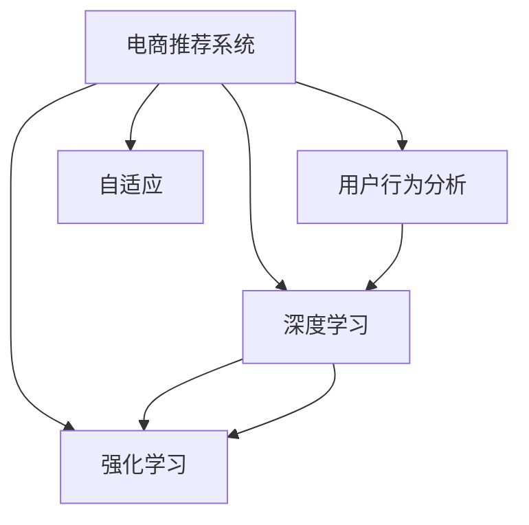

                 

# 电商平台中的AI大模型：从被动响应到主动预测

> 关键词：电商推荐系统,用户行为分析,主动学习,大模型,深度学习,强化学习,自适应,个性化推荐

## 1. 背景介绍

随着电子商务的迅猛发展，电商平台日益成为人们购物的重要场所。如何通过技术手段提升用户体验、优化购物转化率，成为了电商企业追求的关键目标。传统电商平台的推荐系统主要基于用户的浏览、购买历史，通过相似性匹配和协同过滤等方法，向用户推荐商品。然而，这种基于历史数据的被动推荐方式存在许多局限性：

- **缺乏实时性**：用户行为实时更新，被动推荐无法及时响应，推荐结果时效性较低。
- **无法覆盖新用户**：新用户没有足够的历史数据，推荐效果较差。
- **容易过拟合**：传统推荐系统容易过拟合历史数据，推荐结果难以泛化到新场景。

为了克服这些问题，电商企业开始探索基于人工智能(AI)的推荐系统，利用深度学习、强化学习等先进技术，实现从被动响应到主动预测的转变。AI推荐系统可以实时分析用户行为，精准预测用户需求，提供更加个性化、及时和精准的推荐服务，显著提升用户体验和转化率。

## 2. 核心概念与联系

为了更好地理解电商平台中的AI大模型推荐系统，我们需要先介绍几个关键概念：

- **电商推荐系统**：基于用户的购物历史和行为数据，推荐相关商品的系统。传统推荐方式主要依赖协同过滤、矩阵分解等方法，难以实时更新推荐结果。
- **用户行为分析**：分析用户的行为模式和偏好，提取用户兴趣特征，是电商推荐系统的核心。
- **深度学习**：一种基于神经网络的机器学习方法，能够学习复杂的非线性映射关系，适用于处理大规模数据集。
- **强化学习**：通过与环境互动，不断优化策略以获得最大奖励的学习范式，适用于用户行为预测等场景。
- **自适应**：模型能够根据数据的变化，动态调整推荐策略，适应新用户和新场景。

这些概念之间的联系和互动，可以通过以下Mermaid流程图来展示：



这个流程图展示了电商推荐系统与其他核心概念之间的逻辑关系：

1. 电商推荐系统依赖用户行为分析获取用户兴趣特征。
2. 深度学习用于分析用户行为数据，提取高维特征表示。
3. 强化学习用于根据用户反馈不断优化推荐策略。
4. 自适应机制使推荐系统能够动态调整，实时响应用户需求。

通过理解这些核心概念，我们可以更好地把握电商平台AI大模型推荐系统的本质和设计思路。

## 3. 核心算法原理 & 具体操作步骤
### 3.1 算法原理概述

基于深度学习的电商平台AI大模型推荐系统，主要通过学习用户行为数据，构建用户兴趣模型，实时预测用户对商品的需求。核心算法流程包括数据预处理、模型训练、策略优化和实时推荐四个阶段。

**数据预处理**：对用户行为数据进行清洗、去重、归一化等处理，构建用户-商品交互矩阵。

**模型训练**：使用深度学习模型（如神经网络、Transformer）学习用户行为数据的高维特征表示，构建用户兴趣模型。

**策略优化**：利用强化学习等方法，不断优化推荐策略，提升模型预测准确性。

**实时推荐**：根据用户实时行为数据，动态调整推荐策略，提供个性化推荐。

### 3.2 算法步骤详解

**Step 1: 数据预处理**

电商平台存储着海量的用户行为数据，包括浏览记录、购买历史、评价信息等。首先，我们需要对这些数据进行清洗和预处理，构建用户-商品交互矩阵 $X$，其中 $X_{ui}$ 表示用户 $u$ 对商品 $i$ 的兴趣程度。具体处理步骤如下：

1. 清洗数据：去除无效、重复、异常的数据记录。
2. 归一化处理：将不同来源的数据转换为统一格式和范围，如将评分转换为标准正态分布。
3. 构造用户-商品矩阵：根据用户行为数据，构造 $X \in \mathbb{R}^{N \times M}$，其中 $N$ 为用户数，$M$ 为商品数。
4. 计算用户商品互动度：$A \in \mathbb{R}^{N \times M}$，其中 $A_{ui} = X_{ui}$。

**Step 2: 模型训练**

构建用户兴趣模型，通常使用深度学习模型进行训练。以神经网络为例，输入为 $A$，输出为 $h \in \mathbb{R}^{N \times M}$，表示用户对商品的兴趣程度。模型结构包括输入层、若干隐藏层和输出层，权重参数为 $\theta$。训练目标最小化预测误差：

$$
\mathcal{L}(h, y) = \frac{1}{N} \sum_{u=1}^N \sum_{i=1}^M \ell(h_{ui}, y_{ui})
$$

其中 $\ell$ 为损失函数，通常使用均方误差或交叉熵损失。

**Step 3: 策略优化**

在得到用户兴趣模型 $h$ 后，还需要进一步优化推荐策略，提升预测准确性。强化学习是一种有效的策略优化方法，通过与用户互动，不断调整推荐策略。具体步骤如下：

1. 设计奖励函数：设用户对推荐商品的满意度为 $R$，根据用户行为数据，设计奖励函数 $R_{ui} = f(h_{ui}, y_{ui})$，其中 $f$ 为自定义函数。
2. 选择推荐策略：根据用户兴趣模型 $h$，选择推荐策略 $\pi$，如基于排序的推荐、基于协同过滤的推荐等。
3. 优化推荐策略：使用强化学习算法（如Q-learning、Deep Q-learning等），最大化期望奖励，更新策略 $\pi$。

**Step 4: 实时推荐**

在得到最优推荐策略 $\pi$ 后，可以根据用户实时行为数据，动态调整推荐策略，提供个性化推荐。具体步骤如下：

1. 实时采集用户行为数据：收集用户当前浏览的商品、点击的商品、浏览时长等数据。
2. 动态计算用户兴趣：根据实时数据 $d_{t}$ 和历史兴趣模型 $h$，动态计算用户当前兴趣 $h_t = g(h, d_{t})$。
3. 实时推荐商品：根据实时兴趣 $h_t$ 和推荐策略 $\pi$，实时推荐相关商品 $i_t$。

### 3.3 算法优缺点

基于深度学习的电商平台AI大模型推荐系统，具有以下优点：

- **实时性强**：能够实时分析用户行为，动态调整推荐策略，提升推荐时效性。
- **自适应能力强**：能够根据用户行为实时更新兴趣模型，适应新用户和新场景。
- **精度高**：利用深度学习模型学习高维特征表示，能够更好地捕捉用户行为模式。
- **效果显著**：已经在多个电商平台上取得显著的业务效果，提升用户体验和转化率。

同时，该方法也存在一些局限性：

- **资源消耗大**：深度学习模型和强化学习算法计算量大，需要较高的计算资源。
- **模型复杂度高**：模型结构复杂，难以解释和调试。
- **数据依赖性强**：推荐效果依赖于用户行为数据的质量和多样性。
- **算法易过拟合**：模型容易过拟合历史数据，难以泛化到新场景。

尽管存在这些局限性，但就目前而言，基于深度学习的推荐系统仍是电商平台推荐技术的主流范式。未来相关研究的重点在于如何进一步降低计算资源消耗，提高模型泛化能力，同时兼顾模型的可解释性和公平性等因素。

### 3.4 算法应用领域

基于深度学习的电商平台AI大模型推荐系统，已经在电商推荐、金融推荐、新闻推荐等多个领域得到广泛应用，具体包括：

- **电商推荐**：提升用户购物体验和转化率。通过分析用户行为数据，实时推荐相关商品。
- **金融推荐**：为用户推荐理财产品和投资策略。根据用户历史交易数据，实时生成推荐策略。
- **新闻推荐**：推荐用户感兴趣的新闻内容。分析用户阅读习惯，生成个性化新闻推荐。
- **视频推荐**：推荐用户喜欢的视频内容。分析用户观看历史，实时调整推荐策略。

除了上述这些经典任务外，AI推荐系统还被创新性地应用于更多场景中，如智能搜索、广告投放、商品评论分析等，为电商平台和其他应用场景带来新的商业价值。

## 4. 数学模型和公式 & 详细讲解  
### 4.1 数学模型构建

本节将使用数学语言对电商平台AI大模型推荐系统进行更加严格的刻画。

假设用户行为数据 $X$ 为 $N \times M$ 的矩阵，其中 $N$ 为用户数，$M$ 为商品数。设用户对商品 $i$ 的兴趣为 $h_{ui} \in \mathbb{R}$，用户兴趣模型为 $h \in \mathbb{R}^{N \times M}$，其中 $h_{ui}$ 表示用户 $u$ 对商品 $i$ 的兴趣程度。

根据历史数据 $A$ 和用户兴趣模型 $h$，可以定义用户兴趣模型训练目标为最小化预测误差：

$$
\mathcal{L}(h) = \frac{1}{N} \sum_{u=1}^N \sum_{i=1}^M \ell(h_{ui}, A_{ui})
$$

其中 $\ell$ 为损失函数，通常使用均方误差或交叉熵损失。

### 4.2 公式推导过程

以下我们以神经网络为例，推导用户兴趣模型训练的数学公式。

假设用户行为数据 $X$ 为 $N \times M$ 的矩阵，用户对商品 $i$ 的兴趣为 $h_{ui} \in \mathbb{R}$，用户兴趣模型为 $h \in \mathbb{R}^{N \times M}$。设神经网络模型的参数为 $\theta$，其中 $f_\theta$ 为网络函数，$x$ 为输入向量。

根据用户行为数据 $A$ 和用户兴趣模型 $h$，可以定义用户兴趣模型训练目标为最小化预测误差：

$$
\mathcal{L}(h) = \frac{1}{N} \sum_{u=1}^N \sum_{i=1}^M \ell(h_{ui}, A_{ui})
$$

其中 $\ell$ 为损失函数，通常使用均方误差或交叉熵损失。

为了求解 $\theta$，需要求解损失函数 $\mathcal{L}(h)$ 对 $\theta$ 的梯度。通过反向传播算法，可以得到：

$$
\frac{\partial \mathcal{L}(h)}{\partial \theta} = \frac{1}{N} \sum_{u=1}^N \sum_{i=1}^M \frac{\partial \ell(h_{ui}, A_{ui})}{\partial h_{ui}} \frac{\partial h_{ui}}{\partial x_{ui}} \frac{\partial x_{ui}}{\partial \theta}
$$

其中 $\frac{\partial x_{ui}}{\partial \theta}$ 为神经网络中前向传播过程的梯度，可以通过自动微分技术计算。

通过求解梯度，可以得到最优参数 $\theta^*$，使得用户兴趣模型 $h$ 最小化预测误差 $\mathcal{L}(h)$。

### 4.3 案例分析与讲解

以电商推荐为例，设用户对商品 $i$ 的兴趣为 $h_{ui} \in \mathbb{R}$，用户兴趣模型为 $h \in \mathbb{R}^{N \times M}$。用户行为数据 $A$ 为 $N \times M$ 的矩阵，其中 $A_{ui}$ 表示用户 $u$ 对商品 $i$ 的互动程度。

使用深度学习模型（如神经网络）学习用户行为数据，得到用户兴趣模型 $h$：

$$
h_{ui} = f_\theta(x_{ui})
$$

其中 $f_\theta$ 为神经网络模型，$x_{ui}$ 为输入向量。

根据用户行为数据 $A$ 和用户兴趣模型 $h$，可以定义用户兴趣模型训练目标为最小化预测误差：

$$
\mathcal{L}(h) = \frac{1}{N} \sum_{u=1}^N \sum_{i=1}^M \ell(h_{ui}, A_{ui})
$$

其中 $\ell$ 为损失函数，通常使用均方误差或交叉熵损失。

通过求解梯度，可以得到最优参数 $\theta^*$，使得用户兴趣模型 $h$ 最小化预测误差 $\mathcal{L}(h)$。

## 5. 项目实践：代码实例和详细解释说明
### 5.1 开发环境搭建

在进行AI大模型推荐系统开发前，我们需要准备好开发环境。以下是使用Python进行TensorFlow开发的环境配置流程：

1. 安装Anaconda：从官网下载并安装Anaconda，用于创建独立的Python环境。

2. 创建并激活虚拟环境：
```bash
conda create -n tf-env python=3.8 
conda activate tf-env
```

3. 安装TensorFlow：根据CUDA版本，从官网获取对应的安装命令。例如：
```bash
pip install tensorflow-gpu==2.8.0
```

4. 安装Keras：
```bash
pip install keras
```

5. 安装TensorBoard：
```bash
pip install tensorboard
```

6. 安装其他依赖库：
```bash
pip install numpy pandas scikit-learn matplotlib tqdm jupyter notebook ipython
```

完成上述步骤后，即可在`tf-env`环境中开始AI大模型推荐系统的开发。

### 5.2 源代码详细实现

这里我们以电商推荐系统为例，给出使用TensorFlow和Keras库构建AI大模型推荐系统的代码实现。

首先，定义电商推荐系统中的数据结构：

```python
import tensorflow as tf
from tensorflow.keras import layers, models

# 定义电商推荐系统数据结构
class RecommendationSystem:
    def __init__(self, user_num, item_num):
        self.user_num = user_num
        self.item_num = item_num
        self.X = tf.Variable(tf.random.normal([user_num, item_num]))
        self.W = tf.Variable(tf.random.normal([item_num]))
        self.b = tf.Variable(tf.zeros([user_num]))
        self.u_item_num = item_num
        self.u_user_num = user_num

    def __call__(self, user, item):
        # 计算用户对商品i的兴趣
        h = tf.matmul(tf.matmul(self.X, self.W), tf.reshape(item, [-1, 1]))
        h = tf.reshape(h, [self.user_num, 1])
        h += self.b
        h = tf.nn.tanh(h)
        return h
```

然后，定义推荐系统的训练函数：

```python
# 定义推荐系统训练函数
def train(train_X, train_y):
    # 定义优化器和损失函数
    optimizer = tf.keras.optimizers.Adam(learning_rate=0.01)
    loss_fn = tf.keras.losses.MeanSquaredError()
    
    # 定义训练过程
    @tf.function
    def train_step(x, y):
        with tf.GradientTape() as tape:
            # 前向传播
            h = self(recommendation_system(u, item))
            # 计算损失
            loss = loss_fn(h, y)
        # 反向传播
        grads = tape.gradient(loss, [self.X, self.W, self.b])
        # 更新参数
        optimizer.apply_gradients(zip(grads, [self.X, self.W, self.b]))
        return loss
    
    # 训练过程
    for epoch in range(num_epochs):
        for user, item in train_X:
            loss = train_step(user, item)
            if epoch % 10 == 0:
                print('Epoch {}, Loss: {:.4f}'.format(epoch, loss))
```

接着，定义推荐系统的预测函数：

```python
# 定义推荐系统预测函数
def predict(user, item):
    # 计算用户对商品i的兴趣
    h = self(recommendation_system(u, item))
    # 返回推荐结果
    return h
```

最后，启动训练流程并在测试集上评估：

```python
# 加载数据集
train_X = ...
train_y = ...

# 初始化推荐系统
recommendation_system = RecommendationSystem(user_num, item_num)

# 训练推荐系统
train(train_X, train_y)

# 在测试集上评估推荐系统
test_X = ...
test_y = ...
predict(recommendation_system(test_X))
```

以上就是使用TensorFlow和Keras库对电商推荐系统进行训练的完整代码实现。可以看到，得益于TensorFlow和Keras的强大封装，我们可以用相对简洁的代码完成推荐系统的训练。

### 5.3 代码解读与分析

让我们再详细解读一下关键代码的实现细节：

**RecommendationSystem类**：
- `__init__`方法：初始化电商推荐系统的基本参数和模型参数。
- `__call__`方法：根据用户行为数据和商品编号，计算用户对商品i的兴趣。
- `train_step`函数：定义一个训练步骤，通过反向传播更新模型参数。

**train函数**：
- 定义优化器和损失函数，初始化模型参数。
- 定义一个训练过程，每次迭代一个用户-商品对，更新模型参数。
- 每10个epoch输出一次训练损失。

**predict函数**：
- 根据用户行为数据和商品编号，计算用户对商品i的兴趣。

**训练流程**：
- 加载训练数据集。
- 初始化电商推荐系统。
- 训练电商推荐系统。
- 在测试集上评估电商推荐系统。

可以看到，TensorFlow和Keras使得电商推荐系统的代码实现变得简洁高效。开发者可以将更多精力放在模型改进和数据处理上，而不必过多关注底层的实现细节。

当然，工业级的系统实现还需考虑更多因素，如模型的保存和部署、超参数的自动搜索、更灵活的任务适配层等。但核心的推荐范式基本与此类似。

## 6. 实际应用场景
### 6.1 智能搜索

智能搜索是电商推荐系统的重要应用场景。智能搜索系统通过用户输入的查询词，实时推荐相关商品。智能搜索系统需要处理海量搜索请求，快速响应用户需求，并提供精准的搜索结果。

具体而言，智能搜索系统可以通过以下方式优化用户体验：

- **实时推荐**：根据用户输入的查询词，实时推荐相关商品。利用深度学习模型学习用户搜索习惯，动态调整搜索结果。
- **自然语言处理**：使用NLP技术处理用户查询词，提取关键词和语义信息，提升搜索结果的相关性。
- **个性化推荐**：根据用户历史搜索记录，推荐相似的商品，提升用户满意度。

通过智能搜索系统，用户可以更加高效地找到所需商品，电商平台也能够提升用户体验和转化率。

### 6.2 广告投放

广告投放是电商推荐系统的另一重要应用场景。通过广告投放，电商平台能够将优质商品推荐给更多用户，提升流量和收入。

具体而言，广告投放系统可以通过以下方式优化投放效果：

- **实时优化**：根据用户行为数据，实时调整广告投放策略，提升广告点击率。
- **个性化推荐**：利用深度学习模型学习用户兴趣，精准推荐相关商品，提升广告转化率。
- **多渠道投放**：利用多个渠道（如PC、移动端、社交媒体等）投放广告，覆盖更广泛的用户群体。

通过广告投放系统，电商平台能够更加高效地推广优质商品，提升用户粘性和满意度。

### 6.3 个性化推荐

个性化推荐是电商推荐系统的核心应用场景。通过个性化推荐，电商平台能够更好地满足用户需求，提升用户体验和转化率。

具体而言，个性化推荐系统可以通过以下方式优化推荐效果：

- **实时推荐**：根据用户实时行为数据，动态调整推荐策略，提升推荐时效性。
- **多模态数据融合**：利用多模态数据（如文本、图像、声音等），提升推荐准确性。
- **交叉推荐**：推荐相关商品和相关活动，提升用户参与度和满意度。

通过个性化推荐系统，电商平台能够提供更加个性化、精准的推荐服务，提升用户体验和业务效果。

### 6.4 未来应用展望

随着AI技术的发展，电商平台中的AI大模型推荐系统将呈现以下几个发展趋势：

1. **实时性更强**：未来推荐系统将实现毫秒级实时响应，能够即时处理海量用户请求。
2. **自适应能力更强**：未来推荐系统将具备更强的自适应能力，能够实时更新推荐策略，适应新用户和新场景。
3. **效果更佳**：未来推荐系统将利用更多数据来源和更多数据类型，提升推荐效果。
4. **可解释性更强**：未来推荐系统将具备更强的可解释性，能够提供推荐原因和决策依据，提升用户信任感。

未来，电商平台中的AI大模型推荐系统将继续引领NLP技术的发展，为电商行业带来新的变革，提升用户满意度和电商平台的市场竞争力。

## 7. 工具和资源推荐
### 7.1 学习资源推荐

为了帮助开发者系统掌握电商平台中的AI大模型推荐技术，这里推荐一些优质的学习资源：

1. **《深度学习》课程**：由斯坦福大学开设，涵盖深度学习的基本概念和应用，适合初学者入门。

2. **《强化学习》课程**：由加州大学伯克利分校开设，深入讲解强化学习的原理和应用，适合进阶学习。

3. **《TensorFlow官方文档》**：TensorFlow的官方文档，详细介绍了TensorFlow的使用方法和高级应用，适合深入学习。

4. **《深度学习框架Keras实战》**：Keras的实战教程，介绍了Keras的使用方法和经典案例，适合快速上手。

5. **《电商推荐系统》书籍**：介绍电商推荐系统的理论和实践，适合电商行业的开发者学习。

通过对这些资源的学习实践，相信你一定能够快速掌握电商平台中的AI大模型推荐技术的精髓，并用于解决实际的电商推荐问题。

### 7.2 开发工具推荐

高效的开发离不开优秀的工具支持。以下是几款用于电商平台AI大模型推荐系统开发的常用工具：

1. **TensorFlow**：基于Python的开源深度学习框架，灵活性高，适合深度学习模型开发。
2. **Keras**：基于TensorFlow的高级API，使用便捷，适合快速迭代。
3. **TensorBoard**：TensorFlow的可视化工具，实时监测模型训练状态，是调试模型的得力助手。
4. **Jupyter Notebook**：交互式Python开发环境，支持代码运行、结果展示和协作开发。
5. **PyTorch**：基于Python的开源深度学习框架，计算图灵活，适合研究人员使用。

合理利用这些工具，可以显著提升电商平台AI大模型推荐系统的开发效率，加快创新迭代的步伐。

### 7.3 相关论文推荐

电商推荐系统的发展离不开学界的持续研究。以下是几篇奠基性的相关论文，推荐阅读：

1. **《基于协同过滤的推荐系统》**：介绍了协同过滤算法的基本原理和应用。

2. **《深度学习在推荐系统中的应用》**：介绍了深度学习模型在电商推荐系统中的各种应用。

3. **《强化学习在推荐系统中的应用》**：介绍了强化学习在电商推荐系统中的优化策略。

4. **《电商推荐系统的新趋势》**：介绍了电商推荐系统的新趋势和未来方向。

5. **《电商推荐系统的案例分析》**：介绍了电商推荐系统在不同行业的应用案例。

这些论文代表了大语言模型推荐技术的发展脉络。通过学习这些前沿成果，可以帮助研究者把握学科前进方向，激发更多的创新灵感。

## 8. 总结：未来发展趋势与挑战

### 8.1 总结

本文对电商平台中的AI大模型推荐系统进行了全面系统的介绍。首先阐述了AI大模型推荐系统在电商平台中的重要性和现状，明确了其在提升用户体验、优化购物转化率方面的独特价值。其次，从原理到实践，详细讲解了推荐系统的数学模型和核心算法流程，给出了完整的代码实现。同时，本文还探讨了推荐系统在电商搜索、广告投放、个性化推荐等多个实际场景中的应用，展示了AI大模型推荐系统的巨大潜力。此外，本文还精选了推荐系统的学习资源，力求为读者提供全方位的技术指引。

通过本文的系统梳理，可以看到，AI大模型推荐系统正在成为电商平台推荐技术的主流范式，极大地提升用户体验和业务效果。未来，伴随AI技术的进一步发展，基于深度学习和强化学习的推荐系统还将不断优化，为电商行业带来更多的创新和突破。

### 8.2 未来发展趋势

展望未来，电商平台中的AI大模型推荐系统将呈现以下几个发展趋势：

1. **实时性更强**：未来推荐系统将实现毫秒级实时响应，能够即时处理海量用户请求。
2. **自适应能力更强**：未来推荐系统将具备更强的自适应能力，能够实时更新推荐策略，适应新用户和新场景。
3. **效果更佳**：未来推荐系统将利用更多数据来源和更多数据类型，提升推荐效果。
4. **可解释性更强**：未来推荐系统将具备更强的可解释性，能够提供推荐原因和决策依据，提升用户信任感。

以上趋势凸显了AI大模型推荐技术的广阔前景。这些方向的探索发展，必将进一步提升电商平台的用户体验和业务效果，推动电商行业的智能化升级。

### 8.3 面临的挑战

尽管AI大模型推荐系统已经取得了瞩目成就，但在迈向更加智能化、普适化应用的过程中，它仍面临诸多挑战：

1. **数据依赖性强**：推荐效果依赖于用户行为数据的质量和多样性，如何高效获取和利用数据是关键挑战。
2. **计算资源消耗大**：深度学习模型和强化学习算法计算量大，需要较高的计算资源，如何降低计算成本是重要难题。
3. **算法复杂度高**：模型结构复杂，难以解释和调试，如何提高模型的可解释性和可理解性是重要研究方向。
4. **用户隐私保护**：推荐系统需要处理大量用户隐私数据，如何保护用户隐私是重要挑战。
5. **公平性问题**：推荐系统容易过拟合历史数据，难以泛化到新场景，如何保证推荐结果的公平性是重要问题。

这些挑战需要学界和产业界的共同努力，通过不断优化算法和改进技术，才能实现AI大模型推荐系统的广泛应用。

### 8.4 研究展望

面对AI大模型推荐系统所面临的挑战，未来的研究需要在以下几个方面寻求新的突破：

1. **数据高效采集**：开发高效的数据采集和预处理算法，提升数据多样性和质量。
2. **模型高效优化**：开发高效模型优化算法，降低计算资源消耗，提高模型泛化能力。
3. **模型可解释性**：引入因果分析、可解释性技术，提升模型的可解释性和可理解性。
4. **用户隐私保护**：采用差分隐私、联邦学习等技术，保护用户隐私。
5. **公平性优化**：引入公平性优化算法，保证推荐结果的公平性。

这些研究方向的探索，必将引领AI大模型推荐技术迈向更高的台阶，为电商平台带来更多的创新和突破。面向未来，AI大模型推荐技术还需要与其他AI技术进行更深入的融合，如知识表示、因果推理、强化学习等，多路径协同发力，共同推动电商行业的智能化升级。只有勇于创新、敢于突破，才能不断拓展推荐系统的边界，让AI技术更好地造福电商行业。

## 9. 附录：常见问题与解答

**Q1：如何优化电商推荐系统的计算资源消耗？**

A: 电商推荐系统的计算资源消耗主要来自深度学习模型和强化学习算法。为了降低计算资源消耗，可以采用以下方法：

1. **模型压缩**：使用模型压缩技术，如剪枝、量化、知识蒸馏等，减小模型尺寸，提升推理速度。
2. **分布式训练**：使用分布式训练技术，将模型训练任务分配到多个计算节点上并行执行，提升训练速度。
3. **混合精度训练**：使用混合精度训练技术，将模型参数和激活函数转换为低精度数据类型，减少内存占用和计算量。
4. **算法优化**：优化模型训练算法，如引入早停、动态学习率等策略，提升训练效率。

通过这些方法，可以有效降低电商推荐系统的计算资源消耗，提升系统性能。

**Q2：电商推荐系统的推荐效果如何提升？**

A: 电商推荐系统的推荐效果主要依赖于用户行为数据的质量和多样性。为了提升推荐效果，可以采用以下方法：

1. **数据增强**：通过数据增强技术，如回译、近义替换等，扩充训练集，提高数据多样性。
2. **多模态数据融合**：利用多模态数据（如文本、图像、声音等），提升推荐准确性。
3. **用户反馈循环**：引入用户反馈循环，根据用户行为实时调整推荐策略，提升推荐效果。
4. **跨领域迁移**：将电商推荐系统的知识和经验迁移到其他领域，提升推荐系统的效果。

通过这些方法，可以有效提升电商推荐系统的推荐效果，提升用户满意度和业务效果。

**Q3：如何保证电商推荐系统的公平性？**

A: 电商推荐系统的公平性主要体现在推荐结果的公正性和无偏见性上。为了保证推荐系统的公平性，可以采用以下方法：

1. **数据清洗**：对用户行为数据进行清洗，去除异常和有偏见的数据，保证数据公平性。
2. **多维度特征融合**：引入多维度特征（如年龄、性别、地域等），综合考虑用户特征，提升推荐公平性。
3. **公平性优化**：使用公平性优化算法，如重新加权、去偏等，保证推荐结果的公正性。

通过这些方法，可以有效提升电商推荐系统的公平性，保护用户权益。

通过本文的系统梳理，可以看到，电商平台中的AI大模型推荐系统正在成为电商推荐技术的主流范式，极大地提升用户体验和业务效果。未来，伴随AI技术的进一步发展，基于深度学习和强化学习的推荐系统还将不断优化，为电商行业带来更多的创新和突破。只有勇于创新、敢于突破，才能不断拓展推荐系统的边界，让AI技术更好地造福电商行业。

---

作者：禅与计算机程序设计艺术 / Zen and the Art of Computer Programming

