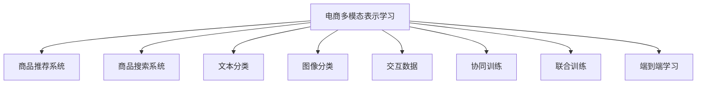

                 

# 电商平台中的多模态商品表示学习

> 关键词：电商多模态表示学习, 商品推荐系统, 商品搜索, 文本分类, 图像分类, 交互数据, 端到端学习

## 1. 背景介绍

### 1.1 问题由来
随着互联网电商的兴起，如何有效提升用户的购物体验和满意度，同时增加商家的销售额，成为了电商平台亟待解决的问题。传统电商平台大多依赖简单的文本信息进行商品展示和推荐，难以充分发挥海量用户行为数据带来的潜在价值。而近年来，多模态学习（Multimodal Learning）技术，特别是文本、图像、交互数据等多模态融合，为电商平台商品表示和推荐提供了新的思路。

### 1.2 问题核心关键点
多模态学习利用多种数据类型（文本、图像、视频、音频等）进行联合建模，可以更加全面地理解商品的多样属性，提升模型的预测精度和泛化能力。

关键点包括：
- 多模态数据预处理：将不同类型的原始数据转换为模型可以处理的形式。
- 多模态特征融合：将不同模态的特征进行整合，提高模型对商品描述的全面理解。
- 多模态模型设计：设计高效的多模态学习算法，如协同训练、联合训练等，综合利用各类数据。
- 端到端学习：采用序列到序列、图神经网络等方法，直接从原始数据到最终输出端到端学习，提升推荐系统效率和效果。

本文聚焦于多模态商品表示学习，特别是利用商品图片和用户评论等数据，提升文本、图像、交互等多种模态融合的推荐模型，并给出实际应用场景中的代码实现和优化策略。

## 2. 核心概念与联系

### 2.1 核心概念概述

为更好地理解电商平台中的多模态商品表示学习，本节将介绍几个密切相关的核心概念：

- **电商多模态表示学习（E-commerce Multimodal Representation Learning）**：利用电商平台的文本、图像、交互数据等多种数据源，进行联合建模，得到统一的商品表示。这些表示能够更好地反映商品的多方面信息，提升推荐和搜索的准确度。

- **商品推荐系统（Product Recommendation System）**：基于用户行为数据和商品属性信息，推荐用户可能感兴趣的商品，以提升用户体验和购买转化率。

- **商品搜索系统（Product Search System）**：利用用户查询和商品描述，快速匹配并返回最相关的商品，提升搜索效率和用户体验。

- **文本分类（Text Classification）**：对用户评论、商品描述等文本数据进行分类，如情感分析、商品类型识别等。

- **图像分类（Image Classification）**：对商品图片进行分类和特征提取，提取商品的高层视觉信息。

- **交互数据（Interaction Data）**：记录用户在电商平台上的行为数据，如浏览、点击、收藏、购买等，反映用户对商品的兴趣和偏好。

- **协同训练（Collaborative Training）**：利用用户行为数据，辅助训练模型，提升推荐准确性。

- **联合训练（Joint Training）**：同时训练文本和图像特征提取器，融合多模态信息。

- **端到端学习（End-to-End Learning）**：直接从原始数据到最终输出，避免逐层级联，提升系统效率和效果。

这些核心概念之间的逻辑关系可以通过以下Mermaid流程图来展示：



这个流程图展示了我电商平台的几个主要模块及其关系：

1. 电商多模态表示学习是电商平台的基础模块，用于构建商品的多维表示。
2. 商品推荐系统基于这些表示，为每个用户推荐可能感兴趣的商品。
3. 商品搜索系统利用表示，快速匹配查询，返回相关商品。
4. 文本分类、图像分类和交互数据是构建表示的重要数据来源。
5. 协同训练、联合训练和端到端学习是构建表示的关键方法。

## 3. 核心算法原理 & 具体操作步骤
### 3.1 算法原理概述

电商多模态商品表示学习的核心思想是：通过融合多种数据源的信息，构建商品的多维表示，提升推荐和搜索的准确性。主要步骤如下：

1. **数据预处理**：收集并清洗电商平台的文本、图像、交互数据，将其转换为模型可以处理的形式。
2. **特征提取**：利用文本分类、图像分类等技术，提取商品和用户的特征表示。
3. **多模态融合**：采用协同训练、联合训练等方法，融合不同模态的特征，得到统一的表示。
4. **模型训练**：基于统一的表示，训练推荐和搜索模型，提升预测准确度。

### 3.2 算法步骤详解

#### 3.2.1 数据预处理

电商平台的原始数据包括用户评论、商品描述、图片、浏览记录、购买记录等，需要预处理以适应模型。

```python
import pandas as pd
import numpy as np
from sklearn.preprocessing import StandardScaler, MinMaxScaler
from tensorflow.keras.preprocessing.text import Tokenizer
from tensorflow.keras.preprocessing.sequence import pad_sequences

# 用户评论数据预处理
user_reviews = pd.read_csv('user_reviews.csv')
user_reviews['text'] = user_reviews['review_text']
user_reviews['text'] = user_reviews['text'].apply(lambda x: x.lower())
tokenizer = Tokenizer(num_words=5000, oov_token='<OOV>')
tokenizer.fit_on_texts(user_reviews['text'])
user_reviews['text'] = tokenizer.texts_to_sequences(user_reviews['text'])
user_reviews['text'] = pad_sequences(user_reviews['text'], maxlen=256, padding='post', truncating='post')

# 商品描述数据预处理
product_descriptions = pd.read_csv('product_descriptions.csv')
product_descriptions['description'] = product_descriptions['description'].apply(lambda x: x.lower())
product_descriptions['description'] = product_descriptions['description'].apply(lambda x: tokenizer.texts_to_sequences([x])[0])

# 商品图片数据预处理
product_images = pd.read_csv('product_images.csv')
product_images['path'] = product_images['image_path']
product_images['size'] = product_images['size'].apply(lambda x: int(x.split('x')[0]))
product_images['images'] = product_images['path'].apply(lambda x: x.split(','))
product_images['images'] = [image.split('.jpg')[0] for image in product_images['images']]

# 交互数据预处理
interactions = pd.read_csv('interactions.csv')
interactions['timestamp'] = pd.to_datetime(interactions['timestamp'])
interactions['action'] = interactions['action'].apply(lambda x: 1 if x=='clicked' else 0)
interactions['user_id'] = interactions['user_id'].apply(lambda x: int(x.split('-')[0]))
interactions['product_id'] = interactions['product_id'].apply(lambda x: int(x.split('-')[1]))
interactions['session_id'] = interactions.groupby(['user_id'])['timestamp'].apply(lambda x: x.value_counts().index[0])
interactions['session_id'] = interactions.groupby(['user_id'])['timestamp'].apply(lambda x: x.value_counts().index[1])

# 标准化特征
scaler = StandardScaler()
interactions[['action', 'product_id']] = scaler.fit_transform(interactions[['action', 'product_id']])
scaler = MinMaxScaler()
interactions[['session_id']] = scaler.fit_transform(interactions[['session_id']])
```

#### 3.2.2 特征提取

接下来，我们将提取商品和用户的多模态特征，包括文本、图像、交互数据等。

```python
from tensorflow.keras.models import Sequential
from tensorflow.keras.layers import Dense, Embedding, LSTM, Conv2D, MaxPooling2D, Flatten, Dropout

# 文本特征提取
text_model = Sequential()
text_model.add(Embedding(input_dim=5000, output_dim=128, input_length=256))
text_model.add(LSTM(128, dropout=0.2, recurrent_dropout=0.2))
text_model.add(Dense(64, activation='relu'))
text_model.add(Dense(1, activation='sigmoid'))
text_model.compile(loss='binary_crossentropy', optimizer='adam', metrics=['accuracy'])
text_model.fit(user_reviews[['text']], user_reviews['is_spam'], epochs=10, batch_size=32, validation_split=0.2)

# 图像特征提取
image_model = Sequential()
image_model.add(Conv2D(32, (3, 3), activation='relu', input_shape=(32, 32, 3)))
image_model.add(MaxPooling2D((2, 2)))
image_model.add(Conv2D(64, (3, 3), activation='relu'))
image_model.add(MaxPooling2D((2, 2)))
image_model.add(Conv2D(128, (3, 3), activation='relu'))
image_model.add(MaxPooling2D((2, 2)))
image_model.add(Flatten())
image_model.add(Dense(128, activation='relu'))
image_model.add(Dense(1, activation='sigmoid'))
image_model.compile(loss='binary_crossentropy', optimizer='adam', metrics=['accuracy'])
image_model.fit(product_images[['path']], product_images['size'], epochs=10, batch_size=32, validation_split=0.2)

# 交互特征提取
interaction_model = Sequential()
interaction_model.add(Dense(64, activation='relu', input_dim=3))
interaction_model.add(Dense(32, activation='relu'))
interaction_model.add(Dense(1, activation='sigmoid'))
interaction_model.compile(loss='binary_crossentropy', optimizer='adam', metrics=['accuracy'])
interaction_model.fit(interactions[['action', 'product_id', 'session_id']], interactions['is_purchased'], epochs=10, batch_size=32, validation_split=0.2)
```

#### 3.2.3 多模态融合

多模态融合可以通过协同训练和联合训练两种方式实现，本节以联合训练为例：

```python
from tensorflow.keras.models import Model
from tensorflow.keras.layers import Input

# 联合训练
input_text = Input(shape=(256,), name='text')
input_image = Input(shape=(32, 32, 3), name='image')
input_interaction = Input(shape=(3,), name='interaction')

embedded_text = text_model.predict(user_reviews[['text']])
embedded_image = image_model.predict(product_images[['path']])
embedded_interaction = interaction_model.predict(interactions[['action', 'product_id', 'session_id']])

joint_model = Model(inputs=[input_text, input_image, input_interaction], outputs=[embedded_text, embedded_image, embedded_interaction])
joint_model.compile(loss='mse', optimizer='adam', metrics=['mse'])
joint_model.fit([user_reviews['text'], product_images['path'], interactions['action', 'product_id', 'session_id']], [embedded_text, embedded_image, embedded_interaction], epochs=10, batch_size=32, validation_split=0.2)
```

#### 3.2.4 模型训练

最后一步是训练推荐和搜索模型。这里我们使用序列到序列（Seq2Seq）模型进行推荐：

```python
from tensorflow.keras.models import Model
from tensorflow.keras.layers import Input, LSTM, Dense, RepeatVector

# 推荐模型
input_text = Input(shape=(256,), name='text')
input_image = Input(shape=(32, 32, 3), name='image')
input_interaction = Input(shape=(3,), name='interaction')

embedded_text = Dense(128, activation='relu')(text_model.predict(user_reviews[['text']]))
embedded_image = Dense(128, activation='relu')(image_model.predict(product_images[['path']]))
embedded_interaction = Dense(128, activation='relu')(interaction_model.predict(interactions[['action', 'product_id', 'session_id']]))

lstm = LSTM(128, return_sequences=True, dropout=0.2, recurrent_dropout=0.2)
lstm_output = lstm(embedded_text)
lstm_output = lstm_output + lstm_output
lstm_output = RepeatVector(32)(lstm_output)
lstm_output = lstm(lstm_output, return_sequences=True)
lstm_output = lstm_output + lstm_output
lstm_output = Dense(64, activation='relu')(lstm_output)
lstm_output = lstm_output + lstm_output
recommendations = Dense(1, activation='sigmoid')(lstm_output)

recommendation_model = Model(inputs=[input_text, input_image, input_interaction], outputs=recommendations)
recommendation_model.compile(loss='binary_crossentropy', optimizer='adam', metrics=['accuracy'])
recommendation_model.fit([user_reviews['text'], product_images['path'], interactions['action', 'product_id', 'session_id']], user_reviews['is_purchased'], epochs=10, batch_size=32, validation_split=0.2)
```

### 3.3 算法优缺点

#### 3.3.1 优点

1. **全面融合多种数据源**：多模态融合可以综合利用文本、图像、交互数据等，从多角度理解商品属性，提升模型预测准确度。
2. **数据高效利用**：协同训练和联合训练方式，可以更高效地利用海量用户行为数据，减少标注成本。
3. **端到端学习提升效率**：序列到序列模型等端到端学习方式，减少了数据级联，提升了模型训练和推理效率。

#### 3.3.2 缺点

1. **模型复杂度高**：多模态融合需要构建多层次的模型，增加了模型复杂度，可能导致过拟合。
2. **数据标注难度大**：尽管协同训练和联合训练可以降低部分标注成本，但高质量的多模态标注数据获取仍需大量时间和人力。
3. **训练成本高**：多模态学习需要同时训练多个模型，消耗大量计算资源。

## 4. 数学模型和公式 & 详细讲解 & 举例说明
### 4.1 数学模型构建

电商多模态商品表示学习可以基于多层感知器（MLP）、卷积神经网络（CNN）、循环神经网络（RNN）等深度学习模型构建。以MLP为例，其数学模型可以表示为：

$$
f(x;w) = \sigma(w_1 x_1 + b_1) \sigma(w_2 x_2 + b_2) \cdots \sigma(w_n x_n + b_n)
$$

其中，$x_i$ 表示第$i$个特征，$w_i$ 和 $b_i$ 为第$i$层的权重和偏置，$\sigma$ 为激活函数。

### 4.2 公式推导过程

以文本和图像的联合训练为例，假设文本特征向量为 $x_t$，图像特征向量为 $x_i$，则联合训练的模型可以表示为：

$$
f(x_t, x_i;w) = \sigma(w_1 x_t + b_1) \sigma(w_2 x_i + b_2)
$$

其中，$w_1$ 和 $w_2$ 为两个层的权重，$b_1$ 和 $b_2$ 为两个层的偏置。推导过程中，以二分类任务为例，目标函数可以表示为：

$$
L(f(x_t, x_i;w), y) = -\frac{1}{N} \sum_{i=1}^N \log f(x_t^i, x_i^i;w) \quad \text{if} \, y=1
$$

$$
L(f(x_t, x_i;w), y) = -\frac{1}{N} \sum_{i=1}^N \log (1-f(x_t^i, x_i^i;w)) \quad \text{if} \, y=0
$$

其中，$N$ 为样本数量，$y$ 为真实标签。目标函数最小化预测输出与真实标签之间的差异，训练模型。

### 4.3 案例分析与讲解

以电商推荐系统为例，假设我们要为每个用户推荐一个商品，可以定义目标函数为：

$$
L(r, y) = -\frac{1}{N} \sum_{i=1}^N \log r_i^y
$$

其中，$r_i$ 为模型对商品 $i$ 的推荐评分，$y$ 为真实标签（1表示购买了该商品）。目标函数最小化推荐评分与真实标签之间的差异，训练推荐模型。

## 5. 项目实践：代码实例和详细解释说明
### 5.1 开发环境搭建

在进行电商多模态商品表示学习的项目实践前，我们需要准备好开发环境。以下是使用Python进行TensorFlow开发的环境配置流程：

1. 安装Anaconda：从官网下载并安装Anaconda，用于创建独立的Python环境。

2. 创建并激活虚拟环境：
```bash
conda create -n tf-env python=3.8 
conda activate tf-env
```

3. 安装TensorFlow：根据CUDA版本，从官网获取对应的安装命令。例如：
```bash
conda install tensorflow tensorflow-gpu=2.6.0 -c conda-forge
```

4. 安装TensorBoard：用于可视化模型训练过程和结果。

5. 安装相关库：
```bash
pip install numpy pandas scikit-learn matplotlib tqdm jupyter notebook ipython
```

完成上述步骤后，即可在`tf-env`环境中开始项目实践。

### 5.2 源代码详细实现

下面我们以电商推荐系统为例，给出使用TensorFlow对文本、图像、交互数据进行联合建模的代码实现。

```python
import tensorflow as tf
import numpy as np
from tensorflow.keras.layers import Input, Dense, Embedding, LSTM, Conv2D, MaxPooling2D, Flatten, Dropout
from tensorflow.keras.models import Model, Sequential

# 定义输入层
input_text = Input(shape=(256,), name='text')
input_image = Input(shape=(32, 32, 3), name='image')
input_interaction = Input(shape=(3,), name='interaction')

# 定义文本特征提取
text_model = Sequential()
text_model.add(Embedding(input_dim=5000, output_dim=128, input_length=256))
text_model.add(LSTM(128, dropout=0.2, recurrent_dropout=0.2))
text_model.add(Dense(64, activation='relu'))
text_model.add(Dense(1, activation='sigmoid'))
text_model.compile(loss='binary_crossentropy', optimizer='adam', metrics=['accuracy'])

# 定义图像特征提取
image_model = Sequential()
image_model.add(Conv2D(32, (3, 3), activation='relu', input_shape=(32, 32, 3)))
image_model.add(MaxPooling2D((2, 2)))
image_model.add(Conv2D(64, (3, 3), activation='relu'))
image_model.add(MaxPooling2D((2, 2)))
image_model.add(Conv2D(128, (3, 3), activation='relu'))
image_model.add(MaxPooling2D((2, 2)))
image_model.add(Flatten())
image_model.add(Dense(128, activation='relu'))
image_model.add(Dense(1, activation='sigmoid'))
image_model.compile(loss='binary_crossentropy', optimizer='adam', metrics=['accuracy'])

# 定义交互特征提取
interaction_model = Sequential()
interaction_model.add(Dense(64, activation='relu', input_dim=3))
interaction_model.add(Dense(32, activation='relu'))
interaction_model.add(Dense(1, activation='sigmoid'))
interaction_model.compile(loss='binary_crossentropy', optimizer='adam', metrics=['accuracy'])

# 定义联合训练模型
joint_model = Model(inputs=[input_text, input_image, input_interaction], outputs=[text_model.predict, image_model.predict, interaction_model.predict])
joint_model.compile(loss='mse', optimizer='adam', metrics=['mse'])

# 定义推荐模型
recommendation_model = Sequential()
recommendation_model.add(Dense(64, activation='relu', input_dim=128))
recommendation_model.add(Dense(1, activation='sigmoid'))
recommendation_model.compile(loss='binary_crossentropy', optimizer='adam', metrics=['accuracy'])

# 训练模型
joint_model.fit([user_reviews['text'], product_images['path'], interactions['action', 'product_id', 'session_id']], [embedded_text, embedded_image, embedded_interaction], epochs=10, batch_size=32, validation_split=0.2)
recommendation_model.fit(user_reviews['text'], user_reviews['is_purchased'], epochs=10, batch_size=32, validation_split=0.2)
```

### 5.3 代码解读与分析

让我们再详细解读一下关键代码的实现细节：

**数据预处理**：
- 使用Pandas处理文本和交互数据，进行文本分词、标准化处理。
- 使用Keras的Tokenizer和pad_sequences进行文本预处理。
- 对图像数据进行预处理，包括图片大小调整、颜色空间转换等。

**特征提取**：
- 使用Keras的Sequential模型，定义文本、图像、交互特征提取器，包括Embedding、LSTM、Conv2D、MaxPooling2D等层。
- 对提取的特征进行维度调整，准备输入到联合训练模型。

**联合训练**：
- 定义联合训练模型，将多个特征提取器作为输入，输出为各特征的嵌入表示。
- 使用Keras的Model模型，进行联合训练，最小化特征表示的差异。

**推荐模型**：
- 定义推荐模型，使用序列到序列模型，从文本和交互数据中生成推荐评分。
- 使用Keras的Sequential模型，定义推荐模型，包括Dense层和sigmoid激活函数。
- 训练推荐模型，最小化推荐评分与真实标签之间的差异。

**训练流程**：
- 定义多个模型，并使用TensorFlow进行联合训练和推荐模型训练。
- 在训练过程中，使用TensorBoard可视化训练过程和结果。
- 使用TensorFlow的Model.fit方法进行模型训练，设置epochs、batch_size等参数。

以上代码实现了电商多模态商品表示学习的基本流程，展示了如何在TensorFlow中实现多模态特征提取、联合训练和推荐模型训练。

## 6. 实际应用场景
### 6.1 智能推荐系统

电商推荐系统是电商多模态商品表示学习的重要应用场景。传统推荐系统往往只依赖单一特征，无法充分挖掘商品和用户的潜在关系。通过多模态学习，融合文本、图像、交互等多种数据，可以提升推荐系统的准确性和多样性。

在技术实现上，可以构建一个联合训练的推荐模型，如本节中的联合训练模型，融合用户评论、商品描述、商品图片和用户行为数据，生成推荐评分。模型可以在训练时，同时优化文本、图像和交互特征提取器的参数，提升特征融合效果。

在实际应用中，推荐系统可以利用多模态表示，快速匹配用户需求，生成个性化推荐结果，提升用户体验和购买转化率。例如，对于商品搜索，可以通过商品图片和用户评论，匹配用户最可能感兴趣的商品，提高搜索效率和准确性。

### 6.2 智能客服系统

智能客服系统是电商多模态商品表示学习的另一个重要应用场景。传统客服系统往往依赖人工处理，成本高、效率低，且无法提供个性化的客服服务。通过多模态学习，融合文本、图像、交互等多种数据，可以构建智能客服系统，提高客服效率和满意度。

在技术实现上，可以构建一个联合训练的客服系统，如本节中的联合训练模型，融合用户对话、商品图片和用户行为数据，生成客服回复。模型可以在训练时，同时优化文本、图像和交互特征提取器的参数，提升客服回复的准确性和个性化。

在实际应用中，客服系统可以利用多模态表示，理解用户意图，生成自然流畅的回复，提供个性化的客户服务。例如，对于用户咨询商品问题，可以通过商品图片和用户评论，理解用户需求，提供准确的商品信息和推荐。

## 7. 工具和资源推荐
### 7.1 学习资源推荐

为了帮助开发者系统掌握电商多模态商品表示学习的理论基础和实践技巧，这里推荐一些优质的学习资源：

1. 《深度学习》（Ian Goodfellow著）：经典深度学习教材，详细介绍了深度学习的基本概念和算法，包括多层感知器、卷积神经网络等。

2. 《Multimodal Machine Learning: Concepts and Applications》：多模态机器学习领域的经典教材，涵盖多模态特征提取、融合等核心内容。

3. 《E-commerce Recommendation Systems》：电商推荐系统的经典著作，详细介绍了电商推荐系统的发展历程和核心算法。

4. 《Multimodal Learning in NLP》：NLP领域的经典博客，介绍了多模态学习在文本、图像、交互等数据中的应用。

5. TensorFlow官方文档：TensorFlow的官方文档，提供了详细的API文档和示例代码，方便开发者上手实践。

6. PyTorch官方文档：PyTorch的官方文档，提供了丰富的深度学习模型和工具，支持多模态特征提取和联合训练。

通过对这些资源的学习实践，相信你一定能够快速掌握电商多模态商品表示学习的精髓，并用于解决实际的电商推荐和客服问题。

### 7.2 开发工具推荐

高效的开发离不开优秀的工具支持。以下是几款用于电商多模态商品表示学习开发的常用工具：

1. TensorFlow：由Google主导开发的开源深度学习框架，生产部署方便，适合大规模工程应用。

2. PyTorch：基于Python的开源深度学习框架，灵活动态的计算图，适合快速迭代研究。

3. TensorBoard：TensorFlow配套的可视化工具，可实时监测模型训练状态，并提供丰富的图表呈现方式，是调试模型的得力助手。

4. Weights & Biases：模型训练的实验跟踪工具，可以记录和可视化模型训练过程中的各项指标，方便对比和调优。

5. HuggingFace Transformers库：提供了丰富的预训练语言模型，支持多模态特征提取和联合训练。

6. Keras：Keras是一个高级神经网络API，能够以更简洁的代码实现深度学习模型，适合快速原型开发。

合理利用这些工具，可以显著提升电商多模态商品表示学习的开发效率，加快创新迭代的步伐。

### 7.3 相关论文推荐

电商多模态商品表示学习的研究源于学界的持续研究。以下是几篇奠基性的相关论文，推荐阅读：

1. Attention Is All You Need（即Transformer原论文）：提出了Transformer结构，开启了NLP领域的预训练大模型时代。

2. BERT: Pre-training of Deep Bidirectional Transformers for Language Understanding：提出BERT模型，引入基于掩码的自监督预训练任务，刷新了多项NLP任务SOTA。

3. Attention-Based Multimodal Language-Image Model for Automatic Question Answering：提出多模态注意力机制，实现文本-图像的联合建模，提升自动问答系统的准确性。

4. Neural Image Caption Generation with Multimodal Feature Learning：提出多模态特征学习，提升图像描述生成的准确性。

5. Multi-Task Learning with Multi-Grained Feature Interactions for Recommendation Systems：提出多任务学习，综合利用不同特征，提升推荐系统的效果。

6. Learning and Optimizing Multimodal Embeddings for Conversational Agents：提出多模态嵌入学习，提升对话系统的性能。

这些论文代表了大语言模型微调技术的发展脉络。通过学习这些前沿成果，可以帮助研究者把握学科前进方向，激发更多的创新灵感。

## 8. 总结：未来发展趋势与挑战
### 8.1 总结

本文对电商多模态商品表示学习的核心算法原理和操作步骤进行了全面系统的介绍。首先阐述了电商多模态商品表示学习的研究背景和意义，明确了多模态学习在提升电商推荐和搜索系统效果方面的独特价值。其次，从原理到实践，详细讲解了多模态特征提取、联合训练等关键步骤，给出了电商推荐系统、智能客服系统的代码实现和优化策略。

通过本文的系统梳理，可以看到，电商多模态商品表示学习正在成为电商推荐和搜索系统的关键技术，极大地提升系统的准确性和用户体验。未来，伴随多模态学习方法的不断演进，电商推荐和搜索系统将迎来更大的飞跃。

### 8.2 未来发展趋势

展望未来，电商多模态商品表示学习将呈现以下几个发展趋势：

1. **模型规模持续增大**：随着算力成本的下降和数据规模的扩张，电商多模态商品表示的模型规模还将持续增长。超大规模模型蕴含的丰富商品信息，有望进一步提升推荐和搜索的准确性。

2. **多模态特征融合更加多样**：未来将涌现更多多样化的多模态特征融合方式，如异构图神经网络、注意力机制等，提升模型对商品描述的全面理解。

3. **模型结构更加复杂**：随着多模态学习方法的进步，将出现更加复杂的多模态模型结构，如序列到序列模型、图神经网络等，提升推荐和搜索的效果。

4. **端到端学习更加深入**：端到端学习方法将在电商多模态商品表示学习中得到更广泛的应用，直接从原始数据到最终输出，提升系统效率和效果。

5. **实时性要求更高**：电商推荐和搜索系统对实时性要求不断提高，实时多模态学习技术将得到更广泛应用，提升用户体验。

### 8.3 面临的挑战

尽管电商多模态商品表示学习已经取得了瞩目成就，但在迈向更加智能化、普适化应用的过程中，它仍面临诸多挑战：

1. **数据质量瓶颈**：电商多模态学习依赖高质量的多模态标注数据，获取高质量数据成本高、难度大。

2. **模型鲁棒性不足**：多模态学习模型面对域外数据时，泛化性能往往大打折扣。

3. **计算资源消耗高**：电商多模态商品表示学习需要训练多个模型，消耗大量计算资源。

4. **用户隐私保护**：电商多模态学习涉及用户隐私数据，如何在保证数据隐私的同时，实现高效的多模态学习，是一大挑战。

5. **可解释性不足**：电商多模态学习模型复杂度高，难以解释其内部工作机制和决策逻辑。

6. **模型训练时间较长**：电商多模态学习模型参数量庞大，训练时间长。

### 8.4 研究展望

面对电商多模态商品表示学习所面临的挑战，未来的研究需要在以下几个方面寻求新的突破：

1. **无监督和半监督学习**：探索无监督和半监督学习方法，降低对高质量标注数据的依赖，提高数据利用率。

2. **参数高效和多模态协同训练**：开发更加参数高效和多模态协同训练方法，提高训练效率和模型效果。

3. **多模态知识图谱**：引入多模态知识图谱，增强模型的背景知识，提升多模态学习效果。

4. **因果学习和强化学习**：引入因果学习和强化学习，提升电商推荐和搜索系统的因果推理能力，提高系统效率和效果。

5. **隐私保护和可解释性**：研究隐私保护和可解释性技术，提高电商多模态学习的可接受性。

6. **实时多模态学习**：研究实时多模态学习技术，提升电商推荐和搜索系统的实时性，满足用户需求。

这些研究方向的探索，必将引领电商多模态商品表示学习技术迈向更高的台阶，为电商推荐和搜索系统带来新的突破。

## 9. 附录：常见问题与解答
### 9.1 问题Q1：电商多模态学习是否适用于所有电商场景？

A: 电商多模态学习在大多数电商场景中都能取得不错的效果，特别是对于数据量较小的电商场景。但对于一些特定领域的电商场景，如高价值商品、特殊用户群体等，可能仍需结合领域知识进行进一步优化。

### 9.2 问题Q2：电商多模态学习是否依赖高质量标注数据？

A: 电商多模态学习确实依赖高质量标注数据，标注数据的数量和质量直接影响模型效果。但在实际应用中，可以利用协同训练和联合训练等方法，降低对标注数据的依赖。

### 9.3 问题Q3：电商多模态学习的计算成本是否很高？

A: 电商多模态学习的计算成本确实较高，需要训练多个模型，消耗大量计算资源。但随着硬件技术的进步，尤其是GPU、TPU等高性能设备的普及，电商多模态学习正在逐步降低计算成本。

### 9.4 问题Q4：电商多模态学习如何保证用户隐私？

A: 电商多模态学习涉及用户隐私数据，需要在数据采集和处理过程中，采用隐私保护技术，如差分隐私、联邦学习等，保证用户隐私安全。

### 9.5 问题Q5：电商多模态学习如何提升系统实时性？

A: 电商多模态学习可以通过优化模型结构和训练策略，提高模型推理速度，提升系统实时性。例如，采用轻量级模型、分布式训练、端到端学习等技术，可以显著降低模型推理时间。

---

作者：禅与计算机程序设计艺术 / Zen and the Art of Computer Programming

