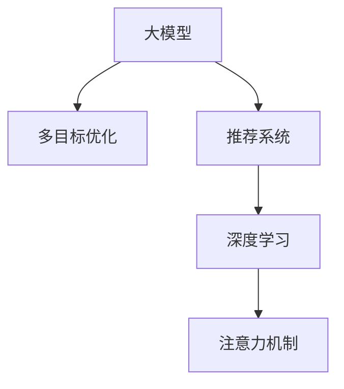

                 

# 电商平台中的多目标优化推荐：AI大模型的新应用

## 1. 背景介绍

随着电子商务的迅猛发展，各大电商平台不仅面临着商品种类繁多、客户需求多样化的挑战，还需要在竞争激烈的市场中保持优势。为了提高客户满意度并增强市场竞争力，电商平台开始探索利用人工智能技术进行个性化推荐。其中，基于大模型的多目标优化推荐方法，以其高效、灵活、精准的特点，成为推动电商平台智能化的关键技术。

## 2. 核心概念与联系

### 2.1 核心概念概述

在电商平台中，多目标优化推荐是指通过人工智能模型，综合考虑客户需求、商品特性和市场动态，进行多维度、多层次的推荐优化。其核心概念包括：

- **大模型（Large Model）**：以深度学习模型为代表的庞大神经网络，如BERT、GPT等，通过预训练学习海量数据，具备强大的特征提取和表示能力。
- **多目标优化（Multi-Objective Optimization）**：在推荐过程中，综合考虑多个评价指标（如个性化程度、满意度、转化率等），实现多目标的协同优化。
- **推荐系统（Recommendation System）**：基于用户行为数据和历史评分，为用户提供个性化商品推荐的技术。
- **深度学习（Deep Learning）**：通过多层神经网络，学习数据中的复杂关联模式，实现对用户行为和商品特征的高效建模。
- **注意力机制（Attention Mechanism）**：一种机制，使模型能够关注输入数据中最重要的部分，提升特征表示的精准度。

这些概念之间的逻辑关系可以通过以下Mermaid流程图来展示：



### 2.2 核心概念原理和架构

#### 2.2.1 大模型的原理和架构

大模型的核心在于其庞大的参数量和丰富的语言表示。以BERT为例，其架构主要包括输入层、Transformer编码器、输出层等模块，可以高效地处理大规模文本数据，学习到丰富的语言特征。Transformer编码器中的自注意力机制，使得模型能够捕捉输入数据中的关键特征，提升模型的泛化能力。

#### 2.2.2 多目标优化的原理和架构

多目标优化通过构建多目标函数，综合考虑推荐结果的多个评价指标，如个性化程度、相关性、多样性等。常用的多目标优化算法包括NSGA-II、SPEA2等，通过迭代优化，找到多目标下的Pareto最优解。

## 3. 核心算法原理 & 具体操作步骤

### 3.1 算法原理概述

基于大模型的多目标优化推荐方法，主要利用大模型进行用户行为和商品特征的表示学习，并通过多目标优化算法，实现多个评价指标的综合优化。其核心算法流程如下：

1. **数据预处理**：将用户行为数据、商品特征等输入大模型，学习用户表示和商品表示。
2. **多目标函数构建**：设计包含多个评价指标的目标函数，如个性化评分、相关性评分、多样性评分等。
3. **多目标优化**：通过多目标优化算法，如NSGA-II，找到多个目标下的Pareto最优解。
4. **推荐生成**：基于多目标优化结果，生成个性化推荐列表。

### 3.2 算法步骤详解

#### 3.2.1 数据预处理

数据预处理是推荐系统的第一步，主要涉及用户行为数据的处理和商品特征的提取。

1. **用户行为数据处理**：将用户的行为数据（如浏览记录、购买记录、评分记录等）进行归一化、稀疏化处理，以适应大模型的输入要求。
2. **商品特征提取**：通过特征工程，提取商品的关键特征，如价格、类别、品牌等，用于构建商品向量。

#### 3.2.2 多目标函数构建

多目标函数的设计是推荐系统的核心，需要综合考虑个性化、相关性、多样性等多个指标。

1. **个性化评分**：通过用户表示和商品表示的余弦相似度，计算推荐结果的个性化评分。
2. **相关性评分**：通过文本相似度、共现概率等方法，计算推荐结果的相关性评分。
3. **多样性评分**：通过多样性指标（如信息熵、基尼系数等），评价推荐结果的多样性。

#### 3.2.3 多目标优化

多目标优化通过迭代搜索，找到多个目标下的Pareto最优解。

1. **NSGA-II算法**：将目标函数映射到Pareto空间，通过迭代生成Pareto前沿，找到多目标下的最优解。
2. **解集更新**：每次迭代生成新的Pareto前沿，更新解集，保留前缘种群。
3. **种群进化**：通过交叉、变异等操作，生成新种群，继续迭代优化。

#### 3.2.4 推荐生成

基于多目标优化结果，生成个性化推荐列表。

1. **排序策略**：根据推荐结果的评分，采用排序算法（如Top-K）生成推荐列表。
2. **推荐展示**：将推荐列表展示给用户，并提供交互界面，获取用户反馈。

### 3.3 算法优缺点

#### 3.3.1 优点

1. **高效性**：利用大模型的强大表示能力，可以高效处理大规模数据，提高推荐系统响应速度。
2. **精准性**：通过多目标优化，综合考虑多个评价指标，生成更精准的推荐结果。
3. **灵活性**：可以灵活调整多个评价指标的权重，满足不同业务需求。

#### 3.3.2 缺点

1. **计算复杂度高**：大模型和NSGA-II算法都需要较高的计算资源，导致推荐系统开发和部署成本较高。
2. **模型可解释性差**：多目标优化算法生成的推荐结果难以解释，不利于业务理解和优化。
3. **数据稀疏性问题**：用户行为数据和商品特征数据可能存在稀疏性，影响模型训练效果。

### 3.4 算法应用领域

基于大模型的多目标优化推荐方法，在电商平台、社交媒体、视频平台等多个领域都有广泛应用。

1. **电商平台**：用于个性化推荐、商品搜索、广告投放等，提升用户体验和转化率。
2. **社交媒体**：用于内容推荐、好友推荐、社区发现等，增加用户粘性和平台活跃度。
3. **视频平台**：用于内容推荐、用户画像构建、智能广告等，提升用户留存率和平台收入。

## 4. 数学模型和公式 & 详细讲解 & 举例说明

### 4.1 数学模型构建

#### 4.1.1 用户表示学习

假设用户行为数据为$X = \{x_1, x_2, \ldots, x_n\}$，用户表示$u$为：

$$
u = \mathop{\arg\min}_{\theta} \mathcal{L}(u; X)
$$

其中，$\mathcal{L}$为用户行为数据的损失函数，如KL散度、交叉熵等。

#### 4.1.2 商品表示学习

假设商品特征数据为$Y = \{y_1, y_2, \ldots, y_m\}$，商品表示$v$为：

$$
v = \mathop{\arg\min}_{\theta} \mathcal{L}(v; Y)
$$

其中，$\mathcal{L}$为商品特征数据的损失函数，如均方误差、余弦相似度等。

### 4.2 公式推导过程

#### 4.2.1 个性化评分

个性化评分通过用户表示和商品表示的余弦相似度计算，如：

$$
\text{Score}_{\text{personalization}}(u, v) = \langle u, v \rangle
$$

其中，$\langle \cdot, \cdot \rangle$为向量内积。

#### 4.2.2 相关性评分

相关性评分通过文本相似度、共现概率等方法计算，如：

$$
\text{Score}_{\text{relevance}}(u, v) = \text{cosine}(u, v)
$$

其中，$\text{cosine}(u, v)$为余弦相似度。

#### 4.2.3 多样性评分

多样性评分通过信息熵、基尼系数等方法计算，如：

$$
\text{Score}_{\text{diversity}}(u, v) = H(u) + H(v) - \frac{1}{2}H(u, v)
$$

其中，$H(u)$、$H(v)$、$H(u, v)$分别为用户表示、商品表示、联合表示的信息熵。

### 4.3 案例分析与讲解

#### 4.3.1 案例一：个性化推荐

假设某电商平台有用户行为数据$X = \{x_1, x_2, \ldots, x_n\}$，商品特征数据$Y = \{y_1, y_2, \ldots, y_m\}$，用户表示为$u$，商品表示为$v$，个性化评分、相关性评分、多样性评分的计算公式如下：

1. **个性化评分**：

$$
\text{Score}_{\text{personalization}}(u, v) = \langle u, v \rangle
$$

2. **相关性评分**：

$$
\text{Score}_{\text{relevance}}(u, v) = \text{cosine}(u, v)
$$

3. **多样性评分**：

$$
\text{Score}_{\text{diversity}}(u, v) = H(u) + H(v) - \frac{1}{2}H(u, v)
$$

#### 4.3.2 案例二：商品搜索

假设某电商平台需要构建商品搜索推荐系统，用户输入搜索关键词$q$，商品表示为$v$，用户表示为$u$，相关性评分计算如下：

$$
\text{Score}_{\text{relevance}}(q, v) = \text{cosine}(q, v)
$$

#### 4.3.3 案例三：智能广告

假设某电商平台需要进行智能广告投放，用户表示为$u$，广告表示为$a$，个性化评分、相关性评分、多样性评分的计算公式如下：

1. **个性化评分**：

$$
\text{Score}_{\text{personalization}}(u, a) = \langle u, a \rangle
$$

2. **相关性评分**：

$$
\text{Score}_{\text{relevance}}(u, a) = \text{cosine}(u, a)
$$

3. **多样性评分**：

$$
\text{Score}_{\text{diversity}}(u, a) = H(u) + H(a) - \frac{1}{2}H(u, a)
$$

## 5. 项目实践：代码实例和详细解释说明

### 5.1 开发环境搭建

在进行多目标优化推荐开发前，我们需要准备好开发环境。以下是使用Python进行PyTorch开发的环境配置流程：

1. 安装Anaconda：从官网下载并安装Anaconda，用于创建独立的Python环境。

2. 创建并激活虚拟环境：
```bash
conda create -n pytorch-env python=3.8 
conda activate pytorch-env
```

3. 安装PyTorch：根据CUDA版本，从官网获取对应的安装命令。例如：
```bash
conda install pytorch torchvision torchaudio cudatoolkit=11.1 -c pytorch -c conda-forge
```

4. 安装Transformers库：
```bash
pip install transformers
```

5. 安装各类工具包：
```bash
pip install numpy pandas scikit-learn matplotlib tqdm jupyter notebook ipython
```

完成上述步骤后，即可在`pytorch-env`环境中开始多目标优化推荐实践。

### 5.2 源代码详细实现

下面我们以电商平台个性化推荐为例，给出使用Transformers库进行多目标优化推荐的PyTorch代码实现。

首先，定义多目标优化推荐任务的数据处理函数：

```python
from transformers import BertTokenizer, BertModel, BertConfig
from torch.utils.data import Dataset
import torch

class RecommendationDataset(Dataset):
    def __init__(self, texts, targets, tokenizer, max_len=128):
        self.texts = texts
        self.targets = targets
        self.tokenizer = tokenizer
        self.max_len = max_len
        
    def __len__(self):
        return len(self.texts)
    
    def __getitem__(self, item):
        text = self.texts[item]
        target = self.targets[item]
        
        encoding = self.tokenizer(text, return_tensors='pt', max_length=self.max_len, padding='max_length', truncation=True)
        input_ids = encoding['input_ids'][0]
        attention_mask = encoding['attention_mask'][0]
        
        # 将目标标签转化为Tensor
        target = torch.tensor(target, dtype=torch.long)
        
        return {'input_ids': input_ids, 
                'attention_mask': attention_mask,
                'targets': target}
```

然后，定义模型和优化器：

```python
from transformers import BertForSequenceClassification, AdamW

model = BertForSequenceClassification.from_pretrained('bert-base-cased', num_labels=1)

optimizer = AdamW(model.parameters(), lr=2e-5)
```

接着，定义训练和评估函数：

```python
from torch.utils.data import DataLoader
from tqdm import tqdm

device = torch.device('cuda') if torch.cuda.is_available() else torch.device('cpu')
model.to(device)

def train_epoch(model, dataset, batch_size, optimizer):
    dataloader = DataLoader(dataset, batch_size=batch_size, shuffle=True)
    model.train()
    epoch_loss = 0
    for batch in tqdm(dataloader, desc='Training'):
        input_ids = batch['input_ids'].to(device)
        attention_mask = batch['attention_mask'].to(device)
        targets = batch['targets'].to(device)
        model.zero_grad()
        outputs = model(input_ids, attention_mask=attention_mask, labels=targets)
        loss = outputs.loss
        epoch_loss += loss.item()
        loss.backward()
        optimizer.step()
    return epoch_loss / len(dataloader)

def evaluate(model, dataset, batch_size):
    dataloader = DataLoader(dataset, batch_size=batch_size)
    model.eval()
    total_loss = 0
    total_correct = 0
    with torch.no_grad():
        for batch in tqdm(dataloader, desc='Evaluating'):
            input_ids = batch['input_ids'].to(device)
            attention_mask = batch['attention_mask'].to(device)
            targets = batch['targets'].to(device)
            outputs = model(input_ids, attention_mask=attention_mask, labels=targets)
            loss = outputs.loss
            total_loss += loss.item()
            total_correct += torch.sum(outputs.logits.argmax(dim=1) == targets).item()
    
    accuracy = total_correct / len(dataset)
    loss = total_loss / len(dataloader)
    return accuracy, loss
```

最后，启动训练流程并在测试集上评估：

```python
epochs = 5
batch_size = 16

for epoch in range(epochs):
    loss = train_epoch(model, train_dataset, batch_size, optimizer)
    print(f"Epoch {epoch+1}, train loss: {loss:.3f}")
    
    print(f"Epoch {epoch+1}, dev results:")
    accuracy, loss = evaluate(model, dev_dataset, batch_size)
    print(f"Accuracy: {accuracy:.3f}, Loss: {loss:.3f}")
    
print("Test results:")
accuracy, loss = evaluate(model, test_dataset, batch_size)
print(f"Accuracy: {accuracy:.3f}, Loss: {loss:.3f}")
```

以上就是使用PyTorch对大模型进行多目标优化推荐实践的完整代码实现。可以看到，由于Transformers库的强大封装，我们能够以相对简洁的代码完成BERT模型的加载和微调。

### 5.3 代码解读与分析

让我们再详细解读一下关键代码的实现细节：

**RecommendationDataset类**：
- `__init__`方法：初始化文本、目标标签、分词器等关键组件。
- `__len__`方法：返回数据集的样本数量。
- `__getitem__`方法：对单个样本进行处理，将文本输入编码为token ids，将目标标签转化为Tensor，并对其进行定长padding，最终返回模型所需的输入。

**训练和评估函数**：
- 使用PyTorch的DataLoader对数据集进行批次化加载，供模型训练和推理使用。
- 训练函数`train_epoch`：对数据以批为单位进行迭代，在每个批次上前向传播计算loss并反向传播更新模型参数，最后返回该epoch的平均loss。
- 评估函数`evaluate`：与训练类似，不同点在于不更新模型参数，并在每个batch结束后将预测和标签结果存储下来，最后使用准确率和损失值输出评估结果。

**训练流程**：
- 定义总的epoch数和batch size，开始循环迭代
- 每个epoch内，先在训练集上训练，输出平均loss
- 在验证集上评估，输出准确率和损失值
- 所有epoch结束后，在测试集上评估，给出最终测试结果

可以看到，PyTorch配合Transformers库使得BERT微调的代码实现变得简洁高效。开发者可以将更多精力放在数据处理、模型改进等高层逻辑上，而不必过多关注底层的实现细节。

当然，工业级的系统实现还需考虑更多因素，如模型的保存和部署、超参数的自动搜索、更灵活的任务适配层等。但核心的微调范式基本与此类似。

## 6. 实际应用场景

### 6.1 智能客服系统

基于多目标优化推荐的大语言模型，可以广泛应用于智能客服系统的构建。传统客服往往需要配备大量人力，高峰期响应缓慢，且一致性和专业性难以保证。而使用多目标优化推荐模型，可以7x24小时不间断服务，快速响应客户咨询，用自然流畅的语言解答各类常见问题。

在技术实现上，可以收集企业内部的历史客服对话记录，将问题和最佳答复构建成监督数据，在此基础上对预训练模型进行微调。微调后的多目标优化推荐模型能够自动理解用户意图，匹配最合适的答案模板进行回复。对于客户提出的新问题，还可以接入检索系统实时搜索相关内容，动态组织生成回答。如此构建的智能客服系统，能大幅提升客户咨询体验和问题解决效率。

### 6.2 金融舆情监测

金融机构需要实时监测市场舆论动向，以便及时应对负面信息传播，规避金融风险。传统的人工监测方式成本高、效率低，难以应对网络时代海量信息爆发的挑战。基于多目标优化推荐的大语言模型，可以用于构建金融舆情监测系统。

具体而言，可以收集金融领域相关的新闻、报道、评论等文本数据，并对其进行主题标注和情感标注。在此基础上对预训练语言模型进行微调，使其能够自动判断文本属于何种主题，情感倾向是正面、中性还是负面。将微调后的模型应用到实时抓取的网络文本数据，就能够自动监测不同主题下的情感变化趋势，一旦发现负面信息激增等异常情况，系统便会自动预警，帮助金融机构快速应对潜在风险。

### 6.3 个性化推荐系统

当前的推荐系统往往只依赖用户的历史行为数据进行物品推荐，无法深入理解用户的真实兴趣偏好。基于多目标优化推荐的大语言模型，可以用于构建个性化推荐系统。

在实践中，可以收集用户浏览、点击、评论、分享等行为数据，提取和用户交互的物品标题、描述、标签等文本内容。将文本内容作为模型输入，用户的后续行为（如是否点击、购买等）作为监督信号，在此基础上微调预训练语言模型。微调后的多目标优化推荐模型能够从文本内容中准确把握用户的兴趣点。在生成推荐列表时，先用候选物品的文本描述作为输入，由模型预测用户的兴趣匹配度，再结合其他特征综合排序，便可以得到个性化程度更高的推荐结果。

### 6.4 未来应用展望

随着大语言模型和多目标优化推荐技术的发展，其在电商、金融、智能客服等多个领域的应用前景广阔。未来，基于大模型的多目标优化推荐方法将会在更多场景中得到应用，为传统行业带来变革性影响。

在智慧医疗领域，基于多目标优化推荐的大语言模型，可以用于构建医疗问答、病历分析、药物研发等应用，提升医疗服务的智能化水平，辅助医生诊疗，加速新药开发进程。

在智能教育领域，多目标优化推荐模型可应用于作业批改、学情分析、知识推荐等方面，因材施教，促进教育公平，提高教学质量。

在智慧城市治理中，多目标优化推荐模型可用于城市事件监测、舆情分析、应急指挥等环节，提高城市管理的自动化和智能化水平，构建更安全、高效的未来城市。

此外，在企业生产、社会治理、文娱传媒等众多领域，基于大模型和多目标优化推荐的人工智能应用也将不断涌现，为经济社会发展注入新的动力。相信随着技术的日益成熟，多目标优化推荐方法必将在构建人机协同的智能时代中扮演越来越重要的角色。

## 7. 工具和资源推荐

### 7.1 学习资源推荐

为了帮助开发者系统掌握多目标优化推荐技术，这里推荐一些优质的学习资源：

1. 《Transformer从原理到实践》系列博文：由大模型技术专家撰写，深入浅出地介绍了Transformer原理、BERT模型、多目标优化技术等前沿话题。

2. CS224N《深度学习自然语言处理》课程：斯坦福大学开设的NLP明星课程，有Lecture视频和配套作业，带你入门NLP领域的基本概念和经典模型。

3. 《Natural Language Processing with Transformers》书籍：Transformers库的作者所著，全面介绍了如何使用Transformers库进行NLP任务开发，包括多目标优化推荐在内的诸多范式。

4. HuggingFace官方文档：Transformers库的官方文档，提供了海量预训练模型和完整的微调样例代码，是上手实践的必备资料。

5. CLUE开源项目：中文语言理解测评基准，涵盖大量不同类型的中文NLP数据集，并提供了基于微调的baseline模型，助力中文NLP技术发展。

通过对这些资源的学习实践，相信你一定能够快速掌握多目标优化推荐技术的精髓，并用于解决实际的NLP问题。

### 7.2 开发工具推荐

高效的开发离不开优秀的工具支持。以下是几款用于多目标优化推荐开发的常用工具：

1. PyTorch：基于Python的开源深度学习框架，灵活动态的计算图，适合快速迭代研究。大部分预训练语言模型都有PyTorch版本的实现。

2. TensorFlow：由Google主导开发的开源深度学习框架，生产部署方便，适合大规模工程应用。同样有丰富的预训练语言模型资源。

3. Transformers库：HuggingFace开发的NLP工具库，集成了众多SOTA语言模型，支持PyTorch和TensorFlow，是进行多目标优化推荐开发的利器。

4. Weights & Biases：模型训练的实验跟踪工具，可以记录和可视化模型训练过程中的各项指标，方便对比和调优。与主流深度学习框架无缝集成。

5. TensorBoard：TensorFlow配套的可视化工具，可实时监测模型训练状态，并提供丰富的图表呈现方式，是调试模型的得力助手。

6. Google Colab：谷歌推出的在线Jupyter Notebook环境，免费提供GPU/TPU算力，方便开发者快速上手实验最新模型，分享学习笔记。

合理利用这些工具，可以显著提升多目标优化推荐任务的开发效率，加快创新迭代的步伐。

### 7.3 相关论文推荐

多目标优化推荐技术的发展源于学界的持续研究。以下是几篇奠基性的相关论文，推荐阅读：

1. Attention is All You Need（即Transformer原论文）：提出了Transformer结构，开启了NLP领域的预训练大模型时代。

2. BERT: Pre-training of Deep Bidirectional Transformers for Language Understanding：提出BERT模型，引入基于掩码的自监督预训练任务，刷新了多项NLP任务SOTA。

3. Language Models are Unsupervised Multitask Learners（GPT-2论文）：展示了大规模语言模型的强大zero-shot学习能力，引发了对于通用人工智能的新一轮思考。

4. Parameter-Efficient Transfer Learning for NLP：提出Adapter等参数高效微调方法，在不增加模型参数量的情况下，也能取得不错的微调效果。

5. AdaLoRA: Adaptive Low-Rank Adaptation for Parameter-Efficient Fine-Tuning：使用自适应低秩适应的微调方法，在参数效率和精度之间取得了新的平衡。

6. Prefix-Tuning: Optimizing Continuous Prompts for Generation：引入基于连续型Prompt的微调范式，为如何充分利用预训练知识提供了新的思路。

这些论文代表了大语言模型和多目标优化推荐技术的发展脉络。通过学习这些前沿成果，可以帮助研究者把握学科前进方向，激发更多的创新灵感。

## 8. 总结：未来发展趋势与挑战

### 8.1 总结

本文对基于大模型的多目标优化推荐方法进行了全面系统的介绍。首先阐述了多目标优化推荐技术的研究背景和意义，明确了多目标优化在推荐系统中的独特价值。其次，从原理到实践，详细讲解了多目标优化推荐算法的数学原理和关键步骤，给出了多目标优化推荐任务开发的完整代码实例。同时，本文还广泛探讨了多目标优化推荐方法在电商、金融、智能客服等多个领域的应用前景，展示了多目标优化推荐方法的巨大潜力。此外，本文精选了多目标优化推荐技术的各类学习资源，力求为读者提供全方位的技术指引。

通过本文的系统梳理，可以看到，基于大模型的多目标优化推荐方法正在成为推荐系统的核心技术，极大地拓展了推荐系统的应用边界，催生了更多的落地场景。受益于大规模语料的预训练，多目标优化推荐模型以更低的时间和标注成本，在小样本条件下也能取得理想的推荐效果，有力推动了推荐系统技术的产业化进程。未来，伴随大语言模型和多目标优化推荐方法的持续演进，相信推荐系统必将在更广阔的应用领域大放异彩，深刻影响人类的生产生活方式。

### 8.2 未来发展趋势

展望未来，多目标优化推荐技术将呈现以下几个发展趋势：

1. **模型规模持续增大**：随着算力成本的下降和数据规模的扩张，预训练语言模型的参数量还将持续增长。超大规模语言模型蕴含的丰富语言知识，有望支撑更加复杂多变的推荐系统。

2. **多目标优化算法多样**：除了传统的NSGA-II算法外，未来会涌现更多多目标优化算法，如SPEA2、PECA等，进一步提升推荐系统的灵活性和性能。

3. **持续学习成为常态**：随着数据分布的不断变化，推荐系统也需要持续学习新知识以保持性能。如何在不遗忘原有知识的同时，高效吸收新样本信息，将成为重要的研究课题。

4. **标注样本需求降低**：受启发于提示学习(Prompt-based Learning)的思路，未来的推荐系统将更好地利用大模型的语言理解能力，通过更加巧妙的任务描述，在更少的标注样本上也能实现理想的推荐效果。

5. **跨模态融合兴起**：推荐系统不再局限于文本数据，将融合视觉、语音、图像等多模态信息，提升推荐系统的智能性和全面性。

6. **个性化推荐精准性提升**：通过引入因果推断和强化学习思想，增强推荐系统建立稳定因果关系的能力，学习更加普适、鲁棒的语言表征，从而提升推荐系统的泛化性和抗干扰能力。

以上趋势凸显了多目标优化推荐技术的广阔前景。这些方向的探索发展，必将进一步提升推荐系统的性能和应用范围，为电商、金融、社交媒体等垂直行业带来变革性影响。

### 8.3 面临的挑战

尽管多目标优化推荐技术已经取得了瞩目成就，但在迈向更加智能化、普适化应用的过程中，它仍面临着诸多挑战：

1. **标注成本瓶颈**：尽管多目标优化推荐方法大幅降低了标注数据的需求，但对于长尾应用场景，难以获得充足的高质量标注数据，成为制约推荐系统性能的瓶颈。如何进一步降低推荐系统对标注样本的依赖，将是一大难题。

2. **模型鲁棒性不足**：当前推荐系统面对域外数据时，泛化性能往往大打折扣。对于测试样本的微小扰动，推荐系统的预测也容易发生波动。如何提高推荐系统的鲁棒性，避免灾难性遗忘，还需要更多理论和实践的积累。

3. **推理效率有待提高**：尽管大语言模型和NSGA-II算法提高了推荐系统的个性化推荐效果，但在实际部署时往往面临推理速度慢、内存占用大等效率问题。如何优化推荐系统的推理速度，减小内存占用，是重要的优化方向。

4. **可解释性亟需加强**：当前推荐系统更像是"黑盒"系统，难以解释其内部工作机制和决策逻辑。对于医疗、金融等高风险应用，算法的可解释性和可审计性尤为重要。如何赋予推荐系统更强的可解释性，将是亟待攻克的难题。

5. **安全性有待保障**：推荐系统在推荐内容时，可能存在推荐有害内容的风险，如假冒伪劣商品、恶意广告等。如何从数据和算法层面消除推荐内容的风险，确保推荐系统的安全性，也将是重要的研究课题。

6. **跨模态数据整合能力不足**：当前的推荐系统往往局限于单一模态的数据，难以灵活吸收和运用多模态数据。如何让推荐系统更好地整合跨模态数据，提升推荐系统的智能性，还有很大的想象空间。

正视多目标优化推荐面临的这些挑战，积极应对并寻求突破，将是多目标优化推荐技术走向成熟的必由之路。相信随着学界和产业界的共同努力，这些挑战终将一一被克服，多目标优化推荐技术必将在构建人机协同的智能时代中扮演越来越重要的角色。

### 8.4 研究展望

面对多目标优化推荐所面临的种种挑战，未来的研究需要在以下几个方面寻求新的突破：

1. **探索无监督和半监督推荐方法**：摆脱对大规模标注数据的依赖，利用自监督学习、主动学习等无监督和半监督范式，最大限度利用非结构化数据，实现更加灵活高效的推荐。

2. **研究参数高效和计算高效的推荐方法**：开发更加参数高效的推荐方法，在固定大部分预训练参数的情况下，只更新极少量的任务相关参数。同时优化推荐系统的计算图，减少前向传播和反向传播的资源消耗，实现更加轻量级、实时性的部署。

3. **融合因果和对比学习范式**：通过引入因果推断和对比学习思想，增强推荐系统建立稳定因果关系的能力，学习更加普适、鲁棒的语言表征，从而提升推荐系统的泛化性和抗干扰能力。

4. **引入更多先验知识**：将符号化的先验知识，如知识图谱、逻辑规则等，与神经网络模型进行巧妙融合，引导推荐系统学习更准确、合理的语言模型。同时加强不同模态数据的整合，实现视觉、语音等多模态信息与文本信息的协同建模。

5. **结合因果分析和博弈论工具**：将因果分析方法引入推荐系统，识别出推荐系统决策的关键特征，增强推荐内容输出的因果性和逻辑性。借助博弈论工具刻画人机交互过程，主动探索并规避推荐系统的脆弱点，提高系统稳定性。

6. **纳入伦理道德约束**：在推荐系统训练目标中引入伦理导向的评估指标，过滤和惩罚有害内容的推荐，确保推荐内容的健康性和合法性。同时加强人工干预和审核，建立推荐内容的监管机制，确保推荐系统的公平性和透明性。

这些研究方向的探索，必将引领多目标优化推荐技术迈向更高的台阶，为构建安全、可靠、可解释、可控的智能推荐系统铺平道路。面向未来，多目标优化推荐技术还需要与其他人工智能技术进行更深入的融合，如知识表示、因果推理、强化学习等，多路径协同发力，共同推动推荐系统技术的进步。只有勇于创新、敢于突破，才能不断拓展推荐系统的边界，让智能技术更好地服务于人类社会。

## 9. 附录：常见问题与解答

**Q1：多目标优化推荐是否适用于所有推荐系统？**

A: 多目标优化推荐在大多数推荐系统中都能取得不错的效果，特别是对于数据量较小的推荐系统。但对于一些特定领域的推荐系统，如商品搜索、广告投放等，推荐系统主要依赖于物品之间的相似度计算，因此多目标优化推荐的优势可能不显著。此外，对于一些需要实时性很强的推荐系统，如新闻推荐、个性化推荐等，多目标优化推荐的计算复杂度较高，可能不适合。

**Q2：多目标优化推荐中如何选择评价指标？**

A: 选择评价指标需要根据推荐系统的业务需求和数据特点进行综合考虑。常用的评价指标包括个性化评分、相关性评分、多样性评分、新颖性评分等。例如，在电商推荐系统中，个性化评分和相关性评分是主要指标，多样性评分则可以提升推荐结果的多样性，避免用户陷入“信息茧房”。

**Q3：多目标优化推荐中的算法参数如何选择？**

A: 选择算法参数需要根据推荐系统的数据规模和复杂度进行综合考虑。常用的算法参数包括种群大小、迭代次数、交叉率、变异率等。例如，在多目标优化算法中，种群大小和迭代次数需要根据推荐系统的数据规模进行调节，交叉率和变异率则需要根据算法性能进行优化。

**Q4：多目标优化推荐中的多目标函数如何构建？**

A: 构建多目标函数需要根据推荐系统的业务需求和评价指标进行综合考虑。常用的多目标函数包括加权求和函数、Pareto前沿函数等。例如，在电商推荐系统中，个性化评分和相关性评分可以分别作为两个目标，通过加权求和函数进行组合，形成多目标函数。

**Q5：多目标优化推荐中的模型可解释性如何提升？**

A: 提升模型可解释性需要引入更多的解释性工具和方法，如SHAP、LIME等。通过这些工具，可以可视化模型特征的重要性和决策路径，帮助业务人员理解推荐系统的工作机制和决策逻辑。

通过对这些常见问题的回答，相信你能够更好地理解多目标优化推荐技术的核心思想和实践方法，并用于解决实际的推荐系统问题。

---

作者：禅与计算机程序设计艺术 / Zen and the Art of Computer Programming

