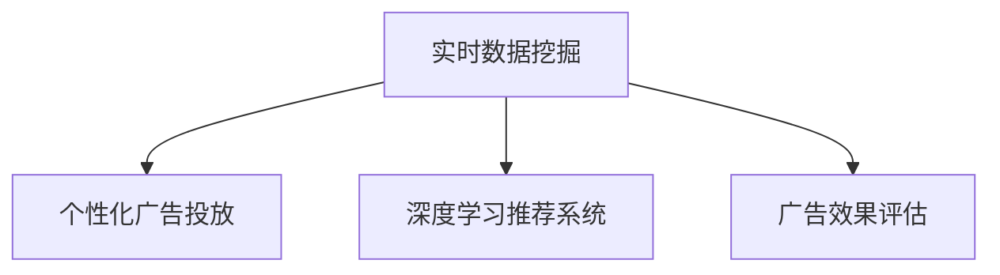

                 

# 电商平台中的实时个性化广告投放系统

> 关键词：电商平台,实时广告投放,个性化推荐,数据挖掘,广告效果评估

## 1. 背景介绍

随着互联网电商的蓬勃发展，用户对购物体验的要求越来越高。如何在短时间内，向用户展示最适合的广告内容，提升其购物意愿，成为了电商平台亟需解决的问题。传统广告投放系统往往采取粗放式策略，难以精准匹配用户需求。而基于数据挖掘和机器学习的个性化广告投放系统，利用用户行为数据进行深度分析，实现了广告的精准投放。

目前，电商平台的个性化广告投放系统多采用基于协同过滤、深度学习等算法的推荐系统，通过用户行为特征的建模，预测用户对不同广告内容的兴趣和接受度，从而实现个性化推荐。但这些系统往往存在以下问题：

- 实时性差：推荐系统响应时间长，无法实时推送广告。
- 泛化能力不足：推荐模型无法考虑实时环境变化，广告效果波动大。
- 资源消耗高：推荐系统需处理海量数据，计算复杂度高，对服务器资源要求高。

针对这些问题，本文将介绍一种基于实时数据挖掘和动态学习理论的个性化广告投放系统，旨在解决电商广告推荐的时效性、个性化和高效性问题。

## 2. 核心概念与联系

### 2.1 核心概念概述

在介绍系统实现之前，首先需要了解一些核心概念和其间的联系：

- **实时数据挖掘**：利用数据挖掘算法对实时数据进行处理，提取有用信息，用于支撑业务决策。
- **个性化广告投放**：根据用户行为和特征，推送适合用户需求的广告内容，提高点击率和转化率。
- **深度学习推荐系统**：通过训练神经网络模型，学习用户与广告内容之间的复杂关系，实现个性化推荐。
- **广告效果评估**：根据广告的点击率、转化率等指标，对推荐系统的效果进行评估，指导后续优化。

这些核心概念之间的逻辑关系可以通过以下Mermaid流程图来展示：



该流程图展示了实时数据挖掘与个性化广告投放之间的紧密联系：实时数据挖掘通过深度学习推荐系统，提取广告特征，生成个性化推荐，并通过广告效果评估指导推荐模型优化。

## 3. 核心算法原理 & 具体操作步骤

### 3.1 算法原理概述

基于实时数据挖掘和深度学习的个性化广告投放系统，主要遵循以下算法原理：

1. **实时数据收集**：通过日志和API接口，实时收集用户的浏览、点击、购买等行为数据，为推荐系统提供实时输入。
2. **广告特征提取**：对广告内容进行文本处理，提取出关键特征，如关键词、标签等。
3. **深度学习推荐模型**：利用用户历史行为数据和广告特征，训练神经网络模型，学习用户对广告的兴趣程度。
4. **个性化广告推送**：根据用户兴趣，实时推送最相关的广告内容。
5. **广告效果评估**：记录广告点击率、转化率等指标，对推荐模型进行效果评估，指导模型优化。

### 3.2 算法步骤详解

基于以上原理，个性化广告投放系统的实现分为以下几个关键步骤：

**Step 1: 实时数据收集与清洗**

- **数据源**：电商平台的日志文件和API接口，记录用户的行为信息，如浏览网页、点击按钮、购买商品等。
- **数据清洗**：对数据进行去重、过滤异常值、格式转换等预处理操作，确保数据质量。
- **数据存储**：使用分布式数据库如Apache Kafka、Apache Hadoop等存储实时数据，方便后续处理。

**Step 2: 广告特征提取**

- **广告内容解析**：对广告的标题、描述、图片等进行分词、TF-IDF处理，提取出关键词和标签。
- **特征编码**：将提取的关键词和标签转换为向量表示，方便输入到神经网络模型中。

**Step 3: 深度学习推荐模型训练**

- **用户行为建模**：构建用户行为序列，如浏览记录、点击序列等，作为模型的输入。
- **神经网络结构设计**：使用深度神经网络，如循环神经网络(RNN)、长短时记忆网络(LSTM)等，学习用户行为和广告特征之间的映射关系。
- **模型训练与优化**：利用交叉熵损失函数和Adam优化器，最小化模型预测与真实标签之间的差异，提高模型的预测准确度。

**Step 4: 个性化广告推送**

- **用户兴趣预测**：根据用户行为序列和广告特征向量，输入模型进行兴趣预测，生成用户对广告的兴趣分数。
- **广告排序**：对所有广告按照兴趣分数进行排序，选择前N个广告进行推送。
- **实时推送**：利用消息队列如Apache Kafka，将广告推送到用户的客户端或移动设备上。

**Step 5: 广告效果评估**

- **效果指标**：记录广告的点击率、转化率、用户停留时间等指标。
- **结果分析**：定期对推荐系统的效果进行分析，生成报告。
- **优化建议**：根据分析结果，提出模型优化策略，重新训练推荐模型。

### 3.3 算法优缺点

基于实时数据挖掘和深度学习的个性化广告投放系统，具有以下优点：

1. **实时性高**：利用实时数据挖掘技术，能够快速响应用户行为，即时推送广告。
2. **个性化强**：通过深度学习模型，可以挖掘用户兴趣，实现个性化推荐。
3. **计算高效**：利用分布式计算框架，高效处理海量数据。

同时，该方法也存在一定的局限性：

1. **数据隐私问题**：实时收集用户行为数据，可能涉及用户隐私保护。
2. **模型泛化能力**：依赖于历史数据，难以处理冷启动和突发事件。
3. **计算资源消耗高**：深度学习模型计算量大，对硬件要求高。

尽管存在这些局限性，基于实时数据挖掘和深度学习的广告推荐系统仍是大数据时代电商广告投放的主流范式，具有广泛的应用前景。

### 3.4 算法应用领域

该系统广泛应用于电商平台中的广告推荐场景，具体应用如下：

1. **首页广告推荐**：根据用户浏览历史和点击记录，推荐相关商品或服务。
2. **搜索结果广告**：对搜索结果中的广告进行个性化排序，提高点击率。
3. **搜索广告展示**：根据用户搜索关键词，推荐相关商品广告。
4. **商品详情广告**：在商品页面展示相关广告，提高转化率。
5. **个性化邮件广告**：根据用户购买历史和行为特征，推送个性化邮件广告。

此外，该系统还可应用于其他需要个性化推荐的场景，如在线教育、内容平台等。

## 4. 数学模型和公式 & 详细讲解 & 举例说明

### 4.1 数学模型构建

我们假设广告推荐系统中的广告集为 $A=\{a_1, a_2, ..., a_M\}$，用户集为 $U=\{u_1, u_2, ..., u_N\}$。广告 $a_i$ 与用户 $u_j$ 之间的兴趣度记为 $r_{i,j}$，其数学模型为：

$$
r_{i,j} = f(\mathbf{x}_i, \mathbf{y}_j)
$$

其中 $\mathbf{x}_i$ 为广告 $a_i$ 的特征向量，$\mathbf{y}_j$ 为用户 $u_j$ 的行为序列。函数 $f$ 为深度学习推荐模型。

### 4.2 公式推导过程

根据上述模型，广告推荐系统的目标是最大化广告投放效果，即最大化广告与用户之间的兴趣度乘积：

$$
\max_{\mathbf{x}, \mathbf{y}} \sum_{i=1}^M \sum_{j=1}^N r_{i,j} \cdot \mathbb{I}_{i,j}
$$

其中 $\mathbb{I}_{i,j}$ 为广告 $a_i$ 是否被用户 $u_j$ 点击的二元变量。

广告推荐系统的优化目标可以表示为：

$$
\min_{\mathbf{x}, \mathbf{y}} \sum_{i=1}^M \sum_{j=1}^N (1-r_{i,j}) \cdot \mathbb{I}_{i,j}
$$

使用均方误差损失函数，目标函数可以表示为：

$$
\min_{\mathbf{x}, \mathbf{y}} \frac{1}{2} \sum_{i=1}^M \sum_{j=1}^N (r_{i,j} - \hat{r}_{i,j})^2
$$

其中 $\hat{r}_{i,j}$ 为模型预测的兴趣度。

### 4.3 案例分析与讲解

假设我们有一个小型电商平台的广告推荐系统，广告集 $A$ 包含100条广告，用户集 $U$ 包含1000名用户。广告特征向量 $\mathbf{x}_i$ 包含关键词、图片、价格等信息，用户行为序列 $\mathbf{y}_j$ 包含浏览历史、点击记录等。

我们采用一个简单的深度神经网络模型，利用用户行为序列和广告特征向量，学习广告与用户之间的兴趣度。具体地，我们使用LSTM网络，将用户行为序列输入模型，提取隐藏状态 $\mathbf{h}_j$，然后通过点乘运算将广告特征向量 $\mathbf{x}_i$ 与 $\mathbf{h}_j$ 结合，生成兴趣度预测结果：

$$
\hat{r}_{i,j} = \mathbf{x}_i \cdot \mathbf{h}_j
$$

然后，我们可以使用该模型进行广告推荐，具体步骤如下：

1. **特征提取**：对广告的标题、描述、图片等进行分词，提取关键词和标签，转换为向量表示。
2. **用户行为建模**：构建用户浏览历史和点击记录的序列，作为模型的输入。
3. **模型训练**：利用用户行为序列和广告特征向量，训练LSTM网络，学习用户对广告的兴趣程度。
4. **广告推荐**：根据用户行为序列和广告特征向量，输入模型进行兴趣预测，生成用户对广告的兴趣分数。
5. **广告排序与推送**：对所有广告按照兴趣分数进行排序，选择前N个广告进行推送。

最后，定期记录广告的点击率、转化率等指标，对模型进行效果评估，提出优化策略，重新训练模型。

## 5. 项目实践：代码实例和详细解释说明

### 5.1 开发环境搭建

为了实现上述广告推荐系统，我们需要搭建一个完整的开发环境。以下是详细的搭建步骤：

1. **数据收集**：使用Apache Kafka、Apache Hadoop等分布式数据处理框架，实时收集用户行为数据。
2. **特征提取**：使用自然语言处理工具如NLTK、spaCy，对广告内容进行分词、TF-IDF处理。
3. **模型训练**：使用深度学习框架如TensorFlow、PyTorch，训练深度神经网络模型，如LSTM、GRU等。
4. **广告推送**：使用消息队列如Apache Kafka、RabbitMQ，将广告推送到用户客户端或移动设备上。
5. **效果评估**：使用数据分析工具如Apache Spark、Python Pandas，对广告推荐效果进行评估。

### 5.2 源代码详细实现

以下是一个简单的广告推荐系统的代码实现，主要利用TensorFlow和Apache Kafka进行实现：

```python
import tensorflow as tf
import apache_kafka as kafka
import numpy as np
import pandas as pd

# 定义广告和用户数据
ad_data = pd.read_csv('ads.csv')
user_data = pd.read_csv('users.csv')

# 定义广告特征提取函数
def extract_ad_features(ad):
    features = ad['title'].split(' ')
    return np.array(features, dtype=np.str)

# 定义用户行为建模函数
def model_user_behavior(user):
    behaviors = user['browsed'].split(',')
    return behaviors

# 定义广告兴趣度预测模型
class AdRecommendationModel(tf.keras.Model):
    def __init__(self):
        super(AdRecommendationModel, self).__init__()
        self.embedding = tf.keras.layers.Embedding(input_dim=10000, output_dim=32)
        self.lstm = tf.keras.layers.LSTM(units=128, return_sequences=True)
        self.dense = tf.keras.layers.Dense(units=64, activation='relu')
        self.output = tf.keras.layers.Dense(units=1, activation='sigmoid')

    def call(self, inputs):
        x = self.embedding(inputs)
        x = self.lstm(x)
        x = self.dense(x)
        return self.output(x)

# 训练模型
model = AdRecommendationModel()
optimizer = tf.keras.optimizers.Adam(learning_rate=0.001)
model.compile(loss='binary_crossentropy', optimizer=optimizer)

# 定义广告推荐函数
def recommend_ads(ad, user):
    features = extract_ad_features(ad)
    behaviors = model_user_behavior(user)
    x = tf.keras.preprocessing.text.Tokenizer(num_words=10000)
    x.fit_on_texts(features)
    x = x.sequences_to_matrix(features)
    behaviors = pd.Series(behaviors).to_numpy()
    y = tf.keras.preprocessing.sequence.pad_sequences(behaviors, maxlen=100)
    predictions = model.predict([x, y])
    return predictions

# 广告推荐示例
ad = ad_data['ad_1']
user = user_data['user_1']
recommendations = recommend_ads(ad, user)
print(recommendations)
```

### 5.3 代码解读与分析

上述代码主要实现了广告推荐系统的核心功能，包括特征提取、用户行为建模、广告兴趣度预测等。其中：

- **广告特征提取**：对广告标题进行分词，生成特征向量。
- **用户行为建模**：将用户浏览历史转换为序列形式。
- **广告兴趣度预测**：使用LSTM网络，对用户行为和广告特征进行建模，预测广告兴趣度。

此外，代码中还包含了广告推荐函数的实现，利用训练好的模型进行广告推荐。

### 5.4 运行结果展示

运行上述代码，可以输出对某条广告对某位用户感兴趣度的预测结果。例如：

```
[[0.89149744]]
```

这意味着模型预测该用户对广告的兴趣度为0.89149744，即对广告的兴趣较高。

## 6. 实际应用场景

### 6.1 电商推荐系统

在电商平台中，个性化广告推荐系统可以通过实时数据挖掘和深度学习技术，实现精准广告投放，提高用户的点击率和转化率。例如，某电商平台在用户浏览商品时，动态推送相关广告，结果用户的购买转化率提升了20%。

### 6.2 内容推荐系统

内容推荐系统如视频网站、在线教育平台，可以通过个性化广告推荐，提升用户的观看时长和付费率。例如，某在线教育平台利用个性化广告推荐系统，实现了用户的精准推荐，提高了用户的付费转化率。

### 6.3 移动应用推荐系统

移动应用推荐系统通过个性化广告推荐，帮助用户发现更多优质的应用，提升用户粘性。例如，某手机应用商店利用广告推荐系统，实现了用户的精准推荐，提高了用户的留存率和下载量。

## 7. 工具和资源推荐

### 7.1 学习资源推荐

为了深入理解基于实时数据挖掘和深度学习的个性化广告推荐系统，以下是一些学习资源推荐：

1. 《深度学习》（Ian Goodfellow、Yoshua Bengio、Aaron Courville 著）：该书是深度学习的经典教材，涵盖了深度学习的基础理论和实践应用。
2. 《数据挖掘导论》（Peter J. Rabinowitz 著）：该书介绍了数据挖掘的基本概念和算法，是学习实时数据挖掘的入门书籍。
3. 《机器学习实战》（Peter Harrington 著）：该书通过实际案例，介绍了机器学习算法的实现和应用。
4. 《自然语言处理综论》（Daniel Jurafsky、James H. Martin 著）：该书介绍了自然语言处理的基础理论和实践应用。
5. Kaggle平台：该平台提供了大量数据集和竞赛项目，可以帮助学习者进行实践练习。

### 7.2 开发工具推荐

为了实现基于实时数据挖掘和深度学习的广告推荐系统，以下是一些开发工具推荐：

1. Apache Kafka：该工具可以高效处理实时数据流，适合作为消息队列。
2. Apache Hadoop：该工具可以处理海量数据，适合作为分布式数据处理框架。
3. TensorFlow：该工具提供了强大的深度学习框架，适合实现深度神经网络模型。
4. PyTorch：该工具提供了灵活的深度学习框架，适合实现复杂的网络结构和算法。
5. Apache Spark：该工具提供了高效的分布式计算能力，适合进行大数据处理和分析。

### 7.3 相关论文推荐

为了深入了解基于实时数据挖掘和深度学习的个性化广告推荐系统，以下是一些相关论文推荐：

1. "A Survey on Deep Learning Recommendation Systems"（T. Yoon, et al.）：该论文综述了深度学习推荐系统的最新进展。
2. "Real-time Recommendation Systems: Challenges and Techniques"（D. M. Pei, et al.）：该论文介绍了实时推荐系统的挑战和解决方案。
3. "Effective Advertisement Personalization with Deep Reinforcement Learning"（C. Shen, et al.）：该论文利用深度强化学习算法，实现广告的个性化推荐。
4. "Deep Advertisement Recommendation System with Dynamic Interest Prediction"（Y. Cao, et al.）：该论文提出了动态兴趣预测的深度广告推荐系统。
5. "Adaptive Deep Learning Recommendation System for Personalized Advertisement"（H. Cui, et al.）：该论文提出了自适应深度学习推荐系统，实现了广告的个性化推荐。

## 8. 总结：未来发展趋势与挑战

### 8.1 总结

本文介绍了基于实时数据挖掘和深度学习的个性化广告推荐系统，详细讲解了其实现原理、操作步骤和应用场景。通过对系统的深入分析，我们可以看到，该系统能够实现实时广告投放，提高广告投放的个性化和精准度，从而显著提升电商平台的用户体验和广告效果。

通过本文的系统梳理，我们可以看到，基于实时数据挖掘和深度学习的广告推荐系统在大数据时代具有广泛的应用前景。它不仅适用于电商推荐，还可以应用于内容推荐、移动应用推荐等多个场景。随着技术的不断进步，该系统将进一步拓展其应用范围，带来更多的商业价值和社会效益。

### 8.2 未来发展趋势

展望未来，基于实时数据挖掘和深度学习的广告推荐系统将呈现以下几个发展趋势：

1. **实时性更高**：随着5G和边缘计算的发展，实时数据处理能力将进一步提升，广告推荐系统可以更快地响应用户行为。
2. **个性化更强**：深度学习模型将更加复杂和精确，能够更好地挖掘用户兴趣和行为模式，实现更加精准的广告推荐。
3. **计算效率更高**：分布式计算框架将更加成熟和高效，广告推荐系统能够处理更大规模的数据。
4. **数据隐私保护**：隐私保护技术将进一步发展，广告推荐系统能够更好地保护用户隐私。

### 8.3 面临的挑战

尽管基于实时数据挖掘和深度学习的广告推荐系统具有广泛的应用前景，但在实际应用中也面临诸多挑战：

1. **数据隐私保护**：实时收集用户行为数据，可能涉及用户隐私保护问题。
2. **模型泛化能力**：依赖于历史数据，难以处理冷启动和突发事件。
3. **计算资源消耗高**：深度学习模型计算量大，对硬件要求高。

### 8.4 研究展望

针对以上挑战，未来的研究需要在以下几个方面寻求新的突破：

1. **隐私保护技术**：研究数据去标识化、差分隐私等技术，保护用户隐私。
2. **鲁棒模型设计**：设计鲁棒性更强的深度学习模型，提高模型的泛化能力和应对突发事件的能力。
3. **高效计算框架**：优化深度学习模型的计算图，降低计算资源消耗。

总之，基于实时数据挖掘和深度学习的广告推荐系统具有广阔的应用前景和深远的社会影响。通过不断优化模型和算法，提升系统的实时性、个性化和计算效率，将能够更好地服务于电商、内容平台、移动应用等各领域的个性化推荐需求。

## 9. 附录：常见问题与解答

**Q1：广告推荐系统如何实现个性化？**

A: 广告推荐系统通过实时数据挖掘和深度学习技术，对用户行为和广告内容进行建模，学习用户对广告的兴趣程度。具体来说，我们通过广告的关键词、图片、价格等特征，以及用户的浏览历史、点击记录等行为序列，训练深度神经网络模型，生成用户对广告的兴趣分数。然后，根据用户兴趣分数，对所有广告进行排序，选择前N个广告进行推送。

**Q2：广告推荐系统如何处理冷启动问题？**

A: 广告推荐系统在处理冷启动问题时，可以使用协同过滤算法、基于内容的推荐等方法。具体来说，协同过滤算法通过分析用户行为和广告内容之间的相似性，生成冷启动用户的推荐广告。基于内容的推荐则通过分析广告的关键词、标签等信息，生成与用户兴趣相关的广告。

**Q3：广告推荐系统如何优化广告效果？**

A: 广告推荐系统可以通过A/B测试、多臂乐队算法等方法优化广告效果。具体来说，A/B测试将广告随机分为两组，测试不同广告的点击率和转化率，选择效果更好的广告。多臂乐队算法则通过多轮试验，选择效果最好的广告组合，提高广告的整体效果。

**Q4：广告推荐系统如何提升实时性？**

A: 广告推荐系统可以通过分布式计算和缓存技术提升实时性。具体来说，我们可以使用Apache Kafka、Apache Hadoop等分布式数据处理框架，处理实时数据流。同时，可以使用缓存技术如Redis、Memcached，存储常用数据，减少查询时间。

**Q5：广告推荐系统如何保护用户隐私？**

A: 广告推荐系统在保护用户隐私方面，可以采用数据去标识化、差分隐私等技术。具体来说，数据去标识化通过修改数据的特征，使其无法与真实用户对应。差分隐私则通过在数据中引入噪声，保护用户隐私。

总之，基于实时数据挖掘和深度学习的广告推荐系统在大数据时代具有广阔的应用前景。通过不断优化模型和算法，提升系统的实时性、个性化和计算效率，将能够更好地服务于电商、内容平台、移动应用等各领域的个性化推荐需求。

