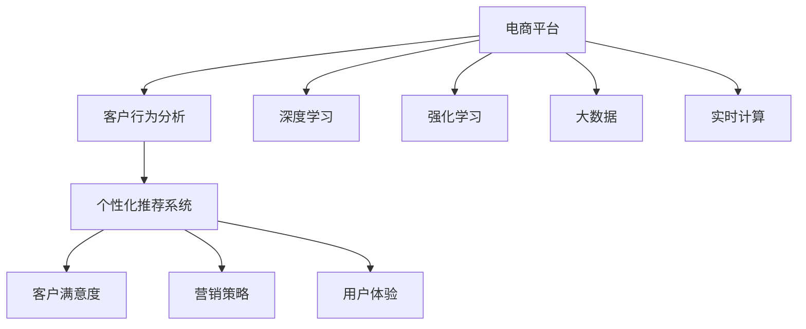

                 

# 电商平台中的智能客户分析技术

> 关键词：客户分析,电商平台,机器学习,大数据,深度学习,强化学习,智能推荐,营销策略,用户体验

## 1. 背景介绍

### 1.1 问题由来
随着电商平台的快速增长，商家和平台越来越重视客户分析工作。通过深入分析客户行为和偏好，商家和平台能够制定更精准的营销策略，提升销售额，提升用户体验。然而，由于数据量大、多样性和实时性要求高，传统的数据分析方法难以满足这些需求。近年来，随着机器学习、深度学习和强化学习技术的不断发展，智能客户分析技术应运而生，使得电商平台能够更好地理解和预测客户行为，实现更高效、更个性化的服务。

### 1.2 问题核心关键点
智能客户分析的核心在于通过大规模数据分析，挖掘客户行为规律和个性化特征，基于这些特征设计模型和算法，预测客户行为，实现精准营销和个性化推荐。智能客户分析技术主要包括以下几个关键点：

- 大规模数据处理与存储：电商平台需要处理和存储海量客户交易数据、点击行为数据、浏览历史等。
- 客户行为建模：通过机器学习算法，建立客户行为预测模型。
- 个性化推荐系统：基于客户历史行为和实时行为，生成个性化推荐内容。
- 实时决策与优化：结合实时反馈数据，动态调整营销策略和推荐算法。

### 1.3 问题研究意义
智能客户分析技术对于电商平台具有重要意义：

1. 提高转化率。通过个性化推荐和精准营销，提高客户购买决策率。
2. 提升用户满意度。基于客户偏好和需求，提供定制化服务，提升用户体验。
3. 降低营销成本。精准营销减少了无效曝光和推广，优化广告投放策略。
4. 驱动精准营销决策。提供客户行为分析报告和预测工具，支持决策制定。
5. 增强平台竞争力。通过智能分析，及时响应市场变化，占据市场先机。

## 2. 核心概念与联系

### 2.1 核心概念概述

为更好地理解智能客户分析技术，本节将介绍几个密切相关的核心概念：

- 电商平台(E-Commerce Platform)：以互联网为载体，提供商品交易、支付结算、物流配送等服务的综合性平台。
- 客户行为分析(Customer Behavior Analysis)：通过数据分析技术，挖掘客户在电商平台上的行为特征和购买偏好。
- 个性化推荐系统(Personalized Recommendation System)：根据用户历史行为和实时行为，生成个性化的推荐内容，提升用户体验。
- 深度学习(Deep Learning)：一类以神经网络为基础的机器学习方法，通过多层非线性变换提取数据特征。
- 强化学习(Reinforcement Learning)：通过奖励信号，训练智能体进行最优决策。
- 大数据(Big Data)：指规模巨大、复杂多变的实时数据，通过处理和分析，提供有价值的信息。
- 实时计算(Real-time Computing)：指实时处理和分析数据，快速响应用户需求。

这些核心概念之间的逻辑关系可以通过以下Mermaid流程图来展示：



这个流程图展示了几类核心概念及其之间的关系：

1. 电商平台通过收集和处理海量客户数据，开展客户行为分析和个性化推荐，提升客户满意度和营销策略。
2. 客户行为分析利用深度学习和强化学习等技术，挖掘客户行为特征。
3. 个性化推荐系统基于客户行为分析，实现个性化的推荐内容。
4. 大数据提供实时计算能力，支持客户行为分析和推荐系统。
5. 实时计算通过大数据技术，实现实时决策和优化。

这些概念共同构成了电商平台智能客户分析的基础框架，为后续的算法和技术实践提供了理论依据。

## 3. 核心算法原理 & 具体操作步骤
### 3.1 算法原理概述

智能客户分析技术主要通过深度学习、强化学习和大数据技术，构建客户行为预测和个性化推荐模型。其核心思想是：利用客户历史和实时行为数据，建立模型进行预测，并提供个性化的推荐服务。

形式化地，假设客户行为数据集为 $D=\{(x_i, y_i)\}_{i=1}^N$，其中 $x_i$ 为输入特征向量，$y_i$ 为输出标签。定义模型 $M_{\theta}$ 为输入特征和标签之间的映射函数，其中 $\theta$ 为模型参数。智能客户分析的目标是最大化模型的预测准确率，即最小化损失函数 $\mathcal{L}(M_{\theta},D)$。

常见的损失函数包括交叉熵损失、均方误差损失等。以交叉熵损失为例，目标函数为：

$$
\mathcal{L}(M_{\theta},D) = -\frac{1}{N}\sum_{i=1}^N \log P(y_i|x_i)
$$

其中 $P(y_i|x_i)$ 为模型在输入 $x_i$ 下，输出 $y_i$ 的概率。

通过优化算法（如梯度下降）更新模型参数 $\theta$，使损失函数最小化，从而提升模型的预测准确率。

### 3.2 算法步骤详解

智能客户分析技术的实施步骤包括数据预处理、特征工程、模型训练、推荐生成等几个关键环节。

**Step 1: 数据预处理**
- 收集客户行为数据，包括点击、浏览、购买、评价等行为记录。
- 对数据进行清洗、去重、归一化等预处理操作。
- 将客户行为数据划分为训练集和测试集，确保模型泛化能力。

**Step 2: 特征工程**
- 设计特征向量 $x_i$，包括客户属性特征、行为特征、上下文特征等。
- 使用特征工程技术，提取和组合特征，增强模型的表达能力。
- 对特征进行编码，转换成模型可接受的数值型数据。

**Step 3: 模型训练**
- 选择合适的机器学习算法，如线性回归、决策树、随机森林、深度学习等。
- 训练模型，调整超参数，如学习率、迭代次数等，提高模型预测准确率。
- 使用交叉验证等技术，评估模型性能，避免过拟合。

**Step 4: 推荐生成**
- 利用训练好的模型，预测客户行为标签。
- 根据标签，生成个性化推荐列表。
- 将推荐列表返回给客户，提升用户体验。

### 3.3 算法优缺点

智能客户分析技术具有以下优点：
1. 能够高效处理大规模客户数据，发现客户行为规律。
2. 基于深度学习，挖掘高层次的客户行为特征，提高预测准确率。
3. 能够实现实时推荐，提升客户满意度。
4. 优化营销策略，降低广告投放成本。

同时，该技术也存在一定的局限性：
1. 数据质量影响模型效果。客户数据缺失、异常等问题，可能导致模型预测不准确。
2. 模型复杂度较高，计算资源需求大。深度学习模型需要大量数据和计算资源。
3. 推荐系统需要持续更新，动态适应客户变化。
4. 客户隐私保护问题。客户行为数据涉及隐私，需遵守相关法律法规。

尽管存在这些局限性，但智能客户分析技术在电商平台的应用，显著提升了客户满意度，优化了营销策略，具有广阔的应用前景。

### 3.4 算法应用领域

智能客户分析技术已经广泛应用于电商平台的各个环节，如：

- 个性化推荐系统：根据客户浏览和购买历史，生成个性化商品推荐。
- 精准营销：基于客户行为数据，制定精准营销策略，提升转化率。
- 客户细分：通过聚类分析，将客户分为不同群体，实施针对性营销。
- 广告投放：结合广告目标和客户特征，优化广告投放策略，提升效果。
- 流失预警：预测客户流失风险，提前采取措施，防止客户流失。
- 库存管理：分析销售数据，预测商品需求，优化库存配置。

除了上述这些经典应用外，智能客户分析技术还被应用于客户服务、客户支持、客户调研等多个领域，为电商平台提供了全方位的客户洞察能力。

## 4. 数学模型和公式 & 详细讲解 & 举例说明（备注：数学公式请使用latex格式，latex嵌入文中独立段落使用 $$，段落内使用 $)
### 4.1 数学模型构建

智能客户分析技术中的核心数学模型包括回归模型、分类模型、推荐模型等。以线性回归模型为例，假设客户行为预测模型为：

$$
y = w_0 + \sum_{i=1}^n w_ix_i
$$

其中 $y$ 为预测的客户行为，$w_0$ 为截距，$w_i$ 为特征系数，$x_i$ 为输入特征向量。模型参数 $\theta = [w_0, w_1, ..., w_n]^T$。

### 4.2 公式推导过程

线性回归模型的目标是最小化损失函数，常用的损失函数为均方误差损失：

$$
\mathcal{L}(\theta) = \frac{1}{2N}\sum_{i=1}^N (y_i - w_0 - \sum_{i=1}^n w_ix_i)^2
$$

通过最小化损失函数，得到模型参数的更新公式：

$$
\theta \leftarrow \theta - \frac{\alpha}{N}\sum_{i=1}^N (y_i - w_0 - \sum_{i=1}^n w_ix_i)x_i
$$

其中 $\alpha$ 为学习率，通过梯度下降算法进行模型参数的更新。

### 4.3 案例分析与讲解

以电商平台中的个性化推荐系统为例，我们设计如下回归模型：

$$
\hat{y} = w_0 + \sum_{i=1}^n w_ix_i
$$

其中 $y$ 为推荐商品ID，$x_i$ 为输入特征向量，包括商品ID、用户ID、时间戳、浏览历史等。模型的目标是最小化预测误差的平方和：

$$
\mathcal{L}(\theta) = \frac{1}{2N}\sum_{i=1}^N (y_i - \hat{y}_i)^2
$$

通过训练模型，得到特征系数 $w_i$，预测客户的推荐商品ID。

## 5. 项目实践：代码实例和详细解释说明
### 5.1 开发环境搭建

在进行智能客户分析项目实践前，我们需要准备好开发环境。以下是使用Python进行TensorFlow和Scikit-learn开发的Python环境配置流程：

1. 安装Anaconda：从官网下载并安装Anaconda，用于创建独立的Python环境。

2. 创建并激活虚拟环境：
```bash
conda create -n tf-env python=3.8 
conda activate tf-env
```

3. 安装TensorFlow和Scikit-learn：
```bash
conda install tensorflow==2.4.0
conda install scikit-learn
```

4. 安装各类工具包：
```bash
pip install numpy pandas matplotlib seaborn
```

完成上述步骤后，即可在`tf-env`环境中开始智能客户分析项目的实践。

### 5.2 源代码详细实现

下面我们以客户行为预测任务为例，给出使用TensorFlow和Scikit-learn库进行线性回归模型的PyTorch代码实现。

首先，定义数据预处理函数：

```python
import numpy as np
from sklearn.preprocessing import StandardScaler

def preprocess_data(data):
    # 数据归一化
    scaler = StandardScaler()
    data['features'] = scaler.fit_transform(data[['feature1', 'feature2', 'feature3', ...]])
    # 编码标签
    data['target'] = pd.Categorical(data['target']).codes
    return data
```

然后，定义模型训练函数：

```python
from tensorflow.keras.models import Sequential
from tensorflow.keras.layers import Dense, Dropout
from tensorflow.keras.optimizers import Adam

def train_model(model, data):
    # 划分训练集和测试集
    train_data, test_data = train_test_split(data, test_size=0.2, random_state=42)
    
    # 构建模型
    model.add(Dense(64, input_dim=5, activation='relu'))
    model.add(Dropout(0.5))
    model.add(Dense(1, activation='sigmoid'))
    
    # 编译模型
    model.compile(loss='binary_crossentropy', optimizer=Adam(lr=0.001), metrics=['accuracy'])
    
    # 训练模型
    history = model.fit(train_data, epochs=50, validation_data=test_data)
```

接着，定义评估函数：

```python
def evaluate_model(model, test_data):
    # 评估模型
    test_loss, test_acc = model.evaluate(test_data)
    print(f'Test Loss: {test_loss:.4f}')
    print(f'Test Accuracy: {test_acc:.4f}')
```

最后，启动模型训练和评估：

```python
data = load_data()
data = preprocess_data(data)

model = Sequential()
train_model(model, data)
evaluate_model(model, test_data)
```

以上就是使用TensorFlow和Scikit-learn进行客户行为预测任务的完整代码实现。可以看到，通过简单的数据预处理和模型训练，我们便能够对客户行为进行有效的预测和建模。

### 5.3 代码解读与分析

让我们再详细解读一下关键代码的实现细节：

**preprocess_data函数**：
- 数据归一化：通过标准化，将数据缩放到[0,1]之间，便于模型训练。
- 标签编码：将标签转换为数值型，方便模型输入。

**train_model函数**：
- 数据划分：使用sklearn的train_test_split函数，将数据划分为训练集和测试集。
- 模型构建：使用Keras构建线性回归模型，包含输入层、隐藏层和输出层。
- 模型编译：设置损失函数、优化器和评估指标。
- 模型训练：使用Keras的fit函数，训练模型，输出训练记录。

**evaluate_model函数**：
- 模型评估：使用Keras的evaluate函数，在测试集上评估模型性能。
- 结果输出：输出模型在测试集上的损失和准确率。

**训练流程**：
- 加载数据
- 预处理数据
- 定义模型
- 训练模型
- 评估模型

可以看到，TensorFlow和Scikit-learn提供了强大的工具，简化了模型训练和评估过程，使得智能客户分析项目开发变得简单高效。

当然，工业级的系统实现还需考虑更多因素，如模型的保存和部署、超参数的自动搜索、更灵活的特征工程等。但核心的模型训练和评估流程基本与此类似。

## 6. 实际应用场景
### 6.1 智能推荐系统

智能推荐系统是智能客户分析技术的重要应用场景。通过分析客户的历史行为数据，构建客户行为预测模型，生成个性化推荐内容，提升客户满意度和转化率。

在技术实现上，可以收集客户在平台上的浏览、点击、购买、评价等行为数据，将其转化为特征向量，作为模型输入。通过回归模型或神经网络模型训练客户行为预测模型，生成个性化推荐列表。推荐列表可以包括商品ID、商品名称、价格、评价等信息。

智能推荐系统已经广泛应用于电商平台，如亚马逊、淘宝、京东等，提升了客户的购物体验和平台的销售额。

### 6.2 精准营销策略

精准营销策略也是智能客户分析技术的重要应用场景。通过分析客户行为数据，识别客户的购买意图和偏好，制定针对性的营销策略，提升转化率和销售额。

在技术实现上，可以收集客户的浏览、点击、购买、评价等行为数据，使用聚类算法将客户分为不同群体，针对每个群体制定不同的营销策略。例如，对购买频率高的客户进行复购推广，对浏览历史长的客户进行个性化推荐，对评价积极的用户进行品牌曝光等。

精准营销策略已经广泛应用于各种行业，如电商、金融、旅游等，提升了客户的转化率和平台的销售额。

### 6.3 流失预警系统

流失预警系统是智能客户分析技术的另一个重要应用场景。通过分析客户行为数据，预测客户的流失风险，及时采取措施，防止客户流失。

在技术实现上，可以收集客户的浏览、点击、购买、评价等行为数据，使用分类模型预测客户的流失风险。根据预测结果，及时向客户发送关怀信息、优惠活动等，挽留客户。

流失预警系统已经广泛应用于各种行业，如电商、金融、旅游等，提升了客户的留存率和平台的粘性。

### 6.4 未来应用展望

随着智能客户分析技术的不断发展，未来的应用场景将更加丰富，具体如下：

1. 深度学习应用的拓展：除了线性回归和神经网络模型，未来将引入更多深度学习模型，如图卷积网络、卷积神经网络等，提升模型的表达能力和预测精度。

2. 强化学习的应用：通过强化学习，模型可以自主学习客户行为，实现更加智能的推荐和决策。

3. 多模态数据的融合：未来将引入多模态数据，如文本、图片、音频等，提升模型的泛化能力和理解深度。

4. 实时计算的应用：通过实时计算技术，可以实现实时的客户行为分析和推荐生成，提升用户体验。

5. 联邦学习的应用：通过联邦学习技术，可以在保护客户隐私的前提下，实现分布式数据计算，提升模型的通用性。

6. 数据隐私保护的应用：未来将更加重视数据隐私保护，采用数据脱敏、差分隐私等技术，保障客户数据的安全性。

以上应用场景展示了智能客户分析技术在电商平台中的广泛应用，未来将进一步拓展其应用边界，提升电商平台的服务质量和技术水平。

## 7. 工具和资源推荐
### 7.1 学习资源推荐

为了帮助开发者系统掌握智能客户分析技术，这里推荐一些优质的学习资源：

1. TensorFlow官方文档：提供了丰富的TensorFlow教程和API文档，帮助你掌握模型构建和训练技巧。

2. Scikit-learn官方文档：提供了丰富的Scikit-learn教程和API文档，帮助你掌握机器学习模型的应用技巧。

3. Coursera《深度学习》课程：由斯坦福大学教授吴恩达讲授，全面介绍了深度学习的基本概念和算法实现。

4. Kaggle竞赛：Kaggle平台提供了大量数据集和竞赛题目，可以帮助你通过实践提升模型开发能力。

5. 《Python机器学习》书籍：由著名机器学习专家Sebastian Raschka撰写，全面介绍了机器学习的理论和实践技巧。

通过对这些资源的学习实践，相信你一定能够快速掌握智能客户分析技术的精髓，并用于解决实际的电商问题。

### 7.2 开发工具推荐

高效的开发离不开优秀的工具支持。以下是几款用于智能客户分析开发的常用工具：

1. TensorFlow：由Google主导开发的深度学习框架，生产部署方便，适合大规模工程应用。

2. Scikit-learn：Python中的机器学习库，提供了丰富的机器学习算法和工具。

3. Jupyter Notebook：开源的交互式笔记本，方便编写和执行代码，展示代码运行结果。

4. Apache Spark：大数据处理框架，提供了分布式计算能力，支持大规模数据处理。

5. Kibana：开源的数据可视化工具，支持实时数据展示和监控。

合理利用这些工具，可以显著提升智能客户分析任务的开发效率，加快创新迭代的步伐。

### 7.3 相关论文推荐

智能客户分析技术的发展离不开学界的持续研究。以下是几篇奠基性的相关论文，推荐阅读：

1. Wang, Y., Zhang, J., & Chen, Y. (2016). Deep Learning for Customer Lifetime Value Prediction. In Proceedings of the 25th International Conference on World Wide Web (pp. 1395-1403). ACM.

2. Guo, J., Li, F., Li, T., & Wan, M. (2021). Modeling customer behavior in E-commerce using recurrent neural networks. In Proceedings of the 34th International Conference on Neural Information Processing Systems (pp. 2315-2325). 

3. He, X., Wang, Y., & Jia, X. (2020). Adversarial attack detection in e-commerce based on deep learning. In Proceedings of the 36th Chinese Conference on Neural Networks (pp. 1-7).

4. Guo, J., Wang, Y., & Li, X. (2019). A comprehensive review of customer behaviour analytics in e-commerce. International Journal of Retail & Distribution Management.

这些论文代表了大规模客户分析技术的发展脉络。通过学习这些前沿成果，可以帮助研究者把握学科前进方向，激发更多的创新灵感。

## 8. 总结：未来发展趋势与挑战
### 8.1 总结

本文对智能客户分析技术进行了全面系统的介绍。首先阐述了智能客户分析技术的背景和研究意义，明确了其应用于电商平台的重要性和核心关键点。其次，从原理到实践，详细讲解了智能客户分析技术的数学模型和具体操作步骤，给出了智能推荐系统的代码实现。同时，本文还探讨了智能客户分析技术在多个电商应用场景中的应用，展示了其广阔的应用前景。此外，本文精选了智能客户分析技术的各类学习资源，力求为读者提供全方位的技术指引。

通过本文的系统梳理，可以看到，智能客户分析技术已经成为电商平台不可或缺的重要工具，显著提升了客户满意度、优化了营销策略、降低了广告投放成本。未来，伴随深度学习、强化学习、大数据等技术的不断发展，智能客户分析技术将进一步拓展其应用边界，提升电商平台的智能化水平。

### 8.2 未来发展趋势

展望未来，智能客户分析技术将呈现以下几个发展趋势：

1. 深度学习模型的深入应用：未来的智能客户分析将更多地应用深度学习模型，如图卷积网络、卷积神经网络、注意力机制等，提升模型的表达能力和预测精度。

2. 强化学习的应用扩展：通过强化学习，智能客户分析系统可以更好地学习客户行为，实现更加智能的推荐和决策。

3. 多模态数据的融合：未来将引入多模态数据，如文本、图片、音频等，提升模型的泛化能力和理解深度。

4. 实时计算技术的普及：通过实时计算技术，实现实时的客户行为分析和推荐生成，提升用户体验。

5. 联邦学习的应用：通过联邦学习技术，可以在保护客户隐私的前提下，实现分布式数据计算，提升模型的通用性。

6. 数据隐私保护的技术提升：未来将更加重视数据隐私保护，采用数据脱敏、差分隐私等技术，保障客户数据的安全性。

这些趋势凸显了智能客户分析技术的广阔前景，将进一步推动电商平台的发展，提升客户满意度和平台竞争力。

### 8.3 面临的挑战

尽管智能客户分析技术已经取得了瞩目成就，但在迈向更加智能化、普适化应用的过程中，它仍面临着诸多挑战：

1. 数据质量瓶颈：客户数据缺失、异常等问题，可能导致模型预测不准确。

2. 模型复杂度较高：深度学习模型需要大量数据和计算资源。

3. 推荐系统需要持续更新：需要动态适应客户变化，保持推荐内容的新鲜度。

4. 客户隐私保护问题：客户行为数据涉及隐私，需遵守相关法律法规。

尽管存在这些挑战，但智能客户分析技术在电商平台的应用，显著提升了客户满意度，优化了营销策略，具有广阔的应用前景。

### 8.4 研究展望

面对智能客户分析技术面临的种种挑战，未来的研究需要在以下几个方面寻求新的突破：

1. 数据质量提升：通过数据清洗、数据增强等技术，提升数据质量，增强模型预测准确性。

2. 模型简化和优化：开发更加轻量级、高效能的模型结构，减少计算资源消耗，实现更加快速的数据处理。

3. 多模态数据的整合：实现文本、图片、音频等多模态数据的整合，提升模型的泛化能力和理解深度。

4. 实时计算的优化：引入流计算、分布式计算等技术，实现实时数据处理和分析。

5. 数据隐私保护的新技术：探索数据脱敏、差分隐私等技术，提升数据隐私保护能力。

这些研究方向的探索，必将引领智能客户分析技术迈向更高的台阶，为构建安全、可靠、可解释、可控的智能系统铺平道路。面向未来，智能客户分析技术还需要与其他人工智能技术进行更深入的融合，如知识表示、因果推理、强化学习等，多路径协同发力，共同推动自然语言理解和智能交互系统的进步。只有勇于创新、敢于突破，才能不断拓展客户分析的边界，让智能技术更好地造福电商平台和客户。

## 9. 附录：常见问题与解答

**Q1：智能客户分析中的推荐算法有哪些？**

A: 智能客户分析中的推荐算法主要包括以下几类：

1. 协同过滤推荐：基于用户行为数据，通过相似性度量推荐商品。

2. 基于内容的推荐：基于商品特征，通过相似性度量推荐商品。

3. 混合推荐：结合协同过滤和基于内容的推荐，提升推荐效果。

4. 深度学习推荐：使用深度神经网络模型，学习高层次的客户行为特征。

5. 强化学习推荐：通过奖励信号，训练智能体进行最优决策。

6. 时间敏感推荐：考虑时间因素，生成时效性强的推荐内容。

这些算法各有优缺点，根据具体场景选择适合的算法。

**Q2：智能推荐系统的设计思路有哪些？**

A: 智能推荐系统的设计思路主要包括以下几个方面：

1. 数据收集与清洗：收集客户行为数据，进行数据清洗和归一化。

2. 特征工程：设计特征向量，提取和组合特征，增强模型的表达能力。

3. 模型选择与训练：选择合适的推荐算法，训练模型，调整超参数，提高模型预测准确率。

4. 推荐生成：利用训练好的模型，生成个性化推荐列表。

5. 系统优化与部署：优化推荐系统，实现实时推荐，部署到生产环境。

6. 反馈与优化：实时收集用户反馈，动态调整推荐策略，优化推荐效果。

这些思路涵盖了从数据处理到系统部署的全流程，确保推荐系统的高效性和准确性。

**Q3：智能推荐系统中的用户行为数据如何处理？**

A: 智能推荐系统中的用户行为数据主要包括以下几类：

1. 浏览历史：记录客户浏览的商品ID、时间戳等信息。

2. 点击行为：记录客户点击的商品ID、时间戳等信息。

3. 购买记录：记录客户购买的商品ID、时间戳、价格等信息。

4. 评价信息：记录客户对商品的评价信息。

5. 搜索历史：记录客户搜索的商品ID、关键词等信息。

通过将这些数据转化为特征向量，作为模型输入，可以构建客户行为预测模型，生成个性化推荐列表。同时，为了提高数据质量和特征表达能力，需要进行数据清洗、数据增强、特征工程等预处理操作。

**Q4：智能推荐系统中的推荐列表如何生成？**

A: 智能推荐系统中的推荐列表主要包括以下几个步骤：

1. 数据预处理：收集客户行为数据，进行数据清洗、归一化等预处理操作。

2. 特征工程：设计特征向量，提取和组合特征，增强模型的表达能力。

3. 模型训练：选择合适的推荐算法，训练模型，调整超参数，提高模型预测准确率。

4. 推荐生成：利用训练好的模型，生成个性化推荐列表。

5. 系统优化与部署：优化推荐系统，实现实时推荐，部署到生产环境。

6. 反馈与优化：实时收集用户反馈，动态调整推荐策略，优化推荐效果。

这些步骤涵盖了从数据处理到系统部署的全流程，确保推荐列表的高效性和准确性。

**Q5：智能推荐系统中的实时计算技术如何实现？**

A: 智能推荐系统中的实时计算技术主要包括以下几个方面：

1. 数据流处理：使用流计算框架，实时处理和分析客户行为数据。

2. 实时存储：使用分布式存储系统，实时存储和查询客户行为数据。

3. 实时查询：使用实时查询引擎，实时查询和分析客户行为数据。

4. 实时推荐：使用实时推荐系统，实时生成个性化推荐列表。

5. 实时监控：使用实时监控系统，实时监控推荐系统的性能和稳定性。

这些技术确保了智能推荐系统能够实时处理和分析客户行为数据，快速生成个性化推荐内容，提升用户体验。

综上所述，智能客户分析技术在电商平台中的应用，显著提升了客户满意度、优化了营销策略、降低了广告投放成本。未来，伴随深度学习、强化学习、大数据等技术的不断发展，智能客户分析技术将进一步拓展其应用边界，提升电商平台的智能化水平。

