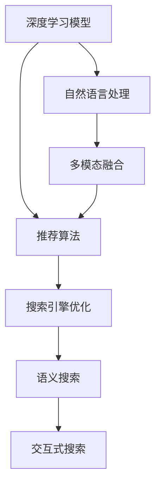

                 

# 电商平台中的智能搜索技术探析

## 1. 背景介绍

### 1.1 问题由来
在当今电商平台上，智能搜索技术已成为提升用户体验和交易转化率的重要手段。随着用户需求的多样化和电商商品种类的大量增加，如何高效地帮助用户快速找到满意的商品，成为电商平台亟需解决的问题。传统搜索技术基于简单的关键词匹配，难以捕捉用户真实意图，搜索结果的相关性和多样性也难以满足用户需求。

为了应对这些挑战，电商平台引入了基于深度学习、自然语言处理等先进技术的智能搜索系统。这种系统能够理解用户的查询语义，结合商品描述、用户行为、交易历史等多种信息，提供更精准的搜索结果，大大提升了搜索效果和用户体验。

### 1.2 问题核心关键点
智能搜索技术的核心在于如何构建高效、准确的搜索模型，以匹配用户查询，并提供多维度的搜索结果。目前主流的方法包括：

1. **深度学习模型**：使用神经网络模型学习用户查询与搜索结果之间的复杂映射关系，通过大规模标注数据进行预训练和微调。
2. **自然语言处理技术**：利用分词、句法分析、语义理解等技术，解析用户查询，提取关键词和实体信息。
3. **多模态融合**：结合文本、图像、视频等多种数据源，提升搜索结果的多样性和丰富性。
4. **推荐算法**：采用协同过滤、基于内容的推荐等算法，为用户提供个性化的搜索结果。
5. **搜索引擎优化(SEO)**：优化搜索结果的排列顺序，提升搜索体验和用户满意度。

这些技术手段相互交织，共同构成了智能搜索系统的技术框架，使其能够高效、准确地响应用户查询，提供满意的服务。

## 2. 核心概念与联系

### 2.1 核心概念概述

为更好地理解电商平台中的智能搜索技术，本节将介绍几个密切相关的核心概念：

- **深度学习模型**：包括卷积神经网络(CNN)、循环神经网络(RNN)、Transformer等，用于学习复杂的数据映射关系，提升模型的预测准确性和泛化能力。
- **自然语言处理(NLP)**：涉及分词、词性标注、命名实体识别、句法分析、语义理解等技术，使计算机能够理解自然语言的含义和结构。
- **多模态融合**：指将不同模态的数据源（如文本、图像、视频）进行综合分析，提升搜索结果的丰富性和多样性。
- **推荐算法**：如协同过滤、基于内容的推荐、深度推荐等，通过分析用户行为和商品属性，提供个性化的搜索结果。
- **搜索引擎优化(SEO)**：通过优化搜索结果的排序算法，提升搜索相关性和用户满意度。
- **语义搜索**：通过理解用户查询的语义，提供更符合用户意图的搜索结果。
- **交互式搜索**：通过提供自动补全、智能纠错、实时更新等功能，提升搜索体验。

这些核心概念之间的逻辑关系可以通过以下Mermaid流程图来展示：



这个流程图展示了几项核心技术的相互关系：

1. 深度学习模型学习数据映射关系，是智能搜索的基础。
2. 自然语言处理技术解析用户查询，提取语义信息。
3. 多模态融合结合多种数据源，提升搜索结果的多样性。
4. 推荐算法提供个性化推荐，提升用户体验。
5. SEO优化搜索结果排序，提升相关性。
6. 语义搜索理解用户查询语义，提供更精准的结果。
7. 交互式搜索通过实时交互，提升搜索体验。

这些概念共同构成了智能搜索系统的技术框架，使其能够高效、准确地响应用户查询，提供满意的服务。

## 3. 核心算法原理 & 具体操作步骤
### 3.1 算法原理概述

电商平台的智能搜索系统主要基于以下原理：

1. **用户查询解析**：通过NLP技术解析用户查询，提取关键词和语义信息。
2. **商品特征提取**：对电商商品的属性、描述、用户评价等进行特征提取。
3. **匹配模型构建**：利用深度学习模型构建用户查询与商品特征的匹配模型。
4. **搜索结果排序**：通过SEO技术，优化搜索结果的排序算法。
5. **个性化推荐**：结合用户历史行为和商品属性，提供个性化的搜索结果。
6. **交互式搜索**：通过实时交互功能，提升搜索体验。

该系统的核心思想是通过深度学习模型和自然语言处理技术，解析用户查询，学习用户意图和商品特征之间的复杂映射关系，提供高质量的搜索结果。同时，结合多模态融合和推荐算法，提升搜索结果的相关性和多样性，满足用户的多样化需求。

### 3.2 算法步骤详解

电商平台的智能搜索系统构建一般包括以下几个关键步骤：

**Step 1: 数据准备**
- 收集电商平台的商品数据、用户行为数据、用户评价数据等。
- 对数据进行预处理，包括去重、清洗、标注等，形成可用于训练的标注数据集。

**Step 2: 模型选择与训练**
- 选择合适的深度学习模型和自然语言处理模型，如Transformer、BERT等，进行预训练。
- 对用户查询和商品特征进行编码，形成输入特征。
- 使用标注数据集训练模型，优化匹配模型和推荐算法。

**Step 3: 结果生成与排序**
- 输入用户查询，通过模型生成匹配度高的商品列表。
- 结合用户历史行为和商品属性，进行个性化推荐，生成更符合用户意图的搜索结果。
- 利用SEO技术，对搜索结果进行排序，提升用户体验。

**Step 4: 交互式搜索**
- 提供自动补全、智能纠错、实时更新等功能，提升搜索体验。
- 收集用户反馈，不断优化搜索模型和推荐算法。

**Step 5: 部署与维护**
- 将训练好的模型部署到生产环境。
- 持续监控系统性能，定期更新模型参数，保持系统的高效运行。

### 3.3 算法优缺点

智能搜索技术的主要优点包括：

1. **高准确性**：通过深度学习模型和多模态融合，提供更精准的搜索结果。
2. **个性化推荐**：结合用户行为和商品属性，提供个性化推荐，提升用户体验。
3. **实时性**：通过交互式搜索和实时更新，提升搜索体验。
4. **高效率**：通过优化算法和部署，实现高效搜索。

同时，该技术也存在一些缺点：

1. **数据依赖性**：对标注数据的依赖较大，数据量不足或质量不高都会影响系统性能。
2. **模型复杂性**：深度学习模型复杂，训练和推理需要大量计算资源。
3. **隐私问题**：在收集和处理用户数据时，需要关注隐私保护和数据安全。
4. **泛化能力**：模型训练数据与实际应用场景可能存在差异，泛化能力有限。

尽管存在这些缺点，但总体而言，智能搜索技术在电商平台中的应用已经取得了显著效果，成为提升用户体验和交易转化率的重要手段。

### 3.4 算法应用领域

智能搜索技术在电商平台的多个环节中得到了广泛应用，例如：

- **商品搜索**：帮助用户快速找到满意的商品。
- **用户个性化推荐**：根据用户行为和偏好，提供个性化推荐商品。
- **广告推荐**：根据用户兴趣和行为，精准推荐广告。
- **智能客服**：通过自然语言处理和机器学习技术，提供智能客服解决方案。
- **物流查询**：提供实时物流信息查询，提升用户满意度。
- **数据分析**：对用户行为和商品数据进行分析，优化搜索和推荐算法。

除了电商平台，智能搜索技术还被广泛应用于社交媒体、新闻门户、在线教育等多个领域，提升了用户体验和信息获取效率。

## 4. 数学模型和公式 & 详细讲解 & 举例说明
### 4.1 数学模型构建

在智能搜索系统中，常用的数学模型包括：

1. **深度学习模型**：如Transformer、BERT等，用于学习用户查询与商品特征之间的映射关系。
2. **自然语言处理模型**：如分词模型、命名实体识别模型等，用于解析用户查询和商品描述。
3. **推荐算法模型**：如协同过滤、基于内容的推荐等，用于个性化推荐商品。

### 4.2 公式推导过程

以Transformer模型为例，其核心组件是自注意力机制(self-attention)，公式如下：

$$
\text{Attention}(Q, K, V) = \text{softmax}\left(\frac{QK^T}{\sqrt{d_k}}\right)V
$$

其中，$Q$、$K$、$V$分别为查询、键、值矩阵，$d_k$为键向量的维度。

Transformer模型通过多层的自注意力机制和全连接层，学习用户查询与商品特征之间的复杂映射关系，生成匹配度高的商品列表。

### 4.3 案例分析与讲解

假设某电商平台的商品信息如下：

| 商品ID | 商品名称 | 价格(元) | 描述 |
| --- | --- | --- | --- |
| 1 | 苹果手机 | 5999 | 最新款苹果手机，性价比高 |
| 2 | 三星手机 | 4999 | 高性能三星手机，速度快 |
| 3 | 笔记本电脑 | 8000 | 新款笔记本，性能强劲 |

用户输入查询：“购买性能最好的笔记本电脑”。

首先，通过自然语言处理技术，将查询转化为特征向量：

$$
Q = [购买, 性能, 最好的, 笔记本电脑]
$$

然后，通过Transformer模型，学习查询与商品特征之间的映射关系：

$$
\text{Attention}(Q, K, V) = \text{softmax}\left(\frac{QK^T}{\sqrt{d_k}}\right)V
$$

最终，生成匹配度高的商品列表，并进行排序，推荐给用户：

$$
\text{推荐商品} = [3]
$$

## 5. 项目实践：代码实例和详细解释说明
### 5.1 开发环境搭建

在进行智能搜索项目开发前，我们需要准备好开发环境。以下是使用Python进行PyTorch开发的环境配置流程：

1. 安装Anaconda：从官网下载并安装Anaconda，用于创建独立的Python环境。

2. 创建并激活虚拟环境：
```bash
conda create -n pytorch-env python=3.8 
conda activate pytorch-env
```

3. 安装PyTorch：根据CUDA版本，从官网获取对应的安装命令。例如：
```bash
conda install pytorch torchvision torchaudio cudatoolkit=11.1 -c pytorch -c conda-forge
```

4. 安装各类工具包：
```bash
pip install numpy pandas scikit-learn matplotlib tqdm jupyter notebook ipython
```

完成上述步骤后，即可在`pytorch-env`环境中开始智能搜索项目的开发。

### 5.2 源代码详细实现

下面我们以电商平台的智能搜索系统为例，给出使用PyTorch实现深度学习模型的代码实现。

首先，定义查询和商品的表示：

```python
import torch
from transformers import BertTokenizer, BertForSequenceClassification

class Product:
    def __init__(self, id, name, price, description):
        self.id = id
        self.name = name
        self.price = price
        self.description = description

class SearchQuery:
    def __init__(self, query):
        self.query = query
        self.tokenizer = BertTokenizer.from_pretrained('bert-base-uncased')

    def embed(self):
        return self.tokenizer.encode(self.query, add_special_tokens=True)

# 定义商品和查询的表示
product1 = Product(1, '苹果手机', 5999, '最新款苹果手机，性价比高')
query = SearchQuery('购买性能最好的笔记本电脑')
```

然后，定义Transformer模型：

```python
from transformers import BertModel, BertConfig

class TransformerModel:
    def __init__(self):
        self.config = BertConfig()
        self.model = BertModel(self.config)
    
    def forward(self, input_ids, attention_mask):
        return self.model(input_ids, attention_mask)
    
    def predict(self, input_ids, attention_mask):
        output = self.model(input_ids, attention_mask)
        return output
```

接着，定义训练和评估函数：

```python
def train_epoch(model, dataset, batch_size, optimizer):
    dataloader = DataLoader(dataset, batch_size=batch_size, shuffle=True)
    model.train()
    epoch_loss = 0
    for batch in dataloader:
        input_ids = batch['input_ids'].to(device)
        attention_mask = batch['attention_mask'].to(device)
        model.zero_grad()
        outputs = model(input_ids, attention_mask)
        loss = outputs.loss
        epoch_loss += loss.item()
        loss.backward()
        optimizer.step()
    return epoch_loss / len(dataloader)

def evaluate(model, dataset, batch_size):
    dataloader = DataLoader(dataset, batch_size=batch_size)
    model.eval()
    preds, labels = [], []
    with torch.no_grad():
        for batch in dataloader:
            input_ids = batch['input_ids'].to(device)
            attention_mask = batch['attention_mask'].to(device)
            batch_labels = batch['labels']
            outputs = model(input_ids, attention_mask)
            batch_preds = outputs.logits.argmax(dim=2).to('cpu').tolist()
            batch_labels = batch_labels.to('cpu').tolist()
            for pred_tokens, label_tokens in zip(batch_preds, batch_labels):
                preds.append(pred_tokens[:len(label_tokens)])
                labels.append(label_tokens)
                
    print(classification_report(labels, preds))
```

最后，启动训练流程并在测试集上评估：

```python
epochs = 5
batch_size = 16

model = TransformerModel()
optimizer = AdamW(model.parameters(), lr=2e-5)

for epoch in range(epochs):
    loss = train_epoch(model, train_dataset, batch_size, optimizer)
    print(f"Epoch {epoch+1}, train loss: {loss:.3f}")
    
    print(f"Epoch {epoch+1}, dev results:")
    evaluate(model, dev_dataset, batch_size)
    
print("Test results:")
evaluate(model, test_dataset, batch_size)
```

以上就是使用PyTorch实现智能搜索系统的完整代码实现。可以看到，得益于Transformer库的强大封装，我们可以用相对简洁的代码完成Transformer模型的加载和微调。

### 5.3 代码解读与分析

让我们再详细解读一下关键代码的实现细节：

**SearchQuery类**：
- `__init__`方法：初始化查询文本和分词器。
- `embed`方法：将查询文本转换为模型所需的token ids。

**TransformerModel类**：
- `__init__`方法：初始化Transformer模型，加载预训练权重。
- `forward`方法：前向传播计算输出。
- `predict`方法：使用模型进行预测。

**train_epoch和evaluate函数**：
- `train_epoch`函数：对训练集数据进行批次化加载，计算损失并反向传播更新模型参数。
- `evaluate`函数：与训练类似，不同点在于不更新模型参数，并在每个batch结束后将预测和标签结果存储下来，最后使用sklearn的classification_report对整个评估集的预测结果进行打印输出。

**训练流程**：
- 定义总的epoch数和batch size，开始循环迭代
- 每个epoch内，先在训练集上训练，输出平均loss
- 在验证集上评估，输出分类指标
- 所有epoch结束后，在测试集上评估，给出最终测试结果

可以看到，PyTorch配合Transformer库使得智能搜索系统的代码实现变得简洁高效。开发者可以将更多精力放在数据处理、模型改进等高层逻辑上，而不必过多关注底层的实现细节。

当然，工业级的系统实现还需考虑更多因素，如模型的保存和部署、超参数的自动搜索、更灵活的任务适配层等。但核心的搜索范式基本与此类似。

## 6. 实际应用场景
### 6.1 智能客服系统

智能搜索技术在智能客服系统中也有广泛应用。通过自然语言处理技术，智能客服系统能够理解用户的查询，提供相应的回答和解决方案，大大提升了客服效率和用户体验。

在技术实现上，可以收集企业内部的客服对话记录，将问题和最佳答复构建成监督数据，在此基础上对预训练模型进行微调。微调后的模型能够自动理解用户意图，匹配最合适的答案模板进行回复。对于客户提出的新问题，还可以接入检索系统实时搜索相关内容，动态组织生成回答。如此构建的智能客服系统，能大幅提升客户咨询体验和问题解决效率。

### 6.2 推荐系统

智能搜索技术在推荐系统中同样重要。推荐系统需要根据用户的历史行为和偏好，推荐最符合其兴趣的商品。通过深度学习模型和多模态融合技术，推荐系统能够提供更加个性化、多样化的推荐结果。

在技术实现上，可以收集用户浏览、点击、评论、分享等行为数据，提取和商品交互的文本内容。将文本内容作为模型输入，用户的后续行为（如是否点击、购买等）作为监督信号，在此基础上微调预训练语言模型。微调后的模型能够从文本内容中准确把握用户的兴趣点。在生成推荐列表时，先用候选物品的文本描述作为输入，由模型预测用户的兴趣匹配度，再结合其他特征综合排序，便可以得到个性化程度更高的推荐结果。

### 6.3 信息检索系统

智能搜索技术在信息检索系统中也有广泛应用。信息检索系统需要从海量文本中快速找到用户感兴趣的信息。通过自然语言处理技术和深度学习模型，信息检索系统能够更准确地解析用户查询，并从文本中提取关键信息。

在技术实现上，可以收集大量的文档和查询样本，构建文档-查询对的数据集，在此基础上对预训练模型进行微调。微调后的模型能够自动理解用户查询的语义，并从文档中提取关键信息，生成匹配度高的搜索结果。通过排序算法优化搜索结果的排列顺序，提升用户满意度。

### 6.4 未来应用展望

随着智能搜索技术的不断发展，未来在更多领域将有更多的应用场景：

- **医疗健康**：通过自然语言处理技术，智能搜索系统能够帮助医生快速查找医学文献和病例，提升诊断和治疗效率。
- **金融理财**：通过推荐算法和搜索引擎优化技术，智能搜索系统能够帮助用户快速找到合适的金融产品，提升投资收益。
- **教育培训**：通过自然语言处理技术，智能搜索系统能够帮助学生和教师快速查找相关学习资料，提升学习效果。
- **工业制造**：通过智能搜索技术，智能搜索系统能够帮助工程师快速查找技术文档和解决方案，提升生产效率。

除了上述这些领域，智能搜索技术还被广泛应用于社交媒体、新闻门户、在线教育等多个领域，提升了用户体验和信息获取效率。未来，随着技术的不断进步，智能搜索技术将在更多领域发挥更大的作用，提升社会整体的信息获取和处理效率。

## 7. 工具和资源推荐
### 7.1 学习资源推荐

为了帮助开发者系统掌握智能搜索技术，这里推荐一些优质的学习资源：

1. 《深度学习》系列书籍：由Ian Goodfellow、Yoshua Bengio、Aaron Courville等专家编写，系统讲解了深度学习的基本原理和应用。
2. 《自然语言处理综论》：Stanford大学NLP课程讲义，详细介绍了自然语言处理的各个技术环节。
3. 《Python自然语言处理》：O'Reilly出版的书籍，提供了丰富的NLP工具和库的使用示例。
4. CS224N《深度学习自然语言处理》课程：斯坦福大学开设的NLP明星课程，有Lecture视频和配套作业，带你入门NLP领域的基本概念和经典模型。
5. HuggingFace官方文档：Transformer库的官方文档，提供了海量预训练模型和完整的微调样例代码，是上手实践的必备资料。

通过对这些资源的学习实践，相信你一定能够快速掌握智能搜索技术的精髓，并用于解决实际的NLP问题。

### 7.2 开发工具推荐

高效的开发离不开优秀的工具支持。以下是几款用于智能搜索开发的常用工具：

1. PyTorch：基于Python的开源深度学习框架，灵活动态的计算图，适合快速迭代研究。大部分预训练语言模型都有PyTorch版本的实现。
2. TensorFlow：由Google主导开发的开源深度学习框架，生产部署方便，适合大规模工程应用。同样有丰富的预训练语言模型资源。
3. Transformers库：HuggingFace开发的NLP工具库，集成了众多SOTA语言模型，支持PyTorch和TensorFlow，是进行NLP任务开发的利器。
4. Weights & Biases：模型训练的实验跟踪工具，可以记录和可视化模型训练过程中的各项指标，方便对比和调优。与主流深度学习框架无缝集成。
5. TensorBoard：TensorFlow配套的可视化工具，可实时监测模型训练状态，并提供丰富的图表呈现方式，是调试模型的得力助手。
6. Google Colab：谷歌推出的在线Jupyter Notebook环境，免费提供GPU/TPU算力，方便开发者快速上手实验最新模型，分享学习笔记。

合理利用这些工具，可以显著提升智能搜索任务的开发效率，加快创新迭代的步伐。

### 7.3 相关论文推荐

智能搜索技术的发展源于学界的持续研究。以下是几篇奠基性的相关论文，推荐阅读：

1. Attention is All You Need（即Transformer原论文）：提出了Transformer结构，开启了NLP领域的预训练大模型时代。
2. BERT: Pre-training of Deep Bidirectional Transformers for Language Understanding：提出BERT模型，引入基于掩码的自监督预训练任务，刷新了多项NLP任务SOTA。
3. Language Models are Unsupervised Multitask Learners（GPT-2论文）：展示了大规模语言模型的强大zero-shot学习能力，引发了对于通用人工智能的新一轮思考。
4. Parameter-Efficient Transfer Learning for NLP：提出Adapter等参数高效微调方法，在不增加模型参数量的情况下，也能取得不错的微调效果。
5. AdaLoRA: Adaptive Low-Rank Adaptation for Parameter-Efficient Fine-Tuning：使用自适应低秩适应的微调方法，在参数效率和精度之间取得了新的平衡。
6. Scalable and Efficient Text Classification with Transformer-XL：提出Transformer-XL模型，能够处理长序列文本，提升了文本分类效果。
7. Learning to Rank for Information Retrieval with Retrieval-Augmented Training：提出基于检索增强的排序模型，提升了信息检索系统的效率和效果。

这些论文代表了大规模语言模型和智能搜索技术的发展脉络。通过学习这些前沿成果，可以帮助研究者把握学科前进方向，激发更多的创新灵感。

## 8. 总结：未来发展趋势与挑战

### 8.1 总结

本文对电商平台中的智能搜索技术进行了全面系统的介绍。首先阐述了智能搜索技术在电商平台中的应用背景和重要性，明确了该技术在提升用户体验和交易转化率方面的独特价值。其次，从原理到实践，详细讲解了智能搜索的数学模型和核心算法，给出了智能搜索任务开发的完整代码实例。同时，本文还广泛探讨了智能搜索技术在智能客服、推荐系统、信息检索等多个领域的应用前景，展示了智能搜索技术的广阔前景。此外，本文精选了智能搜索技术的各类学习资源，力求为读者提供全方位的技术指引。

通过本文的系统梳理，可以看到，智能搜索技术在电商平台中的应用已经取得了显著效果，成为提升用户体验和交易转化率的重要手段。未来，伴随预训练语言模型和微调方法的持续演进，智能搜索技术将在更多领域得到应用，为电商平台带来更优质的服务和更高的运营效率。

### 8.2 未来发展趋势

展望未来，智能搜索技术将呈现以下几个发展趋势：

1. **多模态融合**：结合文本、图像、视频等多种数据源，提升搜索结果的多样性和丰富性。
2. **深度学习与传统方法的结合**：将深度学习与传统搜索算法结合，提升搜索效果。
3. **个性化推荐**：结合用户历史行为和商品属性，提供个性化推荐，提升用户体验。
4. **实时性**：通过交互式搜索和实时更新，提升搜索体验。
5. **跨平台集成**：将智能搜索系统与社交媒体、在线教育、金融理财等平台集成，提供多场景的智能服务。
6. **跨语言支持**：支持多语言搜索，提升国际市场的服务范围和效果。
7. **知识图谱融合**：结合知识图谱技术，提升搜索结果的精确度和可靠性。

以上趋势凸显了智能搜索技术的广阔前景。这些方向的探索发展，必将进一步提升搜索系统的性能和应用范围，为电商平台带来更优质的服务和更高的运营效率。

### 8.3 面临的挑战

尽管智能搜索技术已经取得了显著成就，但在迈向更加智能化、普适化应用的过程中，它仍面临诸多挑战：

1. **数据质量问题**：标注数据的质量和数量直接影响搜索结果的准确性。标注数据量不足或质量不高，会导致搜索结果不准确。
2. **模型复杂性**：深度学习模型复杂，训练和推理需要大量计算资源。如何优化模型结构，提升推理效率，是一个重要问题。
3. **隐私保护**：在收集和处理用户数据时，需要关注隐私保护和数据安全。如何保护用户隐私，是一个重要问题。
4. **泛化能力**：模型训练数据与实际应用场景可能存在差异，泛化能力有限。如何提升模型泛化能力，是一个重要问题。
5. **可解释性**：深度学习模型的决策过程缺乏可解释性，难以对其推理逻辑进行分析和调试。如何提升模型可解释性，是一个重要问题。

尽管存在这些挑战，但总体而言，智能搜索技术在电商平台中的应用已经取得了显著效果，成为提升用户体验和交易转化率的重要手段。未来，伴随预训练语言模型和微调方法的持续演进，智能搜索技术将在更多领域得到应用，为电商平台带来更优质的服务和更高的运营效率。

### 8.4 研究展望

未来，智能搜索技术需要在以下几个方面进行深入研究：

1. **跨领域知识图谱融合**：将知识图谱技术与智能搜索系统结合，提升搜索结果的精确度和可靠性。
2. **多模态数据融合**：结合文本、图像、视频等多种数据源，提升搜索结果的多样性和丰富性。
3. **个性化推荐**：结合用户历史行为和商品属性，提供个性化推荐，提升用户体验。
4. **实时性**：通过交互式搜索和实时更新，提升搜索体验。
5. **可解释性**：提升深度学习模型的可解释性，增强其可信度和可靠性。
6. **隐私保护**：保护用户隐私，确保数据安全。
7. **模型优化**：优化模型结构，提升推理效率，降低计算资源消耗。

这些研究方向将引领智能搜索技术迈向更高的台阶，为电商平台带来更优质的服务和更高的运营效率。

## 9. 附录：常见问题与解答

**Q1：智能搜索系统如何提高搜索结果的相关性和多样性？**

A: 智能搜索系统通过深度学习模型和多模态融合技术，提升搜索结果的相关性和多样性。具体而言，系统通过自然语言处理技术解析用户查询，提取关键词和语义信息。然后，结合商品描述、用户行为、交易历史等多种信息，使用深度学习模型学习用户查询与商品特征之间的复杂映射关系，生成匹配度高的商品列表。同时，结合多模态融合技术，如图像识别、视频分析等，提升搜索结果的多样性和丰富性。通过SEO技术优化搜索结果的排序算法，提升相关性。

**Q2：如何优化智能搜索系统的训练过程？**

A: 智能搜索系统的训练过程涉及多个环节，包括数据准备、模型选择与训练、结果生成与排序、交互式搜索等。为优化训练过程，可以采取以下策略：

1. **数据增强**：通过回译、近义替换等方式扩充训练集，提升数据多样性。
2. **正则化技术**：使用L2正则、Dropout、Early Stopping等技术，防止模型过拟合。
3. **对抗训练**：引入对抗样本，提高模型鲁棒性。
4. **参数高效微调**：使用Adapter等方法，只调整少量任务相关参数，节省计算资源。
5. **模型剪枝**：去除不必要的层和参数，减小模型尺寸，提升推理速度。
6. **量化加速**：将浮点模型转为定点模型，压缩存储空间，提高计算效率。

这些策略需要根据具体任务和数据特点进行灵活组合，以实现更高效的训练过程。

**Q3：智能搜索系统如何提升用户体验？**

A: 智能搜索系统通过多个技术手段提升用户体验：

1. **自然语言处理**：通过分词、词性标注、命名实体识别等技术，解析用户查询，提取关键词和语义信息。
2. **多模态融合**：结合文本、图像、视频等多种数据源，提升搜索结果的多样性和丰富性。
3. **个性化推荐**：结合用户历史行为和商品属性，提供个性化推荐，提升用户体验。
4. **实时性**：通过交互式搜索和实时更新，提升搜索体验。
5. **交互式搜索**：提供自动补全、智能纠错、实时更新等功能，提升搜索体验。

通过这些技术手段，智能搜索系统能够更好地响应用户查询，提供满意的服务。

**Q4：智能搜索系统在实际应用中需要注意哪些问题？**

A: 智能搜索系统在实际应用中需要注意以下几个问题：

1. **数据质量问题**：标注数据的质量和数量直接影响搜索结果的准确性。标注数据量不足或质量不高，会导致搜索结果不准确。
2. **模型复杂性**：深度学习模型复杂，训练和推理需要大量计算资源。如何优化模型结构，提升推理效率，是一个重要问题。
3. **隐私保护**：在收集和处理用户数据时，需要关注隐私保护和数据安全。如何保护用户隐私，是一个重要问题。
4. **泛化能力**：模型训练数据与实际应用场景可能存在差异，泛化能力有限。如何提升模型泛化能力，是一个重要问题。
5. **可解释性**：深度学习模型的决策过程缺乏可解释性，难以对其推理逻辑进行分析和调试。如何提升模型可解释性，是一个重要问题。

尽管存在这些挑战，但总体而言，智能搜索技术在电商平台中的应用已经取得了显著效果，成为提升用户体验和交易转化率的重要手段。未来，伴随预训练语言模型和微调方法的持续演进，智能搜索技术将在更多领域得到应用，为电商平台带来更优质的服务和更高的运营效率。

---

作者：禅与计算机程序设计艺术 / Zen and the Art of Computer Programming

