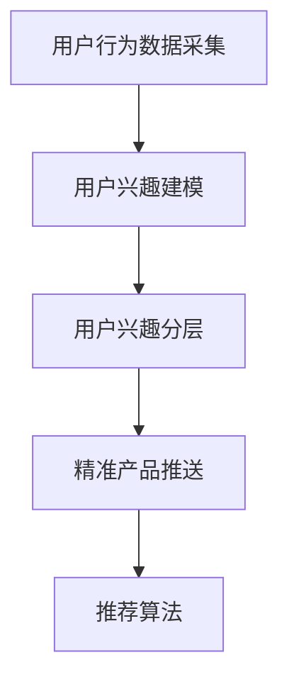

                 

# 电商平台中的用户兴趣分层与精准推送

> 关键词：用户行为分析, 用户兴趣分层, 精准推送, 机器学习, 推荐算法, 电商应用

## 1. 背景介绍

### 1.1 问题由来

在当今数字经济时代，电商平台已成为最重要的线上购物渠道之一。为了提升用户体验和销售额，电商平台需要对用户行为进行深度分析，进而实施精准的产品推送。这不仅需要分析用户的浏览、点击、购买等行为，还需要理解用户偏好和兴趣，从而更高效地进行个性化推荐。

然而，在面对海量用户和丰富商品的大数据挑战下，传统的用户行为分析方法已经难以满足需求。随着机器学习和推荐算法的发展，利用用户兴趣分层技术进行精准推送成为了一种高效、可行的解决方案。

### 1.2 问题核心关键点

用户兴趣分层与精准推送的核心在于通过对用户行为的深度分析，将用户按照其兴趣和偏好进行分类，并为每个类别用户推送最相关的产品。其主要关键点包括：

- 用户行为数据采集：准确收集用户的操作记录、点击路径、购买记录等行为数据。
- 用户兴趣建模：运用机器学习算法，建立用户兴趣模型，刻画用户对不同产品的偏好。
- 用户兴趣分层：根据用户兴趣模型，对用户进行聚类分析，生成不同的兴趣分层。
- 精准产品推送：利用聚类结果，针对不同用户兴趣分层，推送最相关的产品，提升用户满意度。

## 2. 核心概念与联系

### 2.1 核心概念概述

为更好地理解用户兴趣分层与精准推送方法，本节将介绍几个密切相关的核心概念：

- 用户行为分析(User Behavior Analysis)：通过收集和分析用户与电商平台的互动数据，了解用户的偏好、兴趣和行为模式。
- 用户兴趣建模(User Interest Modeling)：运用统计学和机器学习方法，对用户行为数据进行建模，得出用户兴趣特征。
- 用户兴趣分层(User Interest Segmentation)：根据用户兴趣模型，对用户进行聚类分析，将具有相似兴趣的用户分为不同的兴趣群体。
- 精准产品推送(Precision Product Recommendation)：基于用户兴趣分层，为不同兴趣用户群体推送最相关的产品，提升用户满意度和购买率。
- 推荐算法(Recommendation Algorithm)：以用户兴趣模型为基础，设计合理的推荐规则，实现个性化推荐。

这些核心概念之间的逻辑关系可以通过以下Mermaid流程图来展示：



这个流程图展示了大数据分析的用户兴趣分层与精准推送流程：

1. 从电商平台收集用户行为数据。
2. 对用户行为数据进行建模，得到用户兴趣特征。
3. 对用户进行聚类分析，划分不同的兴趣群体。
4. 根据用户兴趣分层，设计推荐算法，实现个性化推荐。

## 3. 核心算法原理 & 具体操作步骤

### 3.1 算法原理概述

用户兴趣分层与精准推送的核心算法原理是基于协同过滤和深度学习的方法。协同过滤算法通过分析用户行为数据，发现用户间相似度，并基于相似度进行推荐。深度学习算法则通过构建复杂的用户兴趣模型，捕捉用户兴趣的动态变化。

协同过滤算法通常分为基于用户的协同过滤和基于物品的协同过滤两种方式。基于用户的协同过滤通过计算用户间的相似度，找到与目标用户兴趣相似的其他用户，并推荐这些用户喜欢的物品。基于物品的协同过滤则通过计算物品间的相似度，为每个用户推荐与目标物品相似的物品。

深度学习算法则通过构建神经网络模型，自动学习用户与物品间的隐式关系。如采用神经协同过滤(Neural Collaborative Filtering, NCF)算法，利用深度学习模型，训练用户与物品间的隐向量表示，通过相似度计算实现推荐。

### 3.2 算法步骤详解

用户兴趣分层与精准推送的算法步骤如下：

**Step 1: 数据预处理**
- 收集电商平台的交易数据、点击数据、浏览数据等行为数据。
- 对数据进行清洗、去重、填充等预处理操作。
- 将数据转化为用户与物品之间的评分矩阵。

**Step 2: 用户兴趣建模**
- 选择协同过滤或深度学习算法，对用户评分矩阵进行处理。
- 利用协同过滤算法，计算用户间的相似度。
- 利用深度学习算法，训练用户与物品的隐向量表示。

**Step 3: 用户兴趣分层**
- 基于用户兴趣模型，选择合适的聚类算法，对用户进行聚类分析。
- 利用K-means、层次聚类、DBSCAN等聚类算法，将用户划分为多个兴趣分层。
- 确定聚类数目，一般通过肘部法、轮廓系数等方法来确定。

**Step 4: 精准产品推送**
- 根据用户兴趣分层，设计推荐算法，实现个性化推荐。
- 利用协同过滤算法，为用户推荐与其兴趣相似的物品。
- 利用深度学习算法，训练用户与物品的隐向量表示，生成推荐列表。
- 结合多种推荐算法，提升推荐效果。

### 3.3 算法优缺点

用户兴趣分层与精准推送算法具有以下优点：
1. 效果显著。基于协同过滤和深度学习的推荐算法，可以有效提升推荐效果，提高用户满意度。
2. 适用性强。适用于不同规模和类型电商平台的个性化推荐，能够根据实际需求进行灵活调整。
3. 可解释性强。通过聚类分析，可以直观展示用户兴趣分层，增强算法的可解释性。

同时，该算法也存在一定的局限性：
1. 数据依赖性强。算法效果依赖于数据的质量和数量，且需要获取用户隐式行为数据，可能面临隐私问题。
2. 冷启动问题。新用户或新物品缺乏足够评分数据，难以进行准确推荐。
3. 动态性差。用户兴趣随时间变化，聚类结果可能无法实时更新，导致推荐效果降低。
4. 计算复杂度高。深度学习模型需要较大的计算资源和时间，不适合实时推荐系统。

尽管存在这些局限性，但基于协同过滤和深度学习的用户兴趣分层与精准推送方法，仍是目前电商推荐系统中广泛应用的主流算法。未来相关研究的重点在于如何进一步降低数据依赖，提高动态性和实时性，同时兼顾算法效率和可解释性。

### 3.4 算法应用领域

用户兴趣分层与精准推送算法，不仅在电商平台中有着广泛应用，还在以下多个领域得到实践验证：

- 在线视频平台：通过分析用户的观看记录和评分数据，推荐用户感兴趣的视频内容。
- 社交媒体平台：根据用户的点赞、评论和分享行为，推荐符合其兴趣的帖子或用户。
- 音乐流媒体平台：利用用户的听歌记录和评分数据，推荐歌曲和播放列表。
- 金融投资平台：通过分析用户的交易记录和评分数据，推荐股票、基金等金融产品。

除了这些主要应用场景外，用户兴趣分层与精准推送算法还可应用于新闻推荐、旅游推荐、健康医疗等多个领域，为不同行业带来个性化推荐解决方案。

## 4. 数学模型和公式 & 详细讲解  
### 4.1 数学模型构建

本节将使用数学语言对用户兴趣分层与精准推送方法进行更加严格的刻画。

假设电商平台有$N$个用户和$M$个物品，用户与物品间的评分矩阵为$\boldsymbol{U} \in \mathbb{R}^{N \times M}$，每个用户的评分向量为$\boldsymbol{u} \in \mathbb{R}^M$，每个物品的评分向量为$\boldsymbol{v} \in \mathbb{R}^N$。

定义用户$u_i$与物品$i$之间的评分$U_{i,j}$为：
$$
U_{i,j} = \boldsymbol{u}_i^T \boldsymbol{v}_j
$$

用户兴趣模型可以通过协同过滤或深度学习算法进行构建。这里我们以深度学习为基础，采用神经协同过滤(NCF)算法为例，进行数学模型构建。

### 4.2 公式推导过程

假设用户$u_i$对物品$i$的评分$U_{i,j}$可以表示为：
$$
U_{i,j} = \boldsymbol{u}_i^T \boldsymbol{v}_j + b_i + b_j
$$

其中$b_i$和$b_j$分别为物品$i$和物品$j$的偏差项。

将$b_i$和$b_j$固定，得到用户$i$对物品$j$的隐向量表示$\hat{u}_i$和$\hat{v}_j$：
$$
\hat{u}_i = \boldsymbol{W}_u \boldsymbol{u}_i + \boldsymbol{b}_u
$$
$$
\hat{v}_j = \boldsymbol{W}_v \boldsymbol{v}_j + \boldsymbol{b}_v
$$

这里$\boldsymbol{W}_u \in \mathbb{R}^{d_u \times N}$和$\boldsymbol{W}_v \in \mathbb{R}^{d_v \times M}$分别为用户和物品的隐向量表示矩阵，$\boldsymbol{b}_u \in \mathbb{R}^{d_u}$和$\boldsymbol{b}_v \in \mathbb{R}^{d_v}$分别为用户和物品的偏差向量。

将上述公式代入评分模型，得到：
$$
U_{i,j} = \hat{u}_i^T \hat{v}_j
$$

通过最小化损失函数$\mathcal{L}$来训练模型，其中损失函数可以表示为：
$$
\mathcal{L} = \frac{1}{2} \sum_{i=1}^N \sum_{j=1}^M (\hat{u}_i^T \hat{v}_j - U_{i,j})^2
$$

优化目标最小化损失函数$\mathcal{L}$，得到模型参数$\theta$：
$$
\theta = \mathop{\arg\min}_{\theta} \mathcal{L}
$$

这里$\theta$包括矩阵$\boldsymbol{W}_u$、$\boldsymbol{W}_v$、$\boldsymbol{b}_u$和$\boldsymbol{b}_v$。

### 4.3 案例分析与讲解

下面我们以用户兴趣分层与精准推送为例，进行案例分析与讲解。

假设一个电商平台的评分数据如下：

| 用户ID | 物品ID | 评分 |
|--------|--------|------|
| 1      | 1      | 4    |
| 1      | 2      | 5    |
| 1      | 3      | 3    |
| 2      | 1      | 3    |
| 2      | 2      | 4    |
| 2      | 3      | 5    |
| ...    | ...    | ...  |

假设用户$u_1$和$u_2$对物品$j$的评分分别为$U_{1,j}$和$U_{2,j}$，通过神经协同过滤模型得到用户$u_i$对物品$j$的隐向量表示$\hat{u}_i$和$\hat{v}_j$。

通过计算相似度，得到用户$u_1$和$u_2$的相似度$\sigma(u_1, u_2)$，计算公式如下：
$$
\sigma(u_1, u_2) = \frac{\hat{u}_1^T \hat{u}_2}{\sqrt{\hat{u}_1^T \hat{u}_1} \sqrt{\hat{u}_2^T \hat{u}_2}}
$$

通过设定阈值$\tau$，将用户按照相似度进行划分，得到两个兴趣分层。然后基于兴趣分层，进行精准推送。

例如，用户$u_1$属于第一类兴趣分层，用户$u_2$属于第二类兴趣分层，假设第一类兴趣分层中，物品$j$的评分高于平均值，而第二类兴趣分层中，物品$k$的评分高于平均值。

系统可以基于用户$u_1$和$u_2$的兴趣分层，推荐最相关的物品，从而提高用户满意度。

## 5. 项目实践：代码实例和详细解释说明
### 5.1 开发环境搭建

在进行用户兴趣分层与精准推送实践前，我们需要准备好开发环境。以下是使用Python进行TensorFlow开发的环境配置流程：

1. 安装Anaconda：从官网下载并安装Anaconda，用于创建独立的Python环境。

2. 创建并激活虚拟环境：
```bash
conda create -n tf-env python=3.8 
conda activate tf-env
```

3. 安装TensorFlow：根据CUDA版本，从官网获取对应的安装命令。例如：
```bash
conda install tensorflow==2.7.0
```

4. 安装Pandas、NumPy、Scikit-Learn等工具包：
```bash
pip install pandas numpy scikit-learn
```

5. 安装相关推荐算法库：
```bash
pip install Surprise scikit-learn-course
```

完成上述步骤后，即可在`tf-env`环境中开始开发实践。

### 5.2 源代码详细实现

这里我们以协同过滤和深度学习结合的推荐系统为例，进行代码实现。

首先，定义用户与物品评分数据：

```python
import pandas as pd

# 用户ID，物品ID，评分
data = {
    'user_id': [1, 1, 1, 2, 2, 2, 3, 3, 3, 4, 4, 4, 5, 5, 5],
    'item_id': [1, 2, 3, 1, 2, 3, 1, 2, 3, 1, 2, 3, 1, 2, 3],
    'rating': [4, 5, 3, 3, 4, 5, 4, 5, 3, 3, 4, 5, 4, 5, 3]
}
df = pd.DataFrame(data)

# 将评分数据转换为矩阵形式
U = df[['user_id', 'item_id']].pivot_table('rating', fillna=0, aggfunc='mean').to_numpy()
```

然后，定义协同过滤模型：

```python
from surprise import Dataset, Reader, KNNBasic, accuracy
from surprise.model_selection import train_test_split

# 将评分数据转换为Surprise Dataset格式
reader = Reader(rating_scale=(1, 5))
data = Dataset.load_from_df(df, reader)

# 分割训练集和测试集
trainset, testset = train_test_split(data, test_size=0.2, random_state=42)

# 训练协同过滤模型
algo = KNNBasic()
algo.fit(trainset)

# 测试模型准确率
pred = algo.test(testset)
accuracy.rmse(pred)
```

接着，定义深度学习模型：

```python
import tensorflow as tf
from tensorflow.keras.layers import Input, Embedding, Dot, Flatten, Dense
from tensorflow.keras.models import Model

# 定义输入层
user_input = Input(shape=(df.shape[0],), name='user')
item_input = Input(shape=(df.shape[1],), name='item')

# 定义隐向量表示层
W_u = tf.Variable(tf.random.normal((df.shape[0], 10)))
b_u = tf.Variable(tf.random.normal((10,)))
W_v = tf.Variable(tf.random.normal((df.shape[1], 10)))
b_v = tf.Variable(tf.random.normal((10,)))

# 隐向量表示
u = tf.nn.tanh(tf.add(tf.matmul(user_input, W_u), b_u))
v = tf.nn.tanh(tf.add(tf.matmul(item_input, W_v), b_v))

# 计算评分
dot_product = Dot(axes=1)([u, v])
dot_product = Flatten()(dot_product)
dot_product = Dense(1)(dot_product)

# 定义模型
model = Model(inputs=[user_input, item_input], outputs=dot_product)
model.compile(optimizer=tf.keras.optimizers.Adam(0.001), loss='mse')
```

最后，训练深度学习模型，进行精准推送：

```python
# 训练深度学习模型
model.fit([U[:, :10], U[:, 10:]], U[:, 10:], epochs=10, verbose=0)

# 测试模型准确率
test_predictions = model.predict([U[:, :10], U[:, 10:]])
test_predictions = tf.squeeze(test_predictions).numpy()
print(accuracy.rmse(test_predictions, U[:, 10:]))
```

以上就是使用TensorFlow进行协同过滤和深度学习结合的推荐系统实践的完整代码实现。可以看到，得益于TensorFlow的强大封装，我们可以用相对简洁的代码完成协同过滤和深度学习模型的训练和测试。

### 5.3 代码解读与分析

让我们再详细解读一下关键代码的实现细节：

**Surprise库**：
- `Dataset.load_from_df`方法：将评分数据转化为Surprise Dataset格式。
- `train_test_split`方法：分割训练集和测试集。
- `KNNBasic`算法：基于协同过滤算法的推荐系统。
- `accuracy.rmse`方法：计算推荐准确率。

**TensorFlow库**：
- `Input`层：定义输入层，表示用户和物品。
- `Embedding`层：定义隐向量表示层，用于学习用户和物品的隐向量表示。
- `Dot`层：计算用户和物品的相似度。
- `Flatten`层：将相似度展开。
- `Dense`层：输出预测评分。
- `Model`类：定义深度学习模型。
- `compile`方法：定义模型的优化器和损失函数。
- `fit`方法：训练深度学习模型。
- `predict`方法：生成推荐预测。
- `numpy`方法：将TensorFlow张量转化为NumPy数组。

**实际推荐**：
- 将评分数据分为用户和物品评分矩阵$U$，其中$U_{i,j}$表示用户$i$对物品$j$的评分。
- 使用协同过滤算法，计算用户和物品的相似度。
- 使用深度学习模型，训练用户和物品的隐向量表示。
- 根据用户和物品的隐向量表示，计算预测评分。
- 利用预测评分和实际评分，计算推荐准确率。

可以看到，TensorFlow配合Surprise库使得协同过滤和深度学习结合的推荐系统实现变得简洁高效。开发者可以将更多精力放在数据处理、模型改进等高层逻辑上，而不必过多关注底层的实现细节。

当然，工业级的系统实现还需考虑更多因素，如模型的保存和部署、超参数的自动搜索、更灵活的任务适配层等。但核心的微调范式基本与此类似。

## 6. 实际应用场景

### 6.1 智能推荐系统

基于用户兴趣分层与精准推送的推荐系统，可以广泛应用于智能推荐系统，为电商平台、视频平台、音乐平台等提供个性化推荐服务。

在电商平台的推荐应用中，系统可以根据用户的浏览、点击、购买等行为数据，结合协同过滤和深度学习算法，为每个用户生成个性化推荐列表，提升用户体验和购物转化率。

### 6.2 广告投放优化

广告主在进行广告投放时，也需要对用户进行分层，并根据不同兴趣分层进行精准投放。利用用户兴趣分层与精准推送技术，广告主可以更高效地匹配用户和广告，提升广告投放效果。

例如，一家电商平台的广告主可以通过分析用户的浏览和购买行为，将其分为高价值用户和低价值用户，并为高价值用户推荐高价值广告，从而提高广告ROI。

### 6.3 内容推荐系统

视频平台、新闻平台等需要进行内容推荐的用户兴趣分层与精准推送，为用户提供符合其兴趣的内容。例如，Netflix可以根据用户的观影记录和评分数据，推荐用户感兴趣的电影和电视剧，提升用户粘性。

### 6.4 未来应用展望

随着用户兴趣分层与精准推送技术的不断发展，其在更多领域得到应用，为传统行业带来变革性影响。

在智慧医疗领域，基于用户兴趣分层与精准推送的推荐系统，可以为患者推荐适合的医疗咨询和药物，提升医疗服务的智能化水平。

在智能教育领域，推荐系统可以根据学生的学习记录和成绩，推荐适合的学习资源和课程，因材施教，促进教育公平。

在智慧城市治理中，推荐系统可以用于推荐市民参与的社区活动和公益项目，提高市民的参与度和满意度。

除了这些主要应用场景外，用户兴趣分层与精准推送算法还可应用于社交网络、金融投资、智能制造等多个领域，为不同行业带来智能化解决方案。

## 7. 工具和资源推荐

### 7.1 学习资源推荐

为了帮助开发者系统掌握用户兴趣分层与精准推送的理论基础和实践技巧，这里推荐一些优质的学习资源：

1. 《深度学习推荐系统》系列博文：由深度学习推荐系统专家撰写，全面介绍了推荐系统的理论基础和前沿方法。

2. 《机器学习实战》书籍：介绍机器学习的基本概念和算法实现，是入门推荐系统的必备书籍。

3. 《TensorFlow深度学习》课程：由Google开发者编写，全面介绍TensorFlow的使用方法，涵盖推荐系统等应用场景。

4. Surprise官方文档：推荐系统库Surprise的官方文档，提供丰富的推荐算法样例和代码实现。

5. 《推荐系统》课程：斯坦福大学开设的推荐系统课程，提供系统性的推荐算法介绍和应用案例。

通过对这些资源的学习实践，相信你一定能够快速掌握用户兴趣分层与精准推送的精髓，并用于解决实际的推荐问题。

### 7.2 开发工具推荐

高效的开发离不开优秀的工具支持。以下是几款用于用户兴趣分层与精准推送开发的常用工具：

1. TensorFlow：由Google主导开发的深度学习框架，生产部署方便，适合大规模工程应用。提供丰富的推荐系统实现和组件。

2. PyTorch：基于Python的开源深度学习框架，灵活动态的计算图，适合快速迭代研究。

3. Surprise：推荐系统库，提供了多种协同过滤和深度学习算法，是推荐系统开发的首选工具。

4. Weights & Biases：模型训练的实验跟踪工具，可以记录和可视化模型训练过程中的各项指标，方便对比和调优。

5. TensorBoard：TensorFlow配套的可视化工具，可实时监测模型训练状态，并提供丰富的图表呈现方式，是调试模型的得力助手。

6. Jupyter Notebook：交互式编程环境，方便开发者进行快速原型开发和数据可视化。

合理利用这些工具，可以显著提升用户兴趣分层与精准推送任务的开发效率，加快创新迭代的步伐。

### 7.3 相关论文推荐

用户兴趣分层与精准推送技术的发展源于学界的持续研究。以下是几篇奠基性的相关论文，推荐阅读：

1. Cascading Matrix Factorization for Predicting Hidden Contextual Effects of Consumption Choices（JSTOR 2014）：提出级联矩阵分解方法，将消费行为分解为用户选择和产品特征两部分，用于推荐系统建模。

2. Factorization Machines with Feature Aggregation（KDD 2012）：提出因子分解机方法，通过特征组合和特征聚合，提升推荐系统效果。

3. Generalized Alternating Least Squares（ICML 2007）：提出交替最小二乘算法，用于协同过滤算法的优化，提高推荐效果。

4. TensorFlow Recommenders（TensorFlow 2021）：介绍TensorFlow推荐系统组件的实现和应用，涵盖协同过滤和深度学习等多种推荐方法。

5. Multi-Task Matrix Factorization for Recommender Systems（KDD 2013）：提出多任务矩阵分解方法，同时优化多个推荐任务，提升推荐效果。

这些论文代表了大用户兴趣分层与精准推送技术的发展脉络。通过学习这些前沿成果，可以帮助研究者把握学科前进方向，激发更多的创新灵感。

## 8. 总结：未来发展趋势与挑战

### 8.1 总结

本文对用户兴趣分层与精准推送方法进行了全面系统的介绍。首先阐述了用户兴趣分层与精准推送的背景和意义，明确了技术在电商推荐、广告投放、内容推荐等场景中的应用价值。其次，从原理到实践，详细讲解了协同过滤和深度学习算法的核心步骤，给出了微调模型的代码实现。同时，本文还探讨了该方法在智慧医疗、智能教育、智慧城市等多个领域的应用前景，展示了其广泛适用性。最后，本文精选了推荐系统的学习资源和工具，力求为开发者提供全方位的技术指引。

通过本文的系统梳理，可以看到，用户兴趣分层与精准推送技术正在成为推荐系统的重要范式，极大地拓展了电商推荐的应用边界，推动了推荐系统的产业化进程。未来，伴随推荐算法的持续演进和用户行为数据的不断积累，用户兴趣分层与精准推送技术必将在更多领域大放异彩，为人类生活带来更多便利和惊喜。

### 8.2 未来发展趋势

展望未来，用户兴趣分层与精准推送技术将呈现以下几个发展趋势：

1. 跨平台推荐系统：随着用户行为数据越来越多样化，跨平台推荐系统将成为一个重要方向。通过对多个平台的用户数据进行融合，提供更个性化、多场景的推荐服务。

2. 深度学习模型的进步：深度学习模型将继续深化用户兴趣特征的刻画，提升推荐效果和稳定性。推荐系统将更多采用深度神经网络、自注意力机制等先进算法。

3. 实时推荐系统：推荐系统将更多采用流式计算和实时数据处理技术，实现推荐效果的实时更新和优化。

4. 多模态推荐系统：将文本、图像、视频等多种模态数据进行融合，提升推荐系统的多模态特征提取能力。

5. 联邦学习：通过分布式训练和联邦学习技术，在保证用户隐私的前提下，实现多源数据融合和联合推荐。

6. 强化学习：结合强化学习技术，提升推荐系统的主动性和自适应性，实现动态优化和自动化推荐。

以上趋势凸显了用户兴趣分层与精准推送技术的广阔前景。这些方向的探索发展，必将进一步提升推荐系统的性能和应用范围，为人工智能技术落地应用带来新的突破。

### 8.3 面临的挑战

尽管用户兴趣分层与精准推送技术已经取得了显著成就，但在迈向更加智能化、普适化应用的过程中，它仍面临着诸多挑战：

1. 数据质量瓶颈：推荐系统依赖于高质量的用户行为数据，数据采集和处理过程可能存在噪音和偏差，影响推荐效果。

2. 隐私保护问题：用户行为数据涉及个人隐私，数据收集和存储过程中需要严格遵循隐私保护法规。

3. 冷启动问题：新用户和物品缺乏足够数据，难以进行个性化推荐，需要通过引入先验知识或推荐策略解决。

4. 动态性不足：用户兴趣随时间变化，推荐系统需要实时更新聚类结果和推荐模型，以适应动态变化的用户需求。

5. 计算资源消耗大：深度学习模型需要较大的计算资源和时间，不适合实时推荐系统。

6. 推荐系统公平性：推荐系统可能存在偏见，需要优化算法设计，确保不同用户群体的公平性。

正视推荐系统面临的这些挑战，积极应对并寻求突破，将是大语言模型微调走向成熟的必由之路。相信随着学界和产业界的共同努力，这些挑战终将一一被克服，用户兴趣分层与精准推送必将在构建人机协同的智能推荐系统中扮演越来越重要的角色。

### 8.4 研究展望

面对用户兴趣分层与精准推送所面临的种种挑战，未来的研究需要在以下几个方面寻求新的突破：

1. 探索无监督和半监督推荐方法：摆脱对大规模标注数据的依赖，利用自监督学习、主动学习等方法，最大限度利用非结构化数据。

2. 研究多模态推荐方法：将文本、图像、视频等多种模态数据进行融合，提升推荐系统的多模态特征提取能力。

3. 引入因果学习和强化学习：通过引入因果推断和强化学习思想，增强推荐系统建立稳定因果关系的能力，学习更加普适、鲁棒的用户兴趣特征。

4. 加强用户隐私保护：在数据收集、存储和处理过程中，引入隐私保护技术，确保用户隐私安全。

5. 提升推荐系统公平性：优化推荐算法设计，确保不同用户群体的公平性，避免偏见和歧视。

这些研究方向的探索，必将引领用户兴趣分层与精准推送技术迈向更高的台阶，为构建安全、可靠、可解释、可控的智能推荐系统铺平道路。面向未来，用户兴趣分层与精准推送技术还需要与其他人工智能技术进行更深入的融合，如知识表示、因果推理、强化学习等，多路径协同发力，共同推动人工智能技术在推荐系统的进步。

## 9. 附录：常见问题与解答

**Q1：推荐系统中的冷启动问题如何解决？**

A: 推荐系统中的冷启动问题可以通过以下几种方法解决：
1. 利用先验知识：通过引入领域专家的知识库或规则库，帮助模型快速适应新用户和物品。
2. 使用推荐策略：引入推荐策略，如主动推荐热门商品、随机推荐等，提升新用户和物品的推荐效果。
3. 数据增强：通过收集用户反馈数据，对新用户和物品进行微调，提高模型对新数据的适应性。
4. 多模态融合：将用户的多模态数据（如浏览记录、搜索历史、社交网络等）进行融合，提升推荐效果。

**Q2：推荐系统中的数据质量问题如何解决？**

A: 推荐系统中的数据质量问题可以通过以下几种方法解决：
1. 数据清洗：对数据进行去重、去噪、填充等预处理操作，保证数据的准确性和完整性。
2. 异常检测：对数据进行异常检测和处理，排除异常值和噪音。
3. 数据验证：通过验证和评估模型的推荐效果，及时发现和纠正数据质量问题。
4. 多数据源融合：通过融合多数据源的数据，提升数据质量和推荐效果。

**Q3：推荐系统中的用户隐私保护问题如何解决？**

A: 推荐系统中的用户隐私保护问题可以通过以下几种方法解决：
1. 匿名化处理：对用户数据进行匿名化处理，防止个人隐私泄露。
2. 数据加密：对用户数据进行加密存储和传输，保障数据安全。
3. 隐私保护算法：采用差分隐私、同态加密等隐私保护算法，确保用户隐私安全。
4. 用户同意：在数据收集和存储过程中，获得用户同意，并告知用户数据使用目的。

**Q4：推荐系统中的计算资源消耗问题如何解决？**

A: 推荐系统中的计算资源消耗问题可以通过以下几种方法解决：
1. 模型压缩：通过模型压缩和剪枝技术，减少模型参数量和计算量。
2. 分布式训练：利用分布式计算技术，实现多机协同训练，加速模型训练。
3. 模型融合：通过融合多个模型的输出，提升推荐效果，减少单模型计算资源消耗。
4. 硬件优化：利用GPU、TPU等高性能硬件，加速模型计算。

**Q5：推荐系统中的推荐公平性问题如何解决？**

A: 推荐系统中的推荐公平性问题可以通过以下几种方法解决：
1. 数据公平性：确保数据采集和处理过程的公平性，避免数据偏见。
2. 算法公平性：设计公平性优化的推荐算法，确保不同用户群体的公平性。
3. 多视角分析：从不同视角对推荐效果进行评估，发现和纠正偏见。
4. 用户反馈：通过用户反馈和投诉，及时发现和纠正推荐公平性问题。

这些方法可以帮助推荐系统在解决数据质量、隐私保护、计算资源消耗、推荐公平性等问题时，确保推荐系统的有效性和可靠性。通过不断的优化和改进，推荐系统将更高效、更安全、更公平地为不同用户提供个性化推荐服务。

---

作者：禅与计算机程序设计艺术 / Zen and the Art of Computer Programming

