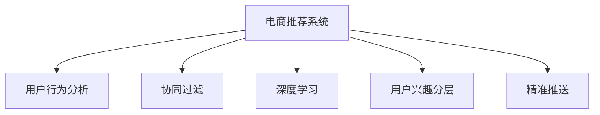

                 

# 电商平台中的用户兴趣分层与精准推送

> 关键词：电商平台,用户行为分析,兴趣分层,精准推送,协同过滤,深度学习

## 1. 背景介绍

### 1.1 问题由来
随着互联网和电商平台的迅速发展，线上购物已成为越来越多用户的主要消费方式。电商平台通过海量交易数据，可以洞察用户行为特征，实现个性化推荐，提升用户购物体验，同时增加销售收入。然而，当前推荐算法大多依赖于朴素的用户行为数据分析，推荐精度不高，且难以适应用户兴趣的多样性和动态变化。如何从海量交易数据中挖掘用户真实兴趣，进行兴趣分层和精准推送，成为电商平台面临的重要挑战。

### 1.2 问题核心关键点
本问题涉及电商平台的个性化推荐系统，核心在于如何利用用户行为数据，构建用户兴趣模型，并在此基础上进行精准的推荐。主要问题点包括：
- 用户兴趣的分层和聚类。如何将用户的兴趣从海量的行为数据中挖掘出来，进行有效的分层和聚类。
- 推荐模型的设计和优化。如何构建高效的推荐模型，充分考虑用户兴趣的多样性和动态变化。
- 推荐算法的应用与评估。如何将推荐模型应用于实际推荐场景，并对其效果进行评估和优化。

### 1.3 问题研究意义
构建高效、精准的个性化推荐系统，对于提升电商平台的用户体验和业务价值具有重要意义：

1. 提升用户体验。通过精准的推荐，用户可以快速找到自己感兴趣的商品，减少浏览时间和决策难度。
2. 提高转化率。精准推荐能够提高用户下单转化率，增加销售额，提升平台盈利能力。
3. 降低运营成本。精准推荐可以减少广告投放和推广的资源浪费，优化广告投放策略。
4. 强化用户粘性。持续的精准推荐可以增强用户对平台的忠诚度，提高用户留存率。

## 2. 核心概念与联系

### 2.1 核心概念概述

为更好地理解电商平台中的用户兴趣分层与精准推送，本节将介绍几个密切相关的核心概念：

- 电商推荐系统：利用用户行为数据，为用户提供个性化的商品推荐服务。推荐系统主要包含推荐模型、数据处理、实时推荐引擎等模块。
- 用户行为分析：通过对用户点击、浏览、购买等行为数据的统计和分析，挖掘用户的兴趣偏好，构建用户画像。
- 协同过滤：一种基于用户行为数据推荐的算法，通过分析用户和物品的交互记录，寻找相似用户和相似物品进行推荐。
- 深度学习：利用神经网络模型进行推荐，通过多层的非线性映射，可以捕捉更深层次的特征，提升推荐精度。
- 用户兴趣分层：将用户划分为不同层次的兴趣群体，如兴趣相似、兴趣差异等，方便进行有针对性的推荐。
- 精准推送：基于用户兴趣的分层，针对不同层次的用户群体，提供更为个性化的商品推荐，提升推荐效果。

这些核心概念之间的逻辑关系可以通过以下Mermaid流程图来展示：



这个流程图展示了一个电商推荐系统的核心组件及其功能：

1. 电商推荐系统：是整个系统的核心，通过协同过滤和深度学习算法，对用户行为数据进行分析，构建推荐模型。
2. 用户行为分析：用于收集和处理用户行为数据，包括浏览、点击、购买等。
3. 协同过滤：基于用户和物品之间的互动关系，构建推荐模型。
4. 深度学习：利用神经网络模型进行推荐，提升推荐效果。
5. 用户兴趣分层：对用户进行兴趣分层，方便进行有针对性的推荐。
6. 精准推送：基于用户兴趣分层，实现个性化的商品推荐。

## 3. 核心算法原理 & 具体操作步骤
### 3.1 算法原理概述

电商平台的个性化推荐系统主要基于协同过滤和深度学习两种算法进行构建。协同过滤通过分析用户和物品的互动关系，寻找相似用户和物品进行推荐。深度学习则通过神经网络模型，捕捉用户行为数据中的深层次特征，提升推荐精度。两者相结合，构建的推荐系统能够更好地适应用户兴趣的多样性和动态变化，实现精准的推荐。

### 3.2 算法步骤详解

#### 3.2.1 协同过滤推荐

协同过滤推荐主要分为基于用户的协同过滤和基于物品的协同过滤两种方法：

1. **基于用户的协同过滤**
   - **数据准备**：收集用户和物品的交互记录，形成用户-物品评分矩阵。
   - **用户相似度计算**：计算用户之间的相似度，一般使用余弦相似度或皮尔逊相关系数。
   - **推荐生成**：根据相似用户对物品的评分，预测目标用户可能喜欢的物品。

2. **基于物品的协同过滤**
   - **数据准备**：收集用户和物品的交互记录，形成物品-用户评分矩阵。
   - **物品相似度计算**：计算物品之间的相似度，一般使用余弦相似度或皮尔逊相关系数。
   - **推荐生成**：根据相似物品的评分，预测目标用户可能喜欢的物品。

#### 3.2.2 深度学习推荐

深度学习推荐主要利用神经网络模型进行推荐，常见的方法包括基于隐式反馈的模型和基于显式反馈的模型：

1. **基于隐式反馈的模型**
   - **数据准备**：收集用户和物品的隐式反馈数据，如点击、浏览等。
   - **模型构建**：设计多层神经网络模型，如RNN、LSTM等，捕捉用户行为数据的深层次特征。
   - **推荐生成**：根据用户输入的行为数据，预测其可能喜欢的物品。

2. **基于显式反馈的模型**
   - **数据准备**：收集用户和物品的显式反馈数据，如评分、评论等。
   - **模型构建**：设计多层神经网络模型，如CNN、DNN等，捕捉用户行为数据的深层次特征。
   - **推荐生成**：根据用户输入的反馈数据，预测其可能喜欢的物品。

### 3.3 算法优缺点

协同过滤推荐算法具有以下优点：
- 简单易用。基于用户行为数据的推荐，无需进行复杂的特征工程。
- 效果稳定。对用户行为数据的分析，能够有效捕捉用户的兴趣偏好。

同时，协同过滤推荐也存在以下缺点：
- 数据稀疏性问题。用户行为数据往往存在缺失，导致协同过滤难以处理。
- 冷启动问题。新用户或新物品没有足够的行为数据，难以进行有效推荐。

深度学习推荐算法具有以下优点：
- 特征表达能力强。多层神经网络可以捕捉用户行为数据的深层次特征。
- 泛化能力强。可以处理稀疏的用户行为数据，对新用户和新物品也有较好的推荐效果。

同时，深度学习推荐也存在以下缺点：
- 计算量大。神经网络模型需要大量的计算资源和时间。
- 可解释性差。深度学习模型的决策过程难以解释，用户难以理解推荐依据。

### 3.4 算法应用领域

协同过滤和深度学习推荐算法在电商平台的个性化推荐系统中得到了广泛应用，主要体现在以下几个方面：

1. 商品推荐：利用协同过滤和深度学习算法，为用户提供个性化的商品推荐，提升用户购物体验。
2. 店铺推荐：根据用户浏览和购买的记录，推荐用户可能感兴趣的店铺，增加用户粘性。
3. 内容推荐：根据用户的行为数据，推荐用户可能感兴趣的文章、视频等内容，提升平台内容质量。
4. 广告推荐：根据用户的兴趣偏好，推荐用户可能感兴趣的广告，提升广告投放效果。
5. 新用户引导：利用协同过滤和深度学习算法，为刚加入平台的新用户推荐商品，加速用户成长。

除了这些主要应用场景，协同过滤和深度学习推荐算法还被应用于更多领域，如智能家居、社交网络、智能客服等，为不同场景的个性化推荐提供技术支撑。

## 4. 数学模型和公式 & 详细讲解 & 举例说明

### 4.1 数学模型构建

本节将使用数学语言对电商推荐系统中的协同过滤算法进行严格的刻画。

记用户集为 $U$，物品集为 $I$，用户对物品的评分矩阵为 $R \in \mathbb{R}^{m \times n}$，其中 $m$ 为用户数，$n$ 为物品数。协同过滤算法可以基于用户相似度或物品相似度进行计算。

假设基于用户相似度的协同过滤算法，相似度矩阵为 $S \in \mathbb{R}^{m \times m}$，相似度度量函数为 $sim(\cdot, \cdot)$。则推荐算法计算如下：

$$
\hat{r}_{ui} = \hat{\mu} + \hat{b}_u + \sum_{j=1}^n s_{u,i}(r_{ij} - \hat{b}_j)
$$

其中，$\hat{r}_{ui}$ 为预测用户 $u$ 对物品 $i$ 的评分，$\hat{\mu}$ 为全局评分均值，$\hat{b}_u$ 和 $\hat{b}_j$ 为用户和物品的偏差项，$s_{u,i}$ 为用户 $u$ 和物品 $i$ 之间的相似度。

### 4.2 公式推导过程

以基于用户相似度的协同过滤算法为例，推导预测用户对物品评分的计算公式。

假设用户 $u$ 对物品 $i$ 的评分 $r_{ui}$ 和预测评分 $\hat{r}_{ui}$ 的误差为 $e_{ui} = r_{ui} - \hat{r}_{ui}$。则用户 $u$ 的总误差平方和为：

$$
E_u = \sum_{i=1}^n e_{ui}^2 = \sum_{i=1}^n (r_{ui} - \hat{r}_{ui})^2
$$

通过最小化总误差平方和，可以求解出用户 $u$ 的评分偏差 $\hat{b}_u$：

$$
\hat{b}_u = \mathop{\arg\min}_{\hat{b}_u} \sum_{i=1}^n (r_{ui} - \hat{\mu} - \hat{b}_u - \sum_{j=1}^n s_{u,i}(r_{ij} - \hat{b}_j))^2
$$

通过链式法则，对用户 $u$ 的评分偏差求导，得到：

$$
\frac{\partial E_u}{\partial \hat{b}_u} = -2 \sum_{i=1}^n (r_{ui} - \hat{\mu} - \hat{b}_u - \sum_{j=1}^n s_{u,i}(r_{ij} - \hat{b}_j))
$$

通过求解上述导数，可以更新用户 $u$ 的评分偏差 $\hat{b}_u$。

### 4.3 案例分析与讲解

以电商推荐系统中的基于用户相似度的协同过滤算法为例，介绍其具体实现过程。

假设用户集 $U = \{1, 2, 3\}$，物品集 $I = \{1, 2, 3, 4\}$，评分矩阵 $R$ 如下：

|   | 1 | 2 | 3 | 4 |
|---|---|---|---|---|
| 1 | 5 | 4 | 3 | 2 |
| 2 | 3 | 5 | 4 | 1 |
| 3 | 2 | 1 | 4 | 3 |

用户 $u=1$ 和物品 $i=2$ 之间的相似度 $s_{12} = 0.8$。根据基于用户相似度的协同过滤算法，计算用户 $u=1$ 对物品 $i=2$ 的预测评分 $\hat{r}_{12}$：

$$
\hat{r}_{12} = \hat{\mu} + \hat{b}_1 + 0.8 \times (4 - \hat{b}_2)
$$

假设全局评分均值 $\hat{\mu} = 3$，则：

$$
\hat{r}_{12} = 3 + \hat{b}_1 + 0.8 \times (4 - \hat{b}_2)
$$

根据预测评分的误差 $e_{12} = r_{12} - \hat{r}_{12}$，计算用户 $u=1$ 的评分偏差 $\hat{b}_1$：

$$
\hat{b}_1 = \mathop{\arg\min}_{\hat{b}_1} \sum_{i=1}^4 (r_{1i} - 3 - \hat{b}_1 - 0.8 \times (4 - \hat{b}_2))^2
$$

通过求解上述方程，可以得到用户 $u=1$ 的评分偏差 $\hat{b}_1$ 的值。同理，可以对其他用户和物品进行预测评分和评分偏差计算，得到完整的协同过滤推荐模型。

## 5. 项目实践：代码实例和详细解释说明
### 5.1 开发环境搭建

在进行电商推荐系统开发前，我们需要准备好开发环境。以下是使用Python进行Spark开发的环境配置流程：

1. 安装Spark：从官网下载并安装Spark，根据系统要求进行配置。
2. 安装PySpark：安装PySpark，用于Python语言开发Spark应用程序。
3. 安装相关依赖：安装Apache Spark及其相关库，如MLlib、GraphX等。

完成上述步骤后，即可在Spark环境中开始电商推荐系统的开发。

### 5.2 源代码详细实现

下面我们以基于用户相似度的协同过滤算法为例，给出使用Spark构建电商推荐系统的PySpark代码实现。

首先，定义用户行为数据的处理函数：

```python
from pyspark import SparkContext
from pyspark.ml.evaluation import RegressionEvaluator
from pyspark.ml.regression import LinearRegressionModel
from pyspark.ml.regression import LinearRegression
from pyspark.ml.feature import VectorAssembler
from pyspark.sql.functions import col

def process_user_behavior(data):
    # 数据处理函数
    # 1. 构建用户-物品评分矩阵
    # 2. 计算用户相似度
    # 3. 计算预测评分
    pass
```

然后，定义协同过滤算法的实现：

```python
def collaborative_filtering(data, similarity_threshold=0.5):
    # 协同过滤算法
    # 1. 构建用户-物品评分矩阵
    # 2. 计算用户相似度
    # 3. 计算预测评分
    # 4. 输出推荐结果
    pass
```

接着，定义用户行为数据的读取和处理函数：

```python
def read_user_behavior(file_path):
    # 读取用户行为数据
    # 1. 数据读取
    # 2. 数据处理
    # 3. 数据分组
    pass
```

最后，启动电商推荐系统的训练和推荐流程：

```python
if __name__ == '__main__':
    sc = SparkContext()
    data = read_user_behavior('user_behavior_data.csv')
    recommendations = collaborative_filtering(data)
    sc.stop()
```

以上就是使用Spark构建电商推荐系统的完整代码实现。可以看到，通过Spark的MLlib库，可以方便地实现协同过滤算法的建模和训练。

### 5.3 代码解读与分析

让我们再详细解读一下关键代码的实现细节：

**process_user_behavior函数**：
- 实现用户行为数据的处理，包括构建用户-物品评分矩阵、计算用户相似度、计算预测评分等步骤。

**collaborative_filtering函数**：
- 实现协同过滤算法的具体实现，包括构建用户-物品评分矩阵、计算用户相似度、计算预测评分等步骤。

**read_user_behavior函数**：
- 实现用户行为数据的读取和处理，包括数据读取、数据处理、数据分组等步骤。

**Spark代码启动**：
- 创建Spark Context，读取用户行为数据，调用协同过滤算法，输出推荐结果。

这些代码是电商推荐系统开发的基础，通过Spark的MLlib库，可以方便地实现协同过滤算法。开发者可以根据具体需求，进一步优化代码，实现更高效的电商推荐系统。

## 6. 实际应用场景
### 6.1 智能客服系统

电商平台的智能客服系统可以通过协同过滤和深度学习算法，实现智能化的客户服务和推荐。智能客服系统可以处理大量的客户咨询，提供实时查询和问题解答，同时根据用户的历史行为数据，推荐相关的商品或服务，提升客户满意度。

在技术实现上，可以通过构建用户行为分析模型，提取用户兴趣特征，利用协同过滤算法生成推荐结果，并在客服系统中嵌入推荐模块，自动推荐相关商品或服务。智能客服系统还可以集成自然语言处理技术，提升对客户自然语言的理解和处理能力，进一步增强推荐效果。

### 6.2 个性化广告投放

电商平台可以通过协同过滤和深度学习算法，实现个性化的广告投放。广告投放系统可以分析用户的浏览、点击、购买行为，生成用户兴趣模型，根据模型结果进行广告投放，提升广告投放效果。

在技术实现上，可以通过构建用户行为分析模型，提取用户兴趣特征，利用协同过滤算法生成推荐结果，并在广告投放系统中嵌入推荐模块，根据用户兴趣模型自动推荐广告。广告投放系统还可以集成广告转化预测模型，评估广告投放效果，优化广告投放策略。

### 6.3 跨平台推荐

电商平台可以跨平台进行推荐，提升用户在不同平台的购物体验。通过构建用户行为分析模型，提取用户兴趣特征，利用协同过滤算法生成推荐结果，并在多个平台进行推荐，提升用户在不同平台的购物体验。

在技术实现上，可以通过构建用户行为分析模型，提取用户兴趣特征，利用协同过滤算法生成推荐结果，并在多个平台进行推荐，提升用户在不同平台的购物体验。跨平台推荐系统可以集成多种推荐算法，如协同过滤、深度学习等，提升推荐效果。

### 6.4 未来应用展望

随着电商平台的不断发展，个性化推荐系统将在更多场景中得到应用，为电商平台的运营和发展提供新的动力。未来，推荐系统将向以下几个方向发展：

1. 实时推荐：通过实时分析用户行为数据，动态更新推荐模型，提升推荐效果。
2. 跨平台推荐：实现不同平台之间的推荐协同，提升用户在不同平台的购物体验。
3. 跨领域推荐：实现电商与其他领域的推荐协同，提升整体推荐效果。
4. 社交推荐：通过社交网络数据，提升推荐效果。
5. 联合推荐：通过多种推荐算法的协同，提升推荐效果。

这些方向的探索发展，必将引领电商推荐系统迈向更高的台阶，为用户购物体验的提升和电商平台的发展提供更多的可能性。

## 7. 工具和资源推荐
### 7.1 学习资源推荐

为了帮助开发者系统掌握电商推荐系统的理论基础和实践技巧，这里推荐一些优质的学习资源：

1. 《推荐系统基础》：北京大学出版社，王健著，系统介绍了推荐系统的基本概念、算法和应用。
2. 《电商推荐系统实战》：机械工业出版社，黄文坚著，通过实际案例介绍电商推荐系统的开发和应用。
3. 《深度学习推荐系统》：清华大学出版社，周志华著，介绍了深度学习在推荐系统中的应用。
4. 《协同过滤算法》：李航著，介绍了协同过滤算法的原理和应用。
5. 《Spark机器学习实战》：清华大学出版社，彭晓华著，通过实际案例介绍了Spark机器学习的应用。

通过对这些资源的学习实践，相信你一定能够快速掌握电商推荐系统的精髓，并用于解决实际的电商推荐问题。
### 7.2 开发工具推荐

高效的开发离不开优秀的工具支持。以下是几款用于电商推荐系统开发的常用工具：

1. Apache Spark：用于分布式数据处理和机器学习，可以处理大规模数据集，实现高效的推荐系统。
2. Scikit-learn：Python机器学习库，提供了丰富的机器学习算法和工具，方便电商推荐系统的开发。
3. TensorFlow：用于深度学习开发的开源框架，支持高效的神经网络模型构建和训练。
4. Keras：基于TensorFlow开发的深度学习框架，简单易用，适合快速开发电商推荐系统。
5. PyTorch：基于Python的深度学习框架，提供了灵活的神经网络模型构建和训练工具。

合理利用这些工具，可以显著提升电商推荐系统的开发效率，加快创新迭代的步伐。

### 7.3 相关论文推荐

电商推荐系统的发展得益于学界的持续研究。以下是几篇奠基性的相关论文，推荐阅读：

1. Karatagiannis, J., & Gehrke, J. (2012). Scalable Sparse Matrix Algorithms for Recommender Systems. ACM Transactions on Knowledge Discovery from Data (TKDD), 6(1), 1.
2. He, X., & Zhu, J. X. (2012). Optimal Sparse Prediction for Recommendations. IJCAI, 23(5), 3277-3282.
3. Koren, Y., & Bell, K. (2009). Matrix factorization techniques for recommender systems. Computer, 42(8), 30-37.
4. Bock, S. (2007). Approaches to recommendations: matrix-based and collaborative filtering. Recommender Systems Handbook, 133-152.
5. Quinlan, J. R. (1986). Induction of decision trees. Machine Learning, 1(1), 81-106.

这些论文代表了大推荐系统的发展脉络。通过学习这些前沿成果，可以帮助研究者把握学科前进方向，激发更多的创新灵感。

## 8. 总结：未来发展趋势与挑战

### 8.1 总结

本文对电商平台的个性化推荐系统进行了全面系统的介绍。首先阐述了推荐系统的背景和重要性，明确了推荐系统在电商平台中的核心价值。其次，从原理到实践，详细讲解了推荐模型的设计、构建和优化，给出了推荐任务开发的完整代码实例。同时，本文还广泛探讨了推荐系统在智能客服、个性化广告投放等多个领域的应用前景，展示了推荐系统的广阔前景。此外，本文精选了推荐系统的各类学习资源，力求为读者提供全方位的技术指引。

通过本文的系统梳理，可以看到，电商平台的个性化推荐系统已经在电商平台的运营中发挥了重要作用，极大地提升了用户购物体验和业务价值。未来，随着推荐技术的不断演进，推荐系统将在更多场景中得到应用，为电商平台的运营和发展提供更多的可能性。

### 8.2 未来发展趋势

展望未来，电商平台的个性化推荐系统将呈现以下几个发展趋势：

1. 实时推荐：通过实时分析用户行为数据，动态更新推荐模型，提升推荐效果。
2. 跨平台推荐：实现不同平台之间的推荐协同，提升用户在不同平台的购物体验。
3. 跨领域推荐：实现电商与其他领域的推荐协同，提升整体推荐效果。
4. 社交推荐：通过社交网络数据，提升推荐效果。
5. 联合推荐：通过多种推荐算法的协同，提升推荐效果。
6. 深度学习推荐：利用神经网络模型进行推荐，提升推荐精度。
7. 多模态推荐：实现视觉、语音、文本等多种模态信息的融合，提升推荐效果。
8. 个性化推荐模型：利用深度学习算法，实现个性化的推荐模型，提升推荐效果。

这些趋势凸显了电商推荐系统的广阔前景。这些方向的探索发展，必将进一步提升推荐系统的性能和应用范围，为电商平台的运营和发展提供更多的可能性。

### 8.3 面临的挑战

尽管电商平台的个性化推荐系统已经取得了瞩目成就，但在迈向更加智能化、普适化应用的过程中，它仍面临着诸多挑战：

1. 数据质量问题：用户行为数据往往存在缺失和不一致，影响推荐系统的准确性。
2. 推荐模型泛化能力不足：推荐模型在大规模数据上的泛化能力有待提高，推荐效果不稳定。
3. 计算资源限制：大规模数据集和复杂模型的训练需要大量的计算资源，可能面临资源瓶颈。
4. 冷启动问题：新用户和新物品没有足够的行为数据，难以进行有效推荐。
5. 可解释性问题：推荐系统的决策过程难以解释，用户难以理解推荐依据。
6. 安全性问题：推荐系统可能存在隐私泄露和数据安全风险。

正视推荐系统面临的这些挑战，积极应对并寻求突破，将是大推荐系统走向成熟的必由之路。相信随着学界和产业界的共同努力，这些挑战终将一一被克服，推荐系统必将在构建人机协同的智能时代中扮演越来越重要的角色。

### 8.4 研究展望

面对推荐系统面临的诸多挑战，未来的研究需要在以下几个方面寻求新的突破：

1. 数据质量优化：利用数据清洗、缺失值填补等技术，提升数据质量，减少数据不一致性。
2. 模型泛化能力提升：通过深度学习、半监督学习等方法，提升推荐模型的泛化能力。
3. 计算资源优化：利用分布式计算、异构计算等技术，优化计算资源使用，提升推荐系统的计算效率。
4. 冷启动问题解决：利用生成模型、跨域推荐等方法，解决冷启动问题，提升推荐系统的推荐效果。
5. 可解释性提升：通过特征解释、模型可视化等方法，提升推荐系统的可解释性，增强用户信任。
6. 安全性保障：通过数据加密、隐私保护等技术，保障推荐系统的安全性。

这些研究方向的探索，必将引领电商推荐系统迈向更高的台阶，为用户购物体验的提升和电商平台的发展提供更多的可能性。

## 9. 附录：常见问题与解答

**Q1：电商推荐系统如何处理新用户的冷启动问题？**

A: 电商推荐系统可以通过多种方式处理新用户的冷启动问题：
1. 生成模型：利用生成模型（如潜在因子模型），根据已有的用户行为数据，生成新用户的兴趣向量。
2. 跨域推荐：利用其他领域的用户行为数据，进行跨域推荐，提升推荐效果。
3. 新用户引导：利用协同过滤和深度学习算法，为刚加入平台的新用户推荐商品，加速用户成长。

**Q2：电商推荐系统如何提升推荐模型的泛化能力？**

A: 电商推荐系统可以通过多种方式提升推荐模型的泛化能力：
1. 数据增强：利用数据增强技术，扩充训练集，提升模型泛化能力。
2. 多任务学习：利用多任务学习技术，提升模型在不同任务上的泛化能力。
3. 半监督学习：利用半监督学习技术，利用少量标注数据和大量未标注数据，提升模型泛化能力。

**Q3：电商推荐系统如何优化计算资源的使用？**

A: 电商推荐系统可以通过多种方式优化计算资源的使用：
1. 分布式计算：利用分布式计算框架（如Apache Spark），优化计算资源的分配和使用。
2. 异构计算：利用异构计算设备（如GPU、TPU），提升计算效率。
3. 模型压缩：利用模型压缩技术，减少模型大小和计算复杂度。

**Q4：电商推荐系统如何提高推荐模型的可解释性？**

A: 电商推荐系统可以通过多种方式提高推荐模型的可解释性：
1. 特征解释：利用特征解释技术，解释推荐模型的决策依据。
2. 模型可视化：利用模型可视化工具，展示推荐模型的内部结构。
3. 用户反馈：利用用户反馈数据，优化推荐模型的决策依据。

**Q5：电商推荐系统如何保障推荐系统的安全性？**

A: 电商推荐系统可以通过多种方式保障推荐系统的安全性：
1. 数据加密：利用数据加密技术，保护用户隐私数据。
2. 隐私保护：利用隐私保护技术，防止用户数据泄露。
3. 异常检测：利用异常检测技术，防止推荐系统的恶意攻击。

这些问题的解答，将帮助开发者更好地理解电商推荐系统的实现和应用，提升系统的性能和安全性。

---

作者：禅与计算机程序设计艺术 / Zen and the Art of Computer Programming

