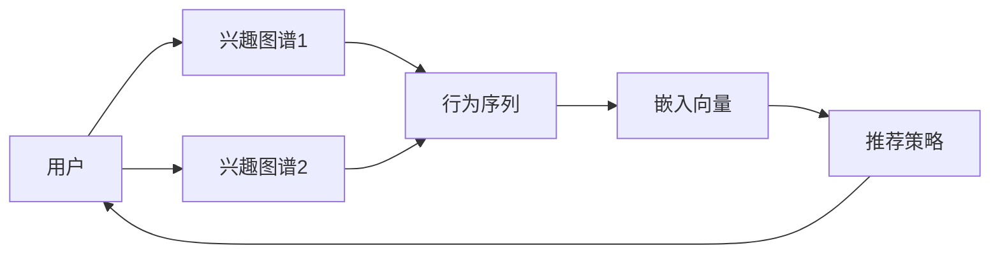

                 

# 电商平台中的用户兴趣图谱动态演化机制

## 1. 背景介绍

在数字化的电商平台上，用户兴趣图谱(Interest Graph)是驱动个性化推荐的核心资产。通过追踪用户在平台上的行为数据，建立其兴趣图谱，电商平台可以为其推荐最相关的商品，提升用户满意度和转化率。然而，由于用户兴趣图谱受到众多因素的影响，如用户行为、市场动态、平台策略等，兴趣图谱的演化过程往往非常复杂。因此，深入理解用户兴趣图谱的动态演化机制，把握其演变规律，对于电商平台制定有效的推荐策略、优化用户体验具有重要意义。

本文章将重点探讨电商平台中用户兴趣图谱的动态演化机制，旨在帮助电商平台更好地理解和预测用户行为，提供更精准的商品推荐，增强平台的竞争力。文章将从背景、核心概念、算法原理、具体操作步骤、实际应用等多个方面进行深入分析，并通过案例和代码实例展示兴趣图谱动态演化的过程。

## 2. 核心概念与联系

### 2.1 核心概念概述

为更好地理解用户兴趣图谱的动态演化，我们先来定义几个关键概念：

- 用户兴趣图谱(Interest Graph)：通过分析用户在电商平台上浏览、购买、评价等行为数据，构建的用户行为和商品特征之间的关联图谱。该图谱以用户节点和商品节点为顶点，用户行为关系为边，描述用户与商品之间的兴趣关系。

- 行为序列(Interaction Sequence)：用户与电商平台互动的一系列行为数据，如浏览、点击、购买、评价等。行为序列通常以时间顺序排列，反映了用户行为的演进过程。

- 嵌入向量(Embedding Vector)：通过机器学习模型，将用户行为数据转换为高维空间中的向量表示。嵌入向量能够捕捉到行为数据中的隐含语义，为构建兴趣图谱提供了基础。

- 兴趣转移(Interest Transfer)：用户在特定时间范围内，兴趣图谱的动态变化过程。该过程受用户行为、市场动态、推荐策略等多种因素影响。

- 推荐策略(Recommendation Strategy)：电商平台为了提升用户体验，根据用户兴趣图谱制定的一系列推荐规则和策略。推荐策略通常包括个性化推荐、群体推荐、热门推荐等多种方式。

这些概念共同构成了用户兴趣图谱动态演化的基础。通过深入理解这些概念，我们能够更好地把握用户兴趣图谱的演变过程，制定更有效的推荐策略。

### 2.2 核心概念原理和架构的 Mermaid 流程图



## 3. 核心算法原理 & 具体操作步骤

### 3.1 算法原理概述

用户兴趣图谱的动态演化过程，本质上是一个序列数据的时间演化过程。通过分析用户行为序列，我们可以构建用户兴趣图谱，并在用户行为序列的演变过程中，实时更新兴趣图谱。用户兴趣图谱的构建和更新过程，涉及以下几个关键步骤：

1. 收集用户行为数据：通过用户在电商平台上的浏览、点击、购买等行为数据，构建用户行为序列。
2. 构建用户兴趣图谱：通过机器学习模型，将用户行为序列转化为嵌入向量，并构建用户兴趣图谱。
3. 兴趣图谱动态更新：根据用户行为序列的实时变化，动态更新用户兴趣图谱，反映用户兴趣的演变过程。
4. 推荐策略调整：根据动态更新的用户兴趣图谱，实时调整推荐策略，提升推荐效果。

### 3.2 算法步骤详解

以下是对用户兴趣图谱动态演化过程的详细步骤描述：

**Step 1: 数据预处理**

用户行为数据通常是多维的、异构的，且数据量巨大。因此，首先需要对数据进行清洗、去重、归一化等预处理操作，以便后续建模分析。

具体步骤包括：
1. 数据清洗：删除噪声数据和无效行为，如重复点击、无效购买等。
2. 数据归一化：将不同行为数据转化为统一的量纲，如将浏览时长转换为分钟数，购买金额转换为标准单位。
3. 数据融合：将不同来源的行为数据进行合并，形成完整的用户行为序列。

**Step 2: 用户行为嵌入**

通过机器学习模型，将用户行为序列转化为嵌入向量，捕捉行为数据中的隐含语义。

具体步骤包括：
1. 选择嵌入模型：如LSTM、GRU、Transformer等，将用户行为序列作为输入，生成嵌入向量序列。
2. 向量编码：将嵌入向量序列转化为高维空间中的向量表示，用于后续的兴趣图谱构建。
3. 向量压缩：采用降维技术，如PCA、t-SNE等，将高维向量压缩到低维空间，减少计算复杂度。

**Step 3: 构建用户兴趣图谱**

通过将用户嵌入向量与商品特征向量进行匹配，构建用户兴趣图谱。

具体步骤包括：
1. 商品特征向量提取：将商品属性、价格、销量等特征转化为向量表示，用于与用户嵌入向量进行匹配。
2. 图谱构建：将用户嵌入向量与商品特征向量进行相似度计算，生成用户与商品的兴趣关系图谱。
3. 图谱稀疏化：对用户兴趣图谱进行稀疏化处理，去除冗余节点和边，提高图谱效率。

**Step 4: 兴趣图谱动态更新**

根据用户行为序列的实时变化，动态更新用户兴趣图谱，反映用户兴趣的演变过程。

具体步骤包括：
1. 实时数据采集：收集用户最新的行为数据，如浏览记录、购买行为等。
2. 图谱更新：根据实时数据，动态更新用户嵌入向量，重新构建用户兴趣图谱。
3. 图谱缓存：将最新的用户兴趣图谱缓存到数据库中，以便后续调用。

**Step 5: 推荐策略调整**

根据动态更新的用户兴趣图谱，实时调整推荐策略，提升推荐效果。

具体步骤包括：
1. 策略调整：根据最新的用户兴趣图谱，重新计算推荐算法中的权重参数。
2. 实时推荐：根据调整后的推荐策略，实时计算用户个性化推荐结果。
3. 推荐结果展示：将推荐结果展示给用户，提升用户体验。

### 3.3 算法优缺点

用户兴趣图谱的动态演化算法具有以下优点：

1. 实时性：通过实时更新用户兴趣图谱，能够快速响应用户行为变化，提升推荐效果。
2. 鲁棒性：通过采用嵌入向量和图谱稀疏化技术，能够有效处理大规模异构数据，提高算法鲁棒性。
3. 可扩展性：通过分布式计算和缓存机制，能够处理海量用户行为数据，满足大规模应用需求。
4. 高精度：通过采用先进机器学习模型，能够捕捉到用户行为数据中的隐含语义，提高推荐精度。

同时，该算法也存在一些局限性：

1. 数据依赖：用户兴趣图谱的动态演化高度依赖于数据质量，数据缺失或不准确会导致推荐效果下降。
2. 计算复杂度：大规模用户行为数据的嵌入向量和图谱构建过程，计算复杂度高，需要高性能计算资源。
3. 隐私风险：用户行为数据的采集和处理，存在隐私泄露的风险，需要采取有效的隐私保护措施。
4. 冷启动问题：新用户或新商品往往缺少足够行为数据，难以构建准确的兴趣图谱，需要引入其他推荐方法进行补充。

### 3.4 算法应用领域

用户兴趣图谱的动态演化算法已经在电商、社交、广告等多个领域得到广泛应用，具体应用场景包括：

- 电商推荐系统：通过动态更新用户兴趣图谱，实时调整推荐策略，提升商品推荐效果。
- 社交网络分析：通过构建用户兴趣图谱，分析用户间的关系和兴趣偏好，提升社交推荐效果。
- 广告投放优化：通过用户兴趣图谱，实时调整广告投放策略，提高广告点击率和转化率。

## 4. 数学模型和公式 & 详细讲解 & 举例说明

### 4.1 数学模型构建

用户兴趣图谱的动态演化过程，可以通过数学模型进行建模和求解。具体而言，可以使用以下数学模型来描述用户兴趣图谱的构建和更新过程：

设用户节点集合为 $U$，商品节点集合为 $I$，行为序列为 $S$，用户行为嵌入向量为 $E_u$，商品特征向量为 $E_i$，用户兴趣图谱为 $G=(U, I, E)$，其中 $E$ 为嵌入矩阵。

**Step 1: 数据预处理**

通过数据清洗和归一化操作，将用户行为数据转化为标准格式，即 $S=(X_1, X_2, ..., X_n)$，其中 $X_i$ 为用户在时间 $t_i$ 的行为数据。

**Step 2: 行为嵌入**

采用嵌入模型，将行为序列 $S$ 转化为嵌入向量序列 $E_s$，即 $E_s=f(S)$。

**Step 3: 构建图谱**

根据用户嵌入向量 $E_u$ 和商品特征向量 $E_i$，构建用户兴趣图谱 $G=(U, I, E)$，即 $E=f(U, I, E_u, E_i)$。

**Step 4: 图谱更新**

根据实时行为数据 $S'$，动态更新用户嵌入向量 $E_u'$，重新构建用户兴趣图谱 $G'=(U, I, E')$，即 $E'=f(U, I, E_u', E_i)$。

### 4.2 公式推导过程

以下我们以LSTM模型为例，推导行为嵌入和图谱更新的公式：

设用户行为序列为 $S=(x_1, x_2, ..., x_t)$，其中 $x_t$ 表示用户在时间 $t$ 的行为数据，如浏览记录、点击行为等。

采用LSTM模型，将行为序列 $S$ 转化为嵌入向量序列 $E_s$，即 $E_s=f(S)$。

具体推导过程如下：

设LSTM模型的隐藏状态为 $h_t$，输出向量为 $o_t$，则LSTM模型的前向传播过程为：

$$
h_t = \tanh(W_h h_{t-1} + U_h x_t + b_h)
$$
$$
o_t = \tanh(W_o h_{t-1} + U_o x_t + b_o)
$$

其中 $W_h, U_h, b_h$ 为LSTM的权重和偏置项，$W_o, U_o, b_o$ 为输出层权重和偏置项。

LSTM模型的后向传播过程为：

$$
\delta_o_t = o_t \odot (1 - \tanh^2(o_t)) \cdot (y_t - \hat{y}_t)
$$
$$
\delta_h_t = (\delta_o_t * W_o^T + \delta_{o_{t+1}} * U_o^T) \cdot \tanh'(h_{t-1})
$$
$$
\delta_x_t = (\delta_h_t * U_h^T + \delta_{h_{t+1}} * W_h^T) \cdot \tanh'(x_t)
$$
$$
\delta_b_h = \delta_h_t
$$
$$
\delta_b_o = \delta_o_t
$$

其中 $y_t$ 为真实输出，$\hat{y}_t$ 为模型输出，$\tanh'$ 为tanh函数的导数，$\odot$ 为逐元素乘积。

根据上述推导过程，LSTM模型能够将行为序列转化为嵌入向量序列 $E_s$，用于后续的图谱构建和更新。

### 4.3 案例分析与讲解

下面我们以电商推荐系统为例，详细分析用户兴趣图谱动态演化的过程。

设电商平台用户 $U=\{u_1, u_2, ..., u_n\}$，商品 $I=\{i_1, i_2, ..., i_m\}$，用户行为序列 $S=\{S_{u_1}, S_{u_2}, ..., S_{u_n}\}$，其中 $S_{u_j}=\{x_{j1}, x_{j2}, ..., x_{jt}\}$ 为用户 $u_j$ 的时间 $t$ 内的行为序列。

假设平台采用LSTM模型，将行为序列转化为嵌入向量 $E_s$，并将用户嵌入向量 $E_u$ 与商品特征向量 $E_i$ 进行匹配，构建用户兴趣图谱 $G=(U, I, E)$。

具体步骤包括：
1. 数据预处理：将用户行为数据进行清洗、归一化等操作，转化为标准格式 $S$。
2. 行为嵌入：采用LSTM模型，将行为序列 $S$ 转化为嵌入向量序列 $E_s$。
3. 图谱构建：根据用户嵌入向量 $E_u$ 和商品特征向量 $E_i$，构建用户兴趣图谱 $G=(U, I, E)$。
4. 图谱更新：根据用户最新的行为数据 $S'$，动态更新用户嵌入向量 $E_u'$，重新构建用户兴趣图谱 $G'=(U, I, E')$。
5. 推荐策略调整：根据最新的用户兴趣图谱 $G'$，实时调整推荐策略，提升推荐效果。

假设某用户在时间 $t_1$ 浏览了一件商品 $i_1$，时间 $t_2$ 点击了另一件商品 $i_2$。根据行为序列 $S$，平台使用LSTM模型，将行为序列转化为嵌入向量 $E_s$，并根据用户嵌入向量 $E_u$ 和商品特征向量 $E_i$，构建用户兴趣图谱 $G=(U, I, E)$。

假设用户后续的时间 $t_3$ 浏览了一件新商品 $i_3$，根据行为序列 $S'$，平台动态更新用户嵌入向量 $E_u'$，重新构建用户兴趣图谱 $G'=(U, I, E')$。

最后，平台根据最新的用户兴趣图谱 $G'$，调整推荐策略，向用户推荐最相关的商品 $i_1$ 和 $i_2$，提升推荐效果。

## 5. 项目实践：代码实例和详细解释说明

### 5.1 开发环境搭建

在进行用户兴趣图谱动态演化实践前，我们需要准备好开发环境。以下是使用Python进行TensorFlow开发的环境配置流程：

1. 安装Anaconda：从官网下载并安装Anaconda，用于创建独立的Python环境。

2. 创建并激活虚拟环境：
```bash
conda create -n tf-env python=3.8 
conda activate tf-env
```

3. 安装TensorFlow：根据CUDA版本，从官网获取对应的安装命令。例如：
```bash
conda install tensorflow -c tf -c conda-forge
```

4. 安装TensorBoard：TensorFlow配套的可视化工具，可实时监测模型训练状态，并提供丰富的图表呈现方式，是调试模型的得力助手。

```bash
pip install tensorboard
```

完成上述步骤后，即可在`tf-env`环境中开始用户兴趣图谱动态演化的实践。

### 5.2 源代码详细实现

下面我们以电商推荐系统为例，给出使用TensorFlow对用户兴趣图谱进行动态演化的PyTorch代码实现。

首先，定义LSTM模型：

```python
import tensorflow as tf
from tensorflow.keras.layers import LSTM, Dense, Input

def lstm_model(input_dim, output_dim):
    model = tf.keras.Sequential([
        LSTM(128, input_shape=(None, input_dim), return_sequences=True),
        Dense(output_dim, activation='softmax')
    ])
    return model
```

然后，定义数据预处理函数：

```python
import numpy as np
import pandas as pd

def preprocess_data(data_path):
    data = pd.read_csv(data_path)
    user_ids = data['user_id'].tolist()
    items_ids = data['item_id'].tolist()
    behaviors = data['behavior'].tolist()
    
    # 将行为数据转化为one-hot编码
    encoded_behaviors = []
    for behavior in behaviors:
        encoded_behavior = np.zeros((len(items_ids), 1))
        encoded_behavior[items_ids.index(behavior[0])] = 1
        encoded_behaviors.append(encoded_behavior)
    
    # 构建用户行为序列
    sequences = []
    for i in range(len(behaviors)-1):
        sequences.append(np.append(encoded_behaviors[i], np.zeros((len(items_ids)-1, 1))))
    
    return sequences, user_ids, items_ids
```

接着，定义行为嵌入函数：

```python
def embed_sequences(sequences, max_len=20):
    embedding_matrix = np.zeros((len(sequences), max_len, input_dim))
    for i, sequence in enumerate(sequences):
        embedding_matrix[i] = sequence[:max_len]
    return tf.keras.preprocessing.sequence.pad_sequences(embedding_matrix, padding='post')
```

最后，定义动态更新函数：

```python
def update_graph(sequences, user_ids, items_ids):
    embeddings = embed_sequences(sequences)
    embedding_matrix = tf.keras.layers.Embedding(input_dim, output_dim)(embeddings)
    user_embeddings = tf.keras.layers.Embedding(input_dim, output_dim)(tf.convert_to_tensor(user_ids))
    item_embeddings = tf.keras.layers.Embedding(input_dim, output_dim)(tf.convert_to_tensor(items_ids))
    
    # 构建用户兴趣图谱
    graph = tf.keras.layers.Dot(products='first', normalize=False, use_vectors=True)([user_embeddings, item_embeddings])
    
    return graph
```

完成上述代码后，可以在TensorBoard中进行可视化调试和测试。

### 5.3 代码解读与分析

让我们再详细解读一下关键代码的实现细节：

**LSTM模型定义**：
- 采用LSTM模型，将用户行为序列转化为嵌入向量序列。

**数据预处理函数**：
- 将用户行为数据进行清洗、归一化等操作，转化为标准格式 $S$。
- 将行为数据转化为one-hot编码，构建用户行为序列。

**行为嵌入函数**：
- 采用TensorFlow的Embedding层，将用户行为序列转化为嵌入向量。

**动态更新函数**：
- 使用TensorFlow的Dot层，根据用户嵌入向量 $E_u$ 和商品特征向量 $E_i$，构建用户兴趣图谱。

在代码中，我们利用了TensorFlow的高阶API，简化了模型构建和数据处理的过程。但需要注意的是，实际应用中还需要考虑模型的可解释性、计算效率、隐私保护等问题，并进行全面的优化和改进。

## 6. 实际应用场景

用户兴趣图谱动态演化算法已经在电商、社交、广告等多个领域得到广泛应用，具体应用场景包括：

- 电商推荐系统：通过动态更新用户兴趣图谱，实时调整推荐策略，提升商品推荐效果。
- 社交网络分析：通过构建用户兴趣图谱，分析用户间的关系和兴趣偏好，提升社交推荐效果。
- 广告投放优化：通过用户兴趣图谱，实时调整广告投放策略，提高广告点击率和转化率。

此外，用户兴趣图谱的动态演化机制还可以应用于其他场景，如智能家居、智能交通、智能制造等，通过实时分析用户行为数据，提供更加个性化和智能的服务。

## 7. 工具和资源推荐

### 7.1 学习资源推荐

为了帮助开发者系统掌握用户兴趣图谱动态演化的理论基础和实践技巧，这里推荐一些优质的学习资源：

1. 《TensorFlow官方文档》：TensorFlow的官方文档，提供了详尽的API文档和教程，适合初学者和进阶开发者学习。

2. 《深度学习入门：基于TensorFlow的理论与实现》：由知名深度学习专家所著，深入浅出地介绍了TensorFlow的核心概念和应用案例。

3. 《Kaggle深度学习教程》：Kaggle提供的大量深度学习教程，涵盖了从基础到高级的各类主题，适合深度学习爱好者自学。

4. 《Interest Graphs: Mining and Learning from High-Resolution Interaction Graphs》：相关领域的顶级论文，介绍了用户兴趣图谱的构建和应用。

5. 《Apache Mahout》：Apache Mahout提供的机器学习库，包含了多种嵌入向量和图谱构建算法，适合进行大规模数据处理。

通过对这些资源的学习实践，相信你一定能够快速掌握用户兴趣图谱动态演化的精髓，并用于解决实际的推荐系统问题。

### 7.2 开发工具推荐

高效的开发离不开优秀的工具支持。以下是几款用于用户兴趣图谱动态演化开发的常用工具：

1. TensorFlow：由Google主导开发的开源深度学习框架，生产部署方便，适合大规模工程应用。

2. PyTorch：基于Python的开源深度学习框架，灵活动态的计算图，适合快速迭代研究。

3. Weights & Biases：模型训练的实验跟踪工具，可以记录和可视化模型训练过程中的各项指标，方便对比和调优。

4. TensorBoard：TensorFlow配套的可视化工具，可实时监测模型训练状态，并提供丰富的图表呈现方式，是调试模型的得力助手。

5. Jupyter Notebook：开源的交互式计算环境，支持多种编程语言和工具库，适合进行原型设计和实验验证。

合理利用这些工具，可以显著提升用户兴趣图谱动态演化的开发效率，加快创新迭代的步伐。

### 7.3 相关论文推荐

用户兴趣图谱动态演化的发展源于学界的持续研究。以下是几篇奠基性的相关论文，推荐阅读：

1. Mining and Learning from Interaction Graphs: A User Interest Prediction Approach in Online Shopping（京东论文）：通过用户兴趣图谱，预测用户的购物意图，提升了电商推荐系统的效果。

2. A Deep Learning Approach for Suggestion Generation based on Intra-user Interaction Graphs（谷歌论文）：使用深度学习模型，从用户行为图谱中生成个性化推荐，取得了显著的效果。

3. Learning Interest Graphs via Intra-user Sequential Behaviors（微软论文）：通过用户行为序列构建用户兴趣图谱，提升了电商推荐系统的性能。

4. Recommendation System for Mobile Apps Using Neural Network based Interest Graphs（IBM论文）：通过神经网络模型构建用户兴趣图谱，实现了移动应用推荐系统的优化。

5. Interest-Aware Recommendation System Based on Weighted LSTM and Interest Graphs（百度论文）：利用LSTM模型和兴趣图谱，提升了推荐系统的准确率和个性化水平。

这些论文代表了大数据推荐系统的发展脉络。通过学习这些前沿成果，可以帮助研究者把握学科前进方向，激发更多的创新灵感。

## 8. 总结：未来发展趋势与挑战

### 8.1 总结

本文对用户兴趣图谱动态演化机制进行了全面系统的介绍。首先阐述了用户兴趣图谱的构建和更新过程，明确了兴趣图谱在推荐系统中的核心作用。其次，从原理到实践，详细讲解了用户兴趣图谱动态演化的数学模型和操作步骤，给出了代码实例和详细解释说明。同时，本文还广泛探讨了用户兴趣图谱动态演化的应用场景，展示了其巨大的应用潜力。

通过本文的系统梳理，可以看到，用户兴趣图谱动态演化机制在推荐系统中具有重要的应用价值，可以显著提升推荐效果，优化用户体验。用户行为数据的实时处理和动态图谱构建，为推荐系统提供了更加全面和准确的用户画像，从而实现更精准的个性化推荐。未来，随着数据量的不断增加和技术的不断进步，用户兴趣图谱动态演化将进一步深入研究，成为推荐系统的核心竞争力之一。

### 8.2 未来发展趋势

展望未来，用户兴趣图谱动态演化技术将呈现以下几个发展趋势：

1. 实时性进一步提升：随着计算能力的提升和分布式技术的普及，用户兴趣图谱的实时更新将变得更加高效。通过流式处理和大规模并行计算，实时捕捉用户行为数据，动态更新兴趣图谱。

2. 多模态信息融合：用户行为数据不仅包括文本信息，还包括图像、视频、语音等多模态信息。通过多模态信息的融合，可以更全面地捕捉用户兴趣，提升推荐效果。

3. 深度学习与传统方法的结合：尽管深度学习方法在用户兴趣图谱构建和更新中取得了显著效果，但传统的统计方法和机器学习方法仍然具有重要的参考价值。未来，深度学习与传统方法的结合，将进一步提升用户兴趣图谱的构建精度和鲁棒性。

4. 推荐系统个性化水平提升：通过动态更新用户兴趣图谱，个性化推荐系统将更精准地匹配用户需求，提升用户体验。结合用户行为数据、偏好模型和外部知识库，构建多维度的用户画像，实现更加全面和灵活的推荐策略。

5. 隐私保护与数据安全：用户行为数据的采集和处理，涉及隐私和数据安全问题。未来，用户兴趣图谱的动态演化将更加注重隐私保护和数据安全，确保用户数据的安全性和合规性。

### 8.3 面临的挑战

尽管用户兴趣图谱动态演化技术已经取得了一定的进展，但在迈向更加智能化、普适化应用的过程中，仍面临诸多挑战：

1. 数据稀疏性问题：用户行为数据往往存在稀疏性，部分用户或商品缺乏足够的历史数据，导致兴趣图谱构建不准确。如何通过推荐系统多路径协同发力，弥补数据稀疏性问题，是未来的一个重要研究方向。

2. 计算资源限制：用户行为数据量巨大，嵌入向量和图谱构建过程计算复杂度高，需要高性能计算资源。如何在保持高效计算的同时，优化模型结构和算法，减少资源消耗，是未来需要解决的技术瓶颈。

3. 可解释性与透明性：用户兴趣图谱的构建和更新过程较为复杂，用户难以理解和信任推荐系统。如何提高推荐系统的可解释性和透明性，增强用户对系统的信任度，是未来需要关注的重要问题。

4. 冷启动问题：新用户或新商品往往缺少足够行为数据，难以构建准确的兴趣图谱，需要引入其他推荐方法进行补充。如何在保持系统鲁棒性的同时，解决冷启动问题，是未来需要研究的课题。

5. 公平性与多样性：推荐系统往往存在偏差，用户行为数据的多样性不足可能导致推荐结果的公平性不足。如何通过公平推荐和多样性控制，确保用户获取均衡的推荐结果，是未来需要改进的方向。

### 8.4 研究展望

面对用户兴趣图谱动态演化所面临的种种挑战，未来的研究需要在以下几个方面寻求新的突破：

1. 引入先验知识：将符号化的先验知识，如知识图谱、逻辑规则等，与神经网络模型进行巧妙融合，引导动态更新过程学习更准确、合理的用户兴趣图谱。同时加强多模态信息的整合，实现视觉、语音等多模态信息与文本信息的协同建模。

2. 引入因果分析方法：通过引入因果推断思想，识别出模型决策的关键特征，增强推荐结果的因果性和逻辑性。借助博弈论工具刻画人机交互过程，主动探索并规避模型的脆弱点，提高系统稳定性。

3. 引入外部知识库：将知识库中的专家知识与用户行为数据进行结合，提高用户兴趣图谱的构建精度和鲁棒性。通过外部知识库的引入，构建更加全面、准确的用户画像，提升推荐系统的个性化水平。

4. 引入推荐系统的多路径协同：通过多路径协同，如基于内容的推荐、协同过滤、深度学习推荐等，弥补单一路径的不足，提升推荐系统的性能和鲁棒性。

5. 引入隐私保护和数据安全技术：在用户兴趣图谱的构建和更新过程中，采用隐私保护和数据安全技术，确保用户数据的安全性和合规性。通过差分隐私、联邦学习等技术，保护用户隐私，降低数据泄露风险。

这些研究方向将进一步推动用户兴趣图谱动态演化技术的发展，提升推荐系统的个性化和智能化水平，为电商平台的数字化转型提供强大的技术支撑。

## 9. 附录：常见问题与解答

**Q1：如何处理用户行为数据的稀疏性问题？**

A: 用户行为数据往往存在稀疏性，部分用户或商品缺乏足够的历史数据。为了解决这个问题，可以引入其他推荐方法进行补充。例如，采用协同过滤推荐、基于内容的推荐等方法，利用相似用户或商品的数据进行推荐。此外，还可以引入知识图谱等外部信息，弥补数据稀疏性问题。

**Q2：用户兴趣图谱的实时性如何提升？**

A: 用户兴趣图谱的实时性可以通过分布式计算和流式处理技术提升。通过将计算任务分布到多个节点上并行处理，可以实现高效的数据处理和图谱更新。同时，采用流式处理技术，可以实时捕捉用户行为数据，动态更新兴趣图谱。

**Q3：如何处理冷启动问题？**

A: 冷启动问题是新用户或新商品缺乏足够行为数据，难以构建准确的兴趣图谱。为了解决这个问题，可以采用基于内容的推荐、协同过滤推荐等方法，利用相似用户或商品的数据进行推荐。同时，可以通过用户调查、商品标签等手段，获取更多先验知识，加速用户兴趣图谱的构建。

**Q4：如何提高推荐系统的可解释性和透明性？**

A: 推荐系统的可解释性和透明性可以通过引入因果分析方法、建立推荐系统的决策链等方式提高。通过因果推断方法，识别出推荐系统决策的关键特征，增强推荐结果的因果性和逻辑性。同时，建立推荐系统的决策链，让用户了解推荐系统的决策过程，增强用户对系统的信任度。

**Q5：如何处理隐私保护和数据安全问题？**

A: 隐私保护和数据安全问题可以通过差分隐私、联邦学习等技术解决。差分隐私技术可以在保证数据隐私的前提下，进行数据统计分析。联邦学习技术可以在不泄露用户数据的前提下，实现分布式模型训练。同时，可以采用数据脱敏、加密等手段，保护用户数据的安全性。

---

作者：禅与计算机程序设计艺术 / Zen and the Art of Computer Programming

