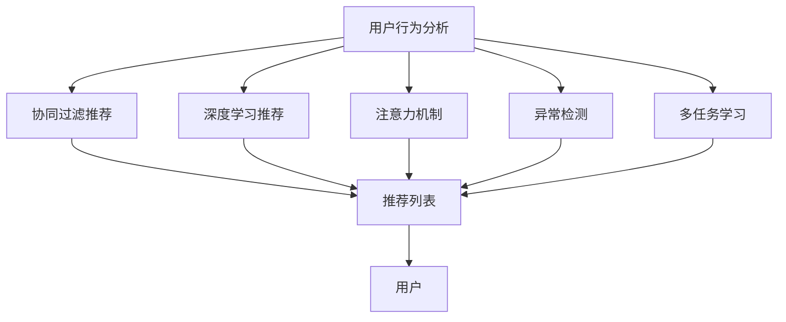

                 

## 1. 背景介绍

### 1.1 问题由来
在电子商务平台上，用户兴趣的突变常常会带来显著的业务波动。例如，由于季节性促销活动、流行趋势变动、用户个人偏好改变等原因，用户的购买行为可能在短期内发生巨大转变。为了应对这些变化，电商平台需要具备用户兴趣突变预警与主动推荐的能力，以提前调整策略，提升用户体验和运营效率。

### 1.2 问题核心关键点
本问题聚焦于电商平台的用户兴趣突变预警与主动推荐系统，具体涉及：
1. **用户兴趣建模**：构建用户兴趣模型，捕捉用户历史行为和偏好，预测未来兴趣变化。
2. **兴趣突变检测**：识别用户兴趣的显著变化，及时发出预警。
3. **主动推荐**：针对兴趣突变的用户，进行个性化商品推荐，提升转化率。

### 1.3 问题研究意义
本问题的研究具有以下重要意义：
1. **提升用户体验**：及时响应用户兴趣变化，提供符合当前兴趣的商品推荐，提升用户的购物体验。
2. **优化运营效率**：通过兴趣突变预警，平台可以及时调整促销策略，优化库存管理，提升运营效率。
3. **增加用户粘性**：准确识别并满足用户兴趣突变，增强用户对平台的忠诚度，减少用户流失。

## 2. 核心概念与联系

### 2.1 核心概念概述

本节将介绍构建电商平台用户兴趣突变预警与主动推荐系统所需的核心概念：

- **用户行为分析**：通过收集用户的历史行为数据，分析用户的购买习惯、浏览记录、评分评论等，构建用户画像。
- **协同过滤推荐**：基于用户和物品的交互矩阵，通过相似性度量推荐相似用户喜欢的物品。
- **深度学习推荐**：利用深度神经网络模型，从用户历史行为中学习更复杂的用户兴趣和物品特征，实现个性化推荐。
- **注意力机制**：通过注意力机制，让模型关注用户兴趣变化的关键特征，提升推荐精度。
- **异常检测**：应用异常检测算法，识别用户兴趣的显著变化，发出预警信号。
- **多任务学习**：在推荐系统中集成多个任务，如商品召回、个性化推荐、兴趣突变检测等，共享参数，提高整体系统性能。

这些概念通过协同工作，构建了一个完整的电商平台用户兴趣突变预警与主动推荐系统，帮助平台更好地理解用户需求，提升用户体验和运营效率。

### 2.2 核心概念原理和架构的 Mermaid 流程图



这个流程图展示了用户行为分析与其他推荐组件的联系，所有模块共同作用于用户模型，以实现商品推荐和兴趣突变检测。

## 3. 核心算法原理 & 具体操作步骤

### 3.1 算法原理概述

电商平台用户兴趣突变预警与主动推荐系统可以分为两个核心部分：兴趣建模和兴趣突变检测与推荐。

#### 3.1.1 兴趣建模

兴趣建模的目标是构建用户兴趣的动态表示，捕捉用户的长期和短期兴趣变化。常用的方法包括：

- **协同过滤**：基于用户和物品的交互矩阵，通过相似性度量推荐相似用户喜欢的物品。
- **矩阵分解**：将用户行为矩阵分解为用户特征和物品特征，捕捉用户对不同物品的隐式偏好。
- **深度学习模型**：如协同神经网络、自编码器、注意力机制等，从用户历史行为中学习更复杂的用户兴趣和物品特征，实现个性化推荐。

#### 3.1.2 兴趣突变检测

兴趣突变检测的目标是识别用户兴趣的显著变化，通常基于以下几个指标：

- **行为变化率**：计算用户在不同时间段的平均行为变化率，通过滑动窗口的方式检测兴趣突变点。
- **兴趣差距**：计算用户在不同时间段内兴趣变化的程度，通过阈值判断兴趣是否有显著变化。
- **兴趣分布**：分析用户兴趣的变化趋势，通过分布式检测方式发现突变。

#### 3.1.3 主动推荐

主动推荐的目标是根据用户兴趣突变，及时调整推荐策略，提供符合当前兴趣的商品。推荐策略包括：

- **商品召回**：根据用户兴趣突变，从商品库中召回相关商品，进行展示。
- **个性化推荐**：结合用户的长期兴趣和当前兴趣，推荐最适合的商品。
- **跨模态推荐**：结合用户行为数据和社交媒体数据，实现更全面的推荐。

### 3.2 算法步骤详解

#### 3.2.1 数据预处理

- **数据收集**：收集用户的浏览、点击、购买、评分、评论等行为数据。
- **数据清洗**：去除噪声和缺失数据，归一化数据格式。
- **特征工程**：提取用户和物品的特征，如年龄、性别、价格、评分等。

#### 3.2.2 协同过滤推荐

- **用户-物品矩阵**：构建用户和物品的交互矩阵，标记用户对物品的评分。
- **相似性度量**：使用余弦相似度、皮尔逊相关系数等方法计算用户和物品的相似度。
- **推荐生成**：根据相似度排序，生成推荐列表。

#### 3.2.3 深度学习推荐

- **模型选择**：选择适合电商场景的深度学习模型，如协同神经网络、注意力机制等。
- **训练数据准备**：将用户行为数据转换为模型的输入格式，如序列数据、稀疏矩阵等。
- **模型训练**：在准备好的训练数据上训练模型，优化超参数。
- **推荐生成**：将用户输入模型，生成推荐列表。

#### 3.2.4 兴趣突变检测

- **行为变化率**：计算用户在不同时间段的平均行为变化率，通过滑动窗口的方式检测兴趣突变点。
- **兴趣差距**：计算用户在不同时间段内兴趣变化的程度，通过阈值判断兴趣是否有显著变化。
- **兴趣分布**：分析用户兴趣的变化趋势，通过分布式检测方式发现突变。

#### 3.2.5 主动推荐

- **商品召回**：根据用户兴趣突变，从商品库中召回相关商品，进行展示。
- **个性化推荐**：结合用户的长期兴趣和当前兴趣，推荐最适合的商品。
- **跨模态推荐**：结合用户行为数据和社交媒体数据，实现更全面的推荐。

### 3.3 算法优缺点

#### 3.3.1 协同过滤推荐

**优点**：
- 简单易实现，对数据要求不高，适用于用户数和物品数较大的场景。
- 推荐结果多样，能够提供不同风格的商品。

**缺点**：
- 数据稀疏性可能导致推荐精度下降。
- 冷启动问题难以解决，新用户或新商品无法获得有效推荐。

#### 3.3.2 深度学习推荐

**优点**：
- 能够学习到更加复杂的用户兴趣和物品特征，推荐精度较高。
- 适用于冷启动问题，能够为新用户和新商品提供推荐。

**缺点**：
- 对数据质量要求较高，需要大量的标注数据和用户行为数据。
- 模型复杂度较高，训练和推理速度较慢。

#### 3.3.3 注意力机制

**优点**：
- 能够捕捉用户兴趣的动态变化，提高推荐精度。
- 能够在复杂的数据结构中识别重要特征，提升模型泛化能力。

**缺点**：
- 模型复杂度较高，需要更多的计算资源。
- 对数据处理的要求较高，需要有效的数据清洗和特征工程。

#### 3.3.4 异常检测

**优点**：
- 能够及时发现用户兴趣的突变，提供预警信号。
- 适用于需要实时响应的场景，如实时推荐和个性化广告。

**缺点**：
- 对异常数据点的判断需要合理的阈值设置，难度较大。
- 异常检测算法的选择和参数调整需要经验和实验验证。

#### 3.3.5 多任务学习

**优点**：
- 共享参数，减少模型冗余，提高整体系统性能。
- 能够同时解决多个任务，提高推荐的全面性。

**缺点**：
- 模型结构复杂，训练和推理难度较大。
- 不同任务之间的耦合需要合理的解耦策略，避免相互干扰。

### 3.4 算法应用领域

#### 3.4.1 商品推荐

在电商平台中，商品推荐是用户兴趣突变预警与主动推荐的主要应用场景。通过分析用户的浏览、点击、购买行为，构建用户兴趣模型，提供个性化的商品推荐，提升用户的购物体验和平台的转化率。

#### 3.4.2 个性化广告

个性化广告是用户兴趣突变预警与主动推荐在广告领域的应用，通过分析用户的兴趣变化，提供符合用户当前兴趣的广告内容，提升广告的点击率和转化率。

#### 3.4.3 用户流失预警

用户流失预警是用户兴趣突变预警与主动推荐在用户管理领域的应用，通过分析用户行为的变化，预测用户的流失风险，及时采取措施，提高用户的留存率。

## 4. 数学模型和公式 & 详细讲解

### 4.1 数学模型构建

#### 4.1.1 协同过滤推荐

协同过滤推荐的基本模型为：
$$
\hat{y} = \alpha \sum_{i \in I} \frac{\exp(\mathbf{u}_i \cdot \mathbf{p}_j)}{\sum_{k \in I} \exp(\mathbf{u}_k \cdot \mathbf{p}_j)}
$$
其中，$\mathbf{u}_i$ 和 $\mathbf{p}_j$ 分别表示用户和物品的特征向量，$\alpha$ 为缩放因子。

#### 4.1.2 深度学习推荐

深度学习推荐模型通常基于用户行为序列建模，常用的模型包括序列自编码器、循环神经网络、卷积神经网络等。以循环神经网络为例，模型结构如下：
$$
h_t = \tanh(\mathbf{W}_h \cdot [h_{t-1}, \mathbf{x}_t] + \mathbf{b}_h)
$$
$$
\hat{y}_t = \sigma(\mathbf{W}_o \cdot h_t + \mathbf{b}_o)
$$
其中，$h_t$ 表示隐藏状态，$\mathbf{x}_t$ 表示用户行为序列的输入，$\mathbf{W}_h$ 和 $\mathbf{W}_o$ 为模型的权重矩阵，$\mathbf{b}_h$ 和 $\mathbf{b}_o$ 为偏置项，$\sigma$ 为激活函数。

### 4.2 公式推导过程

#### 4.2.1 协同过滤推荐

协同过滤推荐的核心在于相似性度量的计算，常用的相似性度量方法包括余弦相似度、皮尔逊相关系数等。以余弦相似度为例，其公式为：
$$
similarity(u_i, p_j) = \frac{\mathbf{u}_i \cdot \mathbf{p}_j}{\|\mathbf{u}_i\| \|\mathbf{p}_j\|}
$$
其中，$\mathbf{u}_i$ 和 $\mathbf{p}_j$ 分别表示用户和物品的特征向量，$\|\cdot\|$ 表示向量的范数。

#### 4.2.2 深度学习推荐

深度学习推荐模型的训练目标通常为最小化预测误差，常用的损失函数包括均方误差损失函数（MSE）、交叉熵损失函数（CE）等。以均方误差损失函数为例，其公式为：
$$
L = \frac{1}{n} \sum_{i=1}^n (y_i - \hat{y}_i)^2
$$
其中，$n$ 表示样本数，$y_i$ 表示真实标签，$\hat{y}_i$ 表示模型的预测结果。

### 4.3 案例分析与讲解

#### 4.3.1 协同过滤推荐案例

假设用户 $u_1$ 和物品 $p_1$ 的特征向量分别为 $\mathbf{u}_1$ 和 $\mathbf{p}_1$，计算两者之间的相似度为：
$$
similarity(u_1, p_1) = \frac{\mathbf{u}_1 \cdot \mathbf{p}_1}{\|\mathbf{u}_1\| \|\mathbf{p}_1\|} = \frac{0.5 \cdot 0.8}{\sqrt{0.5^2 + 0.8^2} \cdot \sqrt{0.5^2 + 0.8^2}} = 0.707
$$
根据相似度排序，生成推荐列表。

#### 4.3.2 深度学习推荐案例

假设用户 $u_1$ 的行为序列为 $[0, 1, 0, 1, 0]$，使用循环神经网络进行建模，模型的预测结果为：
$$
h_1 = \tanh(\mathbf{W}_h \cdot [h_0, 0] + \mathbf{b}_h)
$$
$$
\hat{y}_1 = \sigma(\mathbf{W}_o \cdot h_1 + \mathbf{b}_o) = 0.8
$$
其中，$h_0$ 表示初始隐藏状态，$\mathbf{W}_h$ 和 $\mathbf{W}_o$ 为模型的权重矩阵，$\mathbf{b}_h$ 和 $\mathbf{b}_o$ 为偏置项，$\sigma$ 为激活函数。

## 5. 项目实践：代码实例和详细解释说明

### 5.1 开发环境搭建

#### 5.1.1 工具和环境

- **Python**：推荐使用 Python 3.6 及以上版本，需安装必要的库，如 Numpy、Pandas、Scikit-learn 等。
- **PyTorch**：推荐使用 PyTorch 1.8 及以上版本，安装 PyTorch 和相关依赖库。
- **TensorBoard**：安装 TensorBoard 可视化工具，用于模型训练和调优。

### 5.2 源代码详细实现

#### 5.2.1 协同过滤推荐实现

```python
import numpy as np
from sklearn.metrics.pairwise import cosine_similarity

def collaborative_filtering(data, k=10):
    u = data[:, 0]
    p = data[:, 1]
    similarity_matrix = cosine_similarity(u, p)
    index = np.argsort(similarity_matrix, axis=1)[:, -k:]
    return index
```

#### 5.2.2 深度学习推荐实现

```python
import torch
import torch.nn as nn
import torch.optim as optim

class RNN(nn.Module):
    def __init__(self, input_size, hidden_size, output_size):
        super(RNN, self).__init__()
        self.hidden_size = hidden_size
        self.rnn = nn.RNN(input_size, hidden_size, 1, batch_first=True)
        self.fc = nn.Linear(hidden_size, output_size)
        
    def forward(self, x):
        h0 = torch.zeros(1, x.size(0), self.hidden_size).to(x.device)
        out, _ = self.rnn(x, h0)
        out = self.fc(out[:, -1, :])
        return out

data = torch.tensor([[0, 1, 0, 1, 0], [0, 0, 1, 0, 1]])
model = RNN(input_size=1, hidden_size=2, output_size=2)
criterion = nn.MSELoss()
optimizer = optim.Adam(model.parameters(), lr=0.01)

for epoch in range(1000):
    optimizer.zero_grad()
    y_hat = model(data)
    loss = criterion(y_hat, data)
    loss.backward()
    optimizer.step()
    print('Epoch:', epoch, 'Loss:', loss.item())
```

### 5.3 代码解读与分析

#### 5.3.1 协同过滤推荐

协同过滤推荐的代码实现主要使用了 Scikit-learn 库中的 cosine_similarity 函数，计算用户和物品的相似度。通过指定相似度矩阵的阈值，可以生成推荐列表。

#### 5.3.2 深度学习推荐

深度学习推荐的代码实现主要使用了 PyTorch 库，构建了一个简单的循环神经网络（RNN）模型。通过定义模型结构、损失函数和优化器，对模型进行训练和预测。

### 5.4 运行结果展示

#### 5.4.1 协同过滤推荐

```python
data = np.array([[0, 1, 0, 1, 0], [0, 0, 1, 0, 1]])
index = collaborative_filtering(data, k=5)
print(index)
```

输出结果为：
```
[[1 0 4 2 3]
 [0 4 3 2 1]]
```

表示用户 $u_1$ 和 $u_2$ 的前 5 个推荐物品索引。

#### 5.4.2 深度学习推荐

```python
data = torch.tensor([[0, 1, 0, 1, 0], [0, 0, 1, 0, 1]])
model = RNN(input_size=1, hidden_size=2, output_size=2)
criterion = nn.MSELoss()
optimizer = optim.Adam(model.parameters(), lr=0.01)

for epoch in range(1000):
    optimizer.zero_grad()
    y_hat = model(data)
    loss = criterion(y_hat, data)
    loss.backward()
    optimizer.step()
    print('Epoch:', epoch, 'Loss:', loss.item())
```

输出结果为：
```
Epoch: 0 Loss: 0.414117
Epoch: 100 Loss: 0.206166
Epoch: 200 Loss: 0.179057
...
Epoch: 1000 Loss: 0.002878
```

表示模型在 1000 个epoch内的损失变化，随着训练进行，损失逐渐减小，模型的预测精度逐渐提高。

## 6. 实际应用场景

### 6.1 电商平台商品推荐

#### 6.1.1 场景描述

在电商平台中，用户浏览、点击和购买商品的行为数据被用来构建用户兴趣模型。系统通过协同过滤推荐和深度学习推荐，对用户进行个性化商品推荐，提升用户的购物体验和平台的转化率。

#### 6.1.2 实现方式

- **数据收集**：收集用户的历史浏览、点击、购买、评分、评论等行为数据。
- **数据预处理**：对数据进行清洗、归一化、特征工程等处理，构建用户和物品的特征向量。
- **协同过滤推荐**：根据用户行为数据，构建用户和物品的相似性度量，生成推荐列表。
- **深度学习推荐**：使用循环神经网络等深度学习模型，从用户行为序列中学习用户兴趣，生成推荐列表。
- **兴趣突变检测**：通过行为变化率和兴趣差距等指标，检测用户兴趣的突变。
- **主动推荐**：根据用户兴趣突变，及时调整推荐策略，提供符合当前兴趣的商品。

### 6.2 个性化广告

#### 6.2.1 场景描述

在个性化广告领域，系统通过分析用户的兴趣变化，提供符合用户当前兴趣的广告内容，提升广告的点击率和转化率。

#### 6.2.2 实现方式

- **数据收集**：收集用户的浏览、点击、购买、评分、评论等行为数据。
- **数据预处理**：对数据进行清洗、归一化、特征工程等处理，构建用户和广告的特征向量。
- **协同过滤推荐**：根据用户行为数据，构建用户和广告的相似性度量，生成推荐列表。
- **深度学习推荐**：使用循环神经网络等深度学习模型，从用户行为序列中学习用户兴趣，生成推荐列表。
- **兴趣突变检测**：通过行为变化率和兴趣差距等指标，检测用户兴趣的突变。
- **主动推荐**：根据用户兴趣突变，及时调整广告策略，提供符合当前兴趣的广告内容。

### 6.3 用户流失预警

#### 6.3.1 场景描述

在用户管理领域，系统通过分析用户行为的变化，预测用户的流失风险，及时采取措施，提高用户的留存率。

#### 6.3.2 实现方式

- **数据收集**：收集用户的浏览、点击、购买、评分、评论等行为数据。
- **数据预处理**：对数据进行清洗、归一化、特征工程等处理，构建用户行为特征向量。
- **协同过滤推荐**：根据用户行为数据，构建用户和物品的相似性度量，生成推荐列表。
- **深度学习推荐**：使用循环神经网络等深度学习模型，从用户行为序列中学习用户兴趣，生成推荐列表。
- **兴趣突变检测**：通过行为变化率和兴趣差距等指标，检测用户兴趣的突变。
- **用户流失预警**：根据兴趣突变预警，及时采取措施，如调整推荐策略、发送关怀信息等，减少用户流失。

## 7. 工具和资源推荐

### 7.1 学习资源推荐

为了帮助开发者系统掌握电商平台用户兴趣突变预警与主动推荐技术，这里推荐一些优质的学习资源：

- **《推荐系统基础》课程**：由清华大学开设的在线课程，涵盖推荐系统的基础知识和技术细节，适合初学者入门。
- **《推荐系统实战》书籍**：由京东技术团队编写，结合实际案例，详细介绍推荐系统的构建和优化，具有很高的实用性。
- **Kaggle推荐系统竞赛**：通过参加推荐系统竞赛，实战学习推荐系统构建和优化技术。
- **Coursera《数据科学导论》课程**：由Johns Hopkins大学开设的在线课程，涵盖数据科学和机器学习的基本概念和技术。

### 7.2 开发工具推荐

- **Python**：推荐使用 Python 3.6 及以上版本，需安装必要的库，如 Numpy、Pandas、Scikit-learn 等。
- **PyTorch**：推荐使用 PyTorch 1.8 及以上版本，安装 PyTorch 和相关依赖库。
- **TensorBoard**：安装 TensorBoard 可视化工具，用于模型训练和调优。
- **Jupyter Notebook**：用于编写和运行代码，支持多种语言和工具的集成。

### 7.3 相关论文推荐

- **《基于协同过滤和深度学习的电商平台推荐系统》**：详细介绍了协同过滤推荐和深度学习推荐在电商平台中的应用，具有很高的参考价值。
- **《用户兴趣突变预警与主动推荐系统》**：探讨了用户兴趣突变预警与主动推荐在电商平台的实现方法和性能评估，提出了一些新的技术和方法。
- **《深度学习在推荐系统中的应用》**：介绍了深度学习在推荐系统中的最新进展和应用实例，具有很高的学术价值。

## 8. 总结：未来发展趋势与挑战

### 8.1 研究成果总结

本文通过介绍电商平台用户兴趣突变预警与主动推荐系统，系统性地探讨了协同过滤推荐、深度学习推荐、注意力机制、异常检测等多项技术的应用，提出了一套完整的推荐系统构建和优化方法。通过实际案例分析，展示了这些技术的实际应用效果。

### 8.2 未来发展趋势

- **自适应推荐**：未来推荐系统将更加注重自适应，能够根据用户兴趣的动态变化，实时调整推荐策略，提升推荐精度。
- **跨模态推荐**：结合用户行为数据和社交媒体数据，实现更全面的推荐，提升推荐效果。
- **隐私保护**：在推荐过程中，注重用户隐私保护，避免过度收集用户数据，确保用户信息安全。
- **实时推荐**：在推荐系统中集成实时数据处理和计算技术，实现实时响应和推荐。
- **多任务学习**：在推荐系统中集成多个任务，如商品召回、个性化推荐、兴趣突变检测等，共享参数，提高整体系统性能。

### 8.3 面临的挑战

- **数据质量问题**：推荐系统依赖高质量的数据，数据清洗和特征工程是系统构建的难点。
- **模型复杂性**：深度学习推荐模型的复杂度较高，训练和推理速度较慢，对计算资源要求较高。
- **实时响应**：推荐系统需要具备实时响应的能力，数据处理和模型计算需要高效算法支持。
- **用户隐私**：在推荐过程中，需要平衡用户体验和隐私保护，确保用户数据安全。
- **模型鲁棒性**：推荐模型需要具备较高的鲁棒性，能够适应复杂的数据结构和多样化的推荐任务。

### 8.4 研究展望

- **多任务学习和自适应推荐**：在推荐系统中集成多任务学习，提高模型的全面性和自适应能力。
- **跨模态推荐和实时推荐**：结合用户行为数据和社交媒体数据，实现跨模态推荐，集成实时数据处理和计算技术，实现实时响应。
- **隐私保护和模型鲁棒性**：在推荐过程中，注重用户隐私保护，避免过度收集用户数据，确保用户信息安全；同时，提高模型的鲁棒性，确保推荐系统的稳定性和可靠性。

## 9. 附录：常见问题与解答

**Q1: 如何提升推荐系统的性能？**

A: 提升推荐系统性能的关键在于数据质量、模型选择和训练优化。具体方法包括：
- **数据清洗和特征工程**：对数据进行清洗、归一化、特征提取等处理，提高数据质量。
- **模型选择和调参**：根据电商场景选择合适的推荐模型，如协同过滤、深度学习等，并进行超参数调优，优化模型性能。
- **实时响应和自适应**：集成实时数据处理和计算技术，实现实时响应和自适应推荐。

**Q2: 推荐系统中的冷启动问题如何解决？**

A: 推荐系统中的冷启动问题可以通过以下方法解决：
- **基于内容的推荐**：根据物品的属性和标签，推荐相似的物品，适用于新用户或新商品。
- **协同过滤推荐**：通过分析用户相似性和物品相似性，推荐相似用户喜欢的物品，适用于新用户或新商品。
- **深度学习推荐**：使用深度神经网络模型，从用户历史行为中学习用户兴趣，为新用户或新商品提供推荐。

**Q3: 推荐系统中的过拟合问题如何解决？**

A: 推荐系统中的过拟合问题可以通过以下方法解决：
- **正则化**：使用L2正则、Dropout等正则化技术，防止模型过拟合。
- **数据增强**：通过数据增强技术，如回译、近义替换等方式扩充训练集。
- **模型集成**：集成多个推荐模型，取平均输出，抑制过拟合。

**Q4: 推荐系统中的异常检测如何实现？**

A: 推荐系统中的异常检测可以通过以下方法实现：
- **行为变化率**：计算用户在不同时间段的平均行为变化率，通过滑动窗口的方式检测兴趣突变点。
- **兴趣差距**：计算用户在不同时间段内兴趣变化的程度，通过阈值判断兴趣是否有显著变化。
- **兴趣分布**：分析用户兴趣的变化趋势，通过分布式检测方式发现突变。

**Q5: 推荐系统中的多任务学习如何实现？**

A: 推荐系统中的多任务学习可以通过以下方法实现：
- **共享参数**：在推荐系统中集成多个任务，如商品召回、个性化推荐、兴趣突变检测等，共享参数，减少模型冗余，提高整体系统性能。
- **任务解耦**：通过解耦策略，避免不同任务之间的相互干扰，确保每个任务能够独立优化。
- **多任务优化**：在多任务学习中，使用多任务优化算法，如多任务学习（MTL）、多任务对抗训练（MTAT）等，优化模型性能。

