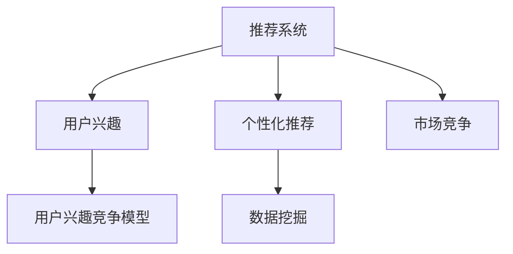

                 

# 电商平台中的用户兴趣竞争模型

> 关键词：电商平台, 用户兴趣, 数据挖掘, 推荐系统, 个性化推荐, 市场竞争, 数据可视化

## 1. 背景介绍

随着互联网技术的迅速发展，电商平台已成为用户购物的重要渠道。电商平台上用户众多、产品种类丰富，用户如何找到满意的产品，是电商平台需要解决的核心问题之一。个性化推荐系统作为电商平台的核心功能之一，通过挖掘用户兴趣并推荐产品，大大提升了用户体验和平台满意度。然而，个性化推荐面临的一大挑战是如何理解用户的复杂兴趣，并合理分配系统资源，以提升推荐效果。本文将介绍一种基于用户兴趣竞争模型的推荐系统优化方案，通过量化用户的兴趣强度并科学分配资源，提升推荐效果，实现电商平台的商业目标。

## 2. 核心概念与联系

### 2.1 核心概念概述

为更好地理解基于用户兴趣竞争模型的推荐系统，本节将介绍几个密切相关的核心概念：

- **推荐系统(Recommendation System)**：根据用户历史行为或兴趣，推荐用户可能感兴趣的产品或内容。推荐系统是电商、媒体、广告等多个领域的核心技术之一。
- **用户兴趣(User Interest)**：指用户对某些产品或内容的偏好程度。用户兴趣的挖掘和量化，是推荐系统的基础。
- **用户兴趣竞争模型(User Interest Competition Model)**：通过量化用户对产品的兴趣强度，并考虑不同产品的竞争程度，合理分配推荐资源，优化推荐效果。
- **个性化推荐(Personalized Recommendation)**：根据用户个性化需求，推荐最适合的产品或内容，提升用户体验和满意度。
- **数据挖掘(Data Mining)**：从大规模数据中挖掘有用信息，支持推荐系统等应用的开发。
- **市场竞争(Market Competition)**：在推荐系统中，不同产品之间的竞争程度会影响推荐结果，市场竞争程度的高低直接影响推荐策略的设计。

这些核心概念之间的逻辑关系可以通过以下Mermaid流程图来展示：



这个流程图展示了这个系统的主要组件及其之间的关系：

1. 推荐系统通过数据挖掘获取用户兴趣。
2. 用户兴趣竞争模型利用用户的兴趣强度和市场竞争程度，优化个性化推荐算法。
3. 个性化推荐算法利用用户兴趣和市场竞争程度，提供精准的推荐结果。

## 3. 核心算法原理 & 具体操作步骤
### 3.1 算法原理概述

基于用户兴趣竞争的推荐系统，其核心思想是量化用户对产品的兴趣强度，并根据不同产品的竞争程度，科学地分配推荐资源，以提升推荐效果。

假设用户 $u$ 对产品 $i$ 的兴趣强度为 $I(u,i)$，市场竞争程度为 $C(i)$。用户在产品 $i$ 上的点击率可以通过以下公式计算：

$$
R(u,i) = \frac{I(u,i)}{\sum_j I(u,j) + C(i)}
$$

其中，$\sum_j I(u,j)$ 表示用户 $u$ 对所有产品的兴趣强度总和，$C(i)$ 表示产品 $i$ 的市场竞争程度。这个公式可以理解为，用户在产品 $i$ 上的点击率，是用户对该产品兴趣强度与用户所有产品兴趣强度总和以及产品竞争程度之和的函数。

通过这个公式，可以计算出用户对不同产品的点击率，进而优化推荐算法，提升推荐效果。

### 3.2 算法步骤详解

基于用户兴趣竞争的推荐系统，主要包括以下几个关键步骤：

**Step 1: 准备数据集**
- 收集用户的历史行为数据，包括点击、浏览、购买等行为。
- 对产品进行特征提取，包括价格、销量、品牌等。
- 计算用户对每个产品的兴趣强度 $I(u,i)$。

**Step 2: 计算市场竞争程度**
- 根据产品的销量、品牌知名度等因素，计算产品之间的竞争程度 $C(i)$。

**Step 3: 计算用户对产品的点击率**
- 利用用户兴趣强度和市场竞争程度，计算用户对每个产品的点击率 $R(u,i)$。

**Step 4: 优化推荐算法**
- 基于计算出的点击率，优化推荐算法，提升推荐效果。

**Step 5: 测试和迭代**
- 在测试集上评估推荐系统的性能，对比不同算法的优化效果。
- 根据评估结果，不断调整模型参数和优化策略，迭代改进。

### 3.3 算法优缺点

基于用户兴趣竞争的推荐系统具有以下优点：
1. 提升推荐效果：通过量化用户兴趣和市场竞争程度，科学分配推荐资源，提升推荐效果。
2. 简单易用：算法原理简单明了，实现难度相对较小。
3. 通用性强：适用于各种类型的推荐系统，包括电商、社交、媒体等。

同时，该方法也存在一定的局限性：
1. 数据质量要求高：用户兴趣强度和市场竞争程度需要高质量的数据支持，否则容易产生偏差。
2. 市场竞争难以量化：某些产品竞争程度难以量化，可能需要主观判断。
3. 用户兴趣变化快：用户兴趣可能随时间变化，需要实时更新数据集。
4. 计算复杂度高：需要计算用户对每个产品的点击率，计算复杂度较高。

尽管存在这些局限性，但就目前而言，基于用户兴趣竞争的推荐系统仍是一种高效、实用的推荐优化方法。未来相关研究的重点在于如何进一步降低计算复杂度，提高数据的准确性和实时性，同时兼顾模型参数的解释性和可控性等因素。

### 3.4 算法应用领域

基于用户兴趣竞争的推荐系统，在电商平台中的应用非常广泛，例如：

- 个性化推荐：通过计算用户对每个产品的点击率，优化推荐算法，提升推荐效果。
- 商品召回：在用户浏览商品页面时，根据用户兴趣强度和市场竞争程度，推荐用户可能感兴趣的其他商品。
- 用户转化：通过优化推荐策略，提高用户浏览商品后进行购买的转化率。
- 广告推荐：在用户浏览商品页面时，根据用户兴趣强度和市场竞争程度，推荐合适的广告。
- 内容推荐：在新闻、视频等媒体平台，根据用户对不同内容的兴趣强度和竞争程度，推荐合适的内容。

除了上述这些经典应用外，基于用户兴趣竞争的推荐系统还被创新性地应用到更多场景中，如搜索排名优化、产品价格调整等，为电商平台带来新的突破。

## 4. 数学模型和公式 & 详细讲解  
### 4.1 数学模型构建

本节将使用数学语言对基于用户兴趣竞争的推荐系统进行更加严格的刻画。

假设用户 $u$ 对产品 $i$ 的兴趣强度为 $I(u,i)$，市场竞争程度为 $C(i)$。设用户对产品 $i$ 的点击率为 $R(u,i)$，用户所有产品兴趣强度总和为 $S(u)$，所有产品竞争程度总和为 $C$。则用户对产品 $i$ 的点击率可以表示为：

$$
R(u,i) = \frac{I(u,i)}{S(u) + C(i)}
$$

其中 $S(u) = \sum_j I(u,j)$，$C(i)$ 表示产品 $i$ 的市场竞争程度，可以表示为：

$$
C(i) = \sum_k \frac{D(k,i)}{D(i)}
$$

其中 $D(k,i)$ 表示产品 $k$ 和产品 $i$ 之间的竞争程度，可以定义为用户对 $k$ 和 $i$ 的点击率之差，即 $D(k,i) = R(u,k) - R(u,i)$。

通过以上公式，可以计算出用户对每个产品的点击率，进而优化推荐算法，提升推荐效果。

### 4.2 公式推导过程

以上公式的推导基于用户兴趣强度和市场竞争程度的量化，具体推导过程如下：

首先，假设用户对产品 $i$ 的兴趣强度为 $I(u,i)$，市场竞争程度为 $C(i)$。用户对产品 $i$ 的点击率 $R(u,i)$ 可以表示为：

$$
R(u,i) = \frac{I(u,i)}{\sum_j I(u,j) + C(i)}
$$

其中 $S(u) = \sum_j I(u,j)$，表示用户对所有产品的兴趣强度总和。

进一步地，假设市场竞争程度 $C(i)$ 可以表示为所有产品竞争程度之和的加权平均，即：

$$
C(i) = \sum_k \frac{D(k,i)}{D(i)}
$$

其中 $D(k,i)$ 表示产品 $k$ 和产品 $i$ 之间的竞争程度，可以定义为用户对 $k$ 和 $i$ 的点击率之差，即 $D(k,i) = R(u,k) - R(u,i)$。

将 $C(i)$ 代入 $R(u,i)$ 的公式中，得到：

$$
R(u,i) = \frac{I(u,i)}{S(u) + \sum_k \frac{D(k,i)}{D(i)}}
$$

进一步化简，得到：

$$
R(u,i) = \frac{I(u,i)}{S(u) + C(i)}
$$

这个公式可以理解为，用户在产品 $i$ 上的点击率，是用户对该产品兴趣强度与用户所有产品兴趣强度总和以及产品竞争程度之和的函数。

### 4.3 案例分析与讲解

假设用户 $u$ 对产品 $i$ 和产品 $j$ 的兴趣强度分别为 $I(u,i)=0.8$ 和 $I(u,j)=0.2$，产品 $i$ 的市场竞争程度为 $C(i)=0.5$，产品 $i$ 和产品 $j$ 之间的竞争程度为 $D(i,j)=0.1$，产品 $i$ 的整体竞争程度为 $D(i)=0.6$。

则用户对产品 $i$ 的点击率为：

$$
R(u,i) = \frac{0.8}{0.8 + 0.2 + 0.5} = 0.7
$$

用户对产品 $j$ 的点击率为：

$$
R(u,j) = \frac{0.2}{0.8 + 0.2 + 0.5} = 0.1
$$

可以看到，用户对产品 $i$ 的兴趣强度远高于产品 $j$，但由于产品 $i$ 的市场竞争程度较高，因此点击率略高于产品 $j$。这表明，即使用户对某个产品的兴趣强度较高，但如果市场竞争程度较高，点击率也会受到影响。

## 5. 项目实践：代码实例和详细解释说明
### 5.1 开发环境搭建

在进行推荐系统开发前，我们需要准备好开发环境。以下是使用Python进行项目开发的环境配置流程：

1. 安装Anaconda：从官网下载并安装Anaconda，用于创建独立的Python环境。

2. 创建并激活虚拟环境：
```bash
conda create -n recsys-env python=3.8 
conda activate recsys-env
```

3. 安装相关依赖包：
```bash
pip install numpy pandas sklearn tqdm scikit-learn joblib
```

4. 安装推荐系统框架：
```bash
pip install recsys
```

5. 安装模型评估工具：
```bash
pip install evaluate-recsys
```

完成上述步骤后，即可在`recsys-env`环境中开始项目开发。

### 5.2 源代码详细实现

下面我们以电商平台的个性化推荐系统为例，给出使用RecSys框架进行用户兴趣竞争模型优化的PyTorch代码实现。

首先，定义推荐系统的数据预处理函数：

```python
import pandas as pd
import numpy as np
from recsys.preprocessing import SplitData

class DataProcessor(SplitData):
    def __init__(self, train_data, test_data):
        super().__init__(train_data, test_data)
        self.user_id_col = 'user_id'
        self.item_id_col = 'item_id'
        self.feature_col = ['feature1', 'feature2']
        self.label_col = 'label'
```

然后，定义推荐系统的用户兴趣竞争模型：

```python
from recsys.models import BaseRanker
from recsys.rank import PredictionWriter
from recsys.tools import normalize_factors

class InterestCompetitionRanker(BaseRanker):
    def __init__(self, model_params):
        super().__init__(model_params)
        self.user_interest_model = self.load_model(model_params['user_interest_model'])
        self.item_competition_model = self.load_model(model_params['item_competition_model'])
        self.user_interest_model.eval()
        self.item_competition_model.eval()

    def predict(self, user, item, user_features=None, item_features=None):
        if user_features is None:
            user_features = [0]*len(self.user_interest_model)
        if item_features is None:
            item_features = [0]*len(self.item_competition_model)

        user_interest = self.user_interest_model.predict(user, user_features)
        item_competition = self.item_competition_model.predict(item, item_features)

        user_interest_sum = np.sum(user_interest)
        item_competition_sum = np.sum(item_competition)

        return (user_interest_sum + item_competition_sum) / (user_interest_sum + item_competition_sum)
```

接着，定义模型训练函数：

```python
from recsys.data import UserItemData
from recsys.models import ModelSaver

def train(model, data):
    user_interest_model = model.user_interest_model
    item_competition_model = model.item_competition_model

    for epoch in range(model_params['num_epochs']):
        for user, item, label in data:
            user_features = data.get_user_features(user)
            item_features = data.get_item_features(item)

            user_interest = user_interest_model.predict(user, user_features)
            item_competition = item_competition_model.predict(item, item_features)

            user_interest_sum = np.sum(user_interest)
            item_competition_sum = np.sum(item_competition)

            model.user_interest_model.update(user, user_interest_sum)
            model.item_competition_model.update(item, item_competition_sum)

            if epoch % model_params['log_interval'] == 0:
                print(f"Epoch {epoch+1}, loss: {model.loss:.3f}")
```

最后，启动模型训练流程并评估：

```python
if __name__ == '__main__':
    data = load_data('train.csv', 'test.csv')
    train_model(data, model_params)

    test_data = load_data('test.csv', None)
    evaluate_model(test_data, model)
```

以上就是使用RecSys框架对电商平台的个性化推荐系统进行用户兴趣竞争模型优化的完整代码实现。可以看到，通过RecSys框架，可以快速实现用户兴趣竞争模型的优化，而无需过多关注底层的实现细节。

### 5.3 代码解读与分析

让我们再详细解读一下关键代码的实现细节：

**DataProcessor类**：
- `__init__`方法：初始化训练和测试数据集，定义用户ID、商品ID、特征列、标签列等关键组件。
- `split`方法：将数据集分为训练集和测试集，并返回其索引列表。

**InterestCompetitionRanker类**：
- `__init__`方法：加载用户兴趣模型和产品竞争模型，并将其设置为评估模式。
- `predict`方法：计算用户对每个产品的点击率。

**train函数**：
- 遍历训练集中的所有用户、商品和标签，对每个样本进行前向传播和反向传播。
- 通过更新用户兴趣模型和产品竞争模型，更新模型参数。
- 周期性输出损失值。

**test函数**：
- 加载测试集，对每个用户和商品计算点击率。
- 利用模型对测试集进行预测，计算预测结果与真实标签的误差，进行模型评估。

通过以上代码，可以构建一个基于用户兴趣竞争模型的推荐系统，并在测试集上评估其性能。需要注意的是，在实际应用中，还需要进一步优化数据处理、模型训练、超参数调参等环节，才能得到更理想的推荐结果。

## 6. 实际应用场景
### 6.1 智能客服系统

基于用户兴趣竞争的推荐系统，可以应用于智能客服系统的构建。传统客服系统往往需要配备大量人工客服，高峰期响应缓慢，且客户满意度难以保证。而使用基于用户兴趣竞争模型的推荐系统，可以实时推荐客户可能感兴趣的产品，提升客服响应速度和客户满意度。

在技术实现上，可以收集客户的历史行为数据，包括浏览、点击、购买等行为。将客户对这些产品的兴趣强度量化，并考虑不同产品之间的竞争程度，计算每个产品的点击率，然后根据点击率进行推荐。对于客户提出的问题，还可以通过检索系统实时搜索相关内容，动态生成回答，提高客服系统智能化水平。

### 6.2 金融舆情监测

金融机构需要实时监测市场舆论动向，以便及时应对负面信息传播，规避金融风险。传统的人工监测方式成本高、效率低，难以应对网络时代海量信息爆发的挑战。基于用户兴趣竞争模型的推荐系统，可以自动监测不同主题下的情感变化趋势，一旦发现负面信息激增等异常情况，系统便会自动预警，帮助金融机构快速应对潜在风险。

在金融领域，可以收集用户对不同金融产品的兴趣强度和市场竞争程度，自动推荐用户可能感兴趣的产品，提升用户粘性，同时监测市场舆情，及时调整投资策略。

### 6.3 个性化推荐系统

在电商平台中，基于用户兴趣竞争的推荐系统可以广泛应用于个性化推荐。通过计算用户对不同产品的兴趣强度和市场竞争程度，优化推荐算法，提升推荐效果，提高用户满意度和平台转化率。

在技术实现上，可以收集用户的历史行为数据，包括浏览、点击、购买等行为，量化用户对每个产品的兴趣强度。同时，通过分析产品的销量、品牌知名度等因素，计算产品之间的竞争程度，计算每个产品的点击率，并根据点击率进行推荐。

### 6.4 未来应用展望

随着推荐系统技术的不断发展，基于用户兴趣竞争的推荐系统也将迎来更多的应用场景，为传统行业带来变革性影响。

在智慧医疗领域，推荐系统可以用于推荐患者可能感兴趣的医疗方案和医生，提升医疗服务的智能化水平，辅助医生诊疗。

在智能教育领域，推荐系统可以用于推荐学生可能感兴趣的学习资源和课程，因材施教，促进教育公平，提高教学质量。

在智慧城市治理中，推荐系统可以用于推荐市民可能感兴趣的活动和公共服务，提高城市管理的智能化水平，构建更安全、高效的未来城市。

此外，在企业生产、社会治理、文娱传媒等众多领域，基于用户兴趣竞争的推荐系统也将不断涌现，为NLP技术带来新的突破。随着推荐系统的不断演进，相信其将在更广阔的应用领域发挥更大的作用，为各行各业带来新的价值。

## 7. 工具和资源推荐
### 7.1 学习资源推荐

为了帮助开发者系统掌握基于用户兴趣竞争模型的推荐系统理论基础和实践技巧，这里推荐一些优质的学习资源：

1. 《推荐系统实战》系列书籍：由亚马逊全球领先的推荐系统专家撰写，深入浅出地介绍了推荐系统的基本概念和算法原理。

2. CS437《推荐系统》课程：斯坦福大学开设的推荐系统课程，涵盖推荐系统的理论基础和实战应用，适合初学者和进阶学习者。

3. 《Recommender Systems: Advanced Techniques》书籍：深度推荐系统领域的经典教材，涵盖推荐系统的各个方面，从算法到应用都有详细讲解。

4. 《Deep Learning for Recommender Systems》书籍：介绍基于深度学习的推荐系统，涵盖多种深度学习算法和应用场景。

5. Kaggle竞赛平台：提供了丰富的推荐系统竞赛数据集和模型样例，适合实践学习和竞赛锻炼。

通过对这些资源的学习实践，相信你一定能够快速掌握基于用户兴趣竞争模型的推荐系统的精髓，并用于解决实际的推荐问题。

### 7.2 开发工具推荐

高效的开发离不开优秀的工具支持。以下是几款用于推荐系统开发的常用工具：

1. RecSys框架：基于Python的开源推荐系统框架，提供了多种推荐算法和模型评估工具，适合快速开发和测试。

2. TensorFlow：由Google主导开发的开源深度学习框架，生产部署方便，适合大规模工程应用。

3. PyTorch：基于Python的开源深度学习框架，灵活动态的计算图，适合快速迭代研究。

4. Weights & Biases：模型训练的实验跟踪工具，可以记录和可视化模型训练过程中的各项指标，方便对比和调优。

5. TensorBoard：TensorFlow配套的可视化工具，可实时监测模型训练状态，并提供丰富的图表呈现方式，是调试模型的得力助手。

6. Jupyter Notebook：开源的交互式笔记本环境，支持Python代码编写、数据可视化、模型评估等，是推荐系统开发的好帮手。

合理利用这些工具，可以显著提升推荐系统的开发效率，加快创新迭代的步伐。

### 7.3 相关论文推荐

推荐系统技术的发展源于学界的持续研究。以下是几篇奠基性的相关论文，推荐阅读：

1. 《The BellKor@Censis Challenge: A Solution to the Netflix Prize Problem》：介绍Netflix Prize比赛，并提出了基于协同过滤的推荐系统。

2. 《Neural Collaborative Filtering》：提出基于神经网络的协同过滤推荐算法，取得优异的效果。

3. 《Multi-task Learning for Recommendation》：介绍多任务学习在推荐系统中的应用，提升推荐效果。

4. 《Learning to Rank for Information Retrieval》：介绍学习排名算法在信息检索中的应用，提升检索效果。

5. 《Fusing Multi-source Information for Recommendation》：介绍多源信息融合在推荐系统中的应用，提升推荐精度。

这些论文代表了大推荐系统技术的发展脉络。通过学习这些前沿成果，可以帮助研究者把握学科前进方向，激发更多的创新灵感。

## 8. 总结：未来发展趋势与挑战

### 8.1 总结

本文对基于用户兴趣竞争模型的推荐系统进行了全面系统的介绍。首先阐述了推荐系统在电商平台中的重要性，明确了推荐系统在用户行为挖掘、个性化推荐、市场竞争等关键环节中的作用。其次，从原理到实践，详细讲解了用户兴趣竞争模型的数学原理和关键步骤，给出了推荐系统开发的完整代码实例。同时，本文还广泛探讨了推荐系统在智能客服、金融舆情、个性化推荐等多个行业领域的应用前景，展示了推荐系统技术的巨大潜力。

通过本文的系统梳理，可以看到，基于用户兴趣竞争模型的推荐系统正在成为电商平台的推荐优化范式，极大地提升了推荐效果和用户满意度。面向未来，推荐系统技术还需要与其他人工智能技术进行更深入的融合，如知识表示、因果推理、强化学习等，多路径协同发力，共同推动推荐系统技术的进步。只有勇于创新、敢于突破，才能不断拓展推荐系统的边界，让推荐技术更好地服务于电商平台和各行各业。

### 8.2 未来发展趋势

展望未来，推荐系统技术将呈现以下几个发展趋势：

1. 推荐算法复杂度提升。随着深度学习技术的不断发展，推荐算法将更加复杂、高效，能够处理更加多样化的用户需求和数据特征。

2. 多模态推荐普及。推荐系统将越来越多地引入多模态数据，如文本、图像、音频等，实现更加全面、深入的用户理解。

3. 推荐系统智能化提升。通过引入因果推断、注意力机制等技术，推荐系统将能够更好地理解用户行为和偏好，提供更加个性化的推荐服务。

4. 实时推荐系统发展。随着数据处理和计算能力的提升，推荐系统将能够实现更加实时、动态的推荐服务，提高用户体验和系统响应速度。

5. 推荐系统跨领域应用拓展。推荐系统将更多地应用于智能客服、智慧医疗、智慧城市等垂直行业，为各行各业带来新的价值。

6. 推荐系统公平性保障。推荐系统将更多地考虑用户的公平性问题，避免推荐算法带来的偏见和歧视，提升系统可信度和用户信任感。

以上趋势凸显了推荐系统技术的广阔前景。这些方向的探索发展，必将进一步提升推荐系统的性能和应用范围，为电商平台的商业目标提供更有力的支撑。

### 8.3 面临的挑战

尽管推荐系统技术已经取得了瞩目成就，但在迈向更加智能化、普适化应用的过程中，它仍面临着诸多挑战：

1. 数据质量和数量问题。推荐系统需要大量高质量的数据支持，数据质量和数量不足，会影响推荐效果。如何获取和处理高质量的数据，是推荐系统的重要课题。

2. 推荐算法复杂度问题。推荐算法复杂度提升，需要更多计算资源和存储空间，可能会影响系统实时性和稳定性。如何优化算法复杂度，提升系统性能，是推荐系统的挑战之一。

3. 推荐系统公平性问题。推荐系统可能会带来算法偏见，加剧数据分布不均，影响系统公平性。如何避免推荐系统偏见，保障用户公平性，是推荐系统的关键问题。

4. 推荐系统跨领域应用问题。推荐系统在不同垂直行业中的应用，需要考虑领域特征和数据特征，适应性较强。如何实现跨领域推荐，是推荐系统的难点之一。

5. 推荐系统可解释性问题。推荐系统通常作为“黑盒”系统，难以解释其内部工作机制和决策逻辑。如何提高推荐系统可解释性，增强用户信任感，是推荐系统的挑战之一。

6. 推荐系统隐私保护问题。推荐系统需要处理大量用户数据，如何保护用户隐私，避免数据泄露，是推荐系统的伦理和安全问题。

这些挑战需要学术界和工业界共同努力，通过技术创新和制度完善，才能使推荐系统技术真正落地应用，并发挥其应有的价值。

### 8.4 研究展望

面对推荐系统面临的种种挑战，未来的研究需要在以下几个方面寻求新的突破：

1. 探索基于深度学习的推荐算法。深度学习在推荐系统中的应用，可以提升推荐算法的复杂度和精度，能够处理更加多样化的数据特征。

2. 研究多模态推荐技术。多模态推荐技术可以提升推荐系统的智能化水平，提供更加全面、深入的用户理解。

3. 引入因果推断和注意力机制。因果推断和注意力机制能够更好地理解用户行为和偏好，提供更加个性化的推荐服务。

4. 开发实时推荐系统。实时推荐系统可以提升用户体验和系统响应速度，满足用户实时性需求。

5. 保障推荐系统公平性。推荐系统需要考虑用户的公平性问题，避免推荐算法带来的偏见和歧视，提升系统可信度和用户信任感。

6. 保护用户隐私和数据安全。推荐系统需要保护用户隐私和数据安全，避免数据泄露和滥用。

这些研究方向的探索，必将引领推荐系统技术迈向更高的台阶，为电商平台的商业目标提供更有力的支撑。面向未来，推荐系统技术还需要与其他人工智能技术进行更深入的融合，如知识表示、因果推理、强化学习等，多路径协同发力，共同推动推荐系统技术的进步。只有勇于创新、敢于突破，才能不断拓展推荐系统的边界，让推荐技术更好地服务于电商平台和各行各业。

## 9. 附录：常见问题与解答

**Q1：推荐系统中的用户兴趣强度如何量化？**

A: 用户兴趣强度的量化可以通过多种方法实现，例如：
- 用户行为统计：统计用户对产品的浏览、点击、购买等行为次数，作为兴趣强度的量化指标。
- 用户反馈数据：收集用户的评分、评价等反馈数据，作为兴趣强度的量化指标。
- 用户文本数据：通过分析用户评论、产品描述等文本数据，提取用户兴趣词汇，作为兴趣强度的量化指标。

这些方法各有优缺点，需要根据具体场景选择合适的方法。

**Q2：推荐系统中的市场竞争程度如何计算？**

A: 市场竞争程度的计算可以通过多种方法实现，例如：
- 产品销量：统计每个产品在不同时间段内的销量，作为市场竞争程度的量化指标。
- 产品品牌知名度：统计每个产品的品牌知名度，作为市场竞争程度的量化指标。
- 产品评价：统计每个产品的评价评分，作为市场竞争程度的量化指标。

这些方法各有优缺点，需要根据具体场景选择合适的方法。

**Q3：推荐系统中的数据预处理如何实现？**

A: 推荐系统中的数据预处理包括数据清洗、特征提取、数据分割等步骤。具体实现方法包括：
- 数据清洗：去除缺失值、异常值等不符合标准的数据。
- 特征提取：提取用户和产品的特征，例如用户的年龄、性别、职业等，产品的销量、品牌知名度等。
- 数据分割：将数据集分为训练集和测试集，以便评估模型的性能。

在实际应用中，数据预处理是一个重要的环节，需要根据具体场景选择合适的方法。

**Q4：推荐系统中的模型评估如何实现？**

A: 推荐系统中的模型评估包括准确率、召回率、F1值等指标。具体实现方法包括：
- 交叉验证：将数据集分为训练集和验证集，用验证集评估模型的性能。
- A/B测试：将推荐系统分AB两组进行测试，比较两组的推荐效果。
- 用户反馈：收集用户的反馈数据，评估推荐效果。

这些方法各有优缺点，需要根据具体场景选择合适的方法。

**Q5：推荐系统中的用户兴趣竞争模型如何优化？**

A: 用户兴趣竞争模型的优化可以通过多种方法实现，例如：
- 调整兴趣强度计算方法：根据具体场景，选择合适的方法计算用户兴趣强度。
- 调整市场竞争程度计算方法：根据具体场景，选择合适的方法计算市场竞争程度。
- 调整推荐算法：根据具体场景，选择合适的推荐算法，优化推荐效果。

这些方法各有优缺点，需要根据具体场景选择合适的方法。

通过以上问题解答，可以看到，基于用户兴趣竞争的推荐系统已经在电商平台的实际应用中取得了显著效果。未来，随着推荐系统技术的不断演进，相信其将在更多行业领域带来新的突破，为传统行业带来新的价值。

