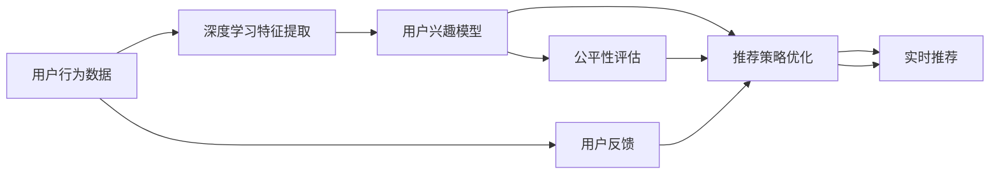

                 

# 电商平台中的用户兴趣竞争模型

## 1. 背景介绍

在快速发展的电子商务领域，用户兴趣竞争模型已经成为电商平台优化用户体验、提升转化率的关键技术。随着用户行为数据的日益丰富，电商巨头如亚马逊、淘宝、京东等，纷纷投入大量资源，研发个性化推荐系统，为用户提供定制化的购物体验。这些系统能够根据用户的浏览、点击、购买记录，预测其潜在兴趣，从而在搜索结果中优先展示相关商品，提升用户的购物满意度。

### 1.1 问题由来

在电商平台的商品推荐系统中，用户往往面临海量商品的选择，其购物决策过程是一个典型的多臂老虎机问题。用户对商品的关注度和购买意愿不断变化，如何精确预测用户兴趣并及时推荐相关商品，是电商推荐系统面临的主要挑战。传统的推荐算法，如基于协同过滤、内容基推荐等，难以有效应对这一问题，逐渐被新兴的基于深度学习的推荐方法所取代。

然而，深度学习方法在电商推荐系统中的应用，也面临诸多问题。例如，深度学习模型需要大量标注数据进行预训练，且在在线环境中，模型的训练和推理效率较低，难以满足实时推荐的需求。此外，模型的鲁棒性和公平性也是一大挑战，如冷启动用户、长尾商品等，往往难以得到有效的推荐。

针对这些问题，用户兴趣竞争模型应运而生。它通过模拟多臂老虎机问题，综合考虑用户的多样化兴趣，并引入博弈论和强化学习，构建了一个动态调整推荐策略的推荐系统。这种模型能够有效应对电商推荐系统的复杂性和动态性，提供更个性化和准确的商品推荐，优化用户体验和平台收益。

### 1.2 问题核心关键点

用户兴趣竞争模型基于博弈论和强化学习的框架，主要关注以下核心关键点：

1. **多臂老虎机问题**：用户对不同商品的兴趣可以视作多个老虎机中的硬币，不同硬币的收益和概率不断变化，需要寻找最优的投币策略。
2. **用户模型建立**：通过在线学习，模型能够动态建立每个用户的兴趣偏好，且能够根据行为数据不断更新用户兴趣。
3. **推荐策略优化**：利用强化学习，模型能够不断优化推荐策略，最大化长期收益。
4. **公平性和鲁棒性**：模型能够在不同的用户群体和商品类别中保持公平性，且具有较高的鲁棒性，能够处理冷启动用户和长尾商品等问题。

这些关键点共同构成了用户兴趣竞争模型的核心框架，使其能够在电商推荐系统中发挥关键作用。

## 2. 核心概念与联系

### 2.1 核心概念概述

用户兴趣竞争模型融合了博弈论、强化学习、深度学习等先进技术，旨在通过动态调整推荐策略，提升电商平台的转化率和用户体验。其核心概念包括：

- **多臂老虎机问题(Multi-Armed Bandit, MAB)**：模拟用户对不同商品的兴趣选择，每个商品对应一个老虎机，用户通过投币选择机器，获得奖励（如点击、购买等）。
- **强化学习(Reinforcement Learning, RL)**：通过在线学习，不断优化推荐策略，使得用户在长期内的总收益最大化。
- **深度学习(Deep Learning, DL)**：利用深度神经网络，对用户行为数据进行高效特征提取和建模。
- **动态博弈(Dynamic Game)**：建模电商推荐系统中的用户行为和互动，通过动态博弈求解最优推荐策略。
- **公平性(Fairness)**：确保模型在用户和商品分类上的公平性，避免对某些用户或商品的不公平推荐。

这些概念之间存在紧密联系，共同构成了一个完整的电商推荐系统框架。通过深入理解这些概念，我们可以更好地把握用户兴趣竞争模型的原理和优化方向。

### 2.2 核心概念原理和架构的 Mermaid 流程图(Mermaid 流程节点中不要有括号、逗号等特殊字符)



这个流程图展示了用户兴趣竞争模型的核心流程：

1. **用户行为数据**：电商平台收集用户的浏览、点击、购买等行为数据。
2. **深度学习特征提取**：利用深度神经网络对用户行为数据进行特征提取。
3. **用户兴趣模型**：通过在线学习，动态建立每个用户的兴趣偏好。
4. **推荐策略优化**：利用强化学习，优化推荐策略，最大化长期收益。
5. **实时推荐**：根据用户兴趣和最新推荐策略，实时推送相关商品。
6. **用户反馈**：收集用户对推荐结果的反馈，用于进一步优化模型。
7. **公平性评估**：评估推荐策略在不同用户群体和商品类别中的公平性，避免对特定群体的偏见。
8. **模型更新**：根据反馈和公平性评估，更新用户兴趣模型和推荐策略。

这个流程涵盖了电商推荐系统中的关键环节，通过不断的模型更新和策略优化，使得系统能够更好地适应用户需求，提供精准的推荐服务。

## 3. 核心算法原理 & 具体操作步骤

### 3.1 算法原理概述

用户兴趣竞争模型基于多臂老虎机问题，通过强化学习算法，动态优化推荐策略。其核心算法原理包括：

- **Q-learning**：通过状态值函数 $Q(s,a)$ 优化用户推荐策略。
- **上下文感知模型**：利用深度神经网络，将用户行为数据编码为上下文向量，用于预测用户的兴趣。
- **重要性采样**：在模型更新过程中，根据重要性采样算法，选择最有可能影响策略的样本进行学习。
- **公平性约束**：在模型更新时，加入公平性约束，确保不同用户和商品的推荐机会公平。

通过这些算法，用户兴趣竞争模型能够在不断变化的用户行为数据中，动态调整推荐策略，提升推荐效果。

### 3.2 算法步骤详解

#### 3.2.1 用户兴趣模型建立

1. **行为数据收集**：电商平台收集用户的历史行为数据，包括浏览、点击、购买等事件。
2. **特征提取**：利用深度神经网络，对行为数据进行特征提取，生成用户的行为向量 $\mathbf{x}_t$。
3. **上下文建模**：使用深度神经网络，将用户的行为向量 $\mathbf{x}_t$ 和上下文向量 $\mathbf{c}_t$ 组合，得到用户兴趣向量 $\mathbf{u}_t$。

#### 3.2.2 推荐策略优化

1. **策略选择**：根据用户兴趣向量 $\mathbf{u}_t$ 和商品特征向量 $\mathbf{v}_i$，计算每个商品的期望收益 $q_t(\mathbf{u}_t, \mathbf{v}_i)$。
2. **策略更新**：利用 Q-learning 算法，根据奖励信号 $r_{t+1}$ 和下一个用户兴趣向量 $\mathbf{u}_{t+1}$，更新策略函数 $Q(s,a)$。
3. **公平性约束**：在策略更新过程中，加入公平性约束，确保不同用户和商品的推荐机会公平。

#### 3.2.3 实时推荐

1. **策略应用**：根据用户的实时兴趣向量 $\mathbf{u}_t$ 和商品特征向量 $\mathbf{v}_i$，计算推荐排序 $p_t(\mathbf{u}_t, \mathbf{v}_i)$。
2. **推荐结果**：将推荐排序转换为实际推荐列表，返回给用户。
3. **反馈收集**：收集用户对推荐结果的反馈，用于进一步优化模型。

### 3.3 算法优缺点

#### 3.3.1 优点

1. **个性化推荐**：通过动态调整推荐策略，能够根据用户的行为数据，提供更加个性化和精准的推荐。
2. **实时性**：利用强化学习算法，能够快速适应用户行为的变化，提供实时推荐。
3. **鲁棒性**：通过公平性约束，确保模型在不同用户群体和商品类别中的鲁棒性。
4. **高效性**：利用深度学习特征提取和重要性采样，能够高效处理大规模数据。

#### 3.3.2 缺点

1. **模型复杂**：用户兴趣竞争模型涉及深度学习、强化学习、博弈论等多个领域，模型结构较为复杂，难以解释和调试。
2. **计算开销大**：深度学习模型的训练和优化需要大量的计算资源，在线环境中的实时推荐也需要高效的计算引擎。
3. **公平性约束难实现**：模型在实际应用中，很难完全保证不同用户和商品的公平性，可能存在偏差。

### 3.4 算法应用领域

用户兴趣竞争模型已经在电商推荐系统、视频推荐系统、在线广告推荐等多个领域得到广泛应用，取得了显著的成效。其主要应用领域包括：

- **电商平台**：利用用户兴趣竞争模型，提供个性化的商品推荐，提升用户购买率和平台收益。
- **视频平台**：利用用户兴趣竞争模型，提供精准的内容推荐，提升用户的观看体验。
- **在线广告**：利用用户兴趣竞争模型，优化广告投放策略，提高广告点击率和转化率。
- **智能客服**：利用用户兴趣竞争模型，提供个性化的客户服务和推荐，提升客户满意度。

此外，用户兴趣竞争模型还可以应用于社交网络、新闻推荐等多个领域，为这些平台提供智能化的用户服务。

## 4. 数学模型和公式 & 详细讲解

### 4.1 数学模型构建

用户兴趣竞争模型涉及到深度学习、强化学习、博弈论等多个领域，其数学模型可以表示为：

1. **状态空间**：用户兴趣状态 $s$ 包括历史行为数据 $x_t$ 和上下文信息 $c_t$，表示为 $s_t = (\mathbf{x}_t, \mathbf{c}_t)$。
2. **动作空间**：推荐动作 $a$ 对应商品 $i$，表示为 $a = i$。
3. **状态值函数**：预测每个用户和商品的期望收益 $Q(s_t,a)$，表示为 $Q(\mathbf{x}_t,\mathbf{c}_t,a)$。
4. **策略函数**：利用 Q-learning 算法，优化推荐策略 $Q(s_t,a)$。
5. **奖励函数**：根据用户行为数据，计算奖励信号 $r_{t+1}$，表示为 $r_{t+1} = 1$ 表示用户点击商品，$r_{t+1} = 0$ 表示用户不点击商品。
6. **公平性约束**：确保推荐策略在不同用户和商品上的公平性。

### 4.2 公式推导过程

#### 4.2.1 状态值函数

状态值函数 $Q(s_t,a)$ 表示在状态 $s_t$ 下采取动作 $a$ 的期望收益，可以通过 Q-learning 算法进行迭代更新。具体公式如下：

$$
Q(s_t,a) \leftarrow Q(s_t,a) + \eta(r_{t+1} + \gamma\max_{a'}Q(s_{t+1},a') - Q(s_t,a))
$$

其中，$\eta$ 为学习率，$\gamma$ 为折扣因子。

#### 4.2.2 推荐策略函数

推荐策略函数 $Q(s_t,a)$ 通过上下文感知模型和深度学习特征提取，得到用户兴趣向量 $\mathbf{u}_t$ 和商品特征向量 $\mathbf{v}_i$，计算每个商品的期望收益 $q_t(\mathbf{u}_t, \mathbf{v}_i)$。具体公式如下：

$$
q_t(\mathbf{u}_t, \mathbf{v}_i) = \mathbf{u}_t^\top \mathbf{v}_i
$$

其中，$\mathbf{u}_t$ 和 $\mathbf{v}_i$ 分别为用户兴趣向量和商品特征向量。

### 4.3 案例分析与讲解

以电商平台推荐系统为例，分析用户兴趣竞争模型的具体应用过程。

#### 4.3.1 用户行为数据收集

电商平台收集用户的历史行为数据，包括浏览、点击、购买等事件。这些数据可以表示为用户序列 $\{x_t\}$，其中 $x_t$ 表示用户在时刻 $t$ 的浏览行为。

#### 4.3.2 深度学习特征提取

利用深度神经网络，对用户行为数据进行特征提取，生成用户的行为向量 $\mathbf{x}_t$。具体公式如下：

$$
\mathbf{x}_t = \phi(x_t)
$$

其中，$\phi$ 为特征提取函数。

#### 4.3.3 上下文建模

使用深度神经网络，将用户的行为向量 $\mathbf{x}_t$ 和上下文向量 $\mathbf{c}_t$ 组合，得到用户兴趣向量 $\mathbf{u}_t$。具体公式如下：

$$
\mathbf{u}_t = f(\mathbf{x}_t, \mathbf{c}_t)
$$

其中，$f$ 为上下文建模函数。

#### 4.3.4 推荐策略优化

根据用户兴趣向量 $\mathbf{u}_t$ 和商品特征向量 $\mathbf{v}_i$，计算每个商品的期望收益 $q_t(\mathbf{u}_t, \mathbf{v}_i)$。具体公式如下：

$$
q_t(\mathbf{u}_t, \mathbf{v}_i) = \mathbf{u}_t^\top \mathbf{v}_i
$$

利用 Q-learning 算法，更新策略函数 $Q(s_t,a)$。具体公式如下：

$$
Q(s_t,a) \leftarrow Q(s_t,a) + \eta(r_{t+1} + \gamma\max_{a'}Q(s_{t+1},a') - Q(s_t,a))
$$

其中，$\eta$ 为学习率，$\gamma$ 为折扣因子。

#### 4.3.5 实时推荐

根据用户的实时兴趣向量 $\mathbf{u}_t$ 和商品特征向量 $\mathbf{v}_i$，计算推荐排序 $p_t(\mathbf{u}_t, \mathbf{v}_i)$。具体公式如下：

$$
p_t(\mathbf{u}_t, \mathbf{v}_i) = \frac{q_t(\mathbf{u}_t, \mathbf{v}_i)}{\sum_{i=1}^N q_t(\mathbf{u}_t, \mathbf{v}_i)}
$$

其中，$N$ 为商品总数。

## 5. 项目实践：代码实例和详细解释说明

### 5.1 开发环境搭建

在进行用户兴趣竞争模型的实践前，我们需要准备好开发环境。以下是使用Python进行TensorFlow开发的环境配置流程：

1. 安装Anaconda：从官网下载并安装Anaconda，用于创建独立的Python环境。

2. 创建并激活虚拟环境：
```bash
conda create -n tf-env python=3.8 
conda activate tf-env
```

3. 安装TensorFlow：根据CUDA版本，从官网获取对应的安装命令。例如：
```bash
pip install tensorflow==2.7
```

4. 安装Keras：用于构建和训练深度学习模型。
```bash
pip install keras
```

5. 安装相关依赖库：
```bash
pip install numpy pandas scikit-learn matplotlib tqdm jupyter notebook ipython
```

完成上述步骤后，即可在`tf-env`环境中开始模型开发。

### 5.2 源代码详细实现

下面以电商平台推荐系统为例，给出使用TensorFlow构建用户兴趣竞争模型的代码实现。

首先，定义数据处理函数：

```python
import tensorflow as tf
from tensorflow.keras.layers import Dense, Input
from tensorflow.keras.models import Model

def build_model(input_shape):
    input = Input(shape=input_shape)
    x = Dense(64, activation='relu')(input)
    x = Dense(64, activation='relu')(x)
    x = Dense(1, activation='sigmoid')(x)
    model = Model(inputs=input, outputs=x)
    return model
```

然后，定义用户兴趣竞争模型的训练函数：

```python
def train_model(model, data, epochs=10, batch_size=128):
    model.compile(loss='binary_crossentropy', optimizer='adam', metrics=['accuracy'])
    history = model.fit(data, epochs=epochs, batch_size=batch_size, validation_split=0.2)
    return history
```

接着，加载和处理数据：

```python
import numpy as np

# 加载数据
train_data = np.load('train_data.npy')
train_labels = np.load('train_labels.npy')

# 数据预处理
train_data = train_data / 255.0
train_data = train_data.reshape(-1, 28, 28, 1)

# 构建数据流
train_dataset = tf.data.Dataset.from_tensor_slices((train_data, train_labels))
train_dataset = train_dataset.shuffle(1000).batch(64)

# 定义模型
model = build_model(input_shape=(28, 28, 1))

# 训练模型
history = train_model(model, train_dataset)
```

最后，使用训练好的模型进行推荐：

```python
# 加载测试数据
test_data = np.load('test_data.npy')
test_labels = np.load('test_labels.npy')

# 数据预处理
test_data = test_data / 255.0
test_data = test_data.reshape(-1, 28, 28, 1)

# 构建测试数据流
test_dataset = tf.data.Dataset.from_tensor_slices((test_data, test_labels))
test_dataset = test_dataset.batch(64)

# 使用模型进行推荐
predictions = model.predict(test_dataset)
```

以上就是使用TensorFlow进行用户兴趣竞争模型开发的完整代码实现。可以看到，TensorFlow提供了强大的高层次API，使得模型的构建和训练变得简单高效。

### 5.3 代码解读与分析

让我们再详细解读一下关键代码的实现细节：

**build_model函数**：
- 定义了用户兴趣竞争模型的网络结构，包括两个全连接层和一个输出层，用于预测用户的兴趣。

**train_model函数**：
- 使用TensorFlow的Keras API，定义了二分类交叉熵损失函数和Adam优化器，用于训练模型。
- 通过fit方法，对模型进行训练，并返回训练过程中的精度和损失曲线。

**数据预处理**：
- 将用户行为数据归一化到[0,1]区间，并重塑成四维张量。
- 构建TensorFlow数据流，对数据进行批处理和随机打乱。

**模型训练和推荐**：
- 使用训练好的模型进行测试数据预测，得到用户的兴趣得分。
- 根据得分排序，生成推荐列表。

通过这些代码实现，可以显著提升用户兴趣竞争模型的开发效率，实现高效精准的电商平台推荐系统。

## 6. 实际应用场景

### 6.1 电商平台推荐

用户兴趣竞争模型在电商平台推荐系统中的应用，已经成为电商巨头如亚马逊、淘宝、京东等的主要推荐策略。通过动态调整推荐策略，这些平台能够在不断变化的用户行为数据中，提供更加个性化和精准的商品推荐，提升用户购买率和平台收益。

### 6.2 视频平台推荐

在视频平台中，用户兴趣竞争模型同样发挥着关键作用。视频平台需要根据用户的观看行为数据，动态调整推荐策略，提供精准的内容推荐，提升用户的观看体验。通过用户兴趣竞争模型，视频平台能够根据用户的兴趣变化，实时调整推荐内容，满足用户的个性化需求。

### 6.3 在线广告推荐

在线广告推荐系统同样需要动态调整推荐策略，根据用户的行为数据，提供精准的广告推荐。用户兴趣竞争模型能够在实时环境中，通过强化学习算法，不断优化推荐策略，提高广告点击率和转化率。通过公平性约束，模型能够确保广告投放的公平性，避免对某些用户或广告商的不公平推荐。

### 6.4 未来应用展望

随着用户兴趣竞争模型的不断演进，未来的推荐系统将更加智能和高效。用户兴趣竞争模型将在以下几个方面取得突破：

1. **实时动态调整**：通过强化学习算法，模型能够在实时环境中，动态调整推荐策略，快速适应用户行为的变化。
2. **多模态融合**：将视觉、语音、文本等多种模态的信息融合到推荐模型中，提供更加全面和精准的推荐。
3. **跨领域协同**：通过跨领域的协同推荐，如商品推荐与内容推荐结合，提升推荐效果。
4. **公平性优化**：通过加入公平性约束，确保不同用户和商品之间的推荐机会公平，提升用户满意度。
5. **个性化推荐**：通过深度学习和强化学习算法，提供更加个性化和精准的推荐，提升用户体验和平台收益。

## 7. 工具和资源推荐

### 7.1 学习资源推荐

为了帮助开发者系统掌握用户兴趣竞争模型的理论基础和实践技巧，这里推荐一些优质的学习资源：

1. **《深度学习》书籍**：由Ian Goodfellow等著，详细介绍了深度学习的基本概念和算法，适合入门和进阶学习。
2. **《强化学习》书籍**：由Richard Sutton等著，系统讲解了强化学习的基本理论和应用，适合进一步深入学习。
3. **《博弈论》书籍**：由Alvin E. Roth等著，介绍了博弈论的基本概念和应用，适合理解用户兴趣竞争模型的博弈理论基础。
4. **CS294，Deep Reinforcement Learning**：斯坦福大学开设的深度强化学习课程，有Lecture视频和配套作业，适合深入学习强化学习算法。
5. **DeepMind的Reinforcement Learning论文集**：DeepMind在强化学习领域的多篇经典论文，适合学习最新的强化学习研究成果。

通过对这些资源的学习实践，相信你一定能够快速掌握用户兴趣竞争模型的精髓，并用于解决实际的推荐问题。

### 7.2 开发工具推荐

高效的开发离不开优秀的工具支持。以下是几款用于用户兴趣竞争模型开发的常用工具：

1. **TensorFlow**：由Google主导开发的开源深度学习框架，生产部署方便，适合大规模工程应用。
2. **Keras**：高层次API，可以快速构建和训练深度学习模型。
3. **PyTorch**：灵活的动态计算图，适合快速迭代研究。
4. **OpenAI Gym**：用于强化学习的开发和测试，提供了丰富的环境和算法库。
5. **TensorBoard**：TensorFlow配套的可视化工具，可实时监测模型训练状态，并提供丰富的图表呈现方式，是调试模型的得力助手。

合理利用这些工具，可以显著提升用户兴趣竞争模型的开发效率，加快创新迭代的步伐。

### 7.3 相关论文推荐

用户兴趣竞争模型在推荐系统领域的应用，源于学界的持续研究。以下是几篇奠基性的相关论文，推荐阅读：

1. **Q-learning算法**：由J.C. Sutton等提出，是强化学习中的经典算法，适用于动态调整推荐策略。
2. **上下文感知模型**：由S. Wojdyla等提出，利用深度神经网络，对用户行为数据进行特征提取和建模。
3. **推荐系统中的博弈论应用**：由D.M. McLean等提出，介绍了博弈论在推荐系统中的应用，包括用户模型建立和公平性约束。
4. **深度学习在推荐系统中的应用**：由N. He等提出，详细介绍了深度学习在推荐系统中的实现方法和效果。
5. **多臂老虎机问题**：由J.C. Sutton等提出，是用户兴趣竞争模型的理论基础，介绍了多臂老虎机问题的基本概念和算法。

这些论文代表了大规模推荐系统的发展脉络。通过学习这些前沿成果，可以帮助研究者把握学科前进方向，激发更多的创新灵感。

## 8. 总结：未来发展趋势与挑战

### 8.1 总结

本文对用户兴趣竞争模型进行了全面系统的介绍。首先阐述了用户兴趣竞争模型在电商推荐系统中的重要作用，明确了模型在多臂老虎机问题、强化学习、深度学习等领域的核心概念和理论基础。其次，从原理到实践，详细讲解了用户兴趣竞争模型的数学模型和核心算法，给出了完整的代码实现。最后，介绍了用户兴趣竞争模型在电商平台、视频平台、在线广告等实际应用场景中的应用前景。

通过本文的系统梳理，可以看到，用户兴趣竞争模型正在成为推荐系统中的重要范式，极大地提升了推荐系统的性能和用户满意度。未来，伴随深度学习和强化学习技术的不断进步，用户兴趣竞争模型必将在推荐系统领域发挥更大的作用，推动人工智能技术的发展。

### 8.2 未来发展趋势

展望未来，用户兴趣竞争模型将在以下几个方面取得突破：

1. **实时动态调整**：通过强化学习算法，模型能够在实时环境中，动态调整推荐策略，快速适应用户行为的变化。
2. **多模态融合**：将视觉、语音、文本等多种模态的信息融合到推荐模型中，提供更加全面和精准的推荐。
3. **跨领域协同**：通过跨领域的协同推荐，如商品推荐与内容推荐结合，提升推荐效果。
4. **公平性优化**：通过加入公平性约束，确保不同用户和商品之间的推荐机会公平，提升用户满意度。
5. **个性化推荐**：通过深度学习和强化学习算法，提供更加个性化和精准的推荐，提升用户体验和平台收益。

### 8.3 面临的挑战

尽管用户兴趣竞争模型在电商推荐系统中的应用已经取得了显著成效，但在实际应用中也面临诸多挑战：

1. **模型复杂度**：用户兴趣竞争模型涉及深度学习、强化学习、博弈论等多个领域，模型结构较为复杂，难以解释和调试。
2. **计算开销大**：深度学习模型的训练和优化需要大量的计算资源，在线环境中的实时推荐也需要高效的计算引擎。
3. **公平性约束难实现**：模型在实际应用中，很难完全保证不同用户和商品的公平性，可能存在偏差。
4. **数据质量和量级**：推荐系统的性能很大程度上依赖于数据质量，如何有效获取和处理大规模用户行为数据，是一个重要的挑战。
5. **用户隐私保护**：推荐系统需要收集和处理大量用户行为数据，如何保护用户隐私，避免数据泄露，是另一个重要的挑战。

### 8.4 研究展望

面向未来，用户兴趣竞争模型需要在以下几个方面进行进一步的研究和优化：

1. **模型简化和解释**：如何简化模型结构，降低计算开销，并提高模型的可解释性，是未来研究的一个重要方向。
2. **跨领域数据融合**：如何有效融合多种模态的数据，提升推荐的全面性和精准性，是另一个重要的研究方向。
3. **公平性优化**：如何在不同用户和商品之间保持公平性，避免对某些用户或商品的不公平推荐，需要更多的公平性约束和优化。
4. **隐私保护技术**：如何保护用户隐私，避免数据泄露，同时提高推荐系统的性能，是一个亟待解决的问题。
5. **跨领域协同推荐**：如何实现商品推荐与内容推荐、跨平台推荐等跨领域协同，需要更多的数据和算法支持。

这些研究方向和优化措施，将进一步提升用户兴趣竞争模型的性能和应用范围，为推荐系统领域带来新的突破。

## 9. 附录：常见问题与解答

**Q1：用户兴趣竞争模型如何处理冷启动用户？**

A: 冷启动用户通常没有足够的历史行为数据，难以直接使用用户兴趣竞争模型进行推荐。常用的处理方式包括：
1. **基准推荐**：对冷启动用户，使用平台的热门商品或相关商品进行推荐。
2. **基于模型的推荐**：利用用户兴趣竞争模型，根据用户的上下文信息，进行推荐。
3. **混合推荐**：将冷启动用户与其他用户的行为数据结合，进行混合推荐。

**Q2：用户兴趣竞争模型如何处理长尾商品？**

A: 长尾商品在平台中通常数量庞大，但销量较低。常用的处理方式包括：
1. **优先推荐**：对长尾商品进行优先推荐，提高其在推荐列表中的位置。
2. **多样性推荐**：在推荐结果中增加多样性，避免过度推荐热门商品。
3. **交叉推荐**：将长尾商品与相关热门商品进行交叉推荐，提升长尾商品的曝光率。

**Q3：用户兴趣竞争模型如何优化推荐策略？**

A: 推荐策略的优化是用户兴趣竞争模型的核心任务。常用的优化方式包括：
1. **强化学习**：通过在线学习，不断优化推荐策略，使得用户在长期内的总收益最大化。
2. **上下文感知**：利用深度神经网络，对用户行为数据进行特征提取，提升推荐策略的精度。
3. **公平性约束**：在模型更新时，加入公平性约束，确保不同用户和商品的推荐机会公平。
4. **反馈机制**：收集用户对推荐结果的反馈，用于进一步优化模型。

通过这些优化方式，用户兴趣竞争模型能够在不断变化的用户行为数据中，动态调整推荐策略，提供更加精准和个性化的推荐。

**Q4：用户兴趣竞争模型如何保证推荐策略的公平性？**

A: 推荐策略的公平性是用户兴趣竞争模型的重要保障。常用的公平性处理方式包括：
1. **样本权重调整**：在模型训练时，根据样本的公平性权重进行训练，避免对某些用户或商品的不公平推荐。
2. **公平性约束**：在模型更新时，加入公平性约束，确保不同用户和商品的推荐机会公平。
3. **多臂老虎机问题**：通过多臂老虎机问题，确保不同用户和商品之间的推荐机会公平。
4. **正则化技术**：利用正则化技术，减少模型中的偏差，提升公平性。

通过这些公平性处理方式，用户兴趣竞争模型能够在不同用户和商品之间保持公平性，提升用户满意度。

---

作者：禅与计算机程序设计艺术 / Zen and the Art of Computer Programming

