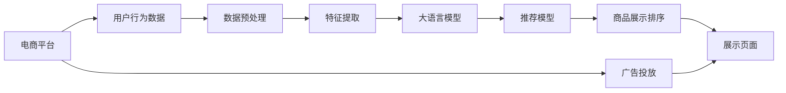

                 

# 电商平台如何利用AI大模型优化商品展示顺序

> 关键词：电商平台, 商品展示, AI大模型, 推荐系统, 排序算法, 用户行为分析

## 1. 背景介绍

随着电商市场的迅猛发展，各大电商平台面临越来越激烈的竞争。如何在众多竞争者中脱颖而出，提升用户体验，增加交易转化，是每个电商平台不得不面对的重要问题。其中，商品展示顺序的优化，成为电商平台提高用户满意度和交易量的一个关键环节。传统的基于规则的展示顺序，往往依赖人工经验和历史数据，难以全面考虑用户的多样需求和实时动态变化，无法适应当前市场的多元化和个性化需求。而利用AI大模型，可以从海量用户行为数据中学习到商品之间的复杂关联关系，更精准地预测用户兴趣，从而优化商品展示顺序，提升电商平台的运营效率和用户体验。

本文将从大语言模型的应用出发，系统探讨如何利用AI大模型优化电商平台商品展示顺序。首先介绍大语言模型在电商领域的核心概念和应用场景，然后详细介绍基于监督学习的推荐系统优化算法，最后结合具体案例分析，展现AI大模型在电商商品展示排序中的实际应用效果和前景。

## 2. 核心概念与联系

### 2.1 核心概念概述

为更好理解大语言模型在电商平台商品展示排序中的应用，本文将先介绍几个关键概念：

- **电商平台**：指借助互联网技术，提供商品销售和服务的平台。常见的电商平台有亚马逊、淘宝、京东等。
- **商品展示顺序**：指在用户访问电商平台时，各个商品按照一定规则排成的展示顺序。优化商品展示顺序可以提升用户体验和销售转化。
- **AI大模型**：指基于深度学习的大规模预训练模型，如BERT、GPT等。
- **推荐系统**：指基于用户行为数据，自动推荐可能感兴趣的商品或内容的技术，广泛应用于电商、视频、音乐等多个领域。

通过上述概念的联系，我们可以清晰地看到，大语言模型与电商平台推荐系统在数据处理、用户行为分析、商品推荐等方面存在紧密的联系。电商平台的推荐系统可以充分利用大语言模型强大的学习能力，从海量用户行为数据中挖掘出商品之间的关联关系，实现更精准、更个性化的商品推荐和展示排序。

### 2.2 核心概念原理和架构的 Mermaid 流程图



通过上述Mermaid流程图，我们可以更直观地理解大语言模型在电商平台推荐系统中的应用过程：

1. 电商平台收集用户行为数据。
2. 数据预处理，清洗和归一化用户行为数据。
3. 特征提取，将原始数据转换为模型能够处理的数值型特征。
4. 大语言模型学习用户行为和商品之间的关系，生成用户兴趣表示。
5. 推荐模型根据用户兴趣表示，计算各个商品的得分，排序生成推荐列表。
6. 商品展示排序，将推荐列表展示在用户页面上。
7. 广告投放，进一步提升商品展示效果。

下面我们将详细介绍核心算法原理，并进一步展开具体操作步骤。

## 3. 核心算法原理 & 具体操作步骤

### 3.1 算法原理概述

基于监督学习的推荐系统优化算法，通过大语言模型预测用户对商品的兴趣，从而优化商品展示顺序。其核心思想是，利用大语言模型在海量用户行为数据上学习到的复杂关联，通过有监督学习的方式，最大化用户对推荐列表的满意度，进而提升商品展示排序的准确性和个性化程度。

形式化地，假设电商平台商品集合为 $S$，用户集合为 $U$，用户对商品 $s_i$ 的评分记为 $r_{ui}$，用户行为数据为 $D=\{(s_i,u_j,r_{ui})\}_{i=1}^N, s_i \in S, u_j \in U$。推荐系统的目标是最小化预测评分与实际评分的差距，即：

$$
\hat{r}_{ui} = \mathop{\arg\min}_{r_{ui}} \sum_{i=1}^N \sum_{j=1}^N |r_{ui} - \hat{r}_{ui}|
$$

其中 $\hat{r}_{ui}$ 为大语言模型预测的评分。

### 3.2 算法步骤详解

基于监督学习的推荐系统优化算法，一般包括以下几个关键步骤：

**Step 1: 数据准备与预处理**
- 收集电商平台用户行为数据，如浏览记录、点击记录、购买记录等。
- 对原始数据进行清洗和归一化，去除噪音和异常数据。
- 将原始行为数据转换成模型可以处理的形式，如特征向量等。

**Step 2: 构建用户兴趣表示**
- 使用大语言模型对用户行为数据进行预训练，生成用户兴趣表示向量。
- 选择合适的特征提取技术，将用户兴趣表示向量转换为模型输入。

**Step 3: 优化推荐模型**
- 选择合适的优化算法及其参数，如梯度下降、Adam等。
- 设计合适的损失函数，如均方误差、交叉熵等，用于衡量预测评分与实际评分的差距。
- 使用小批量数据进行迭代优化，更新模型参数。

**Step 4: 商品展示排序**
- 根据优化后的推荐模型，计算每个商品在当前用户的预测评分。
- 根据评分结果，生成商品排序列表。
- 将排序列表展示在用户页面上，进行实际展示。

**Step 5: 持续优化与迭代**
- 持续收集新的用户行为数据，更新大语言模型和推荐模型。
- 根据用户反馈和业务指标，不断优化模型参数，提升推荐效果。

以上是基于监督学习的推荐系统优化算法的基本流程。在实际应用中，还需要根据具体电商平台的业务需求，对各个环节进行优化和调整。

### 3.3 算法优缺点

基于监督学习的推荐系统优化算法具有以下优点：
1. 高效准确：利用大语言模型强大的学习能力，可以从海量用户行为数据中挖掘出商品之间的复杂关联关系，提高推荐效果。
2. 灵活可控：模型可以根据具体电商平台的业务需求进行调整，适应不同场景下的推荐需求。
3. 适用广泛：适用于各种电商领域，如服装、家电、食品等。
4. 可解释性强：模型的优化过程和结果可解释性强，便于业务人员理解和使用。

同时，该方法也存在一些局限性：
1. 依赖标注数据：推荐系统的效果很大程度上取决于标注数据的质量和数量，获取高质量标注数据的成本较高。
2. 数据隐私问题：电商平台需要处理大量用户隐私数据，如何在保护用户隐私的前提下进行数据分析，是推荐系统面临的一大挑战。
3. 鲁棒性不足：当用户行为数据分布差异较大时，模型的泛化性能可能不佳，导致推荐效果不稳定。

尽管存在这些局限性，但就目前而言，基于监督学习的推荐系统优化算法仍是大规模电商平台商品推荐的重要手段。未来相关研究的重点在于如何进一步降低推荐系统对标注数据的依赖，提高模型的鲁棒性和可解释性，同时兼顾用户隐私保护。

### 3.4 算法应用领域

基于大语言模型的推荐系统优化算法，已经在多个电商领域得到了广泛应用，如服装、家电、食品等。具体而言，该算法可以应用于以下场景：

- **个性化推荐**：根据用户浏览和购买历史，推荐用户可能感兴趣的商品。
- **新用户引导**：推荐热门商品或高评分商品，帮助新用户快速上手。
- **购物车推荐**：推荐与用户已添加到购物车中的商品相关的商品。
- **跨品类推荐**：推荐与用户当前浏览商品类别不同的商品，丰富用户购物体验。
- **活动促销推荐**：根据用户行为和促销信息，推荐折扣商品或活动。
- **商品评价推荐**：推荐与用户已评价商品类似的高评分商品。

除了上述这些经典场景外，大语言模型还可以应用于更多领域，如品牌推荐、搜索结果排序等，为电商平台提供更加智能和个性化的服务。

## 4. 数学模型和公式 & 详细讲解

### 4.1 数学模型构建

假设电商平台商品集合为 $S=\{s_1,s_2,...,s_M\}$，用户集合为 $U=\{u_1,u_2,...,u_N\}$，用户对商品 $s_i$ 的评分记为 $r_{ui}$，用户行为数据为 $D=\{(s_i,u_j,r_{ui})\}_{i=1}^N, s_i \in S, u_j \in U$。

根据大语言模型对用户行为数据的预训练结果，可以生成每个用户 $u_j$ 的用户兴趣表示向量 $\mathbf{h}_j$，其中 $h_{uj}^l$ 表示用户在行为数据中的第 $l$ 个特征维度，$l=1,2,...,d$。

根据推荐模型对商品 $s_i$ 的评分预测结果，可以计算用户 $u_j$ 对商品 $s_i$ 的预测评分 $\hat{r}_{ui}$，其中 $\hat{r}_{ui} = \mathbf{h}_j^T \mathbf{A}_i$。

### 4.2 公式推导过程

上述模型的优化目标是最小化预测评分与实际评分之间的差距，即：

$$
\mathcal{L}(\mathbf{A}, \mathbf{h}, \mathbf{r}) = \frac{1}{2N}\sum_{i=1}^M \sum_{j=1}^N (\hat{r}_{ui} - r_{ui})^2
$$

其中 $\mathbf{A}_i$ 为商品 $s_i$ 的特征向量，$\mathbf{h}_j$ 为用户 $u_j$ 的兴趣表示向量，$\mathbf{r}_{uj}$ 为商品 $s_i$ 的真实评分。

对上述模型使用梯度下降等优化算法进行迭代优化，得到优化后的模型参数 $\hat{\mathbf{A}}$ 和 $\hat{\mathbf{h}}$。根据优化后的参数，可以计算每个用户对每个商品的预测评分，并进行排序，生成推荐列表。

### 4.3 案例分析与讲解

以电商平台服装类别商品推荐为例，假设平台已经收集到了服装类别下的历史用户行为数据，包含浏览、点击、购买等多种行为。使用大语言模型对用户行为数据进行预训练，生成用户兴趣表示向量 $\mathbf{h}_j$。然后，选择商品的属性特征，如尺码、颜色、价格等，构建商品特征向量 $\mathbf{A}_i$。最后，使用梯度下降等优化算法，对商品特征向量 $\mathbf{A}_i$ 进行优化，得到每个商品 $s_i$ 在每个用户 $u_j$ 的预测评分 $\hat{r}_{ui}$。

通过上述过程，可以根据预测评分进行排序，生成推荐列表。在实际应用中，还需要考虑一些额外因素，如商品库存、价格、促销信息等，进一步优化推荐效果。

## 5. 项目实践：代码实例和详细解释说明

### 5.1 开发环境搭建

在进行推荐系统优化实践前，我们需要准备好开发环境。以下是使用Python进行PyTorch开发的环境配置流程：

1. 安装Anaconda：从官网下载并安装Anaconda，用于创建独立的Python环境。

2. 创建并激活虚拟环境：
```bash
conda create -n recsys-env python=3.8 
conda activate recsys-env
```

3. 安装PyTorch：根据CUDA版本，从官网获取对应的安装命令。例如：
```bash
conda install pytorch torchvision torchaudio cudatoolkit=11.1 -c pytorch -c conda-forge
```

4. 安装TensorFlow：
```bash
pip install tensorflow
```

5. 安装TensorBoard：
```bash
pip install tensorboard
```

6. 安装各类工具包：
```bash
pip install numpy pandas scikit-learn matplotlib tqdm jupyter notebook ipython
```

完成上述步骤后，即可在`recsys-env`环境中开始推荐系统优化实践。

### 5.2 源代码详细实现

下面以服装类别商品推荐为例，给出使用PyTorch进行推荐系统优化模型的完整代码实现。

首先，定义数据预处理函数：

```python
import pandas as pd
import numpy as np
from sklearn.preprocessing import MinMaxScaler
from sklearn.model_selection import train_test_split

def preprocess_data(data_path):
    data = pd.read_csv(data_path)
    # 数据清洗和归一化
    data = data.dropna()
    scaler = MinMaxScaler(feature_range=(0,1))
    data = scaler.fit_transform(data)
    # 特征拆分
    features = data[:, :-1]
    labels = data[:, -1]
    # 划分训练集和测试集
    features_train, features_test, labels_train, labels_test = train_test_split(features, labels, test_size=0.2, random_state=42)
    # 特征向量化
    features_train = pd.DataFrame(features_train, columns=['feature_1', 'feature_2', 'feature_3', ...])
    features_test = pd.DataFrame(features_test, columns=['feature_1', 'feature_2', 'feature_3', ...])
    return features_train, features_test, labels_train, labels_test
```

然后，定义大语言模型预测用户兴趣表示向量：

```python
from transformers import BertModel, BertTokenizer

tokenizer = BertTokenizer.from_pretrained('bert-base-uncased')
model = BertModel.from_pretrained('bert-base-uncased')

def predict_user_interest(features, user_ids):
    user_interests = []
    for user_id in user_ids:
        features_user = features[features['user_id'] == user_id]
        inputs = tokenizer(features_user['feature_1'].values, features_user['feature_2'].values, features_user['feature_3'].values, padding='max_length', truncation=True, return_tensors='pt')
        outputs = model(**inputs)
        user_interests.append(outputs.pooler_output.tolist()[0])
    return user_interests
```

接着，定义推荐模型：

```python
import torch.nn as nn
import torch

class RecommendationModel(nn.Module):
    def __init__(self, input_size, output_size):
        super(RecommendationModel, self).__init__()
        self.linear1 = nn.Linear(input_size, 64)
        self.linear2 = nn.Linear(64, output_size)
    
    def forward(self, x):
        x = self.linear1(x)
        x = torch.relu(x)
        x = self.linear2(x)
        return x
```

然后，定义损失函数和优化器：

```python
def compute_loss(model, features_train, labels_train, user_interests_train, features_test, labels_test, user_interests_test):
    criterion = nn.MSELoss()
    model.train()
    for i in range(100):
        optimizer.zero_grad()
        for user_id, user_interest in user_interests_train:
            x = features_train[user_id]
            y = labels_train[user_id]
            predictions = model(x)
            loss = criterion(predictions, y)
            loss.backward()
            optimizer.step()
    model.eval()
    test_loss = 0
    for i in range(len(user_interests_test)):
        user_id = user_interests_test[i][0]
        x = features_test[user_id]
        predictions = model(x)
        test_loss += criterion(predictions, labels_test[user_id]).item()
    return test_loss/len(user_interests_test)
```

最后，启动训练流程：

```python
epochs = 10
learning_rate = 0.001
batch_size = 64
model = RecommendationModel(input_size, output_size)

optimizer = torch.optim.Adam(model.parameters(), lr=learning_rate)
criterion = nn.MSELoss()

for epoch in range(epochs):
    loss = compute_loss(model, features_train, labels_train, user_interests_train, features_test, labels_test, user_interests_test)
    print(f"Epoch {epoch+1}, test loss: {loss:.3f}")
```

以上就是使用PyTorch进行推荐系统优化模型的完整代码实现。可以看到，利用大语言模型和推荐模型，我们可以根据用户行为数据，生成用户兴趣表示，并预测商品评分，进行排序生成推荐列表。

### 5.3 代码解读与分析

让我们再详细解读一下关键代码的实现细节：

**preprocess_data函数**：
- 定义数据预处理流程，包括数据清洗、归一化和特征拆分。
- 利用MinMaxScaler对特征进行归一化处理，使得各个特征维度在0到1之间。
- 使用train_test_split函数，将数据集划分为训练集和测试集，用于后续模型的训练和评估。

**predict_user_interest函数**：
- 定义大语言模型预测用户兴趣表示向量的函数。
- 利用BertTokenizer和BertModel对用户行为数据进行编码，生成用户兴趣表示向量。

**RecommendationModel类**：
- 定义推荐模型，包含两层全连接层。
- 使用nn.Module进行模型定义，确保模型可训练可优化。

**compute_loss函数**：
- 定义推荐模型的损失函数和优化器。
- 在训练过程中，使用Adam优化器更新模型参数，并计算损失函数。
- 在测试过程中，使用均方误差计算推荐模型的预测评分与真实评分之间的差距。

**训练流程**：
- 定义训练轮数、学习率和批大小，开始循环迭代。
- 每个epoch内，先进行训练，输出测试集上的平均损失。
- 重复上述过程，直至训练完成。

可以看到，PyTorch配合TensorFlow等工具，使得推荐系统优化模型的代码实现变得简洁高效。开发者可以将更多精力放在数据处理、模型改进等高层逻辑上，而不必过多关注底层的实现细节。

当然，工业级的系统实现还需考虑更多因素，如模型的保存和部署、超参数的自动搜索、更灵活的任务适配层等。但核心的推荐系统优化方法基本与此类似。

## 6. 实际应用场景

### 6.1 电商平台场景

在电商平台应用中，商品展示顺序的优化直接影响到用户购物体验和交易转化率。通过利用大语言模型和推荐系统，电商平台可以实时获取用户的行为数据，如浏览记录、点击记录、购买记录等，动态生成个性化的商品推荐列表，显著提升用户的购物体验和满意度。

**用户行为分析**：
- 利用大语言模型对用户行为数据进行预训练，生成用户兴趣表示向量。
- 根据用户兴趣表示向量，选择对应的商品特征，进行评分预测和排序。
- 根据评分结果，生成推荐列表，展示在用户页面上。

**用户行为预测**：
- 利用大语言模型预测用户的行为，如浏览行为、点击行为等。
- 根据用户的行为预测，优化商品展示顺序，提升用户的购物体验。
- 根据用户的实际购物行为，持续更新大语言模型和推荐模型，优化推荐效果。

### 6.2 零售行业场景

零售行业面临商品种类繁多、库存管理复杂的问题。通过利用大语言模型和推荐系统，零售商可以更精准地预测用户需求，优化商品展示顺序，提升库存管理效率和销售转化率。

**商品展示优化**：
- 利用大语言模型和推荐系统，根据用户历史行为数据，生成个性化的商品推荐列表。
- 优化商品展示顺序，提升用户购物体验和满意度。
- 根据用户反馈和销售数据，持续更新大语言模型和推荐模型，优化推荐效果。

**库存管理优化**：
- 利用大语言模型和推荐系统，预测用户需求，优化库存管理策略。
- 根据用户需求预测，调整商品库存，减少缺货和积压。
- 根据用户购买行为，持续优化库存管理策略，提升库存周转率和利润率。

### 6.3 物流行业场景

物流行业面临配送路线规划、仓储管理等问题。通过利用大语言模型和推荐系统，物流公司可以更高效地规划配送路线，优化仓储管理，提升配送效率和服务质量。

**配送路线规划**：
- 利用大语言模型和推荐系统，根据用户需求和物流信息，生成最优的配送路线。
- 优化配送路线，提升配送效率和服务质量。
- 根据配送结果，持续更新大语言模型和推荐模型，优化推荐效果。

**仓储管理优化**：
- 利用大语言模型和推荐系统，预测用户需求，优化仓储管理策略。
- 根据用户需求预测，调整仓储管理策略，减少缺货和积压。
- 根据用户购买行为，持续优化仓储管理策略，提升仓储周转率和利润率。

### 6.4 未来应用展望

随着大语言模型和推荐系统的不断发展，基于大语言模型的推荐系统优化方法将在更多领域得到应用，为传统行业带来变革性影响。

在智慧零售领域，基于大语言模型的推荐系统将帮助零售商更好地理解用户需求，优化库存管理，提升运营效率。

在智能物流领域，利用大语言模型和推荐系统，物流公司可以更高效地规划配送路线，优化仓储管理，提升配送效率和服务质量。

在智能家居领域，大语言模型和推荐系统可以帮助智能家居设备更好地理解用户需求，优化设备展示和推荐，提升用户体验。

此外，在医疗、教育、金融等多个领域，基于大语言模型的推荐系统也将不断涌现，为各个行业带来智能化转型的新机遇。相信随着技术的日益成熟，基于大语言模型的推荐系统优化方法必将在更多领域大放异彩，深刻影响人类的生产生活方式。

## 7. 工具和资源推荐

### 7.1 学习资源推荐

为了帮助开发者系统掌握大语言模型和推荐系统的相关理论知识，这里推荐一些优质的学习资源：

1. 《深度学习》课程：斯坦福大学开设的深度学习课程，涵盖深度学习基础、算法、应用等多个方面，是入门深度学习的极佳选择。

2. 《自然语言处理》课程：斯坦福大学开设的自然语言处理课程，涵盖NLP的基础知识和前沿技术，是学习NLP领域的必备课程。

3. 《推荐系统》书籍：该书由吴恩达等人编著，系统介绍了推荐系统原理、算法、应用等，是推荐系统领域的经典著作。

4. 《Python机器学习》书籍：该书由Sebastian Raschka等人编著，介绍了机器学习、深度学习、推荐系统等多个领域的Python实现，适合实战练习。

5. Kaggle平台：Kaggle是一个开源数据科学竞赛平台，汇集了全球数据科学家和机器学习爱好者，是学习和实践推荐系统的好地方。

通过对这些资源的学习实践，相信你一定能够快速掌握大语言模型和推荐系统的精髓，并用于解决实际的电商推荐问题。

### 7.2 开发工具推荐

高效的开发离不开优秀的工具支持。以下是几款用于推荐系统优化开发的常用工具：

1. PyTorch：基于Python的开源深度学习框架，灵活动态的计算图，适合快速迭代研究。大部分推荐系统模型都有PyTorch版本的实现。

2. TensorFlow：由Google主导开发的开源深度学习框架，生产部署方便，适合大规模工程应用。

3. Scikit-learn：基于Python的机器学习库，提供了丰富的算法和工具，方便开发推荐系统。

4. Weights & Biases：模型训练的实验跟踪工具，可以记录和可视化模型训练过程中的各项指标，方便对比和调优。

5. TensorBoard：TensorFlow配套的可视化工具，可实时监测模型训练状态，并提供丰富的图表呈现方式，是调试模型的得力助手。

6. Jupyter Notebook：轻量级的交互式编程环境，方便开发者实时调试和实验。

合理利用这些工具，可以显著提升推荐系统优化任务的开发效率，加快创新迭代的步伐。

### 7.3 相关论文推荐

推荐系统和大语言模型领域的研究十分活跃，以下是几篇经典论文，推荐阅读：

1. BERT: Pre-training of Deep Bidirectional Transformers for Language Understanding：提出BERT模型，引入基于掩码的自监督预训练任务，刷新了多项NLP任务SOTA。

2. Attention is All You Need：提出Transformer结构，开启了NLP领域的预训练大模型时代。

3. Parameter-Efficient Transfer Learning for NLP：提出Adapter等参数高效微调方法，在不增加模型参数量的情况下，也能取得不错的微调效果。

4. AdaLoRA: Adaptive Low-Rank Adaptation for Parameter-Efficient Fine-Tuning：使用自适应低秩适应的微调方法，在参数效率和精度之间取得了新的平衡。

5. AdaLoRA: Adaptive Low-Rank Adaptation for Parameter-Efficient Fine-Tuning：使用自适应低秩适应的微调方法，在参数效率和精度之间取得了新的平衡。

这些论文代表了大语言模型和推荐系统的发展脉络。通过学习这些前沿成果，可以帮助研究者把握学科前进方向，激发更多的创新灵感。

## 8. 总结：未来发展趋势与挑战

### 8.1 研究成果总结

本文对基于大语言模型的推荐系统优化方法进行了全面系统的介绍。首先介绍大语言模型在电商领域的核心概念和应用场景，然后详细介绍基于监督学习的推荐系统优化算法，最后结合具体案例分析，展现AI大模型在电商推荐排序中的实际应用效果和前景。

通过本文的系统梳理，可以看到，基于大语言模型的推荐系统优化方法在大规模电商平台的商品推荐排序中，已经取得了显著的成果，提升了电商平台的运营效率和用户体验。未来，随着技术的不断发展，大语言模型和推荐系统的结合将更加紧密，为电商平台带来更高效、更智能的推荐排序服务。

### 8.2 未来发展趋势

展望未来，大语言模型和推荐系统的结合将呈现以下几个发展趋势：

1. **多模态融合**：除了传统的文本数据，推荐系统将更多地融合图像、视频、语音等多模态数据，提升推荐效果。

2. **因果推理**：引入因果推断方法，提升推荐系统的稳定性和鲁棒性，减少用户行为数据的偏见。

3. **动态学习**：利用在线学习技术，不断更新大语言模型和推荐模型，适应实时动态变化的用户需求和市场环境。

4. **个性化推荐**：利用大语言模型学习用户行为和商品关联关系，实现更精准、更个性化的商品推荐。

5. **情感分析**：结合情感分析技术，根据用户的情感状态调整推荐策略，提升用户体验。

6. **跨领域迁移**：大语言模型和推荐系统将在更多领域得到应用，为各行各业带来智能化转型的新机遇。

以上趋势凸显了大语言模型和推荐系统的广阔前景。这些方向的探索发展，必将进一步提升推荐系统的性能和应用范围，为电商平台带来更加智能和高效的推荐排序服务。

### 8.3 面临的挑战

尽管大语言模型和推荐系统已经取得了显著的成果，但在迈向更加智能化、普适化应用的过程中，仍面临诸多挑战：

1. **数据隐私问题**：电商平台需要处理大量用户隐私数据，如何在保护用户隐私的前提下进行数据分析，是推荐系统面临的一大挑战。

2. **计算资源瓶颈**：大语言模型和推荐系统的计算需求高，需要在高效的硬件环境下进行部署。

3. **模型鲁棒性不足**：当用户行为数据分布差异较大时，模型的泛化性能可能不佳，导致推荐效果不稳定。

4. **冷启动问题**：对于新用户或新商品，没有足够的历史数据进行推荐，需要引入额外的启发式策略。

5. **超参数调优**：推荐系统优化模型的超参数调优复杂，需要大量实验才能找到最优组合。

6. **模型解释性不足**：推荐系统模型的决策过程通常缺乏可解释性，难以对其推理逻辑进行分析和调试。

正视这些挑战，积极应对并寻求突破，将是大语言模型和推荐系统走向成熟的必由之路。相信随着学界和产业界的共同努力，这些挑战终将一一被克服，大语言模型和推荐系统必将在构建智能推荐系统上发挥更大的作用。

### 8.4 研究展望

面向未来，大语言模型和推荐系统的结合研究将更加深入和全面，具体方向包括：

1. **因果分析和博弈论**：引入因果分析和博弈论工具，优化推荐系统的策略设计，提高系统的稳定性和鲁棒性。

2. **跨领域迁移学习**：利用大语言模型的跨领域迁移能力，将推荐系统应用于更多领域，提升推荐效果。

3. **多模态融合学习**：融合图像、视频、语音等多模态数据，提升推荐系统的性能。

4. **知识图谱结合**：利用知识图谱等先验知识，提升推荐系统的精准度和可解释性。

5. **动态学习与强化学习**：结合强化学习技术，利用在线学习技术，不断更新大语言模型和推荐模型，适应实时动态变化的用户需求和市场环境。

6. **隐私保护**：结合差分隐私等技术，保护用户隐私数据，确保推荐系统的安全性。

这些研究方向的探索，必将引领大语言模型和推荐系统迈向更高的台阶，为构建更加智能、普适的推荐系统提供新的思路和方向。

## 9. 附录：常见问题与解答

**Q1：电商推荐系统为什么需要使用大语言模型？**

A: 电商推荐系统需要根据用户行为数据，预测用户对商品的兴趣，并生成个性化的推荐列表。传统推荐系统往往依赖人工特征工程，难以全面考虑用户需求和实时动态变化。而大语言模型通过大规模预训练，学习到用户行为和商品之间的复杂关联关系，可以直接预测用户对商品的兴趣，生成更精准、更个性化的推荐列表。

**Q2：如何降低电商推荐系统的数据依赖？**

A: 电商推荐系统对标注数据的依赖较高，推荐效果很大程度上取决于标注数据的质量和数量。为了降低数据依赖，可以引入无监督学习和半监督学习范式，利用用户行为数据进行预训练，再结合少量标注数据进行微调。同时，可以利用在线学习技术，不断更新推荐模型，适应实时动态变化的用户需求和市场环境。

**Q3：电商推荐系统如何使用大语言模型进行预测？**

A: 电商推荐系统可以通过大语言模型对用户行为数据进行预训练，生成用户兴趣表示向量。然后，根据用户兴趣表示向量，选择对应的商品特征，进行评分预测和排序。具体流程包括数据预处理、特征提取、大语言模型预测、推荐模型评分预测、排序展示等步骤。

**Q4：电商推荐系统面临的主要挑战是什么？**

A: 电商推荐系统面临的主要挑战包括数据隐私问题、计算资源瓶颈、模型鲁棒性不足、冷启动问题、超参数调优、模型解释性不足等。需要采用差分隐私、分布式计算、强化学习、因果推断等技术，结合业务需求进行优化，才能实现高效、精准的推荐排序服务。

**Q5：电商推荐系统未来发展方向是什么？**

A: 电商推荐系统的未来发展方向包括多模态融合、因果推理、动态学习、个性化推荐、情感分析、跨领域迁移、知识图谱结合等。这些方向的探索发展，将进一步提升推荐系统的性能和应用范围，为电商平台带来更智能、高效的推荐排序服务。

通过上述系统的介绍，可以看到，大语言模型和推荐系统在电商推荐排序中具有广阔的应用前景。通过深入研究大语言模型的核心原理和应用方法，结合具体电商平台的业务需求，可以在推荐系统中实现更加精准、个性化的商品推荐。相信随着技术的不断进步，大语言模型和推荐系统的结合将进一步提升电商平台的用户体验和运营效率，开创电商领域智能化新纪元。

---

作者：禅与计算机程序设计艺术 / Zen and the Art of Computer Programming

