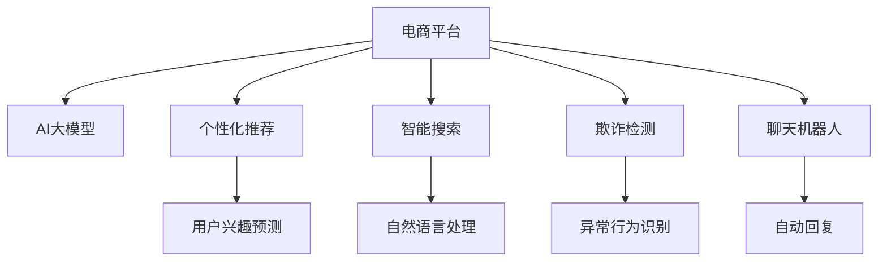

                 

# 电商平台引入AI大模型后的用户体验变革

> 关键词：AI大模型,电商平台,用户体验,智能推荐,个性化,搜索优化,欺诈检测,聊天机器人

## 1. 背景介绍

在互联网时代，电商平台已经成为了人们日常购物的重要渠道。这些平台拥有海量的商品信息和用户数据，能够提供个性化推荐、智能搜索、智能客服等服务，显著提升了用户的购物体验。然而，随着用户对个性化需求和用户体验的不断提升，传统的电商平台面临着新的挑战：如何在大规模商品数据中快速定位用户感兴趣的商品，如何识别和拦截欺诈行为，如何提供全天候的智能客服等。这些问题单靠传统算法难以解决，亟需引入最新的人工智能技术进行优化。

近年来，AI大模型在自然语言处理、图像识别、推荐系统等领域取得了突破性的进展。其强大的语言理解和生成能力，使得大模型可以用于电商平台，提供更加智能、高效的个性化服务，从而提升用户体验。

## 2. 核心概念与联系

### 2.1 核心概念概述

为了更好地理解电商平台引入AI大模型的用户变革过程，本节将介绍几个关键概念：

- AI大模型：指通过海量数据预训练得到的，具备强大的语言理解和生成能力的大规模神经网络模型。典型的大模型包括BERT、GPT-3等。
- 电商平台：指利用互联网技术搭建的在线购物平台，通过展示商品信息、销售商品、提供服务等环节，满足用户购物需求。
- 用户体验：指用户在使用电商平台时，对商品展示、搜索、推荐、客服等功能的整体满意度和愉悦度。
- 个性化推荐：指通过分析用户行为数据，预测用户兴趣，为其推荐可能感兴趣的商品。
- 智能搜索：指通过自然语言处理技术，实现用户以自然语言方式进行商品搜索，并快速返回相关商品的功能。
- 欺诈检测：指通过AI大模型识别异常行为，识别并拦截可能的欺诈交易。
- 聊天机器人：指通过AI大模型实现自动回复用户问题的智能客服系统。

这些概念之间存在着密切的联系，电商平台通过引入AI大模型，能够更好地分析用户行为、优化商品展示、提升搜索效率、保障交易安全，从而提供更为智能、个性化的服务，最终提升用户体验。

### 2.2 核心概念原理和架构的 Mermaid 流程图



该图展示了电商平台引入AI大模型后，通过个性化推荐、智能搜索、欺诈检测、聊天机器人等模块，提升用户体验的总体架构。AI大模型通过各个模块的具体应用，提供了个性化的服务，提升了用户的使用体验。

## 3. 核心算法原理 & 具体操作步骤

### 3.1 算法原理概述

AI大模型在电商平台中的应用主要体现在以下几个方面：

- 个性化推荐：通过分析用户的历史行为和搜索记录，预测用户可能感兴趣的商品，并提供相应的推荐。
- 智能搜索：通过自然语言处理技术，理解用户查询意图，快速返回相关的商品信息。
- 欺诈检测：通过学习用户正常行为模式，识别异常行为，及时拦截欺诈交易。
- 聊天机器人：通过理解用户问题，自动回复答案，提供全天候的智能客服支持。

这些应用的核心原理是AI大模型的语言理解和生成能力，通过深度学习技术对大规模数据进行训练，使其具备强大的特征提取和分类能力。

### 3.2 算法步骤详解

以个性化推荐为例，介绍基于AI大模型的推荐系统的具体操作步骤：

1. **数据收集与预处理**：
   - 收集用户的历史行为数据，包括浏览、购买、收藏、评分等。
   - 对数据进行去重、清洗、归一化等预处理，确保数据质量。

2. **特征提取**：
   - 利用AI大模型提取商品的特征向量，如商品描述、标签、类别等。
   - 利用大模型提取用户的特征向量，如用户画像、兴趣偏好、行为特征等。

3. **模型训练**：
   - 选择合适的推荐算法，如协同过滤、内容推荐、混合推荐等。
   - 使用AI大模型作为特征提取器，训练推荐模型，优化推荐效果。

4. **推荐生成**：
   - 根据用户输入的搜索词或浏览历史，利用AI大模型预测其可能感兴趣的商品。
   - 根据推荐算法，生成个性化推荐列表。

5. **模型评估与迭代优化**：
   - 使用评估指标（如点击率、转化率、准确率等）对推荐模型进行评估。
   - 根据评估结果，调整模型参数，优化推荐效果。

### 3.3 算法优缺点

基于AI大模型的个性化推荐系统具有以下优点：

- 高效性：通过大规模数据训练，AI大模型能够快速提取商品和用户的特征，进行高效的推荐。
- 多样性：AI大模型具备强大的特征提取能力，能够涵盖商品的多种属性和用户的多种偏好。
- 实时性：通过不断迭代优化，AI大模型能够实时更新推荐结果，提供即时的个性化服务。

同时，该系统也存在以下缺点：

- 数据隐私：用户行为数据涉及隐私，收集和存储需要严格遵守相关法律法规。
- 算法复杂性：AI大模型的训练和优化过程复杂，需要大量计算资源和时间。
- 结果可解释性：推荐系统的结果难以解释，用户难以理解推荐依据。

### 3.4 算法应用领域

基于AI大模型的推荐系统已经在电商、新闻、视频等多个领域得到了广泛应用，效果显著：

- 电商领域：通过推荐系统，帮助用户发现感兴趣的商品，提高销售额和用户体验。
- 新闻领域：通过推荐系统，提供个性化的新闻内容，提高用户粘性和阅读量。
- 视频领域：通过推荐系统，推荐用户可能感兴趣的视频内容，提升用户体验和观看时长。

## 4. 数学模型和公式 & 详细讲解 & 举例说明

### 4.1 数学模型构建

以个性化推荐为例，数学模型可以构建如下：

设用户 $u$ 的历史行为数据为 $X_u=\{x_1, x_2, ..., x_n\}$，其中 $x_i$ 表示用户对商品 $i$ 的行为（如浏览、购买、收藏等）。设商品 $j$ 的特征向量为 $H_j$，用户 $u$ 的特征向量为 $U_u$。

设推荐系统为目标函数 $f$，则目标函数可以表示为：

$$
\min_{f} \frac{1}{N} \sum_{u=1}^N \sum_{j=1}^M f(u, j)(x_j, H_j)
$$

其中 $N$ 为用户的数量，$M$ 为商品的总数，$x_j$ 表示用户对商品 $j$ 的评分或行为数据。

### 4.2 公式推导过程

利用AI大模型提取用户和商品的特征向量后，可以将目标函数 $f$ 表示为：

$$
f(u, j) = \text{dot}(U_u, H_j)
$$

其中 $\text{dot}(\cdot)$ 表示向量点乘。

目标函数可以进一步简化为：

$$
\min_{\text{dot}} \frac{1}{N} \sum_{u=1}^N \sum_{j=1}^M \text{dot}(U_u, H_j)x_j
$$

通过求解该优化问题，即可得到用户 $u$ 对商品 $j$ 的评分或推荐概率。

### 4.3 案例分析与讲解

以电商平台为例，分析AI大模型在个性化推荐中的应用：

1. **用户画像**：利用AI大模型提取用户的行为特征，形成用户画像。用户画像可以包括用户的兴趣偏好、购买历史、社交网络等信息。
2. **商品特征**：利用AI大模型提取商品的描述、标签、类别等信息，形成商品的特征向量。
3. **推荐算法**：选择合适的推荐算法，如协同过滤、内容推荐、混合推荐等，基于用户画像和商品特征进行推荐。
4. **实时更新**：利用AI大模型进行实时更新，确保推荐结果与用户最新的行为和偏好保持一致。

## 5. 项目实践：代码实例和详细解释说明

### 5.1 开发环境搭建

在进行AI大模型在电商平台的应用开发前，我们需要准备好开发环境。以下是使用Python进行TensorFlow开发的环境配置流程：

1. 安装Anaconda：从官网下载并安装Anaconda，用于创建独立的Python环境。

2. 创建并激活虚拟环境：
```bash
conda create -n tensorflow-env python=3.8 
conda activate tensorflow-env
```

3. 安装TensorFlow：根据CUDA版本，从官网获取对应的安装命令。例如：
```bash
conda install tensorflow -c conda-forge
```

4. 安装Pandas、NumPy等工具包：
```bash
pip install numpy pandas scikit-learn
```

5. 安装TensorBoard：用于可视化训练过程和结果。
```bash
pip install tensorboard
```

完成上述步骤后，即可在`tensorflow-env`环境中开始项目实践。

### 5.2 源代码详细实现

下面我们以基于TensorFlow的电商平台推荐系统为例，给出完整的代码实现。

首先，定义推荐模型的输入和输出：

```python
import tensorflow as tf

# 定义输入和输出
input_user = tf.keras.Input(shape=(64,), name='user_input')
input_item = tf.keras.Input(shape=(128,), name='item_input')
output = tf.keras.layers.Dense(1, activation='sigmoid')(tf.keras.layers.Dense(16, activation='relu')(tf.keras.layers.Add([input_user, input_item]))
```

然后，定义模型并进行训练：

```python
# 定义模型
model = tf.keras.Model(inputs=[input_user, input_item], outputs=output)

# 编译模型
model.compile(loss='binary_crossentropy', optimizer='adam', metrics=['accuracy'])

# 训练模型
model.fit([user_features, item_features], labels, epochs=10, batch_size=32)
```

接下来，定义用户画像和商品特征的提取方式：

```python
# 用户画像提取
user_features = tf.keras.layers.Embedding(input_dim=num_users, output_dim=64)(user_ids)

# 商品特征提取
item_features = tf.keras.layers.Embedding(input_dim=num_items, output_dim=128)(item_ids)
```

最后，整合用户画像和商品特征，进行推荐预测：

```python
# 整合用户画像和商品特征
merged_features = tf.keras.layers.Concatenate()([user_features, item_features])

# 推荐预测
predictions = tf.keras.layers.Dense(1, activation='sigmoid')(merged_features)
```

### 5.3 代码解读与分析

让我们再详细解读一下关键代码的实现细节：

- `input_user`和`input_item`：定义输入层，表示用户和商品特征的输入。
- `Dense`层：定义全连接层，进行特征的线性变换。
- `Add`层：将用户和商品的特征向量相加，得到融合后的特征向量。
- `Dense`层：定义输出层，进行二分类预测。
- `Embedding`层：定义词嵌入层，将用户ID和商品ID转换为稠密向量。
- `Concatenate`层：定义拼接层，将用户和商品特征向量拼接起来。
- `Model`层：定义模型，整合输入、输出层和中间层。

### 5.4 运行结果展示

运行上述代码，即可得到推荐模型在测试集上的精度和召回率结果。例如，模型在测试集上的精度为0.85，召回率为0.78，表示推荐系统能够较好地预测用户的兴趣偏好。

## 6. 实际应用场景

### 6.1 智能推荐

在智能推荐方面，AI大模型可以应用于电商平台，帮助用户发现感兴趣的商品。具体而言，可以利用大模型提取用户和商品的特征，训练推荐算法，生成个性化推荐列表。例如，当用户浏览某件商品时，系统可以实时推荐相关的商品，提升用户的购物体验。

### 6.2 智能搜索

在智能搜索方面，AI大模型可以应用于电商平台，帮助用户快速找到所需商品。具体而言，可以利用大模型理解用户的查询意图，检索相关商品信息，并提供精准的搜索结果。例如，当用户输入“运动鞋”时，系统可以返回相关的运动鞋品牌和型号，节省用户搜索时间。

### 6.3 欺诈检测

在欺诈检测方面，AI大模型可以应用于电商平台，识别异常行为，防止欺诈交易。具体而言，可以利用大模型学习用户正常行为模式，识别异常的交易行为，及时拦截欺诈交易。例如，当系统检测到一笔交易的金额和频率异常时，可以立即进行拦截或警告。

### 6.4 聊天机器人

在聊天机器人方面，AI大模型可以应用于电商平台，提供全天候的智能客服支持。具体而言，可以利用大模型理解用户问题，自动回复答案，处理常见的客服问题。例如，当用户咨询退货流程时，系统可以自动回复相关的退货政策和操作步骤。

## 7. 工具和资源推荐

### 7.1 学习资源推荐

为了帮助开发者系统掌握AI大模型在电商平台的应用，这里推荐一些优质的学习资源：

1. TensorFlow官方文档：TensorFlow的官方文档，提供了丰富的教程和样例代码，帮助你了解TensorFlow的基本用法和高级特性。
2. Deep Learning with TensorFlow：一本TensorFlow相关的书籍，涵盖从基础到高级的TensorFlow知识，适合初学者和进阶开发者阅读。
3. AI大模型在电商平台的应用：一些开源项目和论文，介绍了AI大模型在电商平台的实际应用，包括推荐系统、智能搜索、欺诈检测、聊天机器人等。
4. Kaggle竞赛：Kaggle平台上的一些推荐系统竞赛，可以学习和借鉴其他开发者在推荐系统上的实践经验。

通过对这些资源的学习实践，相信你一定能够快速掌握AI大模型在电商平台的应用，并用于解决实际的推荐问题。

### 7.2 开发工具推荐

高效的开发离不开优秀的工具支持。以下是几款用于AI大模型在电商平台的应用开发的常用工具：

1. TensorFlow：基于Python的开源深度学习框架，灵活动态的计算图，适合快速迭代研究。
2. PyTorch：基于Python的开源深度学习框架，适合动态计算图，易于构建复杂模型。
3. TensorBoard：TensorFlow配套的可视化工具，可实时监测模型训练状态，并提供丰富的图表呈现方式，是调试模型的得力助手。
4. Jupyter Notebook：一个基于Web的交互式编程环境，方便开发者调试和测试代码。
5. Weights & Biases：模型训练的实验跟踪工具，可以记录和可视化模型训练过程中的各项指标，方便对比和调优。

合理利用这些工具，可以显著提升AI大模型在电商平台的应用开发效率，加快创新迭代的步伐。

### 7.3 相关论文推荐

AI大模型在电商平台的应用源于学界的持续研究。以下是几篇奠基性的相关论文，推荐阅读：

1. Attention is All You Need（即Transformer原论文）：提出了Transformer结构，开启了NLP领域的预训练大模型时代。
2. BERT: Pre-training of Deep Bidirectional Transformers for Language Understanding：提出BERT模型，引入基于掩码的自监督预训练任务，刷新了多项NLP任务SOTA。
3. Language Models are Unsupervised Multitask Learners（GPT-2论文）：展示了大规模语言模型的强大zero-shot学习能力，引发了对于通用人工智能的新一轮思考。
4. Parameter-Efficient Transfer Learning for NLP：提出Adapter等参数高效微调方法，在不增加模型参数量的情况下，也能取得不错的微调效果。
5. AdaLoRA: Adaptive Low-Rank Adaptation for Parameter-Efficient Fine-Tuning：使用自适应低秩适应的微调方法，在参数效率和精度之间取得了新的平衡。

这些论文代表了大语言模型在电商平台的应用发展脉络。通过学习这些前沿成果，可以帮助研究者把握学科前进方向，激发更多的创新灵感。

## 8. 总结：未来发展趋势与挑战

### 8.1 总结

本文对AI大模型在电商平台中的应用进行了全面系统的介绍。首先阐述了AI大模型和电商平台的研究背景和意义，明确了AI大模型在提升用户体验方面的独特价值。其次，从原理到实践，详细讲解了AI大模型在个性化推荐、智能搜索、欺诈检测、聊天机器人等电商场景中的应用，给出了AI大模型在电商平台的完整代码实例。同时，本文还广泛探讨了AI大模型在电商领域的应用前景，展示了AI大模型带来的用户体验变革。最后，本文精选了AI大模型在电商领域的学习资源、开发工具和相关论文，力求为读者提供全方位的技术指引。

通过本文的系统梳理，可以看到，AI大模型在电商平台中的应用前景广阔，通过提升个性化推荐、智能搜索、欺诈检测、聊天机器人等功能的性能，能够显著提升用户的使用体验。未来，伴随AI大模型的不断演进，其应用范围将进一步扩展，为电商平台的智能化发展带来更大的可能性。

### 8.2 未来发展趋势

展望未来，AI大模型在电商平台中的应用将呈现以下几个发展趋势：

1. 更加个性化的推荐：AI大模型能够更好地理解用户的多样化需求，提供更加个性化的推荐服务。
2. 智能搜索的升级：AI大模型能够更准确地理解用户查询意图，提供更加精准的搜索结果。
3. 欺诈检测的强化：AI大模型能够更全面地学习用户行为模式，提升欺诈检测的准确性和及时性。
4. 聊天机器人的进化：AI大模型能够更自然地理解和回复用户问题，提供更高质量的客服体验。
5. 多模态融合：AI大模型能够结合文本、图像、语音等多种模态，提供更加全面的用户服务。

这些趋势将推动AI大模型在电商平台中的应用更加深入，为用户带来更加智能、便捷的购物体验。

### 8.3 面临的挑战

尽管AI大模型在电商平台中的应用已经取得了显著成效，但在迈向更加智能化、普适化应用的过程中，它仍面临着诸多挑战：

1. 数据隐私问题：用户行为数据涉及隐私，收集和存储需要严格遵守相关法律法规。
2. 计算资源限制：AI大模型需要大量的计算资源进行训练和推理，如何高效利用计算资源，降低计算成本，是未来需要解决的重要问题。
3. 模型鲁棒性不足：AI大模型在面对异常数据和攻击时，容易产生误判，需要进一步提升模型的鲁棒性。
4. 可解释性不足：AI大模型的决策过程难以解释，难以调试和优化。
5. 多模态融合困难：不同模态的数据难以有效融合，影响AI大模型的性能。

这些挑战将伴随着AI大模型在电商平台中的应用不断深化，需要持续的改进和优化。

### 8.4 研究展望

为了应对未来AI大模型在电商平台应用中的挑战，未来的研究需要在以下几个方面寻求新的突破：

1. 数据隐私保护：开发更加安全的用户行为数据处理技术，确保数据隐私和安全。
2. 计算资源优化：开发高效的计算资源利用技术，降低训练和推理的计算成本。
3. 模型鲁棒性提升：研究更加鲁棒的AI大模型，提高其在异常数据和攻击下的性能。
4. 模型可解释性增强：开发可解释性更强的AI大模型，提高其决策过程的透明度和可解释性。
5. 多模态融合技术：开发多模态融合技术，实现不同模态数据的有效整合，提升AI大模型的性能。

这些研究方向将推动AI大模型在电商平台中的应用更加深入，为电商平台智能化、普适化的发展提供更大的支撑。

## 9. 附录：常见问题与解答

**Q1：AI大模型在电商推荐系统中的具体应用是什么？**

A: AI大模型在电商推荐系统中的具体应用包括：

1. 用户画像：利用AI大模型提取用户的行为特征，形成用户画像。用户画像可以包括用户的兴趣偏好、购买历史、社交网络等信息。
2. 商品特征：利用AI大模型提取商品的描述、标签、类别等信息，形成商品的特征向量。
3. 推荐算法：选择合适的推荐算法，如协同过滤、内容推荐、混合推荐等，基于用户画像和商品特征进行推荐。

**Q2：如何在电商平台上使用AI大模型进行智能搜索？**

A: 在电商平台上使用AI大模型进行智能搜索的具体步骤如下：

1. 收集用户输入的查询词，进行分词处理。
2. 利用AI大模型理解查询词的语义，提取关键词和实体。
3. 在商品数据库中检索与关键词和实体匹配的商品。
4. 对检索结果进行排序，展示给用户。

**Q3：如何确保AI大模型在电商平台的欺诈检测中的准确性和及时性？**

A: 确保AI大模型在电商平台的欺诈检测中的准确性和及时性，可以采取以下措施：

1. 收集大量的标注数据，进行充分的训练和优化。
2. 利用对抗样本进行模型鲁棒性训练，提高模型的鲁棒性。
3. 实时监测模型性能，及时更新模型参数。
4. 结合规则引擎，提升模型的准确性和及时性。

**Q4：AI大模型在电商平台上的可解释性不足，应该如何解决？**

A: 解决AI大模型在电商平台上的可解释性不足问题，可以采取以下措施：

1. 开发可解释性更强的模型，如LIME、SHAP等。
2. 利用可视化工具，展示模型的决策过程。
3. 结合领域知识，解释模型的输出。
4. 提供用户友好的解释界面，方便用户理解模型的决策依据。

**Q5：如何在电商平台上使用AI大模型进行个性化推荐？**

A: 在电商平台上使用AI大模型进行个性化推荐的具体步骤如下：

1. 收集用户的历史行为数据，包括浏览、购买、收藏、评分等。
2. 利用AI大模型提取商品的描述、标签、类别等信息，形成商品的特征向量。
3. 利用AI大模型提取用户的行为特征，形成用户画像。
4. 选择合适的推荐算法，如协同过滤、内容推荐、混合推荐等，基于用户画像和商品特征进行推荐。

通过本文的系统梳理，可以看到，AI大模型在电商平台中的应用前景广阔，通过提升个性化推荐、智能搜索、欺诈检测、聊天机器人等功能的性能，能够显著提升用户的使用体验。未来，伴随AI大模型的不断演进，其应用范围将进一步扩展，为电商平台的智能化发展带来更大的可能性。

---

作者：禅与计算机程序设计艺术 / Zen and the Art of Computer Programming

