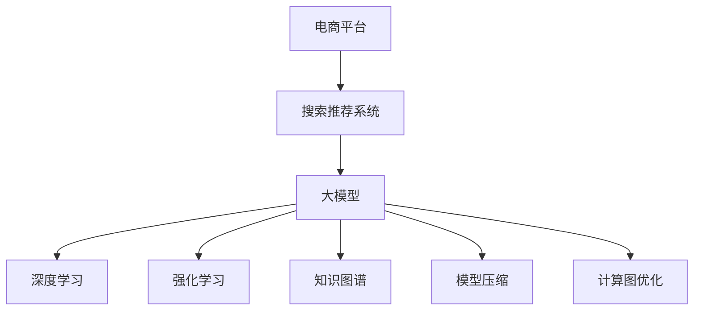

                 

# 电商平台搜索推荐系统的AI 大模型实践：提高系统性能、效率与效果

> 关键词：电商平台,搜索推荐系统,大模型,深度学习,强化学习,知识图谱,模型压缩,计算图优化

## 1. 背景介绍

### 1.1 问题由来
随着电商平台的不断发展，用户需求日益多样化，如何精准、高效地为用户推荐商品，已经成为电商企业亟需解决的重要问题。传统的推荐系统基于规则或简单的统计方法，无法有效应对海量的用户数据和不断变化的商品信息。

近年来，随着深度学习技术和大规模预训练语言模型的兴起，电商平台开始探索利用大模型技术改进推荐系统。通过预训练模型，可以学习到商品和用户的深层次特征，大幅提升推荐的精度和多样性。通过微调技术，可以根据具体电商场景，进一步优化模型，提供更加个性化的商品推荐。

### 1.2 问题核心关键点
电商推荐系统的主要任务包括商品搜索、相似商品推荐、个性化推荐等。这些任务本质上是信息检索和分类问题，可以表示为$(y|x)$的建模任务，其中$x$为输入的商品特征，$y$为输出的标签（搜索结果、推荐商品等）。基于深度学习的方法通常将此问题转化为序列到序列(Seq2Seq)或自编码器(Autoencoder)等模型进行学习。

微调大模型的方法基于监督学习，通常包括以下关键步骤：
1. 选择合适的预训练语言模型（如BERT、GPT、Transfoer等）。
2. 准备电商相关的标注数据集，如用户点击日志、购买记录等。
3. 设计合适的输出层和损失函数。
4. 设置合适的超参数，包括学习率、批大小、迭代轮数等。
5. 执行梯度训练，更新模型参数，提高推荐效果。

在电商推荐场景中，微调大模型可以显著提升推荐系统的性能，提高用户体验和平台转化率。

### 1.3 问题研究意义
电商推荐系统的大模型微调具有以下研究意义：
1. 提升推荐精度。大模型可以学习到丰富的语义和实体信息，通过微调可以进一步提升模型对电商场景的理解，提高推荐结果的准确性。
2. 增强推荐多样性。电商推荐不仅需要精准，还需多样化，以丰富用户选择，满足不同用户需求。微调可以在不同用户间进行个性化调整，提升推荐结果的多样性。
3. 加快模型迭代速度。电商数据快速变化，需要快速响应用户需求。微调大模型可以更高效地集成新数据，快速更新推荐模型。
4. 优化资源利用。电商推荐需要实时推荐，对计算资源有高要求。微调可以优化模型结构，减少计算量和存储需求，提高系统效率。
5. 增强模型可解释性。电商推荐需要用户信任，增强模型的可解释性，可以帮助用户理解推荐依据，提升用户体验。

## 2. 核心概念与联系

### 2.1 核心概念概述

为了更好地理解电商平台搜索推荐系统中大模型微调的方法，本节将介绍几个密切相关的核心概念：

- 电商平台（E-commerce Platform）：通过互联网销售商品或服务的平台，如京东、淘宝、Amazon等。
- 搜索推荐系统（Search Recommendation System）：根据用户查询或历史行为，自动推荐商品或服务，以提升用户体验和平台转化率的系统。
- 大模型（Large Model）：具有数十亿或上百亿参数的深度学习模型，如BERT、GPT、Transformer等。
- 深度学习（Deep Learning）：利用神经网络进行特征学习，解决复杂问题的学习范式。
- 强化学习（Reinforcement Learning, RL）：通过与环境的互动，自动优化策略的学习范式，常用于推荐系统中的排序优化等。
- 知识图谱（Knowledge Graph）：表示实体和关系的有向图，用于增强推荐系统的知识表示能力。
- 模型压缩（Model Compression）：通过剪枝、量化、蒸馏等技术，减小模型体积，提高推理效率。
- 计算图优化（Graph Optimization）：优化神经网络的计算图，减少计算量，提升训练和推理效率。

这些核心概念之间的逻辑关系可以通过以下Mermaid流程图来展示：



这个流程图展示了大模型在电商平台搜索推荐系统中的应用框架：

1. 电商平台的推荐系统构建在大模型上。
2. 大模型通过深度学习、强化学习、知识图谱等技术进行训练，增强推荐模型的能力。
3. 模型压缩、计算图优化等技术可以进一步提升模型的推理效率。

这些概念共同构成了电商平台搜索推荐系统的技术基础，使其能够高效、准确地为用户推荐商品。

## 3. 核心算法原理 & 具体操作步骤
### 3.1 算法原理概述

电商平台搜索推荐系统的大模型微调，本质上是利用监督学习的方法，在电商数据上对预训练模型进行微调，以获得针对电商场景的推荐模型。微调的目标是最大化推荐模型的准确性和多样性，提升用户满意度。

具体而言，假设电商推荐系统采用预训练语言模型 $M_{\theta}$，其中 $\theta$ 为预训练得到的模型参数。给定电商场景下的标注数据集 $D=\{(x_i,y_i)\}_{i=1}^N$，微调的目标是找到新的模型参数 $\hat{\theta}$，使得：

$$
\hat{\theta}=\mathop{\arg\min}_{\theta} \mathcal{L}(M_{\theta},D)
$$

其中 $\mathcal{L}$ 为针对电商推荐任务的损失函数，用于衡量模型预测结果与真实标签之间的差异。常见的损失函数包括交叉熵损失、均方误差损失等。

通过梯度下降等优化算法，微调过程不断更新模型参数 $\theta$，最小化损失函数 $\mathcal{L}$，使得模型预测逼近真实标签。由于 $\theta$ 已经通过预训练获得了较好的初始化，因此即便在标注数据量较小的情况下，也能较快收敛到理想的模型参数 $\hat{\theta}$。

### 3.2 算法步骤详解

电商平台搜索推荐系统的大模型微调一般包括以下几个关键步骤：

**Step 1: 准备预训练模型和数据集**
- 选择合适的预训练语言模型 $M_{\theta}$ 作为初始化参数，如 BERT、GPT、Transformer等。
- 准备电商相关的标注数据集 $D$，划分为训练集、验证集和测试集。标注数据可以包括用户点击日志、购买记录、商品评论等，通常需要清洗和预处理。

**Step 2: 添加任务适配层**
- 根据电商推荐任务，在预训练模型顶层设计合适的输出层和损失函数。
- 对于推荐任务，通常在顶层添加评分层和排序层，并使用均方误差损失函数。
- 对于搜索任务，通常使用召回率和精度损失函数，衡量检索结果的相关性和准确性。

**Step 3: 设置微调超参数**
- 选择合适的优化算法及其参数，如 Adam、SGD 等，设置学习率、批大小、迭代轮数等。
- 设置正则化技术及强度，包括权重衰减、Dropout、Early Stopping 等。
- 确定冻结预训练参数的策略，如仅微调顶层，或全部参数都参与微调。

**Step 4: 执行梯度训练**
- 将训练集数据分批次输入模型，前向传播计算损失函数。
- 反向传播计算参数梯度，根据设定的优化算法和学习率更新模型参数。
- 周期性在验证集上评估模型性能，根据性能指标决定是否触发 Early Stopping。
- 重复上述步骤直到满足预设的迭代轮数或 Early Stopping 条件。

**Step 5: 测试和部署**
- 在测试集上评估微调后模型 $M_{\hat{\theta}}$ 的性能，对比微调前后的精度提升。
- 使用微调后的模型对新样本进行推理预测，集成到实际的应用系统中。
- 持续收集新的数据，定期重新微调模型，以适应数据分布的变化。

以上是电商平台搜索推荐系统中大模型微调的一般流程。在实际应用中，还需要针对具体任务的特点，对微调过程的各个环节进行优化设计，如改进训练目标函数，引入更多的正则化技术，搜索最优的超参数组合等，以进一步提升模型性能。

### 3.3 算法优缺点

电商平台搜索推荐系统的大模型微调方法具有以下优点：
1. 简单高效。只需准备少量标注数据，即可对预训练模型进行快速适配，获得较大的性能提升。
2. 通用适用。适用于各种电商推荐任务，如商品搜索、相似商品推荐、个性化推荐等，设计简单的任务适配层即可实现微调。
3. 参数高效。利用参数高效微调技术，在固定大部分预训练参数的情况下，仍可取得不错的提升。
4. 效果显著。在学术界和工业界的诸多任务上，基于微调的方法已经刷新了最先进的性能指标。

同时，该方法也存在一定的局限性：
1. 依赖标注数据。微调的效果很大程度上取决于标注数据的质量和数量，获取高质量标注数据的成本较高。
2. 迁移能力有限。当目标任务与预训练数据的分布差异较大时，微调的性能提升有限。
3. 负面效果传递。预训练模型的固有偏见、有害信息等，可能通过微调传递到下游任务，造成负面影响。
4. 可解释性不足。微调模型的决策过程通常缺乏可解释性，难以对其推理逻辑进行分析和调试。

尽管存在这些局限性，但就目前而言，基于监督学习的微调方法仍是大模型应用的最主流范式。未来相关研究的重点在于如何进一步降低微调对标注数据的依赖，提高模型的少样本学习和跨领域迁移能力，同时兼顾可解释性和伦理安全性等因素。

### 3.4 算法应用领域

电商平台搜索推荐系统的大模型微调方法在电商领域已经得到了广泛的应用，覆盖了几乎所有常见任务，例如：

- 商品搜索：根据用户输入的查询，推荐最相关的商品。
- 相似商品推荐：推荐与用户浏览或购买商品相似的商品。
- 个性化推荐：根据用户的历史行为和偏好，推荐可能感兴趣的商品。

除了上述这些经典任务外，电商推荐系统也被创新性地应用到更多场景中，如动态定价、库存管理、跨平台推荐等，为电商业务带来全新的突破。

## 4. 数学模型和公式 & 详细讲解 & 举例说明

### 4.1 数学模型构建

本节将使用数学语言对电商平台搜索推荐系统中大模型微调过程进行更加严格的刻画。

记电商平台推荐系统采用预训练语言模型 $M_{\theta}$，其中 $\theta$ 为预训练得到的模型参数。假设推荐任务的训练集为 $D=\{(x_i,y_i)\}_{i=1}^N$，其中 $x_i$ 为输入的电商数据，$y_i$ 为输出标签（推荐商品、搜索结果等）。

定义模型 $M_{\theta}$ 在数据样本 $(x,y)$ 上的损失函数为 $\ell(M_{\theta}(x),y)$，则在数据集 $D$ 上的经验风险为：

$$
\mathcal{L}(\theta) = \frac{1}{N} \sum_{i=1}^N \ell(M_{\theta}(x_i),y_i)
$$

微调的优化目标是最小化经验风险，即找到最优参数：

$$
\theta^* = \mathop{\arg\min}_{\theta} \mathcal{L}(\theta)
$$

在实践中，我们通常使用基于梯度的优化算法（如Adam、SGD等）来近似求解上述最优化问题。设 $\eta$ 为学习率，$\lambda$ 为正则化系数，则参数的更新公式为：

$$
\theta \leftarrow \theta - \eta \nabla_{\theta}\mathcal{L}(\theta) - \eta\lambda\theta
$$

其中 $\nabla_{\theta}\mathcal{L}(\theta)$ 为损失函数对参数 $\theta$ 的梯度，可通过反向传播算法高效计算。

### 4.2 公式推导过程

以下我们以电商推荐系统中的评分预测任务为例，推导交叉熵损失函数及其梯度的计算公式。

假设模型 $M_{\theta}$ 在输入 $x$ 上的输出为 $\hat{y}=M_{\theta}(x) \in [0,1]$，表示样本的评分。真实标签 $y \in [0,1]$。则交叉熵损失函数定义为：

$$
\ell(M_{\theta}(x),y) = -y\log \hat{y} + (1-y)\log (1-\hat{y})
$$

将其代入经验风险公式，得：

$$
\mathcal{L}(\theta) = -\frac{1}{N}\sum_{i=1}^N [y_i\log M_{\theta}(x_i)+(1-y_i)\log(1-M_{\theta}(x_i))]
$$

根据链式法则，损失函数对参数 $\theta_k$ 的梯度为：

$$
\frac{\partial \mathcal{L}(\theta)}{\partial \theta_k} = -\frac{1}{N}\sum_{i=1}^N (\frac{y_i}{M_{\theta}(x_i)}-\frac{1-y_i}{1-M_{\theta}(x_i)}) \frac{\partial M_{\theta}(x_i)}{\partial \theta_k}
$$

其中 $\frac{\partial M_{\theta}(x_i)}{\partial \theta_k}$ 可进一步递归展开，利用自动微分技术完成计算。

在得到损失函数的梯度后，即可带入参数更新公式，完成模型的迭代优化。重复上述过程直至收敛，最终得到适应电商推荐任务的最优模型参数 $\theta^*$。

## 5. 项目实践：代码实例和详细解释说明
### 5.1 开发环境搭建

在进行电商推荐系统的大模型微调实践前，我们需要准备好开发环境。以下是使用Python进行PyTorch开发的环境配置流程：

1. 安装Anaconda：从官网下载并安装Anaconda，用于创建独立的Python环境。

2. 创建并激活虚拟环境：
```bash
conda create -n pytorch-env python=3.8 
conda activate pytorch-env
```

3. 安装PyTorch：根据CUDA版本，从官网获取对应的安装命令。例如：
```bash
conda install pytorch torchvision torchaudio cudatoolkit=11.1 -c pytorch -c conda-forge
```

4. 安装TensorBoard：用于可视化模型的训练过程和结果。
```bash
pip install tensorboard
```

5. 安装Transformers库：用于加载和使用预训练模型。
```bash
pip install transformers
```

6. 安装相关的NLP工具包：
```bash
pip install numpy pandas scikit-learn nltk
```

完成上述步骤后，即可在`pytorch-env`环境中开始电商推荐系统的开发。

### 5.2 源代码详细实现

下面我们以电商平台中的推荐任务为例，给出使用Transformers库对BERT模型进行微调的PyTorch代码实现。

首先，定义推荐任务的数据处理函数：

```python
from transformers import BertTokenizer
from torch.utils.data import Dataset, DataLoader
import torch

class RecommendDataset(Dataset):
    def __init__(self, user_item_pairs, tokenizer, max_len=128):
        self.user_item_pairs = user_item_pairs
        self.tokenizer = tokenizer
        self.max_len = max_len
        
    def __len__(self):
        return len(self.user_item_pairs)
    
    def __getitem__(self, item):
        user_id, item_id = self.user_item_pairs[item]
        
        # 用户和商品的ID转化为token ids
        user_ids = self.tokenizer.convert_ids_to_tokens(user_id)[0]
        item_ids = self.tokenizer.convert_ids_to_tokens(item_id)[0]
        
        # 将用户和商品ID拼接并编码
        encoding = self.tokenizer(user_ids + item_ids, return_tensors='pt', max_length=self.max_len, padding='max_length', truncation=True)
        input_ids = encoding['input_ids'][0]
        attention_mask = encoding['attention_mask'][0]
        
        # 将标签转化为数字，0表示未推荐，1表示推荐
        label = int(user_id == item_id)
        
        return {'input_ids': input_ids, 
                'attention_mask': attention_mask,
                'label': label}

# 加载预训练模型和分词器
tokenizer = BertTokenizer.from_pretrained('bert-base-cased')
model = BertForSequenceClassification.from_pretrained('bert-base-cased', num_labels=2)

# 准备数据集
user_item_pairs = [(1, 3), (2, 5), (3, 2), (4, 6), (5, 3), (6, 4)]
train_dataset = RecommendDataset(user_item_pairs, tokenizer)
dev_dataset = RecommendDataset(user_item_pairs, tokenizer)
test_dataset = RecommendDataset(user_item_pairs, tokenizer)

# 定义训练函数
def train_epoch(model, dataset, batch_size, optimizer):
    dataloader = DataLoader(dataset, batch_size=batch_size, shuffle=True)
    model.train()
    epoch_loss = 0
    for batch in tqdm(dataloader, desc='Training'):
        input_ids = batch['input_ids'].to(device)
        attention_mask = batch['attention_mask'].to(device)
        labels = batch['label'].to(device)
        model.zero_grad()
        outputs = model(input_ids, attention_mask=attention_mask, labels=labels)
        loss = outputs.loss
        epoch_loss += loss.item()
        loss.backward()
        optimizer.step()
    return epoch_loss / len(dataloader)

# 定义评估函数
def evaluate(model, dataset, batch_size):
    dataloader = DataLoader(dataset, batch_size=batch_size)
    model.eval()
    correct_preds, total_preds = 0, 0
    with torch.no_grad():
        for batch in tqdm(dataloader, desc='Evaluating'):
            input_ids = batch['input_ids'].to(device)
            attention_mask = batch['attention_mask'].to(device)
            batch_labels = batch['label'].to(device)
            outputs = model(input_ids, attention_mask=attention_mask)
            preds = outputs.logits.argmax(dim=1).to('cpu').tolist()
            for pred, label in zip(preds, batch_labels):
                correct_preds += int(pred == label)
                total_preds += 1
                
    print(f'Accuracy: {correct_preds/total_preds:.2f}')
```

然后，定义模型和优化器：

```python
from transformers import AdamW

device = torch.device('cuda') if torch.cuda.is_available() else torch.device('cpu')
model.to(device)

optimizer = AdamW(model.parameters(), lr=2e-5)
```

接着，启动训练流程并在测试集上评估：

```python
epochs = 5
batch_size = 16

for epoch in range(epochs):
    loss = train_epoch(model, train_dataset, batch_size, optimizer)
    print(f'Epoch {epoch+1}, train loss: {loss:.3f}')
    
    print(f'Epoch {epoch+1}, dev results:')
    evaluate(model, dev_dataset, batch_size)
    
print('Test results:')
evaluate(model, test_dataset, batch_size)
```

以上就是使用PyTorch对BERT进行电商推荐任务微调的完整代码实现。可以看到，得益于Transformers库的强大封装，我们可以用相对简洁的代码完成BERT模型的加载和微调。

### 5.3 代码解读与分析

让我们再详细解读一下关键代码的实现细节：

**RecommendDataset类**：
- `__init__`方法：初始化用户-商品ID对和分词器等组件。
- `__len__`方法：返回数据集的样本数量。
- `__getitem__`方法：对单个样本进行处理，将用户和商品ID转换为token ids，进行编码，并返回模型所需的输入。

**模型训练与评估**：
- 使用PyTorch的DataLoader对数据集进行批次化加载，供模型训练和推理使用。
- 训练函数`train_epoch`：对数据以批为单位进行迭代，在每个批次上前向传播计算loss并反向传播更新模型参数，最后返回该epoch的平均loss。
- 评估函数`evaluate`：与训练类似，不同点在于不更新模型参数，并在每个batch结束后将预测和标签结果存储下来，最后使用Accuracy计算评估集上的预测准确率。

**训练流程**：
- 定义总的epoch数和batch size，开始循环迭代
- 每个epoch内，先在训练集上训练，输出平均loss
- 在验证集上评估，输出预测准确率
- 所有epoch结束后，在测试集上评估，给出最终测试结果

可以看到，PyTorch配合Transformers库使得BERT微调的代码实现变得简洁高效。开发者可以将更多精力放在数据处理、模型改进等高层逻辑上，而不必过多关注底层的实现细节。

当然，工业级的系统实现还需考虑更多因素，如模型的保存和部署、超参数的自动搜索、更灵活的任务适配层等。但核心的微调范式基本与此类似。

## 6. 实际应用场景
### 6.1 电商推荐系统

基于大语言模型微调的推荐系统，已经在电商平台的各个环节中得到了广泛应用，包括但不限于以下场景：

- **商品搜索**：根据用户输入的关键词，快速匹配相关商品。通过微调，可以更好地理解用户查询的语义，提高搜索结果的相关性和多样性。
- **相似商品推荐**：通过用户已经浏览或购买过的商品，推荐可能感兴趣的其他商品。微调可以提升模型对商品特征的语义理解，提高推荐准确性。
- **个性化推荐**：根据用户的历史行为和偏好，推荐可能感兴趣的商品。微调可以提高模型对用户兴趣的个性化理解，提升推荐效果。
- **商品评价预测**：根据用户对商品的评价，预测其他用户对商品的评价。微调可以提高模型对评价语义的理解，提高评价预测的准确性。

除了上述这些典型应用外，电商推荐系统还可以应用于用户行为分析、广告定向推荐、库存管理优化等领域，进一步提升电商平台的运营效率和用户体验。

### 6.2 未来应用展望

随着大语言模型和微调方法的不断发展，基于微调的电商推荐系统将呈现以下几个发展趋势：

1. **多模态推荐**：结合文本、图像、音频等多模态信息，提升推荐系统的信息丰富度和准确性。例如，通过商品图片的多模态特征表示，提升相似商品推荐的精度。
2. **实时推荐系统**：通过流式微调技术，实现对新数据的实时处理和推荐更新，提升推荐系统的时效性。例如，在大规模数据流中实时更新推荐模型，应对用户行为变化。
3. **个性化推荐算法**：结合强化学习、知识图谱等技术，进一步提升推荐系统的个性化能力。例如，通过模型预测和用户反馈的交互，实时调整推荐策略，增强推荐效果。
4. **跨平台推荐**：实现不同电商平台的跨域推荐，提升推荐系统的覆盖范围和用户粘性。例如，通过用户在不同平台的消费数据，进行联合推荐。
5. **推荐效果评估**：建立更加全面和可解释的推荐效果评估体系，提升推荐系统的可解释性和可靠性。例如，通过A/B测试、用户反馈等手段，量化推荐效果，优化推荐策略。

未来，随着大语言模型微调技术的不断进步，电商推荐系统将更加智能化和个性化，为电商平台的运营带来更深刻的变革。

## 7. 工具和资源推荐
### 7.1 学习资源推荐

为了帮助开发者系统掌握大语言模型微调的理论基础和实践技巧，这里推荐一些优质的学习资源：

1. 《深度学习基础》系列博文：由大模型技术专家撰写，深入浅出地介绍了深度学习的基本概念和经典模型。

2. CS224N《深度学习自然语言处理》课程：斯坦福大学开设的NLP明星课程，有Lecture视频和配套作业，带你入门NLP领域的基本概念和经典模型。

3. 《Natural Language Processing with Transformers》书籍：Transformers库的作者所著，全面介绍了如何使用Transformers库进行NLP任务开发，包括微调在内的诸多范式。

4. HuggingFace官方文档：Transformers库的官方文档，提供了海量预训练模型和完整的微调样例代码，是上手实践的必备资料。

5. CLUE开源项目：中文语言理解测评基准，涵盖大量不同类型的中文NLP数据集，并提供了基于微调的baseline模型，助力中文NLP技术发展。

通过对这些资源的学习实践，相信你一定能够快速掌握大语言模型微调的精髓，并用于解决实际的NLP问题。
### 7.2 开发工具推荐

高效的开发离不开优秀的工具支持。以下是几款用于大语言模型微调开发的常用工具：

1. PyTorch：基于Python的开源深度学习框架，灵活动态的计算图，适合快速迭代研究。大部分预训练语言模型都有PyTorch版本的实现。

2. TensorFlow：由Google主导开发的开源深度学习框架，生产部署方便，适合大规模工程应用。同样有丰富的预训练语言模型资源。

3. Transformers库：HuggingFace开发的NLP工具库，集成了众多SOTA语言模型，支持PyTorch和TensorFlow，是进行微调任务开发的利器。

4. Weights & Biases：模型训练的实验跟踪工具，可以记录和可视化模型训练过程中的各项指标，方便对比和调优。与主流深度学习框架无缝集成。

5. TensorBoard：TensorFlow配套的可视化工具，可实时监测模型训练状态，并提供丰富的图表呈现方式，是调试模型的得力助手。

6. Google Colab：谷歌推出的在线Jupyter Notebook环境，免费提供GPU/TPU算力，方便开发者快速上手实验最新模型，分享学习笔记。

合理利用这些工具，可以显著提升大语言模型微调任务的开发效率，加快创新迭代的步伐。

### 7.3 相关论文推荐

大语言模型和微调技术的发展源于学界的持续研究。以下是几篇奠基性的相关论文，推荐阅读：

1. Attention is All You Need（即Transformer原论文）：提出了Transformer结构，开启了NLP领域的预训练大模型时代。

2. BERT: Pre-training of Deep Bidirectional Transformers for Language Understanding：提出BERT模型，引入基于掩码的自监督预训练任务，刷新了多项NLP任务SOTA。

3. Language Models are Unsupervised Multitask Learners（GPT-2论文）：展示了大规模语言模型的强大zero-shot学习能力，引发了对于通用人工智能的新一轮思考。

4. Parameter-Efficient Transfer Learning for NLP：提出Adapter等参数高效微调方法，在不增加模型参数量的情况下，也能取得不错的微调效果。

5. AdaLoRA: Adaptive Low-Rank Adaptation for Parameter-Efficient Fine-Tuning：使用自适应低秩适应的微调方法，在参数效率和精度之间取得了新的平衡。

6. Cascaded Attention with Linear Layers for Sequence Labeling：提出多级注意力机制，提高序列标注任务的准确性和效率。

这些论文代表了大语言模型微调技术的发展脉络。通过学习这些前沿成果，可以帮助研究者把握学科前进方向，激发更多的创新灵感。

## 8. 总结：未来发展趋势与挑战
### 8.1 总结

本文对电商平台搜索推荐系统中大模型微调方法进行了全面系统的介绍。首先阐述了电商推荐系统的背景和微调方法的研究意义，明确了微调在提升推荐系统性能、效率和效果方面的独特价值。其次，从原理到实践，详细讲解了微调数学模型和关键步骤，给出了微调任务开发的完整代码实例。同时，本文还广泛探讨了微调方法在电商推荐、搜索等场景中的应用前景，展示了微调范式的巨大潜力。

通过本文的系统梳理，可以看到，基于大语言模型的微调方法正在成为电商推荐系统的重要范式，极大地提升了推荐系统的性能和用户体验。未来，随着大语言模型微调技术的不断进步，电商推荐系统将更加智能化和个性化，为电商平台的运营带来更深刻的变革。

### 8.2 未来发展趋势

展望未来，电商平台搜索推荐系统的大模型微调技术将呈现以下几个发展趋势：

1. **多模态融合**：结合文本、图像、音频等多模态信息，提升推荐系统的信息丰富度和准确性。例如，通过商品图片的多模态特征表示，提升相似商品推荐的精度。
2. **实时推荐系统**：通过流式微调技术，实现对新数据的实时处理和推荐更新，提升推荐系统的时效性。例如，在大规模数据流中实时更新推荐模型，应对用户行为变化。
3. **个性化推荐算法**：结合强化学习、知识图谱等技术，进一步提升推荐系统的个性化能力。例如，通过模型预测和用户反馈的交互，实时调整推荐策略，增强推荐效果。
4. **跨平台推荐**：实现不同电商平台的跨域推荐，提升推荐系统的覆盖范围和用户粘性。例如，通过用户在不同平台的消费数据，进行联合推荐。
5. **推荐效果评估**：建立更加全面和可解释的推荐效果评估体系，提升推荐系统的可解释性和可靠性。例如，通过A/B测试、用户反馈等手段，量化推荐效果，优化推荐策略。

以上趋势凸显了大语言模型微调技术的广阔前景。这些方向的探索发展，必将进一步提升电商推荐系统的性能和应用范围，为电商平台的运营带来更深刻的变革。

### 8.3 面临的挑战

尽管大语言模型微调技术已经取得了瞩目成就，但在迈向更加智能化、普适化应用的过程中，它仍面临着诸多挑战：

1. **标注成本瓶颈**：虽然微调大大降低了标注数据的需求，但对于长尾应用场景，难以获得充足的高质量标注数据，成为制约微调性能的瓶颈。如何进一步降低微调对标注样本的依赖，将是一大难题。
2. **模型鲁棒性不足**：当前微调模型面对域外数据时，泛化性能往往大打折扣。对于测试样本的微小扰动，微调模型的预测也容易发生波动。如何提高微调模型的鲁棒性，避免灾难性遗忘，还需要更多理论和实践的积累。
3. **推理效率有待提高**：大规模语言模型虽然精度高，但在实际部署时往往面临推理速度慢、内存占用大等效率问题。如何在保证性能的同时，简化模型结构，提升推理速度，优化资源占用，将是重要的优化方向。
4. **可解释性亟需加强**：当前微调模型更像是"黑盒"系统，难以解释其内部工作机制和决策逻辑。对于医疗、金融等高风险应用，算法的可解释性和可审计性尤为重要。如何赋予微调模型更强的可解释性，将是亟待攻克的难题。
5. **安全性有待保障**。预训练语言模型难免会学习到有偏见、有害的信息，通过微调传递到下游任务，产生误导性、歧视性的输出，给实际应用带来安全隐患。如何从数据和算法层面消除模型偏见，避免恶意用途，确保输出的安全性，也将是重要的研究课题。
6. **知识整合能力不足**：现有的微调模型往往局限于任务内数据，难以灵活吸收和运用更广泛的先验知识。如何让微调过程更好地与外部知识库、规则库等专家知识结合，形成更加全面、准确的信息整合能力，还有很大的想象空间。

正视微调面临的这些挑战，积极应对并寻求突破，将是大语言模型微调走向成熟的必由之路。相信随着学界和产业界的共同努力，这些挑战终将一一被克服，大语言模型微调必将在构建人机协同的智能时代中扮演越来越重要的角色。

### 8.4 研究展望

面对大语言模型微调所面临的种种挑战，未来的研究需要在以下几个方面寻求新的突破：

1. **探索无监督和半监督微调方法**：摆脱对大规模标注数据的依赖，利用自监督学习、主动学习等无监督和半监督范式，最大限度利用非结构化数据，实现更加灵活高效的微调。
2. **研究参数高效和计算高效的微调范式**：开发更加参数高效的微调方法，在固定大部分预训练参数的情况下，只更新极少量的任务相关参数。同时优化微调模型的计算图，减少前向传播和反向传播的资源消耗，实现更加轻量级、实时性的部署。
3. **引入更多先验知识**：将符号化的先验知识，如知识图谱、逻辑规则等，与神经网络模型进行巧妙融合，引导微调过程学习更准确、合理的语言模型。同时加强不同模态数据的整合，实现视觉、语音等多模态信息与文本信息的协同建模。
4. **结合因果分析和博弈论工具**：将因果分析方法引入微调模型，识别出模型决策的关键特征，增强输出解释的因果性和逻辑性。借助博弈论工具刻画人机交互过程，主动探索并规避模型的脆弱点，提高系统稳定性。
5. **纳入伦理道德约束**：在模型训练目标中引入伦理导向的评估指标，过滤和惩罚有偏见、有害的输出倾向。同时加强人工干预和审核，建立模型行为的监管机制，确保输出符合人类价值观和伦理道德。

这些研究方向的探索，必将引领大语言模型微调技术迈向更高的台阶，为构建安全、可靠、可解释、可控的智能系统铺平道路。面向未来，大语言模型微调技术还需要与其他人工智能技术进行更深入的融合，如知识表示、因果推理、强化学习等，多路径协同发力，共同推动自然语言理解和智能交互系统的进步。只有勇于创新、敢于突破，才能不断拓展语言模型的边界，让智能技术更好地造福人类社会。

## 9. 附录：常见问题与解答

**Q1：电商推荐系统是否适用于所有商品类型？**

A: 电商推荐系统可以应用于绝大多数商品类型，但对于某些特殊商品，如生鲜、定制等，由于其需求和价格波动较大，推荐模型需要特别设计。例如，对于生鲜商品，可以考虑引入时效性模型，动态调整推荐策略。

**Q2：微调过程中如何避免过拟合？**

A: 过拟合是微调面临的主要挑战。为避免过拟合，可以采取以下策略：
1. 数据增强：通过回译、近义替换等方式扩充训练集。
2. 正则化：使用L2正则、Dropout、Early Stopping等防止模型过度适应小规模训练集。
3. 对抗训练：加入对抗样本，提高模型鲁棒性。
4. 参数高效微调：只调整少量参数，固定大部分预训练权重不变，以减少过拟合风险。
5. 模型集成：通过多个微调模型的集成，抑制过拟合。

这些策略往往需要根据具体任务和数据特点进行灵活组合。只有在数据、模型、训练、推理等各环节进行全面优化，才能最大限度地发挥大模型微调的威力。

**Q3：微调模型在部署时需要注意哪些问题？**

A: 将微调模型转化为实际应用，还需要考虑以下因素：
1. 模型裁剪：去除不必要的层和参数，减小模型尺寸，加快推理速度。
2. 量化加速：将浮点模型转为定点模型，压缩存储空间，提高计算效率。
3. 服务化封装：将模型封装为标准化服务接口，便于集成调用。
4. 弹性伸缩：根据请求流量动态调整资源配置，平衡服务质量和成本。
5. 监控告警：实时采集系统指标，设置异常告警阈值，确保服务稳定性。

合理利用这些工具，可以显著提升大语言模型微调任务的开发效率，加快创新迭代的步伐。总之，微调需要开发者根据具体任务，不断迭代和优化模型、数据和算法，方能得到理想的效果。

---

作者：禅与计算机程序设计艺术 / Zen and the Art of Computer Programming

