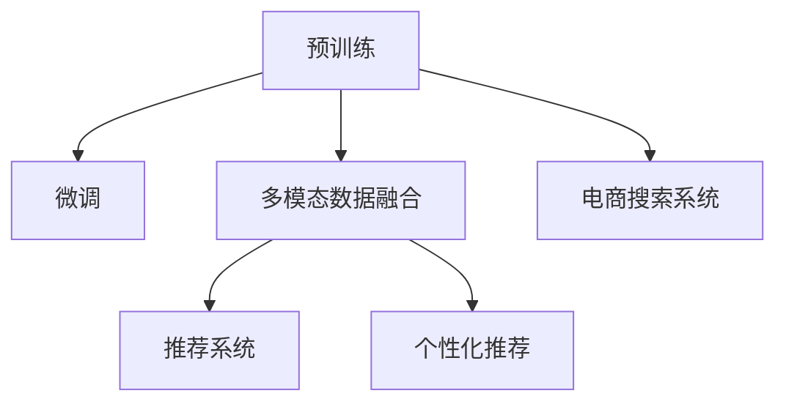

                 

# 电商平台搜索推荐系统的AI 大模型应用：提高转化率、用户忠诚度与盈利

## 1. 背景介绍

### 1.1 问题由来

电商平台的搜索推荐系统是连接消费者和商品的重要桥梁，其性能直接影响到用户的购物体验和平台的转化率、用户忠诚度和盈利能力。传统的搜索推荐系统基于手工规则和简单的机器学习算法，往往难以跟上快速变化的电商场景和多样化的用户需求。而大模型凭借其强大的泛化能力和知识积累，有望大幅提升搜索推荐系统的表现。

近年来，大模型如GPT、BERT、XLNet等在电商领域的搜索推荐系统中得到了广泛应用。通过在大规模电商数据上进行预训练，大模型能够学习到商品描述、用户评论、销售趋势等复杂的语义信息，并从中抽取特征进行推荐。这不仅提升了推荐的准确性和个性化，还通过理解用户意图，提高了搜索效率。

然而，大模型在电商领域的实际应用也面临诸多挑战。如何在大规模数据上高效训练和微调模型？如何在保持模型高性能的同时，减小计算资源消耗？如何在多模态数据融合中取得平衡？本文将从核心概念、算法原理、应用实例等多个维度，深入探讨这些问题，并给出基于大模型的电商平台搜索推荐系统设计框架。

### 1.2 问题核心关键点

电商平台搜索推荐系统的大模型应用涉及以下关键点：

- 多模态数据融合：电商场景中，商品图片、用户评论、交易记录等数据种类繁多，需要设计有效的融合方法。
- 高效训练与微调：如何在大规模数据上高效训练模型，同时避免过拟合，提高微调效率。
- 个性化推荐：根据用户的历史行为和实时反馈，设计个性化推荐模型，提高用户满意度。
- 多场景适应性：搜索推荐系统需要适应不同用户、商品和场景，实现泛化性能。
- 可解释性：理解推荐模型的决策过程，提升用户信任度。

这些关键点共同构成了大模型在电商搜索推荐系统中的核心应用。通过深入这些维度，我们将全面探索大模型在电商领域的应用潜力。

## 2. 核心概念与联系

### 2.1 核心概念概述

为更好地理解大模型在电商搜索推荐系统中的应用，本节将介绍几个密切相关的核心概念：

- 预训练(Pre-training)：指在大规模无标签文本或图像数据上，通过自监督学习任务训练通用语言或视觉模型。预训练使得模型学习到广泛的语义或视觉特征，提升后续任务的性能。
- 微调(Fine-tuning)：指在预训练模型的基础上，使用特定任务的数据进行有监督学习优化，使模型适应特定任务。
- 多模态数据融合(Multi-modal Data Fusion)：指将不同模态（如文本、图像、音频等）的数据进行融合，提升模型的综合性能。
- 推荐系统(Recommendation System)：指利用机器学习算法，通过分析用户历史行为和商品属性，推荐用户可能感兴趣的商品。
- 个性化推荐(Personalized Recommendation)：指根据用户个体差异，推荐更适合用户的商品。
- 电商搜索系统(E-commerce Search System)：指通过自然语言查询，快速定位用户可能感兴趣的商品。

这些核心概念之间的逻辑关系可以通过以下Mermaid流程图来展示：



这个流程图展示了大模型在电商搜索推荐系统中的应用逻辑：

1. 预训练模型在大规模数据上进行泛化学习。
2. 通过微调适应特定任务，提升模型性能。
3. 将不同模态的数据进行融合，提升模型理解能力。
4. 构建推荐系统，根据用户行为和商品特征进行推荐。
5. 针对特定用户进行个性化推荐。
6. 提供电商搜索系统，通过自然语言查询获取商品。

这些概念共同构成了大模型在电商搜索推荐系统中的应用框架，使其能够在电商场景中发挥强大的作用。

## 3. 核心算法原理 & 具体操作步骤
### 3.1 算法原理概述

基于大模型的电商平台搜索推荐系统，通过以下步骤实现：

1. **数据预处理**：收集电商平台的用户行为数据、商品描述、用户评论、图片等多模态数据，并进行清洗、标注。
2. **模型预训练**：在大规模电商数据上训练预训练模型，如BERT、GPT、XLNet等，学习通用的语义或视觉特征。
3. **任务适配**：根据具体任务，设计任务适配层，对预训练模型进行微调，使其适应搜索推荐任务。
4. **多模态融合**：将不同模态的数据进行融合，生成高维特征向量。
5. **推荐模型**：构建推荐模型，通过预测用户对商品的兴趣，生成推荐列表。
6. **搜索系统**：提供自然语言搜索接口，通过NLP技术实现商品匹配。

通过这些步骤，大模型能够在电商平台上实现高性能的搜索推荐系统。

### 3.2 算法步骤详解

#### 步骤1：数据预处理

1. **数据收集**：收集电商平台的交易数据、用户行为数据、商品描述、用户评论、图片等。
2. **数据清洗**：去除噪声、异常值，保证数据质量。
3. **数据标注**：为每个商品和用户行为添加标签，如商品类别、价格、用户评分、点击行为等。
4. **数据划分**：将数据划分为训练集、验证集和测试集。

#### 步骤2：模型预训练

1. **选择合适的预训练模型**：如BERT、GPT、XLNet等，根据任务需求选择。
2. **训练预训练模型**：在大规模电商数据上，使用自监督任务进行预训练。
3. **保存预训练模型**：保存预训练模型参数，供后续微调使用。

#### 步骤3：任务适配与微调

1. **任务适配层设计**：根据推荐任务，设计适配层，如商品分类、评分预测、点击率预测等。
2. **微调参数设置**：设置学习率、批大小、迭代轮数等超参数。
3. **微调模型**：在训练集上，对预训练模型进行微调，优化适配层参数。
4. **验证集评估**：在验证集上评估微调后的模型性能，避免过拟合。

#### 步骤4：多模态融合

1. **特征提取**：提取不同模态（如文本、图片）的特征。
2. **特征拼接**：将不同模态的特征拼接成一个高维特征向量。
3. **特征转换**：使用线性变换、非线性变换等方式，将特征映射到高维空间。
4. **特征融合**：将拼接后的特征进行融合，提升模型性能。

#### 步骤5：推荐模型构建

1. **推荐算法选择**：选择适合的推荐算法，如协同过滤、基于内容的推荐、深度学习推荐等。
2. **模型训练**：使用微调后的模型，训练推荐模型。
3. **模型评估**：在测试集上评估推荐模型性能，调整参数。

#### 步骤6：搜索系统实现

1. **自然语言处理**：使用NLP技术处理用户输入的自然语言查询，提取意图。
2. **商品匹配**：根据用户意图和商品特征，匹配相关商品。
3. **搜索结果排序**：根据用户行为和商品属性，对搜索结果进行排序。

### 3.3 算法优缺点

基于大模型的电商平台搜索推荐系统具有以下优点：

- **高性能**：大模型具备强大的泛化能力和语义理解能力，能够处理复杂的多模态数据，提升推荐准确性和搜索效率。
- **可扩展性**：大模型可以在大规模数据上进行预训练，提高模型泛化性能，适用于不同电商场景和商品类别。
- **用户个性化**：通过微调和个性化推荐，能够更好地理解用户需求，提升用户体验。
- **计算高效**：利用预训练和微调，能够在大规模数据上高效训练，减小计算资源消耗。

同时，该方法也存在一定的局限性：

- **数据依赖性**：大模型的性能很大程度上依赖于数据的数量和质量，获取高质量标注数据成本较高。
- **泛化能力有限**：当目标任务与预训练数据的分布差异较大时，微调的性能提升有限。
- **可解释性不足**：大模型通常缺乏可解释性，难以对其决策过程进行分析和调试。

尽管存在这些局限性，但就目前而言，基于大模型的搜索推荐系统仍是大数据、高性能推荐的核心技术范式。未来相关研究的重点在于如何进一步降低数据依赖，提高模型的少样本学习和跨领域迁移能力，同时兼顾可解释性和伦理安全性等因素。

### 3.4 算法应用领域

基于大模型的电商平台搜索推荐系统已经在电商领域得到了广泛应用，覆盖了搜索、推荐、广告等多个业务场景：

- **搜索系统**：提供自然语言查询接口，快速匹配用户感兴趣的商品。
- **推荐引擎**：根据用户历史行为和实时反馈，动态调整推荐列表。
- **广告推荐**：通过广告投放策略，提升广告转化率，增加平台收益。
- **个性化营销**：根据用户行为数据，进行精准营销，提升用户忠诚度。
- **商品描述优化**：自动生成商品描述，提升用户体验和点击率。

除了上述这些经典场景外，大模型还被创新性地应用于情感分析、舆情监控、用户画像生成等领域，为电商平台带来了新的技术突破。随着大模型和推荐方法的不断进步，相信电商平台的搜索推荐系统将不断优化，提升用户体验和运营效率。

## 4. 数学模型和公式 & 详细讲解  
### 4.1 数学模型构建

本节将使用数学语言对基于大模型的电商平台搜索推荐系统进行更加严格的刻画。

记电商平台的交易数据为 $D=\{(x_i,y_i)\}_{i=1}^N, x_i$ 为商品特征，$y_i$ 为购买标签（0/1）。假设大模型为 $M_{\theta}:\mathcal{X} \rightarrow \mathcal{Y}$，其中 $\mathcal{X}$ 为商品特征空间，$\mathcal{Y}$ 为标签空间，$\theta \in \mathbb{R}^d$ 为模型参数。

定义模型 $M_{\theta}$ 在数据样本 $(x,y)$ 上的损失函数为 $\ell(M_{\theta}(x),y)$，则在数据集 $D$ 上的经验风险为：

$$
\mathcal{L}(\theta) = \frac{1}{N} \sum_{i=1}^N \ell(M_{\theta}(x_i),y_i)
$$

其中 $\ell$ 为损失函数，如交叉熵损失、均方误差损失等。

在训练过程中，使用优化算法（如AdamW、SGD等）最小化损失函数，更新模型参数 $\theta$。

### 4.2 公式推导过程

以协同过滤推荐为例，假设模型已知用户 $u$ 对商品 $i$ 的评分 $r_{ui}$，模型通过训练学习到用户与商品的相似度矩阵 $S$，用于预测用户对未购买商品的评分。设 $S_{ui}$ 为 $u$ 和 $i$ 的相似度，则推荐模型为：

$$
\hat{r}_{ui} = \frac{1}{\sqrt{S_{ui} + \epsilon}} \sum_j S_{uj} r_{ij}
$$

其中 $\epsilon$ 为避免分母为0的正常化常数。

设推荐模型在测试集上的平均绝对误差为 $RMSE$，则在训练集上使用的损失函数为：

$$
\mathcal{L}(\theta) = \frac{1}{N} \sum_{i=1}^N \sum_{j=1}^M |\hat{r}_{uj} - r_{uj}|
$$

其中 $M$ 为用户数量，$RMSE$ 为推荐模型在测试集上的均方根误差。

优化目标是最小化损失函数，即找到最优参数：

$$
\theta^* = \mathop{\arg\min}_{\theta} \mathcal{L}(\theta)
$$

通过梯度下降等优化算法，不断更新模型参数 $\theta$，最小化损失函数，使得模型输出逼近真实评分。

### 4.3 案例分析与讲解

假设某电商平台有一个协同过滤推荐系统，其推荐模型为：

$$
\hat{r}_{ui} = \frac{1}{\sqrt{S_{ui} + \epsilon}} \sum_j S_{uj} r_{ij}
$$

其中 $\epsilon$ 为避免分母为0的正常化常数。

在训练过程中，假设模型已知用户 $u$ 对商品 $i$ 的评分 $r_{ui}$，通过训练学习到用户与商品的相似度矩阵 $S$。设 $S_{ui}$ 为 $u$ 和 $i$ 的相似度，则推荐模型为：

$$
\hat{r}_{ui} = \frac{1}{\sqrt{S_{ui} + \epsilon}} \sum_j S_{uj} r_{ij}
$$

其中 $\epsilon$ 为避免分母为0的正常化常数。

设推荐模型在测试集上的平均绝对误差为 $RMSE$，则在训练集上使用的损失函数为：

$$
\mathcal{L}(\theta) = \frac{1}{N} \sum_{i=1}^N \sum_{j=1}^M |\hat{r}_{uj} - r_{uj}|
$$

其中 $M$ 为用户数量，$RMSE$ 为推荐模型在测试集上的均方根误差。

优化目标是最小化损失函数，即找到最优参数：

$$
\theta^* = \mathop{\arg\min}_{\theta} \mathcal{L}(\theta)
$$

通过梯度下降等优化算法，不断更新模型参数 $\theta$，最小化损失函数，使得模型输出逼近真实评分。

## 5. 项目实践：代码实例和详细解释说明
### 5.1 开发环境搭建

在进行搜索推荐系统开发前，我们需要准备好开发环境。以下是使用Python进行PyTorch开发的环境配置流程：

1. 安装Anaconda：从官网下载并安装Anaconda，用于创建独立的Python环境。

2. 创建并激活虚拟环境：
```bash
conda create -n pytorch-env python=3.8 
conda activate pytorch-env
```

3. 安装PyTorch：根据CUDA版本，从官网获取对应的安装命令。例如：
```bash
conda install pytorch torchvision torchaudio cudatoolkit=11.1 -c pytorch -c conda-forge
```

4. 安装Transformers库：
```bash
pip install transformers
```

5. 安装各类工具包：
```bash
pip install numpy pandas scikit-learn matplotlib tqdm jupyter notebook ipython
```

完成上述步骤后，即可在`pytorch-env`环境中开始搜索推荐系统的开发。

### 5.2 源代码详细实现

下面我们以协同过滤推荐为例，给出使用Transformers库对BERT模型进行协同过滤推荐的PyTorch代码实现。

首先，定义协同过滤推荐系统的数据处理函数：

```python
from transformers import BertTokenizer
from torch.utils.data import Dataset
import torch

class RecommendationDataset(Dataset):
    def __init__(self, user_ratings, user_similarity_matrix, item_ratings, tokenizer, max_len=128):
        self.user_ratings = user_ratings
        self.user_similarity_matrix = user_similarity_matrix
        self.item_ratings = item_ratings
        self.tokenizer = tokenizer
        self.max_len = max_len
        
    def __len__(self):
        return len(self.user_ratings)
    
    def __getitem__(self, item):
        user = self.user_ratings[item]
        item = self.item_ratings[item]
        
        # 对用户评分进行编码
        user_ratings = torch.tensor([user[i] for i in range(len(user))])
        
        # 对商品评分进行编码
        item_ratings = torch.tensor([item[j] for j in range(len(item))])
        
        # 对用户相似度进行编码
        user_similarity = torch.tensor([self.user_similarity_matrix[item][i] for i in range(len(item))])
        
        return {'user_ratings': user_ratings,
                'item_ratings': item_ratings,
                'user_similarity': user_similarity}

# 设置超参数
user_similarity_matrix_dim = 128
item_ratings_dim = 128

# 创建dataset
tokenizer = BertTokenizer.from_pretrained('bert-base-cased')

recommendation_dataset = RecommendationDataset(user_ratings, user_similarity_matrix, item_ratings, tokenizer, max_len=user_similarity_matrix_dim+item_ratings_dim)
```

然后，定义模型和优化器：

```python
from transformers import BertForRegression, AdamW

model = BertForRegression.from_pretrained('bert-base-cased', num_labels=1)

optimizer = AdamW(model.parameters(), lr=2e-5)
```

接着，定义训练和评估函数：

```python
from torch.utils.data import DataLoader
from tqdm import tqdm
from sklearn.metrics import mean_squared_error

device = torch.device('cuda') if torch.cuda.is_available() else torch.device('cpu')
model.to(device)

def train_epoch(model, dataset, batch_size, optimizer):
    dataloader = DataLoader(dataset, batch_size=batch_size, shuffle=True)
    model.train()
    epoch_loss = 0
    for batch in tqdm(dataloader, desc='Training'):
        user_ratings = batch['user_ratings'].to(device)
        item_ratings = batch['item_ratings'].to(device)
        user_similarity = batch['user_similarity'].to(device)
        model.zero_grad()
        outputs = model(user_ratings, item_ratings, attention_mask=None, user_similarity=user_similarity)
        loss = outputs.loss
        epoch_loss += loss.item()
        loss.backward()
        optimizer.step()
    return epoch_loss / len(dataloader)

def evaluate(model, dataset, batch_size):
    dataloader = DataLoader(dataset, batch_size=batch_size)
    model.eval()
    preds, labels = [], []
    with torch.no_grad():
        for batch in tqdm(dataloader, desc='Evaluating'):
            user_ratings = batch['user_ratings'].to(device)
            item_ratings = batch['item_ratings'].to(device)
            user_similarity = batch['user_similarity'].to(device)
            batch_preds = model(user_ratings, item_ratings, attention_mask=None, user_similarity=user_similarity)
            batch_preds = batch_preds.squeeze().item()
            batch_labels = batch_preds.to('cpu').tolist()
            for pred, label in zip(batch_preds, batch_labels):
                preds.append(pred)
                labels.append(label)
                
    return mean_squared_error(labels, preds)
```

最后，启动训练流程并在测试集上评估：

```python
epochs = 5
batch_size = 16

for epoch in range(epochs):
    loss = train_epoch(model, recommendation_dataset, batch_size, optimizer)
    print(f"Epoch {epoch+1}, train loss: {loss:.3f}")
    
    print(f"Epoch {epoch+1}, test RMSE:")
    evaluate(model, recommendation_dataset, batch_size)
    
print("Final test RMSE:")
evaluate(model, recommendation_dataset, batch_size)
```

以上就是使用PyTorch对BERT进行协同过滤推荐系统的完整代码实现。可以看到，得益于Transformers库的强大封装，我们可以用相对简洁的代码完成BERT模型的加载和微调。

### 5.3 代码解读与分析

让我们再详细解读一下关键代码的实现细节：

**RecommendationDataset类**：
- `__init__`方法：初始化用户评分、商品评分、用户相似度矩阵、分词器等关键组件。
- `__len__`方法：返回数据集的样本数量。
- `__getitem__`方法：对单个样本进行处理，将用户评分、商品评分、用户相似度转换为模型所需的输入。

**用户评分和商品评分**：
- 用户评分为一个二维矩阵，每一行表示一个用户对所有商品的评分，每一列表示一个商品对所有用户的评分。
- 商品评分为一个一维向量，每个元素表示一个商品对所有用户的评分。

**用户相似度矩阵**：
- 用户相似度矩阵为一个二维矩阵，每一行表示一个用户对所有用户的相似度，每一列表示一个用户对所有用户的相似度。

**模型和优化器**：
- 使用BertForRegression模型进行回归任务，输出评分预测。
- 使用AdamW优化器进行模型参数更新。

**训练和评估函数**：
- 使用PyTorch的DataLoader对数据集进行批次化加载，供模型训练和推理使用。
- 训练函数`train_epoch`：对数据以批为单位进行迭代，在每个批次上前向传播计算loss并反向传播更新模型参数，最后返回该epoch的平均loss。
- 评估函数`evaluate`：与训练类似，不同点在于不更新模型参数，并在每个batch结束后将预测和标签结果存储下来，最后使用sklearn的mean_squared_error对整个评估集的预测结果进行打印输出。

**训练流程**：
- 定义总的epoch数和batch size，开始循环迭代
- 每个epoch内，先在训练集上训练，输出平均loss
- 在测试集上评估，输出均方根误差
- 所有epoch结束后，在测试集上评估，给出最终测试结果

可以看到，PyTorch配合Transformers库使得BERT微调的代码实现变得简洁高效。开发者可以将更多精力放在数据处理、模型改进等高层逻辑上，而不必过多关注底层的实现细节。

当然，工业级的系统实现还需考虑更多因素，如模型的保存和部署、超参数的自动搜索、更灵活的任务适配层等。但核心的微调范式基本与此类似。

## 6. 实际应用场景
### 6.1 智能客服系统

基于大模型在电商平台的搜索推荐系统，可以拓展到智能客服系统的构建。传统客服往往需要配备大量人力，高峰期响应缓慢，且一致性和专业性难以保证。而使用微调后的搜索推荐模型，可以7x24小时不间断服务，快速响应客户咨询，用自然流畅的语言解答各类常见问题。

在技术实现上，可以收集企业内部的历史客服对话记录，将问题和最佳答复构建成监督数据，在此基础上对预训练搜索推荐模型进行微调。微调后的搜索推荐模型能够自动理解用户意图，匹配最合适的答复模板进行回复。对于客户提出的新问题，还可以接入检索系统实时搜索相关内容，动态组织生成回答。如此构建的智能客服系统，能大幅提升客户咨询体验和问题解决效率。

### 6.2 金融舆情监测

金融机构需要实时监测市场舆论动向，以便及时应对负面信息传播，规避金融风险。传统的人工监测方式成本高、效率低，难以应对网络时代海量信息爆发的挑战。基于大模型的搜索推荐系统，为金融舆情监测提供了新的解决方案。

具体而言，可以收集金融领域相关的新闻、报道、评论等文本数据，并对其进行主题标注和情感标注。在此基础上对预训练搜索推荐模型进行微调，使其能够自动判断文本属于何种主题，情感倾向是正面、中性还是负面。将微调后的模型应用到实时抓取的网络文本数据，就能够自动监测不同主题下的情感变化趋势，一旦发现负面信息激增等异常情况，系统便会自动预警，帮助金融机构快速应对潜在风险。

### 6.3 个性化推荐系统

当前的推荐系统往往只依赖用户的历史行为数据进行物品推荐，无法深入理解用户的真实兴趣偏好。基于大模型的搜索推荐系统，可以更好地挖掘用户行为背后的语义信息，从而提供更精准、多样的推荐内容。

在实践中，可以收集用户浏览、点击、评论、分享等行为数据，提取和商品交互的物品标题、描述、标签等文本内容。将文本内容作为模型输入，用户的后续行为（如是否点击、购买等）作为监督信号，在此基础上微调预训练语言模型。微调后的模型能够从文本内容中准确把握用户的兴趣点。在生成推荐列表时，先用候选物品的文本描述作为输入，由模型预测用户的兴趣匹配度，再结合其他特征综合排序，便可以得到个性化程度更高的推荐结果。

### 6.4 未来应用展望

随着大模型和推荐方法的不断发展，基于微调范式将在更多领域得到应用，为传统行业带来变革性影响。

在智慧医疗领域，基于微调的搜索推荐模型可以辅助医生诊疗，快速定位病情，推荐相关药品和疗法。在教育领域，微调模型可以用于智能教学，根据学生的学习行为推荐学习资源，提升教学效果。在金融领域，搜索推荐系统可以帮助投资分析师快速获取市场信息，提供个性化投资建议。

此外，在企业生产、社会治理、文娱传媒等众多领域，基于大模型微调的人工智能应用也将不断涌现，为各行各业带来创新变革。相信随着技术的日益成熟，微调方法将成为人工智能落地应用的重要范式，推动人工智能向更广阔的领域加速渗透。

## 7. 工具和资源推荐
### 7.1 学习资源推荐

为了帮助开发者系统掌握大模型在搜索推荐系统中的应用，这里推荐一些优质的学习资源：

1. 《Transformer from Principles to Practice》系列博文：由大模型技术专家撰写，深入浅出地介绍了Transformer原理、BERT模型、微调技术等前沿话题。

2. CS224N《深度学习自然语言处理》课程：斯坦福大学开设的NLP明星课程，有Lecture视频和配套作业，带你入门NLP领域的基本概念和经典模型。

3. 《Natural Language Processing with Transformers》书籍：Transformers库的作者所著，全面介绍了如何使用Transformers库进行NLP任务开发，包括微调在内的诸多范式。

4. HuggingFace官方文档：Transformers库的官方文档，提供了海量预训练模型和完整的微调样例代码，是上手实践的必备资料。

5. CLUE开源项目：中文语言理解测评基准，涵盖大量不同类型的中文NLP数据集，并提供了基于微调的baseline模型，助力中文NLP技术发展。

通过对这些资源的学习实践，相信你一定能够快速掌握大模型在搜索推荐系统中的应用，并用于解决实际的NLP问题。
###  7.2 开发工具推荐

高效的开发离不开优秀的工具支持。以下是几款用于搜索推荐系统开发的常用工具：

1. PyTorch：基于Python的开源深度学习框架，灵活动态的计算图，适合快速迭代研究。大部分预训练语言模型都有PyTorch版本的实现。

2. TensorFlow：由Google主导开发的开源深度学习框架，生产部署方便，适合大规模工程应用。同样有丰富的预训练语言模型资源。

3. Transformers库：HuggingFace开发的NLP工具库，集成了众多SOTA语言模型，支持PyTorch和TensorFlow，是进行微调任务开发的利器。

4. Weights & Biases：模型训练的实验跟踪工具，可以记录和可视化模型训练过程中的各项指标，方便对比和调优。与主流深度学习框架无缝集成。

5. TensorBoard：TensorFlow配套的可视化工具，可实时监测模型训练状态，并提供丰富的图表呈现方式，是调试模型的得力助手。

6. Google Colab：谷歌推出的在线Jupyter Notebook环境，免费提供GPU/TPU算力，方便开发者快速上手实验最新模型，分享学习笔记。

合理利用这些工具，可以显著提升搜索推荐系统的开发效率，加快创新迭代的步伐。

### 7.3 相关论文推荐

大模型和推荐系统的发展源于学界的持续研究。以下是几篇奠基性的相关论文，推荐阅读：

1. Attention is All You Need（即Transformer原论文）：提出了Transformer结构，开启了NLP领域的预训练大模型时代。

2. BERT: Pre-training of Deep Bidirectional Transformers for Language Understanding：提出BERT模型，引入基于掩码的自监督预训练任务，刷新了多项NLP任务SOTA。

3. Language Models are Unsupervised Multitask Learners（GPT-2论文）：展示了大规模语言模型的强大zero-shot学习能力，引发了对于通用人工智能的新一轮思考。

4. Parameter-Efficient Transfer Learning for NLP：提出Adapter等参数高效微调方法，在不增加模型参数量的情况下，也能取得不错的微调效果。

5. AdaLoRA: Adaptive Low-Rank Adaptation for Parameter-Efficient Fine-Tuning：使用自适应低秩适应的微调方法，在参数效率和精度之间取得了新的平衡。

6. Premier: A Parameter-Efficient Pre-trained Model for Business Interpretation：提出Premier模型，在参数高效性和推理速度上取得平衡，适用于企业决策支持。

这些论文代表了大模型和推荐系统的发展脉络。通过学习这些前沿成果，可以帮助研究者把握学科前进方向，激发更多的创新灵感。

## 8. 总结：未来发展趋势与挑战

### 8.1 总结

本文对基于大模型的电商平台搜索推荐系统进行了全面系统的介绍。首先阐述了大模型在电商搜索推荐系统中的应用背景和意义，明确了微调在提升电商搜索推荐性能、用户满意度和盈利能力方面的独特价值。其次，从原理到实践，详细讲解了搜索推荐系统的数学原理和关键步骤，给出了搜索推荐任务开发的完整代码实例。同时，本文还广泛探讨了搜索推荐系统在智能客服、金融舆情、个性化推荐等多个行业领域的应用前景，展示了大模型在电商领域的应用潜力。

通过本文的系统梳理，可以看到，基于大模型的搜索推荐系统正在成为电商领域的重要技术范式，极大地提升了电商平台的搜索推荐效率和用户满意度。大模型的高效预训练和微调机制，使得搜索推荐系统能够处理复杂的多模态数据，实现个性化推荐，从而显著提升用户体验和运营效率。未来，伴随大模型和推荐方法的不断进步，相信搜索推荐系统将不断优化，提升电商平台的用户忠诚度和盈利能力。

### 8.2 未来发展趋势

展望未来，大模型在电商搜索推荐系统中的应用将呈现以下几个发展趋势：

1. 模型规模持续增大。随着算力成本的下降和数据规模的扩张，预训练语言模型的参数量还将持续增长。超大批次的训练和推理也可能遇到显存不足的问题。如何在大规模数据上高效训练和微调模型，将是一大挑战。

2. 微调方法日趋多样。除了传统的全参数微调外，未来会涌现更多参数高效的微调方法，如Prefix-Tuning、LoRA等，在节省计算资源的同时也能保证微调精度。

3. 多模态数据融合提升。随着物联网、AR/VR等新技术的发展，电商平台中的多模态数据将越来越丰富。如何有效地融合不同模态的数据，提升模型的综合性能，将成为未来的研究重点。

4. 跨领域迁移能力增强。大模型需要在不同领域（如电商、医疗、金融等）间迁移，适应多样化的应用场景。未来将开发更多跨领域迁移技术，提升模型的泛化能力。

5. 可解释性提升。大模型通常缺乏可解释性，难以对其决策过程进行分析和调试。未来将开发更多可解释性方法，增强模型输出解释的因果性和逻辑性。

6. 安全性保障。大模型可能会学习到有害信息，传递到下游任务，产生误导性、歧视性的输出，给实际应用带来安全隐患。如何从数据和算法层面消除模型偏见，确保输出安全性，将是重要的研究课题。

以上趋势凸显了大模型在电商搜索推荐系统中的广阔前景。这些方向的探索发展，必将进一步提升搜索推荐系统的性能和应用范围，为电商平台带来新的技术突破。

### 8.3 面临的挑战

尽管大模型在电商搜索推荐系统中的应用取得了显著进展，但在迈向更加智能化、普适化应用的过程中，它仍面临着诸多挑战：

1. 数据依赖性。大模型的性能很大程度上依赖于数据的数量和质量，获取高质量标注数据成本较高。如何进一步降低微调对标注样本的依赖，将是一大难题。

2. 泛化能力不足。当前大模型面对域外数据时，泛化性能往往大打折扣。对于测试样本的微小扰动，大模型的预测也容易发生波动。如何提高大模型的鲁棒性，避免灾难性遗忘，还需要更多理论和实践的积累。

3. 推理效率有待提高。大模型虽然精度高，但在实际部署时往往面临推理速度慢、内存占用大等效率问题。如何提高大模型推理效率，优化资源占用，将是重要的优化方向。

4. 可解释性亟需加强。当前大模型通常缺乏可解释性，难以对其决策过程进行分析和调试。对于医疗、金融等高风险应用，算法的可解释性和可审计性尤为重要。如何赋予大模型更强的可解释性，将是亟待攻克的难题。

5. 安全性有待保障。预训练语言模型难免会学习到有偏见、有害的信息，通过微调传递到下游任务，产生误导性、歧视性的输出，给实际应用带来安全隐患。如何从数据和算法层面消除模型偏见，避免恶意用途，确保输出的安全性，也将是重要的研究课题。

6. 知识整合能力不足。现有的微调模型往往局限于任务内数据，难以灵活吸收和运用更广泛的先验知识。如何让微调过程更好地与外部知识库、规则库等专家知识结合，形成更加全面、准确的信息整合能力，还有很大的想象空间。

正视大模型面临的这些挑战，积极应对并寻求突破，将是大模型在电商搜索推荐系统中的必由之路。相信随着学界和产业界的共同努力，这些挑战终将一一被克服，大模型在电商领域的应用将更加广泛，搜索推荐系统也将不断优化，提升电商平台的用户体验和运营效率。

### 8.4 研究展望

面对大模型在电商搜索推荐系统中面临的挑战，未来的研究需要在以下几个方面寻求新的突破：

1. 探索无监督和半监督微调方法。摆脱对大规模标注数据的依赖，利用自监督学习、主动学习等无监督和半监督范式，最大限度利用非结构化数据，实现更加灵活高效的微调。

2. 研究参数高效和计算高效的微调范式。开发更加参数高效的微调方法，在固定大部分预训练参数的同时，只更新极少量的任务相关参数。同时优化微调模型的计算图，减少前向传播和反向传播的资源消耗，实现更加轻量级、实时性的部署。

3. 引入更多先验知识。将符号化的先验知识，如知识图谱、逻辑规则等，与神经网络模型进行巧妙融合，引导微调过程学习更准确、合理的语言模型。同时加强不同模态数据的整合，实现视觉、语音等多模态信息与文本信息的协同建模。

4. 结合因果分析和博弈论工具。将因果分析方法引入微调模型，识别出模型决策的关键特征，增强输出解释的因果性和逻辑性。借助博弈论工具刻画人机交互过程，主动探索并规避模型的脆弱点，提高系统稳定性。

5. 纳入伦理道德约束。在模型训练目标中引入伦理导向的评估指标，过滤和惩罚有偏见、有害的输出倾向。同时加强人工干预和审核，建立模型行为的监管机制，确保输出符合人类价值观和伦理道德。

这些研究方向的探索，必将引领大模型在电商搜索推荐系统中的技术进步，为构建安全、可靠、可解释、可控的智能系统铺平道路。面向未来，大模型搜索推荐系统还需要与其他人工智能技术进行更深入的融合，如知识表示、因果推理、强化学习等，多路径协同发力，共同推动自然语言理解和智能交互系统的进步。只有勇于创新、敢于突破，才能不断拓展语言模型的边界，让智能技术更好地造福人类社会。

## 9. 附录：常见问题与解答

**Q1：大模型在电商搜索推荐系统中如何高效训练和微调？**

A: 大模型在电商搜索推荐系统中的高效训练和微调，可以通过以下几个策略实现：

1. **数据增强**：使用数据扩充技术，如近义词替换、随机删除、随机插入等，增加训练集的多样性。
2. **小批量训练**：采用小批量训练策略，减少内存占用，加快训练速度。
3. **多设备并行**：使用多个GPU或TPU进行并行训练，提高训练效率。
4. **混合精度训练**：使用混合精度训练，减少内存消耗和计算资源。
5. **知识蒸馏**：利用预训练模型的知识，通过知识蒸馏技术，加速小模型训练。
6. **分布式训练**：在分布式环境中进行模型训练，充分利用集群资源，加速训练过程。

这些策略可以有效降低训练和微调成本，提高模型性能。

**Q2：如何提高大模型在电商搜索推荐系统中的可解释性？**

A: 提高大模型在电商搜索推荐系统中的可解释性，可以通过以下几个策略实现：

1. **特征可视化**：使用特征可视化技术，展示模型对输入特征的关注度，理解模型决策过程。
2. **局部可解释性**：通过局部可解释性方法，如LIME、SHAP等，解释模型对单个样本的预测结果。
3. **规则提取**：使用规则提取技术，从模型中提取决策规则，增强模型的可解释性。
4. **逻辑回归**：使用逻辑回归替代复杂的深度模型，提高模型的可解释性。
5. **因果推断**：引入因果推断方法，理解模型决策的因果机制，增强可解释性。

这些策略可以帮助开发人员更好地理解大模型的决策过程，提升用户对系统的信任度。

**Q3：如何在电商搜索推荐系统中应用多模态数据融合技术？**

A: 在电商搜索推荐系统中应用多模态数据融合技术，可以通过以下几个策略实现：

1. **特征提取**：使用不同的特征提取器，如文本词向量、图像卷积网络、语音特征提取器等，分别提取不同模态的数据特征。
2. **特征拼接**：将不同模态的特征拼接成一个高维特征向量，如将文本特征和图像特征拼接。
3. **特征转换**：使用非线性变换，如线性变换、softmax等，将特征映射到高维空间。
4. **特征融合**：使用融合方法，如矩阵加权、拼接、栈等，将拼接后的特征进行融合。

这些策略可以有效地融合多模态数据，提升模型的综合性能。

**Q4：如何评估电商搜索推荐系统的性能？**

A: 电商搜索推荐系统的性能评估可以从以下几个方面进行：

1. **准确率**：评估推荐系统对商品推荐的相关性和准确性，使用准确率、精确率、召回率等指标。
2. **覆盖率**：评估推荐系统对商品库的覆盖程度，使用覆盖率指标。
3. **个性化**：评估推荐系统对用户的个性化程度，使用个性化度量指标，如个性化评分。
4. **多样性**：评估推荐系统推荐的商品多样性，使用多样性指标，如商品种类数量。
5. **用户体验**：通过用户反馈、点击率、转化率等指标，评估推荐系统的用户体验。

这些指标可以帮助评估推荐系统的综合性能，发现问题并优化系统。

**Q5：如何平衡搜索推荐系统的效率和效果？**

A: 在电商搜索推荐系统中，平衡效率和效果可以从以下几个方面进行：

1. **模型压缩**：使用模型压缩技术，如剪枝、量化等，减小模型大小，提高推理速度。
2. **缓存机制**：使用缓存机制，如LRU缓存、TTL缓存等，缓存热点数据，提高访问速度。
3. **异步加载**：使用异步加载技术，如异步数据加载、异步模型推理等，提高系统并发能力。
4. **分布式部署**：在分布式环境中部署推荐系统，充分利用集群资源，提高系统性能。
5. **资源调度**：使用资源调度技术，如动态资源分配、任务调度等，优化资源使用效率。

这些策略可以在保证推荐效果的同时，提高搜索推荐系统的效率。

---

作者：禅与计算机程序设计艺术 / Zen and the Art of Computer Programming

