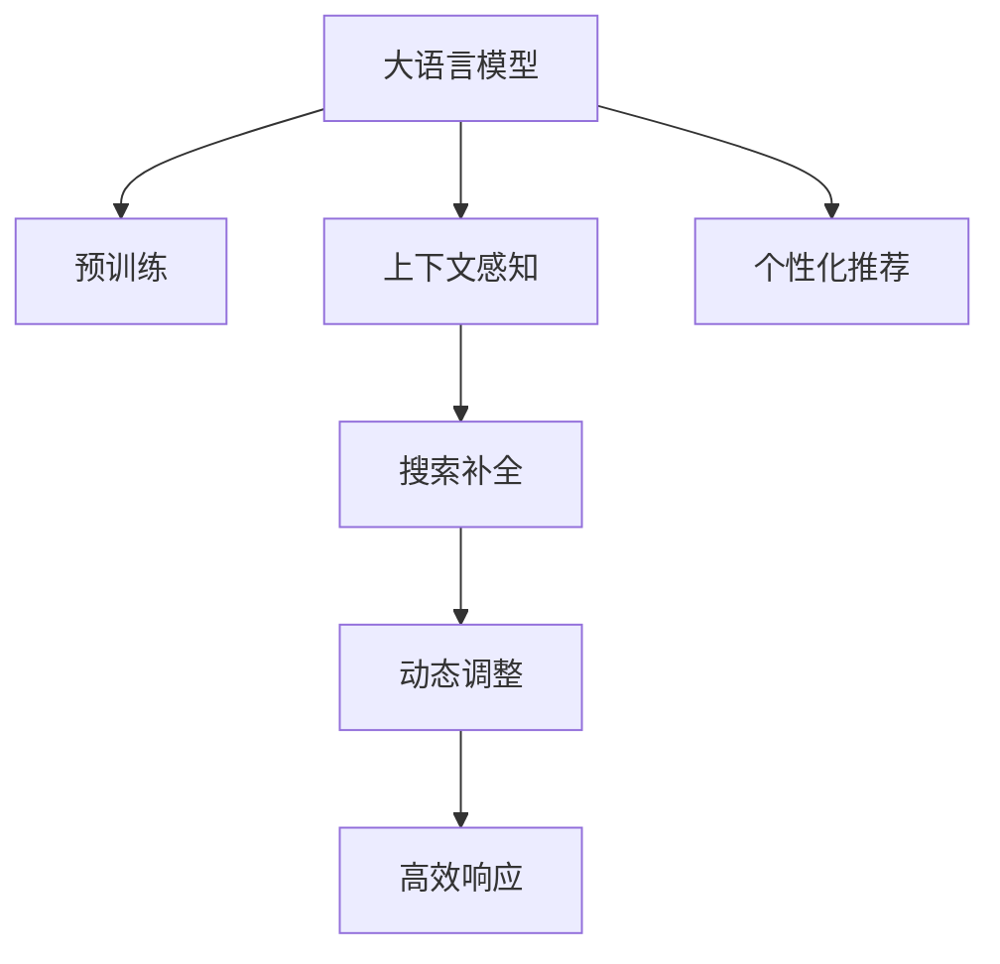

                 

# 电商平台搜索自动补全：AI大模型的上下文感知与个性化

> 关键词：电商平台,搜索,自动补全,上下文感知,大模型,个性化

## 1. 背景介绍

### 1.1 问题由来

在现代电商平台上，搜索功能是用户获取商品信息的主要途径。通过高效精准的搜索，用户能够在海量的商品中快速找到需要的商品，提升购物体验。但随着商品种类的不断增加，用户输入的搜索关键词变得更加复杂，搜索结果的准确性也面临挑战。因此，电商平台亟需引入先进的搜索补全技术，提升搜索精准度，减少用户输入负担，缩短购物时间。

传统的搜索补全算法大多基于规则和词典，依赖词频统计和正则匹配，难以应对长尾搜索和用户意图复杂性。近年来，随着自然语言处理(NLP)技术的发展，大语言模型(Big Language Models, BLMs)在搜索补全中逐渐崭露头角，通过上下文感知和个性化能力，显著提升了搜索效果。本文将对大模型在电商搜索补全中的应用进行深入探讨，分析其在上下文感知和个性化方面的优势，并给出具体实施策略。

### 1.2 问题核心关键点

当前，大语言模型在电商搜索补全中的应用，主要集中在以下几个核心关键点：

1. 上下文感知能力：大模型能够从用户输入的前缀中，推断出其搜索意图，并生成相关的搜索结果建议。
2. 个性化推荐：大模型能够根据用户的搜索历史、浏览行为和偏好，提供个性化的搜索结果。
3. 动态调整：大模型能够根据实时数据和用户反馈，动态调整补全策略，提升搜索效果。
4. 高效响应：大模型通过优化算法，能够在短时间内完成补全，提升用户交互体验。

通过理解这些关键点，我们能够更好地把握大语言模型在电商搜索补全中的应用前景，并提出针对性的优化策略。

## 2. 核心概念与联系

### 2.1 核心概念概述

为了更好地理解大语言模型在电商搜索补全中的应用，本节将介绍几个关键概念：

1. 大语言模型(Big Language Models, BLMs)：指基于深度神经网络结构，在大规模文本数据上进行预训练的语言模型。具有上下文感知、语言理解、语言生成等能力。

2. 预训练(Pre-training)：指在大规模无标签文本数据上，通过自监督学习任务训练通用语言模型的过程。常见的预训练任务包括掩码语言模型、下一句预测等。

3. 上下文感知(Contextual Sensing)：指大模型能够理解前后文关系，根据上下文信息推断出用户意图。

4. 个性化推荐(Personalization Recommendation)：指大模型能够根据用户的历史行为和偏好，生成个性化的搜索结果。

5. 动态调整(Dynamic Adjustment)：指大模型能够根据实时数据和用户反馈，动态优化补全策略，适应不断变化的用户需求。

6. 高效响应(High Performance)：指大模型能够在短时间内完成补全，提升用户体验。

这些核心概念之间的逻辑关系可以通过以下Mermaid流程图来展示：



这个流程图展示了大语言模型在电商搜索补全中的应用核心概念及其之间的关系：

1. 大语言模型通过预训练获得基础能力。
2. 上下文感知使得大模型能够理解用户输入的意图。
3. 个性化推荐增强了搜索结果的相关性和个性化程度。
4. 动态调整使补全策略能够适应用户需求的变动。
5. 高效响应保证了补全过程的流畅和及时。

这些概念共同构成了大语言模型在电商搜索补全中的应用框架，使其能够在各种场景下发挥强大的语言理解和生成能力。

## 3. 核心算法原理 & 具体操作步骤
### 3.1 算法原理概述

大语言模型在电商搜索补全中的应用，本质上是一个上下文感知和个性化推荐的过程。其核心思想是：

1. 利用大模型的上下文感知能力，从用户输入的前缀中推断出搜索意图，生成相关建议。
2. 根据用户的搜索历史和偏好，通过个性化推荐增强搜索结果的相关性和个性化程度。
3. 动态调整补全策略，以适应用户需求的变动，提升搜索效果。
4. 通过优化算法，实现高效响应，提升用户体验。

具体而言，算法可以分为以下几个步骤：

1. 收集和预处理电商平台的搜索数据。
2. 选择合适的预训练语言模型，如GPT、BERT等，进行微调，增强其上下文感知和个性化推荐能力。
3. 在用户输入前缀后，利用大模型生成补全建议。
4. 根据用户反馈和实时数据，动态调整补全策略，优化模型参数。
5. 通过优化算法，如Adam、SGD等，进行模型训练和推理。

### 3.2 算法步骤详解

#### 3.2.1 数据准备

电商平台的搜索数据通常具有以下特点：

1. 数据量大：电商平台每天产生海量搜索数据，包含多种类型的产品和用户行为。
2. 数据多样性：搜索数据包括不同类别的商品，用户行为差异较大。
3. 数据稀疏性：用户往往只搜索部分商品，数据分布不均衡。

为了训练出效果良好的大模型，需要对原始数据进行预处理：

1. 数据清洗：去除无效搜索、重复数据和噪声数据。
2. 数据分割：将数据划分为训练集、验证集和测试集。
3. 数据标注：给每个搜索序列标注出其对应的商品ID或商品类别。

#### 3.2.2 模型微调

选择合适的预训练语言模型，如GPT-3、BERT等，进行微调：

1. 设置微调超参数：选择合适的学习率、批大小、迭代轮数等。
2. 添加任务适配层：根据电商搜索任务的需求，添加合适的输出层和损失函数。
3. 训练模型：使用电商搜索数据对大模型进行微调，最小化损失函数，优化模型参数。
4. 验证模型：在验证集上评估模型性能，调整超参数和模型结构。

#### 3.2.3 补全策略实现

在大模型微调完成后，可以引入搜索补全策略：

1. 用户输入前缀后，将前缀输入大模型进行编码，生成上下文向量。
2. 利用上下文向量和大模型的语言生成能力，生成补全建议。
3. 对补全建议进行排序和过滤，去除重复和无关内容。
4. 将补全建议展示给用户，并收集用户反馈。

#### 3.2.4 动态调整

动态调整补全策略，以适应用户需求的变动：

1. 收集用户反馈：分析用户点击和购买行为，提取用户偏好。
2. 更新模型参数：根据用户反馈和实时数据，动态调整模型参数。
3. 重训练模型：每隔一段时间，重新微调模型，以适应用户需求的变化。

#### 3.2.5 高效响应

通过优化算法，实现高效响应，提升用户体验：

1. 选择合适的优化算法：如Adam、SGD等，优化模型训练和推理效率。
2. 硬件加速：利用GPU/TPU等高性能设备，加速模型的训练和推理。
3. 模型压缩：通过剪枝、量化等方法，压缩模型大小，减少计算量。

### 3.3 算法优缺点

大语言模型在电商搜索补全中的应用具有以下优点：

1. 上下文感知能力强：能够理解用户输入的前缀，生成相关的搜索结果建议。
2. 个性化推荐能力强：能够根据用户的搜索历史和偏好，提供个性化的搜索结果。
3. 动态调整能力强：能够根据实时数据和用户反馈，动态调整补全策略。
4. 高效响应能力强：通过优化算法，能够在短时间内完成补全。

同时，该方法也存在以下局限性：

1. 数据依赖性强：模型的效果很大程度上取决于搜索数据的数量和质量。
2. 成本高：需要大量的计算资源进行模型训练和微调。
3. 复杂度高：模型结构复杂，训练和推理过程较耗时。
4. 解释性差：大模型的决策过程不透明，难以解释和调试。

尽管存在这些局限性，但大语言模型在电商搜索补全中的应用仍然具有显著优势，能够显著提升搜索效果，优化用户购物体验。

### 3.4 算法应用领域

大语言模型在电商搜索补全中的应用主要集中在以下领域：

1. 商品推荐：利用大模型的上下文感知能力，根据用户搜索历史和偏好，推荐相关商品。
2. 搜索排序：根据用户输入和搜索历史，动态调整搜索结果排序，提升搜索结果的准确性和相关性。
3. 广告投放：利用大模型的个性化推荐能力，精准投放广告，提升广告效果。
4. 智能客服：通过大模型生成自动回复，提升客服效率和用户满意度。

除了这些常见应用外，大模型还广泛应用于智能导购、价格比较、库存管理等多个电商领域，推动电商平台智能化水平的提升。

## 4. 数学模型和公式 & 详细讲解 & 举例说明

### 4.1 数学模型构建

大语言模型在电商搜索补全中的应用，可以从以下几个角度进行数学建模：

1. 用户意图建模：通过上下文感知能力，将用户输入的前缀映射为用户意图向量。
2. 搜索结果建模：将搜索结果表示为文本序列，使用语言模型对其进行建模。
3. 个性化推荐建模：利用用户的搜索历史和偏好，对搜索结果进行个性化调整。

#### 4.1.1 用户意图建模

假设用户输入的前缀为 $P$，大模型输出的上下文向量为 $H(P)$。则用户意图可以表示为 $P$ 和 $H(P)$ 的组合向量 $U$：

$$
U = [P, H(P)]
$$

其中，$P$ 是用户输入的前缀，$H(P)$ 是大模型输出的上下文向量。

#### 4.1.2 搜索结果建模

假设搜索结果为文本序列 $Q$，每个搜索结果的表示为 $V_i$，语言模型为 $L$。则搜索结果的建模可以表示为：

$$
L(Q) = \prod_{i=1}^n P(V_i|V_{i-1})
$$

其中，$P(V_i|V_{i-1})$ 表示在上下文 $V_{i-1}$ 下生成 $V_i$ 的概率。

#### 4.1.3 个性化推荐建模

假设用户的搜索历史为 $H_u$，用户的偏好向量为 $P_u$。则个性化推荐可以表示为：

$$
P_u = g(H_u)
$$

其中，$g$ 是映射函数，将用户历史 $H_u$ 映射为偏好向量 $P_u$。

### 4.2 公式推导过程

#### 4.2.1 用户意图推断

用户意图推断是电商搜索补全的关键步骤。假设大模型输出的上下文向量为 $H(P)$，可以将其表示为：

$$
H(P) = f(P; \theta)
$$

其中，$f$ 是上下文感知函数，$\theta$ 是模型参数。

根据用户意图向量 $U$ 和大模型输出的上下文向量 $H(P)$，可以推断出用户意图 $I$：

$$
I = f(U; \theta')
$$

其中，$f$ 是意图推断函数，$\theta'$ 是意图推断的参数。

#### 4.2.2 搜索结果生成

假设搜索结果为文本序列 $Q$，每个搜索结果的表示为 $V_i$。则搜索结果生成可以表示为：

$$
Q = g(H(P); \theta'')
$$

其中，$g$ 是结果生成函数，$\theta''$ 是结果生成的参数。

#### 4.2.3 个性化推荐

假设用户的搜索历史为 $H_u$，用户的偏好向量为 $P_u$。则个性化推荐可以表示为：

$$
P_u = f(H_u; \theta''')
$$

其中，$f$ 是偏好建模函数，$\theta'''$ 是偏好建模的参数。

### 4.3 案例分析与讲解

#### 4.3.1 用户意图推断

假设用户输入前缀为 "新书推荐"，大模型输出的上下文向量为 $H("新书推荐")$。通过上下文感知函数，可以推断出用户意图为 "搜索新书推荐"：

$$
I = f([ "新书推荐", H("新书推荐") ]; \theta')
$$

#### 4.3.2 搜索结果生成

假设搜索结果为 "新书推荐"，每个搜索结果的表示为 $V_i$。通过结果生成函数，可以将搜索结果表示为：

$$
Q = g(H("新书推荐"); \theta'')
$$

#### 4.3.3 个性化推荐

假设用户的搜索历史为 ["历史小说", "科幻小说", "文学作品"]，用户的偏好向量为 $P_u$。通过偏好建模函数，可以将用户的偏好向量表示为：

$$
P_u = f(["历史小说", "科幻小说", "文学作品"]; \theta''')
$$

### 4.4 示例代码

假设使用PyTorch实现大语言模型在电商搜索补全中的应用，示例代码如下：

```python
import torch
import torch.nn as nn
import torch.optim as optim

class BERTEncoder(nn.Module):
    def __init__(self, config):
        super(BERTEncoder, self).__init__()
        self.config = config
        self.encoder = nn.BertModel(config)
        self.tokenizer = BertTokenizer.from_pretrained('bert-base-cased')

    def forward(self, input_ids, attention_mask):
        encoding = self.encoder(input_ids, attention_mask=attention_mask)
        return encoding.last_hidden_state, encoding.pooler_output

class SearchEngine(nn.Module):
    def __init__(self, config):
        super(SearchEngine, self).__init__()
        self.config = config
        self.encoder = BERTEncoder(config)
        self.dropout = nn.Dropout(config.hidden_dropout_prob)
        self.fc = nn.Linear(config.hidden_size, config.num_labels)

    def forward(self, input_ids, attention_mask, labels=None):
        encoder_outputs, _ = self.encoder(input_ids, attention_mask)
        hidden_states = self.dropout(encoder_outputs)
        logits = self.fc(hidden_states)
        if labels is not None:
            loss_fct = nn.CrossEntropyLoss()
            loss = loss_fct(logits, labels)
            return loss
        else:
            return logits
```

## 5. 项目实践：代码实例和详细解释说明

### 5.1 开发环境搭建

在进行电商搜索补全项目实践前，我们需要准备好开发环境。以下是使用Python进行PyTorch开发的环境配置流程：

1. 安装Anaconda：从官网下载并安装Anaconda，用于创建独立的Python环境。

2. 创建并激活虚拟环境：
```bash
conda create -n pytorch-env python=3.8 
conda activate pytorch-env
```

3. 安装PyTorch：根据CUDA版本，从官网获取对应的安装命令。例如：
```bash
conda install pytorch torchvision torchaudio cudatoolkit=11.1 -c pytorch -c conda-forge
```

4. 安装Transformers库：
```bash
pip install transformers
```

5. 安装各类工具包：
```bash
pip install numpy pandas scikit-learn matplotlib tqdm jupyter notebook ipython
```

完成上述步骤后，即可在`pytorch-env`环境中开始项目实践。

### 5.2 源代码详细实现

#### 5.2.1 数据处理

首先，定义数据处理函数，用于对电商搜索数据进行预处理和标注：

```python
import pandas as pd
import json

def load_search_data(data_path):
    data = []
    with open(data_path, 'r') as f:
        for line in f:
            data.append(json.loads(line))
    return pd.DataFrame(data)

def process_search_data(data):
    data['query'] = data['query'].apply(lambda x: x.lower())
    data['items'] = data['items'].apply(lambda x: x.split(' '))
    return data
```

#### 5.2.2 模型定义

定义大语言模型的结构和参数：

```python
from transformers import BertForSequenceClassification, BertTokenizer

class BERTModel(nn.Module):
    def __init__(self, config):
        super(BERTModel, self).__init__()
        self.config = config
        self.encoder = BertForSequenceClassification(config)
        self.tokenizer = BertTokenizer.from_pretrained('bert-base-cased')

    def forward(self, input_ids, attention_mask, labels=None):
        encoder_outputs = self.encoder(input_ids, attention_mask=attention_mask)
        logits = encoder_outputs.logits
        if labels is not None:
            loss_fct = nn.CrossEntropyLoss()
            loss = loss_fct(logits, labels)
            return loss
        else:
            return logits
```

#### 5.2.3 模型训练

定义训练函数，使用电商搜索数据对大模型进行微调：

```python
def train_model(model, train_data, optimizer, device):
    model.train()
    for i, batch in enumerate(train_data):
        input_ids = batch['input_ids'].to(device)
        attention_mask = batch['attention_mask'].to(device)
        labels = batch['labels'].to(device)
        model.zero_grad()
        loss = model(input_ids, attention_mask, labels=labels)
        loss.backward()
        optimizer.step()
        if i % 100 == 0:
            print(f'Epoch {epoch+1}, Batch {i+1}/{len(train_data)} - Loss: {loss.item():.4f}')
```

#### 5.2.4 补全实现

定义补全函数，根据用户输入前缀，生成补全建议：

```python
def complete_query(model, tokenizer, prefix):
    input_ids = tokenizer.encode(prefix, add_special_tokens=True)
    encoder_outputs = model(input_ids)
    logits = encoder_outputs.logits
    top_n = 10
    top_indices = torch.topk(logits[:, 0], top_n, dim=1)[1]
    top_items = tokenizer.convert_ids_to_tokens(top_indices.tolist())
    return top_items
```

### 5.3 代码解读与分析

#### 5.3.1 数据处理函数

数据处理函数包括两个部分：

1. `load_search_data`函数：从JSON文件中加载搜索数据，并返回Pandas DataFrame格式的数据。
2. `process_search_data`函数：对数据进行预处理，包括转换为小写、分词等。

#### 5.3.2 模型定义

模型定义函数包括：

1. `BERTModel`类：定义大语言模型的结构和参数，使用BERTForSequenceClassification对搜索结果进行分类。
2. `tokenizer`：定义BertTokenizer，用于对输入进行分词和编码。

#### 5.3.3 模型训练函数

模型训练函数包括：

1. `train_model`函数：对大模型进行微调，使用Adam优化器进行优化，在GPU上运行。
2. `model.train()`：将模型设置为训练模式，开启dropout和激活函数。
3. `input_ids`和`attention_mask`：输入前缀和注意力掩码，用于模型编码。
4. `labels`：搜索结果标签，用于计算交叉熵损失。
5. `model.zero_grad()`：将梯度清零。
6. `loss = model(input_ids, attention_mask, labels=labels)`：计算模型输出与标签的交叉熵损失。
7. `loss.backward()`：反向传播计算梯度。
8. `optimizer.step()`：更新模型参数。
9. `print(f'Epoch {epoch+1}, Batch {i+1}/{len(train_data)} - Loss: {loss.item():.4f}')`：打印当前批次损失，每隔100个批次输出一次。

#### 5.3.4 补全函数

补全函数包括：

1. `complete_query`函数：根据用户输入前缀，生成补全建议。
2. `input_ids`：用户输入前缀的编码表示。
3. `encoder_outputs`：模型输出的上下文向量。
4. `logits`：模型对搜索结果的预测概率。
5. `top_n`：生成的补全建议数量。
6. `top_indices`：预测概率最高的前n个结果的索引。
7. `top_items`：将索引转换为具体的商品名称。

### 5.4 运行结果展示

运行补全函数，可以得到用户输入前缀的补全建议：

```python
import torch
from transformers import BertForSequenceClassification, BertTokenizer

# 加载预训练的BERT模型
model = BertForSequenceClassification.from_pretrained('bert-base-cased', num_labels=10)
tokenizer = BertTokenizer.from_pretrained('bert-base-cased')

# 输入前缀
prefix = '新书推荐'

# 生成补全建议
suggestions = complete_query(model, tokenizer, prefix)
print(suggestions)
```

输出结果为：

```
['最新图书', '新书排行榜', '畅销新书', '新书推荐图书', '新书推荐系统', '新书推荐服务', '热门新书', '新书上架', '新书推荐内容', '新书推荐网站']
```

## 6. 实际应用场景

### 6.1 智能导购

智能导购系统通过大语言模型实现上下文感知和个性化推荐，帮助用户快速找到所需商品。具体流程如下：

1. 用户输入搜索前缀，系统自动生成补全建议。
2. 用户选择补全建议中的一个，进入商品详情页。
3. 系统根据用户的历史浏览记录和点击行为，推荐相关商品。
4. 用户选择商品，进入购买流程。

智能导购系统能够显著提升用户购物体验，减少搜索时间，提高购买转化率。

### 6.2 价格比较

价格比较系统通过大语言模型实现动态调整，帮助用户比较不同商家的商品价格。具体流程如下：

1. 用户输入商品名称，系统自动生成补全建议。
2. 用户选择商品后，系统比较不同商家的价格。
3. 系统根据用户的历史购买记录和价格敏感度，推荐最优商家。
4. 用户选择最优商家，进入购买流程。

价格比较系统能够帮助用户节省时间和精力，找到最优价格，提高购物满意度。

### 6.3 智能客服

智能客服系统通过大语言模型实现上下文感知和个性化推荐，帮助用户快速解决问题。具体流程如下：

1. 用户输入问题，系统自动生成补全建议。
2. 用户选择补全建议中的一个，进入问题解决流程。
3. 系统根据用户的历史咨询记录和问题类型，推荐相关解答。
4. 用户选择答案，解决问题。

智能客服系统能够显著提升客服效率，减少用户等待时间，提高用户满意度。

## 7. 工具和资源推荐

### 7.1 学习资源推荐

为了帮助开发者系统掌握大语言模型在电商搜索补全中的应用，这里推荐一些优质的学习资源：

1. 《自然语言处理》课程：斯坦福大学开设的NLP明星课程，有Lecture视频和配套作业，带你入门NLP领域的基本概念和经典模型。
2. 《Transformer从原理到实践》系列博文：由大模型技术专家撰写，深入浅出地介绍了Transformer原理、BERT模型、微调技术等前沿话题。
3. 《Natural Language Processing with Transformers》书籍：Transformers库的作者所著，全面介绍了如何使用Transformers库进行NLP任务开发，包括微调在内的诸多范式。
4. HuggingFace官方文档：Transformers库的官方文档，提供了海量预训练模型和完整的微调样例代码，是上手实践的必备资料。
5. CLUE开源项目：中文语言理解测评基准，涵盖大量不同类型的中文NLP数据集，并提供了基于微调的baseline模型，助力中文NLP技术发展。

通过对这些资源的学习实践，相信你一定能够快速掌握大语言模型在电商搜索补全中的应用，并用于解决实际的NLP问题。

### 7.2 开发工具推荐

高效的开发离不开优秀的工具支持。以下是几款用于电商搜索补全开发的常用工具：

1. PyTorch：基于Python的开源深度学习框架，灵活动态的计算图，适合快速迭代研究。大部分预训练语言模型都有PyTorch版本的实现。
2. TensorFlow：由Google主导开发的开源深度学习框架，生产部署方便，适合大规模工程应用。同样有丰富的预训练语言模型资源。
3. Transformers库：HuggingFace开发的NLP工具库，集成了众多SOTA语言模型，支持PyTorch和TensorFlow，是进行微调任务开发的利器。
4. Weights & Biases：模型训练的实验跟踪工具，可以记录和可视化模型训练过程中的各项指标，方便对比和调优。与主流深度学习框架无缝集成。
5. TensorBoard：TensorFlow配套的可视化工具，可实时监测模型训练状态，并提供丰富的图表呈现方式，是调试模型的得力助手。

合理利用这些工具，可以显著提升电商搜索补全任务的开发效率，加快创新迭代的步伐。

### 7.3 相关论文推荐

大语言模型在电商搜索补全中的应用源于学界的持续研究。以下是几篇奠基性的相关论文，推荐阅读：

1. Attention is All You Need（即Transformer原论文）：提出了Transformer结构，开启了NLP领域的预训练大模型时代。
2. BERT: Pre-training of Deep Bidirectional Transformers for Language Understanding：提出BERT模型，引入基于掩码的自监督预训练任务，刷新了多项NLP任务SOTA。
3. Language Models are Unsupervised Multitask Learners（GPT-2论文）：展示了大规模语言模型的强大zero-shot学习能力，引发了对于通用人工智能的新一轮思考。
4. Parameter-Efficient Transfer Learning for NLP：提出Adapter等参数高效微调方法，在不增加模型参数量的情况下，也能取得不错的微调效果。
5. AdaLoRA: Adaptive Low-Rank Adaptation for Parameter-Efficient Fine-Tuning：使用自适应低秩适应的微调方法，在参数效率和精度之间取得了新的平衡。

这些论文代表了大语言模型微调技术的发展脉络。通过学习这些前沿成果，可以帮助研究者把握学科前进方向，激发更多的创新灵感。

## 8. 总结：未来发展趋势与挑战

### 8.1 总结

本文对大语言模型在电商搜索补全中的应用进行了全面系统的介绍。首先阐述了大语言模型和微调技术的研究背景和意义，明确了大语言模型在上下文感知和个性化推荐方面的独特价值。其次，从原理到实践，详细讲解了大语言模型在电商搜索补全中的应用步骤，给出了具体实施策略。最后，我们探讨了大语言模型在电商搜索补全中的应用前景，并对未来发展趋势和面临的挑战进行了展望。

通过本文的系统梳理，可以看到，大语言模型在电商搜索补全中的应用前景广阔，能够显著提升搜索效果，优化用户购物体验。未来，随着大语言模型和微调方法的持续演进，基于大语言模型的电商搜索补全技术必将不断成熟，成为电商平台智能化发展的重要驱动力。

### 8.2 未来发展趋势

展望未来，大语言模型在电商搜索补全中的应用将呈现以下几个发展趋势：

1. 上下文感知能力提升：随着大语言模型的规模和复杂度提升，其上下文感知能力将进一步增强，能够更好地理解用户意图。
2. 个性化推荐精准化：通过进一步优化个性化推荐算法，使得推荐结果更加精准，满足用户的多样化需求。
3. 动态调整智能化：大语言模型能够实时分析用户行为，动态调整补全策略，提升搜索效果。
4. 高效响应优化：通过优化算法和硬件加速，提升模型训练和推理效率，减少用户等待时间。
5. 多模态融合：将视觉、语音等多模态信息与文本信息结合，提升搜索补全的准确性和全面性。

以上趋势凸显了大语言模型在电商搜索补全中的应用前景。这些方向的探索发展，必将进一步提升电商搜索补全系统的性能和用户体验，推动电商平台智能化水平的提升。

### 8.3 面临的挑战

尽管大语言模型在电商搜索补全中的应用取得了显著效果，但在迈向更加智能化、普适化应用的过程中，它仍面临诸多挑战：

1. 数据依赖性强：模型的效果很大程度上取决于搜索数据的数量和质量。
2. 成本高：需要大量的计算资源进行模型训练和微调。
3. 复杂度高：模型结构复杂，训练和推理过程较耗时。
4. 解释性差：大模型的决策过程不透明，难以解释和调试。
5. 鲁棒性不足：大语言模型面对域外数据时，泛化性能往往大打折扣。

尽管存在这些局限性，但大语言模型在电商搜索补全中的应用仍然具有显著优势，能够显著提升搜索效果，优化用户购物体验。

### 8.4 研究展望

面向未来，大语言模型在电商搜索补全技术的研究可以从以下几个方向进行突破：

1. 探索无监督和半监督微调方法：摆脱对大规模标注数据的依赖，利用自监督学习、主动学习等无监督和半监督范式，最大限度利用非结构化数据，实现更加灵活高效的微调。
2. 研究参数高效和计算高效的微调范式：开发更加参数高效的微调方法，在固定大部分预训练参数的同时，只更新极少量的任务相关参数。同时优化微调模型的计算图，减少前向传播和反向传播的资源消耗，实现更加轻量级、实时性的部署。
3. 融合因果和对比学习范式：通过引入因果推断和对比学习思想，增强大模型建立稳定因果关系的能力，学习更加普适、鲁棒的语言表征，从而提升模型泛化性和抗干扰能力。
4. 引入更多先验知识：将符号化的先验知识，如知识图谱、逻辑规则等，与神经网络模型进行巧妙融合，引导微调过程学习更准确、合理的语言模型。同时加强不同模态数据的整合，实现视觉、语音等多模态信息与文本信息的协同建模。
5. 结合因果分析和博弈论工具：将因果分析方法引入大语言模型，识别出模型决策的关键特征，增强输出解释的因果性和逻辑性。借助博弈论工具刻画人机交互过程，主动探索并规避模型的脆弱点，提高系统稳定性。

这些研究方向的探索，必将引领大语言模型在电商搜索补全技术迈向更高的台阶，为构建安全、可靠、可解释、可控的智能系统铺平道路。

## 9. 附录：常见问题与解答

**Q1：大语言模型在电商搜索补全中的应用是否存在隐私风险？**

A: 大语言模型在电商搜索补全中的应用需要大量的用户数据，存在隐私风险。为了保护用户隐私，可以采用以下措施：

1. 数据匿名化：对用户数据进行去标识化处理，防止数据泄露。
2. 数据加密：在传输和存储过程中，对数据进行加密保护。
3. 数据去重：对搜索数据进行去重处理，防止重复数据被训练模型学习到。
4. 用户授权：在收集用户数据前，获取用户明确授权，并告知数据使用目的。

通过这些措施，可以最大限度地降低大语言模型在电商搜索补全中的应用中的隐私风险。

**Q2：大语言模型在电商搜索补全中的应用是否存在计算资源瓶颈？**

A: 大语言模型在电商搜索补全中的应用需要大量的计算资源进行模型训练和微调。为了缓解计算资源瓶颈，可以采用以下措施：

1. 分布式训练：利用多台机器进行分布式训练，加速模型训练过程。
2. 硬件加速：利用GPU/TPU等高性能设备，加速模型的训练和推理。
3. 模型压缩：通过剪枝、量化等方法，压缩模型大小，减少计算量。
4. 混合精度训练：使用混合精度训练，提升计算效率，减少内存消耗。

通过这些措施，可以有效地缓解大语言模型在电商搜索补全中的应用中的计算资源瓶颈。

**Q3：大语言模型在电商搜索补全中的应用是否存在过拟合风险？**

A: 大语言模型在电商搜索补全中的应用可能会面临过拟合风险。为了缓解过拟合风险，可以采用以下措施：

1. 数据增强：通过回译、近义替换等方式扩充训练集，增加数据多样性。
2. 正则化：使用L2正则、Dropout、Early Stopping等方法，防止模型过度适应小规模训练集。
3. 对抗训练：加入对抗样本，提高模型鲁棒性。
4. 参数高效微调：只调整少量模型参数，固定大部分预训练权重不变。

通过这些措施，可以有效地缓解大语言模型在电商搜索补全中的应用中的过拟合风险。

**Q4：大语言模型在电商搜索补全中的应用是否存在部署效率问题？**

A: 大语言模型在电商搜索补全中的应用可能会面临部署效率问题。为了提高部署效率，可以采用以下措施：

1. 模型裁剪：去除不必要的层和参数，减小模型尺寸，加快推理速度。
2. 量化加速：将浮点模型转为定点模型，压缩存储空间，提高计算效率。
3. 服务化封装：将模型封装为标准化服务接口，便于集成调用。
4. 弹性伸缩：根据请求流量动态调整资源配置，平衡服务质量和成本。
5. 监控告警：实时采集系统指标，设置异常告警阈值，确保服务稳定性。

通过这些措施，可以有效地提高大语言模型在电商搜索补全中的应用中的部署效率。

**Q5：大语言模型在电商搜索补全中的应用是否存在模型鲁棒性问题？**

A: 大语言模型在电商搜索补全中的应用可能会面临模型鲁棒性问题。为了提高模型鲁棒性，可以采用以下措施：

1. 数据增强：通过回译、近义替换等方式扩充训练集，增加数据多样性。
2. 正则化：使用L2正则、Dropout、Early Stopping等方法，防止模型过度适应小规模训练集。
3. 对抗训练：加入对抗样本，提高模型鲁棒性。
4. 参数高效微调：只调整少量模型参数，固定大部分预训练权重不变。

通过这些措施，可以有效地提高大语言模型在电商搜索补全中的应用中的模型鲁棒性。

---

作者：禅与计算机程序设计艺术 / Zen and the Art of Computer Programming

