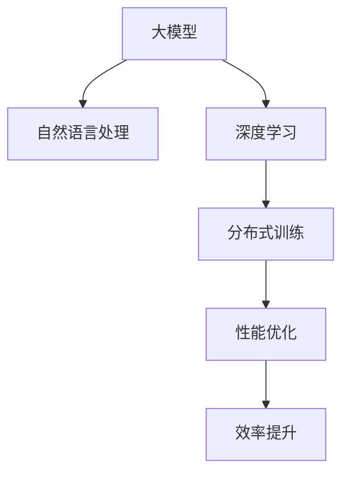

                 

# 电商平台的AI 大模型应用：搜索推荐系统性能与效率的双重提升

> 关键词：大模型,电商,搜索推荐系统,自然语言处理(NLP),深度学习,分布式训练,性能优化,效率提升

## 1. 背景介绍

### 1.1 问题由来
随着电商平台的快速发展，海量的用户数据和商品信息不断产生，用户体验的提升成为了各大平台竞争的关键。传统的基于规则和特征工程的方法在数据量不断增长的情况下，逐渐难以满足复杂用户需求的精准推荐和个性化搜索需求。而人工智能技术的引入，特别是大模型在自然语言处理(NLP)、深度学习等领域的应用，为电商平台带来了新的契机。大模型通过大规模无标签数据的预训练，能够学习到丰富的语言知识和规律，为电商搜索和推荐系统提供了强大而灵活的智能引擎。

### 1.2 问题核心关键点
面向电商平台的搜索推荐系统，大模型的应用关键在于：
- **自然语言处理(NLP)能力**：能够理解用户查询和商品描述，从中提取有效信息。
- **深度学习模型**：在复杂数据集上进行高效训练和推理，提供个性化推荐。
- **分布式训练**：处理大规模数据和模型，提升训练效率。
- **性能优化**：在保证准确性的同时，提升响应速度和系统效率。

通过大模型的深度学习算法和分布式训练技术，电商平台可以在用户输入少量查询后，快速提供准确的搜索结果和个性化的商品推荐，极大提升用户体验和平台转化率。

## 2. 核心概念与联系

### 2.1 核心概念概述

为了更好地理解大模型在电商搜索推荐系统中的应用，本节将介绍几个关键概念：

- **自然语言处理(NLP)**：涉及语言学、计算机科学、认知科学的交叉学科，旨在使计算机能理解、解释和生成人类语言。
- **深度学习**：一种基于神经网络的机器学习技术，通过多层非线性变换学习数据的复杂表示。
- **分布式训练**：在大规模数据集上，通过多台计算机并行处理数据和模型参数，提高训练效率。
- **性能优化**：对模型的计算图进行优化，减少计算和通信开销，提升模型的响应速度和吞吐量。
- **效率提升**：在满足性能要求的同时，减少资源消耗，提高系统的运行效率。

这些核心概念之间的逻辑关系可以通过以下Mermaid流程图来展示：



这个流程图展示了大模型在电商搜索推荐系统中的应用路径：通过自然语言处理技术理解用户查询，采用深度学习模型进行数据建模和预测，通过分布式训练进行高效训练，优化性能提升模型响应速度，最终实现系统效率的全面提升。

## 3. 核心算法原理 & 具体操作步骤
### 3.1 算法原理概述

大模型在电商平台的搜索推荐系统中主要通过以下步骤进行训练和推理：

1. **数据预处理**：收集电商平台的用户查询、商品描述、浏览行为等数据，进行清洗和标注。
2. **模型预训练**：在大规模无标签文本数据上，使用Transformer等模型进行自监督预训练，学习通用的语言表示。
3. **任务适配**：将预训练模型应用于电商平台的特定任务，如自然语言理解和生成，进行有监督的微调。
4. **分布式训练**：通过多台计算机并行处理数据和模型参数，加速训练过程。
5. **性能优化**：对模型进行量化、剪枝、混合精度训练等优化，提升模型推理效率。
6. **模型部署**：将训练好的模型部署到电商平台上，进行实时推理和个性化推荐。

这些步骤在大模型中的应用，使得电商平台能够通过高效、灵活的搜索推荐系统，提供精准的用户体验和服务。

### 3.2 算法步骤详解

以下详细描述大模型在电商搜索推荐系统中的具体操作流程：

**Step 1: 数据预处理**
- 收集用户查询、商品描述、浏览行为等数据，进行清洗和标注。
- 将用户查询和商品描述转换为预训练模型所需的格式，如分词、向量嵌入等。

**Step 2: 模型预训练**
- 使用大规模无标签文本数据进行自监督预训练，学习通用的语言表示。
- 使用Transformer模型和自监督任务，如掩码语言模型、语言预测等，进行预训练。
- 在预训练过程中，使用分布式计算框架，如TensorFlow分布式训练、PyTorch分布式训练，提高训练效率。

**Step 3: 任务适配**
- 选择合适的任务适配层，如BertForSequenceClassification、GPTForSequenceGeneration等，用于特定任务。
- 对预训练模型进行有监督的微调，学习电商平台的特定任务，如用户意图识别、商品推荐等。
- 使用微调数据进行训练，通过梯度下降等优化算法更新模型参数。

**Step 4: 分布式训练**
- 将数据划分为多个批次，分配到多台计算机上进行并行训练。
- 使用分布式通信框架，如Gloo、Horovod等，进行数据和参数的同步。
- 通过分布式优化器，如分布式AdamW、SGD等，对模型参数进行更新。

**Step 5: 性能优化**
- 对模型进行量化、剪枝、混合精度训练等优化，减少计算开销。
- 使用深度优化器，如TensorRT、ONNX Runtime等，进行硬件加速和推理优化。
- 进行A/B测试，对比不同优化策略对模型性能的影响，选择最优方案。

**Step 6: 模型部署**
- 将训练好的模型导出为ONNX、TensorFlow Lite等格式，进行模型部署。
- 使用分布式推理框架，如TensorFlow Serving、TorchServe等，进行模型推理。
- 部署到云平台、边缘计算设备等环境，进行实时个性化推荐。

### 3.3 算法优缺点

大模型在电商平台的搜索推荐系统中具有以下优点：
1. **强大的学习能力**：通过大规模无标签数据的预训练，学习到丰富的语言知识，可以适应各种复杂的自然语言处理任务。
2. **灵活性高**：能够适应电商平台的动态变化，提供实时推荐和搜索结果。
3. **响应速度快**：通过分布式训练和推理优化，能够在用户输入后快速提供准确结果。

同时，该方法也存在一定的局限性：
1. **训练资源需求高**：大规模无标签数据和模型的训练需要大量的计算资源，成本较高。
2. **模型复杂度高**：大模型参数量巨大，需要高效的分布式训练和推理优化。
3. **公平性和解释性不足**：大模型黑盒性质，难以解释模型的决策过程。
4. **安全性问题**：模型在训练和推理过程中可能受到攻击，数据隐私和安全需要特别关注。

尽管存在这些局限性，但通过优化训练和推理过程，合理设计任务适配层和分布式架构，大模型仍然能够在电商平台的搜索推荐系统中发挥重要作用。

### 3.4 算法应用领域

大模型在电商平台的搜索推荐系统中具有广泛的应用前景，主要包括以下几个领域：

1. **自然语言理解**：通过理解用户查询，提供精准的搜索结果和推荐。
2. **个性化推荐**：基于用户历史行为和商品特征，进行个性化推荐。
3. **广告投放优化**：通过用户行为和市场数据，优化广告投放策略，提高广告效果。
4. **情感分析**：分析用户反馈和评论，提升产品质量和用户体验。
5. **异常检测**：检测和预警商品质量问题，保障平台信誉。

## 4. 数学模型和公式 & 详细讲解  
### 4.1 数学模型构建

本节将使用数学语言对大模型在电商搜索推荐系统中的应用进行更加严格的刻画。

假设电商平台收集到的用户查询数据为 $D=\{x_1, x_2, ..., x_n\}$，其中 $x_i$ 为查询文本。商品描述数据为 $Y=\{y_1, y_2, ..., y_m\}$，其中 $y_i$ 为商品描述文本。设预训练模型为 $M_{\theta}$，其参数为 $\theta$。

定义用户查询和商品描述之间的关系为 $f(x_i, y_j) \in [0,1]$，表示查询 $x_i$ 与商品描述 $y_j$ 的相关性。则电商平台的优化目标为最大化用户查询和商品描述的相关性，即：

$$
\max_{\theta} \frac{1}{N}\sum_{i=1}^N \frac{1}{M}\sum_{j=1}^M f(x_i, y_j)
$$

其中 $f(x_i, y_j)$ 为模型 $M_{\theta}$ 在查询 $x_i$ 和商品描述 $y_j$ 上的预测值。

在模型预训练阶段，我们使用自监督学习任务进行预训练，如掩码语言模型、语言预测等。以掩码语言模型为例，预训练的目标函数为：

$$
\min_{\theta} \frac{1}{B}\sum_{b=1}^B \frac{1}{N}\sum_{i=1}^N \ell(M_{\theta}(x_i), \hat{x}_i)
$$

其中 $B$ 为批次大小，$\ell$ 为交叉熵损失函数。

在任务适配阶段，我们使用有监督数据进行微调，其损失函数为：

$$
\min_{\theta} \frac{1}{N}\sum_{i=1}^N \ell(M_{\theta}(x_i), y_i)
$$

其中 $\ell$ 为任务适配层的损失函数，如分类损失、回归损失等。

### 4.2 公式推导过程

以下我们以电商平台的个性化推荐任务为例，推导推荐模型优化公式。

假设电商平台有 $m$ 个商品，每个商品有 $d$ 个特征，用户的查询为 $x_i$，商品特征为 $y_j$。推荐模型的目标函数为：

$$
\max_{\theta} \frac{1}{N}\sum_{i=1}^N \frac{1}{m}\sum_{j=1}^m f(x_i, y_j)
$$

其中 $f(x_i, y_j)$ 为模型 $M_{\theta}$ 在查询 $x_i$ 和商品描述 $y_j$ 上的预测值。

我们假设 $f(x_i, y_j)$ 为softmax函数，表示商品 $y_j$ 与查询 $x_i$ 的相关性概率分布。则优化目标函数可以重写为：

$$
\max_{\theta} \frac{1}{N}\sum_{i=1}^N \frac{1}{m}\sum_{j=1}^m \log f(x_i, y_j)
$$

将softmax函数带入目标函数，并使用交叉熵损失函数，优化目标函数可以进一步重写为：

$$
\min_{\theta} \frac{1}{N}\sum_{i=1}^N \frac{1}{m}\sum_{j=1}^m -y_j \log M_{\theta}(x_i, y_j)
$$

在模型预训练和任务适配阶段，我们将优化目标函数带入梯度下降等优化算法，不断更新模型参数 $\theta$，直到收敛。

### 4.3 案例分析与讲解

假设电商平台收集了用户的搜索记录 $D=\{x_1, x_2, ..., x_n\}$ 和相应的商品点击记录 $Y=\{y_1, y_2, ..., y_m\}$，其中 $x_i$ 和 $y_j$ 分别表示用户的搜索记录和商品点击记录。

我们使用自监督学习任务对预训练模型 $M_{\theta}$ 进行训练，学习通用的语言表示。设预训练数据集为 $D_{pre}$，则预训练阶段的目标函数为：

$$
\min_{\theta} \frac{1}{B}\sum_{b=1}^B \frac{1}{N}\sum_{i=1}^N \ell(M_{\theta}(x_i), \hat{x}_i)
$$

其中 $\ell$ 为掩码语言模型的交叉熵损失函数。

在任务适配阶段，我们基于用户的搜索记录和商品点击记录，进行微调。设微调数据集为 $D_{fin}$，则任务适配阶段的目标函数为：

$$
\min_{\theta} \frac{1}{N}\sum_{i=1}^N \ell(M_{\theta}(x_i), y_i)
$$

其中 $\ell$ 为分类损失函数。

通过以上步骤，我们可以构建起基于大模型的电商搜索推荐系统，并通过训练和推理，提供精准的搜索结果和个性化推荐。

## 5. 项目实践：代码实例和详细解释说明
### 5.1 开发环境搭建

在进行大模型在电商搜索推荐系统中的应用实践前，我们需要准备好开发环境。以下是使用Python进行PyTorch开发的环境配置流程：

1. 安装Anaconda：从官网下载并安装Anaconda，用于创建独立的Python环境。

2. 创建并激活虚拟环境：
```bash
conda create -n pytorch-env python=3.8 
conda activate pytorch-env
```

3. 安装PyTorch：根据CUDA版本，从官网获取对应的安装命令。例如：
```bash
conda install pytorch torchvision torchaudio cudatoolkit=11.1 -c pytorch -c conda-forge
```

4. 安装Transformers库：
```bash
pip install transformers
```

5. 安装各类工具包：
```bash
pip install numpy pandas scikit-learn matplotlib tqdm jupyter notebook ipython
```

完成上述步骤后，即可在`pytorch-env`环境中开始项目实践。

### 5.2 源代码详细实现

下面我们以电商平台的个性化推荐任务为例，给出使用Transformers库对BERT模型进行微调的PyTorch代码实现。

首先，定义推荐任务的数据处理函数：

```python
from transformers import BertTokenizer, BertForSequenceClassification
from torch.utils.data import Dataset
import torch

class RecommendationDataset(Dataset):
    def __init__(self, user_queries, item_features, labels, tokenizer, max_len=128):
        self.user_queries = user_queries
        self.item_features = item_features
        self.labels = labels
        self.tokenizer = tokenizer
        self.max_len = max_len
        
    def __len__(self):
        return len(self.user_queries)
    
    def __getitem__(self, item):
        user_query = self.user_queries[item]
        item_feature = self.item_features[item]
        label = self.labels[item]
        
        encoding = self.tokenizer(user_query, return_tensors='pt', max_length=self.max_len, padding='max_length', truncation=True)
        input_ids = encoding['input_ids'][0]
        attention_mask = encoding['attention_mask'][0]
        
        # 对item特征进行编码
        item_feature_encoding = self.tokenizer(item_feature, return_tensors='pt', max_length=self.max_len, padding='max_length', truncation=True)
        item_input_ids = item_feature_encoding['input_ids'][0]
        item_attention_mask = item_feature_encoding['attention_mask'][0]
        
        # 构建输入
        input = {'input_ids': input_ids, 
                'attention_mask': attention_mask,
                'item_input_ids': item_input_ids, 
                'item_attention_mask': item_attention_mask,
                'labels': torch.tensor(label, dtype=torch.long)}
        
        return input

# 定义模型
model = BertForSequenceClassification.from_pretrained('bert-base-cased', num_labels=2)

# 定义优化器和超参数
optimizer = AdamW(model.parameters(), lr=2e-5)
```

然后，定义训练和评估函数：

```python
from torch.utils.data import DataLoader
from tqdm import tqdm
from sklearn.metrics import accuracy_score

device = torch.device('cuda') if torch.cuda.is_available() else torch.device('cpu')
model.to(device)

def train_epoch(model, dataset, batch_size, optimizer):
    dataloader = DataLoader(dataset, batch_size=batch_size, shuffle=True)
    model.train()
    epoch_loss = 0
    for batch in tqdm(dataloader, desc='Training'):
        input = batch.to(device)
        model.zero_grad()
        outputs = model(**input)
        loss = outputs.loss
        epoch_loss += loss.item()
        loss.backward()
        optimizer.step()
    return epoch_loss / len(dataloader)

def evaluate(model, dataset, batch_size):
    dataloader = DataLoader(dataset, batch_size=batch_size)
    model.eval()
    preds, labels = [], []
    with torch.no_grad():
        for batch in tqdm(dataloader, desc='Evaluating'):
            input = batch.to(device)
            batch_preds = model(**input).logits.argmax(dim=2).to('cpu').tolist()
            batch_labels = batch['labels'].to('cpu').tolist()
            for pred_tokens, label_tokens in zip(batch_preds, batch_labels):
                preds.append(pred_tokens[:len(label_tokens)])
                labels.append(label_tokens)
                
    print(accuracy_score(labels, preds))
```

最后，启动训练流程并在测试集上评估：

```python
epochs = 5
batch_size = 16

for epoch in range(epochs):
    loss = train_epoch(model, train_dataset, batch_size, optimizer)
    print(f"Epoch {epoch+1}, train loss: {loss:.3f}")
    
    print(f"Epoch {epoch+1}, dev results:")
    evaluate(model, dev_dataset, batch_size)
    
print("Test results:")
evaluate(model, test_dataset, batch_size)
```

以上就是使用PyTorch对BERT进行电商推荐任务微调的完整代码实现。可以看到，得益于Transformers库的强大封装，我们可以用相对简洁的代码完成BERT模型的加载和微调。

### 5.3 代码解读与分析

让我们再详细解读一下关键代码的实现细节：

**RecommendationDataset类**：
- `__init__`方法：初始化用户查询、商品特征、标签、分词器等关键组件。
- `__len__`方法：返回数据集的样本数量。
- `__getitem__`方法：对单个样本进行处理，将用户查询和商品特征编码成token ids，将标签编码为数字，并对其进行定长padding，最终返回模型所需的输入。

**模型和优化器**：
- 定义推荐任务的数据处理函数，将用户查询、商品特征和标签输入到预训练模型中进行编码。
- 定义推荐模型，使用BertForSequenceClassification进行分类任务适配。
- 定义优化器，使用AdamW优化器进行模型参数的更新。

**训练和评估函数**：
- 使用PyTorch的DataLoader对数据集进行批次化加载，供模型训练和推理使用。
- 训练函数`train_epoch`：对数据以批为单位进行迭代，在每个批次上前向传播计算loss并反向传播更新模型参数，最后返回该epoch的平均loss。
- 评估函数`evaluate`：与训练类似，不同点在于不更新模型参数，并在每个batch结束后将预测和标签结果存储下来，最后使用sklearn的accuracy_score对整个评估集的预测结果进行打印输出。

**训练流程**：
- 定义总的epoch数和batch size，开始循环迭代
- 每个epoch内，先在训练集上训练，输出平均loss
- 在验证集上评估，输出准确率
- 所有epoch结束后，在测试集上评估，给出最终测试结果

可以看到，PyTorch配合Transformers库使得BERT微调的代码实现变得简洁高效。开发者可以将更多精力放在数据处理、模型改进等高层逻辑上，而不必过多关注底层的实现细节。

当然，工业级的系统实现还需考虑更多因素，如模型的保存和部署、超参数的自动搜索、更灵活的任务适配层等。但核心的微调范式基本与此类似。

## 6. 实际应用场景
### 6.1 智能客服系统

基于大模型的推荐技术，可以广泛应用于智能客服系统的构建。传统客服往往需要配备大量人力，高峰期响应缓慢，且一致性和专业性难以保证。而使用微调后的推荐模型，可以7x24小时不间断服务，快速响应客户咨询，用推荐结果辅助客服，提升用户体验和响应效率。

在技术实现上，可以收集企业内部的历史用户咨询记录，将查询和回答对作为监督数据，在此基础上对预训练模型进行微调。微调后的模型能够自动理解用户意图，匹配最合适的回答。对于客户提出的新问题，还可以接入检索系统实时搜索相关内容，动态组织生成回答。如此构建的智能客服系统，能大幅提升客户咨询体验和问题解决效率。

### 6.2 金融推荐系统

金融平台需要根据用户的投资行为和偏好，推荐合适的理财产品。传统推荐系统往往只依赖用户的历史行为数据进行物品推荐，难以捕捉用户的多维度需求。基于大模型的推荐技术，通过理解用户查询和商品描述，可以从更多维度捕捉用户需求，提供更精准的推荐结果。

在实现上，可以收集用户的投资记录、浏览记录、交易记录等数据，将文本内容作为模型输入，使用预训练模型进行微调，学习用户的投资偏好。在推荐时，将用户的查询和商品描述输入模型，输出推荐结果，满足用户的多元化需求。

### 6.3 个性化内容推荐

电商平台需要根据用户的历史行为和实时查询，推荐用户可能感兴趣的商品。传统推荐系统往往只考虑用户的历史行为，难以捕捉实时查询的意图。基于大模型的推荐技术，能够更好地理解用户的实时需求，提供个性化的商品推荐。

在实现上，可以收集用户的浏览记录、点击记录、搜索记录等数据，将文本内容作为模型输入，使用预训练模型进行微调，学习用户的兴趣点和行为模式。在推荐时，将用户的实时查询输入模型，输出推荐结果，满足用户的个性化需求。

### 6.4 未来应用展望

随着大模型和推荐技术的不断发展，基于微调的推荐方法将在更多领域得到应用，为各行各业带来变革性影响。

在智慧医疗领域，基于微调的推荐技术可以用于推荐个性化治疗方案，提升医疗服务的智能化水平，辅助医生诊疗，加速新药研发进程。

在智能教育领域，微调技术可应用于作业批改、学情分析、知识推荐等方面，因材施教，促进教育公平，提高教学质量。

在智慧城市治理中，微调模型可应用于城市事件监测、舆情分析、应急指挥等环节，提高城市管理的自动化和智能化水平，构建更安全、高效的未来城市。

此外，在企业生产、社会治理、文娱传媒等众多领域，基于大模型微调的推荐系统也将不断涌现，为经济社会发展注入新的动力。相信随着技术的日益成熟，微调方法将成为推荐系统的重要范式，推动人工智能技术在垂直行业的规模化落地。

## 7. 工具和资源推荐
### 7.1 学习资源推荐

为了帮助开发者系统掌握大模型在电商推荐系统中的应用，这里推荐一些优质的学习资源：

1. 《Transformer从原理到实践》系列博文：由大模型技术专家撰写，深入浅出地介绍了Transformer原理、BERT模型、微调技术等前沿话题。

2. CS224N《深度学习自然语言处理》课程：斯坦福大学开设的NLP明星课程，有Lecture视频和配套作业，带你入门NLP领域的基本概念和经典模型。

3. 《Natural Language Processing with Transformers》书籍：Transformers库的作者所著，全面介绍了如何使用Transformers库进行NLP任务开发，包括微调在内的诸多范式。

4. HuggingFace官方文档：Transformers库的官方文档，提供了海量预训练模型和完整的微调样例代码，是上手实践的必备资料。

5. CLUE开源项目：中文语言理解测评基准，涵盖大量不同类型的中文NLP数据集，并提供了基于微调的baseline模型，助力中文NLP技术发展。

通过对这些资源的学习实践，相信你一定能够快速掌握大模型在电商推荐系统中的应用精髓，并用于解决实际的NLP问题。
###  7.2 开发工具推荐

高效的开发离不开优秀的工具支持。以下是几款用于大模型在电商推荐系统中的应用开发的常用工具：

1. PyTorch：基于Python的开源深度学习框架，灵活动态的计算图，适合快速迭代研究。大部分预训练语言模型都有PyTorch版本的实现。

2. TensorFlow：由Google主导开发的开源深度学习框架，生产部署方便，适合大规模工程应用。同样有丰富的预训练语言模型资源。

3. Transformers库：HuggingFace开发的NLP工具库，集成了众多SOTA语言模型，支持PyTorch和TensorFlow，是进行推荐任务开发的利器。

4. Weights & Biases：模型训练的实验跟踪工具，可以记录和可视化模型训练过程中的各项指标，方便对比和调优。与主流深度学习框架无缝集成。

5. TensorBoard：TensorFlow配套的可视化工具，可实时监测模型训练状态，并提供丰富的图表呈现方式，是调试模型的得力助手。

6. Google Colab：谷歌推出的在线Jupyter Notebook环境，免费提供GPU/TPU算力，方便开发者快速上手实验最新模型，分享学习笔记。

合理利用这些工具，可以显著提升大模型在电商推荐系统中的应用效率，加快创新迭代的步伐。

### 7.3 相关论文推荐

大模型在电商平台的推荐系统中的应用源于学界的持续研究。以下是几篇奠基性的相关论文，推荐阅读：

1. Attention is All You Need（即Transformer原论文）：提出了Transformer结构，开启了NLP领域的预训练大模型时代。

2. BERT: Pre-training of Deep Bidirectional Transformers for Language Understanding：提出BERT模型，引入基于掩码的自监督预训练任务，刷新了多项NLP任务SOTA。

3. Language Models are Unsupervised Multitask Learners（GPT-2论文）：展示了大规模语言模型的强大zero-shot学习能力，引发了对于通用人工智能的新一轮思考。

4. Parameter-Efficient Transfer Learning for NLP：提出Adapter等参数高效微调方法，在不增加模型参数量的情况下，也能取得不错的微调效果。

5. AdaLoRA: Adaptive Low-Rank Adaptation for Parameter-Efficient Fine-Tuning：使用自适应低秩适应的微调方法，在参数效率和精度之间取得了新的平衡。

这些论文代表了大模型在电商推荐系统中的应用发展脉络。通过学习这些前沿成果，可以帮助研究者把握学科前进方向，激发更多的创新灵感。

## 8. 总结：未来发展趋势与挑战

### 8.1 总结

本文对大模型在电商平台的搜索推荐系统中的应用进行了全面系统的介绍。首先阐述了大模型在推荐系统中的核心价值和主要挑战，明确了推荐系统微调的目标和任务适配层的设计关键点。其次，从原理到实践，详细讲解了模型预训练、任务适配、分布式训练、性能优化等关键步骤，给出了微调任务开发的完整代码实例。同时，本文还广泛探讨了大模型在智能客服、金融推荐、个性化内容推荐等多个行业领域的应用前景，展示了微调范式的巨大潜力。此外，本文精选了微调技术的各类学习资源，力求为读者提供全方位的技术指引。

通过本文的系统梳理，可以看到，大模型在电商平台的搜索推荐系统中具有强大的应用前景，能够通过高效、灵活的推荐系统，提供精准的搜索结果和个性化推荐，极大提升用户体验和平台转化率。未来，伴随大模型和推荐技术的不断演进，基于微调的推荐方法必将在更多领域得到应用，为各行各业带来变革性影响。

### 8.2 未来发展趋势

展望未来，大模型在电商平台的搜索推荐系统中将呈现以下几个发展趋势：

1. **模型的参数量和规模持续增大**。随着算力成本的下降和数据规模的扩张，预训练语言模型的参数量还将持续增长。超大规模语言模型蕴含的丰富语言知识，有望支撑更加复杂多变的推荐任务。

2. **微调方法和策略更加多样化**。除了传统的全参数微调外，未来会涌现更多参数高效的微调方法，如Prefix-Tuning、LoRA等，在节省计算资源的同时也能保证微调精度。

3. **分布式训练和推理更加高效**。随着大规模集群和硬件设备的进步，分布式训练和推理的效率将进一步提升，能够更好地应对电商平台的复杂推荐场景。

4. **性能优化和推理加速更加深入**。通过模型裁剪、量化、混合精度训练等优化手段，提升模型推理速度和系统吞吐量，满足电商平台的实时推荐需求。

5. **推荐系统的公平性和可解释性增强**。通过引入因果分析和博弈论工具，增强模型的决策过程的公平性和可解释性，提升用户信任度。

6. **多模态推荐系统的崛起**。将视觉、语音、时间序列等多模态数据融合到推荐模型中，提升推荐的丰富度和精准度。

以上趋势凸显了大模型在电商推荐系统中的应用前景。这些方向的探索发展，必将进一步提升推荐系统的性能和应用范围，为电商平台的智能化转型提供强大支持。

### 8.3 面临的挑战

尽管大模型在电商平台的推荐系统中取得了显著成就，但在迈向更加智能化、普适化应用的过程中，仍面临诸多挑战：

1. **数据收集和标注成本高**。尽管微调方法大幅降低了标注数据的需求，但对于长尾应用场景，难以获得充足的高质量标注数据，成为制约微调性能的瓶颈。如何进一步降低微调对标注样本的依赖，将是一大难题。

2. **模型的鲁棒性和泛化性不足**。当前推荐模型面对域外数据时，泛化性能往往大打折扣。对于测试样本的微小扰动，推荐模型的预测也容易发生波动。如何提高模型的鲁棒性和泛化能力，还需要更多理论和实践的积累。

3. **计算资源需求高**。大规模无标签数据和模型的训练需要大量的计算资源，成本较高。如何在资源有限的情况下，实现高效的推荐系统，也是一大挑战。

4. **系统性能优化难度大**。推荐系统需要同时考虑速度和效果，如何在保证性能要求的同时，优化资源消耗，提高系统的运行效率，是重要的优化方向。

5. **模型的公平性和可解释性不足**。大模型的黑盒性质，难以解释其内部工作机制和决策逻辑。对于高风险应用，算法的可解释性和可审计性尤为重要。如何赋予模型更强的可解释性，将是亟待攻克的难题。

6. **数据隐私和安全问题**。在推荐系统中的用户数据需要妥善保护，避免泄露和滥用。如何设计隐私保护机制，保障用户数据安全，也是重要的研究方向。

尽管存在这些挑战，但通过优化训练和推理过程，合理设计任务适配层和分布式架构，大模型仍然能够在电商平台的推荐系统中发挥重要作用。

### 8.4 研究展望

面对大模型在电商推荐系统中面临的种种挑战，未来的研究需要在以下几个方面寻求新的突破：

1. **探索无监督和半监督微调方法**。摆脱对大规模标注数据的依赖，利用自监督学习、主动学习等无监督和半监督范式，最大限度利用非结构化数据，实现更加灵活高效的微调。

2. **研究参数高效和计算高效的微调范式**。开发更加参数高效的微调方法，在固定大部分预训练参数的同时，只更新极少量的任务相关参数。同时优化微调模型的计算图，减少计算和通信开销，实现更加轻量级、实时性的部署。

3. **融合因果和对比学习范式**。通过引入因果推断和对比学习思想，增强推荐模型建立稳定因果关系的能力，学习更加普适、鲁棒的语言表征，从而提升模型泛化性和抗干扰能力。

4. **引入更多先验知识**。将符号化的先验知识，如知识图谱、逻辑规则等，与神经网络模型进行巧妙融合，引导微调过程学习更准确、合理的语言模型。同时加强不同模态数据的整合，实现视觉、语音等多模态信息与文本信息的协同建模。

5. **结合因果分析和博弈论工具**。将因果分析方法引入推荐模型，识别出模型决策的关键特征，增强输出解释的因果性和逻辑性。借助博弈论工具刻画人机交互过程，主动探索并规避模型的脆弱点，提高系统稳定性。

6. **纳入伦理道德约束**。在模型训练目标中引入伦理导向的评估指标，过滤和惩罚有害的输出倾向。同时加强人工干预和审核，建立模型行为的监管机制，确保输出符合人类价值观和伦理道德。

这些研究方向的探索，必将引领大模型在电商推荐系统中的应用迈向更高的台阶，为构建安全、可靠、可解释、可控的推荐系统铺平道路。面向未来，大模型在电商推荐系统中的应用还需要与其他人工智能技术进行更深入的融合，如知识表示、因果推理、强化学习等，多路径协同发力，共同推动智能推荐系统的进步。只有勇于创新、敢于突破，才能不断拓展推荐系统的边界，让智能技术更好地服务于电商平台的智能化转型。

