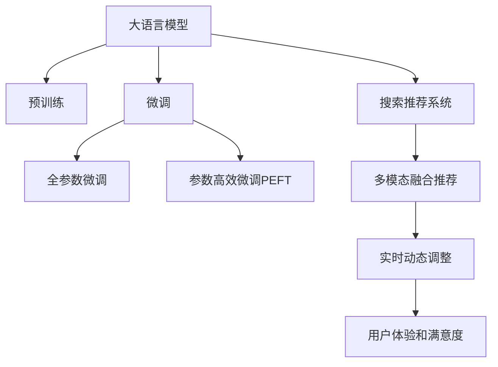

                 

# 电商平台的AI 大模型战略：以搜索推荐系统为核心驱动业务增长

## 1. 背景介绍

### 1.1 问题由来
随着电商平台的迅速发展，其业务复杂度和用户需求的多样性日益增强，传统的搜索推荐系统已经难以满足用户的多样化和个性化的需求。特别是当平台上的商品数量急剧增加时，传统的推荐算法面临着数据稀疏、计算量过大、无法捕捉用户长期行为等挑战。如何高效、精准地推荐商品给用户，已经成为电商平台亟需解决的核心问题。

### 1.2 问题核心关键点
电商平台的搜索推荐系统需要解决以下核心问题：
1. 高效处理海量数据：电商平台上的商品数量往往以亿计，如何在确保推荐结果准确性的同时，高效处理数据成为首要难题。
2. 精准捕捉用户需求：用户需求是多变的，如何精准捕捉用户的长期行为、短期偏好和实时需求，是推荐算法面临的另一大挑战。
3. 动态个性化推荐：用户的偏好是动态变化的，如何在用户行为数据稀疏、变化频繁的情况下，提供持续个性化的推荐服务。
4. 多模态融合推荐：除了文本和用户行为数据，电商平台还可以结合图像、视频等多模态数据，提供更丰富的推荐服务。
5. 用户体验和满意度：推荐结果的准确性和多样性直接影响用户体验和满意度，如何提升推荐系统的效果，是电商平台的根本目标。

### 1.3 问题研究意义
电商平台的AI大模型战略，通过结合预训练大模型和微调技术，可以有效解决上述核心问题，提升平台的用户体验和转化率，推动业务增长。具体来说：

1. **提升搜索效率**：预训练大模型可以高效处理海量文本数据，显著提升搜索的响应速度和准确性。
2. **优化推荐结果**：微调大模型可以更好地捕捉用户需求，提供精准的个性化推荐，提升推荐效果。
3. **增强多模态融合**：结合图像、视频等非文本数据，提供更丰富的推荐服务，满足用户的多样化需求。
4. **实时动态调整**：大模型具备持续学习的能力，可以实时根据用户行为数据调整推荐策略，提供动态个性化的推荐服务。
5. **提升用户满意度**：通过精准的推荐，提升用户满意度和忠诚度，增加平台的市场竞争力。

## 2. 核心概念与联系

### 2.1 核心概念概述

为更好地理解电商平台的AI大模型战略，本节将介绍几个密切相关的核心概念：

- **大语言模型(Large Language Model, LLM)**：以自回归(如GPT)或自编码(如BERT)模型为代表的大规模预训练语言模型。通过在大规模无标签文本语料上进行预训练，学习通用的语言表示，具备强大的语言理解和生成能力。

- **预训练(Pre-training)**：指在大规模无标签文本语料上，通过自监督学习任务训练通用语言模型的过程。常见的预训练任务包括言语建模、遮挡语言模型等。预训练使得模型学习到语言的通用表示。

- **微调(Fine-tuning)**：指在预训练模型的基础上，使用下游任务的少量标注数据，通过有监督学习优化模型在特定任务上的性能。通常只需要调整顶层分类器或解码器，并以较小的学习率更新全部或部分的模型参数。

- **迁移学习(Transfer Learning)**：指将一个领域学习到的知识，迁移应用到另一个不同但相关的领域的学习范式。大模型的预训练-微调过程即是一种典型的迁移学习方式。

- **搜索推荐系统**：电商平台的核心功能之一，通过理解用户的查询意图，从海量商品中推荐出满足用户需求的商品。搜索推荐系统是电商平台的“大脑”，直接影响用户购物体验和转化率。

- **多模态融合推荐**：结合图像、视频等多模态数据，提供更丰富的推荐服务，提升用户购物体验和推荐效果。

这些核心概念之间的逻辑关系可以通过以下Mermaid流程图来展示：



这个流程图展示了大语言模型的核心概念及其之间的关系：

1. 大语言模型通过预训练获得基础能力。
2. 微调是对预训练模型进行任务特定的优化，可以分为全参数微调和参数高效微调（PEFT）。
3. 搜索推荐系统是电商平台的核心功能，可以利用大模型的语言理解能力。
4. 多模态融合推荐结合图像、视频等非文本数据，提供更丰富的推荐服务。
5. 实时动态调整利用大模型的持续学习能力，根据用户行为数据实时调整推荐策略。
6. 用户体验和满意度是电商平台的最终目标，通过精准的推荐，提升用户满意度和忠诚度。

## 3. 核心算法原理 & 具体操作步骤
### 3.1 算法原理概述

基于大模型的搜索推荐系统，本质上是一个有监督的细粒度迁移学习过程。其核心思想是：将预训练的大语言模型视作一个强大的"特征提取器"，通过在电商平台的搜索推荐数据集上进行有监督地微调，使得模型能够准确理解用户的查询意图，高效推荐商品。

形式化地，假设预训练模型为 $M_{\theta}$，其中 $\theta$ 为预训练得到的模型参数。给定电商平台的搜索推荐数据集 $D=\{(x_i, y_i)\}_{i=1}^N$，微调的目标是找到新的模型参数 $\hat{\theta}$，使得：

$$
\hat{\theta}=\mathop{\arg\min}_{\theta} \mathcal{L}(M_{\theta},D)
$$

其中 $\mathcal{L}$ 为针对搜索推荐任务设计的损失函数，用于衡量模型预测输出与真实标签之间的差异。常见的损失函数包括交叉熵损失、均方误差损失等。

通过梯度下降等优化算法，微调过程不断更新模型参数 $\theta$，最小化损失函数 $\mathcal{L}$，使得模型输出逼近真实标签。由于 $\theta$ 已经通过预训练获得了较好的初始化，因此即便在规模较小的数据集 $D$ 上进行微调，也能较快收敛到理想的模型参数 $\hat{\theta}$。

### 3.2 算法步骤详解

基于大模型的搜索推荐系统的一般步骤包括以下几个关键步骤：

**Step 1: 准备预训练模型和数据集**
- 选择合适的预训练语言模型 $M_{\theta}$ 作为初始化参数，如 BERT、GPT 等。
- 准备电商平台的搜索推荐数据集 $D$，划分为训练集、验证集和测试集。一般要求标注数据与预训练数据的分布不要差异过大。

**Step 2: 添加任务适配层**
- 根据任务类型，在预训练模型顶层设计合适的输出层和损失函数。
- 对于分类任务，通常在顶层添加线性分类器和交叉熵损失函数。
- 对于生成任务，通常使用语言模型的解码器输出概率分布，并以负对数似然为损失函数。

**Step 3: 设置微调超参数**
- 选择合适的优化算法及其参数，如 AdamW、SGD 等，设置学习率、批大小、迭代轮数等。
- 设置正则化技术及强度，包括权重衰减、Dropout、Early Stopping 等。
- 确定冻结预训练参数的策略，如仅微调顶层，或全部参数都参与微调。

**Step 4: 执行梯度训练**
- 将训练集数据分批次输入模型，前向传播计算损失函数。
- 反向传播计算参数梯度，根据设定的优化算法和学习率更新模型参数。
- 周期性在验证集上评估模型性能，根据性能指标决定是否触发 Early Stopping。
- 重复上述步骤直到满足预设的迭代轮数或 Early Stopping 条件。

**Step 5: 测试和部署**
- 在测试集上评估微调后模型 $M_{\hat{\theta}}$ 的性能，对比微调前后的精度提升。
- 使用微调后的模型对新用户进行推荐，集成到实际的应用系统中。
- 持续收集新的用户行为数据，定期重新微调模型，以适应数据分布的变化。

以上是基于大模型的搜索推荐系统的一般流程。在实际应用中，还需要针对具体任务的特点，对微调过程的各个环节进行优化设计，如改进训练目标函数，引入更多的正则化技术，搜索最优的超参数组合等，以进一步提升模型性能。

### 3.3 算法优缺点

基于大模型的搜索推荐系统具有以下优点：
1. 高效处理海量数据。预训练大模型可以高效处理电商平台上的海量商品和用户数据，显著提升搜索推荐的响应速度。
2. 精准捕捉用户需求。微调大模型可以更好地捕捉用户的长期行为、短期偏好和实时需求，提供精准的个性化推荐。
3. 动态个性化推荐。利用大模型的持续学习能力，可以实时根据用户行为数据调整推荐策略，提供动态个性化的推荐服务。
4. 多模态融合推荐。结合图像、视频等多模态数据，提供更丰富的推荐服务，提升用户购物体验和推荐效果。

同时，该方法也存在一定的局限性：
1. 依赖标注数据。微调的效果很大程度上取决于标注数据的质量和数量，获取高质量标注数据的成本较高。
2. 迁移能力有限。当目标任务与预训练数据的分布差异较大时，微调的性能提升有限。
3. 负面效果传递。预训练模型的固有偏见、有害信息等，可能通过微调传递到下游任务，造成负面影响。
4. 可解释性不足。微调模型的决策过程通常缺乏可解释性，难以对其推理逻辑进行分析和调试。

尽管存在这些局限性，但就目前而言，基于大模型的搜索推荐系统仍是电商平台的核心竞争力之一。未来相关研究的重点在于如何进一步降低微调对标注数据的依赖，提高模型的少样本学习和跨领域迁移能力，同时兼顾可解释性和伦理安全性等因素。

### 3.4 算法应用领域

基于大模型的搜索推荐系统已经在电商平台的搜索推荐、智能客服、个性化推荐等多个领域得到了广泛的应用，为电商平台带来了显著的业务增长和用户体验提升：

- **搜索推荐**：通过理解用户的查询意图，从海量商品中推荐出满足用户需求的商品。微调大模型能够高效处理海量数据，提升搜索推荐的响应速度和准确性。
- **智能客服**：利用微调后的对话模型，提供7x24小时不间断的智能客服服务，快速响应客户咨询，提升客户满意度。
- **个性化推荐**：结合用户的浏览、点击、评论、分享等行为数据，提供精准的个性化推荐服务，提升用户购物体验和转化率。
- **多模态融合推荐**：结合图像、视频等多模态数据，提供更丰富的推荐服务，满足用户的多样化需求。

除了上述这些经典应用外，大模型的搜索推荐系统还被创新性地应用到更多场景中，如可控推荐、情感分析、行为预测等，为电商平台的智能化升级提供了新的技术路径。

## 4. 数学模型和公式 & 详细讲解
### 4.1 数学模型构建

本节将使用数学语言对基于大模型的搜索推荐过程进行更加严格的刻画。

记预训练语言模型为 $M_{\theta}$，其中 $\theta$ 为预训练得到的模型参数。假设搜索推荐任务的数据集为 $D=\{(x_i,y_i)\}_{i=1}^N$，其中 $x_i$ 为用户的查询文本，$y_i$ 为推荐结果。

定义模型 $M_{\theta}$ 在数据样本 $(x,y)$ 上的损失函数为 $\ell(M_{\theta}(x),y)$，则在数据集 $D$ 上的经验风险为：

$$
\mathcal{L}(\theta) = \frac{1}{N} \sum_{i=1}^N \ell(M_{\theta}(x_i),y_i)
$$

微调的优化目标是最小化经验风险，即找到最优参数：

$$
\theta^* = \mathop{\arg\min}_{\theta} \mathcal{L}(\theta)
$$

在实践中，我们通常使用基于梯度的优化算法（如SGD、Adam等）来近似求解上述最优化问题。设 $\eta$ 为学习率，$\lambda$ 为正则化系数，则参数的更新公式为：

$$
\theta \leftarrow \theta - \eta \nabla_{\theta}\mathcal{L}(\theta) - \eta\lambda\theta
$$

其中 $\nabla_{\theta}\mathcal{L}(\theta)$ 为损失函数对参数 $\theta$ 的梯度，可通过反向传播算法高效计算。

### 4.2 公式推导过程

以下我们以二分类任务为例，推导交叉熵损失函数及其梯度的计算公式。

假设模型 $M_{\theta}$ 在输入 $x$ 上的输出为 $\hat{y}=M_{\theta}(x) \in [0,1]$，表示商品被推荐给用户的概率。真实标签 $y \in \{0,1\}$。则二分类交叉熵损失函数定义为：

$$
\ell(M_{\theta}(x),y) = -[y\log \hat{y} + (1-y)\log (1-\hat{y})]
$$

将其代入经验风险公式，得：

$$
\mathcal{L}(\theta) = -\frac{1}{N}\sum_{i=1}^N [y_i\log M_{\theta}(x_i)+(1-y_i)\log(1-M_{\theta}(x_i))]
$$

根据链式法则，损失函数对参数 $\theta_k$ 的梯度为：

$$
\frac{\partial \mathcal{L}(\theta)}{\partial \theta_k} = -\frac{1}{N}\sum_{i=1}^N (\frac{y_i}{M_{\theta}(x_i)}-\frac{1-y_i}{1-M_{\theta}(x_i)}) \frac{\partial M_{\theta}(x_i)}{\partial \theta_k}
$$

其中 $\frac{\partial M_{\theta}(x_i)}{\partial \theta_k}$ 可进一步递归展开，利用自动微分技术完成计算。

在得到损失函数的梯度后，即可带入参数更新公式，完成模型的迭代优化。重复上述过程直至收敛，最终得到适应搜索推荐任务的最优模型参数 $\theta^*$。

## 5. 项目实践：代码实例和详细解释说明
### 5.1 开发环境搭建

在进行搜索推荐系统开发前，我们需要准备好开发环境。以下是使用Python进行PyTorch开发的环境配置流程：

1. 安装Anaconda：从官网下载并安装Anaconda，用于创建独立的Python环境。

2. 创建并激活虚拟环境：
```bash
conda create -n pytorch-env python=3.8 
conda activate pytorch-env
```

3. 安装PyTorch：根据CUDA版本，从官网获取对应的安装命令。例如：
```bash
conda install pytorch torchvision torchaudio cudatoolkit=11.1 -c pytorch -c conda-forge
```

4. 安装Transformers库：
```bash
pip install transformers
```

5. 安装各类工具包：
```bash
pip install numpy pandas scikit-learn matplotlib tqdm jupyter notebook ipython
```

完成上述步骤后，即可在`pytorch-env`环境中开始搜索推荐系统的开发。

### 5.2 源代码详细实现

这里我们以文本搜索推荐系统为例，给出使用Transformers库对BERT模型进行微调的PyTorch代码实现。

首先，定义搜索推荐任务的数据处理函数：

```python
from transformers import BertTokenizer
from torch.utils.data import Dataset
import torch

class SearchDataset(Dataset):
    def __init__(self, queries, items, tokenizer, max_len=128):
        self.queries = queries
        self.items = items
        self.tokenizer = tokenizer
        self.max_len = max_len
        
    def __len__(self):
        return len(self.queries)
    
    def __getitem__(self, item):
        query = self.queries[item]
        item = self.items[item]
        
        encoding = self.tokenizer(query, return_tensors='pt', max_length=self.max_len, padding='max_length', truncation=True)
        query_ids = encoding['input_ids'][0]
        query_mask = encoding['attention_mask'][0]
        
        item_ids = torch.tensor(self.tokenizer.encode(item, add_special_tokens=False), dtype=torch.long)
        item_mask = torch.tensor([1]*len(item_ids), dtype=torch.long)
        
        return {'query_ids': query_ids, 
                'query_mask': query_mask,
                'item_ids': item_ids,
                'item_mask': item_mask}
```

然后，定义模型和优化器：

```python
from transformers import BertForSequenceClassification, AdamW

model = BertForSequenceClassification.from_pretrained('bert-base-cased', num_labels=1)

optimizer = AdamW(model.parameters(), lr=2e-5)
```

接着，定义训练和评估函数：

```python
from torch.utils.data import DataLoader
from tqdm import tqdm
from sklearn.metrics import roc_auc_score

device = torch.device('cuda') if torch.cuda.is_available() else torch.device('cpu')
model.to(device)

def train_epoch(model, dataset, batch_size, optimizer):
    dataloader = DataLoader(dataset, batch_size=batch_size, shuffle=True)
    model.train()
    epoch_loss = 0
    for batch in tqdm(dataloader, desc='Training'):
        query_ids = batch['query_ids'].to(device)
        query_mask = batch['query_mask'].to(device)
        item_ids = batch['item_ids'].to(device)
        item_mask = batch['item_mask'].to(device)
        model.zero_grad()
        outputs = model(query_ids, attention_mask=query_mask, labels=item_mask)
        loss = outputs.loss
        epoch_loss += loss.item()
        loss.backward()
        optimizer.step()
    return epoch_loss / len(dataloader)

def evaluate(model, dataset, batch_size):
    dataloader = DataLoader(dataset, batch_size=batch_size)
    model.eval()
    preds, labels = [], []
    with torch.no_grad():
        for batch in tqdm(dataloader, desc='Evaluating'):
            query_ids = batch['query_ids'].to(device)
            query_mask = batch['query_mask'].to(device)
            item_ids = batch['item_ids'].to(device)
            item_mask = batch['item_mask'].to(device)
            outputs = model(query_ids, attention_mask=query_mask, labels=item_mask)
            batch_preds = outputs.logits.sigmoid().cpu().numpy()
            batch_labels = batch['item_mask'].cpu().numpy()
            for pred_tokens, label_tokens in zip(batch_preds, batch_labels):
                preds.append(pred_tokens[:len(label_tokens)])
                labels.append(label_tokens)
                
    return roc_auc_score(labels, preds)
```

最后，启动训练流程并在测试集上评估：

```python
epochs = 5
batch_size = 16

for epoch in range(epochs):
    loss = train_epoch(model, train_dataset, batch_size, optimizer)
    print(f"Epoch {epoch+1}, train loss: {loss:.3f}")
    
    print(f"Epoch {epoch+1}, dev AUC score:")
    auc_score = evaluate(model, dev_dataset, batch_size)
    print(auc_score)
    
print("Test AUC score:")
auc_score = evaluate(model, test_dataset, batch_size)
print(auc_score)
```

以上就是使用PyTorch对BERT进行搜索推荐系统微调的完整代码实现。可以看到，得益于Transformers库的强大封装，我们可以用相对简洁的代码完成BERT模型的加载和微调。

### 5.3 代码解读与分析

让我们再详细解读一下关键代码的实现细节：

**SearchDataset类**：
- `__init__`方法：初始化查询文本、商品id等关键组件。
- `__len__`方法：返回数据集的样本数量。
- `__getitem__`方法：对单个样本进行处理，将查询文本和商品id转换为token ids和掩码，并进行定长padding，最终返回模型所需的输入。

**训练和评估函数**：
- 使用PyTorch的DataLoader对数据集进行批次化加载，供模型训练和推理使用。
- 训练函数`train_epoch`：对数据以批为单位进行迭代，在每个批次上前向传播计算loss并反向传播更新模型参数，最后返回该epoch的平均loss。
- 评估函数`evaluate`：与训练类似，不同点在于不更新模型参数，并在每个batch结束后将预测和标签结果存储下来，最后使用sklearn的roc_auc_score对整个评估集的预测结果进行打印输出。

**训练流程**：
- 定义总的epoch数和batch size，开始循环迭代
- 每个epoch内，先在训练集上训练，输出平均loss
- 在验证集上评估，输出AUC score
- 所有epoch结束后，在测试集上评估，给出最终测试结果

可以看到，PyTorch配合Transformers库使得BERT微调的代码实现变得简洁高效。开发者可以将更多精力放在数据处理、模型改进等高层逻辑上，而不必过多关注底层的实现细节。

当然，工业级的系统实现还需考虑更多因素，如模型的保存和部署、超参数的自动搜索、更灵活的任务适配层等。但核心的微调范式基本与此类似。

## 6. 实际应用场景
### 6.1 智能推荐系统

基于大模型的搜索推荐系统已经在智能推荐系统上得到了广泛的应用，极大地提升了电商平台的推荐效果和用户体验：

1. **商品推荐**：利用微调后的模型，根据用户的浏览、点击、评价等行为数据，提供个性化的商品推荐，提升用户购物体验和转化率。
2. **活动推荐**：结合节假日、促销活动等情境信息，提供动态的个性化推荐，提升用户参与度和转化率。
3. **广告推荐**：通过分析用户的兴趣和行为，推荐匹配度高的广告，提升广告效果和收益。

除了传统的商品推荐外，智能推荐系统还被创新性地应用到更多场景中，如音乐、视频、新闻等，为内容分发平台带来了新的增长动力。

### 6.2 用户画像构建

大模型的搜索推荐系统可以结合用户行为数据，生成丰富的用户画像，为个性化推荐提供有力的依据：

1. **兴趣偏好**：通过分析用户的搜索历史、点击记录、评价反馈等数据，生成用户的兴趣偏好画像，提供精准的个性化推荐。
2. **行为习惯**：记录用户在不同时间段、不同设备上的行为习惯，生成用户行为画像，提供动态的个性化推荐。
3. **多样性和相关性**：根据用户的兴趣偏好和行为习惯，生成多样且相关的推荐列表，提升用户满意度和平台粘性。

用户画像的构建，为大模型的搜索推荐系统提供了数据支撑，进一步提升了推荐系统的精度和效果。

### 6.3 实时数据分析

大模型的搜索推荐系统可以实时分析用户行为数据，提供动态的推荐策略调整：

1. **实时推荐**：根据用户的实时行为数据，动态调整推荐策略，提供更符合用户需求的推荐服务。
2. **流量预测**：结合市场数据和用户行为数据，预测用户行为趋势，提前调整推荐策略，优化流量分配。
3. **异常检测**：实时监测用户行为数据，检测异常行为，及时预警和处理，保障平台安全。

实时数据分析，使得大模型的搜索推荐系统具备了动态调整的能力，进一步提升了推荐的精准性和实时性。

### 6.4 未来应用展望

随着大模型和微调技术的不断发展，基于搜索推荐系统的电商平台的AI战略将呈现以下几个发展趋势：

1. **超大规模模型**：随着算力成本的下降和数据规模的扩张，预训练语言模型的参数量还将持续增长。超大规模语言模型蕴含的丰富语言知识，有望支撑更加复杂多变的推荐任务。
2. **多模态融合**：结合图像、视频、音频等多模态数据，提供更加丰富和精准的推荐服务。
3. **实时动态调整**：利用大模型的持续学习能力，实时根据用户行为数据调整推荐策略，提供动态个性化的推荐服务。
4. **端到端学习**：将推荐系统与用户反馈、广告效果等反馈信号结合，实现端到端的智能推荐。
5. **隐私保护**：结合隐私保护技术，如差分隐私、联邦学习等，保护用户数据隐私，增强推荐系统的可信度和安全性。

未来，基于搜索推荐系统的电商平台的AI战略将进一步拓展其应用边界，为电商平台带来更多的业务增长和用户满意度提升。

## 7. 工具和资源推荐
### 7.1 学习资源推荐

为了帮助开发者系统掌握搜索推荐系统的原理和实践技巧，这里推荐一些优质的学习资源：

1. 《深度学习与推荐系统》课程：斯坦福大学开设的深度学习课程，涵盖推荐系统的基本概念和算法，适合初学者入门。
2. 《Recommender Systems》书籍：亚马逊推荐系统专家所著，全面介绍了推荐系统的发展历史和核心算法，是推荐系统领域的经典教材。
3. 《Deep Learning for Recommendation Systems》课程：来自DeepLearning.AI的推荐系统课程，涵盖深度学习在推荐系统中的应用，适合进阶学习。
4. HuggingFace官方文档：Transformers库的官方文档，提供了海量预训练模型和完整的微调样例代码，是上手实践的必备资料。
5. Kaggle推荐系统竞赛：利用公开数据集进行推荐系统实战，积累推荐系统开发的实战经验。

通过对这些资源的学习实践，相信你一定能够快速掌握搜索推荐系统的精髓，并用于解决实际的推荐问题。

### 7.2 开发工具推荐

高效的开发离不开优秀的工具支持。以下是几款用于搜索推荐系统开发的常用工具：

1. PyTorch：基于Python的开源深度学习框架，灵活动态的计算图，适合快速迭代研究。
2. TensorFlow：由Google主导开发的开源深度学习框架，生产部署方便，适合大规模工程应用。
3. Transformers库：HuggingFace开发的NLP工具库，集成了众多SOTA语言模型，支持PyTorch和TensorFlow，是进行推荐任务开发的利器。
4. Weights & Biases：模型训练的实验跟踪工具，可以记录和可视化模型训练过程中的各项指标，方便对比和调优。
5. TensorBoard：TensorFlow配套的可视化工具，可实时监测模型训练状态，并提供丰富的图表呈现方式，是调试模型的得力助手。

合理利用这些工具，可以显著提升搜索推荐系统的开发效率，加快创新迭代的步伐。

### 7.3 相关论文推荐

搜索推荐系统的发展源于学界的持续研究。以下是几篇奠基性的相关论文，推荐阅读：

1. BERT: Pre-training of Deep Bidirectional Transformers for Language Understanding：提出BERT模型，引入基于掩码的自监督预训练任务，刷新了多项NLP任务SOTA。
2. Attention is All You Need：提出了Transformer结构，开启了NLP领域的预训练大模型时代。
3. Factorization Machines for Personalized Ranking：提出FM模型，结合用户特征和物品特征进行推荐，取得了很好的推荐效果。
4. Matrix Factorization Techniques for Recommender Systems：介绍了矩阵分解等推荐算法的基本原理和应用场景。
5. Neural Collaborative Filtering：提出NCF模型，利用神经网络进行协同过滤推荐，取得了不错的推荐效果。

这些论文代表了大模型和推荐系统的发展脉络。通过学习这些前沿成果，可以帮助研究者把握学科前进方向，激发更多的创新灵感。

## 8. 总结：未来发展趋势与挑战

### 8.1 总结

本文对基于大模型的搜索推荐系统的原理和实践进行了全面系统的介绍。首先阐述了搜索推荐系统的核心问题及其研究意义，明确了搜索推荐系统在大模型战略中的重要地位。其次，从原理到实践，详细讲解了搜索推荐系统的数学模型和微调方法，给出了微调任务开发的完整代码实例。同时，本文还广泛探讨了搜索推荐系统在智能推荐、用户画像构建、实时数据分析等多个领域的应用前景，展示了搜索推荐系统的广阔应用空间。最后，本文精选了搜索推荐系统的各类学习资源，力求为读者提供全方位的技术指引。

通过本文的系统梳理，可以看到，基于大模型的搜索推荐系统正在成为电商平台的核心竞争力之一，极大地提升了平台的推荐效果和用户体验。未来，伴随大模型和微调技术的持续演进，基于搜索推荐系统的电商平台的AI战略必将在业务增长和用户体验提升方面发挥更大作用。

### 8.2 未来发展趋势

展望未来，搜索推荐系统的AI战略将呈现以下几个发展趋势：

1. **超大规模模型**：随着算力成本的下降和数据规模的扩张，预训练语言模型的参数量还将持续增长。超大规模语言模型蕴含的丰富语言知识，有望支撑更加复杂多变的推荐任务。
2. **多模态融合**：结合图像、视频、音频等多模态数据，提供更加丰富和精准的推荐服务。
3. **实时动态调整**：利用大模型的持续学习能力，实时根据用户行为数据调整推荐策略，提供动态个性化的推荐服务。
4. **端到端学习**：将推荐系统与用户反馈、广告效果等反馈信号结合，实现端到端的智能推荐。
5. **隐私保护**：结合隐私保护技术，如差分隐私、联邦学习等，保护用户数据隐私，增强推荐系统的可信度和安全性。

以上趋势凸显了搜索推荐系统的广阔前景。这些方向的探索发展，必将进一步提升电商平台的推荐效果，为电商平台带来更多的业务增长和用户满意度提升。

### 8.3 面临的挑战

尽管大模型的搜索推荐系统已经取得了瞩目成就，但在迈向更加智能化、普适化应用的过程中，它仍面临着诸多挑战：

1. **数据稀疏性**：电商平台上的商品和用户数据量虽然庞大，但不同用户和商品的交互数据仍然非常稀疏，难以全面捕捉用户需求。
2. **模型鲁棒性**：推荐系统需要应对大量的噪声和异常数据，如何在保证推荐效果的同时，提升模型的鲁棒性，是一个重要的问题。
3. **实时性**：实时动态调整推荐策略，需要高效的计算和存储能力，如何在大规模数据下实现实时推荐，是一个挑战。
4. **模型可解释性**：推荐系统通常是"黑盒"系统，难以解释其内部工作机制和决策逻辑。如何赋予推荐系统更强的可解释性，是提升用户信任和满意度的关键。
5. **隐私保护**：用户行为数据涉及隐私，如何在保证推荐效果的同时，保护用户隐私，是推荐系统的一个重要挑战。

尽管存在这些挑战，但随着学界和产业界的共同努力，搜索推荐系统的AI战略必将进一步发展，为电商平台带来更多的业务增长和用户满意度提升。

### 8.4 研究展望

面对搜索推荐系统的AI战略面临的挑战，未来的研究需要在以下几个方面寻求新的突破：

1. **数据增强技术**：利用数据增强技术，如对抗样本、正则化等方法，提高推荐系统的鲁棒性。
2. **实时推荐算法**：结合分布式计算、模型压缩等技术，在大规模数据下实现实时推荐，提升推荐系统的响应速度和精度。
3. **可解释性模型**：引入可解释性模型，如决策树、LIME等，提升推荐系统的可解释性和用户信任度。
4. **隐私保护技术**：结合差分隐私、联邦学习等隐私保护技术，保护用户数据隐私，增强推荐系统的可信度和安全性。
5. **跨领域知识融合**：将推荐系统与其他领域的知识进行结合，如自然语言处理、图像处理等，提升推荐系统的多样化和服务质量。

这些研究方向的发展，将进一步提升搜索推荐系统的性能和应用范围，为电商平台带来更多的业务增长和用户满意度提升。未来，搜索推荐系统的AI战略将继续拓展其应用边界，为电商平台带来更多的业务增长和用户满意度提升。

## 9. 附录：常见问题与解答

**Q1：如何优化搜索推荐系统的性能？**

A: 优化搜索推荐系统的性能需要从多个方面入手：
1. 数据质量：确保数据的完整性和多样性，避免数据噪声和异常。
2. 模型选择：选择合适的推荐算法和模型，如矩阵分解、神经网络等，提升推荐效果。
3. 特征工程：设计有效的特征提取和拼接方式，提升模型的预测能力。
4. 模型调参：通过超参数调优和正则化技术，避免模型过拟合。
5. 实时动态调整：结合用户行为数据，实时调整推荐策略，提升推荐效果。
6. 多模态融合：结合图像、视频等多模态数据，提升推荐效果。

**Q2：推荐系统如何处理冷启动问题？**

A: 冷启动问题指的是用户和商品同时缺乏历史数据的情况。为了解决冷启动问题，可以采用以下方法：
1. 基于内容的推荐：利用商品的属性信息，推荐相关商品。
2. 基于协同过滤的推荐：利用用户相似性和商品相似性，推荐相关商品。
3. 基于深度学习的推荐：利用深度学习模型，学习用户和商品的潜在表示，进行推荐。
4. 用户画像构建：结合用户行为数据，生成用户画像，进行推荐。

**Q3：推荐系统如何处理噪声和异常数据？**

A: 推荐系统需要应对大量的噪声和异常数据，可以采用以下方法：
1. 数据清洗：去除噪声数据，提升数据质量。
2. 特征选择：选择相关性高的特征，提升模型预测能力。
3. 正则化：引入正则化技术，避免模型过拟合。
4. 异常检测：结合异常检测算法，识别和处理异常数据。
5. 鲁棒性模型：使用鲁棒性模型，提升推荐系统的鲁棒性。

**Q4：推荐系统如何平衡推荐效果和计算成本？**

A: 推荐系统需要在保证推荐效果的同时，平衡计算成本，可以采用以下方法：
1. 模型压缩：通过模型压缩技术，减小模型大小和计算量。
2. 分布式计算：利用分布式计算技术，提高计算效率。
3. 数据采样：结合数据采样技术，减小计算量。
4. 模型融合：结合多个模型，提升推荐效果，同时降低计算成本。

这些方法可以帮助推荐系统在保证推荐效果的同时，平衡计算成本，提升推荐系统的性能和应用范围。

**Q5：推荐系统如何处理长尾问题和多样性问题？**

A: 推荐系统需要处理长尾问题和多样性问题，可以采用以下方法：
1. 长尾推荐：结合长尾物品的特征，进行推荐。
2. 多样性推荐：引入多样性损失函数，提升推荐多样性。
3. 用户画像构建：结合用户行为数据，生成用户画像，进行推荐。
4. 多模态融合：结合图像、视频等多模态数据，提升推荐效果。

这些方法可以帮助推荐系统处理长尾问题和多样性问题，提升推荐系统的多样性和覆盖面。

---

作者：禅与计算机程序设计艺术 / Zen and the Art of Computer Programming

