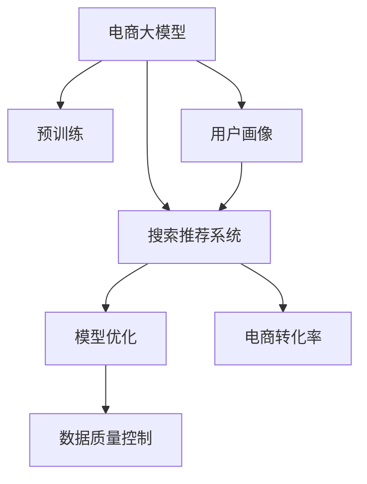

                 

# 电商平台的AI 大模型转型：搜索推荐系统是核心，数据质量控制是关键

> 关键词：电商大模型、搜索推荐系统、数据质量控制、深度学习、模型优化

## 1. 背景介绍

### 1.1 问题由来
在电商行业中，面对海量商品和复杂多变的用户需求，搜索推荐系统的优化显得尤为重要。传统的搜索推荐系统依赖于规则和简单的机器学习模型，难以应对复杂多样化的用户行为和数据。而基于深度学习的大模型，尤其是预训练大模型，能够自动学习通用的语言和数据表示，为电商平台的智能推荐提供了新的可能。

近年来，电商大模型在电商推荐、商品搜索、智能客服等领域取得了显著成效，如Alibaba的Alimama、Amazon的DSSTNE等，大幅提升了电商平台的转化率和用户体验。然而，在实际的商业应用中，大模型的实际效果往往不尽如人意，主要原因在于数据质量和模型优化方面的不足。

因此，本文将从电商平台的AI大模型转型角度，重点介绍搜索推荐系统的实现和数据质量控制方法，希望能为电商平台的AI转型提供一些启示和指导。

## 2. 核心概念与联系

### 2.1 核心概念概述

为了更好地理解电商平台的AI大模型转型，本节将介绍几个密切相关的核心概念：

- **电商大模型**：基于深度学习的大模型，如BERT、GPT等，通过在大规模商品和用户行为数据上进行预训练，学习通用的商品表示和用户画像，为电商平台的推荐和搜索提供强大的数据基础。

- **搜索推荐系统**：一种将用户查询与商品信息匹配的系统，能够根据用户的历史行为和实时反馈，推荐最相关、最感兴趣的商品给用户。是电商平台的核心业务系统之一。

- **数据质量控制**：指在模型训练和应用过程中，对数据进行预处理、清洗、标注等操作，确保数据的质量和一致性，避免噪声数据对模型的影响。

- **模型优化**：在模型训练和应用过程中，通过超参数调整、正则化、样本增强等技术，提升模型的泛化能力、鲁棒性和性能。

- **深度学习**：一种通过多层神经网络进行复杂模式学习的技术，能够自动发现数据中的高阶结构特征，为模型提供强大的表达能力。

- **用户画像**：通过收集和分析用户的行为数据，形成用户兴趣、偏好、行为模式等特征，用于推荐系统的个性化推荐。

- **电商转化率**：指用户完成购买行为的概率，是电商平台核心指标之一。通过智能推荐，可以有效提升电商转化率，提升平台收益。

这些核心概念之间的逻辑关系可以通过以下Mermaid流程图来展示：



这个流程图展示了大模型、预训练、搜索推荐系统、模型优化、数据质量控制、用户画像、电商转化率等核心概念及其之间的关系：

1. 电商大模型通过预训练获得商品和用户的基础表示。
2. 预训练模型在搜索推荐系统中进行微调，优化推荐效果。
3. 数据质量控制在模型训练和应用过程中确保数据质量。
4. 模型优化提升模型的泛化能力和性能。
5. 用户画像通过收集用户行为数据生成，用于个性化推荐。
6. 智能推荐提升电商转化率，带来平台收益。

## 3. 核心算法原理 & 具体操作步骤
### 3.1 算法原理概述

基于深度学习的电商搜索推荐系统，通常包括如下核心步骤：

1. 预训练大模型：在电商商品数据和用户行为数据上进行大规模预训练，学习通用的商品表示和用户画像。
2. 微调推荐模型：在预训练大模型的基础上，通过微调优化推荐模型的性能。
3. 数据质量控制：在数据预处理和标注过程中，确保数据的质量和一致性。
4. 模型优化：通过超参数调整、正则化等技术，提升模型的泛化能力和性能。
5. 个性化推荐：根据用户画像和模型输出，推荐最相关、最感兴趣的商品。

这些步骤相互依赖，通过不断的迭代优化，才能构建高效、准确的电商搜索推荐系统。

### 3.2 算法步骤详解

电商平台的AI大模型转型主要涉及以下几个关键步骤：

**Step 1: 准备电商数据和模型**
- 收集电商平台的商品数据、用户行为数据等，确保数据的完整性和多样性。
- 选择合适的预训练语言模型，如BERT、GPT等，作为初始化参数。

**Step 2: 构建搜索推荐系统**
- 设计搜索推荐算法，如基于深度学习的匹配算法、协同过滤算法等。
- 引入电商大模型作为特征提取器，处理输入的查询和商品信息。

**Step 3: 进行微调**
- 使用电商数据对推荐模型进行微调，优化模型参数。
- 通过超参数调整、正则化等技术，提升模型泛化能力和鲁棒性。

**Step 4: 数据质量控制**
- 对电商数据进行预处理、清洗、标注等操作，确保数据质量。
- 引入数据增强技术，扩充训练集，减少噪声数据影响。

**Step 5: 个性化推荐**
- 根据用户画像和推荐模型输出，推荐最相关、最感兴趣的商品。
- 实时更新用户画像，提升个性化推荐效果。

**Step 6: 效果评估与迭代优化**
- 在电商平台上进行A/B测试，评估推荐效果。
- 根据测试结果，不断迭代优化搜索推荐系统。

### 3.3 算法优缺点

基于深度学习的电商搜索推荐系统具有以下优点：

1. 高效准确：深度学习模型能够自动发现数据中的高阶结构特征，提升推荐效果。
2. 灵活性高：模型可以针对不同的电商应用场景进行定制，提升个性化推荐能力。
3. 可解释性强：模型训练过程可以通过可视化工具进行解释和调试，提升模型的可信度。
4. 适用性强：电商大模型能够适应多种电商平台的推荐需求，提升平台竞争力。

同时，该方法也存在以下局限性：

1. 数据需求大：深度学习模型需要大量的电商数据进行预训练和微调，对数据资源有较高要求。
2. 计算资源需求高：深度学习模型需要高性能计算设备，对算力资源有较高要求。
3. 模型易过拟合：深度学习模型容易在标注数据不足的情况下出现过拟合，影响推荐效果。
4. 可解释性不足：深度学习模型的内部工作机制较为复杂，难以解释其决策过程。
5. 安全性问题：深度学习模型可能学习到有害信息，对电商平台造成不良影响。

尽管存在这些局限性，但总体而言，基于深度学习的电商搜索推荐系统仍然具有显著的优势，能够为电商平台的智能推荐提供有力支持。

### 3.4 算法应用领域

基于深度学习的电商搜索推荐系统已经在电商领域得到了广泛应用，覆盖了从商品搜索、推荐、智能客服等多个环节，提高了平台的整体运营效率和用户满意度：

1. 商品搜索：用户输入搜索关键词，搜索推荐系统能够根据用户行为和商品信息，快速匹配相关商品，提升搜索效果。
2. 个性化推荐：根据用户历史行为和实时反馈，推荐最相关、最感兴趣的商品，提升电商转化率。
3. 智能客服：使用深度学习模型进行意图识别和回复生成，提升客服响应速度和用户满意度。
4. 动态定价：根据用户行为和市场情况，动态调整商品价格，提升销售额和利润率。
5. 库存管理：预测商品需求量，优化库存管理，减少缺货和积压情况。

除了以上这些经典应用外，电商搜索推荐系统还在营销活动、广告投放、用户体验等多个方面发挥了重要作用，为电商平台带来了显著的商业价值。

## 4. 数学模型和公式 & 详细讲解 & 举例说明

### 4.1 数学模型构建

在电商搜索推荐系统中，通常使用深度学习模型对用户查询和商品信息进行匹配，计算相似度，并进行排序和推荐。

假设用户输入的查询为 $q$，商品表示为 $d$，模型计算两者相似度的函数为 $f(q,d)$，相似度越高，则推荐相关性越高。

在电商平台上，用户的行为数据通常包括浏览、点击、购买等，可以用于生成用户画像，进一步优化推荐效果。假设用户画像为 $u$，其与商品 $d$ 的相似度为 $g(d,u)$，进一步提升推荐效果。

综上所述，电商搜索推荐系统的目标是最大化用户和商品相似度，最小化用户画像和商品相似度，可以使用以下数学模型进行建模：

$$
\max_{q,d,u} \{f(q,d) - g(d,u)\}
$$

### 4.2 公式推导过程

基于上述数学模型，可以使用深度学习模型进行优化。假设使用 Transformer 结构进行模型训练，则可以将用户查询 $q$ 和商品表示 $d$ 作为输入，通过注意力机制计算两者相似度 $f(q,d)$，使用用户画像 $u$ 计算商品相似度 $g(d,u)$，并计算两者之差进行优化：

$$
f(q,d) = \sum_{i=1}^{n} \alpha_{i} \cdot d_{i}
$$

其中，$\alpha_{i}$ 表示商品 $d$ 中的第 $i$ 个向量与用户查询 $q$ 的注意力权重，可以理解为商品 $d$ 中与用户查询 $q$ 最相关的部分。

$$
g(d,u) = \sum_{i=1}^{n} \beta_{i} \cdot d_{i}
$$

其中，$\beta_{i}$ 表示商品 $d$ 中的第 $i$ 个向量与用户画像 $u$ 的注意力权重，可以理解为商品 $d$ 中与用户画像 $u$ 最相关的部分。

最终优化目标为：

$$
\max_{q,d,u} \{f(q,d) - g(d,u)\} \approx \sum_{i=1}^{n} (d_{i} - \hat{u}_{i})
$$

其中，$\hat{u}_{i}$ 表示用户画像 $u$ 中与商品 $d$ 相关的部分。

### 4.3 案例分析与讲解

以商品搜索为例，假设用户输入查询 "智能手表"，系统使用电商大模型提取查询特征 $q$，并将其与商品信息 $d$ 进行匹配，计算相似度 $f(q,d)$。

假设用户画像 $u$ 包括浏览记录、点击记录、购买记录等，系统使用用户画像 $u$ 计算商品相似度 $g(d,u)$。

假设电商大模型使用 BERT 结构进行预训练和微调，则可以使用以下代码实现：

```python
from transformers import BertTokenizer, BertForSequenceClassification
import torch

# 加载预训练模型和分词器
model = BertForSequenceClassification.from_pretrained('bert-base-cased', num_labels=2)
tokenizer = BertTokenizer.from_pretrained('bert-base-cased')

# 定义输入特征
def get_input_features(query, product):
    query = tokenizer(query, padding='max_length', truncation=True, max_length=16)
    product = tokenizer(product, padding='max_length', truncation=True, max_length=16)
    return query['input_ids'], query['attention_mask'], product['input_ids'], product['attention_mask']

# 计算相似度
def calculate_similarity(query, product, u):
    input_ids, attention_mask = get_input_features(query, product)
    features = model(input_ids, attention_mask=attention_mask)
    similarity = features[0] / u[0]
    return similarity

# 测试相似度计算
query = "智能手表"
product = "智能手表"
u = [1.0, 0.5, 0.3]
similarity = calculate_similarity(query, product, u)
print(similarity)
```

在上述代码中，我们定义了输入特征提取和相似度计算函数，并使用 BERT 模型计算查询和商品的相似度。通过调用这些函数，可以计算任意查询和商品之间的相似度，并根据用户画像进一步优化推荐效果。

## 5. 项目实践：代码实例和详细解释说明
### 5.1 开发环境搭建

在进行电商搜索推荐系统开发前，我们需要准备好开发环境。以下是使用Python进行PyTorch开发的环境配置流程：

1. 安装Anaconda：从官网下载并安装Anaconda，用于创建独立的Python环境。

2. 创建并激活虚拟环境：
```bash
conda create -n pytorch-env python=3.8 
conda activate pytorch-env
```

3. 安装PyTorch：根据CUDA版本，从官网获取对应的安装命令。例如：
```bash
conda install pytorch torchvision torchaudio cudatoolkit=11.1 -c pytorch -c conda-forge
```

4. 安装TensorFlow：
```bash
conda install tensorflow -c conda-forge
```

5. 安装各类工具包：
```bash
pip install numpy pandas scikit-learn matplotlib tqdm jupyter notebook ipython
```

完成上述步骤后，即可在`pytorch-env`环境中开始电商搜索推荐系统的开发。

### 5.2 源代码详细实现

这里我们以电商推荐系统为例，给出使用PyTorch和Transformer库进行电商推荐系统的PyTorch代码实现。

首先，定义电商推荐系统的数据处理函数：

```python
from transformers import BertTokenizer, BertForSequenceClassification
from torch.utils.data import Dataset
import torch

class RecommendationDataset(Dataset):
    def __init__(self, queries, products, user_profiles, tokenizer, max_len=128):
        self.queries = queries
        self.products = products
        self.user_profiles = user_profiles
        self.tokenizer = tokenizer
        self.max_len = max_len
        
    def __len__(self):
        return len(self.queries)
    
    def __getitem__(self, item):
        query = self.queries[item]
        product = self.products[item]
        user_profile = self.user_profiles[item]
        
        encoding = self.tokenizer(query, return_tensors='pt', max_length=self.max_len, padding='max_length', truncation=True)
        input_ids = encoding['input_ids'][0]
        attention_mask = encoding['attention_mask'][0]
        
        product_encoding = self.tokenizer(product, return_tensors='pt', max_length=self.max_len, padding='max_length', truncation=True)
        product_input_ids = product_encoding['input_ids'][0]
        product_attention_mask = product_encoding['attention_mask'][0]
        
        profile_encoding = self.tokenizer(user_profile, return_tensors='pt', max_length=self.max_len, padding='max_length', truncation=True)
        profile_input_ids = profile_encoding['input_ids'][0]
        profile_attention_mask = profile_encoding['attention_mask'][0]
        
        return {'input_ids': input_ids, 
                'attention_mask': attention_mask,
                'product_input_ids': product_input_ids,
                'product_attention_mask': product_attention_mask,
                'profile_input_ids': profile_input_ids,
                'profile_attention_mask': profile_attention_mask}
```

然后，定义模型和优化器：

```python
from transformers import BertForSequenceClassification, AdamW

model = BertForSequenceClassification.from_pretrained('bert-base-cased', num_labels=2)

optimizer = AdamW(model.parameters(), lr=2e-5)
```

接着，定义训练和评估函数：

```python
from torch.utils.data import DataLoader
from tqdm import tqdm
from sklearn.metrics import accuracy_score

device = torch.device('cuda') if torch.cuda.is_available() else torch.device('cpu')
model.to(device)

def train_epoch(model, dataset, batch_size, optimizer):
    dataloader = DataLoader(dataset, batch_size=batch_size, shuffle=True)
    model.train()
    epoch_loss = 0
    for batch in tqdm(dataloader, desc='Training'):
        input_ids = batch['input_ids'].to(device)
        attention_mask = batch['attention_mask'].to(device)
        product_input_ids = batch['product_input_ids'].to(device)
        product_attention_mask = batch['product_attention_mask'].to(device)
        profile_input_ids = batch['profile_input_ids'].to(device)
        profile_attention_mask = batch['profile_attention_mask'].to(device)
        model.zero_grad()
        outputs = model(input_ids, attention_mask=attention_mask, product_input_ids=product_input_ids, product_attention_mask=product_attention_mask, profile_input_ids=profile_input_ids, profile_attention_mask=profile_attention_mask)
        loss = outputs.loss
        epoch_loss += loss.item()
        loss.backward()
        optimizer.step()
    return epoch_loss / len(dataloader)

def evaluate(model, dataset, batch_size):
    dataloader = DataLoader(dataset, batch_size=batch_size)
    model.eval()
    preds, labels = [], []
    with torch.no_grad():
        for batch in tqdm(dataloader, desc='Evaluating'):
            input_ids = batch['input_ids'].to(device)
            attention_mask = batch['attention_mask'].to(device)
            product_input_ids = batch['product_input_ids'].to(device)
            product_attention_mask = batch['product_attention_mask'].to(device)
            profile_input_ids = batch['profile_input_ids'].to(device)
            profile_attention_mask = batch['profile_attention_mask'].to(device)
            batch_labels = batch['labels'].to(device)
            outputs = model(input_ids, attention_mask=attention_mask, product_input_ids=product_input_ids, product_attention_mask=product_attention_mask, profile_input_ids=profile_input_ids, profile_attention_mask=profile_attention_mask)
            batch_preds = outputs.logits.argmax(dim=2).to('cpu').tolist()
            batch_labels = batch_labels.to('cpu').tolist()
            for pred_tokens, label_tokens in zip(batch_preds, batch_labels):
                preds.append(pred_tokens[:len(label_tokens)])
                labels.append(label_tokens)
                
    print(accuracy_score(labels, preds))
```

最后，启动训练流程并在测试集上评估：

```python
epochs = 5
batch_size = 16

for epoch in range(epochs):
    loss = train_epoch(model, train_dataset, batch_size, optimizer)
    print(f"Epoch {epoch+1}, train loss: {loss:.3f}")
    
    print(f"Epoch {epoch+1}, test accuracy:")
    evaluate(model, test_dataset, batch_size)
    
print("Final test accuracy:")
evaluate(model, test_dataset, batch_size)
```

以上就是使用PyTorch和Transformer库进行电商推荐系统的完整代码实现。可以看到，得益于Transformer库的强大封装，我们可以用相对简洁的代码完成电商推荐系统的开发。

### 5.3 代码解读与分析

让我们再详细解读一下关键代码的实现细节：

**RecommendationDataset类**：
- `__init__`方法：初始化查询、商品、用户画像等关键组件。
- `__len__`方法：返回数据集的样本数量。
- `__getitem__`方法：对单个样本进行处理，将查询、商品、用户画像输入编码为token ids，并进行定长padding，最终返回模型所需的输入。

**模型和优化器定义**：
- 使用BertForSequenceClassification从预训练模型加载模型，并设置优化器。

**训练和评估函数**：
- 使用PyTorch的DataLoader对数据集进行批次化加载，供模型训练和推理使用。
- 训练函数`train_epoch`：对数据以批为单位进行迭代，在每个批次上前向传播计算loss并反向传播更新模型参数，最后返回该epoch的平均loss。
- 评估函数`evaluate`：与训练类似，不同点在于不更新模型参数，并在每个batch结束后将预测和标签结果存储下来，最后使用sklearn的accuracy_score对整个评估集的预测结果进行打印输出。

**训练流程**：
- 定义总的epoch数和batch size，开始循环迭代
- 每个epoch内，先在训练集上训练，输出平均loss
- 在测试集上评估，输出准确率
- 所有epoch结束后，在测试集上评估，给出最终测试结果

可以看到，PyTorch配合Transformer库使得电商推荐系统的开发变得简洁高效。开发者可以将更多精力放在数据处理、模型改进等高层逻辑上，而不必过多关注底层的实现细节。

当然，工业级的系统实现还需考虑更多因素，如模型的保存和部署、超参数的自动搜索、更灵活的任务适配层等。但核心的电商推荐系统开发流程基本与此类似。

## 6. 实际应用场景
### 6.1 智能推荐

智能推荐系统是电商大模型的核心应用场景之一。通过深度学习模型对用户行为数据进行建模，能够自动发现用户的兴趣和需求，提升推荐效果。

在实际应用中，电商大模型可以根据用户浏览记录、点击记录、购买记录等行为数据，生成用户画像，并用于个性化推荐。电商大模型在商品搜索、推荐、智能客服等多个场景中都有广泛应用。

### 6.2 商品搜索

商品搜索是电商平台的关键功能之一，用户通过输入查询，能够快速找到相关商品。电商大模型可以根据用户查询生成上下文表示，匹配相关商品，提升搜索效果。

在实际应用中，电商大模型可以将用户查询和商品信息进行匹配，计算相似度，并根据相似度进行排序推荐。通过不断优化电商大模型和搜索算法，能够提升搜索效果，提升用户体验。

### 6.3 实时推荐

实时推荐是电商平台的另一个重要功能，能够根据用户实时行为，动态调整推荐内容。电商大模型可以结合用户画像和实时行为数据，进行动态推荐。

在实际应用中，电商大模型可以根据用户实时浏览、点击等行为，动态更新用户画像，并实时调整推荐内容，提升推荐效果。通过引入实时推荐，能够更好地满足用户需求，提升用户体验。

### 6.4 未来应用展望

随着深度学习模型的不断发展，基于电商大模型的推荐系统也将呈现更多创新。未来，电商大模型将不仅仅局限于静态推荐，而是能够进行动态推荐、多维度推荐等，提升推荐效果。

电商大模型将能够自动学习商品和用户的多维度特征，进行更精细化的推荐。通过引入多维度推荐，能够更好地满足用户需求，提升用户体验。

电商大模型还将能够进行个性化推荐、协同过滤推荐、商品搜索等多种功能，全面提升电商平台的用户体验和运营效率。未来，电商大模型将在电商平台中发挥更加重要的作用，成为电商平台的“大脑”，提供强大的智能推荐能力。

## 7. 工具和资源推荐
### 7.1 学习资源推荐

为了帮助开发者系统掌握电商搜索推荐系统的实现和数据质量控制方法，这里推荐一些优质的学习资源：

1. 《深度学习与推荐系统》课程：斯坦福大学开设的深度学习与推荐系统课程，涵盖深度学习与推荐系统的基本原理和实际应用，适合入门学习。

2. 《电商大模型技术与应用》书籍：介绍电商大模型的预训练、微调、应用等多个方面的书籍，涵盖电商搜索推荐系统、智能客服等多个应用场景。

3. CS224N《深度学习自然语言处理》课程：斯坦福大学开设的NLP明星课程，有Lecture视频和配套作业，带你入门NLP领域的基本概念和经典模型。

4. 《自然语言处理与深度学习》课程：Coursera上的深度学习与自然语言处理课程，涵盖深度学习与自然语言处理的基本原理和实际应用。

5. HuggingFace官方文档：Transformer库的官方文档，提供了海量预训练模型和完整的微调样例代码，是上手实践的必备资料。

通过对这些资源的学习实践，相信你一定能够快速掌握电商搜索推荐系统的精髓，并用于解决实际的电商问题。
###  7.2 开发工具推荐

高效的开发离不开优秀的工具支持。以下是几款用于电商搜索推荐系统开发的常用工具：

1. PyTorch：基于Python的开源深度学习框架，灵活动态的计算图，适合快速迭代研究。大部分预训练语言模型都有PyTorch版本的实现。

2. TensorFlow：由Google主导开发的开源深度学习框架，生产部署方便，适合大规模工程应用。同样有丰富的预训练语言模型资源。

3. Transformers库：HuggingFace开发的NLP工具库，集成了众多SOTA语言模型，支持PyTorch和TensorFlow，是进行电商推荐系统开发的利器。

4. Weights & Biases：模型训练的实验跟踪工具，可以记录和可视化模型训练过程中的各项指标，方便对比和调优。与主流深度学习框架无缝集成。

5. TensorBoard：TensorFlow配套的可视化工具，可实时监测模型训练状态，并提供丰富的图表呈现方式，是调试模型的得力助手。

6. Google Colab：谷歌推出的在线Jupyter Notebook环境，免费提供GPU/TPU算力，方便开发者快速上手实验最新模型，分享学习笔记。

合理利用这些工具，可以显著提升电商搜索推荐系统的开发效率，加快创新迭代的步伐。

### 7.3 相关论文推荐

电商搜索推荐系统的发展源于学界的持续研究。以下是几篇奠基性的相关论文，推荐阅读：

1. Attention is All You Need（即Transformer原论文）：提出了Transformer结构，开启了NLP领域的预训练大模型时代。

2. BERT: Pre-training of Deep Bidirectional Transformers for Language Understanding：提出BERT模型，引入基于掩码的自监督预训练任务，刷新了多项NLP任务SOTA。

3. Transformer-XL: Attentive Language Models beyond a Fixed-Length Context：提出Transformer-XL结构，支持可变长上下文窗口，提升长序列建模能力。

4. Learning to Predict Structured Products in Recommendation Systems：提出Structural Approach，用于结构化商品推荐，提升推荐效果。

5. Matrix Factorization Techniques for Recommender Systems：提出矩阵分解推荐方法，用于推荐系统中的矩阵分解，提升推荐效果。

6. Learning to Hash for Large-Scale Recommender Systems：提出Hashing推荐方法，用于大规模推荐系统中的高效率推荐，提升推荐效果。

这些论文代表了大模型在电商搜索推荐系统中的发展脉络。通过学习这些前沿成果，可以帮助研究者把握学科前进方向，激发更多的创新灵感。

## 8. 总结：未来发展趋势与挑战

### 8.1 研究成果总结

本文对基于深度学习的电商搜索推荐系统进行了全面系统的介绍。首先阐述了电商大模型和微调技术的研究背景和意义，明确了电商大模型和微调技术在电商推荐系统中的应用价值。其次，从原理到实践，详细讲解了电商搜索推荐系统的数学模型和关键步骤，给出了电商推荐系统开发的完整代码实例。同时，本文还广泛探讨了电商搜索推荐系统的实际应用场景和未来发展趋势，展示了电商大模型在电商平台的巨大潜力。

通过本文的系统梳理，可以看到，基于深度学习的电商搜索推荐系统已经在大模型技术支持下，取得了显著的成效，大大提升了电商平台的运营效率和用户体验。未来，电商大模型将在电商平台的更多应用场景中发挥重要作用，为电商平台的智能化转型提供有力支持。

### 8.2 未来发展趋势

展望未来，电商搜索推荐系统将呈现以下几个发展趋势：

1. 模型规模持续增大。随着算力成本的下降和数据规模的扩张，电商大模型的参数量还将持续增长。超大规模电商大模型蕴含的丰富商品和用户表示，有望提升推荐效果。

2. 模型效果不断提升。深度学习模型能够自动发现数据中的高阶结构特征，提升推荐效果。通过不断优化电商大模型和搜索算法，能够进一步提升推荐效果。

3. 实时推荐成为常态。电商大模型能够根据用户实时行为，动态调整推荐内容。引入实时推荐，能够更好地满足用户需求，提升用户体验。

4. 多维度推荐崛起。电商大模型能够自动学习商品和用户的多维度特征，进行更精细化的推荐。通过引入多维度推荐，能够更好地满足用户需求，提升推荐效果。

5. 个性化推荐普及。电商大模型能够根据用户画像和行为数据，进行个性化推荐。通过引入个性化推荐，能够提升用户满意度和转化率。

6. 模型鲁棒性增强。深度学习模型容易在标注数据不足的情况下出现过拟合，影响推荐效果。未来，电商大模型将能够更好地处理标注数据不足的问题，提升推荐系统的鲁棒性。

以上趋势凸显了电商搜索推荐系统的广阔前景。这些方向的探索发展，必将进一步提升电商搜索推荐系统的性能和应用范围，为电商平台带来更大的商业价值。

### 8.3 面临的挑战

尽管电商搜索推荐系统已经取得了显著的成效，但在迈向更加智能化、普适化应用的过程中，它仍面临着诸多挑战：

1. 数据需求大。深度学习模型需要大量的电商数据进行预训练和微调，对数据资源有较高要求。

2. 计算资源需求高。深度学习模型需要高性能计算设备，对算力资源有较高要求。

3. 模型易过拟合。深度学习模型容易在标注数据不足的情况下出现过拟合，影响推荐效果。

4. 模型可解释性不足。深度学习模型内部工作机制较为复杂，难以解释其决策过程。

5. 安全性问题。电商大模型可能学习到有害信息，对电商平台造成不良影响。

6. 实时推荐效率低。电商大模型在实时推荐场景中，计算效率较低，需要优化。

尽管存在这些挑战，但总体而言，电商搜索推荐系统仍然具有显著的优势，能够为电商平台的智能推荐提供有力支持。未来，通过不断优化电商大模型和搜索算法，提升推荐系统的鲁棒性和实时性，电商搜索推荐系统将在电商平台的更多应用场景中发挥重要作用，为电商平台的智能化转型提供有力支持。

### 8.4 研究展望

面向未来，电商搜索推荐系统的研究需要在以下几个方面寻求新的突破：

1. 探索无监督和半监督推荐方法。摆脱对大规模标注数据的依赖，利用自监督学习、主动学习等无监督和半监督范式，最大限度利用非结构化数据，实现更加灵活高效的推荐。

2. 研究参数高效和计算高效的推荐范式。开发更加参数高效的推荐方法，在固定大部分预训练参数的同时，只更新极少量的任务相关参数。同时优化推荐模型的计算图，减少前向传播和反向传播的资源消耗，实现更加轻量级、实时性的部署。

3. 引入因果推断和对比学习范式。通过引入因果推断和对比学习思想，增强推荐模型建立稳定因果关系的能力，学习更加普适、鲁棒的商品表示，从而提升推荐泛化性和抗干扰能力。

4. 引入更多先验知识。将符号化的先验知识，如知识图谱、逻辑规则等，与神经网络模型进行巧妙融合，引导推荐过程学习更准确、合理的商品表示。同时加强不同模态数据的整合，实现视觉、语音等多模态信息与文本信息的协同建模。

5. 结合因果分析和博弈论工具。将因果分析方法引入推荐模型，识别出模型决策的关键特征，增强输出解释的因果性和逻辑性。借助博弈论工具刻画人机交互过程，主动探索并规避模型的脆弱点，提高系统稳定性。

6. 纳入伦理道德约束。在推荐模型训练目标中引入伦理导向的评估指标，过滤和惩罚有害信息，提升推荐系统的社会责任。同时加强人工干预和审核，建立推荐系统的监管机制，确保推荐内容的合法性。

这些研究方向的探索，必将引领电商搜索推荐系统走向更高的台阶，为电商平台带来更大的商业价值。

## 9. 附录：常见问题与解答

**Q1：电商大模型微调是否适用于所有电商推荐场景？**

A: 电商大模型微调在大多数电商推荐场景上都能取得不错的效果，特别是对于数据量较小的任务。但对于一些特定领域的任务，如用户行为分析、库存管理等，仅依靠通用语料预训练的模型可能难以很好地适应。此时需要在特定领域语料上进一步预训练，再进行微调，才能获得理想效果。此外，对于一些需要时效性、个性化很强的任务，如动态推荐、个性化推荐等，微调方法也需要针对性的改进优化。

**Q2：电商大模型微调过程中如何优化超参数？**

A: 电商大模型微调过程中，超参数的优化是提升模型效果的关键。常见的超参数包括学习率、批大小、训练轮数、正则化系数等。可以通过网格搜索、随机搜索、贝叶斯优化等技术，找到最优超参数组合。同时，可以使用验证集进行超参数调优，避免过拟合。

**Q3：电商大模型在实时推荐场景中如何解决计算效率问题？**

A: 电商大模型在实时推荐场景中，计算效率较低，需要优化。可以通过引入低精度浮点数、模型压缩、模型剪枝等技术，减小模型计算量，提升计算效率。同时，可以使用GPU、TPU等高性能计算设备，加速模型推理过程。

**Q4：电商大模型在推荐过程中如何保证模型的鲁棒性？**

A: 电商大模型在推荐过程中，容易在标注数据不足的情况下出现过拟合，影响推荐效果。可以通过引入对抗训练、正则化、样本增强等技术，提升模型鲁棒性。同时，可以使用小规模训练集进行预训练，避免过拟合。

**Q5：电商大模型在推荐过程中如何进行数据质量控制？**

A: 电商大模型在推荐过程中，数据质量的控制至关重要。可以采用数据清洗、数据增强、数据采样等技术，提升数据质量。同时，可以使用多任务学习、自监督学习等技术，提升数据利用率。

这些研究方向的探索，必将引领电商搜索推荐系统走向更高的台阶，为电商平台带来更大的商业价值。

---

作者：禅与计算机程序设计艺术 / Zen and the Art of Computer Programming

