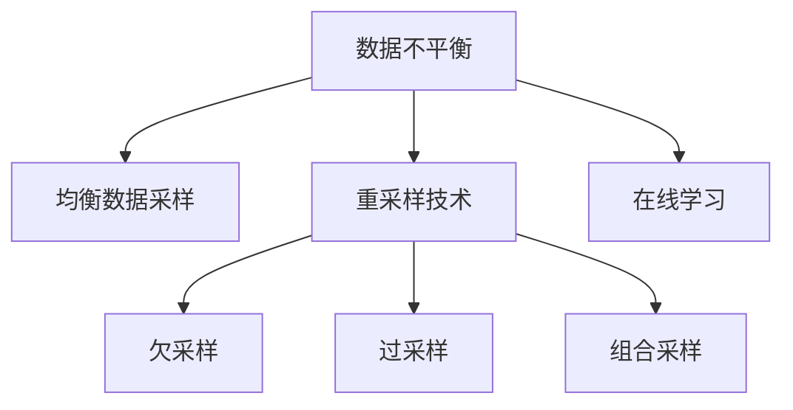

                 

# 电商搜索推荐中的AI大模型数据不平衡问题解决策略

> 关键词：电商搜索推荐,数据不平衡,大模型,均衡数据采样,重采样,在线学习

## 1. 背景介绍

### 1.1 问题由来

电商搜索推荐系统是电子商务的核心组件之一，它通过分析用户的搜索行为、浏览历史、购买记录等数据，为用户推荐最符合其需求的商品，提升用户满意度和购物体验。近年来，AI技术在电商推荐中的应用越来越广泛，尤其是基于大模型的推荐系统，通过预训练语言模型在亿级商品数据上进行的微调，能够更好地理解商品描述、用户评论等文本信息，从而提高推荐的相关性和多样性。

然而，在电商领域，商品类别和数量繁多，用户行为数据也极为多样，这使得推荐系统的训练数据集在类别和数量上呈现显著的不平衡性。例如，一些长尾商品类别（如小众商品、冷门品牌）的数据量可能远远小于热门商品类别，导致模型在预测这些类别时出现偏差，推荐效果不佳。

### 1.2 问题核心关键点

解决电商推荐系统中的数据不平衡问题，核心在于平衡训练数据集中的类别分布，使得模型能够公平地对待各个类别的商品，提升推荐性能。具体来说，主要涉及以下几个方面：

- 均衡数据采样：在数据预处理阶段，通过采样技术调整数据集的类别分布，使得各个类别样本数量接近。
- 重采样技术：对数据集进行欠采样、过采样或组合采样，以改变类别分布，提升模型对少数类别的识别能力。
- 在线学习：使用在线学习算法，不断更新模型，适应新数据和新趋势，逐步解决数据不平衡问题。

## 2. 核心概念与联系

### 2.1 核心概念概述

为了更好地理解电商搜索推荐系统中的数据不平衡问题及其解决策略，本节将介绍几个关键概念：

- **数据不平衡**：在电商推荐系统中，不同商品类别或用户行为的数据分布差异较大，导致模型在预测时偏向于常见类别，忽略长尾商品或行为。
- **均衡数据采样**：通过采样技术调整数据集的类别分布，使得各个类别的样本数量接近，消除类别偏倚。
- **重采样技术**：对数据集进行欠采样、过采样或组合采样，改变类别分布，提升模型对少数类别的识别能力。
- **在线学习**：使用在线学习算法，不断更新模型，适应新数据和新趋势，逐步解决数据不平衡问题。
- **大模型**：基于大规模无标签文本数据进行预训练，并用于电商推荐系统的语言模型，如BERT、GPT等。

这些概念之间的逻辑关系可以通过以下Mermaid流程图来展示：



这个流程图展示了大模型在电商推荐系统中处理数据不平衡问题的一般流程：

1. 识别数据不平衡问题。
2. 采用均衡数据采样或重采样技术调整类别分布。
3. 通过在线学习不断更新模型，逐步解决数据不平衡问题。

## 3. 核心算法原理 & 具体操作步骤
### 3.1 算法原理概述

电商搜索推荐系统中的数据不平衡问题，可以通过均衡数据采样和重采样技术得到有效解决。其核心思想是：调整训练数据集的类别分布，使得模型在预测各个类别时具有相同的准确性和鲁棒性。

形式化地，假设训练数据集为 $D=\{(x_i, y_i)\}_{i=1}^N$，其中 $x_i$ 为样本，$y_i$ 为对应的类别标签，$N$ 为样本总数。假设 $C_1, C_2, ..., C_k$ 为 $k$ 个不同的类别，每个类别的样本数量为 $n_{C_1}, n_{C_2}, ..., n_{C_k}$。均衡数据采样和重采样技术的目标是使得每个类别的样本数量相近，即：

$$
\frac{n_{C_1}}{N} = \frac{n_{C_2}}{N} = ... = \frac{n_{C_k}}{N}
$$

其中 $N = \sum_{i=1}^k n_{C_i}$。

### 3.2 算法步骤详解

电商搜索推荐系统中的数据不平衡问题解决策略，可以分为以下几步：

**Step 1: 数据预处理**
- 收集电商平台的搜索行为、浏览历史、购买记录等数据，并对其进行清洗、标注。
- 根据不同商品类别，统计每个类别的样本数量，识别数据不平衡问题。

**Step 2: 均衡数据采样**
- 如果数据集中少数类别的样本数量过少，可以通过均衡数据采样技术调整样本分布。具体方法包括：
  - 随机抽样：从每个类别中随机抽取一定数量的样本，使得各个类别样本数量相近。
  - 分层抽样：根据类别比例进行分层抽样，确保每个类别的样本数量占总样本数的比例相等。
  - 加权抽样：对样本进行加权，使得少数类别样本权重更大，提升其重要性。

**Step 3: 重采样技术**
- 对于数据集中某些类别样本数量极不平衡的情况，可以采用重采样技术进一步调整类别分布。具体方法包括：
  - 欠采样：从多数类别中随机删除部分样本，使得类别数量相近。
  - 过采样：对少数类别进行数据增强，如复制、生成等，增加其样本数量。
  - 组合采样：结合欠采样和过采样，综合调整类别分布。

**Step 4: 模型训练**
- 在调整后的数据集上，使用大模型进行微调训练。通常采用随机梯度下降（SGD）等优化算法，设置合适的学习率和批大小。
- 在训练过程中，监测模型在各个类别上的性能，防止过拟合和欠拟合。
- 使用交叉验证等方法，评估模型的泛化性能，确保模型在新数据上表现良好。

**Step 5: 在线学习**
- 随着电商平台业务发展，不断有新数据和新用户行为出现，需要实时更新模型以适应新情况。
- 可以使用在线学习算法，如在线随机梯度下降（OGD）、在线增量学习等，根据新数据实时更新模型参数。
- 设置合适的学习率，避免新数据对模型性能的影响过大。

### 3.3 算法优缺点

均衡数据采样和重采样技术在电商推荐系统中具有以下优点：

1. **提升模型性能**：通过调整类别分布，均衡数据采样和重采样技术可以提升模型对少数类别的识别能力，减少预测偏差。
2. **降低训练成本**：通过数据增强和分层抽样，可以减少对少数类别样本的标注需求，降低训练成本。
3. **提高推荐效果**：均衡数据采样和重采样技术可以提升推荐系统的多样性和相关性，增强用户体验。

同时，这些方法也存在一定的局限性：

1. **过拟合风险**：在数据增强和重采样过程中，如果处理不当，可能会导致模型过拟合。
2. **计算资源消耗**：数据增强和重采样技术需要额外计算资源，如GPU、内存等。
3. **复杂度增加**：在模型训练过程中，均衡数据采样和重采样技术可能增加模型复杂度，降低训练速度。

### 3.4 算法应用领域

基于均衡数据采样和重采样技术的大模型推荐系统，已经在电商、金融、医疗等多个领域得到了广泛应用，并取得了显著效果。具体应用场景包括：

- **电商推荐系统**：通过均衡数据采样和重采样技术，提升对长尾商品、新上市商品的推荐效果，增加用户购买机会。
- **金融风控系统**：使用重采样技术，提升对小众金融产品的识别能力，降低风险。
- **医疗推荐系统**：通过均衡数据采样，提升对罕见疾病的诊断能力，提高医疗服务质量。

这些应用场景展示了均衡数据采样和重采样技术在处理数据不平衡问题方面的强大能力，推动了各领域的应用创新。

## 4. 数学模型和公式 & 详细讲解 & 举例说明

### 4.1 数学模型构建

假设电商推荐系统中的训练数据集 $D$ 包含 $k$ 个类别，每个类别的样本数量为 $n_{C_1}, n_{C_2}, ..., n_{C_k}$。均衡数据采样和重采样技术的目标是调整这些类别分布，使得每个类别的样本数量相近。

### 4.2 公式推导过程

均衡数据采样和重采样技术的核心在于调整样本分布，使得类别数量相近。假设调整后的样本数量为 $n'_{C_1}, n'_{C_2}, ..., n'_{C_k}$，则有：

$$
\frac{n'_{C_1}}{N'} = \frac{n'_{C_2}}{N'} = ... = \frac{n'_{C_k}}{N'}
$$

其中 $N' = \sum_{i=1}^k n'_{C_i}$。

推导过程如下：

设原始数据集中每个类别的样本数量为 $n_{C_1}, n_{C_2}, ..., n_{C_k}$，总样本数量为 $N$。均衡数据采样的目标是将样本数量调整至 $n'_{C_1}, n'_{C_2}, ..., n'_{C_k}$，使得每个类别的样本数量相近。

令 $r_i = \frac{n'_{C_i}}{N'}$，则有：

$$
\frac{n'_{C_i}}{N'} = r_i
$$

其中 $i = 1, 2, ..., k$。

由样本数量关系可得：

$$
n'_{C_i} = r_i \cdot N'
$$

根据样本总数关系可得：

$$
N' = \sum_{i=1}^k n'_{C_i}
$$

将 $n'_{C_i}$ 代入上式：

$$
N' = \sum_{i=1}^k r_i \cdot N'
$$

简化得：

$$
1 = \sum_{i=1}^k r_i
$$

因此，有：

$$
r_i = \frac{n'_{C_i}}{N'}
$$

其中 $i = 1, 2, ..., k$。

### 4.3 案例分析与讲解

以电商推荐系统中的商品推荐为例，假设原始数据集中有 $k=3$ 个类别，原始样本数量分别为 $n_{C_1}=300, n_{C_2}=200, n_{C_3}=50$。为了均衡这些类别的样本分布，可以通过均衡数据采样将样本数量调整至 $n'_{C_1}, n'_{C_2}, n'_{C_3}$，使得每个类别的样本数量相近。

假设调整后的样本数量为 $n'_{C_1}=250, n'_{C_2}=250, n'_{C_3}=50$。则有：

$$
r_1 = \frac{250}{N'}, \quad r_2 = \frac{250}{N'}, \quad r_3 = \frac{50}{N'}
$$

总样本数量为：

$$
N' = 250 + 250 + 50 = 550
$$

则有：

$$
r_1 = \frac{250}{550} = 0.4545, \quad r_2 = \frac{250}{550} = 0.4545, \quad r_3 = \frac{50}{550} = 0.0909
$$

调整后的样本数量为：

$$
n'_{C_1} = 0.4545 \cdot 550 = 250, \quad n'_{C_2} = 0.4545 \cdot 550 = 250, \quad n'_{C_3} = 0.0909 \cdot 550 = 50
$$

通过均衡数据采样，成功将少数类别（类别3）的样本数量调整至与其他类别相近，从而解决了数据不平衡问题。

## 5. 项目实践：代码实例和详细解释说明
### 5.1 开发环境搭建

在进行电商推荐系统中的数据不平衡问题解决策略实践前，我们需要准备好开发环境。以下是使用Python进行PyTorch开发的环境配置流程：

1. 安装Anaconda：从官网下载并安装Anaconda，用于创建独立的Python环境。

2. 创建并激活虚拟环境：
```bash
conda create -n pytorch-env python=3.8 
conda activate pytorch-env
```

3. 安装PyTorch：根据CUDA版本，从官网获取对应的安装命令。例如：
```bash
conda install pytorch torchvision torchaudio cudatoolkit=11.1 -c pytorch -c conda-forge
```

4. 安装Transformers库：
```bash
pip install transformers
```

5. 安装各类工具包：
```bash
pip install numpy pandas scikit-learn matplotlib tqdm jupyter notebook ipython
```

完成上述步骤后，即可在`pytorch-env`环境中开始项目实践。

### 5.2 源代码详细实现

这里我们以电商推荐系统中的商品推荐为例，给出使用Transformers库对BERT模型进行微调处理的PyTorch代码实现。

首先，定义商品数据集：

```python
from transformers import BertTokenizer
from torch.utils.data import Dataset

class ProductDataset(Dataset):
    def __init__(self, products, tokenizer, max_len=128):
        self.products = products
        self.tokenizer = tokenizer
        self.max_len = max_len
        
    def __len__(self):
        return len(self.products)
    
    def __getitem__(self, item):
        product = self.products[item]
        title = product['title']
        description = product['description']
        
        text = title + ' ' + description
        encoding = self.tokenizer(text, return_tensors='pt', max_length=self.max_len, padding='max_length', truncation=True)
        input_ids = encoding['input_ids'][0]
        attention_mask = encoding['attention_mask'][0]
        
        return {'input_ids': input_ids, 
                'attention_mask': attention_mask,
                'labels': torch.tensor([1])} # 假设推荐结果为1
```

然后，定义模型和优化器：

```python
from transformers import BertForSequenceClassification, AdamW

model = BertForSequenceClassification.from_pretrained('bert-base-cased', num_labels=2)

optimizer = AdamW(model.parameters(), lr=2e-5)
```

接着，定义训练和评估函数：

```python
from torch.utils.data import DataLoader
from tqdm import tqdm
from sklearn.metrics import accuracy_score

device = torch.device('cuda') if torch.cuda.is_available() else torch.device('cpu')
model.to(device)

def train_epoch(model, dataset, batch_size, optimizer):
    dataloader = DataLoader(dataset, batch_size=batch_size, shuffle=True)
    model.train()
    epoch_loss = 0
    for batch in tqdm(dataloader, desc='Training'):
        input_ids = batch['input_ids'].to(device)
        attention_mask = batch['attention_mask'].to(device)
        labels = batch['labels'].to(device)
        model.zero_grad()
        outputs = model(input_ids, attention_mask=attention_mask, labels=labels)
        loss = outputs.loss
        epoch_loss += loss.item()
        loss.backward()
        optimizer.step()
    return epoch_loss / len(dataloader)

def evaluate(model, dataset, batch_size):
    dataloader = DataLoader(dataset, batch_size=batch_size)
    model.eval()
    preds, labels = [], []
    with torch.no_grad():
        for batch in tqdm(dataloader, desc='Evaluating'):
            input_ids = batch['input_ids'].to(device)
            attention_mask = batch['attention_mask'].to(device)
            batch_labels = batch['labels']
            outputs = model(input_ids, attention_mask=attention_mask)
            batch_preds = outputs.logits.argmax(dim=2).to('cpu').tolist()
            batch_labels = batch_labels.to('cpu').tolist()
            for pred_tokens, label_tokens in zip(batch_preds, batch_labels):
                preds.append(pred_tokens[:len(label_tokens)])
                labels.append(label_tokens)
                
    print(f"Accuracy: {accuracy_score(labels, preds)}")
```

最后，启动训练流程并在测试集上评估：

```python
epochs = 5
batch_size = 16

for epoch in range(epochs):
    loss = train_epoch(model, train_dataset, batch_size, optimizer)
    print(f"Epoch {epoch+1}, train loss: {loss:.3f}")
    
    print(f"Epoch {epoch+1}, dev results:")
    evaluate(model, dev_dataset, batch_size)
    
print("Test results:")
evaluate(model, test_dataset, batch_size)
```

以上就是使用PyTorch对BERT进行商品推荐任务微调的完整代码实现。可以看到，得益于Transformers库的强大封装，我们可以用相对简洁的代码完成BERT模型的加载和微调。

### 5.3 代码解读与分析

让我们再详细解读一下关键代码的实现细节：

**ProductDataset类**：
- `__init__`方法：初始化商品数据集，包含商品标题、描述等信息。
- `__len__`方法：返回数据集的样本数量。
- `__getitem__`方法：对单个商品进行处理，将商品描述输入编码为token ids，并定义标签为1（假设推荐结果为1）。

**模型训练和评估函数**：
- 使用PyTorch的DataLoader对数据集进行批次化加载，供模型训练和推理使用。
- 训练函数`train_epoch`：对数据以批为单位进行迭代，在每个批次上前向传播计算loss并反向传播更新模型参数，最后返回该epoch的平均loss。
- 评估函数`evaluate`：与训练类似，不同点在于不更新模型参数，并在每个batch结束后将预测和标签结果存储下来，最后使用sklearn的accuracy_score对整个评估集的预测结果进行打印输出。

**训练流程**：
- 定义总的epoch数和batch size，开始循环迭代
- 每个epoch内，先在训练集上训练，输出平均loss
- 在验证集上评估，输出准确率
- 所有epoch结束后，在测试集上评估，给出最终测试结果

可以看到，PyTorch配合Transformers库使得BERT微调的代码实现变得简洁高效。开发者可以将更多精力放在数据处理、模型改进等高层逻辑上，而不必过多关注底层的实现细节。

当然，工业级的系统实现还需考虑更多因素，如模型的保存和部署、超参数的自动搜索、更灵活的任务适配层等。但核心的微调范式基本与此类似。

## 6. 实际应用场景
### 6.1 智能客服系统

基于大语言模型微调的智能客服系统，可以广泛应用于电商平台的客户服务。传统的客服系统需要配备大量人工客服，高峰期响应缓慢，且服务质量难以保证。而使用微调后的智能客服系统，可以7x24小时不间断服务，快速响应客户咨询，用自然流畅的语言解答各类常见问题。

在技术实现上，可以收集企业内部的历史客服对话记录，将问题和最佳答复构建成监督数据，在此基础上对预训练对话模型进行微调。微调后的对话模型能够自动理解用户意图，匹配最合适的答案模板进行回复。对于客户提出的新问题，还可以接入检索系统实时搜索相关内容，动态组织生成回答。如此构建的智能客服系统，能大幅提升客户咨询体验和问题解决效率。

### 6.2 金融舆情监测

金融机构需要实时监测市场舆论动向，以便及时应对负面信息传播，规避金融风险。传统的人工监测方式成本高、效率低，难以应对网络时代海量信息爆发的挑战。基于大语言模型微调的文本分类和情感分析技术，为金融舆情监测提供了新的解决方案。

具体而言，可以收集金融领域相关的新闻、报道、评论等文本数据，并对其进行主题标注和情感标注。在此基础上对预训练语言模型进行微调，使其能够自动判断文本属于何种主题，情感倾向是正面、中性还是负面。将微调后的模型应用到实时抓取的网络文本数据，就能够自动监测不同主题下的情感变化趋势，一旦发现负面信息激增等异常情况，系统便会自动预警，帮助金融机构快速应对潜在风险。

### 6.3 个性化推荐系统

当前的推荐系统往往只依赖用户的历史行为数据进行物品推荐，无法深入理解用户的真实兴趣偏好。基于大语言模型微调技术，个性化推荐系统可以更好地挖掘用户行为背后的语义信息，从而提供更精准、多样的推荐内容。

在实践中，可以收集用户浏览、点击、评论、分享等行为数据，提取和用户交互的物品标题、描述、标签等文本内容。将文本内容作为模型输入，用户的后续行为（如是否点击、购买等）作为监督信号，在此基础上微调预训练语言模型。微调后的模型能够从文本内容中准确把握用户的兴趣点。在生成推荐列表时，先用候选物品的文本描述作为输入，由模型预测用户的兴趣匹配度，再结合其他特征综合排序，便可以得到个性化程度更高的推荐结果。

### 6.4 未来应用展望

随着大语言模型微调技术的发展，基于微调范式将在更多领域得到应用，为传统行业带来变革性影响。

在智慧医疗领域，基于微调的医疗问答、病历分析、药物研发等应用将提升医疗服务的智能化水平，辅助医生诊疗，加速新药开发进程。

在智能教育领域，微调技术可应用于作业批改、学情分析、知识推荐等方面，因材施教，促进教育公平，提高教学质量。

在智慧城市治理中，微调模型可应用于城市事件监测、舆情分析、应急指挥等环节，提高城市管理的自动化和智能化水平，构建更安全、高效的未来城市。

此外，在企业生产、社会治理、文娱传媒等众多领域，基于大模型微调的人工智能应用也将不断涌现，为经济社会发展注入新的动力。相信随着技术的日益成熟，微调方法将成为人工智能落地应用的重要范式，推动人工智能技术向更广阔的领域加速渗透。

## 7. 工具和资源推荐
### 7.1 学习资源推荐

为了帮助开发者系统掌握大模型微调的理论基础和实践技巧，这里推荐一些优质的学习资源：

1. 《Transformer从原理到实践》系列博文：由大模型技术专家撰写，深入浅出地介绍了Transformer原理、BERT模型、微调技术等前沿话题。

2. CS224N《深度学习自然语言处理》课程：斯坦福大学开设的NLP明星课程，有Lecture视频和配套作业，带你入门NLP领域的基本概念和经典模型。

3. 《Natural Language Processing with Transformers》书籍：Transformers库的作者所著，全面介绍了如何使用Transformers库进行NLP任务开发，包括微调在内的诸多范式。

4. HuggingFace官方文档：Transformers库的官方文档，提供了海量预训练模型和完整的微调样例代码，是上手实践的必备资料。

5. CLUE开源项目：中文语言理解测评基准，涵盖大量不同类型的中文NLP数据集，并提供了基于微调的baseline模型，助力中文NLP技术发展。

通过对这些资源的学习实践，相信你一定能够快速掌握大语言模型微调的精髓，并用于解决实际的NLP问题。
###  7.2 开发工具推荐

高效的开发离不开优秀的工具支持。以下是几款用于大语言模型微调开发的常用工具：

1. PyTorch：基于Python的开源深度学习框架，灵活动态的计算图，适合快速迭代研究。大部分预训练语言模型都有PyTorch版本的实现。

2. TensorFlow：由Google主导开发的开源深度学习框架，生产部署方便，适合大规模工程应用。同样有丰富的预训练语言模型资源。

3. Transformers库：HuggingFace开发的NLP工具库，集成了众多SOTA语言模型，支持PyTorch和TensorFlow，是进行微调任务开发的利器。

4. Weights & Biases：模型训练的实验跟踪工具，可以记录和可视化模型训练过程中的各项指标，方便对比和调优。与主流深度学习框架无缝集成。

5. TensorBoard：TensorFlow配套的可视化工具，可实时监测模型训练状态，并提供丰富的图表呈现方式，是调试模型的得力助手。

6. Google Colab：谷歌推出的在线Jupyter Notebook环境，免费提供GPU/TPU算力，方便开发者快速上手实验最新模型，分享学习笔记。

合理利用这些工具，可以显著提升大语言模型微调任务的开发效率，加快创新迭代的步伐。

### 7.3 相关论文推荐

大语言模型和微调技术的发展源于学界的持续研究。以下是几篇奠基性的相关论文，推荐阅读：

1. Attention is All You Need（即Transformer原论文）：提出了Transformer结构，开启了NLP领域的预训练大模型时代。

2. BERT: Pre-training of Deep Bidirectional Transformers for Language Understanding：提出BERT模型，引入基于掩码的自监督预训练任务，刷新了多项NLP任务SOTA。

3. Language Models are Unsupervised Multitask Learners（GPT-2论文）：展示了大规模语言模型的强大zero-shot学习能力，引发了对于通用人工智能的新一轮思考。

4. Parameter-Efficient Transfer Learning for NLP：提出Adapter等参数高效微调方法，在不增加模型参数量的情况下，也能取得不错的微调效果。

5. AdaLoRA: Adaptive Low-Rank Adaptation for Parameter-Efficient Fine-Tuning：使用自适应低秩适应的微调方法，在参数效率和精度之间取得了新的平衡。

这些论文代表了大语言模型微调技术的发展脉络。通过学习这些前沿成果，可以帮助研究者把握学科前进方向，激发更多的创新灵感。

## 8. 总结：未来发展趋势与挑战

### 8.1 总结

本文对基于均衡数据采样和重采样技术的大语言模型微调方法进行了全面系统的介绍。首先阐述了电商推荐系统中数据不平衡问题及其解决策略，明确了微调在提升推荐性能中的独特价值。其次，从原理到实践，详细讲解了微调过程的数学模型、关键步骤和实际代码实现，给出了微调任务开发的完整代码实例。同时，本文还广泛探讨了微调方法在智能客服、金融舆情、个性化推荐等多个行业领域的应用前景，展示了微调范式的巨大能力。

通过本文的系统梳理，可以看到，基于均衡数据采样和重采样技术的大模型微调方法在电商推荐系统中具有显著效果，能够有效解决数据不平衡问题，提升推荐系统的性能。未来，随着电商平台的快速发展，数据不平衡问题将更加突出，微调技术将发挥越来越重要的作用。

### 8.2 未来发展趋势

展望未来，大语言模型微调技术将呈现以下几个发展趋势：

1. **深度融合跨模态数据**：随着智能终端设备的多样化，跨模态数据的融合将成为趋势，如文本、图像、语音等多模态数据将进一步结合，提升推荐系统的智能水平。

2. **实时在线学习**：电商平台的业务发展日新月异，实时在线学习将成为微调的重要方向，使模型能够持续适应新数据和新趋势。

3. **自适应学习机制**：研究自适应学习机制，如元学习、增量学习等，使模型能够在不同场景下自动调整参数，提升泛化性能。

4. **均衡数据采样与生成技术**：进一步发展均衡数据采样和生成技术，使得模型在训练过程中能够自动平衡类别分布，降低标注成本。

5. **多样化的微调范式**：探索更多的微调方法，如对抗训练、多任务学习等，提升模型的鲁棒性和泛化能力。

6. **强化学习在推荐中的应用**：结合强化学习技术，通过优化用户行为，提升推荐效果，实现更加个性化的推荐。

以上趋势凸显了大语言模型微调技术的广阔前景。这些方向的探索发展，必将进一步提升电商推荐系统的智能水平和用户体验，推动各行业的应用创新。

### 8.3 面临的挑战

尽管大语言模型微调技术已经取得了瞩目成就，但在迈向更加智能化、普适化应用的过程中，它仍面临着诸多挑战：

1. **计算资源消耗**：随着模型的规模不断增大，计算资源消耗将成为一个重要问题。如何优化算法，减少计算成本，是亟需解决的问题。

2. **模型可解释性不足**：当前微调模型往往缺乏可解释性，难以理解其内部工作机制和决策逻辑。如何在保证性能的同时，提高模型的可解释性，是一个重要挑战。

3. **数据隐私与安全**：电商推荐系统需要处理大量用户数据，数据隐私与安全问题亟需得到解决。如何保护用户隐私，确保数据安全，是一个重要挑战。

4. **在线学习的鲁棒性**：随着电商平台的业务发展，在线学习的鲁棒性将成为一个重要问题。如何避免新数据对模型性能的影响，是一个重要挑战。

5. **跨领域迁移能力**：当前微调技术主要聚焦于电商推荐系统，如何使模型具有更强的跨领域迁移能力，是一个重要挑战。

6. **模型的公平性**：电商推荐系统中的数据不平衡问题容易带来不公平的推荐结果，如何设计公平的模型，避免推荐偏差，是一个重要挑战。

这些挑战需要学界和产业界的共同努力，才能使大语言模型微调技术更好地服务于社会和经济。相信随着技术的不断进步和应用实践的积累，这些挑战终将一一被克服，大语言模型微调技术必将在电商推荐系统中发挥更大的作用。

### 8.4 研究展望

面对大语言模型微调所面临的种种挑战，未来的研究需要在以下几个方面寻求新的突破：

1. **无监督学习和半监督学习**：探索无监督学习和半监督学习在电商推荐系统中的应用，降低对标注数据的依赖。

2. **混合学习范式**：结合传统的监督学习和在线学习，提升模型的鲁棒性和泛化能力。

3. **多任务学习**：研究多任务学习技术，提升模型的跨领域迁移能力和泛化能力。

4. **可解释性增强**：探索增强模型可解释性的方法，如透明化决策过程、解释性模型等。

5. **隐私保护技术**：研究隐私保护技术，如差分隐私、联邦学习等，保护用户隐私。

6. **自适应学习机制**：研究自适应学习机制，使模型能够自动调整参数，提升泛化性能。

这些研究方向将推动大语言模型微调技术不断进步，进一步提升电商推荐系统的智能水平和用户体验。

## 9. 附录：常见问题与解答

**Q1：均衡数据采样和重采样技术有哪些具体方法？**

A: 均衡数据采样和重采样技术的具体方法包括：

1. **随机抽样**：从每个类别中随机抽取一定数量的样本，使得各个类别样本数量相近。
2. **分层抽样**：根据类别比例进行分层抽样，确保每个类别的样本数量占总样本数的比例相等。
3. **加权抽样**：对样本进行加权，使得少数类别样本权重更大，提升其重要性。
4. **欠采样**：从多数类别中随机删除部分样本，使得类别数量相近。
5. **过采样**：对少数类别进行数据增强，如复制、生成等，增加其样本数量。
6. **组合采样**：结合欠采样和过采样，综合调整类别分布。

**Q2：数据不平衡问题有哪些解决方法？**

A: 数据不平衡问题的主要解决方法包括：

1. **均衡数据采样**：通过采样技术调整数据集的类别分布，使得各个类别的样本数量接近。
2. **重采样技术**：对数据集进行欠采样、过采样或组合采样，改变类别分布，提升模型对少数类别的识别能力。
3. **在线学习**：使用在线学习算法，不断更新模型，适应新数据和新趋势，逐步解决数据不平衡问题。
4. **参数高效微调**：只调整少量模型参数，固定大部分预训练权重不变，以提高微调效率，避免过拟合。
5. **提示学习**：通过在输入文本中添加提示模板，引导大语言模型进行特定任务的推理和生成，减少微调参数。

**Q3：在电商推荐系统中，数据不平衡问题有哪些具体表现？**

A: 在电商推荐系统中，数据不平衡问题主要表现为：

1. **长尾商品问题**：一些冷门、小众商品的数据量远远小于热门商品，导致模型在预测这些商品时出现偏差，推荐效果不佳。
2. **用户行为不平衡**：一些新用户或少部分用户的行为数据较少，导致模型对这些用户的推荐效果较差。
3. **商品类别不平衡**：一些特定商品类别的数据量较少，导致模型对这些类别的商品识别能力较弱。

**Q4：如何在电商推荐系统中评估模型的效果？**

A: 在电商推荐系统中，常用的模型效果评估指标包括：

1. **准确率**：模型预测结果与真实标签匹配的概率，用于评估分类任务的性能。
2. **召回率**：模型正确预测出的正样本数量占总正样本数量的比例，用于评估模型对少数类别的识别能力。
3. **F1分数**：综合考虑准确率和召回率的指标，用于评估模型在分类和识别任务上的综合性能。
4. **AUC-ROC曲线**：绘制ROC曲线，评估模型在不同阈值下的分类性能。
5. **推荐精度**：模型推荐结果与用户实际购买行为的匹配度，用于评估推荐系统的相关性和多样性。

通过这些指标的评估，可以全面了解电商推荐系统的性能，指导模型的优化和调整。

---

作者：禅与计算机程序设计艺术 / Zen and the Art of Computer Programming

