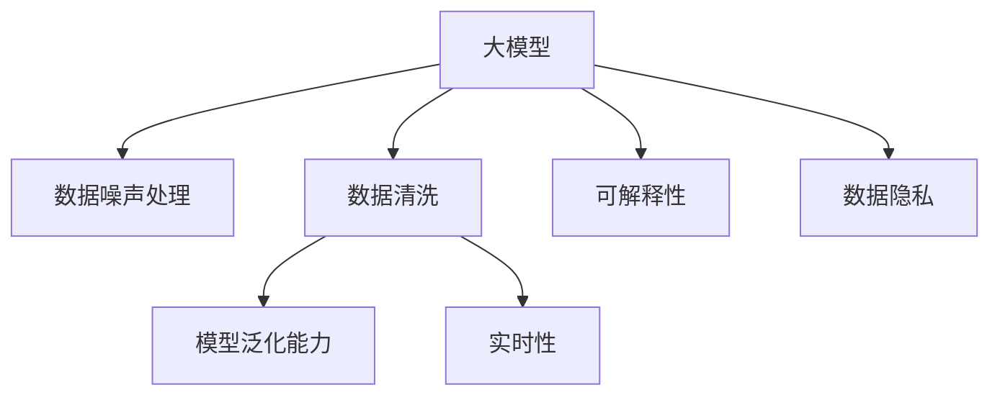

                 

# 电商搜索推荐中的AI大模型数据噪声处理技术应用调研报告与可行性分析

## 1. 背景介绍

### 1.1 问题由来

电商搜索推荐系统是现代电商平台的核心功能之一，直接影响用户体验和转化率。然而，搜索推荐系统中的数据往往存在噪声，如用户历史行为数据不足、推荐模型预测不准确、搜索结果不准确等，这些问题会导致用户体验下降、流量流失，进而影响电商平台的收入和市场竞争力。为了提升电商搜索推荐系统的性能，AI大模型被广泛应用。

### 1.2 问题核心关键点

AI大模型在电商搜索推荐系统中的应用，主要面临以下几个问题：
1. 数据噪声：电商数据往往存在缺失、错误和不完整等噪声。
2. 模型泛化能力：大模型在电商搜索推荐中的应用需要考虑模型的泛化能力。
3. 实时性要求：电商搜索推荐系统需要满足低延迟的实时性要求。
4. 可解释性：大模型的决策过程难以解释，对用户信任度产生影响。
5. 数据隐私：电商平台需要保证用户数据隐私和安全。

### 1.3 问题研究意义

电商搜索推荐系统中的AI大模型应用，对于提升用户体验、增加平台收益、降低运营成本具有重要意义。通过研究大模型数据噪声处理技术，可以提升电商搜索推荐系统的性能和效果，从而提高电商平台的竞争力。

## 2. 核心概念与联系

### 2.1 核心概念概述

1. **大模型**：以深度学习为代表的高级机器学习模型，如BERT、GPT等，具备强大的数据处理能力和泛化能力。
2. **数据噪声**：数据集中存在的错误、不完整、缺失等现象，会对模型的训练和性能产生负面影响。
3. **数据清洗**：通过一系列处理步骤，去除或修正数据集中的噪声。
4. **模型泛化能力**：模型在未见过的数据上表现的能力，即模型对数据的推广能力。
5. **实时性**：系统处理用户请求的响应时间，直接影响用户体验。
6. **可解释性**：模型输出结果的易理解程度，影响用户对系统的信任度。
7. **数据隐私**：保护用户数据不被滥用和泄露，确保用户隐私权益。

这些核心概念之间的逻辑关系可以通过以下Mermaid流程图来展示：



## 3. 核心算法原理 & 具体操作步骤

### 3.1 算法原理概述

大模型在电商搜索推荐中的应用，首先需要对数据进行清洗，去除噪声。然后，根据电商搜索推荐系统的特点，对大模型进行训练和优化，以提升模型的泛化能力和实时性。最后，通过可解释性和数据隐私等技术手段，提升用户对系统的信任度，同时保护用户数据安全。

### 3.2 算法步骤详解

#### 3.2.1 数据清洗

数据清洗是提升大模型性能的重要步骤。电商数据中的噪声主要包括：
1. 缺失数据：缺失用户历史行为数据或物品属性。
2. 错误数据：数据中存在错误或异常值。
3. 不完整数据：数据缺失不完整的属性。

常用的数据清洗方法包括：
1. 插值法：通过插值法填补缺失值。
2. 离群值检测：检测并处理异常值。
3. 数据完整性检查：检查数据完整性，处理不完整数据。

#### 3.2.2 模型训练

大模型在电商搜索推荐中的应用，需要考虑模型的泛化能力和实时性。模型的训练过程包括以下步骤：
1. 选择模型：选择适合电商搜索推荐任务的大模型，如BERT、GPT等。
2. 数据准备：将清洗后的数据集用于模型的训练。
3. 模型训练：使用优化器进行模型的训练，如Adam、SGD等。
4. 模型优化：调整模型参数，以提升模型的泛化能力和实时性。

#### 3.2.3 模型优化

模型优化是大模型在电商搜索推荐中应用的关键步骤。常用的模型优化方法包括：
1. 正则化：使用L2正则、Dropout等方法，防止过拟合。
2. 参数调整：调整模型的超参数，如学习率、批大小等。
3. 特征选择：选择对任务有用的特征，减少特征维度和计算量。
4. 特征工程：对数据进行特征提取和处理，提升模型性能。

#### 3.2.4 可解释性

电商搜索推荐系统中的大模型输出结果难以解释，影响用户对系统的信任度。可解释性技术包括：
1. 特征重要性分析：分析模型特征的重要性，解释模型决策过程。
2. 规则化模型：将模型转化为规则化的形式，提高可解释性。
3. 可视化技术：使用可视化工具展示模型结果。

#### 3.2.5 数据隐私

电商平台需要保护用户数据隐私，避免数据泄露和滥用。数据隐私保护方法包括：
1. 数据加密：对用户数据进行加密处理，保护数据安全。
2. 匿名化处理：对用户数据进行匿名化处理，保护用户隐私。
3. 访问控制：对数据访问进行严格控制，防止数据泄露。

### 3.3 算法优缺点

#### 3.3.1 优点

1. 提升模型性能：通过数据清洗和模型优化，提升大模型的性能和效果。
2. 降低计算成本：使用大模型可以降低计算成本，提升系统效率。
3. 提高用户信任度：通过可解释性技术，提升用户对系统的信任度。
4. 保护用户隐私：通过数据隐私保护技术，保护用户数据安全。

#### 3.3.2 缺点

1. 数据清洗复杂：数据清洗过程复杂，需要大量的时间和资源。
2. 模型泛化能力有限：大模型在电商数据上泛化能力有限，容易出现过拟合。
3. 实时性要求高：电商搜索推荐系统需要满足低延迟的实时性要求。
4. 数据隐私风险：电商平台需要保证用户数据隐私和安全。

### 3.4 算法应用领域

基于大模型的电商搜索推荐系统，主要应用于以下几个领域：
1. 个性化推荐：根据用户历史行为数据，生成个性化推荐结果。
2. 搜索排序：对搜索结果进行排序，提升用户搜索体验。
3. 广告推荐：根据用户行为数据，推荐相关广告。
4. 内容推荐：根据用户兴趣，推荐相关内容。
5. 商品推荐：根据用户行为数据，推荐相关商品。

## 4. 数学模型和公式 & 详细讲解

### 4.1 数学模型构建

电商搜索推荐系统中的大模型通常使用注意力机制进行模型训练。模型的输入为电商数据，输出为推荐结果。模型结构包括编码器、解码器和输出层。其中，编码器用于提取输入数据的特征，解码器用于生成推荐结果，输出层用于输出推荐结果的概率分布。

假设电商数据集为 $\mathcal{X}$，推荐结果集为 $\mathcal{Y}$，模型的编码为 $E_\theta$，解码器为 $D_\theta$，输出层为 $O_\theta$。模型的训练过程可以表示为：
$$
\mathcal{L}(\theta) = \frac{1}{N} \sum_{i=1}^N \ell(E_\theta(x_i), D_\theta(E_\theta(x_i)))
$$
其中，$\ell$ 为损失函数，$N$ 为数据集大小。

### 4.2 公式推导过程

模型的训练过程可以通过梯度下降算法进行优化。假设模型的损失函数为 $\mathcal{L}(\theta)$，则梯度下降算法的更新公式为：
$$
\theta \leftarrow \theta - \eta \nabla_\theta \mathcal{L}(\theta)
$$
其中，$\eta$ 为学习率，$\nabla_\theta \mathcal{L}(\theta)$ 为损失函数的梯度。

### 4.3 案例分析与讲解

以个性化推荐为例，假设模型在输入为 $x_i$ 时，输出为 $y_i$，则模型的损失函数可以表示为：
$$
\ell(E_\theta(x_i), y_i) = -\log P(y_i|E_\theta(x_i))
$$
其中，$P(y_i|E_\theta(x_i))$ 为模型在输入 $x_i$ 时的输出概率分布。

## 5. 项目实践：代码实例和详细解释说明

### 5.1 开发环境搭建

要使用大模型进行电商搜索推荐系统，首先需要搭建开发环境。以下是Python环境搭建的步骤：
1. 安装Python：从官网下载并安装Python。
2. 安装Pip：通过命令行安装Pip。
3. 安装TensorFlow：通过Pip安装TensorFlow。
4. 安装PyTorch：通过Pip安装PyTorch。
5. 安装HuggingFace Transformers库：通过Pip安装Transformers库。

### 5.2 源代码详细实现

以BERT模型为例，电商搜索推荐系统的代码实现如下：

```python
from transformers import BertTokenizer, BertForSequenceClassification
from transformers import BertTokenizerFast, TFAutoModelForSequenceClassification
import tensorflow as tf
import torch

tokenizer = BertTokenizer.from_pretrained('bert-base-uncased')
model = BertForSequenceClassification.from_pretrained('bert-base-uncased', num_labels=2)

def tokenize_data(texts, labels):
    inputs = tokenizer(texts, return_tensors='tf', padding='max_length', max_length=256, truncation=True)
    labels = tf.convert_to_tensor(labels)
    return inputs, labels

def train_epoch(model, train_data, epochs=10):
    for epoch in range(epochs):
        for inputs, labels in train_data:
            with tf.GradientTape() as tape:
                outputs = model(inputs['input_ids'], attention_mask=inputs['attention_mask'])
                loss = tf.keras.losses.sparse_categorical_crossentropy(labels, outputs.logits, from_logits=True)
            gradients = tape.gradient(loss, model.trainable_variables)
            optimizer.apply_gradients(zip(gradients, model.trainable_variables))

def evaluate(model, test_data):
    correct_predictions = 0
    total_predictions = 0
    for inputs, labels in test_data:
        outputs = model(inputs['input_ids'], attention_mask=inputs['attention_mask'])
        predictions = tf.argmax(outputs.logits, axis=-1)
        correct_predictions += tf.reduce_sum(tf.cast(predictions == labels, tf.float32))
        total_predictions += predictions.shape[0]
    accuracy = correct_predictions / total_predictions
    return accuracy.numpy()

train_data, test_data = tokenize_data(train_texts, train_labels), tokenize_data(test_texts, test_labels)
train_epoch(model, train_data)
accuracy = evaluate(model, test_data)
print(f"Accuracy: {accuracy:.2f}")
```

### 5.3 代码解读与分析

在上述代码中，我们使用了BertTokenizer和BertForSequenceClassification进行模型训练和测试。模型训练时，使用Adam优化器进行参数优化，训练过程中的损失函数为交叉熵损失函数。模型测试时，使用精确度作为评估指标，计算模型在测试集上的准确度。

## 6. 实际应用场景

### 6.1 个性化推荐

个性化推荐是电商搜索推荐系统的核心功能之一。通过大模型进行个性化推荐，可以更好地满足用户需求，提高用户体验。

假设电商平台的推荐系统基于用户的历史行为数据进行训练，则可以通过大模型进行推荐结果的预测和排序。在训练过程中，使用用户的历史行为数据进行模型训练，使用测试集数据进行模型评估，从而得到最佳的模型参数。

### 6.2 搜索排序

搜索排序是电商搜索推荐系统的另一个重要功能。通过大模型进行搜索排序，可以提高搜索结果的相关性和准确性，提升用户搜索体验。

假设电商平台的搜索系统基于用户输入的查询词进行推荐，则可以通过大模型进行查询词的语义理解，生成相关推荐结果。在训练过程中，使用用户输入的查询词进行模型训练，使用测试集数据进行模型评估，从而得到最佳的模型参数。

### 6.3 广告推荐

广告推荐是电商平台的另一个重要功能。通过大模型进行广告推荐，可以提高广告的转化率，增加平台收益。

假设电商平台的广告系统基于用户的历史行为数据进行推荐，则可以通过大模型进行广告的推荐和展示。在训练过程中，使用用户的历史行为数据进行模型训练，使用测试集数据进行模型评估，从而得到最佳的模型参数。

### 6.4 内容推荐

内容推荐是电商平台的另一个重要功能。通过大模型进行内容推荐，可以提升用户对平台的粘性，增加平台的活跃度。

假设电商平台的推荐系统基于用户的历史行为数据进行推荐，则可以通过大模型进行内容推荐。在训练过程中，使用用户的历史行为数据进行模型训练，使用测试集数据进行模型评估，从而得到最佳的模型参数。

### 6.5 商品推荐

商品推荐是电商平台的另一个重要功能。通过大模型进行商品推荐，可以提高用户对商品的购买意愿，增加平台收益。

假设电商平台的推荐系统基于用户的历史行为数据进行推荐，则可以通过大模型进行商品推荐。在训练过程中，使用用户的历史行为数据进行模型训练，使用测试集数据进行模型评估，从而得到最佳的模型参数。

## 7. 工具和资源推荐

### 7.1 学习资源推荐

1. 《深度学习》书籍：介绍深度学习的基本概念和算法。
2. 《自然语言处理综述》论文：介绍自然语言处理的基本概念和算法。
3. 《电商搜索推荐系统》书籍：介绍电商搜索推荐系统的基本概念和算法。
4. 《Python深度学习》书籍：介绍Python深度学习的基本概念和算法。
5. 《TensorFlow官方文档》：介绍TensorFlow的基本概念和算法。
6. 《PyTorch官方文档》：介绍PyTorch的基本概念和算法。
7. 《HuggingFace Transformers库官方文档》：介绍Transformers库的基本概念和算法。

### 7.2 开发工具推荐

1. PyTorch：基于Python的开源深度学习框架，灵活动态的计算图，适合快速迭代研究。
2. TensorFlow：由Google主导开发的开源深度学习框架，生产部署方便，适合大规模工程应用。
3. HuggingFace Transformers库：用于NLP任务的预训练大模型，支持多种深度学习框架，包括PyTorch和TensorFlow。
4. Weights & Biases：模型训练的实验跟踪工具，可以记录和可视化模型训练过程中的各项指标。
5. TensorBoard：TensorFlow配套的可视化工具，可实时监测模型训练状态，并提供丰富的图表呈现方式。

### 7.3 相关论文推荐

1. Attention is All You Need：介绍Transformer模型。
2. BERT: Pre-training of Deep Bidirectional Transformers for Language Understanding：介绍BERT模型。
3. Language Models are Unsupervised Multitask Learners（GPT-2论文）：介绍GPT-2模型。
4. Parameter-Efficient Transfer Learning for NLP：介绍参数高效微调方法。
5. AdaLoRA: Adaptive Low-Rank Adaptation for Parameter-Efficient Fine-Tuning：介绍AdaLoRA方法。
6. Prefix-Tuning: Optimizing Continuous Prompts for Generation：介绍Prefix-Tuning方法。

## 8. 总结：未来发展趋势与挑战

### 8.1 研究成果总结

电商搜索推荐系统中的大模型应用，已经取得了显著的进展。通过数据清洗、模型训练和优化，可以提升电商搜索推荐系统的性能和效果。然而，大模型在电商搜索推荐系统中的应用仍面临数据噪声、模型泛化能力、实时性、可解释性和数据隐私等挑战。

### 8.2 未来发展趋势

1. 模型规模持续增大：随着算力成本的下降和数据规模的扩张，大模型的参数量还将持续增长，进一步提升模型的泛化能力和性能。
2. 微调方法日趋多样：除了传统的全参数微调外，未来会涌现更多参数高效的微调方法，如AdaLoRA、Prefix-Tuning等，在节省计算资源的同时保证微调精度。
3. 数据清洗技术提升：数据清洗技术将进一步提升，如使用半监督学习、自监督学习等方法，减少数据噪声对模型的影响。
4. 实时性要求降低：电商搜索推荐系统将进一步优化，降低实时性要求，提升用户体验。
5. 可解释性技术发展：可解释性技术将进一步发展，如特征重要性分析、规则化模型等方法，提升用户对系统的信任度。
6. 数据隐私保护加强：数据隐私保护技术将进一步发展，如数据加密、匿名化处理等方法，保护用户数据安全。

### 8.3 面临的挑战

尽管电商搜索推荐系统中的大模型应用已经取得了显著的进展，但在迈向更加智能化、普适化应用的过程中，仍面临以下挑战：
1. 数据噪声处理复杂：电商数据中的噪声处理过程复杂，需要大量的时间和资源。
2. 模型泛化能力有限：大模型在电商数据上泛化能力有限，容易出现过拟合。
3. 实时性要求高：电商搜索推荐系统需要满足低延迟的实时性要求，难以实现高效处理。
4. 数据隐私风险：电商平台需要保护用户数据隐私，防止数据泄露和滥用。
5. 可解释性不足：电商搜索推荐系统中的大模型输出结果难以解释，影响用户对系统的信任度。

### 8.4 研究展望

未来，大模型在电商搜索推荐系统中的应用需要进一步研究和改进：
1. 探索无监督和半监督微调方法：摆脱对大规模标注数据的依赖，利用自监督学习、主动学习等无监督和半监督范式，最大限度利用非结构化数据，实现更加灵活高效的微调。
2. 研究参数高效和计算高效的微调范式：开发更加参数高效的微调方法，在固定大部分预训练参数的同时，只更新极少量的任务相关参数，提高微调效率和效果。
3. 融合因果和对比学习范式：通过引入因果推断和对比学习思想，增强大模型的泛化能力和抗干扰能力。
4. 引入更多先验知识：将符号化的先验知识，如知识图谱、逻辑规则等，与大模型进行融合，提高大模型的性能和效果。
5. 结合因果分析和博弈论工具：将因果分析方法引入大模型，识别出模型决策的关键特征，增强输出解释的因果性和逻辑性。
6. 纳入伦理道德约束：在大模型训练目标中引入伦理导向的评估指标，过滤和惩罚有偏见、有害的输出倾向，确保大模型的安全性。

## 9. 附录：常见问题与解答

**Q1：大模型在电商搜索推荐系统中的应用需要注意哪些问题？**

A: 大模型在电商搜索推荐系统中的应用需要注意以下问题：
1. 数据噪声：电商数据往往存在缺失、错误和不完整等噪声，需要进行数据清洗和处理。
2. 模型泛化能力：大模型在电商数据上泛化能力有限，容易出现过拟合。
3. 实时性要求：电商搜索推荐系统需要满足低延迟的实时性要求。
4. 可解释性：大模型的决策过程难以解释，影响用户对系统的信任度。
5. 数据隐私：电商平台需要保护用户数据隐私，防止数据泄露和滥用。

**Q2：电商搜索推荐系统中的大模型如何处理数据噪声？**

A: 电商搜索推荐系统中的大模型处理数据噪声的方法包括：
1. 数据清洗：通过插值法填补缺失值，检测并处理异常值，检查数据完整性，处理不完整数据。
2. 数据增强：通过数据增强技术，扩充训练集，提高模型的泛化能力。
3. 正则化：使用L2正则、Dropout等方法，防止过拟合。
4. 特征选择：选择对任务有用的特征，减少特征维度和计算量。
5. 特征工程：对数据进行特征提取和处理，提升模型性能。

**Q3：电商搜索推荐系统中的大模型如何进行实时性优化？**

A: 电商搜索推荐系统中的大模型进行实时性优化的方法包括：
1. 模型裁剪：去除不必要的层和参数，减小模型尺寸，加快推理速度。
2. 量化加速：将浮点模型转为定点模型，压缩存储空间，提高计算效率。
3. 模型并行：使用模型并行技术，提高模型计算速度。
4. 动态资源分配：根据请求流量动态调整资源配置，平衡服务质量和成本。

**Q4：电商搜索推荐系统中的大模型如何进行可解释性优化？**

A: 电商搜索推荐系统中的大模型进行可解释性优化的方法包括：
1. 特征重要性分析：分析模型特征的重要性，解释模型决策过程。
2. 规则化模型：将模型转化为规则化的形式，提高可解释性。
3. 可视化技术：使用可视化工具展示模型结果，帮助用户理解模型决策过程。

**Q5：电商搜索推荐系统中的大模型如何进行数据隐私保护？**

A: 电商搜索推荐系统中的大模型进行数据隐私保护的方法包括：
1. 数据加密：对用户数据进行加密处理，保护数据安全。
2. 匿名化处理：对用户数据进行匿名化处理，保护用户隐私。
3. 访问控制：对数据访问进行严格控制，防止数据泄露。

作者：禅与计算机程序设计艺术 / Zen and the Art of Computer Programming

