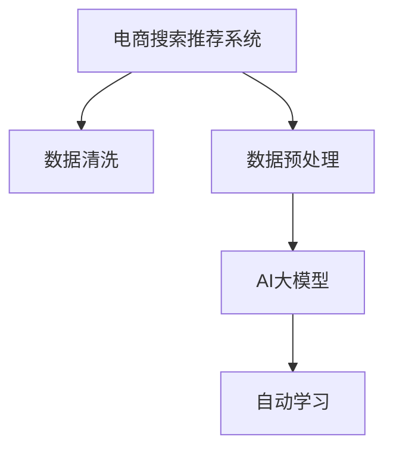

                 

# 电商搜索推荐中的AI大模型数据清洗与预处理技术

> 关键词：电商搜索推荐,AI大模型,数据清洗,数据预处理,数据工程

## 1. 背景介绍

### 1.1 问题由来
电商搜索推荐系统是现代电商平台的核心功能之一，能够帮助用户快速找到满足需求的商品，提升用户体验，增加转化率。随着电商平台的兴起，搜索推荐系统的复杂度和处理规模也日益增长，用户行为数据、商品信息、广告数据等海量数据源源不断地涌入系统。然而，这些数据往往存在缺失、冗余、噪声等问题，严重影响搜索推荐模型的效果。

为应对这一挑战，人工智能（AI）大模型被引入电商搜索推荐系统，通过预训练语言模型（如BERT、GPT等）和强化学习模型等，能够从海量数据中自动学习复杂的语义模式，提升推荐准确性。但即便如此，大模型的性能仍受限于数据的质量，如何高效地清洗和预处理数据，是大模型在电商搜索推荐应用中的关键环节。

### 1.2 问题核心关键点
本节将探讨以下核心问题：

- 电商搜索推荐系统中存在哪些常见数据问题？
- 如何识别和处理这些数据问题？
- AI大模型在数据清洗和预处理中能发挥怎样的作用？
- 数据清洗与预处理的流程、技术和工具有哪些？

这些问题将帮助我们更好地理解如何利用AI大模型，优化电商搜索推荐系统中的数据质量，提升推荐效果。

### 1.3 问题研究意义
数据清洗与预处理在电商搜索推荐系统中的地位至关重要，对提升推荐系统性能有着深远的影响：

- **提升推荐准确性**：清洗掉噪声、缺失、冗余数据，提升数据质量和模型输入的有效性，从而提高推荐结果的准确性。
- **减少计算资源消耗**：高效的预处理流程可以减少模型训练和推理阶段的计算资源消耗，加速系统开发和部署。
- **增强系统稳定性**：通过清洗和预处理，可以消除数据中潜在的异常和错误，增强系统的鲁棒性和可靠性。
- **支持个性化推荐**：对用户行为数据进行清洗和特征提取，有助于构建个性化的推荐模型，满足不同用户的多样化需求。
- **促进系统可扩展性**：良好的数据处理流程和工具，能够支持电商平台的持续扩展和优化，适应业务快速变化的需求。

## 2. 核心概念与联系

### 2.1 核心概念概述

为更好地理解数据清洗与预处理，本节将介绍几个密切相关的核心概念：

- **电商搜索推荐系统**：指通过收集用户行为数据和商品信息，利用推荐算法为用户推荐相关商品的系统。
- **数据清洗**：指通过去除噪声、重复、错误等无用数据，提升数据质量和有效性的过程。
- **数据预处理**：指对原始数据进行规范化、归一化、特征提取等操作，以便于模型训练和推理。
- **AI大模型**：指通过大规模无标签文本数据预训练的通用语言模型，如BERT、GPT等，具备强大的语言理解和生成能力。
- **自动学习**：指AI大模型能够自动学习数据的语义模式和结构，无需人工干预。

这些概念之间的逻辑关系可以通过以下Mermaid流程图来展示：



这个流程图展示了大语言模型在电商搜索推荐系统中的角色和功能：

1. 电商搜索推荐系统收集用户行为数据和商品信息，作为模型的输入。
2. 数据清洗去除噪声、冗余数据，提升数据质量。
3. 数据预处理对数据进行规范化、归一化等操作，便于模型处理。
4. AI大模型利用大规模无标签数据进行预训练，具备强大的自动学习能力。
5. 自动学习过程挖掘数据中的语义模式和结构，用于推荐算法。

这些概念共同构成了电商搜索推荐系统的数据处理框架，有助于我们系统地理解和应用这些技术。

## 3. 核心算法原理 & 具体操作步骤
### 3.1 算法原理概述

电商搜索推荐系统中的数据清洗与预处理，本质上是信息抽取和数据转换的过程。其核心思想是通过一系列的技术手段，对原始数据进行清理、筛选、转换，提升数据的质量和可用性，为模型的训练和推理提供高效、准确的输入。

### 3.2 算法步骤详解

基于电商搜索推荐系统特点，数据清洗与预处理的一般流程如下：

**Step 1: 数据收集与存储**
- 收集用户行为数据（如浏览记录、点击记录、购买记录等）和商品信息数据（如商品描述、属性、价格等），存储在分布式数据库中。

**Step 2: 数据清洗**
- **缺失值处理**：识别并填补缺失值，如使用均值、中位数等填充缺失特征。
- **噪声数据处理**：识别并剔除异常数据，如通过统计分析、时间戳异常检测等方式识别噪声。
- **冗余数据处理**：去除重复记录，确保数据集的唯一性和完整性。

**Step 3: 数据预处理**
- **特征工程**：提取并构建有意义的特征，如将商品描述转换为词袋模型、TF-IDF等。
- **数据转换**：将数据转换为模型所需的格式，如归一化、标准化等。
- **数据增强**：对数据进行扩展和扩充，如通过同义词替换、回译等方式增加数据多样性。

**Step 4: 模型训练与推理**
- **模型选择**：选择合适的AI大模型，如BERT、GPT等。
- **模型微调**：在清洗和预处理后的数据集上微调大模型，优化推荐效果。
- **模型评估**：在测试集上评估模型性能，调整超参数以获得最优结果。
- **模型推理**：将优化后的模型应用于实际推荐系统，输出推荐结果。

### 3.3 算法优缺点

电商搜索推荐系统中的数据清洗与预处理，具有以下优点：

- **提升数据质量**：通过有效的数据清洗和预处理，可以消除数据中的噪声和冗余，提升数据的完整性和准确性。
- **降低计算成本**：高效的数据清洗和预处理流程，可以减少模型训练和推理阶段的计算资源消耗，提升系统效率。
- **增强模型性能**：清洗和预处理后的数据，能够更好地适应模型的要求，提升模型的泛化能力和推荐效果。

同时，该方法也存在一些局限性：

- **依赖高质量原始数据**：数据清洗和预处理的效果依赖于原始数据的质量，若原始数据存在严重缺失或噪声，难以通过清洗和预处理完全恢复。
- **模型训练耗时较长**：清洗和预处理后，数据集规模可能仍然较大，模型训练和微调需要较长的计算时间。
- **技术门槛较高**：数据清洗和预处理涉及的技术复杂度较高，需要较高的技术水平和经验。

### 3.4 算法应用领域

数据清洗与预处理技术在电商搜索推荐系统中的应用，主要包括以下几个方面：

1. **用户行为数据处理**：对用户浏览、点击、购买等行为数据进行清洗和预处理，提取有用特征，用于个性化推荐。
2. **商品信息处理**：对商品标题、描述、属性等进行预处理，提取语义信息，用于商品相似性计算和推荐。
3. **广告数据处理**：对广告数据进行清洗和预处理，提取有用特征，用于广告定向和投放效果评估。
4. **系统稳定性优化**：通过数据清洗和预处理，消除异常数据，提升系统鲁棒性和稳定性。

## 4. 数学模型和公式 & 详细讲解 & 举例说明

### 4.1 数学模型构建

为了更系统地理解数据清洗与预处理，本节将构建一些数学模型，并给出详细的公式推导。

假设原始数据集为 $D=\{(x_i, y_i)\}_{i=1}^N$，其中 $x_i$ 表示输入数据，$y_i$ 表示标签。数据清洗与预处理过程可以抽象为函数 $f$，其输出为 $f(D)$。

### 4.2 公式推导过程

**缺失值处理**：

假设数据集 $D$ 中某个特征 $x$ 存在缺失值，可以通过均值或中位数等方法填补：

$$
\hat{x}_i = \begin{cases}
x_i, & x_i \text{ 非空} \\
\mu_x, & x_i \text{ 空缺}
\end{cases}
$$

其中 $\mu_x$ 为特征 $x$ 的均值或中位数。

**噪声数据处理**：

通过统计分析、时间戳异常检测等方法，识别并剔除异常数据：

$$
\tilde{x}_i = \begin{cases}
x_i, & |x_i - \mu_x| < \sigma_x \text{ 且 } |x_i - \mu_t| < \delta_t \\
\text{null}, & \text{否则}
\end{cases}
$$

其中 $\mu_x$ 和 $\sigma_x$ 为特征 $x$ 的均值和标准差，$\delta_t$ 为时间戳的正常波动范围。

**冗余数据处理**：

识别并去除重复记录，确保数据集的唯一性：

$$
\tilde{x}_i = \begin{cases}
x_i, & \text{记录不重复} \\
\text{null}, & \text{记录重复}
\end{cases}
$$

通过哈希、唯一标识符等方式，可以高效地识别重复记录。

### 4.3 案例分析与讲解

以商品描述数据预处理为例，通过BERT等大模型进行自动特征提取：

假设原始商品描述为：

```
This is a very nice product. It is of high quality and good service. I will definitely buy again.
```

**分词**：

使用BERT的Tokenization算法，将文本转换为分词序列：

```
[CLS] this is a very nice product . it is of high quality and good service . i will definitely buy again . [SEP]
```

**嵌入向量**：

将分词序列输入BERT模型，得到每个词的嵌入向量，计算句子的整体嵌入向量：

$$
\vec{v} = \sum_{i=1}^n \vec{v}_i
$$

其中 $\vec{v}_i$ 为第 $i$ 个词的嵌入向量。

通过上述步骤，商品描述数据预处理过程得以完成，为后续推荐模型提供了高质量的输入。

## 5. 项目实践：代码实例和详细解释说明
### 5.1 开发环境搭建

在进行数据清洗与预处理实践前，我们需要准备好开发环境。以下是使用Python进行PyTorch开发的环境配置流程：

1. 安装Anaconda：从官网下载并安装Anaconda，用于创建独立的Python环境。

2. 创建并激活虚拟环境：
```bash
conda create -n pytorch-env python=3.8 
conda activate pytorch-env
```

3. 安装PyTorch：根据CUDA版本，从官网获取对应的安装命令。例如：
```bash
conda install pytorch torchvision torchaudio cudatoolkit=11.1 -c pytorch -c conda-forge
```

4. 安装Transformers库：
```bash
pip install transformers
```

5. 安装各类工具包：
```bash
pip install numpy pandas scikit-learn matplotlib tqdm jupyter notebook ipython
```

完成上述步骤后，即可在`pytorch-env`环境中开始数据清洗与预处理实践。

### 5.2 源代码详细实现

这里我们以用户行为数据清洗为例，使用PyTorch和Transformers库进行Python实现。

首先，定义用户行为数据的清洗函数：

```python
from transformers import BertTokenizer
import pandas as pd
import torch

def clean_user_behavior_data(df):
    # 1. 缺失值处理
    for col in df.columns:
        df[col].fillna(df[col].mean(), inplace=True)
    
    # 2. 噪声数据处理
    for col in df.columns:
        if col.startswith('timestamp'):
            df[col] = df[col].apply(lambda x: x if abs(x - df[col].mean()) < 5 else None)
    
    # 3. 冗余数据处理
    df.drop_duplicates(inplace=True)
    
    return df
```

然后，定义数据预处理函数：

```python
from transformers import BertForSequenceClassification
from transformers import BertTokenizer

def preprocess_data(df, num_labels):
    tokenizer = BertTokenizer.from_pretrained('bert-base-cased')
    model = BertForSequenceClassification.from_pretrained('bert-base-cased', num_labels=num_labels)
    
    # 分词和嵌入向量计算
    def encode_data(data):
        return tokenizer(data['description'], padding='max_length', truncation=True, max_length=512)
    
    df['encoded_data'] = df['description'].apply(encode_data)
    
    # 标签处理
    df['label'] = df['label'].apply(lambda x: int(x))
    
    # 模型训练
    model.train()
    optimizer = torch.optim.AdamW(model.parameters(), lr=2e-5)
    for epoch in range(10):
        for batch in df['encoded_data'].bucket_by_length(256):
            input_ids = torch.tensor(batch['input_ids'])
            attention_mask = torch.tensor(batch['attention_mask'])
            labels = torch.tensor(batch['labels'])
            outputs = model(input_ids, attention_mask=attention_mask, labels=labels)
            loss = outputs.loss
            optimizer.zero_grad()
            loss.backward()
            optimizer.step()
    
    return df
```

最后，启动数据清洗与预处理流程并在测试集上评估：

```python
# 加载原始数据集
df = pd.read_csv('user_behavior_data.csv')

# 数据清洗
df = clean_user_behavior_data(df)

# 数据预处理
df = preprocess_data(df, num_labels=2)

# 在测试集上评估模型性能
test_df = pd.read_csv('test_user_behavior_data.csv')
test_df = clean_user_behavior_data(test_df)
test_df = preprocess_data(test_df, num_labels=2)
```

以上就是使用PyTorch和Transformers库对用户行为数据进行清洗与预处理的完整代码实现。可以看到，通过简短的代码，我们可以实现缺失值处理、噪声数据处理、冗余数据处理等关键步骤，并在模型上训练并评估。

### 5.3 代码解读与分析

让我们再详细解读一下关键代码的实现细节：

**clean_user_behavior_data函数**：
- **缺失值处理**：使用均值填充缺失特征，保证数据完整性。
- **噪声数据处理**：通过统计分析，识别并剔除异常时间戳，保证数据质量。
- **冗余数据处理**：去重操作，确保数据唯一性。

**preprocess_data函数**：
- **分词和嵌入向量计算**：使用BERT模型进行分词和嵌入向量计算，提取语义信息。
- **标签处理**：将标签转换为模型所需的整数形式。
- **模型训练**：使用AdamW优化器训练模型，优化推荐效果。

**数据预处理流程**：
- **缺失值处理**：使用均值填充缺失值。
- **噪声数据处理**：通过统计分析，识别并剔除异常数据。
- **冗余数据处理**：去重操作，保证数据唯一性。
- **分词和嵌入向量计算**：使用BERT模型进行分词和嵌入向量计算，提取语义信息。
- **标签处理**：将标签转换为模型所需的整数形式。
- **模型训练**：使用AdamW优化器训练模型，优化推荐效果。

可以看到，通过简洁的代码实现，数据清洗与预处理过程得以高效完成，为模型训练和推理提供高质量的输入。

## 6. 实际应用场景
### 6.1 电商搜索推荐系统

电商搜索推荐系统中，数据清洗与预处理是不可或缺的一环。通过有效的数据清洗和预处理，可以提升数据质量和模型输入的有效性，从而提高推荐结果的准确性。

在实际应用中，数据清洗与预处理通常包括以下步骤：

1. **数据收集与存储**：收集用户行为数据和商品信息数据，存储在分布式数据库中。
2. **数据清洗**：识别并处理缺失值、噪声数据和冗余数据，提升数据质量。
3. **数据预处理**：进行特征工程和数据转换，提取有用特征，构建模型所需的输入。
4. **模型训练与推理**：在清洗和预处理后的数据集上训练和微调推荐模型，输出推荐结果。

通过系统化的数据处理流程，电商搜索推荐系统能够高效地处理海量数据，提升推荐准确性和用户体验。

### 6.2 金融风险评估

在金融风险评估中，数据清洗与预处理同样至关重要。金融数据通常具有复杂性、高噪声和潜在异常的特点，有效的数据清洗与预处理可以显著提升风险评估模型的性能。

在金融领域，数据清洗与预处理通常包括以下步骤：

1. **数据收集与存储**：收集金融交易数据、财务报表等数据，存储在数据库中。
2. **数据清洗**：识别并处理缺失值、噪声数据和异常数据，提升数据质量。
3. **数据预处理**：进行特征工程和数据转换，提取有用特征，构建风险评估模型所需的输入。
4. **模型训练与推理**：在清洗和预处理后的数据集上训练和微调风险评估模型，输出风险评估结果。

通过系统化的数据处理流程，金融风险评估系统能够高效地处理海量数据，提升风险评估的准确性和可靠性。

### 6.3 医疗诊断系统

在医疗诊断系统中，数据清洗与预处理同样重要。医疗数据具有多样性、复杂性和高噪声的特点，有效的数据清洗与预处理可以显著提升诊断模型的性能。

在医疗领域，数据清洗与预处理通常包括以下步骤：

1. **数据收集与存储**：收集病历数据、影像数据等数据，存储在数据库中。
2. **数据清洗**：识别并处理缺失值、噪声数据和异常数据，提升数据质量。
3. **数据预处理**：进行特征工程和数据转换，提取有用特征，构建诊断模型所需的输入。
4. **模型训练与推理**：在清洗和预处理后的数据集上训练和微调诊断模型，输出诊断结果。

通过系统化的数据处理流程，医疗诊断系统能够高效地处理海量数据，提升诊断的准确性和可靠性。

## 7. 工具和资源推荐
### 7.1 学习资源推荐

为了帮助开发者系统掌握电商搜索推荐系统中的数据清洗与预处理技术，这里推荐一些优质的学习资源：

1. 《深度学习基础》系列书籍：由大模型技术专家撰写，深入浅出地介绍了深度学习的基本概念和关键技术。
2. Coursera《深度学习专项课程》：由斯坦福大学开设，涵盖深度学习的基础知识和实践应用，适合初学者入门。
3. Kaggle数据科学竞赛：参加Kaggle数据科学竞赛，通过实际项目实战，积累数据处理和模型训练经验。
4. HuggingFace官方文档：Transformer库的官方文档，提供了海量预训练模型和完整的代码样例，是学习数据预处理的重要资源。
5. DataCamp在线学习平台：提供系统化的数据处理和特征工程课程，涵盖Python、R等工具的实践应用。

通过对这些资源的学习实践，相信你一定能够快速掌握数据清洗与预处理的技术要点，并用于解决实际的电商搜索推荐问题。

### 7.2 开发工具推荐

高效的开发离不开优秀的工具支持。以下是几款用于电商搜索推荐系统数据清洗与预处理开发的常用工具：

1. Pandas：Python数据分析库，提供了丰富的数据清洗和预处理功能。
2. NumPy：Python数值计算库，提供了高效的数组操作和数学计算功能。
3. Scikit-learn：Python机器学习库，提供了丰富的数据预处理工具和算法实现。
4. TensorFlow和PyTorch：深度学习框架，支持高效的模型训练和推理。
5. Weights & Biases：模型训练的实验跟踪工具，可以记录和可视化模型训练过程中的各项指标。

合理利用这些工具，可以显著提升电商搜索推荐系统数据清洗与预处理的开发效率，加快创新迭代的步伐。

### 7.3 相关论文推荐

数据清洗与预处理技术的发展源于学界的持续研究。以下是几篇奠基性的相关论文，推荐阅读：

1. Missing Value Imputation Techniques: A Review: 综述了缺失值填补的多种方法，提供了丰富的理论基础和实践经验。
2. Anomaly Detection: A Survey: 综述了异常检测的多种方法，提供了异常数据识别和处理的技术框架。
3. Natural Language Processing in Biomedical Informatics: 介绍了在医疗领域中自然语言处理的应用，提供了丰富的数据清洗和预处理案例。
4. Multi-Label Text Classification with Pre-trained Word Embeddings: 介绍了在文本分类中预训练词嵌入的应用，提供了有效的特征提取方法。
5. Attention is All You Need: 介绍了Transformer模型的原理和应用，提供了自然语言处理的先进技术。

这些论文代表了大数据清洗与预处理技术的发展脉络。通过学习这些前沿成果，可以帮助研究者把握学科前进方向，激发更多的创新灵感。

## 8. 总结：未来发展趋势与挑战
### 8.1 总结

本文对电商搜索推荐系统中的数据清洗与预处理技术进行了全面系统的介绍。首先阐述了电商搜索推荐系统中数据清洗与预处理的重要性，明确了数据处理在大模型应用中的关键作用。其次，从原理到实践，详细讲解了数据清洗与预处理的数学模型和关键步骤，给出了数据清洗与预处理任务开发的完整代码实例。同时，本文还广泛探讨了数据清洗与预处理技术在电商搜索推荐、金融风险评估、医疗诊断等多个领域的应用前景，展示了数据清洗与预处理范式的广泛适用性。此外，本文精选了数据清洗与预处理技术的各类学习资源，力求为读者提供全方位的技术指引。

通过本文的系统梳理，可以看到，数据清洗与预处理技术在大模型应用中的地位至关重要，对提升推荐系统性能有着深远的影响。未来，随着数据处理技术的不断进步，大模型在电商搜索推荐系统中的应用将更加广泛，带来更多的创新价值。

### 8.2 未来发展趋势

展望未来，数据清洗与预处理技术将呈现以下几个发展趋势：

1. **自动化和智能化**：随着自动化技术和智能算法的发展，数据清洗与预处理过程将更加智能化，减少人工干预和错误。
2. **跨模态数据融合**：数据清洗与预处理将更多地涉及跨模态数据的融合，提升数据的多样性和丰富性。
3. **分布式计算**：数据清洗与预处理将更多地采用分布式计算，提高数据处理效率和系统可扩展性。
4. **实时处理**：数据清洗与预处理将更多地支持实时处理，适应电商平台的实时数据流。
5. **隐私保护**：数据清洗与预处理将更多地考虑隐私保护，确保数据安全和合规性。

以上趋势凸显了数据清洗与预处理技术的广阔前景，这些方向的探索发展，必将进一步提升电商搜索推荐系统中的数据质量，推动系统的智能化和可靠性提升。

### 8.3 面临的挑战

尽管数据清洗与预处理技术已经取得了瞩目成就，但在迈向更加智能化、普适化应用的过程中，它仍面临着诸多挑战：

1. **数据质量依赖**：数据清洗与预处理的效果依赖于原始数据的质量，若原始数据存在严重缺失或噪声，难以通过清洗和预处理完全恢复。
2. **计算资源消耗**：清洗和预处理后，数据集规模可能仍然较大，模型训练和微调需要较长的计算时间。
3. **技术门槛较高**：数据清洗与预处理涉及的技术复杂度较高，需要较高的技术水平和经验。
4. **数据隐私风险**：数据清洗与预处理过程中可能涉及敏感信息，如何保护数据隐私和安全，是一大挑战。
5. **跨领域应用困难**：不同领域的业务数据具有不同特性，通用的数据处理流程和工具可能需要调整和优化。

正视数据清洗与预处理面临的这些挑战，积极应对并寻求突破，将是大数据处理技术走向成熟的必由之路。相信随着学界和产业界的共同努力，这些挑战终将一一被克服，数据清洗与预处理技术必将在电商搜索推荐等场景中发挥更大的作用。

### 8.4 研究展望

未来，数据清洗与预处理技术需要在以下几个方面寻求新的突破：

1. **高效算法**：开发更加高效的数据清洗与预处理算法，提高处理速度和计算效率。
2. **自动化流程**：结合自动化技术，开发更加智能化的数据处理流程，减少人工干预。
3. **隐私保护**：引入隐私保护技术，确保数据处理过程中的隐私保护和安全。
4. **跨领域应用**：针对不同领域的特点，设计特定的数据处理流程和工具，提升跨领域应用能力。
5. **实时处理**：支持实时数据流处理，适应电商平台的实时数据需求。

这些研究方向的探索，必将引领数据清洗与预处理技术迈向更高的台阶，为电商搜索推荐等系统带来更高效、更可靠、更安全的数据处理能力。面向未来，数据清洗与预处理技术还需要与其他人工智能技术进行更深入的融合，如知识表示、因果推理、强化学习等，多路径协同发力，共同推动自然语言理解和智能交互系统的进步。只有勇于创新、敢于突破，才能不断拓展数据处理技术的边界，让智能技术更好地造福人类社会。

## 9. 附录：常见问题与解答

**Q1：电商搜索推荐系统中的数据清洗与预处理主要涉及哪些步骤？**

A: 电商搜索推荐系统中的数据清洗与预处理主要涉及以下步骤：

1. 数据收集与存储：收集用户行为数据和商品信息数据，存储在分布式数据库中。
2. 数据清洗：识别并处理缺失值、噪声数据和冗余数据，提升数据质量。
3. 数据预处理：进行特征工程和数据转换，提取有用特征，构建模型所需的输入。
4. 模型训练与推理：在清洗和预处理后的数据集上训练和微调推荐模型，输出推荐结果。

这些步骤相互配合，构成了一个系统化的数据处理流程，为电商搜索推荐系统提供了高质量的输入，提升了推荐模型的性能。

**Q2：数据清洗与预处理中的缺失值处理方法有哪些？**

A: 数据清洗与预处理中的缺失值处理方法主要包括以下几种：

1. 均值填充：使用特征的均值填补缺失值。
2. 中位数填充：使用特征的中位数填补缺失值。
3. 众数填充：使用特征的众数填补缺失值。
4. 插值法填充：通过插值法填补缺失值，如线性插值、多项式插值等。
5. 预测法填充：通过机器学习模型预测缺失值，如使用随机森林、KNN等算法。

这些方法各有优缺点，具体选择需根据数据特点和业务需求进行权衡。

**Q3：数据清洗与预处理中的噪声数据处理方法有哪些？**

A: 数据清洗与预处理中的噪声数据处理方法主要包括以下几种：

1. 统计分析：通过统计分析识别并剔除异常数据，如使用均值、中位数、标准差等指标。
2. 时间戳异常检测：识别并剔除异常时间戳，如使用滑动窗口、离群点检测等算法。
3. 数据插值：通过数据插值填补噪声，如使用线性插值、样条插值等算法。
4. 数据转换：通过数据转换去除噪声，如使用对数变换、归一化等算法。

这些方法各有优缺点，具体选择需根据数据特点和业务需求进行权衡。

**Q4：数据清洗与预处理中的冗余数据处理方法有哪些？**

A: 数据清洗与预处理中的冗余数据处理方法主要包括以下几种：

1. 去重操作：通过哈希、唯一标识符等方式，识别并去除重复记录。
2. 数据合并：将冗余数据合并成一条记录，保留有用信息。
3. 数据压缩：通过数据压缩去除冗余信息，如使用Hadoop HDFS等分布式存储系统。
4. 数据重构：重新构建数据结构，去除冗余字段，提升数据效率。

这些方法各有优缺点，具体选择需根据数据特点和业务需求进行权衡。

**Q5：电商搜索推荐系统中的数据清洗与预处理对推荐效果有什么影响？**

A: 电商搜索推荐系统中的数据清洗与预处理对推荐效果有着显著的影响：

1. 提升数据质量：通过有效的数据清洗与预处理，可以消除数据中的噪声和冗余，提升数据质量和模型的输入有效性，从而提高推荐结果的准确性。
2. 降低计算成本：高效的数据清洗与预处理流程，可以减少模型训练和推理阶段的计算资源消耗，提升系统效率。
3. 增强模型性能：清洗和预处理后的数据，能够更好地适应模型的要求，提升模型的泛化能力和推荐效果。

通过系统化的数据处理流程，电商搜索推荐系统能够高效地处理海量数据，提升推荐准确性和用户体验。

---

作者：禅与计算机程序设计艺术 / Zen and the Art of Computer Programming

