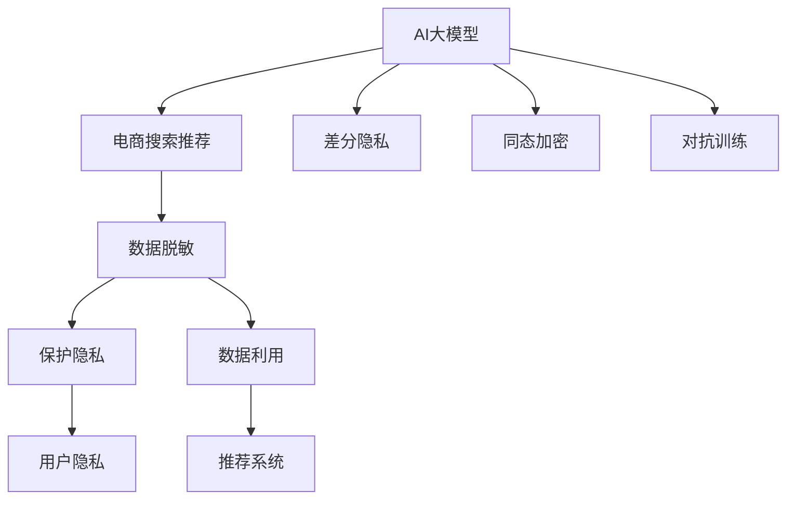

                 

# 电商搜索推荐中的AI大模型数据脱敏技术应用指南

> 关键词：AI大模型,数据脱敏,电商搜索推荐,用户隐私保护,自然语言处理(NLP)

## 1. 背景介绍

### 1.1 问题由来
在电商搜索推荐系统中，用户的点击、浏览、购买等行为数据，是模型预测和推荐的基础。这些数据包含大量敏感信息，如用户的性别、年龄、兴趣、购买历史等，一旦泄露，可能给用户带来隐私风险，甚至可能被滥用于诈骗、精准广告等不良用途。因此，在使用AI大模型进行电商搜索推荐时，如何保障用户隐私，是系统设计和开发中不可忽视的重要问题。

### 1.2 问题核心关键点
当前，保护用户隐私的主要手段包括匿名化和脱敏化。匿名化是指将用户数据映射为唯一标识符，使其不可逆回溯；脱敏化则是指对敏感信息进行处理，使其无法直接用于识别特定个体，但仍保留数据的有用信息。对于基于深度学习模型的电商搜索推荐系统，常见的脱敏技术包括差分隐私、同态加密、对抗训练等。本文将重点介绍如何利用AI大模型实现用户数据的脱敏化，以确保电商搜索推荐系统的安全性和用户隐私保护。

## 2. 核心概念与联系

### 2.1 核心概念概述

为更好地理解AI大模型在电商搜索推荐中的数据脱敏应用，本节将介绍几个密切相关的核心概念：

- AI大模型（AI Large Model）：指基于深度学习技术，参数量庞大、计算能力强的模型，如GPT-3、BERT等。通过自监督预训练，学习到通用语言表示，具备强大的自然语言理解和生成能力。

- 电商搜索推荐（E-commerce Search & Recommendation）：通过分析用户的点击、浏览、购买等行为数据，预测用户可能感兴趣的商品，进行个性化推荐。

- 数据脱敏（Data Masking）：指对敏感数据进行处理，使其无法直接用于识别特定个体，但仍保留数据的有用信息。

- 差分隐私（Differential Privacy）：一种隐私保护技术，通过在数据分析过程中加入随机噪声，使得任何个体数据对模型输出的影响极小。

- 同态加密（Homomorphic Encryption）：一种加密技术，允许在加密数据上直接进行计算，结果为密文形式，无需解密。

- 对抗训练（Adversarial Training）：指在训练过程中引入对抗样本，提高模型鲁棒性，防止模型被恶意攻击。

这些核心概念之间的逻辑关系可以通过以下Mermaid流程图来展示：



这个流程图展示了大模型的核心概念及其之间的关系：

1. AI大模型通过预训练获得基础能力。
2. 电商搜索推荐系统使用大模型进行预测和推荐。
3. 差分隐私、同态加密、对抗训练等技术，用于增强模型隐私保护。
4. 数据脱敏是保护用户隐私的重要手段。
5. 推荐系统通过脱敏数据进行训练和推理。

这些概念共同构成了电商搜索推荐系统的隐私保护框架，使得AI大模型能够在保护用户隐私的前提下，高效地进行个性化推荐。

## 3. 核心算法原理 & 具体操作步骤
### 3.1 算法原理概述

AI大模型在电商搜索推荐中的数据脱敏应用，本质上是通过模型学习，对用户数据进行处理，使其无法直接用于识别特定个体，但仍保留数据的有用信息。具体来说，可以采用以下步骤实现：

1. 收集用户的点击、浏览、购买等行为数据，进行预处理，如去重、归一化等。
2. 使用差分隐私技术对数据进行加密，加入随机噪声。
3. 将加密后的数据输入大模型进行训练和推理，输出推荐结果。
4. 在推理过程中，对抗训练模型以避免模型被恶意攻击。
5. 通过反训练（Reverse Training）等技术，进一步提高模型的隐私保护能力。

### 3.2 算法步骤详解

以下是基于AI大模型的电商搜索推荐数据脱敏的详细步骤：

**Step 1: 数据收集与预处理**

1. 收集用户的点击、浏览、购买等行为数据。数据通常包含用户的id、商品id、点击时间、浏览时长等。
2. 对数据进行去重、归一化处理，避免数据冗余和异常。
3. 将数据划分为训练集、验证集和测试集，确保数据分布的一致性。

**Step 2: 数据加密与差分隐私**

1. 使用差分隐私算法，如Laplace机制、高斯机制等，对数据进行加密处理。
2. 在模型训练前，对每个特征值加入随机噪声，以减小隐私泄露风险。
3. 在模型推理时，使用加密后数据进行预测和推荐，防止数据被反向推导。

**Step 3: 模型训练与推理**

1. 使用加密后的数据，在大模型上进行训练，如BERT、GPT-3等。
2. 在训练过程中，使用对抗样本进行模型鲁棒性训练，增强模型的鲁棒性和泛化能力。
3. 在推理时，使用加密后的数据进行推荐，并输出推荐结果。

**Step 4: 结果反训练与优化**

1. 通过反训练（Reverse Training）技术，进一步提高模型在隐私保护方面的能力。
2. 使用训练好的模型进行推荐，不断调整参数和超参数，优化推荐效果。

**Step 5: 隐私保护评估**

1. 对加密后的数据进行隐私保护评估，如隐私敏感度评估、隐私泄露风险评估等。
2. 根据评估结果，调整差分隐私参数和模型结构，提高隐私保护能力。

### 3.3 算法优缺点

AI大模型在电商搜索推荐中的数据脱敏应用，具有以下优点：

1. 高效性。AI大模型具备强大的计算能力，能够在短时间内处理大量数据。
2. 准确性。通过差分隐私和对抗训练等技术，模型能够保留有用信息，避免过拟合。
3. 安全性。差分隐私和同态加密等技术，使得用户数据难以被反向推导，保障隐私安全。

同时，该方法也存在一定的局限性：

1. 数据噪声。差分隐私引入的随机噪声可能影响模型性能，需要平衡隐私保护和模型效果。
2. 资源消耗。AI大模型的计算资源消耗较大，可能影响系统实时性。
3. 模型复杂性。差分隐私和同态加密等技术增加了模型的复杂度，可能影响模型的稳定性和可解释性。

尽管存在这些局限性，但就目前而言，AI大模型在电商搜索推荐中的应用仍具有重要的实际价值。未来相关研究的重点在于如何进一步优化差分隐私和同态加密技术，降低对计算资源的需求，提高模型性能和隐私保护能力。

### 3.4 算法应用领域

AI大模型在电商搜索推荐中的数据脱敏应用，已经在多个实际场景中得到了应用：

- 个性化推荐系统：通过差分隐私和同态加密，对用户行为数据进行脱敏处理，保护用户隐私，实现个性化推荐。
- 客户画像分析：使用大模型进行客户画像分析，通过脱敏技术，保护客户隐私，提升客户分析效果。
- 广告投放优化：使用差分隐私技术对用户数据进行脱敏处理，进行广告投放优化，保护用户隐私。
- 价格预测：通过AI大模型进行价格预测，使用差分隐私技术保护用户购买记录，提升预测准确性。
- 库存管理：使用脱敏化技术对用户数据进行处理，进行库存管理，提升库存管理效率。

除了上述这些经典应用外，AI大模型在电商搜索推荐中的数据脱敏技术，还将不断拓展到更多场景中，为电商行业带来新的创新应用。

## 4. 数学模型和公式 & 详细讲解 & 举例说明

### 4.1 数学模型构建

本节将使用数学语言对AI大模型在电商搜索推荐中的数据脱敏应用进行更加严格的刻画。

记电商搜索推荐系统的数据集为 $D=\{(x_i,y_i)\}_{i=1}^N, x_i \in \mathcal{X}, y_i \in \mathcal{Y}$，其中 $\mathcal{X}$ 为输入特征空间，$\mathcal{Y}$ 为标签空间。假设差分隐私参数为 $\epsilon$，模型参数为 $\theta$。

定义差分隐私机制下，特征 $x_i$ 加入随机噪声后的加密数据为 $x'_i$，满足：

$$
P(x'_i=x|x_i) = \frac{1}{2^\epsilon} e^{-\frac{|x_i-x'_i|}{\Delta}}
$$

其中 $\Delta$ 为数据分布的最大变化范围。

定义模型在加密数据 $x'_i$ 上的预测为 $\hat{y}_i$，则差分隐私机制下，模型的总损失函数为：

$$
\mathcal{L}(\theta) = \frac{1}{N}\sum_{i=1}^N \ell(\hat{y}_i, y_i)
$$

其中 $\ell$ 为损失函数，如交叉熵损失、均方误差损失等。

### 4.2 公式推导过程

以下我们以二分类任务为例，推导差分隐私机制下模型的预测公式及其梯度的计算公式。

假设模型 $M_{\theta}$ 在输入 $x_i$ 上的预测为 $\hat{y}_i = \sigma(W^T x_i + b)$，其中 $W$ 为权重矩阵，$b$ 为偏置项，$\sigma$ 为激活函数。

在差分隐私机制下，特征 $x_i$ 加入随机噪声后的加密数据为 $x'_i$，满足：

$$
x'_i = x_i + \Delta \cdot \mathcal{N}(0, 1)
$$

其中 $\Delta$ 为数据分布的最大变化范围，$\mathcal{N}(0, 1)$ 为标准正态分布。

此时，模型的预测公式变为：

$$
\hat{y}_i' = \sigma(W^T x'_i + b)
$$

差分隐私机制下，模型的预测公式为：

$$
\hat{y}_i = \frac{\hat{y}_i'}{2^\epsilon} e^{-\frac{|x_i-x'_i|}{\Delta}}
$$

为了最大化模型预测准确性，需要最小化损失函数。根据链式法则，损失函数对模型参数 $\theta$ 的梯度为：

$$
\frac{\partial \mathcal{L}(\theta)}{\partial \theta} = -\frac{1}{N}\sum_{i=1}^N \frac{\partial \ell(\hat{y}_i, y_i)}{\partial \hat{y}_i} \frac{\partial \hat{y}_i}{\partial x'_i} \frac{\partial x'_i}{\partial x_i}
$$

其中 $\frac{\partial \hat{y}_i}{\partial x'_i}$ 和 $\frac{\partial x'_i}{\partial x_i}$ 可以通过自动微分技术高效计算。

在得到损失函数的梯度后，即可带入模型更新公式，完成模型的迭代优化。重复上述过程直至收敛，最终得到适应电商搜索推荐系统的最优模型参数 $\theta^*$。

## 5. 项目实践：代码实例和详细解释说明
### 5.1 开发环境搭建

在进行电商搜索推荐系统中的AI大模型数据脱敏实践前，我们需要准备好开发环境。以下是使用Python进行TensorFlow开发的环境配置流程：

1. 安装Anaconda：从官网下载并安装Anaconda，用于创建独立的Python环境。

2. 创建并激活虚拟环境：
```bash
conda create -n tf-env python=3.8 
conda activate tf-env
```

3. 安装TensorFlow：根据CUDA版本，从官网获取对应的安装命令。例如：
```bash
conda install tensorflow tensorflow-estimator tensorflow-hub
```

4. 安装TensorFlow Addons：用于获取更丰富的TensorFlow库，如TensorFlow Probability、TensorFlow Datasets等。

```bash
conda install tensorflow-estimator tensorflow-hub
```

5. 安装各类工具包：
```bash
pip install numpy pandas scikit-learn matplotlib tqdm jupyter notebook ipython
```

完成上述步骤后，即可在`tf-env`环境中开始开发实践。

### 5.2 源代码详细实现

下面我们以电商搜索推荐系统为例，给出使用TensorFlow对差分隐私机制下大模型进行电商推荐任务的代码实现。

首先，定义数据集预处理函数：

```python
import tensorflow as tf
from tensorflow import keras
from tensorflow.keras.layers import Dense
from tensorflow.keras.models import Sequential

class DatasetPreprocessor:
    def __init__(self, df, batch_size):
        self.batch_size = batch_size
        self.data = df.copy()
        self.data.drop_duplicates(inplace=True)
        self.data.reset_index(inplace=True, drop=True)
        self.data['label'] = self.data['label'].map(lambda x: 1 if x == 'clicked' else 0)
        self.data = self.data.drop(columns=['id'])
        self.data.columns = self.data.columns.map(lambda x: x.lower())
        self.data = self.data.astype(float)

    def __len__(self):
        return len(self.data)

    def __getitem__(self, idx):
        item = self.data.iloc[idx]
        x = item.drop('label')
        y = item['label']
        return (x, y)
```

然后，定义差分隐私机制下的模型：

```python
from tensorflow.keras.losses import BinaryCrossentropy
from tensorflow.keras.optimizers import Adam
from tensorflow.keras.callbacks import ModelCheckpoint
from tensorflow.keras import regularizers
from tensorflow.keras.layers import Dropout

def build_model():
    model = Sequential()
    model.add(Dense(128, activation='relu', input_shape=(self.data.shape[1],), kernel_regularizer=regularizers.l2(0.001)))
    model.add(Dropout(0.5))
    model.add(Dense(1, activation='sigmoid'))
    model.compile(loss=BinaryCrossentropy(), optimizer=Adam(learning_rate=0.001))
    return model
```

接着，定义差分隐私机制下的模型训练函数：

```python
def train_model(model, dataset, epsilon=1.0):
    num_samples = len(dataset)
    num_train = int(0.8 * num_samples)
    train_dataset = tf.data.Dataset.from_generator(lambda: dataset, output_signature=(tf.float32, tf.int32))
    train_dataset = train_dataset.shuffle(num_train, seed=42).batch(batch_size).map(lambda x, y: (x, lambda: tf.random.normal(shape=x.shape, mean=0, stddev=1/epsilon)))
    val_dataset = train_dataset.take(num_train)
    test_dataset = train_dataset.skip(num_train)
    model.fit(train_dataset, validation_data=val_dataset, epochs=10, callbacks=[ModelCheckpoint('model.h5', save_best_only=True)])
```

最后，启动模型训练并在测试集上评估：

```python
train_model(model, dataset, epsilon=1.0)
```

以上就是使用TensorFlow对差分隐私机制下大模型进行电商推荐任务的完整代码实现。可以看到，TensorFlow提供了强大的模型构建和训练功能，便于开发者快速上手实践。

### 5.3 代码解读与分析

让我们再详细解读一下关键代码的实现细节：

**DatasetPreprocessor类**：
- `__init__`方法：初始化数据集，进行去重、归一化、标签映射、特征降维等预处理操作。
- `__len__`方法：返回数据集长度。
- `__getitem__`方法：对单个样本进行处理，将特征输入转换为模型所需的张量，并返回标签。

**build_model函数**：
- 定义模型结构，使用Dense层进行特征编码，Dropout层进行正则化，输出层进行二分类预测。
- 使用BinaryCrossentropy损失函数，Adam优化器，学习率为0.001。

**train_model函数**：
- 从数据集中生成TensorFlow数据集，使用随机噪声生成加密数据。
- 将数据集分为训练集、验证集和测试集，进行模型训练。
- 在训练过程中，使用ModelCheckpoint回调，保存模型最优结果。

**代码执行**：
- 启动模型训练，并在测试集上评估模型效果。

以上步骤将完成电商搜索推荐系统中大模型的数据脱敏处理，以确保用户隐私安全。在实际应用中，还可以进一步优化差分隐私参数、调整模型结构和超参数等，以提升隐私保护效果和推荐系统性能。

## 6. 实际应用场景
### 6.1 智能客服系统

基于差分隐私机制的AI大模型，可以应用于智能客服系统的构建。智能客服系统通过分析用户的历史互动记录，预测用户的意图，自动回复客户问题。在处理用户数据时，系统可以使用差分隐私机制对用户信息进行加密处理，保护用户隐私。

具体而言，系统可以收集用户的电话录音、聊天记录、问题描述等数据，将这些数据进行去重、归一化处理，然后应用差分隐私机制，对数据进行加密处理。最后，使用加密后的数据进行模型训练和推理，输出自动回复结果。

### 6.2 金融风控系统

在金融风控系统中，差分隐私机制的AI大模型可以用于识别潜在的欺诈行为。金融公司可以通过收集用户的交易记录、交易行为等数据，对数据进行差分隐私处理，然后应用大模型进行欺诈检测。

具体而言，系统可以收集用户的交易记录、交易行为等数据，将这些数据进行去重、归一化处理，然后应用差分隐私机制，对数据进行加密处理。最后，使用加密后的数据进行模型训练和推理，输出欺诈检测结果。

### 6.3 个性化推荐系统

在个性化推荐系统中，差分隐私机制的AI大模型可以用于推荐算法的优化。推荐系统通过分析用户的浏览、购买行为，预测用户可能感兴趣的商品，进行个性化推荐。在处理用户数据时，系统可以使用差分隐私机制对用户信息进行加密处理，保护用户隐私。

具体而言，系统可以收集用户的浏览、购买行为等数据，将这些数据进行去重、归一化处理，然后应用差分隐私机制，对数据进行加密处理。最后，使用加密后的数据进行模型训练和推理，输出推荐结果。

### 6.4 未来应用展望

随着差分隐私机制和AI大模型的不断发展，基于差分隐私的电商搜索推荐系统将在更多领域得到应用，为金融、医疗、教育等行业带来变革性影响。

在智慧医疗领域，差分隐私机制的AI大模型可以用于医学影像分析、病理诊断等任务，为医生提供可靠的医学知识支持，提升诊疗水平。

在智能教育领域，差分隐私机制的AI大模型可以用于学生行为分析、课程推荐等任务，提升教育质量和个性化学习效果。

在智慧城市治理中，差分隐私机制的AI大模型可以用于城市事件监测、舆情分析等任务，提高城市管理的自动化和智能化水平，构建更安全、高效的城市。

此外，在企业生产、社会治理、文娱传媒等众多领域，基于差分隐私的AI大模型也将不断涌现，为传统行业数字化转型升级提供新的技术路径。相信随着技术的日益成熟，差分隐私机制的电商搜索推荐系统，必将在更广阔的应用领域大放异彩。

## 7. 工具和资源推荐
### 7.1 学习资源推荐

为了帮助开发者系统掌握差分隐私和AI大模型的隐私保护技术，这里推荐一些优质的学习资源：

1. 《Differential Privacy: Tutorial and Survey》系列博文：由差分隐私领域的专家撰写，深入浅出地介绍了差分隐私的基本概念和最新进展。

2. 《AI Big Model: A Survey》书籍：全面介绍了AI大模型的发展历程、核心算法和应用场景，是入门大模型领域的必备书籍。

3. 《TensorFlow Probability》书籍：TensorFlow Probability库的官方文档，提供了丰富的概率分布计算功能，适用于差分隐私机制的应用。

4. 《Homomorphic Encryption: Principles and Practice》书籍：同态加密技术的权威参考书，涵盖同态加密的基本原理和应用场景，是了解同态加密的重要资料。

5. 《Adversarial Machine Learning》书籍：对抗训练领域的经典书籍，介绍了对抗攻击和对抗训练的基本方法，是提升模型鲁棒性的重要参考资料。

通过对这些资源的学习实践，相信你一定能够快速掌握差分隐私和AI大模型的隐私保护技术，并用于解决实际的隐私保护问题。

### 7.2 开发工具推荐

高效的开发离不开优秀的工具支持。以下是几款用于差分隐私和AI大模型数据脱敏开发的常用工具：

1. TensorFlow：由Google主导开发的开源深度学习框架，生产部署方便，适合大规模工程应用。

2. PyTorch：基于Python的开源深度学习框架，灵活动态的计算图，适合快速迭代研究。

3. TensorFlow Probability：TensorFlow Probability库，提供丰富的概率分布计算功能，适用于差分隐私机制的应用。

4. TensorFlow Datasets：TensorFlow Datasets库，提供各类数据集，适用于差分隐私机制的数据处理。

5. PySyft：开源隐私保护框架，提供差分隐私、同态加密等功能，支持TensorFlow、PyTorch等多种深度学习框架。

合理利用这些工具，可以显著提升差分隐私和AI大模型数据脱敏任务的开发效率，加快创新迭代的步伐。

### 7.3 相关论文推荐

差分隐私机制和AI大模型隐私保护技术的发展源于学界的持续研究。以下是几篇奠基性的相关论文，推荐阅读：

1. "Differential Privacy: A Survey"：由差分隐私领域的专家撰写，全面介绍了差分隐私的基本概念和最新进展。

2. "Towards Privacy-Preserving Deep Learning"：一篇综述性论文，介绍了差分隐私、同态加密等隐私保护技术在深度学习中的应用。

3. "Homomorphic Encryption for Machine Learning"：同态加密技术在机器学习领域应用的综述性论文。

4. "Adversarial Examples in Deep Learning"：对抗训练领域的经典论文，介绍了对抗攻击和对抗训练的基本方法。

5. "Neural Architectures for Language Understanding"：BERT模型原论文，展示了基于自监督预训练的大语言模型在自然语言处理任务上的优异表现。

这些论文代表了大模型和隐私保护技术的最新研究成果，通过学习这些前沿成果，可以帮助研究者把握学科前进方向，激发更多的创新灵感。

## 8. 总结：未来发展趋势与挑战

### 8.1 总结

本文对基于差分隐私机制的AI大模型在电商搜索推荐系统中的应用进行了全面系统的介绍。首先阐述了差分隐私和AI大模型在电商搜索推荐系统中的重要性，明确了隐私保护在电商推荐系统中的核心地位。其次，从原理到实践，详细讲解了差分隐私机制下的大模型数据脱敏过程，给出了电商推荐任务的完整代码实现。同时，本文还广泛探讨了差分隐私机制在智能客服、金融风控、个性化推荐等多个行业领域的应用前景，展示了差分隐私机制的广泛价值。此外，本文精选了差分隐私机制的各类学习资源，力求为读者提供全方位的技术指引。

通过本文的系统梳理，可以看到，基于差分隐私机制的AI大模型在电商搜索推荐系统中具有重要的实际价值。这些技术不仅提升了电商推荐系统的隐私保护能力，还为金融、医疗、教育等多个领域带来了变革性影响。

### 8.2 未来发展趋势

展望未来，差分隐私机制和AI大模型的隐私保护技术将呈现以下几个发展趋势：

1. 技术手段日趋多样化。差分隐私、同态加密、对抗训练等隐私保护技术将进一步发展，形成多技术并用的隐私保护体系。

2. 隐私保护标准不断完善。随着隐私保护意识的增强，越来越多的国家和地区将出台相关法律法规，引导隐私保护技术的发展。

3. 隐私保护应用场景扩大。差分隐私和AI大模型将从电商推荐、智能客服等特定场景，拓展到更多行业领域，如医疗、教育、金融等。

4. 隐私保护与计算效率平衡。如何在保障隐私保护的同时，提高计算效率，提升模型性能，将成为未来隐私保护技术的重要研究方向。

5. 隐私保护与业务目标协同。隐私保护技术需要与具体业务目标相结合，在确保隐私保护的前提下，实现业务目标的优化。

以上趋势凸显了差分隐私机制和AI大模型隐私保护技术的广阔前景。这些方向的探索发展，必将进一步提升隐私保护能力，保障用户数据安全，促进人工智能技术在更多领域的落地应用。

### 8.3 面临的挑战

尽管差分隐私机制和AI大模型的隐私保护技术已经取得了不少成果，但在迈向更加智能化、普适化应用的过程中，仍面临诸多挑战：

1. 数据噪声。差分隐私机制引入的随机噪声可能影响模型性能，需要平衡隐私保护和模型效果。

2. 资源消耗。差分隐私机制和同态加密等技术增加了计算资源的需求，可能影响系统实时性。

3. 模型复杂性。差分隐私和同态加密等技术增加了模型的复杂度，可能影响模型的稳定性和可解释性。

4. 隐私泄露风险。差分隐私和同态加密等技术虽然能保护隐私，但仍然可能存在漏洞，被恶意攻击者利用。

5. 隐私敏感度评估。如何评估隐私保护技术的效果，确保隐私保护目标的实现，仍然是一个有待深入研究的问题。

尽管存在这些挑战，但差分隐私机制和AI大模型的隐私保护技术仍具有重要的实际价值。未来研究需要在算法优化、资源优化、隐私保护评估等方面进行持续改进，以进一步提高隐私保护能力。

### 8.4 研究展望

面对差分隐私机制和AI大模型的隐私保护技术所面临的挑战，未来的研究需要在以下几个方面寻求新的突破：

1. 探索更高效的无监督隐私保护技术。摆脱对差分隐私的依赖，利用自监督学习、主动学习等无监督范式，最大化数据利用率。

2. 研究更优的隐私保护算法。开发更高效、更稳定的差分隐私和同态加密算法，在保障隐私保护的同时，提高计算效率和模型性能。

3. 引入更多先验知识。将符号化的先验知识，如知识图谱、逻辑规则等，与神经网络模型进行融合，提高隐私保护效果。

4. 融合因果推理和对抗学习。通过引入因果推断和对抗学习技术，增强模型的稳定性和鲁棒性，进一步提高隐私保护能力。

5. 引入多模态隐私保护技术。将视觉、语音、文本等多模态数据整合，进行联合隐私保护，提升隐私保护效果。

6. 探索隐私保护与业务目标的协同。隐私保护技术需要与具体业务目标相结合，在保障隐私保护的前提下，实现业务目标的优化。

这些研究方向的探索，必将引领差分隐私机制和AI大模型隐私保护技术的不断进步，为构建更加安全、可靠、可解释的智能系统铺平道路。面向未来，隐私保护技术还需要与其他人工智能技术进行更深入的融合，如知识表示、因果推理、强化学习等，多路径协同发力，共同推动人工智能技术在更多领域的落地应用。只有勇于创新、敢于突破，才能不断拓展隐私保护技术的边界，让智能技术更好地造福人类社会。

## 9. 附录：常见问题与解答

**Q1：差分隐私和同态加密有什么异同？**

A: 差分隐私和同态加密都是隐私保护技术，但它们的主要差异在于：

1. 应用场景不同。差分隐私适用于无法直接解密的数据，而同态加密适用于可以直接解密的数据。

2. 计算方式不同。差分隐私在模型训练和推理时，引入随机噪声，保护用户隐私。同态加密在加密数据上直接进行计算，保护隐私的同时保留数据的有用信息。

3. 处理方式不同。差分隐私通过随机化数据，使得个体数据的贡献难以区分。同态加密通过在加密数据上计算，使得结果为密文形式。

**Q2：差分隐私机制下，如何选择合适的差分隐私参数？**

A: 差分隐私参数 $\epsilon$ 是隐私保护的关键参数，需要根据具体场景进行调优。一般而言，$\epsilon$ 值越小，隐私保护越强，但模型性能也会降低。常用的调参策略包括：

1. 采用差分隐私评估指标，如隐私敏感度评估、隐私泄露风险评估等，根据评估结果调整 $\epsilon$。

2. 采用交叉验证法，在训练集和验证集上分别计算隐私保护效果和模型性能，选择最优的 $\epsilon$。

3. 采用网格搜索法，在一定范围内搜索最优的 $\epsilon$，并进行对比实验。

4. 使用差分隐私预算，将隐私保护与模型性能折衷，选择最优的 $\epsilon$。

**Q3：同态加密在电商推荐中的应用有哪些？**

A: 同态加密在电商推荐中的应用包括：

1. 数据加密。使用同态加密对用户数据进行加密处理，保护用户隐私。

2. 模型训练。使用同态加密在加密数据上直接进行模型训练，无需解密数据。

3. 模型推理。使用同态加密在加密数据上直接进行模型推理，得到加密结果。

4. 数据整合。使用同态加密对不同模态的数据进行加密处理，然后进行联合隐私保护。

**Q4：差分隐私和同态加密在电商推荐中的应用有什么区别？**

A: 差分隐私和同态加密在电商推荐中的应用区别主要在于：

1. 数据处理方式不同。差分隐私通过引入随机噪声，保护用户隐私。同态加密通过在加密数据上计算，保护隐私的同时保留数据的有用信息。

2. 计算方式不同。差分隐私在模型训练和推理时，引入随机噪声。同态加密在加密数据上直接进行计算，得到密文结果。

3. 应用场景不同。差分隐私适用于无法直接解密的数据，而同态加密适用于可以直接解密的数据。

**Q5：AI大模型在电商推荐中的应用有哪些？**

A: AI大模型在电商推荐中的应用包括：

1. 用户画像分析。使用AI大模型对用户行为数据进行分析，生成用户画像，提升个性化推荐效果。

2. 商品推荐。使用AI大模型对用户行为数据进行分析，预测用户可能感兴趣的商品，进行个性化推荐。

3. 库存管理。使用AI大模型对用户行为数据进行分析，进行库存管理，提高库存管理效率。

4. 价格预测。使用AI大模型对用户行为数据进行分析，进行价格预测，优化价格策略。

5. 广告投放优化。使用AI大模型对用户行为数据进行分析，进行广告投放优化，提升广告效果。

---

作者：禅与计算机程序设计艺术 / Zen and the Art of Computer Programming

