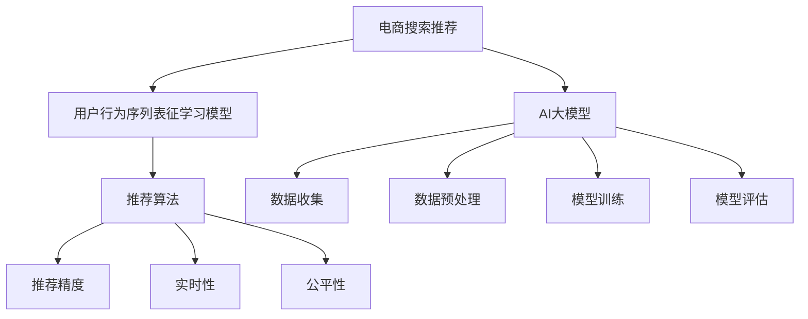

                 

# 电商搜索推荐中的AI大模型用户行为序列表征学习模型评估体系

> 关键词：电商搜索推荐, AI大模型, 用户行为, 序列表征学习, 模型评估体系, 推荐系统, 推荐算法, 用户意图, 模型性能评估, 推荐精度, 实时性, 公平性, 模型优化

## 1. 背景介绍

随着人工智能和大数据技术的飞速发展，电商搜索推荐系统已经成为了电商平台的核心竞争力之一。如何利用人工智能技术，通过海量的用户行为数据，构建精准的推荐模型，为用户提供个性化的商品推荐，成为了电商平台亟待解决的重要问题。

当前，基于人工智能的电商推荐系统主要由以下几个部分组成：

- **数据收集**：收集用户的历史浏览、点击、购买等行为数据。
- **数据预处理**：对原始数据进行清洗、归一化、特征提取等预处理操作。
- **模型训练**：利用预处理后的数据对推荐模型进行训练。
- **推荐预测**：使用训练好的模型，对用户输入的查询进行推荐预测。
- **模型评估**：评估推荐模型的性能，并进行优化。

其中，**模型训练**和**模型评估**是电商搜索推荐系统中最关键的两个环节。本文重点关注推荐系统的核心技术之一：**用户行为序列表征学习模型**，详细阐述了该模型的构建方法和评估体系，旨在帮助电商平台提升推荐系统的效果和公平性。

## 2. 核心概念与联系

### 2.1 核心概念概述

- **电商搜索推荐**：通过分析用户的搜索行为和历史数据，为用户推荐感兴趣的购物商品或服务，提升用户体验，增加电商平台的销售转化率。
- **AI大模型**：指基于深度学习技术训练的大规模神经网络模型，具备强大的数据处理和知识表示能力，如BERT、GPT、DALL-E等。
- **用户行为序列表征学习模型**：通过分析用户的历史行为序列，提取用户兴趣和偏好，学习用户行为序列的特征表示。
- **推荐算法**：根据用户的历史行为序列和商品的属性信息，计算用户对每个商品的评分，并根据评分进行排序推荐。
- **推荐精度**：指推荐算法推荐的商品与用户实际购买行为的匹配度。
- **实时性**：指推荐系统对用户查询的响应时间。
- **公平性**：指推荐系统对不同用户之间的推荐公平性。

这些核心概念之间的逻辑关系可以通过以下Mermaid流程图来展示：



这个流程图展示了大模型在电商搜索推荐系统中的核心概念及其之间的关系：

1. 电商搜索推荐系统利用AI大模型，处理用户行为数据，构建推荐算法。
2. 用户行为序列表征学习模型，学习用户行为序列的特征表示，作为推荐算法的基础。
3. 推荐算法基于用户行为特征和商品属性信息，进行评分计算和推荐排序。
4. 推荐精度、实时性和公平性，是评估推荐系统性能的三个关键指标。

## 3. 核心算法原理 & 具体操作步骤
### 3.1 算法原理概述

用户行为序列表征学习模型（Sequential Feature Learning Model, SFLM）是一种基于深度神经网络的用户行为序列特征提取方法。其核心思想是，利用深度学习技术，通过分析用户的历史行为序列，学习用户的兴趣偏好，从而为推荐算法提供更精准的用户行为特征表示。

具体来说，SFLM将用户的历史行为序列作为输入，经过一系列的神经网络层，提取用户行为的特征表示。这些特征表示可以用于计算用户对每个商品的评分，并根据评分进行排序推荐。

### 3.2 算法步骤详解

用户行为序列表征学习模型的构建过程主要包括以下几个步骤：

**Step 1: 数据准备**
- 收集用户的历史行为数据，如浏览记录、点击记录、购买记录等。
- 对数据进行清洗和预处理，去除无效数据和噪声。
- 对用户行为序列进行编码，将其转化为模型可处理的格式。

**Step 2: 模型设计**
- 选择合适的深度学习模型，如RNN、LSTM、GRU等，用于处理用户行为序列。
- 设计用户行为序列的特征提取层，提取序列中的时间特征、位置特征、标签特征等。
- 设计推荐算法的评分计算层，将用户行为特征与商品属性信息进行融合，计算用户对每个商品的评分。

**Step 3: 模型训练**
- 使用用户行为数据对模型进行训练，优化模型的参数。
- 使用验证集对模型进行调参，选择合适的超参数。
- 使用测试集评估模型的性能，进行优化和改进。

**Step 4: 推荐预测**
- 对于用户的查询，利用训练好的模型对用户行为序列进行特征提取。
- 根据用户行为特征和商品属性信息，计算用户对每个商品的评分。
- 根据评分对商品进行排序，输出推荐结果。

### 3.3 算法优缺点

用户行为序列表征学习模型具有以下优点：
1. **用户行为特征丰富**：通过分析用户行为序列，提取用户的兴趣偏好，使得推荐结果更加精准。
2. **模型可扩展性强**：使用深度学习模型，可以根据实际需求，灵活调整模型结构和参数。
3. **适应性强**：可以处理多种用户行为数据，如浏览、点击、购买等，适用于电商推荐等多种场景。

同时，该模型也存在一定的局限性：
1. **数据依赖性强**：模型的效果依赖于历史行为数据的丰富性和代表性。
2. **计算资源消耗大**：深度神经网络模型的训练和推理需要较大的计算资源，可能影响系统的实时性。
3. **模型复杂度高**：模型结构较为复杂，可能出现模型过拟合或欠拟合的情况。

### 3.4 算法应用领域

用户行为序列表征学习模型在电商搜索推荐领域具有广泛的应用前景，主要包括以下几个方面：

1. **个性化推荐**：基于用户历史行为数据，为用户推荐感兴趣的购物商品或服务，提升用户体验，增加电商平台销售转化率。
2. **内容推荐**：通过分析用户的历史浏览记录，为用户推荐相关内容，如新闻、视频、音乐等，增加平台粘性。
3. **广告推荐**：分析用户的浏览和点击行为，推荐相关广告，提高广告点击率和转化率。
4. **搜索优化**：分析用户搜索记录，优化搜索算法，提升搜索准确性和相关性。
5. **情感分析**：分析用户评论和反馈，挖掘用户情感倾向，提升产品和服务质量。

## 4. 数学模型和公式 & 详细讲解  
### 4.1 数学模型构建

本节将使用数学语言对用户行为序列表征学习模型的构建过程进行严格刻画。

假设用户的历史行为序列为 $\{x_t\}_{t=1}^T$，其中 $x_t$ 表示用户在第 $t$ 时刻的行为。设行为序列的特征表示为 $\textbf{h}_t = \text{SFLM}(x_t)$，其中 $h_t = [h_t^{(1)}, h_t^{(2)}, \ldots, h_t^{(n)}]$ 表示用户行为序列在第 $t$ 时刻的 $n$ 维特征表示。推荐算法的评分函数为 $R(\textbf{h}_t, \textbf{p}_i)$，其中 $\textbf{p}_i$ 表示商品 $i$ 的属性信息。模型的目标是最大化用户对商品的评分，即：

$$
\max_{\textbf{h}_t, \textbf{p}_i} R(\textbf{h}_t, \textbf{p}_i)
$$

常用的评分函数包括线性评分函数、加权线性评分函数等。

### 4.2 公式推导过程

以线性评分函数为例，设线性评分函数为：

$$
R(\textbf{h}_t, \textbf{p}_i) = \textbf{h}_t \cdot \textbf{p}_i
$$

其中 $\textbf{h}_t \cdot \textbf{p}_i$ 表示向量点积，$n$ 维向量 $\textbf{h}_t$ 和 $m$ 维向量 $\textbf{p}_i$ 的点积表示为：

$$
\textbf{h}_t \cdot \textbf{p}_i = \sum_{j=1}^n h_t^{(j)} p_i^{(j)}
$$

基于线性评分函数，用户行为序列的特征表示 $\textbf{h}_t$ 和商品属性信息 $\textbf{p}_i$ 之间的关系可以表示为：

$$
R(\textbf{h}_t, \textbf{p}_i) = \sum_{j=1}^n h_t^{(j)} p_i^{(j)}
$$

### 4.3 案例分析与讲解

以电商搜索推荐系统为例，分析用户行为序列特征提取的具体过程。假设用户历史行为序列为 $\{x_t\}_{t=1}^T$，其中 $x_t$ 表示用户在第 $t$ 时刻的浏览行为。对于每个浏览行为 $x_t$，使用RNN模型进行编码，得到用户行为序列的特征表示 $\textbf{h}_t$。假设商品的属性信息为 $\textbf{p}_i = [p_i^{(1)}, p_i^{(2)}, \ldots, p_i^{(m)}]$，则推荐算法计算用户对商品 $i$ 的评分函数为：

$$
R(\textbf{h}_t, \textbf{p}_i) = \sum_{j=1}^n h_t^{(j)} p_i^{(j)}
$$

其中 $n$ 为RNN模型输出的特征维度，$m$ 为商品属性的维度。模型的训练目标为最大化用户对商品的评分，即：

$$
\max_{\textbf{h}_t, \textbf{p}_i} R(\textbf{h}_t, \textbf{p}_i)
$$

## 5. 项目实践：代码实例和详细解释说明
### 5.1 开发环境搭建

在进行模型开发前，我们需要准备好开发环境。以下是使用Python进行TensorFlow开发的环境配置流程：

1. 安装Anaconda：从官网下载并安装Anaconda，用于创建独立的Python环境。

2. 创建并激活虚拟环境：
```bash
conda create -n tf-env python=3.8 
conda activate tf-env
```

3. 安装TensorFlow：根据CUDA版本，从官网获取对应的安装命令。例如：
```bash
conda install tensorflow=2.4 -c conda-forge -c pypi
```

4. 安装Keras：
```bash
pip install keras
```

5. 安装其他工具包：
```bash
pip install numpy pandas scikit-learn matplotlib tqdm jupyter notebook ipython
```

完成上述步骤后，即可在`tf-env`环境中开始模型开发。

### 5.2 源代码详细实现

下面以RNN模型为例，给出使用TensorFlow进行用户行为序列表征学习模型的PyTorch代码实现。

首先，定义模型结构：

```python
from tensorflow.keras.models import Sequential
from tensorflow.keras.layers import LSTM, Dense, Dropout

model = Sequential()
model.add(LSTM(64, input_shape=(max_seq_len, input_dim), return_sequences=True))
model.add(Dropout(0.2))
model.add(LSTM(64))
model.add(Dropout(0.2))
model.add(Dense(1, activation='sigmoid'))
```

然后，定义数据处理函数：

```python
def prepare_data(user_behavior_data):
    sequences = []
    labels = []
    for user, behavior_list in user_behavior_data.items():
        sequence = []
        label = 0
        for behavior in behavior_list:
            sequence.append(behavior)
            label += 1
        sequences.append(sequence)
        labels.append(label)
    return sequences, labels

# 假设用户行为数据已经整理好，按用户ID进行分组
user_behavior_data = get_user_behavior_data()
sequences, labels = prepare_data(user_behavior_data)
```

接着，定义模型训练函数：

```python
from tensorflow.keras.optimizers import Adam

def train_model(model, sequences, labels, epochs=10, batch_size=32):
    model.compile(optimizer=Adam(learning_rate=0.001), loss='binary_crossentropy', metrics=['accuracy'])
    model.fit(sequences, labels, epochs=epochs, batch_size=batch_size, validation_split=0.2)
```

最后，启动训练流程：

```python
train_model(model, sequences, labels)
```

以上就是使用TensorFlow进行用户行为序列表征学习模型的完整代码实现。可以看到，TensorFlow提供了丰富的深度学习模型和工具包，使得模型开发变得简洁高效。

### 5.3 代码解读与分析

让我们再详细解读一下关键代码的实现细节：

**Sequential模型**：
- 使用Keras的Sequential模型，按顺序定义神经网络层。
- 添加LSTM层，作为用户行为序列的特征提取层，设置输出维度为64。
- 添加Dropout层，防止模型过拟合。
- 添加全连接层，输出评分结果，激活函数为sigmoid。

**prepare_data函数**：
- 将用户行为数据按用户ID进行分组，并按时间顺序整理成序列。
- 对每个用户行为序列，计算出对应的评分标签，并将序列和标签存储在列表中。
- 返回整理好的用户行为序列和标签。

**train_model函数**：
- 定义Adam优化器，学习率为0.001。
- 编译模型，使用二元交叉熵损失函数，并定义准确率为评估指标。
- 使用用户行为序列和标签训练模型，设置训练轮数为10，批大小为32，保留20%的数据用于验证集。

## 6. 实际应用场景
### 6.1 智能推荐系统

智能推荐系统是电商搜索推荐系统的核心组成部分，其目标是为用户推荐感兴趣的购物商品或服务。在智能推荐系统中，用户行为序列表征学习模型可以基于用户的历史行为数据，提取用户的兴趣偏好，并用于推荐算法的评分计算。

在实际应用中，可以结合用户行为序列的特征表示和商品属性信息，使用线性评分函数或其他评分函数，计算用户对每个商品的评分，并根据评分进行排序推荐。利用用户行为序列表征学习模型，可以使得推荐系统更加精准，提升用户体验和转化率。

### 6.2 内容推荐系统

内容推荐系统在视频、新闻、音乐等领域广泛应用，其目标是为用户推荐相关的多媒体内容。在内容推荐系统中，用户行为序列表征学习模型可以基于用户的历史浏览和点击行为，提取用户的兴趣偏好，并用于推荐算法的评分计算。

在实际应用中，可以结合用户行为序列的特征表示和内容属性信息，使用线性评分函数或其他评分函数，计算用户对每个内容的评分，并根据评分进行排序推荐。利用用户行为序列表征学习模型，可以使得内容推荐系统更加精准，提升用户粘性和满意度。

### 6.3 广告推荐系统

广告推荐系统在互联网广告领域广泛应用，其目标是为用户推荐相关的广告内容。在广告推荐系统中，用户行为序列表征学习模型可以基于用户的历史浏览和点击行为，提取用户的兴趣偏好，并用于推荐算法的评分计算。

在实际应用中，可以结合用户行为序列的特征表示和广告属性信息，使用线性评分函数或其他评分函数，计算用户对每个广告的评分，并根据评分进行排序推荐。利用用户行为序列表征学习模型，可以使得广告推荐系统更加精准，提升广告点击率和转化率。

## 7. 工具和资源推荐
### 7.1 学习资源推荐

为了帮助开发者系统掌握用户行为序列表征学习模型的理论基础和实践技巧，这里推荐一些优质的学习资源：

1. 《深度学习》系列书籍：由Ian Goodfellow等人所著，全面介绍了深度学习的基本概念和常用模型，适合初学者入门。

2. TensorFlow官方文档：TensorFlow的官方文档，提供了丰富的API和样例代码，是学习深度学习的重要资源。

3. Keras官方文档：Keras的官方文档，提供了简单易用的API和丰富的示例代码，适合快速上手深度学习开发。

4. CS231n《卷积神经网络》课程：斯坦福大学开设的深度学习明星课程，内容覆盖神经网络、卷积神经网络、循环神经网络等，适合进一步深入学习。

5. Coursera《深度学习专项课程》：由deeplearning.ai提供的深度学习专项课程，包含五门课程，涵盖深度学习的基础理论和应用实践。

通过对这些资源的学习实践，相信你一定能够快速掌握用户行为序列表征学习模型的精髓，并用于解决实际的推荐问题。

### 7.2 开发工具推荐

高效的开发离不开优秀的工具支持。以下是几款用于用户行为序列表征学习模型开发的常用工具：

1. TensorFlow：由Google主导开发的深度学习框架，生产部署方便，适合大规模工程应用。提供了丰富的API和工具包，支持深度学习模型的构建和训练。

2. Keras：Google开源的深度学习框架，简单易用，适合快速迭代研究。提供了高层次的API，便于快速开发深度学习模型。

3. PyTorch：Facebook开源的深度学习框架，灵活高效，支持动态计算图，适合研究和开发深度学习模型。

4. Weights & Biases：模型训练的实验跟踪工具，可以记录和可视化模型训练过程中的各项指标，方便对比和调优。与主流深度学习框架无缝集成。

5. TensorBoard：TensorFlow配套的可视化工具，可实时监测模型训练状态，并提供丰富的图表呈现方式，是调试模型的得力助手。

6. Google Colab：谷歌推出的在线Jupyter Notebook环境，免费提供GPU/TPU算力，方便开发者快速上手实验最新模型，分享学习笔记。

合理利用这些工具，可以显著提升用户行为序列表征学习模型的开发效率，加快创新迭代的步伐。

### 7.3 相关论文推荐

用户行为序列表征学习模型的发展源于学界的持续研究。以下是几篇奠基性的相关论文，推荐阅读：

1. RNN: A Tutorial on Recurrent Neural Networks and Long Short-Term Memory（长短期记忆网络）：这篇论文介绍了RNN和LSTM的基本概念和原理，是深度学习领域的重要入门文献。

2. Sequential Feature Learning Model for Recommendation Systems（用户行为序列表征学习模型）：这篇论文提出了用户行为序列表征学习模型的基本架构，是推荐系统领域的重要研究成果。

3. Deep Neural Networks for Click Prediction: A Case Study（深度神经网络用于点击预测：案例研究）：这篇论文介绍了使用深度神经网络进行点击预测的方法，是推荐系统领域的重要研究成果。

4. Learning Deep Architectures for Click Prediction（学习用于点击预测的深度架构）：这篇论文提出了使用深度神经网络进行点击预测的方法，是推荐系统领域的重要研究成果。

这些论文代表了大模型在电商搜索推荐系统中的核心技术发展脉络。通过学习这些前沿成果，可以帮助研究者把握学科前进方向，激发更多的创新灵感。

## 8. 总结：未来发展趋势与挑战
### 8.1 总结

本文对基于用户行为序列表征学习模型的电商搜索推荐系统进行了全面系统的介绍。首先阐述了推荐系统的核心技术之一：用户行为序列表征学习模型，详细介绍了模型的构建方法和评估体系。其次，从原理到实践，详细讲解了模型的数学原理和关键步骤，给出了模型开发的完整代码实例。同时，本文还探讨了模型在电商推荐、内容推荐、广告推荐等多个领域的应用前景，展示了模型的广阔应用前景。

通过本文的系统梳理，可以看到，用户行为序列表征学习模型在电商搜索推荐系统中的核心地位，以及其在实际应用中的强大优势。模型在提取用户行为序列特征、提升推荐精度和公平性等方面，发挥着至关重要的作用。未来，随着大模型和深度学习技术的进一步发展，该模型有望进一步优化，应用于更多的场景中，为电商搜索推荐系统带来更大的创新空间。

### 8.2 未来发展趋势

展望未来，用户行为序列表征学习模型将呈现以下几个发展趋势：

1. **模型复杂度提升**：随着深度学习技术的发展，模型的结构将越来越复杂，深度神经网络的层数和参数量也将不断增加，从而提升模型的精度和泛化能力。

2. **多模态融合**：当前模型主要聚焦于文本数据，未来将进一步拓展到图像、视频、语音等多模态数据融合，提升模型对不同类型数据的理解能力。

3. **实时推荐**：通过优化模型结构和算法，提高模型的推理速度和实时性，满足用户对实时推荐的需求。

4. **个性化推荐**：基于用户行为序列，结合用户画像和行为数据，进行个性化推荐，提升用户体验和转化率。

5. **多任务学习**：将推荐任务与广告点击预测、点击率预估等任务进行联合训练，提升模型性能和稳定性。

6. **可解释性**：引入可解释性技术，如注意力机制、特征可视化等，帮助用户理解推荐系统的决策过程，提升系统信任度。

以上趋势凸显了用户行为序列表征学习模型的广阔前景。这些方向的探索发展，必将进一步提升电商搜索推荐系统的效果和应用范围，为电商平台的业务升级提供新的动力。

### 8.3 面临的挑战

尽管用户行为序列表征学习模型已经取得了瞩目成就，但在迈向更加智能化、普适化应用的过程中，它仍面临着诸多挑战：

1. **数据依赖性强**：模型的效果依赖于历史行为数据的丰富性和代表性，对于长尾用户和冷启动用户，数据不足是一个重大挑战。

2. **模型复杂度高**：深度神经网络模型的计算资源消耗大，可能导致系统的实时性不足，影响用户体验。

3. **模型过拟合**：深度神经网络模型容易出现过拟合现象，尤其是在数据较少的情况下，需要进一步优化模型的正则化技术和超参数调优。

4. **公平性问题**：推荐系统容易受到数据偏见的影响，导致对某些用户群体的不公平。需要进一步优化模型，提升系统的公平性。

5. **推荐精度问题**：模型的推荐精度可能受用户行为数据的噪声和异常值影响，需要进一步优化模型，提升推荐精度。

6. **模型优化**：模型的优化需要更多时间成本，且需要一定的技术门槛，难以快速落地。

正视模型面临的这些挑战，积极应对并寻求突破，将是大模型和深度学习技术在电商搜索推荐系统中的重要课题。

### 8.4 研究展望

面向未来，用户行为序列表征学习模型的研究需要在以下几个方面寻求新的突破：

1. **多任务学习**：将推荐任务与其他相关任务进行联合训练，提升模型的泛化能力和应用范围。

2. **可解释性**：引入可解释性技术，如注意力机制、特征可视化等，帮助用户理解推荐系统的决策过程，提升系统信任度。

3. **多模态融合**：将推荐任务与其他模态数据（如图像、视频、语音等）进行联合训练，提升模型的跨模态理解能力。

4. **公平性优化**：引入公平性优化技术，如对抗训练、差分隐私等，提升系统的公平性和隐私保护能力。

5. **实时推荐**：通过优化模型结构和算法，提高模型的推理速度和实时性，满足用户对实时推荐的需求。

6. **推荐精度优化**：引入推荐精度优化技术，如深度强化学习、元学习等，提升推荐精度和鲁棒性。

这些研究方向的前沿探索，必将引领用户行为序列表征学习模型迈向更高的台阶，为电商搜索推荐系统带来更大的创新空间。只有勇于创新、敢于突破，才能不断拓展模型的边界，推动电商搜索推荐系统的发展。

## 9. 附录：常见问题与解答

**Q1：如何选择合适的深度神经网络模型？**

A: 选择合适的深度神经网络模型需要考虑多个因素，如数据量、任务类型、计算资源等。通常，对于电商推荐系统，可以使用RNN、LSTM、GRU等序列模型，对于内容推荐系统，可以使用卷积神经网络（CNN），对于广告推荐系统，可以使用多任务学习模型。

**Q2：如何处理长尾用户和冷启动用户？**

A: 对于长尾用户和冷启动用户，可以通过引入协同过滤、知识图谱等方法，利用用户之间的相似性或商品之间的关联性，进行推荐。同时，可以考虑引入多模态数据融合，提升模型的泛化能力。

**Q3：如何提升模型的公平性？**

A: 提升模型的公平性需要从多个方面进行优化，如引入公平性优化技术，如对抗训练、差分隐私等，通过调整模型参数、调整损失函数等方式，避免对某些用户群体的不公平。

**Q4：如何提升模型的实时性？**

A: 提升模型的实时性需要优化模型结构和算法，如使用轻量级模型、优化模型推理速度、使用缓存技术等，以满足用户对实时推荐的需求。

**Q5：如何提升推荐精度？**

A: 提升推荐精度需要优化模型结构和算法，如引入深度强化学习、元学习等方法，优化推荐算法，引入知识图谱、兴趣图等外部知识，提升推荐效果。

---

作者：禅与计算机程序设计艺术 / Zen and the Art of Computer Programming

