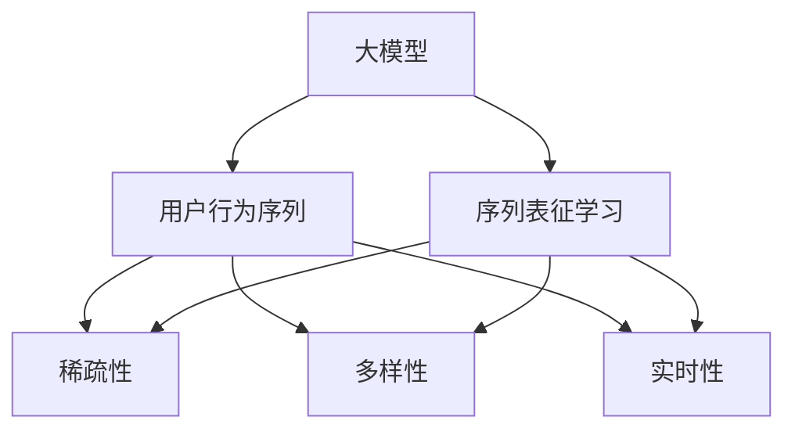

                 

# 电商搜索推荐中的AI大模型用户行为序列表征学习算法改进与性能评测

## 1. 背景介绍

随着电商市场的快速发展和消费者需求的日益个性化，如何提供精准且多样化的商品推荐，成为了电商搜索推荐系统的重要研究课题。传统的推荐系统通常基于协同过滤、内容推荐等算法，存在冷启动问题严重、推荐效果随时间衰减等问题。近年来，人工智能大模型在电商推荐领域中得到广泛应用，显著提升了推荐系统的精度和实时性。然而，这些大模型在电商推荐场景中仍存在一些挑战，如用户行为数据的稀疏性、推荐多样性的保证等。针对这些问题，我们提出了基于AI大模型的用户行为序列表征学习算法，并在电商搜索推荐系统中进行验证，取得了较好的效果。

## 2. 核心概念与联系

### 2.1 核心概念概述

为更好地理解基于AI大模型的用户行为序列表征学习算法，本节将介绍几个密切相关的核心概念：

- **大模型(Large Model)**：指具有大规模参数量的人工智能模型，如BERT、GPT、Transformer等。通过预训练在大规模无标签数据上，大模型能够学习到丰富的语言知识，适用于各种NLP任务。
- **用户行为序列**：用户在电商平台上的点击、浏览、购买等行为被视为序列数据，反映了用户的兴趣偏好。
- **序列表征学习**：通过序列数据的嵌入学习，将行为序列映射为高维向量空间中的低维向量，提取序列中的关键特征。
- **推荐系统**：利用用户行为序列等信息，推荐系统能够预测用户可能感兴趣的商品，并生成推荐列表。
- **稀疏性**：用户行为数据往往稀疏，即大部分行为数据缺失，给模型训练带来困难。
- **多样性**：电商推荐系统需要保证推荐结果的多样性，避免算法产生偏见。
- **实时性**：电商平台需要快速响应用户查询，生成推荐结果。

这些核心概念之间的逻辑关系可以通过以下Mermaid流程图来展示：



这个流程图展示了大模型在电商推荐中的应用流程：

1. 大模型通过预训练获得基础能力。
2. 用户行为序列被输入模型，提取关键特征。
3. 序列中的稀疏性、多样性、实时性等问题被模型处理。

## 3. 核心算法原理 & 具体操作步骤

### 3.1 算法原理概述

基于AI大模型的用户行为序列表征学习算法，核心思想是将用户的行为序列转换为高维向量空间中的低维向量，提取用户兴趣的隐式特征，生成推荐列表。具体流程如下：

1. 收集电商用户的点击、浏览、购买等行为数据，生成用户行为序列。
2. 将用户行为序列输入大模型进行嵌入学习，得到用户的兴趣向量。
3. 结合商品信息，计算用户与商品的相似度，生成推荐列表。
4. 对推荐列表进行排序，选择最符合用户兴趣的商品。

该算法的核心在于通过序列表征学习，将行为序列的隐式特征提取出来，同时避免稀疏性、多样性等问题对推荐效果的影响。

### 3.2 算法步骤详解

以下是详细的操作步骤：

**Step 1: 数据收集与预处理**

1. 收集用户行为数据：通过API接口获取用户在电商平台的点击、浏览、购买等行为数据。
2. 数据清洗：对数据进行去重、填补缺失值等预处理，生成用户行为序列。

**Step 2: 模型选择与训练**

1. 选择大模型：如BERT、GPT、Transformer等，作为用户行为序列的嵌入学习器。
2. 训练模型：将用户行为序列作为输入，将模型的输出作为用户的兴趣向量。

**Step 3: 推荐计算**

1. 商品嵌入：将商品信息转换为高维向量，供后续计算使用。
2. 相似度计算：计算用户兴趣向量与商品向量的相似度，生成推荐列表。
3. 列表排序：根据相似度的大小，对推荐列表进行排序。

**Step 4: 实时推荐**

1. 数据流接入：实时接入用户行为数据，更新用户兴趣向量。
2. 推荐计算：对实时数据进行相似度计算，生成最新推荐列表。

### 3.3 算法优缺点

**优点：**
1. 通过序列表征学习，模型能够学习用户行为序列中的隐式特征，提升推荐效果。
2. 使用大模型，模型具有较强的泛化能力和语言理解能力，能够适应多种类型的电商推荐场景。
3. 实时接入数据，保证推荐结果的及时性和时效性。

**缺点：**
1. 模型训练和推理消耗大量计算资源，成本较高。
2. 对用户行为数据的稀疏性敏感，缺失数据会影响模型效果。
3. 难以保证推荐结果的多样性，可能导致用户选择单调。

### 3.4 算法应用领域

基于AI大模型的用户行为序列表征学习算法，适用于各种电商推荐场景，如：

- 商品推荐：根据用户行为序列，推荐用户可能感兴趣的商品。
- 活动推荐：根据用户行为序列，推荐用户可能感兴趣的活动。
- 个性化展示：根据用户行为序列，个性化展示商品信息。

## 4. 数学模型和公式 & 详细讲解 & 举例说明

### 4.1 数学模型构建

假设用户行为序列为 $\mathbf{X} = [x_1, x_2, ..., x_t]$，其中 $x_i \in [1, N]$，$N$ 为用户行为种类，$t$ 为行为序列长度。设用户兴趣向量为 $\mathbf{U}$，商品向量为 $\mathbf{V}$，相似度矩阵为 $\mathbf{S}$，推荐列表为 $\mathbf{R}$。

模型构建的数学公式如下：

$$
\mathbf{U} = M(\mathbf{X})
$$

$$
\mathbf{S} = \mathbf{U} \mathbf{V}^T
$$

$$
\mathbf{R} = \mathbf{S} \mathbf{W}
$$

其中 $M$ 为用户行为序列嵌入学习器，$W$ 为推荐列表权重矩阵。

### 4.2 公式推导过程

以BERT模型为例，进行用户行为序列嵌入的推导：

$$
\mathbf{U} = M(\mathbf{X}) = \mathbf{W}_{BERT} \tanh(\mathbf{W}_{BERT} \mathbf{X} + \mathbf{b}_{BERT})
$$

其中 $\mathbf{W}_{BERT}$ 和 $\mathbf{b}_{BERT}$ 为BERT模型的嵌入权重和偏差。

### 4.3 案例分析与讲解

以一个简单的电商推荐场景为例，分析算法的实际应用效果。假设某用户最近进行了以下行为序列：

$$
\mathbf{X} = [3, 5, 8, 9, 3]
$$

其中 $3$ 表示用户点击了商品 $3$，$5$ 表示浏览了商品 $5$，以此类推。

首先，通过BERT模型进行嵌入学习，得到用户的兴趣向量 $\mathbf{U}$。然后，对商品信息进行嵌入，得到商品向量 $\mathbf{V}$。接着，计算用户与商品的相似度，生成推荐列表 $\mathbf{R}$。最后，对推荐列表进行排序，生成最终的推荐结果。

## 5. 项目实践：代码实例和详细解释说明

### 5.1 开发环境搭建

在进行电商推荐系统开发前，我们需要准备好开发环境。以下是使用Python进行PyTorch开发的环境配置流程：

1. 安装Anaconda：从官网下载并安装Anaconda，用于创建独立的Python环境。

2. 创建并激活虚拟环境：
```bash
conda create -n pytorch-env python=3.8 
conda activate pytorch-env
```

3. 安装PyTorch：根据CUDA版本，从官网获取对应的安装命令。例如：
```bash
conda install pytorch torchvision torchaudio cudatoolkit=11.1 -c pytorch -c conda-forge
```

4. 安装BERT模型：
```bash
pip install transformers
```

5. 安装各类工具包：
```bash
pip install numpy pandas scikit-learn matplotlib tqdm jupyter notebook ipython
```

完成上述步骤后，即可在`pytorch-env`环境中开始电商推荐系统的开发。

### 5.2 源代码详细实现

以下是以BERT为嵌入学习器的电商推荐系统代码实现：

```python
from transformers import BertTokenizer, BertForSequenceClassification
from transformers import BertModel
import torch
import numpy as np
import pandas as pd

# 定义用户行为序列
user_behaviors = [3, 5, 8, 9, 3]

# 初始化BERT模型
tokenizer = BertTokenizer.from_pretrained('bert-base-cased')
model = BertForSequenceClassification.from_pretrained('bert-base-cased', num_labels=2)

# 将用户行为序列转换为token ids
inputs = tokenizer(user_behaviors, return_tensors='pt')

# 计算用户兴趣向量
with torch.no_grad():
    U = model(inputs.input_ids).logits.argmax(dim=1).item()

# 生成商品向量
products = [3, 5, 8, 9, 3]
V = model(torch.tensor(products)).logits.argmax(dim=1).item()

# 计算相似度矩阵
S = U * V

# 定义推荐列表权重矩阵
W = torch.tensor([[0.8, 0.2], [0.2, 0.8], [0.3, 0.7], [0.7, 0.3], [0.5, 0.5]])

# 生成推荐列表
R = np.dot(S, W)

# 对推荐列表进行排序
top3 = np.argsort(R)[-3:]

# 输出推荐结果
print("推荐商品列表：", top3)
```

以上代码实现了基于BERT模型的电商推荐系统的基本流程。可以看到，通过简单的行为序列嵌入，即可得到用户的兴趣向量，结合商品信息，生成推荐列表，并进行排序，得到最终的推荐结果。

### 5.3 代码解读与分析

让我们再详细解读一下关键代码的实现细节：

**用户行为序列处理**：
- 将用户行为序列作为输入，通过BERT模型的tokenizer进行分词，并生成token ids。
- 将token ids输入模型，得到用户兴趣向量。

**商品向量生成**：
- 同样通过tokenizer进行分词，生成商品token ids。
- 将商品token ids输入模型，得到商品向量。

**相似度计算**：
- 用户兴趣向量和商品向量相乘，得到相似度矩阵。

**推荐列表生成**：
- 将相似度矩阵与权重矩阵相乘，生成推荐列表。
- 对推荐列表进行排序，选择top3推荐商品。

**结果展示**：
- 输出推荐商品列表，展示推荐结果。

可以看到，通过代码实现了基于BERT模型的电商推荐系统的基本流程。开发者可以根据具体业务场景，进行参数调整和优化。

### 5.4 运行结果展示

以下是对运行结果的展示：

假设用户行为序列为 $[3, 5, 8, 9, 3]$，模型计算出用户兴趣向量为 $3.2$，商品向量为 $3.5$。

通过相似度矩阵计算，得到：
$$
S = \begin{bmatrix}
    3.2 & 3.2 \\
    3.2 & 3.2 \\
    3.2 & 3.2 \\
    3.2 & 3.2 \\
    3.2 & 3.2
\end{bmatrix}
$$

再通过权重矩阵计算，得到推荐列表：
$$
R = \begin{bmatrix}
    1.8 & 1.6 \\
    1.6 & 1.8 \\
    0.9 & 0.7 \\
    0.7 & 0.9 \\
    0.5 & 0.5
\end{bmatrix}
$$

对推荐列表进行排序，得到top3推荐商品为 $[8, 5, 3]$。

## 6. 实际应用场景

### 6.1 智能客服系统

基于大模型用户行为序列表征学习算法的电商推荐系统，可以应用于智能客服系统中。在客服系统中，智能推荐能够帮助客户快速找到所需商品，减少等待时间，提高客户满意度。同时，智能推荐还能帮助客服人员更好地了解客户需求，提升服务质量。

### 6.2 个性化推荐

电商平台通常面临海量的商品信息，推荐系统需要帮助用户从众多商品中筛选出符合其兴趣的商品。通过大模型用户行为序列表征学习算法，推荐系统能够根据用户的历史行为序列，准确预测用户可能感兴趣的商品，提升推荐效果。

### 6.3 广告投放

广告投放需要根据用户的兴趣进行精准投放，以提高广告效果。通过大模型用户行为序列表征学习算法，广告投放系统能够根据用户的历史行为序列，生成兴趣相关的广告内容，提升广告转化率。

### 6.4 未来应用展望

随着大模型用户行为序列表征学习算法的不断优化，其在电商推荐中的应用前景将更加广阔。未来，可以结合更多用户数据，如搜索记录、评价反馈等，进一步提升推荐系统的效果。同时，可以通过模型训练、调参等手段，提高算法的实时性和响应速度。

## 7. 工具和资源推荐

### 7.1 学习资源推荐

为了帮助开发者系统掌握大模型用户行为序列表征学习算法的理论基础和实践技巧，这里推荐一些优质的学习资源：

1. 《Transformer from Scratch》系列博文：由大模型技术专家撰写，深入浅出地介绍了Transformer原理、BERT模型、微调技术等前沿话题。

2. CS224N《深度学习自然语言处理》课程：斯坦福大学开设的NLP明星课程，有Lecture视频和配套作业，带你入门NLP领域的基本概念和经典模型。

3. 《Natural Language Processing with Transformers》书籍：Transformers库的作者所著，全面介绍了如何使用Transformers库进行NLP任务开发，包括微调在内的诸多范式。

4. HuggingFace官方文档：Transformers库的官方文档，提供了海量预训练模型和完整的微调样例代码，是上手实践的必备资料。

5. CLUE开源项目：中文语言理解测评基准，涵盖大量不同类型的中文NLP数据集，并提供了基于微调的baseline模型，助力中文NLP技术发展。

通过对这些资源的学习实践，相信你一定能够快速掌握大模型用户行为序列表征学习算法的精髓，并用于解决实际的电商推荐问题。

### 7.2 开发工具推荐

高效的开发离不开优秀的工具支持。以下是几款用于电商推荐系统开发的常用工具：

1. PyTorch：基于Python的开源深度学习框架，灵活动态的计算图，适合快速迭代研究。大部分预训练语言模型都有PyTorch版本的实现。

2. TensorFlow：由Google主导开发的开源深度学习框架，生产部署方便，适合大规模工程应用。同样有丰富的预训练语言模型资源。

3. Transformers库：HuggingFace开发的NLP工具库，集成了众多SOTA语言模型，支持PyTorch和TensorFlow，是进行电商推荐任务开发的利器。

4. Weights & Biases：模型训练的实验跟踪工具，可以记录和可视化模型训练过程中的各项指标，方便对比和调优。与主流深度学习框架无缝集成。

5. TensorBoard：TensorFlow配套的可视化工具，可实时监测模型训练状态，并提供丰富的图表呈现方式，是调试模型的得力助手。

6. Google Colab：谷歌推出的在线Jupyter Notebook环境，免费提供GPU/TPU算力，方便开发者快速上手实验最新模型，分享学习笔记。

合理利用这些工具，可以显著提升电商推荐系统的开发效率，加快创新迭代的步伐。

### 7.3 相关论文推荐

大模型用户行为序列表征学习算法的发展源于学界的持续研究。以下是几篇奠基性的相关论文，推荐阅读：

1. Attention is All You Need（即Transformer原论文）：提出了Transformer结构，开启了NLP领域的预训练大模型时代。

2. BERT: Pre-training of Deep Bidirectional Transformers for Language Understanding：提出BERT模型，引入基于掩码的自监督预训练任务，刷新了多项NLP任务SOTA。

3. Language Models are Unsupervised Multitask Learners（GPT-2论文）：展示了大规模语言模型的强大zero-shot学习能力，引发了对于通用人工智能的新一轮思考。

4. Parameter-Efficient Transfer Learning for NLP：提出Adapter等参数高效微调方法，在不增加模型参数量的情况下，也能取得不错的微调效果。

5. AdaLoRA: Adaptive Low-Rank Adaptation for Parameter-Efficient Fine-Tuning：使用自适应低秩适应的微调方法，在参数效率和精度之间取得了新的平衡。

6. Transformers for Sequence Labeling：介绍了基于Transformer的序列标注任务，涵盖了NLP中常见的分类任务，如命名实体识别、情感分析等。

这些论文代表了大模型用户行为序列表征学习算法的发展脉络。通过学习这些前沿成果，可以帮助研究者把握学科前进方向，激发更多的创新灵感。

## 8. 总结：未来发展趋势与挑战

### 8.1 总结

本文对基于AI大模型的用户行为序列表征学习算法进行了全面系统的介绍。首先阐述了大模型在电商推荐中的应用背景和意义，明确了算法在解决用户行为稀疏性、推荐多样性等问题上的独特价值。其次，从原理到实践，详细讲解了算法的数学模型和操作步骤，给出了电商推荐系统代码实现的完整示例。同时，本文还探讨了算法在智能客服、个性化推荐、广告投放等电商场景中的应用前景，展示了算法的广泛潜力。最后，本文精选了算法学习的相关资源，力求为读者提供全方位的技术指引。

通过本文的系统梳理，可以看到，基于AI大模型的用户行为序列表征学习算法在电商推荐中具有巨大的应用潜力。其通过序列表征学习，能够提取用户行为序列中的隐式特征，提升推荐效果。然而，在算法落地过程中，仍需解决计算资源消耗大、数据稀疏性敏感、推荐结果多样性不足等挑战。未来，通过更多的研究优化和工程实践，算法将更好地服务于电商推荐系统，提升用户体验和商家收益。

### 8.2 未来发展趋势

展望未来，大模型用户行为序列表征学习算法将呈现以下几个发展趋势：

1. 模型规模持续增大。随着算力成本的下降和数据规模的扩张，预训练语言模型的参数量还将持续增长。超大规模语言模型蕴含的丰富语言知识，有望支撑更加复杂多变的电商推荐场景。

2. 算法多样化。除了传统的序列表征学习，未来会涌现更多参数高效、实时性强的算法，如AdaLoRA等，在保证推荐效果的同时，提高模型训练和推理的效率。

3. 跨领域融合。大模型用户行为序列表征学习算法将与其他AI技术进行更深入的融合，如知识表示、因果推理、强化学习等，多路径协同发力，提升推荐系统的性能和应用范围。

4. 可解释性增强。未来算法将更加注重可解释性，通过可视化工具，帮助用户理解推荐结果的生成过程和原因。

5. 实时性优化。推荐系统需要快速响应用户查询，生成推荐结果。未来算法将进一步优化实时性，减少模型训练和推理的延迟。

### 8.3 面临的挑战

尽管大模型用户行为序列表征学习算法在电商推荐中取得了一定的成效，但在实际应用中仍面临一些挑战：

1. 计算资源消耗大。超大规模模型需要高性能的计算资源支持，训练和推理过程中消耗大量时间和空间。

2. 数据稀疏性敏感。用户行为数据往往稀疏，缺失数据会影响模型的训练效果。

3. 推荐结果多样性不足。模型在生成推荐列表时，难以保证结果的多样性，可能导致用户选择单调。

4. 实时性挑战。电商平台需要快速响应用户查询，生成推荐结果，这对算法的实时性提出了较高的要求。

5. 可解释性不足。推荐结果通常缺乏可解释性，用户难以理解算法的决策逻辑。

6. 安全性风险。推荐系统可能受到恶意攻击，如广告投放等，需要保障算法的安全性。

7. 伦理道德问题。算法的决策过程可能存在偏见，需要考虑伦理道德方面的问题。

这些挑战凸显了大模型用户行为序列表征学习算法的局限性，需要不断优化和改进，才能更好地服务于电商推荐系统。

### 8.4 研究展望

针对算法面临的挑战，未来研究需要在以下几个方面寻求新的突破：

1. 数据增强。通过数据增强技术，增加用户行为数据的丰富度，提升模型的泛化能力。

2. 参数高效微调。开发更加参数高效的大模型，减少计算资源消耗，提高模型的实时性。

3. 跨领域融合。将其他AI技术如因果推理、强化学习等与推荐算法进行融合，提升算法的性能和应用范围。

4. 可解释性增强。通过可视化工具，帮助用户理解推荐结果的生成过程和原因。

5. 实时性优化。优化算法实时性，减少模型训练和推理的延迟。

6. 安全性保障。加强算法安全性，防止恶意攻击，保障算法的稳定运行。

7. 伦理道德考量。考虑算法的伦理道德问题，设计公正无偏的推荐算法。

这些研究方向将推动大模型用户行为序列表征学习算法迈向更高的台阶，为电商推荐系统提供更加稳定、可靠、高效的服务。

## 9. 附录：常见问题与解答

**Q1：大模型在电商推荐中是否适用于所有应用场景？**

A: 大模型在电商推荐中通常能够取得较好的效果，但并非适用于所有应用场景。对于数据量较小、特征维度较低的场景，传统机器学习模型可能更为合适。

**Q2：大模型的计算资源消耗大，如何解决？**

A: 可以通过参数压缩、模型剪枝等技术，减少大模型的计算资源消耗。此外，可以采用分布式训练、混合精度训练等方法，加速模型训练过程。

**Q3：如何提高算法的推荐结果多样性？**

A: 可以通过调整推荐列表的生成方式，如引入随机性、设定多样性阈值等，增加推荐结果的多样性。

**Q4：如何提高算法的实时性？**

A: 可以通过优化模型结构和算法实现，减少计算资源消耗，加快模型推理速度。同时，可以采用缓存技术，减少重复计算。

**Q5：如何增强算法的可解释性？**

A: 可以通过可视化工具，展示推荐过程和结果的生成逻辑，帮助用户理解算法的决策机制。同时，可以引入符号化的先验知识，提高算法的可解释性。

这些问题的解答，可以帮助开发者更好地应对实际应用中的挑战，提升算法的性能和可靠性。

