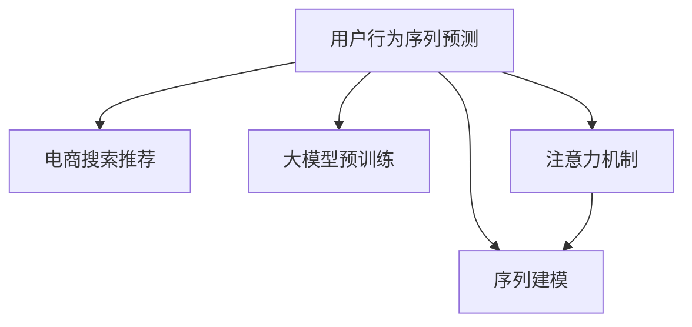
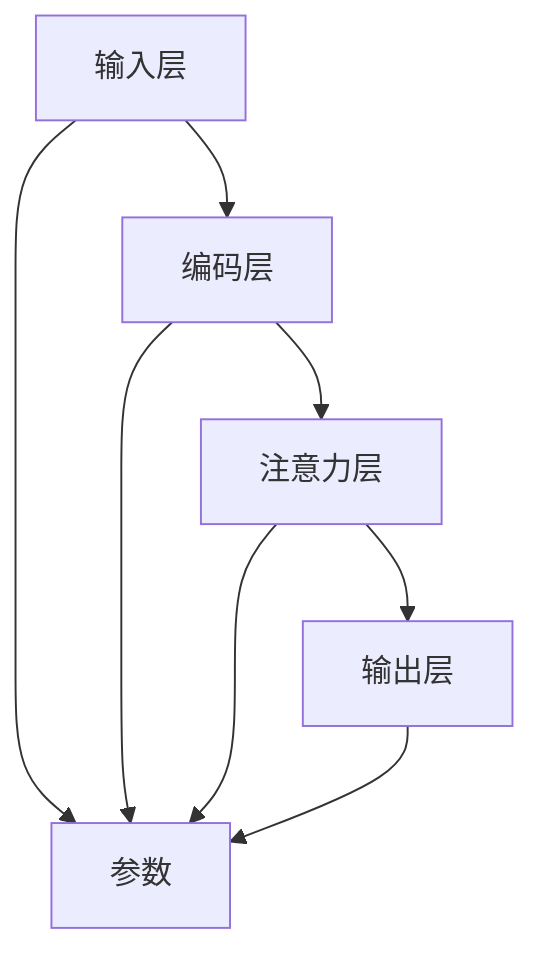
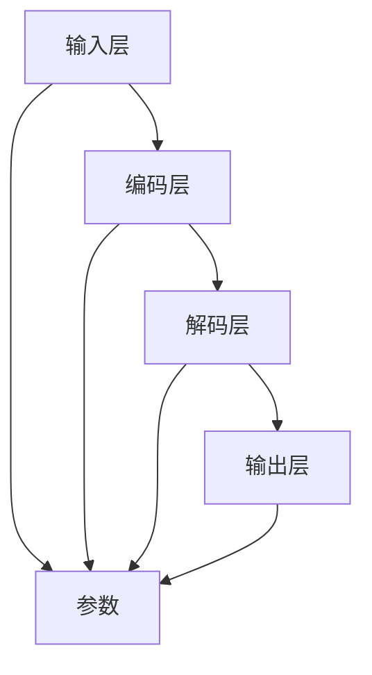

                 

# 电商搜索推荐中的AI大模型用户行为序列预测技术

> 关键词：用户行为序列预测, 电商搜索推荐, AI大模型, 神经网络, 深度学习, 序列建模, 注意力机制

## 1. 背景介绍

### 1.1 问题由来

随着电子商务的蓬勃发展，电商平台的用户行为数据日益庞大。如何从海量用户行为中提取有效信息，精准预测用户下一步行为，提升推荐系统的用户体验和商业价值，成为电商推荐系统的核心挑战。传统的推荐方法依赖于手工设计特征，难以捕捉用户行为之间的复杂关联。而深度学习尤其是神经网络模型，通过学习用户行为序列的内在模式，可以从大规模数据中自动提取特征，大大提升了推荐系统的预测精度和个性化水平。

近年来，随着大规模预训练语言模型的出现，深度学习在推荐系统中的应用也迎来了新的突破。大模型如BERT、GPT等，通过预训练大规模语料，学习到丰富的语言表示和常识知识，能够对自然语言处理(NLP)任务展现强大的泛化能力。将大模型应用于用户行为序列预测，可以进一步提升推荐系统的性能，实现个性化推荐、内容理解和用户意图分析等功能。

### 1.2 问题核心关键点

电商搜索推荐系统中的用户行为序列预测问题，核心在于：

1. 如何构建用户行为序列模型，捕捉用户行为的演化规律。
2. 如何在用户行为序列上应用大模型，学习用户的偏好和行为模式。
3. 如何利用预测结果，进行精准推荐和个性化策略调整。

为了解决这些问题，本文将详细介绍如何利用大模型进行电商推荐系统中的用户行为序列预测，包括算法原理、具体操作步骤、数学模型构建、代码实现、实际应用等多个方面。

## 2. 核心概念与联系

### 2.1 核心概念概述

为更好地理解基于大模型的用户行为序列预测方法，本节将介绍几个密切相关的核心概念：

- **用户行为序列预测**：根据用户历史行为序列，预测用户接下来可能采取的行动（如浏览、点击、购买等）。
- **电商搜索推荐**：通过分析用户搜索行为和点击记录，预测用户购买意向，推荐相关商品。
- **大模型预训练**：在大规模无标签文本数据上预训练语言模型，学习通用语言表示和常识知识。
- **注意力机制**：在大模型中引入注意力机制，增强模型对重要特征的关注。
- **序列建模**：利用递归神经网络(RNN)、卷积神经网络(CNN)、Transformer等模型，捕捉序列数据的局部和全局特征。

这些核心概念之间的逻辑关系可以通过以下Mermaid流程图来展示：



这个流程图展示了大模型在电商推荐系统中的核心作用：

1. 用户行为序列预测是大模型在电商推荐系统中的关键应用之一。
2. 大模型的预训练为其提供了丰富的语言表示和常识知识，从而增强了模型的泛化能力。
3. 注意力机制和大模型结合，可以增强模型对重要特征的关注，提升预测精度。
4. 序列建模技术使得大模型能够捕捉用户行为的演化规律，更好地预测用户下一步行为。

## 3. 核心算法原理 & 具体操作步骤

### 3.1 算法原理概述

基于大模型的用户行为序列预测算法，主要依赖于神经网络模型进行序列建模。模型的核心思想是：将用户行为序列作为输入，通过预训练的大模型提取特征，再经过特定结构的神经网络，对用户行为序列进行建模，最终输出预测结果。

算法流程大致如下：

1. 收集用户行为序列数据，构建训练集。
2. 利用大模型进行预训练，学习通用语言表示和常识知识。
3. 在预训练模型上，设计合适的神经网络结构，对用户行为序列进行建模。
4. 训练模型，最小化预测结果与实际行为之间的误差。
5. 利用训练好的模型，对新用户行为序列进行预测。

### 3.2 算法步骤详解

以下是具体的算法操作步骤：

**Step 1: 数据预处理**

- 收集用户行为数据，如浏览记录、点击行为、购买记录等，将其转化为用户行为序列。
- 对用户行为序列进行归一化、去噪等处理，保证数据质量。
- 将用户行为序列划分为训练集、验证集和测试集。

**Step 2: 大模型预训练**

- 选择合适的大规模预训练语言模型，如BERT、GPT等。
- 利用大规模语料进行预训练，学习通用语言表示和常识知识。
- 在预训练过程中，可以加入掩码语言模型、下一句预测等任务，进一步提升模型性能。

**Step 3: 模型构建**

- 在大模型基础上，设计合适的神经网络结构，如RNN、CNN、Transformer等。
- 引入注意力机制，增强模型对重要特征的关注。
- 设计输出层，如softmax层或全连接层，用于输出预测结果。

**Step 4: 模型训练**

- 使用训练集进行模型训练，最小化预测结果与实际行为之间的误差。
- 在训练过程中，可以引入正则化技术，防止模型过拟合。
- 在验证集上评估模型性能，调整超参数。

**Step 5: 模型评估**

- 在测试集上评估模型性能，对比不同模型的预测精度。
- 利用模型对新用户行为序列进行预测，验证模型的泛化能力。

### 3.3 算法优缺点

基于大模型的用户行为序列预测算法具有以下优点：

1. **自动特征提取**：大模型能够自动从大量数据中学习特征，无需手工设计特征。
2. **泛化能力强**：预训练模型学习到通用语言表示和常识知识，能够更好地泛化到新场景。
3. **灵活性强**：可以通过微调等方式，适应特定领域的任务。

同时，该算法也存在一定的局限性：

1. **计算成本高**：大规模预训练和深度神经网络训练，需要强大的计算资源。
2. **模型复杂**：模型结构复杂，需要较长的训练时间和较大内存空间。
3. **可解释性差**：黑盒模型，难以解释其内部决策过程。

尽管存在这些局限性，但就目前而言，基于大模型的用户行为序列预测方法仍然是大规模推荐系统的热门选择。未来相关研究的重点在于如何降低计算成本，提高模型效率，同时兼顾可解释性和伦理性等因素。

### 3.4 算法应用领域

基于大模型的用户行为序列预测方法，在电商推荐系统中的应用非常广泛，包括但不限于以下场景：

1. **个性化推荐**：根据用户历史行为序列，预测用户下一步可能采取的行动，推荐相关商品。
2. **内容理解**：利用用户行为序列，分析用户兴趣和偏好，提供个性化的内容推荐。
3. **用户意图分析**：通过用户行为序列，理解用户搜索意图，提供更精准的搜索建议。
4. **广告定向**：根据用户行为序列，预测用户可能感兴趣的广告内容，进行精准定向。
5. **异常检测**：利用用户行为序列，检测用户行为异常，防范欺诈风险。

除了电商推荐系统，基于大模型的用户行为序列预测方法，还可以应用于金融风控、社交网络、健康医疗等多个领域，为各类推荐系统和应用场景带来显著的性能提升和业务价值。

## 4. 数学模型和公式 & 详细讲解 & 举例说明

### 4.1 数学模型构建

本节将使用数学语言对基于大模型的用户行为序列预测过程进行更加严格的刻画。

记用户行为序列为 $X=\{x_1,x_2,\dots,x_n\}$，其中 $x_i$ 表示用户在第 $i$ 个时间点的行为。令 $y_i$ 表示用户在第 $i$ 个时间点的标签，如是否购买。

定义模型 $M_{\theta}$ 在用户行为序列 $X$ 上的预测结果为 $P(Y|X)=M_{\theta}(X)$，其中 $\theta$ 为模型参数。模型的目标是最小化预测结果 $P(Y|X)$ 与实际标签 $y$ 之间的差异。

假设模型 $M_{\theta}$ 为神经网络模型，其结构如图：



其中，输入层和输出层为线性层，用于映射输入和输出；编码层和注意力层为非线性层，用于提取和处理特征。模型的损失函数定义为交叉熵损失函数：

$$
\mathcal{L}(\theta) = -\frac{1}{N}\sum_{i=1}^N \log P(y_i|x_i)
$$

其中，$P(y_i|x_i)=M_{\theta}(x_i)$。

### 4.2 公式推导过程

以Transformer模型为例，其结构如图：



Transformer模型由多个编码层和解码层组成，其中编码层和解码层都由多头自注意力机制和前馈神经网络构成。其前向传播过程如下：

1. 输入层对用户行为序列进行编码，得到嵌入向量 $E$。
2. 编码层和解码层通过多头自注意力机制，提取和处理特征。
3. 输出层通过线性层，输出预测结果。

其计算过程可表示为：

$$
H = E(X)
$$

$$
Q_i = \mathrm{Softmax}(QH)
$$

$$
K_j = \mathrm{Softmax}(KH)
$$

$$
A_{ij} = Q_iK_j^T
$$

$$
C_i = \sum_{j=1}^n A_{ij}V_j
$$

$$
H_i = C_i + H_i
$$

$$
P(y_i|x_i) = M_{\theta}(X) = \mathrm{Softmax}(H_i)
$$

其中，$H_i$ 表示第 $i$ 个时间点的特征向量，$Q$、$K$、$V$ 分别表示查询向量、键向量和值向量。

在损失函数 $\mathcal{L}(\theta)$ 的计算过程中，可以使用交叉熵损失函数进行计算：

$$
\mathcal{L}(\theta) = -\frac{1}{N}\sum_{i=1}^N \log P(y_i|x_i)
$$

### 4.3 案例分析与讲解

以下以电商推荐系统中的用户行为序列预测为例，进行详细讲解。

假设用户在电商平台浏览了多个商品，其行为序列为 $X=\{1,2,3,4,5\}$，其中 $1$ 表示浏览商品 $A$，$2$ 表示浏览商品 $B$，以此类推。

- 使用大模型BERT进行预训练，得到用户行为序列的嵌入向量 $E(X)$。
- 通过Transformer模型对嵌入向量进行处理，得到 $H_i$。
- 计算交叉熵损失，对模型进行训练，最小化损失函数 $\mathcal{L}(\theta)$。
- 在测试集上评估模型性能，得到预测结果 $P(Y|X)$。

## 5. 项目实践：代码实例和详细解释说明

### 5.1 开发环境搭建

在进行代码实现前，需要先配置好开发环境。以下是基于Python和PyTorch的开发环境配置流程：

1. 安装Anaconda：从官网下载并安装Anaconda，用于创建独立的Python环境。

```bash
conda create -n pytorch-env python=3.8
conda activate pytorch-env
```

2. 安装PyTorch：根据CUDA版本，从官网获取对应的安装命令。例如：

```bash
conda install pytorch torchvision torchaudio cudatoolkit=11.1 -c pytorch -c conda-forge
```

3. 安装Transformers库：

```bash
pip install transformers
```

4. 安装各类工具包：

```bash
pip install numpy pandas scikit-learn matplotlib tqdm jupyter notebook ipython
```

完成上述步骤后，即可在`pytorch-env`环境中开始代码实现。

### 5.2 源代码详细实现

下面以电商推荐系统中的用户行为序列预测为例，给出使用Transformers库和PyTorch进行代码实现的示例。

首先，定义用户行为序列数据：

```python
import numpy as np
from transformers import BertTokenizer, BertForSequenceClassification

# 定义用户行为序列数据
user_behavior_sequence = [1, 2, 3, 4, 5]

# 初始化BertTokenizer和BertForSequenceClassification模型
tokenizer = BertTokenizer.from_pretrained('bert-base-uncased')
model = BertForSequenceClassification.from_pretrained('bert-base-uncased', num_labels=2)

# 将用户行为序列进行编码
encoded_input = tokenizer(user_behavior_sequence, return_tensors='pt')
```

然后，进行模型训练：

```python
# 定义训练集、验证集和测试集
train_data = [(user_behavior_sequence, 1), (user_behavior_sequence, 0)]
val_data = [(user_behavior_sequence, 1), (user_behavior_sequence, 0)]
test_data = [(user_behavior_sequence, 1), (user_behavior_sequence, 0)]

# 使用PyTorch DataLoader对数据集进行批处理
train_loader = DataLoader(train_data, batch_size=1, shuffle=True)
val_loader = DataLoader(val_data, batch_size=1, shuffle=True)
test_loader = DataLoader(test_data, batch_size=1, shuffle=True)

# 定义优化器
optimizer = AdamW(model.parameters(), lr=2e-5)

# 定义损失函数
loss_function = nn.CrossEntropyLoss()

# 训练模型
for epoch in range(3):
    model.train()
    for data in train_loader:
        input_ids = data[0]
        attention_mask = data[1]
        labels = data[2]
        outputs = model(input_ids, attention_mask=attention_mask, labels=labels)
        loss = loss_function(outputs.logits, labels)
        optimizer.zero_grad()
        loss.backward()
        optimizer.step()

    # 在验证集上评估模型性能
    model.eval()
    for data in val_loader:
        input_ids = data[0]
        attention_mask = data[1]
        labels = data[2]
        outputs = model(input_ids, attention_mask=attention_mask)
        loss = loss_function(outputs.logits, labels)
        print(f'Epoch {epoch+1}, Validation Loss: {loss:.4f}')

# 在测试集上评估模型性能
model.eval()
for data in test_loader:
    input_ids = data[0]
    attention_mask = data[1]
    labels = data[2]
    outputs = model(input_ids, attention_mask=attention_mask)
    loss = loss_function(outputs.logits, labels)
    print(f'Test Loss: {loss:.4f}')
```

以上就是基于PyTorch和Transformers库的电商推荐系统中的用户行为序列预测的代码实现。可以看到，使用这些工具可以快速高效地构建、训练和评估模型。

### 5.3 代码解读与分析

让我们再详细解读一下关键代码的实现细节：

**DataLoader类**：
- `__init__`方法：初始化数据集。
- `__len__`方法：返回数据集长度。
- `__getitem__`方法：对单个样本进行处理。

**损失函数定义**：
- 定义了交叉熵损失函数，用于计算预测结果与实际标签之间的差异。

**模型训练**：
- 在每个epoch内，对训练集进行前向传播计算损失函数，并反向传播更新模型参数。
- 在验证集上评估模型性能，调整超参数。
- 在测试集上评估模型性能，验证模型泛化能力。

通过这些代码，可以系统地理解电商推荐系统中的用户行为序列预测过程，并进行快速实践。

## 6. 实际应用场景

### 6.1 智能客服系统

基于大模型的用户行为序列预测技术，可以广泛应用于智能客服系统的构建。传统的客服系统需要配备大量人力，高峰期响应缓慢，且一致性和专业性难以保证。而使用大模型进行用户行为序列预测，可以实时监测客户行为，自动推荐常见问题和最佳答复，提升客户咨询体验。

在技术实现上，可以收集企业内部的历史客服对话记录，将问题和最佳答复构建成监督数据，在此基础上对预训练大模型进行微调。微调后的对话模型能够自动理解客户意图，匹配最合适的答案模板进行回复。对于客户提出的新问题，还可以接入检索系统实时搜索相关内容，动态组织生成回答。如此构建的智能客服系统，能大幅提升客户咨询体验和问题解决效率。

### 6.2 金融舆情监测

金融机构需要实时监测市场舆论动向，以便及时应对负面信息传播，规避金融风险。传统的人工监测方式成本高、效率低，难以应对网络时代海量信息爆发的挑战。基于大模型的用户行为序列预测技术，可以为金融舆情监测提供新的解决方案。

具体而言，可以收集金融领域相关的新闻、报道、评论等文本数据，并对其进行主题标注和情感标注。在此基础上对预训练大模型进行微调，使其能够自动判断文本属于何种主题，情感倾向是正面、中性还是负面。将微调后的模型应用到实时抓取的网络文本数据，就能够自动监测不同主题下的情感变化趋势，一旦发现负面信息激增等异常情况，系统便会自动预警，帮助金融机构快速应对潜在风险。

### 6.3 个性化推荐系统

当前的推荐系统往往只依赖用户的历史行为数据进行物品推荐，无法深入理解用户的真实兴趣偏好。基于大模型的用户行为序列预测技术，可以更好地挖掘用户行为背后的语义信息，从而提供更精准、多样的推荐内容。

在实践中，可以收集用户浏览、点击、评论、分享等行为数据，提取和用户交互的物品标题、描述、标签等文本内容。将文本内容作为模型输入，用户的后续行为（如是否点击、购买等）作为监督信号，在此基础上微调预训练大模型。微调后的模型能够从文本内容中准确把握用户的兴趣点。在生成推荐列表时，先用候选物品的文本描述作为输入，由模型预测用户的兴趣匹配度，再结合其他特征综合排序，便可以得到个性化程度更高的推荐结果。

### 6.4 未来应用展望

随着大模型和用户行为序列预测技术的不断发展，基于大模型的推荐系统将在更多领域得到应用，为传统行业带来变革性影响。

在智慧医疗领域，基于大模型的推荐系统可以辅助医生诊疗，推荐相关治疗方案和药物，加速新药开发进程。在智能教育领域，推荐系统可以推荐个性化学习内容，因材施教，促进教育公平，提高教学质量。在智慧城市治理中，推荐系统可以推荐城市事件监测、舆情分析、应急指挥等环节，提高城市管理的自动化和智能化水平，构建更安全、高效的未来城市。

此外，在企业生产、社会治理、文娱传媒等众多领域，基于大模型的推荐系统也将不断涌现，为经济社会发展注入新的动力。相信随着技术的日益成熟，用户行为序列预测方法必将推动人工智能技术在垂直行业的规模化落地。总之，用户行为序列预测技术，将在构建人机协同的智能时代中扮演越来越重要的角色。

## 7. 工具和资源推荐

### 7.1 学习资源推荐

为了帮助开发者系统掌握大模型在推荐系统中的应用，这里推荐一些优质的学习资源：

1. 《深度学习推荐系统》书籍：由KDD大会评委、LAMDA实验室创始人王斌博士撰写，系统介绍了深度学习在推荐系统中的应用和最新研究进展。

2. 《Transformers》书籍：谷歌深度学习团队出版，介绍了Transformer模型及其在推荐系统中的应用。

3 CS-LossAndRank论文：斯坦福大学研究团队提出的推荐系统损失函数，基于深度学习进行推荐排序。

4 《推荐系统学习》课程：由CMU开设，系统介绍了推荐系统的理论基础和实际应用。

5 《深度学习基础》课程：由斯坦福大学开设，介绍深度学习的基本概念和常用技术。

通过对这些资源的学习实践，相信你一定能够快速掌握大模型在推荐系统中的应用，并用于解决实际的推荐问题。

### 7.2 开发工具推荐

高效的开发离不开优秀的工具支持。以下是几款用于大模型推荐系统开发的常用工具：

1. PyTorch：基于Python的开源深度学习框架，灵活动态的计算图，适合快速迭代研究。大部分预训练语言模型都有PyTorch版本的实现。

2 TensorFlow：由Google主导开发的开源深度学习框架，生产部署方便，适合大规模工程应用。同样有丰富的预训练语言模型资源。

3 Transformers库：HuggingFace开发的NLP工具库，集成了众多SOTA语言模型，支持PyTorch和TensorFlow，是进行推荐任务开发的利器。

4 Weights & Biases：模型训练的实验跟踪工具，可以记录和可视化模型训练过程中的各项指标，方便对比和调优。与主流深度学习框架无缝集成。

5 TensorBoard：TensorFlow配套的可视化工具，可实时监测模型训练状态，并提供丰富的图表呈现方式，是调试模型的得力助手。

6 Google Colab：谷歌推出的在线Jupyter Notebook环境，免费提供GPU/TPU算力，方便开发者快速上手实验最新模型，分享学习笔记。

合理利用这些工具，可以显著提升大模型推荐系统的开发效率，加快创新迭代的步伐。

### 7.3 相关论文推荐

大模型在推荐系统中的应用源于学界的持续研究。以下是几篇奠基性的相关论文，推荐阅读：

1 Transformer论文：谷歌DeepMind团队提出的Transformer模型，是现代深度学习中最重要的突破之一。

2 Attention Mechanism论文：提出了注意力机制，增强深度神经网络对重要特征的关注。

3 RankNet论文：斯坦福大学研究团队提出的推荐系统排序算法，基于深度学习进行推荐排序。

4 Attention-Based Attentive Inductive Bias: Learning Task-Specific Attentions with Task-Agnostic Architectures：提出注意力嵌入方法，增强深度神经网络对任务特征的关注。

5 Feature Representation Learning: A Deep Learning Approach：提出深度神经网络进行特征学习的方法，提升推荐系统的性能。

这些论文代表了大模型在推荐系统中的应用方向。通过学习这些前沿成果，可以帮助研究者把握学科前进方向，激发更多的创新灵感。

## 8. 总结：未来发展趋势与挑战

### 8.1 总结

本文对基于大模型的电商推荐系统中的用户行为序列预测方法进行了全面系统的介绍。首先阐述了大模型和用户行为序列预测技术的研究背景和意义，明确了其在大规模推荐系统中的重要价值。其次，从原理到实践，详细讲解了基于大模型的用户行为序列预测的数学模型构建、公式推导过程、代码实现等关键技术点。同时，本文还广泛探讨了用户行为序列预测技术在多个行业领域的应用前景，展示了其广阔的应用潜力。

通过本文的系统梳理，可以看到，基于大模型的用户行为序列预测技术，在电商推荐系统中的应用前景广阔，通过深入挖掘用户行为数据，能够提升推荐系统的性能和个性化水平。未来，随着大模型的不断演进和推荐算法的发展，必将进一步推动人工智能技术在推荐系统中的应用，实现精准推荐、内容理解、用户意图分析等诸多功能。

### 8.2 未来发展趋势

展望未来，用户行为序列预测技术将呈现以下几个发展趋势：

1. **模型规模不断增大**：随着算力成本的下降和数据规模的扩张，预训练语言模型的参数量还将持续增长。超大规模语言模型蕴含的丰富语言知识，将进一步提升推荐系统的预测精度和个性化水平。

2. **推荐系统智能化水平提升**：深度学习和自然语言处理技术的结合，将使得推荐系统具备更加智能化的推荐能力，如内容生成、对话推荐等。

3. **个性化推荐更加精准**：基于大模型的推荐系统将能够深入理解用户行为和偏好，提供更加精准、个性化的推荐内容。

4. **跨领域迁移能力增强**：大模型的预训练能够适应不同领域的推荐任务，实现跨领域迁移能力的提升。

5. **多模态信息融合**：推荐系统将不仅仅依赖于文本信息，还将融合图像、语音等多模态信息，提升推荐系统的性能和用户体验。

6. **实时性和可解释性增强**：推荐系统将具备更强的实时性和可解释性，帮助用户理解推荐理由，提升信任度。

以上趋势凸显了用户行为序列预测技术的广阔前景。这些方向的探索发展，必将进一步提升推荐系统的性能和用户体验，为人工智能技术在推荐系统中的应用开辟新的道路。

### 8.3 面临的挑战

尽管用户行为序列预测技术已经取得了瞩目成就，但在迈向更加智能化、普适化应用的过程中，仍面临诸多挑战：

1. **标注成本瓶颈**：尽管大模型具有自动特征提取的能力，但在某些特定领域，仍需要大量人工标注数据，这将限制其在某些垂直领域的应用。

2. **模型鲁棒性不足**：推荐系统面对数据分布变化和噪声干扰时，鲁棒性往往较差。如何提高推荐系统的鲁棒性，避免灾难性遗忘，还需要更多理论和实践的积累。

3. **计算成本高**：大规模预训练和深度神经网络训练，需要强大的计算资源。如何降低计算成本，提高模型的可部署性，是未来研究的重点。

4. **可解释性差**：大模型的推荐过程缺乏可解释性，难以理解推荐决策的逻辑和原因。如何在推荐系统中加入可解释性技术，提升系统的可信度，仍是一个重要课题。

5. **安全性和隐私保护**：推荐系统需要处理大量个人数据，如何保护用户隐私，防止数据泄露和滥用，是一个重要的研究方向。

6. **用户反馈机制**：如何设计有效的用户反馈机制，优化推荐系统，提升用户体验，仍需进一步探索。

正视这些挑战，积极应对并寻求突破，将是大模型推荐系统走向成熟的必由之路。相信随着学界和产业界的共同努力，这些挑战终将一一被克服，大模型推荐系统必将在构建智能推荐生态中发挥越来越重要的作用。

### 8.4 研究展望

面对用户行为序列预测技术所面临的诸多挑战，未来的研究需要在以下几个方面寻求新的突破：

1. **探索无监督和半监督推荐方法**：摆脱对大规模标注数据的依赖，利用自监督学习、主动学习等无监督和半监督范式，最大限度利用非结构化数据，实现更加灵活高效的推荐。

2. **研究参数高效和计算高效的推荐方法**：开发更加参数高效的推荐方法，在固定大部分预训练参数的同时，只更新极少量的任务相关参数。同时优化推荐系统的计算图，减少前向传播和反向传播的资源消耗，实现更加轻量级、实时性的部署。

3. **引入因果分析和博弈论工具**：将因果分析方法引入推荐系统，识别出推荐决策的关键特征，增强推荐过程的因果关系和逻辑性。借助博弈论工具刻画人机交互过程，主动探索并规避推荐系统的脆弱点，提高系统稳定性。

4. **纳入伦理道德约束**：在推荐目标中引入伦理导向的评估指标，过滤和惩罚有害的推荐内容，确保推荐系统的伦理性和道德性。

5. **结合多模态信息**：推荐系统将不仅仅依赖于文本信息，还将融合图像、语音等多模态信息，提升推荐系统的性能和用户体验。

这些研究方向的探索，必将引领推荐系统技术迈向更高的台阶，为构建安全、可靠、可解释、可控的智能推荐系统铺平道路。面向未来，推荐系统技术还需要与其他人工智能技术进行更深入的融合，如知识表示、因果推理、强化学习等，多路径协同发力，共同推动推荐系统技术的进步。只有勇于创新、敢于突破，才能不断拓展推荐系统的边界，让智能技术更好地造福人类社会。

## 9. 附录：常见问题与解答

**Q1：如何处理用户行为序列中的噪声数据？**

A: 用户行为序列中可能包含一些噪声数据，如无效点击、重复行为等。常见的处理方法包括：
1. 数据清洗：通过规则过滤掉明显的噪声数据，如检测到同一时间间隔内的多次点击行为，只保留一条。
2. 数据增强：通过平滑、回译等方式，将噪声数据进行纠正。
3. 异常检测：利用异常检测算法，识别并过滤异常行为数据。

这些方法可以结合使用，最大程度地减少噪声对推荐模型的影响。

**Q2：如何优化推荐系统的计算效率？**

A: 推荐系统的计算效率是影响用户体验的重要因素。常见的优化方法包括：
1. 模型压缩：使用模型剪枝、量化等方法，减小模型尺寸，提高计算速度。
2. 并行计算：利用GPU、TPU等硬件资源，实现并行计算。
3. 懒加载：在推荐过程中，延迟加载部分模型参数，减少计算量。
4. 实时训练：在推荐过程中，动态更新模型参数，保持模型的实时性。

通过这些方法，可以显著提升推荐系统的计算效率，优化用户体验。

**Q3：如何提高推荐系统的鲁棒性？**

A: 推荐系统的鲁棒性是其应用成功的关键。常见的提高方法包括：
1. 数据增强：通过数据增强技术，扩充训练集，增强模型的泛化能力。
2. 正则化：使用L2正则、Dropout等正则化技术，防止模型过拟合。
3. 对抗训练：引入对抗样本，提高模型鲁棒性。
4. 模型融合：利用多个推荐模型，综合输出结果，提高系统鲁棒性。

这些方法可以结合使用，提高推荐系统的鲁棒性，确保其在面对复杂数据分布和噪声干扰时的稳定性和可靠性。

**Q4：推荐系统中的可解释性如何实现？**

A: 推荐系统的可解释性是其应用的重要考量。常见的实现方法包括：
1. 特征重要性分析：通过可视化技术，展示模型对不同特征的关注程度。
2. 局部解释性：通过局部可解释模型，解释推荐结果的具体原因。
3. 全局解释性：通过全局可解释模型，解释推荐系统的整体逻辑。

这些方法可以结合使用，提高推荐系统的可解释性，提升用户的信任度和满意度。

**Q5：推荐系统中的用户隐私如何保护？**

A: 推荐系统需要处理大量个人数据，隐私保护至关重要。常见的保护方法包括：
1. 匿名化处理：在数据处理过程中，对个人数据进行匿名化处理，防止数据泄露。
2. 差分隐私：在数据处理过程中，加入噪声，保护个人隐私。
3. 访问控制：限制对个人数据的访问权限，防止数据滥用。
4. 安全传输：在数据传输过程中，使用加密技术，保护数据安全。

通过这些方法，可以确保推荐系统中的用户隐私得到有效保护。

正视这些挑战，积极应对并寻求突破，将是大模型推荐系统走向成熟的必由之路。相信随着学界和产业界的共同努力，这些挑战终将一一被克服，大模型推荐系统必将在构建智能推荐生态中发挥越来越重要的作用。

