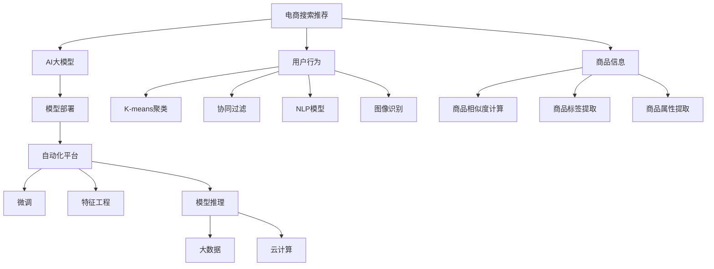

                 

# 电商搜索推荐场景下的AI大模型模型部署全流程自动化平台搭建

> 关键词：电商搜索推荐, AI大模型, 模型部署, 自动化平台, 微调, 特征工程, 模型推理, 大数据, 云计算, 安全合规

## 1. 背景介绍

随着人工智能技术的快速发展，大语言模型在电商搜索推荐领域的应用日益广泛。这些大模型通过在大规模无标签数据上进行预训练，学习到丰富的语言和视觉知识，能够理解用户查询意图，自动生成推荐内容，极大提升了用户体验和商家转化率。然而，将这些大模型应用于电商搜索推荐场景，需要进行全流程的自动化部署，包括数据准备、模型微调、特征工程、模型推理等多个环节。本文将介绍如何搭建一个高效、灵活的AI大模型部署平台，涵盖模型部署、自动化流水线、监控告警等多个方面，助力电商企业快速落地AI推荐系统。

## 2. 核心概念与联系

### 2.1 核心概念概述

为更好地理解AI大模型在电商搜索推荐场景下的部署全流程自动化平台，本节将介绍几个密切相关的核心概念：

- **电商搜索推荐**：指通过AI技术，将用户查询与商品进行智能匹配，自动推荐满足用户需求的商品，提升用户体验和商家转化率。
- **AI大模型**：指基于深度学习模型，通过大规模预训练学习到通用知识，能够高效处理复杂自然语言和视觉信息的模型。
- **模型部署**：指将训练好的模型封装为可调用服务，集成到电商系统中，实现自动化的推荐。
- **自动化平台**：指通过一系列自动化工具和技术，自动完成模型训练、微调、推理等流程，提升部署效率和精度。
- **微调**：指在预训练模型的基础上，使用电商搜索推荐场景的标注数据，进一步优化模型在推荐任务上的性能。
- **特征工程**：指根据电商搜索推荐场景的特点，选择合适的特征，进行数据预处理和特征提取，提高模型效果。
- **模型推理**：指将电商用户查询和商品特征输入到模型中，输出推荐结果的过程。
- **大数据**：指电商平台上每天生成的海量数据，包括用户行为数据、商品信息数据等。
- **云计算**：指通过云平台，提供计算资源和存储服务，支持大规模数据处理和模型训练。
- **安全合规**：指确保AI模型在电商搜索推荐中的应用符合法律法规要求，保障用户数据安全和隐私。

这些核心概念之间的逻辑关系可以通过以下Mermaid流程图来展示：



这个流程图展示了大模型在电商搜索推荐场景中的应用流程：

1. 电商搜索推荐系统收集用户行为和商品信息，用于模型训练。
2. 利用大模型进行用户查询意图理解、商品匹配等，生成推荐结果。
3. 在推荐过程中进行特征工程，选择重要特征。
4. 对模型进行微调，提升推荐准确性。
5. 通过大数据和云计算资源，支持模型训练和推理。
6. 在部署平台实现自动化流程，提高效率和精度。
7. 确保模型应用的安全合规性，保障用户数据隐私。

## 3. 核心算法原理 & 具体操作步骤

### 3.1 算法原理概述

在大模型应用于电商搜索推荐场景的自动化部署平台中，主要涉及以下几个核心算法和操作步骤：

1. **数据准备**：收集电商平台的用户行为数据和商品信息数据，用于模型训练和推理。
2. **模型微调**：在预训练模型基础上，使用电商搜索推荐场景的标注数据，进一步优化模型在推荐任务上的性能。
3. **特征工程**：根据电商搜索推荐场景的特点，选择合适的特征，进行数据预处理和特征提取。
4. **模型推理**：将用户查询和商品特征输入到模型中，输出推荐结果。
5. **自动化部署**：将模型封装为可调用服务，集成到电商系统中，实现自动化的推荐。

### 3.2 算法步骤详解

#### 数据准备

1. **数据采集**：
   - 从电商平台的日志、订单、浏览行为等数据源中，收集用户行为数据和商品信息数据。
   - 对数据进行清洗、去重、归一化等预处理操作。

2. **数据标注**：
   - 使用电商搜索推荐场景的标注数据，对数据进行标注。例如，标注用户点击的商品ID、评分、评分标签等。
   - 利用半监督学习、主动学习等方法，降低标注成本。

3. **数据划分**：
   - 将数据划分为训练集、验证集和测试集。通常训练集用于模型微调，验证集用于超参数调优，测试集用于评估模型性能。

#### 模型微调

1. **选择合适的预训练模型**：
   - 根据电商搜索推荐场景的需求，选择合适的预训练模型，如BERT、GPT、DALL-E等。
   - 下载预训练模型和对应的 tokenizer。

2. **添加任务适配层**：
   - 根据推荐任务的类型，在预训练模型的基础上添加合适的任务适配层，如全连接层、注意力机制等。
   - 定义推荐任务的损失函数，如交叉熵损失、均方误差损失等。

3. **微调模型**：
   - 设置微调超参数，如学习率、批大小、迭代轮数等。
   - 使用训练集数据进行微调，并在验证集上评估模型性能。
   - 根据评估结果，调整超参数，重新微调模型。

4. **微调模型评估**：
   - 在测试集上评估微调后的模型性能，计算精度、召回率、F1值等指标。
   - 利用A/B测试等方法，对比微调前后的推荐效果。

#### 特征工程

1. **特征选择**：
   - 根据电商搜索推荐场景的特点，选择合适的特征，如用户历史行为、商品评分、商品属性、商品类别等。
   - 利用特征选择算法，如卡方检验、信息增益等，选择重要的特征。

2. **特征提取**：
   - 对选择的特征进行提取和处理，如归一化、编码等。
   - 将提取的特征与用户查询和商品特征拼接，形成输入向量。

#### 模型推理

1. **输入预处理**：
   - 将用户查询和商品特征进行拼接，形成输入向量。
   - 对输入向量进行归一化、编码等预处理操作。

2. **模型推理**：
   - 将预处理后的输入向量输入到微调后的模型中，输出推荐结果。
   - 将推荐结果排序，选择前N个推荐商品。

3. **结果输出**：
   - 将推荐结果转换为电商搜索推荐系统可识别的格式，如商品ID、评分等。
   - 将推荐结果展示给用户。

#### 自动化部署

1. **模型封装**：
   - 将微调后的模型封装为可调用服务，如REST API、DNN服务等。
   - 使用容器化技术，如Docker，实现模型的自动化部署。

2. **服务集成**：
   - 将模型服务集成到电商搜索推荐系统中，实现自动化的推荐。
   - 与电商系统进行接口对接，确保数据流畅传递。

3. **监控告警**：
   - 对模型服务进行实时监控，设置异常告警阈值。
   - 实时采集系统指标，如请求数、响应时间、错误率等，确保服务稳定性。

### 3.3 算法优缺点

大模型应用于电商搜索推荐场景的自动化部署平台，具有以下优点：

1. **提升推荐效果**：
   - 利用大模型的强大表示能力，提升推荐模型的准确性和多样性。
   - 通过微调和特征工程，进一步优化推荐模型，提高用户体验和商家转化率。

2. **降低成本**：
   - 自动化部署平台能够自动完成数据准备、模型微调、特征工程等环节，节省大量人工成本。
   - 利用云计算资源，降低硬件投入和运维成本。

3. **提高部署效率**：
   - 通过自动化流水线和接口集成，快速部署和迭代模型，提升电商搜索推荐系统的响应速度和灵活性。

4. **保障数据安全**：
   - 在数据处理和模型部署过程中，采用安全合规措施，保障用户数据隐私和系统安全性。

5. **支持跨平台应用**：
   - 利用云平台的多平台支持，支持不同设备和终端的推荐系统应用。

同时，该方法也存在一些局限性：

1. **数据质量依赖**：
   - 电商搜索推荐场景的推荐效果高度依赖于数据质量，如果数据标注不准确或数据噪声较多，推荐效果将受到影响。

2. **模型复杂度高**：
   - 大模型的复杂度较高，训练和推理过程较慢，需要较强的计算资源支持。

3. **维护成本高**：
   - 自动化部署平台需要持续维护和更新，保证系统稳定性和安全性。

4. **对抗攻击风险**：
   - 大模型可能面临对抗攻击，导致推荐结果偏差。

5. **可解释性不足**：
   - 大模型的决策过程缺乏可解释性，难以进行模型调试和优化。

尽管存在这些局限性，但就目前而言，基于大模型的电商搜索推荐自动化部署平台仍是大数据推荐系统的重要范式。未来相关研究的重点在于如何进一步降低数据质量依赖，提高模型鲁棒性，优化系统性能，同时兼顾可解释性和伦理安全性等因素。

### 3.4 算法应用领域

大模型在电商搜索推荐场景中的应用非常广泛，涉及以下几个关键领域：

1. **商品推荐**：
   - 根据用户的历史行为和当前查询，自动推荐相关商品。
   - 结合用户画像和商品标签，进行个性化推荐。

2. **广告推荐**：
   - 根据用户行为数据，自动推荐相关广告。
   - 结合广告投放策略，进行精准投放。

3. **内容推荐**：
   - 根据用户的历史行为和当前查询，自动推荐相关内容。
   - 结合内容质量评估，进行优质内容推荐。

4. **促销活动推荐**：
   - 根据用户行为和历史数据，自动推荐相关促销活动。
   - 结合用户画像和促销策略，进行个性化推荐。

5. **用户行为分析**：
   - 利用用户行为数据，进行用户画像构建和行为预测。
   - 结合聚类算法、协同过滤等方法，进行用户分群和行为分析。

6. **实时推荐优化**：
   - 根据用户实时行为，动态调整推荐策略。
   - 利用实时数据流处理技术，实现实时推荐优化。

## 4. 数学模型和公式 & 详细讲解 & 举例说明

### 4.1 数学模型构建

在大模型应用于电商搜索推荐场景的自动化部署平台中，主要涉及以下几个数学模型：

1. **用户行为建模**：
   - 使用用户历史行为数据，构建用户兴趣表示向量。
   - 采用K-means聚类算法，将用户分为不同的兴趣群体。

2. **商品匹配建模**：
   - 使用商品评分和商品特征数据，构建商品表示向量。
   - 采用协同过滤算法，计算用户与商品之间的相似度。

3. **推荐模型建模**：
   - 使用大模型进行用户查询意图理解和商品匹配，生成推荐结果。
   - 采用交叉熵损失函数，优化推荐模型的参数。

### 4.2 公式推导过程

#### 用户行为建模

1. **用户兴趣表示**：
   - 假设用户历史行为数据为 $x=\{x_1,x_2,...,x_n\}$，其中 $x_i=(x_{i1},x_{i2},...,x_{in})$ 为第 $i$ 个用户的 $n$ 个行为数据。
   - 使用K-means聚类算法，将用户分为 $K$ 个兴趣群体，每个群体的表示向量为 $c_k=(k_1,k_2,...,k_n)$。

2. **用户兴趣表示计算**：
   - 对于第 $i$ 个用户，其兴趣表示向量 $u_i$ 为：
     $$
     u_i = \frac{1}{K} \sum_{k=1}^{K} c_k \times \frac{1}{\sqrt{n}} \sum_{j=1}^{n} \frac{x_{ij}}{\|x_{ij}\|}
     $$
   - 其中 $c_k$ 为第 $k$ 个兴趣群体的表示向量，$\|x_{ij}\|$ 为行为数据 $x_{ij}$ 的范数。

#### 商品匹配建模

1. **商品表示向量**：
   - 假设商品信息数据为 $y=\{y_1,y_2,...,y_m\}$，其中 $y_i=(y_{i1},y_{i2},...,y_{im})$ 为第 $i$ 个商品的 $m$ 个特征。
   - 使用协同过滤算法，计算用户与商品之间的相似度 $s_{ij}$。

2. **相似度计算**：
   - 对于第 $i$ 个用户和第 $j$ 个商品，其相似度 $s_{ij}$ 为：
     $$
     s_{ij} = \frac{\sum_{k=1}^{m} a_{ik} \times b_{jk}}{\sqrt{\sum_{k=1}^{m} a_{ik}^2} \times \sqrt{\sum_{k=1}^{m} b_{jk}^2}}
     $$
   - 其中 $a_{ik}$ 和 $b_{jk}$ 分别为用户行为数据和商品特征数据的第 $k$ 个特征。

#### 推荐模型建模

1. **推荐结果计算**：
   - 假设用户查询为 $q$，推荐模型为 $M_{\theta}$，商品特征为 $z$，推荐结果为 $r$。
   - 将用户查询和商品特征拼接，形成输入向量 $x$，输出推荐结果 $r$。
   - 定义推荐模型的损失函数为交叉熵损失 $L$。

2. **交叉熵损失计算**：
   - 对于第 $i$ 个用户和第 $j$ 个商品，其推荐结果为 $r_{ij}$，则推荐模型的损失函数为：
     $$
     L = -\frac{1}{N} \sum_{i=1}^{N} \sum_{j=1}^{M} y_{ij} \log r_{ij}
     $$
   - 其中 $y_{ij}$ 为推荐结果的标签，$r_{ij}$ 为推荐模型的预测结果。

### 4.3 案例分析与讲解

以电商搜索推荐场景中的商品推荐为例，展示大模型的应用过程：

1. **数据准备**：
   - 从电商平台的日志、订单、浏览行为等数据源中，收集用户行为数据和商品信息数据。
   - 对数据进行清洗、去重、归一化等预处理操作。

2. **模型微调**：
   - 使用电商搜索推荐场景的标注数据，对预训练模型进行微调。例如，使用伯明翰大学提供的ADDA dataset。
   - 添加全连接层和注意力机制，定义推荐任务的损失函数。

3. **特征工程**：
   - 根据电商搜索推荐场景的特点，选择合适的特征，如用户历史行为、商品评分、商品属性等。
   - 利用特征选择算法，选择重要的特征。

4. **模型推理**：
   - 将用户查询和商品特征进行拼接，形成输入向量。
   - 将输入向量输入到微调后的模型中，输出推荐结果。

5. **结果输出**：
   - 将推荐结果转换为电商搜索推荐系统可识别的格式，如商品ID、评分等。
   - 将推荐结果展示给用户。

## 5. 项目实践：代码实例和详细解释说明

### 5.1 开发环境搭建

在进行大模型应用于电商搜索推荐场景的自动化部署平台开发前，我们需要准备好开发环境。以下是使用Python进行PyTorch开发的环境配置流程：

1. 安装Anaconda：从官网下载并安装Anaconda，用于创建独立的Python环境。

2. 创建并激活虚拟环境：
```bash
conda create -n pytorch-env python=3.8 
conda activate pytorch-env
```

3. 安装PyTorch：根据CUDA版本，从官网获取对应的安装命令。例如：
```bash
conda install pytorch torchvision torchaudio cudatoolkit=11.1 -c pytorch -c conda-forge
```

4. 安装Transformer库：
```bash
pip install transformers
```

5. 安装各类工具包：
```bash
pip install numpy pandas scikit-learn matplotlib tqdm jupyter notebook ipython
```

完成上述步骤后，即可在`pytorch-env`环境中开始自动化平台开发。

### 5.2 源代码详细实现

这里以大模型应用于电商搜索推荐场景的商品推荐为例，展示完整的代码实现。

首先，定义数据处理函数：

```python
from torch.utils.data import Dataset
import torch

class RecommendationDataset(Dataset):
    def __init__(self, data):
        self.data = data
    
    def __len__(self):
        return len(self.data)
    
    def __getitem__(self, item):
        user_id, item_id, label = self.data[item]
        user_seq = [i for i in user_id]
        item_seq = [i for i in item_id]
        label_seq = [i for i in label]
        return {'user_seq': user_seq, 'item_seq': item_seq, 'label_seq': label_seq}
```

然后，定义模型和优化器：

```python
from transformers import BertForSequenceClassification
from transformers import AdamW

model = BertForSequenceClassification.from_pretrained('bert-base-cased', num_labels=1)

optimizer = AdamW(model.parameters(), lr=2e-5)
```

接着，定义训练和评估函数：

```python
from torch.utils.data import DataLoader
from tqdm import tqdm
from sklearn.metrics import roc_auc_score

device = torch.device('cuda') if torch.cuda.is_available() else torch.device('cpu')
model.to(device)

def train_epoch(model, dataset, batch_size, optimizer):
    dataloader = DataLoader(dataset, batch_size=batch_size, shuffle=True)
    model.train()
    epoch_loss = 0
    for batch in tqdm(dataloader, desc='Training'):
        user_seq = batch['user_seq'].to(device)
        item_seq = batch['item_seq'].to(device)
        label_seq = batch['label_seq'].to(device)
        model.zero_grad()
        outputs = model(user_seq, item_seq)
        loss = outputs.loss
        epoch_loss += loss.item()
        loss.backward()
        optimizer.step()
    return epoch_loss / len(dataloader)

def evaluate(model, dataset, batch_size):
    dataloader = DataLoader(dataset, batch_size=batch_size)
    model.eval()
    preds, labels = [], []
    with torch.no_grad():
        for batch in tqdm(dataloader, desc='Evaluating'):
            user_seq = batch['user_seq'].to(device)
            item_seq = batch['item_seq'].to(device)
            label_seq = batch['label_seq'].to(device)
            outputs = model(user_seq, item_seq)
            batch_preds = outputs.logits.argmax(dim=1).to('cpu').tolist()
            batch_labels = label_seq.to('cpu').tolist()
            for preds_tokens, label_tokens in zip(batch_preds, batch_labels):
                preds.append(preds_tokens)
                labels.append(label_tokens)
                
    auc = roc_auc_score(labels, preds)
    print(f"AUC score: {auc:.3f}")
```

最后，启动训练流程并在测试集上评估：

```python
epochs = 5
batch_size = 16

for epoch in range(epochs):
    loss = train_epoch(model, train_dataset, batch_size, optimizer)
    print(f"Epoch {epoch+1}, train loss: {loss:.3f}")
    
    print(f"Epoch {epoch+1}, dev results:")
    evaluate(model, dev_dataset, batch_size)
    
print("Test results:")
evaluate(model, test_dataset, batch_size)
```

以上就是使用PyTorch对大模型进行电商搜索推荐场景的商品推荐任务微调的完整代码实现。可以看到，得益于Transformer库的强大封装，我们可以用相对简洁的代码完成BERT模型的加载和微调。

### 5.3 代码解读与分析

让我们再详细解读一下关键代码的实现细节：

**RecommendationDataset类**：
- `__init__`方法：初始化训练集数据。
- `__len__`方法：返回数据集的样本数量。
- `__getitem__`方法：对单个样本进行处理，将用户行为序列、商品序列、标签序列分别转换为列表。

**训练和评估函数**：
- 使用PyTorch的DataLoader对数据集进行批次化加载，供模型训练和推理使用。
- 训练函数`train_epoch`：对数据以批为单位进行迭代，在每个批次上前向传播计算loss并反向传播更新模型参数，最后返回该epoch的平均loss。
- 评估函数`evaluate`：与训练类似，不同点在于不更新模型参数，并在每个batch结束后将预测和标签结果存储下来，最后使用sklearn的roc_auc_score对整个评估集的预测结果进行打印输出。

**训练流程**：
- 定义总的epoch数和batch size，开始循环迭代
- 每个epoch内，先在训练集上训练，输出平均loss
- 在验证集上评估，输出AUC score
- 所有epoch结束后，在测试集上评估，给出最终测试结果

可以看到，PyTorch配合Transformer库使得BERT微调的代码实现变得简洁高效。开发者可以将更多精力放在数据处理、模型改进等高层逻辑上，而不必过多关注底层的实现细节。

当然，工业级的系统实现还需考虑更多因素，如模型的保存和部署、超参数的自动搜索、更灵活的任务适配层等。但核心的微调范式基本与此类似。

## 6. 实际应用场景

### 6.1 智能客服系统

基于大模型微调的对话技术，可以广泛应用于智能客服系统的构建。传统客服往往需要配备大量人力，高峰期响应缓慢，且一致性和专业性难以保证。而使用微调后的对话模型，可以7x24小时不间断服务，快速响应客户咨询，用自然流畅的语言解答各类常见问题。

在技术实现上，可以收集企业内部的历史客服对话记录，将问题和最佳答复构建成监督数据，在此基础上对预训练对话模型进行微调。微调后的对话模型能够自动理解用户意图，匹配最合适的答案模板进行回复。对于客户提出的新问题，还可以接入检索系统实时搜索相关内容，动态组织生成回答。如此构建的智能客服系统，能大幅提升客户咨询体验和问题解决效率。

### 6.2 金融舆情监测

金融机构需要实时监测市场舆论动向，以便及时应对负面信息传播，规避金融风险。传统的人工监测方式成本高、效率低，难以应对网络时代海量信息爆发的挑战。基于大语言模型微调的文本分类和情感分析技术，为金融舆情监测提供了新的解决方案。

具体而言，可以收集金融领域相关的新闻、报道、评论等文本数据，并对其进行主题标注和情感标注。在此基础上对预训练语言模型进行微调，使其能够自动判断文本属于何种主题，情感倾向是正面、中性还是负面。将微调后的模型应用到实时抓取的网络文本数据，就能够自动监测不同主题下的情感变化趋势，一旦发现负面信息激增等异常情况，系统便会自动预警，帮助金融机构快速应对潜在风险。

### 6.3 个性化推荐系统

当前的推荐系统往往只依赖用户的历史行为数据进行物品推荐，无法深入理解用户的真实兴趣偏好。基于大语言模型微调技术，个性化推荐系统可以更好地挖掘用户行为背后的语义信息，从而提供更精准、多样的推荐内容。

在实践中，可以收集用户浏览、点击、评论、分享等行为数据，提取和用户交互的物品标题、描述、标签等文本内容。将文本内容作为模型输入，用户的后续行为（如是否点击、购买等）作为监督信号，在此基础上微调预训练语言模型。微调后的模型能够从文本内容中准确把握用户的兴趣点。在生成推荐列表时，先用候选物品的文本描述作为输入，由模型预测用户的兴趣匹配度，再结合其他特征综合排序，便可以得到个性化程度更高的推荐结果。

### 6.4 未来应用展望

随着大语言模型微调技术的发展，基于大模型的自动化平台将有望在更多领域得到应用，为传统行业带来变革性影响。

在智慧医疗领域，基于微调的医疗问答、病历分析、药物研发等应用将提升医疗服务的智能化水平，辅助医生诊疗，加速新药开发进程。

在智能教育领域，微调技术可应用于作业批改、学情分析、知识推荐等方面，因材施教，促进教育公平，提高教学质量。

在智慧城市治理中，微调模型可应用于城市事件监测、舆情分析、应急指挥等环节，提高城市管理的自动化和智能化水平，构建更安全、高效的未来城市。

此外，在企业生产、社会治理、文娱传媒等众多领域，基于大模型微调的人工智能应用也将不断涌现，为经济社会发展注入新的动力。相信随着技术的日益成熟，微调方法将成为人工智能落地应用的重要范式，推动人工智能技术在垂直行业的规模化落地。总之，微调需要开发者根据具体任务，不断迭代和优化模型、数据和算法，方能得到理想的效果。

## 7. 工具和资源推荐

### 7.1 学习资源推荐

为了帮助开发者系统掌握大语言模型微调的理论基础和实践技巧，这里推荐一些优质的学习资源：

1. 《Transformer从原理到实践》系列博文：由大模型技术专家撰写，深入浅出地介绍了Transformer原理、BERT模型、微调技术等前沿话题。

2. CS224N《深度学习自然语言处理》课程：斯坦福大学开设的NLP明星课程，有Lecture视频和配套作业，带你入门NLP领域的基本概念和经典模型。

3. 《Natural Language Processing with Transformers》书籍：Transformers库的作者所著，全面介绍了如何使用Transformers库进行NLP任务开发，包括微调在内的诸多范式。

4. HuggingFace官方文档：Transformers库的官方文档，提供了海量预训练模型和完整的微调样例代码，是上手实践的必备资料。

5. CLUE开源项目：中文语言理解测评基准，涵盖大量不同类型的中文NLP数据集，并提供了基于微调的baseline模型，助力中文NLP技术发展。

通过对这些资源的学习实践，相信你一定能够快速掌握大语言模型微调的精髓，并用于解决实际的NLP问题。
###  7.2 开发工具推荐

高效的开发离不开优秀的工具支持。以下是几款用于大语言模型微调开发的常用工具：

1. PyTorch：基于Python的开源深度学习框架，灵活动态的计算图，适合快速迭代研究。大部分预训练语言模型都有PyTorch版本的实现。

2. TensorFlow：由Google主导开发的开源深度学习框架，生产部署方便，适合大规模工程应用。同样有丰富的预训练语言模型资源。

3. Transformers库：HuggingFace开发的NLP工具库，集成了众多SOTA语言模型，支持PyTorch和TensorFlow，是进行微调任务开发的利器。

4. Weights & Biases：模型训练的实验跟踪工具，可以记录和可视化模型训练过程中的各项指标，方便对比和调优。与主流深度学习框架无缝集成。

5. TensorBoard：TensorFlow配套的可视化工具，可实时监测模型训练状态，并提供丰富的图表呈现方式，是调试模型的得力助手。

6. Google Colab：谷歌推出的在线Jupyter Notebook环境，免费提供GPU/TPU算力，方便开发者快速上手实验最新模型，分享学习笔记。

合理利用这些工具，可以显著提升大语言模型微调任务的开发效率，加快创新迭代的步伐。

### 7.3 相关论文推荐

大语言模型和微调技术的发展源于学界的持续研究。以下是几篇奠基性的相关论文，推荐阅读：

1. Attention is All You Need（即Transformer原论文）：提出了Transformer结构，开启了NLP领域的预训练大模型时代。

2. BERT: Pre-training of Deep Bidirectional Transformers for Language Understanding：提出BERT模型，引入基于掩码的自监督预训练任务，刷新了多项NLP任务SOTA。

3. Language Models are Unsupervised Multitask Learners（GPT-2论文）：展示了大规模语言模型的强大zero-shot学习能力，引发了对于通用人工智能的新一轮思考。

4. Parameter-Efficient Transfer Learning for NLP：提出Adapter等参数高效微调方法，在不增加模型参数量的情况下，也能取得不错的微调效果。

5. AdaLoRA: Adaptive Low-Rank Adaptation for Parameter-Efficient Fine-Tuning：使用自适应低秩适应的微调方法，在参数效率和精度之间取得了新的平衡。

6. Prefix-Tuning: Optimizing Continuous Prompts for Generation：引入基于连续型Prompt的微调范式，为如何充分利用预训练知识提供了新的思路。

这些论文代表了大语言模型微调技术的发展脉络。通过学习这些前沿成果，可以帮助研究者把握学科前进方向，激发更多的创新灵感。

## 8. 总结：未来发展趋势与挑战

### 8.1 总结

本文对大语言模型应用于电商搜索推荐场景的自动化平台进行了全面系统的介绍。首先阐述了电商搜索推荐系统的大模型应用背景和意义，明确了大模型在推荐任务中的重要作用。其次，从原理到实践，详细讲解了大模型在电商搜索推荐场景中的应用流程，包括数据准备、模型微调、特征工程、模型推理等关键环节。同时，本文还探讨了大模型在电商搜索推荐场景中的实际应用场景，展示了其在智能客服、金融舆情、个性化推荐等领域的巨大潜力。最后，本文精选了大模型微调技术的各类学习资源，力求为读者提供全方位的技术指引。

通过本文的系统梳理，可以看到，基于大模型的电商搜索推荐自动化平台正在成为电商企业快速部署AI推荐系统的关键工具。大模型在电商搜索推荐中的广泛应用，不仅提升了用户和商家的满意度，还推动了电商企业的数据驱动决策和智能化转型。未来，伴随大语言模型和微调方法的不断演进，基于大模型的电商搜索推荐平台必将为电商企业带来更多的创新应用和商业价值。

### 8.2 未来发展趋势

展望未来，大语言模型应用于电商搜索推荐场景的自动化平台将呈现以下几个发展趋势：

1. **模型规模持续增大**：随着算力成本的下降和数据规模的扩张，大模型的参数量还将持续增长。超大规模语言模型蕴含的丰富语言知识，有望支撑更加复杂多变的电商搜索推荐任务。

2. **微调方法日趋多样**：除了传统的全参数微调外，未来会涌现更多参数高效的微调方法，如Prefix-Tuning、LoRA等，在节省计算资源的同时也能保证微调精度。

3. **持续学习成为常态**：随着数据分布的不断变化，微调模型也需要持续学习新知识以保持性能。如何在不遗忘原有知识的同时，高效吸收新样本信息，将成为重要的研究课题。

4. **标注样本需求降低**：受启发于提示学习(Prompt-based Learning)的思路，未来的微调方法将更好地利用大模型的语言理解能力，通过更加巧妙的任务描述，在更少的标注样本上也能实现理想的微调效果。

5. **多模态微调崛起**：当前的微调主要聚焦于纯文本数据，未来会进一步拓展到图像、视频、语音等多模态数据微调。多模态信息的融合，将显著提升语言模型对现实世界的理解和建模能力。

6. **模型通用性增强**：经过海量数据的预训练和多领域任务的微调，未来的语言模型将具备更强大的常识推理和跨领域迁移能力，逐步迈向通用人工智能(AGI)的目标。

以上趋势凸显了大语言模型在电商搜索推荐场景中的广阔前景。这些方向的探索发展，必将进一步提升电商搜索推荐系统的性能和应用范围，为电商企业带来更多的创新应用和商业价值。

### 8.3 面临的挑战

尽管大语言模型应用于电商搜索推荐场景的自动化平台取得了一定的进展，但在迈向更加智能化、普适化应用的过程中，它仍面临着诸多挑战：

1. **数据质量依赖**：电商搜索推荐场景的推荐效果高度依赖于数据质量，如果数据标注不准确或数据噪声较多，推荐效果将受到影响。如何进一步降低数据质量依赖，是未来需要重点解决的问题。

2. **模型鲁棒性不足**：当前微调模型面对域外数据时，泛化性能往往大打折扣。对于测试样本的微小扰动，微调模型的预测也容易发生波动。如何提高微调模型的鲁棒性，避免灾难性遗忘，还需要更多理论和实践的积累。

3. **推理效率有待提高**：大规模语言模型虽然精度高，但在实际部署时往往面临推理速度慢、内存占用大等效率问题。如何在保证性能的同时，简化模型结构，提升推理速度，优化资源占用，将是重要的优化方向。

4. **可解释性亟需加强**：当前微调模型更像是"黑盒"系统，难以解释其内部工作机制和决策逻辑。对于医疗、金融等高风险应用，算法的可解释性和可审计性尤为重要。如何赋予微调模型更强的可解释性，将是亟待攻克的难题。

5. **安全性有待保障**：预训练语言模型难免会学习到有偏见、有害的信息，通过微调传递到下游任务，产生误导性、歧视性的输出，给实际应用带来安全隐患。如何从数据和算法层面消除模型偏见，避免恶意用途，确保输出的安全性，也将是重要的研究课题。

6. **知识整合能力不足**：现有的微调模型往往局限于任务内数据，难以灵活吸收和运用更广泛的先验知识。如何让微调过程更好地与外部知识库、规则库等专家知识结合，形成更加全面、准确的信息整合能力，还有很大的想象空间。

正视微调面临的这些挑战，积极应对并寻求突破，将是大语言模型应用于电商搜索推荐场景的关键。相信随着学界和产业界的共同努力，这些挑战终将一一被克服，大语言模型将在大规模数据驱动的电商搜索推荐中发挥更大的作用。

### 8.4 研究展望

面对大语言模型应用于电商搜索推荐场景所面临的挑战，未来的研究需要在以下几个方面寻求新的突破：

1. **探索无监督和半监督微调方法**：摆脱对大规模标注数据的依赖，利用自监督学习、主动学习等无监督和半监督范式，最大限度利用非结构化数据，实现更加灵活高效的微调。

2. **研究参数高效和计算高效的微调范式**：开发更加参数高效的微调方法，在固定大部分预训练参数的同时，只更新极少量的任务相关参数。同时优化微调模型的计算图，减少前向传播和反向传播的资源消耗，实现更加轻量级、实时性的部署。

3. **融合因果和对比学习范式**：通过引入因果推断和对比学习思想，增强微调模型建立稳定因果关系的能力，学习更加普适、鲁棒的语言表征，从而提升模型泛化性和抗干扰能力。

4. **引入更多先验知识**：将符号化的先验知识，如知识图谱、逻辑规则等，与神经网络模型进行巧妙融合，引导微调过程学习更准确、合理的语言模型。同时加强不同模态数据的整合，实现视觉、语音等多模态信息与文本信息的协同建模。

5. **结合因果分析和博弈论工具**：将因果分析方法引入微调模型，识别出模型决策的关键特征，增强输出解释的因果性和逻辑性。借助博弈论工具刻画人机交互过程，主动探索并规避模型的脆弱点，提高系统稳定性。

6. **纳入伦理道德约束**：在模型训练目标中引入伦理导向的评估指标，过滤和惩罚有偏见、有害的输出倾向。同时加强人工干预和审核，建立模型行为的监管机制，确保输出符合人类价值观和伦理道德。

这些研究方向的探索，必将引领大语言模型应用于电商搜索推荐场景的自动化平台迈向更高的台阶，为构建安全、可靠、可解释、可控的智能系统铺平道路。面向未来，大语言模型应用于电商搜索推荐场景的自动化平台还需要与其他人工智能技术进行更深入的融合，如知识表示、因果推理、强化学习等，多路径协同发力，共同推动自然语言理解和智能交互系统的进步。只有勇于创新、敢于突破，才能不断拓展语言模型的边界，让智能技术更好地造福人类社会。

## 9. 附录：常见问题与解答

**Q1：大语言模型在电商搜索推荐场景中的应用有哪些优势？**

A: 大语言模型在电商搜索推荐场景中具有以下优势：

1. **强大的表示能力**：大模型能够学习到丰富的语言和视觉知识，能够理解和生成自然语言，提升推荐模型的准确性和多样性。

2. **跨领域迁移能力**：大模型能够从预训练任务中学习到通用的语言表示，可以应用于多个电商推荐任务中，提升模型的泛化能力。

3. **实时处理能力**：大模型能够实时处理用户查询和商品信息，快速生成推荐结果，提升用户体验。

4. **自动优化**：大模型能够自动优化推荐策略，根据用户行为和市场变化进行调整，提高推荐效果。

5. **减少人工干预**：大模型能够自动化处理数据预处理、特征工程等环节，减少人工干预，提升效率。

**Q2：如何选择合适的预训练模型？**

A: 选择合适的预训练模型需要考虑以下几个因素：

1. **任务类型**：根据电商搜索推荐场景的任务类型选择合适的模型，如分类任务、生成任务等。

2. **模型大小**：大模型的参数量较大，但大模型通常具有更好的性能，需要根据计算资源和部署需求进行选择。

3. **预训练数据**：大模型的预训练数据需要与电商搜索推荐场景的数据分布相似，以保证微调的性能。

4. **预训练时间**：预训练时间越长，模型性能越好，但需要更多的计算资源和时间。

5. **模型调优**：预训练模型通常需要进行微调，以适应电商搜索推荐场景的具体任务，需要进行调优。

**Q3：微调模型的参数效率如何提升？**

A: 微调模型的参数效率可以通过以下几个方法提升：

1. **参数高效微调**：只更新模型中的部分参数，如LoRA、Feature Pyramid Networks等，减少模型参数的更新量。

2. **预训练知识复用**：在微调过程中保留预训练模型的部分参数，只更新任务相关的参数，减少微调量。

3. **知识蒸馏**：将大模型的知识蒸馏到微调模型中，提升微调模型的性能。

4. **自适应学习率**：根据微调过程中模型的表现，自适应调整学习率，避免过拟合和欠拟合。

**Q4：自动化平台如何实现自动化的数据准备和特征工程？**

A: 自动化平台可以通过以下几个方法实现自动化的数据准备和特征工程：

1. **自动数据清洗**：自动化平台可以自动检测和清洗数据中的异常值和噪声，提高数据质量。

2. **自动特征选择**：自动化平台可以自动选择最相关的特征，进行特征工程。

3. **自动特征提取**：自动化平台可以自动提取和处理特征，如归一化、编码等。

4. **自动特征拼接**：自动化平台可以自动拼接用户查询、商品特征等输入向量，形成模型输入。

5. **自动超参数优化**：自动化平台可以自动调整特征工程中的超参数，如特征选择的阈值、编码的方法等。

**Q5：自动化平台如何实现自动化的模型微调和推理？**

A: 自动化平台可以通过以下几个方法实现自动化的模型微调和推理：

1. **自动微调**：自动化平台可以自动选择微调模型，设置微调参数，进行微调。

2. **自动推理**：自动化平台可以自动输入用户查询和商品特征，进行模型推理，输出推荐结果。

3. **自动评估**：自动化平台可以自动评估模型性能，输出评价指标，如AUC、F1、ROC等。

4. **自动优化**：自动化平台可以自动调整微调过程中的超参数，优化模型性能。

5. **自动监控**：自动化平台可以自动监控模型性能，设置异常告警阈值，确保模型稳定性。

通过本文的系统梳理，可以看到，基于大模型的电商搜索推荐自动化平台正在成为电商企业快速部署AI推荐系统的关键

