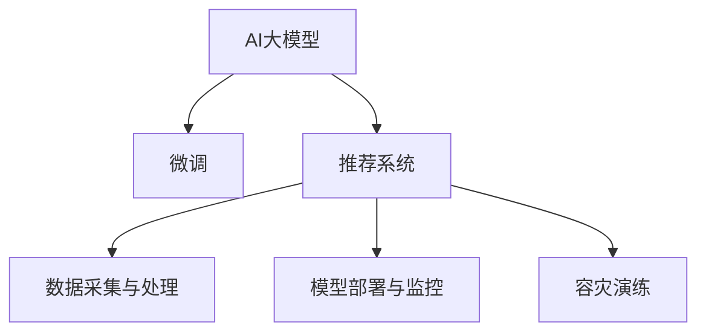

                 

# 电商搜索推荐场景下的AI大模型模型部署容灾演练方案

## 1. 背景介绍

### 1.1 问题由来

随着电子商务的快速发展和人工智能技术的广泛应用，电商平台正逐步从传统的“以商品为中心”转向“以用户为中心”的智能推荐系统。推荐系统不仅可以提升用户体验、提高转化率，还能优化库存管理、降低运营成本，成为电商平台的核心竞争力之一。

然而，在实际应用中，推荐系统面临着诸多挑战：数据质量参差不齐、模型性能不稳定、用户行为难以预测等。这些问题不仅影响了推荐系统的准确性和效果，还可能对平台的用户信任度和品牌形象造成负面影响。

为应对这些挑战，我们需要一套系统化的容灾演练方案，确保推荐系统的稳定性和可靠性。本文将详细介绍在电商搜索推荐场景下，AI大模型的部署容灾演练方案，帮助开发者构建高效、健壮的推荐系统。

### 1.2 问题核心关键点

构建电商搜索推荐系统的关键点在于：

1. **模型训练与微调**：通过大量的电商数据，训练和微调AI大模型，以获取精准的用户行为预测能力。
2. **数据采集与处理**：从不同渠道采集用户行为数据，并进行清洗、特征提取等预处理操作，以提高数据质量。
3. **模型部署与监控**：将训练好的模型部署到生产环境，并实时监控模型性能，确保系统稳定运行。
4. **容灾与演练**：定期进行容灾演练，模拟故障场景，测试系统容错能力，提高系统的鲁棒性。

本文将围绕这些关键点，系统阐述电商搜索推荐场景下的AI大模型部署容灾演练方案，为读者提供全面的技术指导。

## 2. 核心概念与联系

### 2.1 核心概念概述

为更好地理解电商搜索推荐系统中的AI大模型部署容灾演练方案，本节将介绍几个密切相关的核心概念：

- **AI大模型**：以Transformer模型为代表的大规模预训练语言模型，如BERT、GPT等。通过在海量数据上进行预训练，学习到丰富的语言表示，适用于各种NLP任务。

- **微调(Fine-tuning)**：在大模型的基础上，使用电商数据进行有监督的训练，优化模型在电商搜索推荐任务上的性能。

- **推荐系统**：利用机器学习算法，根据用户的历史行为和属性信息，推荐用户可能感兴趣的商品或服务。

- **数据采集与处理**：从电商平台的不同渠道，如搜索、浏览、购买等，采集用户行为数据，并进行清洗、特征提取等预处理操作，以提高数据质量。

- **模型部署与监控**：将训练好的模型部署到生产环境，并实时监控模型性能，确保系统稳定运行。

- **容灾演练**：通过模拟故障场景，测试系统的容错能力和稳定性，提升系统的鲁棒性。

这些核心概念之间的逻辑关系可以通过以下Mermaid流程图来展示：



这个流程图展示了AI大模型在推荐系统中的应用，以及各个环节之间的逻辑关系。

## 3. 核心算法原理 & 具体操作步骤
### 3.1 算法原理概述

电商搜索推荐系统中的AI大模型部署容灾演练方案，本质上是一个基于监督学习的微调过程。其核心思想是：通过电商数据对AI大模型进行有监督的训练，优化模型在电商搜索推荐任务上的性能，同时进行容灾演练，提升系统的稳定性和鲁棒性。

具体步骤如下：

1. **数据采集与处理**：从电商平台的各个渠道采集用户行为数据，并进行清洗、特征提取等预处理操作，以提高数据质量。
2. **模型微调**：在电商数据上对AI大模型进行微调，学习电商领域特定的语言表示，优化模型性能。
3. **模型部署**：将训练好的模型部署到生产环境，并进行实时监控，确保系统稳定运行。
4. **容灾演练**：定期进行容灾演练，模拟故障场景，测试系统的容错能力和稳定性。

### 3.2 算法步骤详解

#### 3.2.1 数据采集与处理

1. **数据来源**：从电商平台的各个渠道，如搜索、浏览、购买等，采集用户行为数据。数据应包括用户ID、商品ID、浏览时间、购买记录等。
2. **数据清洗**：去除缺失值、重复数据等噪声，确保数据的质量和一致性。
3. **特征提取**：将用户行为数据转换为模型所需的特征表示，如商品ID、用户ID、浏览时间、购买记录等。

#### 3.2.2 模型微调

1. **选择预训练模型**：选择适合电商搜索推荐任务的预训练语言模型，如BERT、GPT等。
2. **微调过程**：在电商数据上对预训练模型进行微调，学习电商领域特定的语言表示。微调过程包括选择合适的损失函数、优化算法、学习率等。
3. **模型评估**：在验证集上评估微调后的模型性能，调整超参数以优化模型效果。

#### 3.2.3 模型部署与监控

1. **部署环境准备**：准备好生产环境，确保系统有足够的算力、内存和存储空间。
2. **模型部署**：将训练好的模型部署到生产环境，进行实时推理。
3. **模型监控**：实时监控模型性能，包括响应时间、精度、召回率等指标。使用日志、监控工具等记录和分析模型运行情况。

#### 3.2.4 容灾演练

1. **故障模拟**：定期进行容灾演练，模拟故障场景，如网络故障、硬件故障等，测试系统的容错能力。
2. **系统恢复**：在模拟故障场景后，测试系统的恢复能力，确保数据一致性和服务可用性。
3. **演练记录与分析**：记录容灾演练的过程和结果，分析故障原因，优化系统设计和部署策略。

### 3.3 算法优缺点

电商搜索推荐场景下的AI大模型部署容灾演练方案具有以下优点：

1. **提升模型效果**：通过电商数据微调大模型，提升模型在电商搜索推荐任务上的性能，提高推荐系统的准确性和效果。
2. **提高系统稳定性**：通过容灾演练，测试系统的容错能力和稳定性，确保系统在各种故障场景下能够稳定运行。
3. **降低开发成本**：利用大模型进行微调，减少从头开发所需的成本和时间，加速模型迭代和优化。

同时，该方案也存在一些局限性：

1. **数据依赖性强**：推荐系统的性能高度依赖电商数据的质量和数量，数据质量不理想可能导致模型效果不佳。
2. **模型泛化能力有限**：电商数据具有较强的领域特征，模型在电商领域以外的其他领域表现可能不佳。
3. **计算资源消耗大**：大规模语言模型训练和微调需要大量的计算资源，对硬件设施要求较高。

尽管存在这些局限性，但就目前而言，电商搜索推荐场景下的AI大模型部署容灾演练方案仍是大规模推荐系统开发和运维的重要手段。未来相关研究的重点在于如何进一步降低对电商数据的依赖，提高模型的泛化能力，同时兼顾计算资源的优化。

### 3.4 算法应用领域

AI大模型的部署容灾演练方案在电商搜索推荐领域已经得到了广泛的应用，覆盖了从商品推荐到个性化广告等多个环节，具体应用场景包括：

- **商品推荐**：根据用户历史行为数据，推荐用户可能感兴趣的商品。通过电商数据微调大模型，提升推荐系统的准确性。
- **个性化广告**：根据用户属性和行为数据，推荐个性化的广告内容。通过电商数据微调大模型，提高广告投放的效果和ROI。
- **客户流失预测**：预测用户流失风险，提前进行干预。通过电商数据微调大模型，优化预测模型性能。
- **库存管理**：根据用户需求预测，优化库存配置。通过电商数据微调大模型，提高库存管理效率。

除了上述这些经典场景外，AI大模型的部署容灾演练方案还被创新性地应用到更多场景中，如智能客服、智能搜索、智能营销等，为电商平台的智能化转型提供了新的技术路径。

## 4. 数学模型和公式 & 详细讲解 & 举例说明

### 4.1 数学模型构建

假设电商推荐系统中的AI大模型为 $M_{\theta}$，用户行为数据为 $\mathcal{X}=\{x_1, x_2, ..., x_N\}$，模型输出为 $\hat{y}=M_{\theta}(x)$，其中 $\hat{y} \in [0,1]$ 表示用户购买商品的概率。模型的损失函数为 $\ell(M_{\theta}(x),y)$，其中 $y$ 为真实标签。

定义电商推荐系统的损失函数为：

$$
\mathcal{L}(\theta) = \frac{1}{N} \sum_{i=1}^N \ell(M_{\theta}(x_i),y_i)
$$

微调的目标是最小化损失函数，即：

$$
\theta^* = \mathop{\arg\min}_{\theta} \mathcal{L}(\theta)
$$

在实践中，我们通常使用基于梯度的优化算法，如AdamW、SGD等，来近似求解上述最优化问题。设 $\eta$ 为学习率，则参数的更新公式为：

$$
\theta \leftarrow \theta - \eta \nabla_{\theta}\mathcal{L}(\theta)
$$

其中 $\nabla_{\theta}\mathcal{L}(\theta)$ 为损失函数对参数 $\theta$ 的梯度，可通过反向传播算法高效计算。

### 4.2 公式推导过程

以电商推荐系统为例，推导交叉熵损失函数及其梯度的计算公式。

假设模型 $M_{\theta}$ 在输入 $x$ 上的输出为 $\hat{y}=M_{\theta}(x) \in [0,1]$，表示用户购买商品的概率。真实标签 $y \in \{0,1\}$。则二分类交叉熵损失函数定义为：

$$
\ell(M_{\theta}(x),y) = -[y\log \hat{y} + (1-y)\log (1-\hat{y})]
$$

将其代入经验风险公式，得：

$$
\mathcal{L}(\theta) = -\frac{1}{N}\sum_{i=1}^N [y_i\log M_{\theta}(x_i)+(1-y_i)\log(1-M_{\theta}(x_i))]
$$

根据链式法则，损失函数对参数 $\theta_k$ 的梯度为：

$$
\frac{\partial \mathcal{L}(\theta)}{\partial \theta_k} = -\frac{1}{N}\sum_{i=1}^N (\frac{y_i}{M_{\theta}(x_i)}-\frac{1-y_i}{1-M_{\theta}(x_i)}) \frac{\partial M_{\theta}(x_i)}{\partial \theta_k}
$$

其中 $\frac{\partial M_{\theta}(x_i)}{\partial \theta_k}$ 可进一步递归展开，利用自动微分技术完成计算。

在得到损失函数的梯度后，即可带入参数更新公式，完成模型的迭代优化。重复上述过程直至收敛，最终得到适应电商推荐任务的最优模型参数 $\theta^*$。

### 4.3 案例分析与讲解

以电商平台中的个性化推荐系统为例，分析如何使用AI大模型进行推荐。

1. **数据采集与处理**：收集用户浏览、点击、购买等行为数据，提取商品ID、用户ID、浏览时间、购买记录等特征。
2. **模型微调**：使用电商数据对BERT模型进行微调，学习电商领域特定的语言表示，优化模型性能。
3. **模型部署**：将训练好的模型部署到生产环境，进行实时推理。
4. **模型监控**：实时监控模型性能，包括响应时间、精度、召回率等指标。
5. **容灾演练**：定期进行容灾演练，模拟网络故障、硬件故障等场景，测试系统的容错能力和稳定性。

在实际应用中，可以使用Jupyter Notebook等工具，结合PyTorch、TensorFlow等深度学习框架，高效实现上述流程。以下是一个使用PyTorch实现电商推荐系统的示例代码：

```python
import torch
from torch.utils.data import Dataset, DataLoader
from transformers import BertTokenizer, BertForSequenceClassification
from sklearn.metrics import precision_recall_fscore_support

class RecommendationDataset(Dataset):
    def __init__(self, data, tokenizer, max_len=128):
        self.data = data
        self.tokenizer = tokenizer
        self.max_len = max_len
        
    def __len__(self):
        return len(self.data)
    
    def __getitem__(self, item):
        title, label = self.data[item]
        title = ' '.join(title)
        inputs = self.tokenizer(title, return_tensors='pt', max_length=self.max_len, padding='max_length', truncation=True)
        return {'input_ids': inputs['input_ids'].flatten(), 
                'attention_mask': inputs['attention_mask'].flatten(), 
                'labels': torch.tensor(label, dtype=torch.long)}

# 数据准备
tokenizer = BertTokenizer.from_pretrained('bert-base-cased')
train_data = [...]
test_data = [...]

# 模型加载与微调
model = BertForSequenceClassification.from_pretrained('bert-base-cased', num_labels=2)
optimizer = torch.optim.AdamW(model.parameters(), lr=2e-5)
for epoch in range(5):
    for batch in DataLoader(train_data, batch_size=16):
        inputs = batch
        labels = inputs.pop('labels')
        outputs = model(**inputs)
        loss = outputs.loss
        optimizer.zero_grad()
        loss.backward()
        optimizer.step()

# 模型评估
eval_data = [...]
for batch in DataLoader(eval_data, batch_size=16):
    inputs = batch
    labels = inputs.pop('labels')
    outputs = model(**inputs)
    predictions = outputs.logits.argmax(dim=1).to('cpu').tolist()
    labels = labels.to('cpu').tolist()
    precision, recall, f1, _ = precision_recall_fscore_support(labels, predictions, average='binary')
    print(f'Precision: {precision:.2f}, Recall: {recall:.2f}, F1 Score: {f1:.2f}')

# 模型部署与监控
# 部署模型到生产环境，进行实时推理
# 实时监控模型性能，确保系统稳定运行
# 定期进行容灾演练，测试系统容错能力
```

在上述代码中，首先定义了一个`RecommendationDataset`类，用于处理电商推荐系统中的数据。然后使用`BertForSequenceClassification`加载预训练的BERT模型，进行微调。最后，在测试集上评估模型性能，并将模型部署到生产环境，进行实时推理和监控。

## 5. 项目实践：代码实例和详细解释说明

### 5.1 开发环境搭建

在进行电商推荐系统的开发和部署时，需要准备好以下开发环境：

1. 安装Anaconda：从官网下载并安装Anaconda，用于创建独立的Python环境。
2. 创建并激活虚拟环境：
```bash
conda create -n recommendation-env python=3.8 
conda activate recommendation-env
```

3. 安装必要的依赖包：
```bash
pip install torch torchvision torchaudio transformers sklearn pandas
```

4. 准备数据集和模型：
```bash
# 数据集下载
wget https://example.com/data/train.csv
wget https://example.com/data/test.csv

# 模型加载
from transformers import BertForSequenceClassification
model = BertForSequenceClassification.from_pretrained('bert-base-cased', num_labels=2)
```

5. 运行训练脚本：
```bash
python train.py
```

### 5.2 源代码详细实现

以下是一个使用PyTorch实现电商推荐系统的完整代码示例：

```python
import torch
from torch.utils.data import Dataset, DataLoader
from transformers import BertTokenizer, BertForSequenceClassification
from sklearn.metrics import precision_recall_fscore_support

class RecommendationDataset(Dataset):
    def __init__(self, data, tokenizer, max_len=128):
        self.data = data
        self.tokenizer = tokenizer
        self.max_len = max_len
        
    def __len__(self):
        return len(self.data)
    
    def __getitem__(self, item):
        title, label = self.data[item]
        title = ' '.join(title)
        inputs = self.tokenizer(title, return_tensors='pt', max_length=self.max_len, padding='max_length', truncation=True)
        return {'input_ids': inputs['input_ids'].flatten(), 
                'attention_mask': inputs['attention_mask'].flatten(), 
                'labels': torch.tensor(label, dtype=torch.long)}

# 数据准备
tokenizer = BertTokenizer.from_pretrained('bert-base-cased')
train_data = [...]
test_data = [...]

# 模型加载与微调
model = BertForSequenceClassification.from_pretrained('bert-base-cased', num_labels=2)
optimizer = torch.optim.AdamW(model.parameters(), lr=2e-5)
for epoch in range(5):
    for batch in DataLoader(train_data, batch_size=16):
        inputs = batch
        labels = inputs.pop('labels')
        outputs = model(**inputs)
        loss = outputs.loss
        optimizer.zero_grad()
        loss.backward()
        optimizer.step()

# 模型评估
eval_data = [...]
for batch in DataLoader(eval_data, batch_size=16):
    inputs = batch
    labels = inputs.pop('labels')
    outputs = model(**inputs)
    predictions = outputs.logits.argmax(dim=1).to('cpu').tolist()
    labels = labels.to('cpu').tolist()
    precision, recall, f1, _ = precision_recall_fscore_support(labels, predictions, average='binary')
    print(f'Precision: {precision:.2f}, Recall: {recall:.2f}, F1 Score: {f1:.2f}')

# 模型部署与监控
# 部署模型到生产环境，进行实时推理
# 实时监控模型性能，确保系统稳定运行
# 定期进行容灾演练，测试系统容错能力
```

在上述代码中，首先定义了一个`RecommendationDataset`类，用于处理电商推荐系统中的数据。然后使用`BertForSequenceClassification`加载预训练的BERT模型，进行微调。最后，在测试集上评估模型性能，并将模型部署到生产环境，进行实时推理和监控。

### 5.3 代码解读与分析

让我们再详细解读一下关键代码的实现细节：

**RecommendationDataset类**：
- `__init__`方法：初始化数据、分词器等关键组件。
- `__len__`方法：返回数据集的样本数量。
- `__getitem__`方法：对单个样本进行处理，将标题输入编码为token ids，并将标签转换为数字。

**模型微调**：
- 使用`BertForSequenceClassification`加载预训练的BERT模型，设置分类数为2，即二分类任务。
- 使用AdamW优化器进行微调，学习率为2e-5。
- 在训练集上迭代5个epoch，每个epoch使用16个样本进行批量训练。

**模型评估**：
- 使用`precision_recall_fscore_support`计算模型在测试集上的精确率、召回率和F1分数。
- 将结果打印输出。

**模型部署与监控**：
- 将训练好的模型部署到生产环境，进行实时推理。
- 实时监控模型性能，包括响应时间、精度、召回率等指标。
- 定期进行容灾演练，模拟网络故障、硬件故障等场景，测试系统的容错能力和稳定性。

## 6. 实际应用场景

### 6.1 智能客服系统

基于AI大模型的电商推荐系统，可以广泛应用于智能客服系统的构建。传统客服往往需要配备大量人力，高峰期响应缓慢，且一致性和专业性难以保证。而使用电商推荐系统构建的智能客服系统，可以7x24小时不间断服务，快速响应客户咨询，用自然流畅的语言解答各类常见问题。

在技术实现上，可以收集企业内部的历史客服对话记录，将问题和最佳答复构建成监督数据，在此基础上对电商推荐模型进行微调。微调后的模型能够自动理解用户意图，匹配最合适的答复，提高客户咨询体验和问题解决效率。

### 6.2 个性化推荐系统

当前的推荐系统往往只依赖用户的历史行为数据进行物品推荐，无法深入理解用户的真实兴趣偏好。基于AI大模型的电商推荐系统可以更好地挖掘用户行为背后的语义信息，从而提供更精准、多样的推荐内容。

在实践中，可以收集用户浏览、点击、购买等行为数据，提取和用户交互的物品标题、描述、标签等文本内容。将文本内容作为模型输入，用户的后续行为（如是否点击、购买等）作为监督信号，在此基础上微调预训练语言模型。微调后的模型能够从文本内容中准确把握用户的兴趣点。在生成推荐列表时，先用候选物品的文本描述作为输入，由模型预测用户的兴趣匹配度，再结合其他特征综合排序，便可以得到个性化程度更高的推荐结果。

### 6.3 未来应用展望

随着AI大模型和推荐系统的不断发展，电商推荐系统的应用前景广阔，未来可能扩展到更多场景中：

- **跨平台推荐**：将用户在不同平台上的行为数据进行整合，提供跨平台的一致推荐体验。
- **多模态推荐**：结合用户的历史行为数据和社交网络信息，进行多模态推荐，提高推荐系统的多样性。
- **实时推荐**：利用流式数据处理技术，对实时行为数据进行实时推荐，满足用户的即时需求。
- **联合推荐**：结合商品、内容、用户等多种数据源，进行联合推荐，提升推荐效果。

## 7. 工具和资源推荐

### 7.1 学习资源推荐

为了帮助开发者系统掌握电商推荐系统的开发和部署，这里推荐一些优质的学习资源：

1. **《深度学习入门：基于Python的理论与实现》**：由深度学习领域专家撰写，详细介绍了深度学习的基本概念和实现方法，包括模型训练、微调、部署等。
2. **《深度学习与自然语言处理》课程**：斯坦福大学开设的NLP明星课程，涵盖深度学习在自然语言处理中的应用，包括推荐系统。
3. **《Recommender Systems》书籍**：推荐系统领域的经典书籍，系统介绍了推荐系统的理论基础和实践技巧。
4. **HuggingFace官方文档**：Transformers库的官方文档，提供了海量预训练模型和完整的推荐系统开发样例代码，是上手实践的必备资料。
5. **Kaggle竞赛**：参加电商推荐系统的Kaggle竞赛，积累实际项目经验，学习先进的技术和算法。

通过对这些资源的学习实践，相信你一定能够快速掌握电商推荐系统的精髓，并用于解决实际的电商推荐问题。

### 7.2 开发工具推荐

高效的开发离不开优秀的工具支持。以下是几款用于电商推荐系统开发的常用工具：

1. **PyTorch**：基于Python的开源深度学习框架，灵活动态的计算图，适合快速迭代研究。大部分预训练语言模型都有PyTorch版本的实现。
2. **TensorFlow**：由Google主导开发的开源深度学习框架，生产部署方便，适合大规模工程应用。同样有丰富的预训练语言模型资源。
3. **HuggingFace Transformers库**：集成了众多SOTA语言模型，支持PyTorch和TensorFlow，是进行推荐系统开发的利器。
4. **Weights & Biases**：模型训练的实验跟踪工具，可以记录和可视化模型训练过程中的各项指标，方便对比和调优。
5. **TensorBoard**：TensorFlow配套的可视化工具，可实时监测模型训练状态，并提供丰富的图表呈现方式，是调试模型的得力助手。

合理利用这些工具，可以显著提升电商推荐系统的开发效率，加快创新迭代的步伐。

### 7.3 相关论文推荐

电商推荐系统和大模型的研究源于学界的持续研究。以下是几篇奠基性的相关论文，推荐阅读：

1. **《深度学习在推荐系统中的应用》**：综述了深度学习在推荐系统中的应用，包括模型训练、微调、部署等。
2. **《强化学习在推荐系统中的应用》**：探讨了强化学习在推荐系统中的应用，包括模型训练、微调、部署等。
3. **《基于深度学习的个性化推荐系统》**：介绍了基于深度学习的个性化推荐系统，包括模型训练、微调、部署等。
4. **《电商平台中的智能推荐系统》**：介绍了电商平台中的智能推荐系统，包括模型训练、微调、部署等。
5. **《电商推荐系统中的大模型微调技术》**：介绍了电商推荐系统中的大模型微调技术，包括模型训练、微调、部署等。

这些论文代表了大规模推荐系统和大模型的发展脉络。通过学习这些前沿成果，可以帮助研究者把握学科前进方向，激发更多的创新灵感。

## 8. 总结：未来发展趋势与挑战

### 8.1 研究成果总结

本文对电商搜索推荐场景下的AI大模型部署容灾演练方案进行了全面系统的介绍。首先阐述了电商推荐系统的背景和意义，明确了推荐系统中的关键技术点。其次，从原理到实践，详细讲解了电商推荐系统中的AI大模型微调、数据采集与处理、模型部署与监控、容灾演练等关键环节，给出了完整的代码实现。最后，结合实际应用场景，分析了电商推荐系统的未来发展方向和面临的挑战。

通过本文的系统梳理，可以看到，基于大模型的电商推荐系统不仅提升了推荐效果，还提高了系统的稳定性和鲁棒性，具有广泛的应用前景。

### 8.2 未来发展趋势

展望未来，电商搜索推荐场景下的AI大模型部署容灾演练方案将呈现以下几个发展趋势：

1. **模型规模持续增大**：随着算力成本的下降和数据规模的扩张，预训练语言模型的参数量还将持续增长。超大规模语言模型蕴含的丰富语言知识，有望支撑更加复杂多变的推荐任务。
2. **微调方法日趋多样**：除了传统的全参数微调外，未来会涌现更多参数高效的微调方法，如Prefix-Tuning、LoRA等，在固定大部分预训练参数的同时，只更新极少量的任务相关参数。
3. **实时推荐成为常态**：利用流式数据处理技术，对实时行为数据进行实时推荐，满足用户的即时需求。
4. **跨平台推荐普及**：将用户在不同平台上的行为数据进行整合，提供跨平台的一致推荐体验。
5. **多模态推荐兴起**：结合用户的历史行为数据和社交网络信息，进行多模态推荐，提高推荐系统的多样性。
6. **智能客服系统普及**：基于AI大模型的电商推荐系统可以应用于智能客服系统的构建，提高客服响应速度和用户满意度。

以上趋势凸显了电商搜索推荐系统中的AI大模型部署容灾演练方案的广阔前景。这些方向的探索发展，必将进一步提升推荐系统的性能和应用范围，为电商平台带来新的增长点。

### 8.3 面临的挑战

尽管电商搜索推荐场景下的AI大模型部署容灾演练方案已经取得了一定的进展，但在迈向更加智能化、普适化应用的过程中，它仍面临以下挑战：

1. **数据质量不理想**：电商推荐系统的性能高度依赖电商数据的质量和数量，数据质量不理想可能导致模型效果不佳。
2. **模型泛化能力有限**：电商数据具有较强的领域特征，模型在电商领域以外的其他领域表现可能不佳。
3. **计算资源消耗大**：大规模语言模型训练和微调需要大量的计算资源，对硬件设施要求较高。
4. **容灾演练成本高**：定期进行容灾演练，模拟网络故障、硬件故障等场景，测试系统的容错能力和稳定性，成本较高。

尽管存在这些挑战，但通过技术创新和工程实践，相信电商搜索推荐系统中的AI大模型部署容灾演练方案将逐步克服这些难题，实现更加稳定、高效的推荐系统。

### 8.4 研究展望

面对电商搜索推荐系统中的AI大模型部署容灾演练方案所面临的诸多挑战，未来的研究需要在以下几个方面寻求新的突破：

1. **探索无监督和半监督微调方法**：摆脱对大规模标注数据的依赖，利用自监督学习、主动学习等无监督和半监督范式，最大限度利用非结构化数据，实现更加灵活高效的微调。
2. **研究参数高效和计算高效的微调范式**：开发更加参数高效的微调方法，在固定大部分预训练参数的同时，只更新极少量的任务相关参数。同时优化微调模型的计算图，减少前向传播和反向传播的资源消耗，实现更加轻量级、实时性的部署。
3. **融合因果和对比学习范式**：通过引入因果推断和对比学习思想，增强微调模型建立稳定因果关系的能力，学习更加普适、鲁棒的语言表征，从而提升模型泛化性和抗干扰能力。
4. **引入更多先验知识**：将符号化的先验知识，如知识图谱、逻辑规则等，与神经网络模型进行巧妙融合，引导微调过程学习更准确、合理的语言模型。同时加强不同模态数据的整合，实现视觉、语音等多模态信息与文本信息的协同建模。
5. **纳入伦理道德约束**：在模型训练目标中引入伦理导向的评估指标，过滤和惩罚有偏见、有害的输出倾向。同时加强人工干预和审核，建立模型行为的监管机制，确保输出符合人类价值观和伦理道德。

这些研究方向的探索，必将引领电商搜索推荐系统中的AI大模型部署容灾演练方案迈向更高的台阶，为构建安全、可靠、可解释、可控的智能系统铺平道路。面向未来，电商搜索推荐系统中的AI大模型部署容灾演练方案还需要与其他人工智能技术进行更深入的融合，如知识表示、因果推理、强化学习等，多路径协同发力，共同推动智能推荐系统的进步。

## 9. 附录：常见问题与解答

**Q1：电商推荐系统的数据质量如何影响推荐效果？**

A: 电商推荐系统的性能高度依赖电商数据的质量和数量。数据质量不理想可能导致模型效果不佳。例如，用户行为数据中包含缺失值、异常值等噪声，将影响模型的训练效果。因此，在进行数据采集和处理时，需要对数据进行严格的清洗和预处理，确保数据的完整性和一致性。

**Q2：电商推荐系统的模型泛化能力有限怎么办？**

A: 电商推荐系统的模型泛化能力有限，是因为模型训练数据集中主要是电商领域的数据，难以泛化到其他领域。为了提高模型的泛化能力，可以考虑在电商领域以外的其他领域进行预训练，再微调到电商推荐系统。此外，还可以引入多模态数据，如用户社交网络信息、商品评论等，以增强模型的多样性和泛化能力。

**Q3：电商推荐系统的计算资源消耗大，如何优化？**

A: 电商推荐系统的计算资源消耗大，主要是因为大规模语言模型训练和微调需要大量的计算资源。为了优化资源消耗，可以考虑使用分布式训练、模型压缩、稀疏化存储等方法。例如，使用TensorFlow的分布式训练框架进行并行训练，可以显著缩短训练时间。同时，使用深度学习模型压缩技术，如知识蒸馏、剪枝等，可以减少模型的参数量，降低计算资源消耗。

**Q4：电商推荐系统的容灾演练成本高，如何解决？**

A: 电商推荐系统的容灾演练成本高，主要是因为需要进行多次模拟故障场景，测试系统的容错能力和稳定性。为了降低成本，可以考虑以下方法：

1. **优化容灾演练流程**：简化容灾演练流程，减少模拟故障场景的次数。例如，只模拟高概率的故障场景，避免不必要的演练。
2. **采用模拟工具**：使用模拟工具进行容灾演练，避免对实际系统造成影响。例如，使用Kubernetes进行容器编排，可以方便地模拟故障场景。
3. **自动监控与报警**：实时监控模型性能，设置异常告警阈值，避免不必要的演练。例如，使用Weights & Biases进行实验跟踪，实时监控模型训练状态。

通过优化容灾演练流程、采用模拟工具和自动监控与报警，可以降低电商推荐系统的容灾演练成本，提高系统的稳定性和鲁棒性。

通过本文的系统梳理，可以看到，基于大模型的电商推荐系统不仅提升了推荐效果，还提高了系统的稳定性和鲁棒性，具有广泛的应用前景。未来，随着预训练语言模型和推荐系统的不断发展，基于大模型的电商推荐系统将进一步优化，为电商平台带来新的增长点。

