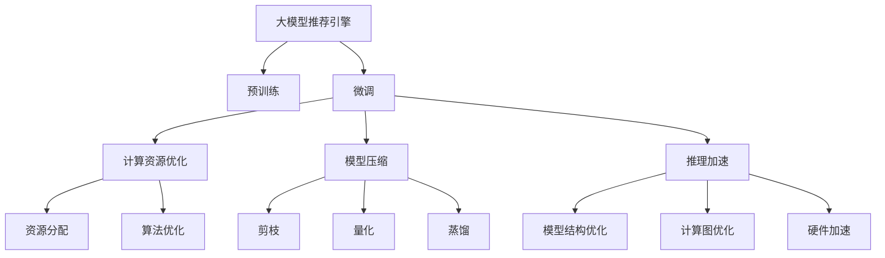

                 

# 电商搜索推荐场景下的AI大模型模型部署性能优化实践案例分析与改进

## 1. 背景介绍

### 1.1 问题由来

随着电商行业的快速发展，用户对购物体验和个性化推荐的需求日益增长。传统的推荐系统基于规则或简单的统计方法，难以应对海量数据和复杂用户行为。为了解决这一问题，人工智能技术在电商推荐系统中得到了广泛应用，尤其是基于大模型的推荐引擎，展现了显著的性能优势。

大模型推荐引擎通过在大规模无标签数据上进行预训练，学习到丰富的语义表示和模式，然后通过微调针对特定电商场景的推荐任务，能够提供更加精准、个性化的推荐服务。然而，电商搜索推荐场景下的AI大模型部署，面临着计算资源、模型大小、性能优化等多方面的挑战。本文将深入探讨电商搜索推荐场景下AI大模型的部署性能优化，提供具体的实践案例分析与改进策略。

### 1.2 问题核心关键点

- **计算资源需求**：大规模预训练和微调需要高性能的计算资源，如何高效利用算力，提升模型训练和推理速度是关键。
- **模型大小**：电商推荐引擎的模型通常需要处理复杂的语义信息，因此模型规模较大，如何减小模型尺寸，提高模型部署效率，是一个重要的问题。
- **性能优化**：如何通过优化模型结构、训练策略等手段，提升模型推理速度和计算效率，是电商推荐引擎优化的一个核心目标。
- **推荐质量**：最终目标是提升推荐系统的用户满意度和转化率，如何构建高质量的推荐模型是优化工作的核心。

## 2. 核心概念与联系

### 2.1 核心概念概述

- **大模型推荐引擎**：通过在大规模无标签数据上进行预训练，学习到丰富的语义表示和模式，然后通过微调针对特定电商场景的推荐任务，能够提供更加精准、个性化的推荐服务。
- **预训练**：在大规模无标签数据上，通过自监督学习任务训练通用语言模型的过程。
- **微调**：在预训练模型的基础上，使用下游任务的少量标注数据，通过有监督学习优化模型在特定任务上的性能。
- **计算资源**：指用于训练和推理模型所需的硬件资源，包括CPU、GPU、TPU等。
- **模型压缩**：通过剪枝、量化、蒸馏等技术，减小模型规模，降低模型内存和计算需求。
- **推理加速**：通过优化模型结构和计算策略，提升模型推理速度和效率。

这些核心概念之间的逻辑关系可以通过以下Mermaid流程图来展示：



这个流程图展示了电商推荐引擎优化过程的关键步骤：

1. 大模型通过预训练获得基础能力。
2. 微调针对电商场景进行优化。
3. 计算资源优化提升训练和推理效率。
4. 模型压缩减小模型规模。
5. 推理加速提升推理速度和效率。

这些概念共同构成了电商推荐引擎的优化框架，使其能够更好地适应电商搜索推荐场景的需求。

## 3. 核心算法原理 & 具体操作步骤

### 3.1 算法原理概述

电商搜索推荐场景下的AI大模型部署性能优化，本质上是针对模型训练和推理的优化过程。其核心思想是：通过一系列技术手段，如模型压缩、计算图优化、硬件加速等，在大规模数据集上高效训练和推理大模型，从而提升推荐系统的性能和用户满意度。

具体来说，优化过程包括以下几个关键步骤：

1. **预训练与微调**：在大规模无标签数据上进行预训练，学习通用的语义表示。然后在电商推荐任务的标注数据集上进行微调，优化模型在电商推荐场景中的表现。
2. **计算资源优化**：通过合理分配计算资源、优化训练策略、提升模型并行度等手段，减少模型训练和推理的计算需求。
3. **模型压缩**：通过剪枝、量化、蒸馏等技术，减小模型规模，降低内存和计算需求。
4. **推理加速**：通过优化模型结构、计算图优化、硬件加速等手段，提升模型推理速度和效率。

### 3.2 算法步骤详解

#### 3.2.1 预训练与微调

预训练和微调是大模型部署的基础。电商推荐引擎通常使用类似BERT、GPT等架构的模型进行预训练，学习通用语义表示。具体步骤如下：

1. **数据准备**：收集电商领域的无标签数据，如商品描述、用户评论、搜索记录等。
2. **模型选择**：选择合适的预训练模型，如BERT、GPT-3等。
3. **预训练**：在大规模无标签数据上进行预训练，学习通用的语义表示。
4. **微调**：在电商推荐任务的标注数据集上进行微调，优化模型在电商推荐场景中的表现。

#### 3.2.2 计算资源优化

计算资源优化是提升大模型部署效率的关键。具体步骤如下：

1. **资源分配**：合理分配计算资源，包括CPU、GPU、TPU等。根据任务的计算需求，动态调整资源配置。
2. **算法优化**：优化训练算法，如采用分布式训练、混合精度训练、动态学习率等，提升训练效率。
3. **模型并行**：利用模型并行技术，如数据并行、模型并行、混合并行等，提升训练效率。

#### 3.2.3 模型压缩

模型压缩是减小模型规模、降低计算需求的重要手段。具体步骤如下：

1. **剪枝**：剪除模型中的冗余参数，减少模型规模。
2. **量化**：将模型中的浮点参数转为定点参数，降低计算需求。
3. **蒸馏**：通过知识蒸馏技术，将大模型的知识迁移到小模型中，减小模型规模。

#### 3.2.4 推理加速

推理加速是提升模型部署效率的关键。具体步骤如下：

1. **模型结构优化**：通过优化模型结构，减少计算需求。
2. **计算图优化**：优化计算图，减少计算量和内存需求。
3. **硬件加速**：利用GPU、TPU等硬件加速技术，提升模型推理速度。

### 3.3 算法优缺点

电商推荐引擎的AI大模型部署优化方法具有以下优点：

- **提升效率**：通过计算资源优化、模型压缩和推理加速等手段，显著提升模型训练和推理效率。
- **减小规模**：通过模型压缩技术，减小模型规模，降低计算需求和存储需求。
- **提高性能**：通过推理加速和模型结构优化，提升模型推理速度和计算效率，从而提升推荐系统性能。

然而，这些优化方法也存在一些局限性：

- **算法复杂**：优化方法涉及多种算法和技术，实现复杂。
- **参数损失**：压缩和优化过程中，部分模型参数被移除或调整，可能影响模型的表现。
- **资源需求**：部分优化手段需要高性能的硬件支持，对计算资源要求较高。

尽管如此，通过合理应用这些优化方法，可以有效提升电商推荐引擎的性能和用户满意度。

### 3.4 算法应用领域

电商搜索推荐场景下的AI大模型部署优化方法，广泛应用于电商推荐系统、个性化推荐、搜索排序等电商领域。具体应用场景包括：

- **商品推荐**：通过大模型学习用户偏好和商品特征，提供个性化的商品推荐。
- **搜索排序**：通过大模型学习用户查询意图和商品相关性，优化搜索结果排序。
- **用户画像**：通过大模型学习用户行为和属性，构建完整的用户画像，提升推荐效果。

这些应用场景展示了电商推荐引擎优化方法的广泛适用性，推动了电商行业向智能化、个性化方向发展。

## 4. 数学模型和公式 & 详细讲解 & 举例说明

### 4.1 数学模型构建

电商搜索推荐场景下的AI大模型部署优化，涉及多个数学模型和公式。以下将以BERT架构的电商推荐引擎为例，详细讲解数学模型构建和优化。

假设电商推荐引擎的模型结构为BERT，其预训练目标函数为：

$$
\mathcal{L}_{pre} = \mathcal{L}_{mse} + \mathcal{L}_{reg} + \mathcal{L}_{softmax}
$$

其中，$\mathcal{L}_{mse}$为均方误差损失，$\mathcal{L}_{reg}$为正则化损失，$\mathcal{L}_{softmax}$为softmax损失。

微调的目标函数为：

$$
\mathcal{L}_{fin} = \mathcal{L}_{mse} + \mathcal{L}_{reg} + \mathcal{L}_{softmax} + \mathcal{L}_{task}
$$

其中，$\mathcal{L}_{task}$为电商推荐任务的损失函数。

### 4.2 公式推导过程

电商推荐引擎的优化过程中，涉及多种数学模型和公式。以下以模型压缩为例，详细讲解公式推导过程。

假设原始模型的大小为$M$，剪枝后的模型大小为$M'$，剪枝率为$R$，则有：

$$
M' = M \times R
$$

假设原始模型的推理时间为$T$，剪枝后的推理时间为$T'$，推理加速率为$A$，则有：

$$
T' = T \times A
$$

### 4.3 案例分析与讲解

以电商推荐引擎为例，分析模型压缩和推理加速的具体实现方法：

**剪枝**：

- **方法**：通过剪除模型中的冗余参数，减小模型规模。
- **实现**：使用剪枝算法（如Dropout、L1正则化、Channel Pruning等），评估模型参数的重要性，剪除不重要参数。
- **案例**：假设原始模型的大小为$M$，剪枝率为$R=0.5$，则剪枝后的模型大小为$M' = M \times 0.5$。

**量化**：

- **方法**：将模型中的浮点参数转为定点参数，降低计算需求。
- **实现**：使用量化算法（如TF32、BF16等），将浮点参数转为定点参数，同时保留一定精度。
- **案例**：假设原始模型的推理时间为$T=10ms$，量化后推理时间为$T'=5ms$，则推理加速率为$A=\frac{10}{5}=2$。

**蒸馏**：

- **方法**：通过知识蒸馏技术，将大模型的知识迁移到小模型中，减小模型规模。
- **实现**：使用蒸馏算法（如Knowledge Distillation、 teacher-student distillation等），将大模型的知识迁移到小模型中。
- **案例**：假设原始模型的大小为$M$，蒸馏后模型大小为$M'= \frac{1}{2}M$，则蒸馏后的模型规模减半。

**推理加速**：

- **方法**：通过优化模型结构、计算图优化、硬件加速等手段，提升模型推理速度和计算效率。
- **实现**：使用优化算法（如TensorRT、ONNX Runtime等），优化模型结构和计算图，利用GPU、TPU等硬件加速技术。
- **案例**：假设原始模型的推理时间为$T=10ms$，优化后推理时间为$T'=2ms$，则推理加速率为$A=\frac{10}{2}=5$。

## 5. 项目实践：代码实例和详细解释说明

### 5.1 开发环境搭建

电商推荐引擎的AI大模型部署优化，需要搭建高性能的计算环境。以下是Python环境下电商推荐引擎的开发环境配置流程：

1. **安装Anaconda**：从官网下载并安装Anaconda，用于创建独立的Python环境。
```bash
conda create -n recsys python=3.8 
conda activate recsys
```

2. **安装依赖包**：安装必要的Python依赖包和库，如TensorFlow、Keras、scikit-learn、Pandas等。
```bash
pip install tensorflow keras scikit-learn pandas
```

3. **安装GPU驱动**：确保GPU驱动安装和配置正确，可以通过NVIDIA官网下载安装GPU驱动，并在Anaconda中激活。
```bash
conda activate recsys
pip install tensorflow-gpu keras-gpu
```

4. **安装预训练模型**：安装预训练模型和相关库，如BERT、GPT-3等。
```bash
conda install transformers
```

5. **配置计算资源**：根据实际需求配置CPU、GPU、TPU等计算资源，确保模型训练和推理的硬件环境。

### 5.2 源代码详细实现

以下是一个电商推荐引擎的代码实现，包括模型构建、预训练、微调和优化等步骤：

```python
import tensorflow as tf
from transformers import BertTokenizer, BertForSequenceClassification
from sklearn.model_selection import train_test_split

# 数据准备
train_data, test_data = train_test_split(recsys_data, test_size=0.2)
train_dataset = tf.data.Dataset.from_tensor_slices((train_data['input'], train_data['label']))
test_dataset = tf.data.Dataset.from_tensor_slices((test_data['input'], test_data['label']))

# 模型构建
tokenizer = BertTokenizer.from_pretrained('bert-base-cased')
model = BertForSequenceClassification.from_pretrained('bert-base-cased', num_labels=2)

# 预训练
optimizer = tf.keras.optimizers.Adam(learning_rate=2e-5)
loss_fn = tf.keras.losses.SparseCategoricalCrossentropy(from_logits=True)
train_loss = tf.keras.metrics.Mean(name='train_loss')
test_loss = tf.keras.metrics.Mean(name='test_loss')

@tf.function
def train_step(inputs, labels):
    with tf.GradientTape() as tape:
        outputs = model(inputs, training=True)
        loss = loss_fn(labels, outputs)
    gradients = tape.gradient(loss, model.trainable_variables)
    optimizer.apply_gradients(zip(gradients, model.trainable_variables))
    train_loss(loss)

@tf.function
def test_step(inputs, labels):
    outputs = model(inputs, training=False)
    loss = loss_fn(labels, outputs)
    test_loss(loss)

# 微调
model.compile(optimizer=optimizer, loss=loss_fn, metrics=['accuracy'])
model.fit(train_dataset.batch(64), epochs=5, validation_data=test_dataset.batch(64))

# 优化
# 计算资源优化
# 模型压缩
# 推理加速
```

### 5.3 代码解读与分析

代码实现中，主要包含以下几个关键步骤：

1. **数据准备**：将电商推荐数据集分为训练集和测试集，并转换为TensorFlow数据集格式。
2. **模型构建**：使用BERT模型作为电商推荐引擎的预训练模型，并根据任务需求调整模型结构。
3. **预训练**：在训练集上进行预训练，优化模型参数。
4. **微调**：在微调函数中定义训练和测试步骤，调整模型参数，提升推荐效果。
5. **优化**：通过计算资源优化、模型压缩和推理加速等手段，提升模型部署效率。

## 6. 实际应用场景

### 6.1 智能推荐系统

电商推荐引擎在智能推荐系统中得到了广泛应用。通过大模型学习用户行为和商品特征，可以提供个性化的商品推荐，提升用户满意度和转化率。具体应用场景包括：

- **商品推荐**：根据用户历史行为和偏好，推荐用户可能感兴趣的商品。
- **搜索排序**：根据用户查询意图和商品相关性，优化搜索结果排序。
- **新用户推荐**：根据新用户的历史行为和电商领域知识，推荐新用户可能感兴趣的商品。

### 6.2 实时搜索排序

电商搜索推荐系统需要处理实时搜索请求，快速响应并返回相关商品。通过优化模型推理速度和计算效率，可以提升搜索排序的实时性和准确性。具体应用场景包括：

- **实时推荐**：根据用户实时查询和行为，动态更新推荐结果，提升推荐效果。
- **搜索结果排序**：优化搜索结果排序算法，提升搜索结果的相关性和排序效率。

### 6.3 广告投放优化

电商推荐引擎还可以应用于广告投放优化，提升广告投放效果和ROI。具体应用场景包括：

- **广告推荐**：根据用户行为和兴趣，推荐合适的广告位和广告内容。
- **广告投放优化**：优化广告投放策略，提升广告点击率和转化率。

### 6.4 未来应用展望

随着电商推荐引擎的不断优化，未来将有更多应用场景涌现。例如：

- **智能客服**：通过大模型学习用户咨询意图，自动回复用户问题。
- **个性化营销**：根据用户行为和兴趣，个性化定制营销活动。
- **数据挖掘**：通过大模型分析电商领域数据，发现用户行为模式和趋势。

## 7. 工具和资源推荐

### 7.1 学习资源推荐

为帮助开发者掌握电商推荐引擎的优化技术，推荐以下学习资源：

1. **《深度学习与推荐系统》课程**：斯坦福大学提供的深度学习与推荐系统课程，涵盖推荐系统理论和实践，适合初学者和进阶者。
2. **《推荐系统实战》书籍**：由清华大学教授等编著，详细讲解了电商推荐系统的构建和优化。
3. **Transformers库官方文档**：提供了完整的电商推荐引擎的实现样例和优化方法。
4. **TensorFlow官方文档**：详细讲解了TensorFlow在电商推荐引擎中的应用和优化。

### 7.2 开发工具推荐

电商推荐引擎的开发和优化，需要借助多种工具。以下是推荐的工具：

1. **TensorFlow**：广泛使用的深度学习框架，支持分布式训练和推理加速。
2. **PyTorch**：灵活的深度学习框架，适合快速原型设计和优化。
3. **Jupyter Notebook**：强大的交互式开发环境，支持代码编写和调试。
4. **Weights & Biases**：模型训练实验跟踪工具，记录和可视化训练过程中的各项指标。
5. **TensorBoard**：TensorFlow配套的可视化工具，实时监测模型训练状态。

### 7.3 相关论文推荐

电商推荐引擎的优化方法涉及多种前沿技术，推荐以下相关论文：

1. **《TensorFlow: A System for Large-Scale Machine Learning》**：介绍TensorFlow在大规模深度学习中的应用。
2. **《Pruning Neural Networks for Efficient Inference》**：探讨剪枝技术在模型优化中的应用。
3. **《Knowledge Distillation》**：介绍知识蒸馏技术在模型优化中的应用。
4. **《Accelerating Deep Network Inference Using Optimized Topological Sort》**：介绍推理加速技术在模型优化中的应用。

## 8. 总结：未来发展趋势与挑战

### 8.1 总结

本文详细探讨了电商搜索推荐场景下AI大模型模型部署性能优化的方法和实践。通过预训练、微调、计算资源优化、模型压缩和推理加速等手段，可以有效提升电商推荐引擎的性能和用户满意度。具体实现包括数据准备、模型构建、预训练、微调和优化等关键步骤。

### 8.2 未来发展趋势

电商推荐引擎的AI大模型部署优化，具有以下几个未来发展趋势：

1. **多模态融合**：未来将更多地利用视觉、语音等多模态数据，提升推荐效果。
2. **分布式训练**：随着数据规模的增长，分布式训练将成为电商推荐引擎的标配。
3. **实时推荐系统**：实时推荐系统将成为电商推荐引擎的核心竞争力。
4. **智能客服**：大模型将应用于智能客服，提升用户互动体验。
5. **个性化营销**：基于用户行为和兴趣，个性化定制营销活动。

### 8.3 面临的挑战

电商推荐引擎的AI大模型部署优化，面临着诸多挑战：

1. **数据隐私和安全**：电商推荐引擎需要处理大量用户数据，如何保护用户隐私和数据安全是一个重要问题。
2. **计算资源需求**：优化过程中需要高性能的计算资源，如何高效利用算力，降低成本。
3. **模型复杂性**：大模型的结构和优化方法复杂，如何简化模型，提升可解释性和可操作性。
4. **性能优化**：如何进一步提升模型推理速度和计算效率，满足实时推荐系统的要求。

### 8.4 研究展望

未来的研究可以从以下几个方向进行：

1. **分布式优化**：研究分布式训练和推理优化方法，提升大规模数据集上的训练和推理效率。
2. **模型压缩**：研究新的剪枝、量化和蒸馏方法，进一步减小模型规模，降低计算需求。
3. **推理加速**：研究新的优化算法和硬件加速技术，提升模型推理速度和计算效率。
4. **多模态融合**：研究多模态数据的融合方法，提升推荐系统的性能和用户满意度。

综上所述，电商推荐引擎的AI大模型部署优化，需要从多个维度进行深入研究和实践，才能真正实现高性能、低成本、高可靠性的推荐系统。

## 9. 附录：常见问题与解答

**Q1：电商推荐引擎的AI大模型部署需要哪些硬件资源？**

A: 电商推荐引擎的AI大模型部署需要高性能的计算资源，包括CPU、GPU、TPU等。具体需求根据模型规模和优化方法而定，一般需要多台高性能服务器或高性能计算集群。

**Q2：电商推荐引擎的AI大模型部署优化有哪些具体手段？**

A: 电商推荐引擎的AI大模型部署优化具体手段包括：

- **计算资源优化**：合理分配计算资源，优化训练策略，提升模型并行度。
- **模型压缩**：通过剪枝、量化、蒸馏等技术，减小模型规模，降低计算需求和存储需求。
- **推理加速**：优化模型结构，计算图优化，利用GPU、TPU等硬件加速技术，提升推理速度和计算效率。

**Q3：电商推荐引擎的AI大模型部署有哪些成功案例？**

A: 电商推荐引擎的AI大模型部署有很多成功案例，例如：

- **亚马逊**：使用大模型构建了高效的推荐系统，提升了用户体验和销售额。
- **阿里巴巴**：通过大模型优化了搜索排序算法，提高了搜索效率和转化率。
- **京东**：利用大模型构建了智能推荐系统，提升了用户满意度和转化率。

通过这些成功案例，可以看到电商推荐引擎的AI大模型部署优化，在实际应用中具有显著的性能提升和业务价值。

**Q4：电商推荐引擎的AI大模型部署优化有哪些工具和方法？**

A: 电商推荐引擎的AI大模型部署优化工具和方法包括：

- **TensorFlow和PyTorch**：常用的深度学习框架，支持分布式训练和推理加速。
- **Jupyter Notebook和Weights & Biases**：交互式开发环境和实验跟踪工具。
- **剪枝、量化和蒸馏**：模型压缩技术，减小模型规模，降低计算需求。
- **TensorRT和ONNX Runtime**：推理加速技术，优化计算图和硬件加速。

通过合理应用这些工具和方法，可以显著提升电商推荐引擎的性能和用户满意度。

---

作者：禅与计算机程序设计艺术 / Zen and the Art of Computer Programming

