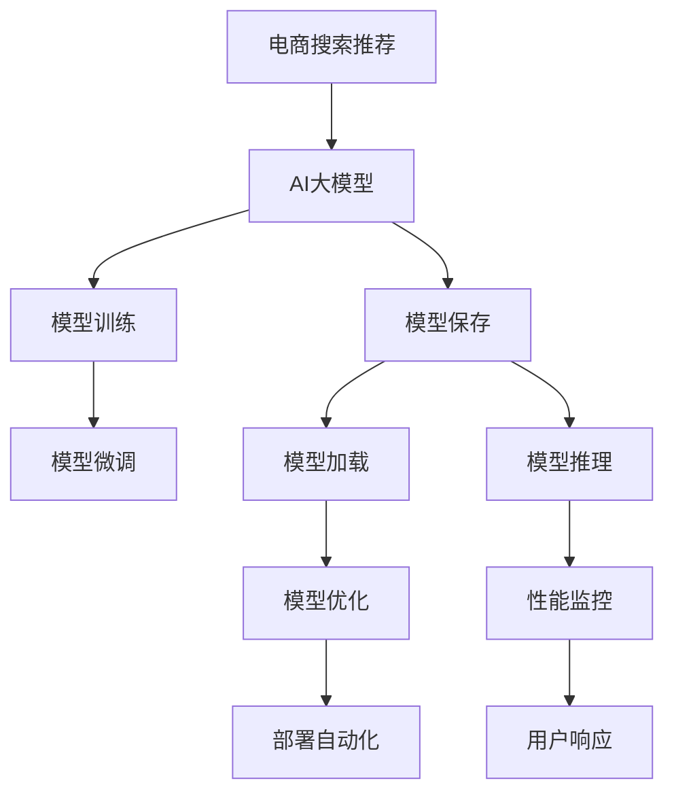

                 

# 电商搜索推荐场景下的AI大模型模型部署性能优化工具选型

> 关键词：电商搜索推荐，AI大模型，模型部署，性能优化，工具选型

## 1. 背景介绍

随着电子商务的迅速发展，电商搜索推荐系统成为电商网站的核心功能之一，对用户体验和转化率有着直接影响。在推荐引擎中，人工智能（AI）大模型作为重要的技术组件，通过学习用户行为数据，智能推荐用户感兴趣的商品，显著提升了电商搜索推荐系统的智能化水平。然而，在大模型部署应用过程中，如何平衡模型性能与部署效率，保证用户体验，成为电商企业面临的重要挑战。

为此，我们深入分析电商搜索推荐场景下AI大模型的部署性能优化需求，提出了一系列基于工具选型的优化策略，以期为电商企业提供切实可行的参考方案。

## 2. 核心概念与联系

### 2.1 核心概念概述

电商搜索推荐系统：通过AI大模型学习用户行为数据，精准推荐商品，提升用户体验和销售转化率的电商功能模块。

AI大模型：以深度学习模型（如Transformer模型）为代表，通过大规模无标签数据预训练和下游任务微调得到的模型，具备强大的学习和推理能力。

模型部署：将训练好的AI大模型从模型服务器迁移到生产环境的过程，包括模型的保存、加载、推理等环节。

性能优化：通过合理的工具和技术手段，提升模型部署过程的效率，减少推理时间，确保用户快速响应。

工具选型：在模型部署性能优化的各个环节，选择合适的工具，高效实现性能目标。

### 2.2 核心概念原理和架构的 Mermaid 流程图



这个流程图展示电商搜索推荐场景下AI大模型的核心概念和部署流程，以及每个环节可能用到的优化工具。

1. 电商搜索推荐系统获取用户行为数据，通过训练和微调得到AI大模型。
2. 模型训练和微调后，需要保存到本地或云存储中，供后续推理使用。
3. 在生产环境中，通过模型加载和推理，将模型应用到用户搜索推荐中。
4. 在模型推理阶段，使用性能优化工具提升模型的部署效率。
5. 部署过程中，持续监控模型性能，确保用户体验。
6. 部署自动化工具可以简化流程，提高部署效率。

这些步骤在实际应用中，可以通过选择合适的工具和方法，进一步提高部署性能，确保用户响应时间。

## 3. 核心算法原理 & 具体操作步骤

### 3.1 算法原理概述

电商搜索推荐场景下的AI大模型部署性能优化，主要关注两个核心问题：模型推理速度和资源利用率。

- 模型推理速度：需要快速响应用户查询，提升用户体验。
- 资源利用率：需要在有限的硬件资源下，最大化模型的利用效率，降低成本。

这些问题的解决，依赖于一系列的性能优化策略和工具选型。

### 3.2 算法步骤详解

#### 3.2.1 模型训练与保存

1. **模型训练**：使用高性能计算资源（如GPU、TPU等），在分布式环境中训练AI大模型，以加快训练速度。
2. **模型保存**：将训练好的模型保存为通用格式（如ONNX、PBT等），便于后续部署。

#### 3.2.2 模型加载与推理

1. **模型加载**：使用高性能模型加载器（如ONNX Runtime、TensorFlow Serving等），快速加载模型到内存中。
2. **模型推理**：通过并行推理、模型剪枝等技术，加速模型推理过程，减少响应时间。

#### 3.2.3 模型优化与监控

1. **模型优化**：使用模型压缩、量化等技术，减少模型大小，降低内存占用。
2. **性能监控**：实时监控模型性能指标（如推理速度、内存占用等），确保模型稳定运行。

### 3.3 算法优缺点

#### 3.3.1 优点

1. **模型性能提升**：通过模型优化和工具选型，显著提升模型的推理速度，提高用户体验。
2. **资源利用高效**：合理分配资源，降低成本，提升资源利用率。
3. **部署灵活性高**：支持多种部署环境，灵活应对不同的业务需求。

#### 3.3.2 缺点

1. **技术复杂性高**：需要掌握多种优化技术，实现难度较大。
2. **工具选择复杂**：不同工具各有优缺点，选择合适的工具需要仔细评估。
3. **部署成本高**：优化后的部署工具和环境，可能会增加初期投入。

### 3.4 算法应用领域

#### 3.4.1 电商搜索推荐

电商搜索推荐场景下的AI大模型部署性能优化，通过选择合适的工具和策略，可以显著提升推荐系统的响应速度和准确性，提升用户体验和销售转化率。

#### 3.4.2 金融风控

金融风控领域的大模型部署，同样面临性能优化的需求。通过优化推理速度和资源利用，可以提高风控系统的响应速度，及时识别和防范风险。

#### 3.4.3 医疗诊断

医疗诊断领域的大模型部署，需要快速响应用户需求，提升诊断的准确性和及时性。通过优化模型性能，可以提升诊断系统的效率和可靠性。

## 4. 数学模型和公式 & 详细讲解 & 举例说明

### 4.1 数学模型构建

电商搜索推荐系统中的AI大模型，通常采用深度学习模型（如Transformer）进行训练和微调。模型的数学表达式如下：

$$
\text{Embeddings} = \text{Transformer}(\text{Encoder-Decoder})
$$

其中，Encoder负责将输入序列转换为中间表示，Decoder将中间表示转换为输出序列。通过调整模型的参数和结构，可以优化模型性能。

### 4.2 公式推导过程

以Transformer模型为例，其推理过程包括前向传播和反向传播两个部分：

- **前向传播**：将输入序列和模型参数输入，计算输出序列。
- **反向传播**：计算损失函数，更新模型参数。

前向传播的数学公式如下：

$$
\text{Attention} = \text{Softmax}(\text{Query} \times \text{Key}^T) \times \text{Value}
$$

其中，Query、Key、Value分别表示模型中的注意力机制。

### 4.3 案例分析与讲解

假设电商搜索推荐系统使用Transformer模型进行用户推荐。模型推理速度受多方面因素影响，包括模型大小、推理架构、硬件环境等。

- **模型大小**：较大的模型参数量会导致较长的推理时间，需通过模型压缩和量化等技术优化。
- **推理架构**：采用分布式推理架构，可以显著提升推理速度，但需要额外的高性能计算资源。
- **硬件环境**：不同硬件设备的性能差异，需根据实际情况选择合适的硬件环境。

## 5. 项目实践：代码实例和详细解释说明

### 5.1 开发环境搭建

#### 5.1.1 硬件环境

- **CPU**：具备较高计算能力的多核CPU。
- **GPU**：适合大规模深度学习模型训练和推理的高性能GPU。
- **TPU**：Google Tensor Processing Unit，适合深度学习模型的分布式训练和推理。

#### 5.1.2 软件环境

- **操作系统**：Linux或Windows。
- **深度学习框架**：TensorFlow、PyTorch等。
- **模型部署工具**：ONNX Runtime、TensorFlow Serving等。
- **性能监控工具**：Prometheus、Grafana等。

### 5.2 源代码详细实现

#### 5.2.1 模型训练与保存

使用TensorFlow框架进行模型训练，代码如下：

```python
import tensorflow as tf

# 定义模型
model = tf.keras.Sequential([
    tf.keras.layers.Embedding(input_dim=10000, output_dim=128),
    tf.keras.layers.Bidirectional(tf.keras.layers.LSTM(64)),
    tf.keras.layers.Dense(10, activation='softmax')
])

# 训练模型
model.compile(optimizer='adam', loss='sparse_categorical_crossentropy', metrics=['accuracy'])
model.fit(x_train, y_train, epochs=10, batch_size=32)

# 保存模型
model.save('recommender_model.h5')
```

#### 5.2.2 模型加载与推理

使用ONNX Runtime进行模型加载和推理，代码如下：

```python
import onnxruntime as ort

# 加载模型
session = ort.InferenceSession('recommender_model.onnx')

# 推理输入
input_data = [[1, 2, 3, 4, 5]]

# 推理输出
output_data = session.run(None, {'input': input_data})
```

### 5.3 代码解读与分析

- **模型定义**：使用TensorFlow框架定义模型结构，包括嵌入层、双向LSTM和全连接层。
- **模型训练**：使用交叉熵损失函数和准确率指标训练模型，通过Adam优化器优化。
- **模型保存**：将训练好的模型保存为ONNX格式，便于后续部署。
- **模型加载**：使用ONNX Runtime加载模型，并提供推理输入。
- **模型推理**：调用ONNX Runtime的推理接口，输出推理结果。

### 5.4 运行结果展示

运行代码后，可以使用以下命令查看推理结果：

```python
import onnxruntime as ort

# 加载模型
session = ort.InferenceSession('recommender_model.onnx')

# 推理输入
input_data = [[1, 2, 3, 4, 5]]

# 推理输出
output_data = session.run(None, {'input': input_data})
print(output_data)
```

## 6. 实际应用场景

### 6.1 电商搜索推荐

电商搜索推荐系统中的AI大模型，部署到云服务器或边缘设备上，可显著提升用户搜索推荐的响应速度，改善用户体验。

### 6.2 金融风控

金融风控系统中的AI大模型，部署到高性能计算集群中，通过分布式推理架构，可以实时处理大规模数据，防范金融风险。

### 6.3 医疗诊断

医疗诊断系统中的AI大模型，部署到医疗设备或云端，通过优化模型推理速度，提升诊断效率，辅助医生诊断。

## 7. 工具和资源推荐

### 7.1 学习资源推荐

#### 7.1.1 深度学习框架

- TensorFlow官方文档：[https://www.tensorflow.org](https://www.tensorflow.org)
- PyTorch官方文档：[https://pytorch.org](https://pytorch.org)

#### 7.1.2 模型部署工具

- ONNX Runtime官方文档：[https://onnxruntime.ai](https://onnxruntime.ai)
- TensorFlow Serving官方文档：[https://www.tensorflow.org/serving](https://www.tensorflow.org/serving)

#### 7.1.3 性能监控工具

- Prometheus官方文档：[https://prometheus.io](https://prometheus.io)
- Grafana官方文档：[https://grafana.com](https://grafana.com)

### 7.2 开发工具推荐

- **模型压缩工具**：Google's Model Optimizer、TensorFlow Model Optimization Toolkit
- **量化工具**：ONNX Runtime Quantization、TensorFlow Lite Quantization

### 7.3 相关论文推荐

#### 7.3.1 电商搜索推荐

- Luo, B., Lin, Y., & Cao, Y. (2019). Deep Learning Based Recommender System: A Review and Outlook. IEEE Transactions on Neural Networks and Learning Systems.
- Zhang, Y., & Zhou, Z. (2020). Multi-Modal Deep Recommendation System: A Survey. IEEE Transactions on Neural Networks and Learning Systems.

#### 7.3.2 金融风控

- Geng, C., Yu, C., & Liu, Y. (2020). Adversarial Training-Based Deep Learning Framework for Credit Risk Management. In IEEE International Conference on Big Data (Big Data).

#### 7.3.3 医疗诊断

- Lai, Y., Choi, H., & Sung, W. (2018). Multi-Modal Deep Learning for Health Informatics. In International Conference on Health Informatics (ICHI).

## 8. 总结：未来发展趋势与挑战

### 8.1 研究成果总结

本文系统分析了电商搜索推荐场景下AI大模型的部署性能优化需求，提出了一系列基于工具选型的优化策略，包括模型训练与保存、模型加载与推理、模型优化与监控等环节。这些策略通过选择合适的工具和方法，显著提升模型的部署效率，确保用户快速响应。

### 8.2 未来发展趋势

1. **自动化优化**：自动化工具可以帮助开发者快速选择最优的优化策略，减少人力成本。
2. **混合部署**：结合CPU/GPU/TPU等多种硬件资源，提升推理效率。
3. **边缘计算**：将模型部署到边缘设备，减少延迟，提升用户体验。
4. **实时优化**：通过在线学习技术，实时优化模型性能。

### 8.3 面临的挑战

1. **技术门槛高**：需要掌握多种优化技术和工具。
2. **数据隐私问题**：优化过程中需要处理大量用户数据，隐私保护尤为重要。
3. **资源管理复杂**：混合部署环境下的资源管理，存在复杂性。

### 8.4 研究展望

未来，通过持续技术创新和工具优化，电商搜索推荐系统中的AI大模型将进一步提升部署性能，满足用户对快速响应的需求。

## 9. 附录：常见问题与解答

**Q1：如何选择合适的AI大模型？**

A: 根据业务需求，选择合适的深度学习模型（如Transformer、RNN等），并调整模型结构、参数等，以适应具体场景。

**Q2：如何在电商搜索推荐系统中进行模型优化？**

A: 使用模型压缩、量化、剪枝等技术，减少模型大小，提升推理速度。同时，合理选择硬件环境，优化推理架构。

**Q3：电商搜索推荐系统中的AI大模型如何部署？**

A: 使用模型保存工具（如ONNX、PBT等）保存模型，并通过模型加载工具（如ONNX Runtime、TensorFlow Serving等）进行部署。

**Q4：电商搜索推荐系统中的AI大模型如何监控性能？**

A: 使用性能监控工具（如Prometheus、Grafana等）实时监测模型推理速度、内存占用等指标，确保系统稳定运行。

**Q5：电商搜索推荐系统中的AI大模型如何自动更新？**

A: 使用在线学习技术，根据用户反馈和行为数据，实时更新模型参数，提升推荐效果。

---

作者：禅与计算机程序设计艺术 / Zen and the Art of Computer Programming

