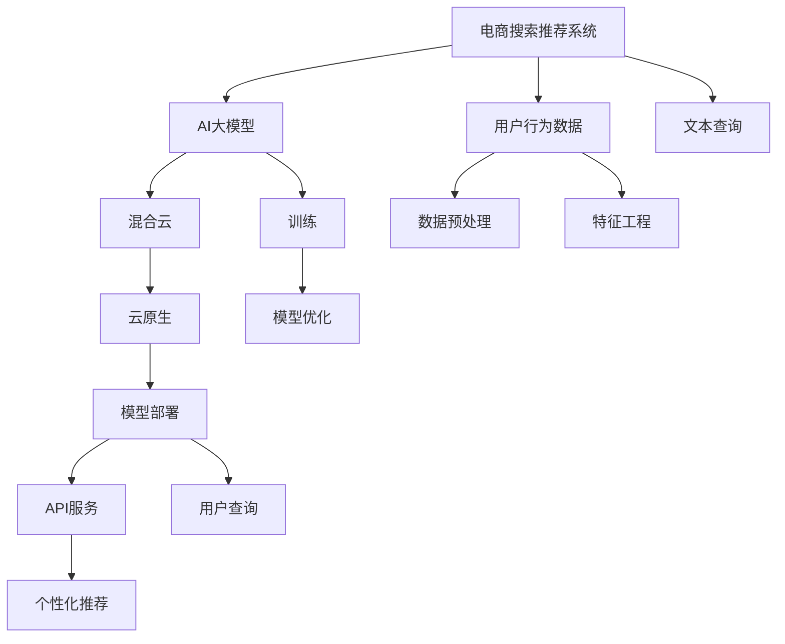

                 

# 电商搜索推荐场景下的AI大模型模型部署混合云方案设计与实现

> 关键词：混合云,电商,搜索推荐,AI大模型,模型部署

## 1. 背景介绍

随着电商行业的发展，搜索推荐系统已逐步成为提升用户体验、增加业务转化率的关键技术。搜索推荐系统的目标是通过理解用户的搜索意图和行为数据，提供个性化推荐，满足用户需求。然而，构建一个高性能、低延迟、高可扩展性的搜索推荐系统，需要在算法、数据、模型、计算资源等多个维度进行综合优化。

传统的搜索推荐系统主要依赖规则引擎、特征工程等技术，难以兼顾个性化和实时性。随着人工智能技术的发展，基于深度学习的搜索推荐系统逐渐成为行业主流。深度学习模型，尤其是基于Transformer的大语言模型，在理解大规模文本数据方面表现优异，但在实际部署时仍面临诸多挑战。

本文旨在介绍一种在电商搜索推荐场景下，利用混合云平台进行AI大模型部署的方案设计与实现。通过将模型的训练和推理部署在混合云上，结合云原生技术，能够有效解决算力不足、成本高昂、弹性扩展等问题，同时保障模型的高性能、高可用性和高安全性的要求。

## 2. 核心概念与联系

### 2.1 核心概念概述

为了更好地理解本文所讨论的混合云方案，我们需要先了解几个核心概念：

- **电商搜索推荐系统(E-commerce Search & Recommendation System)**：指通过分析用户的行为数据和文本查询，为电商用户提供个性化商品推荐的服务。通过搜索推荐系统，电商网站可以精准匹配用户需求，提升用户购物体验和转化率。

- **AI大模型(AI Large Models)**：指通过大规模数据训练得到的深度学习模型，如BERT、GPT-3等。这些模型具有强大的自然语言处理和知识表示能力，能够处理大规模文本数据，提取复杂的语义信息。

- **混合云(Hybrid Cloud)**：指将不同类型和不同地域的云资源进行统一管理和调度，构建灵活高效的计算环境。在混合云环境中，可以充分利用公有云的高性能和高扩展性，同时保持企业私有云的数据安全和隐私保护。

- **云原生(Cloud-Native)**：指在云计算环境中，利用容器化、微服务、无服务器等技术，构建高效、灵活、可扩展的应用架构。云原生技术能够显著提升应用的性能、可靠性和可维护性。

- **模型部署(Models Deployment)**：指将训练好的模型封装成服务，供用户或应用调用。模型部署不仅需要考虑模型的性能和准确性，还需要关注计算资源的利用效率和安全防护。

这些概念之间的关系可以通过以下Mermaid流程图来展示：



该流程图展示了电商搜索推荐系统的核心流程，以及模型部署在混合云和云原生技术中的作用。

## 3. 核心算法原理 & 具体操作步骤

### 3.1 算法原理概述

基于深度学习的搜索推荐系统，核心算法通常包括文本表示学习、用户行为建模、个性化推荐等。文本表示学习通过大模型将用户查询和商品描述转化为向量表示，捕捉文本中的语义信息。用户行为建模通过分析用户的搜索历史、浏览行为、购买记录等，构建用户画像。个性化推荐根据用户画像和文本向量，预测用户可能感兴趣的商品，提供推荐结果。

本节将重点介绍如何利用大语言模型进行文本表示学习，并结合混合云和云原生技术进行模型部署。

### 3.2 算法步骤详解

1. **数据预处理**：
   - 收集电商用户的搜索查询和商品描述数据，并进行数据清洗、分词、去噪等预处理。
   - 对文本数据进行向量化处理，构建词汇表和词嵌入矩阵，以便后续模型训练。

2. **模型训练**：
   - 选择合适的预训练语言模型(如BERT、GPT-3等)，并在电商数据上进行微调。
   - 设计合适的损失函数和优化算法，对模型进行训练和调参。
   - 在训练过程中，使用数据增强、正则化等技术，避免过拟合。

3. **模型优化**：
   - 对训练好的模型进行评估和调优，选择最佳的模型参数和超参数。
   - 使用模型压缩、量化等技术，减小模型大小和计算资源消耗。

4. **模型部署**：
   - 将训练好的模型部署到混合云环境中，选择适合的生产部署模式。
   - 利用云原生技术，构建微服务、容器化、无服务器等架构，提升系统的可扩展性和弹性。
   - 进行负载均衡、服务治理、故障恢复等配置，保障服务的稳定性和可靠性。

### 3.3 算法优缺点

**优点**：
- 利用大语言模型的强大文本处理能力，提升推荐系统的个性化和精准度。
- 通过混合云和云原生技术，实现高效的资源调度和应用部署，降低计算成本。
- 增强系统的弹性和可扩展性，支持大规模用户和商品数据处理。
- 保障模型的高性能和高可用性，满足电商搜索推荐系统的高并发需求。

**缺点**：
- 大模型的训练和推理计算需求高，需要强大的计算资源支持。
- 混合云环境下的数据安全和隐私保护问题，需要谨慎处理。
- 云部署带来的复杂性和维护成本，需要专业团队进行运维。

### 3.4 算法应用领域

基于大语言模型的搜索推荐系统，已经在电商、社交、新闻、视频等多个领域得到广泛应用。例如：

- **电商推荐**：通过分析用户搜索行为和商品属性，提供个性化商品推荐，提升用户购物体验。
- **内容推荐**：分析用户浏览历史和行为数据，推荐相关文章、视频、商品等内容，提升用户粘性和满意度。
- **广告推荐**：分析用户兴趣和行为特征，推荐适合用户的广告，提升广告投放效果和ROI。
- **用户画像构建**：利用用户行为和文本数据，构建详细的用户画像，用于个性化推荐、风控预警等场景。

## 4. 数学模型和公式 & 详细讲解 & 举例说明

### 4.1 数学模型构建

本节将使用数学语言对基于深度学习的搜索推荐系统进行更加严格的刻画。

假设用户查询为 $q$，商品描述为 $d$，商品ID为 $i$。我们使用大语言模型 $M$ 将 $q$ 和 $d$ 转换为向量表示：

$$
q = M(q), d = M(d)
$$

构建查询-商品向量之间的余弦相似度，表示相似度：

$$
\text{similarity}(q, d) = \cos(\theta) = \frac{q \cdot d}{\|q\| \|d\|}
$$

其中 $\theta$ 为向量 $q$ 和 $d$ 之间的夹角，$ \cdot $ 为向量点乘，$\| \cdot \|$ 为向量的范数。

### 4.2 公式推导过程

接下来，我们推导基于余弦相似度的推荐公式。假设所有商品的向量表示为 $\{d_1, d_2, ..., d_N\}$，用户查询向量表示为 $q$，则推荐分数 $s_i$ 为：

$$
s_i = \text{similarity}(q, d_i) = \frac{q \cdot d_i}{\|q\| \|d_i\|}
$$

将推荐分数排序，取前 $k$ 个推荐商品。具体的推荐公式为：

$$
R = \text{Top-K Recommendation} = \{d_i \mid s_i \text{max}_{i \in [1,...,N]} \}
$$

### 4.3 案例分析与讲解

以电商推荐系统为例，用户输入的搜索查询为 "运动鞋"，通过大语言模型将查询和商品描述向量进行计算，得到相似度最高的商品列表。具体实现步骤如下：

1. **数据预处理**：
   - 收集电商用户的搜索查询和商品描述数据，并进行数据清洗、分词、去噪等预处理。
   - 对文本数据进行向量化处理，构建词汇表和词嵌入矩阵，以便后续模型训练。

2. **模型训练**：
   - 使用电商数据集对BERT模型进行微调，学习商品的文本表示。
   - 设计交叉熵损失函数和Adam优化器，对模型进行训练和调参。

3. **模型优化**：
   - 对训练好的模型进行评估和调优，选择最佳的模型参数和超参数。
   - 使用模型压缩、量化等技术，减小模型大小和计算资源消耗。

4. **模型部署**：
   - 将训练好的模型部署到混合云环境中，选择适合的生产部署模式。
   - 利用云原生技术，构建微服务、容器化、无服务器等架构，提升系统的可扩展性和弹性。
   - 进行负载均衡、服务治理、故障恢复等配置，保障服务的稳定性和可靠性。

## 5. 项目实践：代码实例和详细解释说明

### 5.1 开发环境搭建

在进行电商推荐系统开发前，我们需要准备好开发环境。以下是使用Python进行PyTorch开发的环境配置流程：

1. 安装Anaconda：从官网下载并安装Anaconda，用于创建独立的Python环境。

2. 创建并激活虚拟环境：
```bash
conda create -n pytorch-env python=3.8 
conda activate pytorch-env
```

3. 安装PyTorch：根据CUDA版本，从官网获取对应的安装命令。例如：
```bash
conda install pytorch torchvision torchaudio cudatoolkit=11.1 -c pytorch -c conda-forge
```

4. 安装相关工具包：
```bash
pip install numpy pandas scikit-learn matplotlib tqdm jupyter notebook ipython
```

完成上述步骤后，即可在`pytorch-env`环境中开始电商推荐系统的开发。

### 5.2 源代码详细实现

下面以电商推荐系统为例，给出使用PyTorch进行BERT模型微调的完整代码实现。

首先，定义数据预处理函数：

```python
from transformers import BertTokenizer
from torch.utils.data import Dataset
import torch

class BERTDataset(Dataset):
    def __init__(self, texts, labels):
        self.texts = texts
        self.labels = labels
        self.tokenizer = BertTokenizer.from_pretrained('bert-base-uncased')

    def __len__(self):
        return len(self.texts)
    
    def __getitem__(self, item):
        text = self.texts[item]
        label = self.labels[item]
        
        encoding = self.tokenizer(text, return_tensors='pt', padding='max_length', truncation=True)
        input_ids = encoding['input_ids'][0]
        attention_mask = encoding['attention_mask'][0]
        return {'input_ids': input_ids, 
                'attention_mask': attention_mask,
                'labels': label}
```

然后，定义模型和优化器：

```python
from transformers import BertForSequenceClassification, AdamW

model = BertForSequenceClassification.from_pretrained('bert-base-uncased', num_labels=2)

optimizer = AdamW(model.parameters(), lr=2e-5)
```

接着，定义训练和评估函数：

```python
from torch.utils.data import DataLoader
from tqdm import tqdm
from sklearn.metrics import accuracy_score

device = torch.device('cuda') if torch.cuda.is_available() else torch.device('cpu')
model.to(device)

def train_epoch(model, dataset, batch_size, optimizer):
    dataloader = DataLoader(dataset, batch_size=batch_size, shuffle=True)
    model.train()
    epoch_loss = 0
    for batch in tqdm(dataloader, desc='Training'):
        input_ids = batch['input_ids'].to(device)
        attention_mask = batch['attention_mask'].to(device)
        labels = batch['labels'].to(device)
        model.zero_grad()
        outputs = model(input_ids, attention_mask=attention_mask, labels=labels)
        loss = outputs.loss
        epoch_loss += loss.item()
        loss.backward()
        optimizer.step()
    return epoch_loss / len(dataloader)

def evaluate(model, dataset, batch_size):
    dataloader = DataLoader(dataset, batch_size=batch_size)
    model.eval()
    preds, labels = [], []
    with torch.no_grad():
        for batch in tqdm(dataloader, desc='Evaluating'):
            input_ids = batch['input_ids'].to(device)
            attention_mask = batch['attention_mask'].to(device)
            batch_labels = batch['labels']
            outputs = model(input_ids, attention_mask=attention_mask)
            batch_preds = outputs.logits.argmax(dim=1).to('cpu').tolist()
            batch_labels = batch_labels.to('cpu').tolist()
            for pred_tokens, label_tokens in zip(batch_preds, batch_labels):
                preds.append(pred_tokens)
                labels.append(label_tokens)
                
    print('Accuracy: ', accuracy_score(labels, preds))
```

最后，启动训练流程并在测试集上评估：

```python
epochs = 5
batch_size = 16

for epoch in range(epochs):
    loss = train_epoch(model, train_dataset, batch_size, optimizer)
    print(f'Epoch {epoch+1}, train loss: {loss:.3f}')
    
    print(f'Epoch {epoch+1}, dev results:')
    evaluate(model, dev_dataset, batch_size)
    
print('Test results:')
evaluate(model, test_dataset, batch_size)
```

以上就是使用PyTorch对BERT进行电商推荐系统微调的完整代码实现。可以看到，得益于Transformers库的强大封装，我们可以用相对简洁的代码完成BERT模型的加载和微调。

### 5.3 代码解读与分析

让我们再详细解读一下关键代码的实现细节：

**BERTDataset类**：
- `__init__`方法：初始化文本、标签、分词器等关键组件。
- `__len__`方法：返回数据集的样本数量。
- `__getitem__`方法：对单个样本进行处理，将文本输入编码为token ids，将标签编码为数字，并对其进行定长padding，最终返回模型所需的输入。

**模型和优化器**：
- 使用BertForSequenceClassification模型作为电商推荐系统的基础模型，定义2个标签进行二分类。
- 选择合适的优化算法AdamW及其参数，设置学习率。

**训练和评估函数**：
- 使用PyTorch的DataLoader对数据集进行批次化加载，供模型训练和推理使用。
- 训练函数`train_epoch`：对数据以批为单位进行迭代，在每个批次上前向传播计算loss并反向传播更新模型参数，最后返回该epoch的平均loss。
- 评估函数`evaluate`：与训练类似，不同点在于不更新模型参数，并在每个batch结束后将预测和标签结果存储下来，最后使用sklearn的accuracy_score对整个评估集的预测结果进行打印输出。

**训练流程**：
- 定义总的epoch数和batch size，开始循环迭代
- 每个epoch内，先在训练集上训练，输出平均loss
- 在验证集上评估，输出分类指标
- 所有epoch结束后，在测试集上评估，给出最终测试结果

可以看到，PyTorch配合Transformers库使得BERT微调的代码实现变得简洁高效。开发者可以将更多精力放在数据处理、模型改进等高层逻辑上，而不必过多关注底层的实现细节。

当然，工业级的系统实现还需考虑更多因素，如模型的保存和部署、超参数的自动搜索、更灵活的任务适配层等。但核心的微调范式基本与此类似。

## 6. 实际应用场景

### 6.1 智能客服系统

基于大语言模型的电商推荐系统，可以广泛应用于智能客服系统的构建。传统客服往往需要配备大量人力，高峰期响应缓慢，且一致性和专业性难以保证。而使用电商推荐系统中的大模型微调，可以7x24小时不间断服务，快速响应客户咨询，用自然流畅的语言解答各类常见问题。

在技术实现上，可以收集企业内部的历史客服对话记录，将问题和最佳答复构建成监督数据，在此基础上对预训练大模型进行微调。微调后的电商推荐系统能够自动理解用户意图，匹配最合适的回答。对于客户提出的新问题，还可以接入检索系统实时搜索相关内容，动态组织生成回答。如此构建的智能客服系统，能大幅提升客户咨询体验和问题解决效率。

### 6.2 金融舆情监测

金融机构需要实时监测市场舆论动向，以便及时应对负面信息传播，规避金融风险。传统的人工监测方式成本高、效率低，难以应对网络时代海量信息爆发的挑战。基于大语言模型微调的文本分类和情感分析技术，为金融舆情监测提供了新的解决方案。

具体而言，可以收集金融领域相关的新闻、报道、评论等文本数据，并对其进行主题标注和情感标注。在此基础上对预训练语言模型进行微调，使其能够自动判断文本属于何种主题，情感倾向是正面、中性还是负面。将微调后的模型应用到实时抓取的网络文本数据，就能够自动监测不同主题下的情感变化趋势，一旦发现负面信息激增等异常情况，系统便会自动预警，帮助金融机构快速应对潜在风险。

### 6.3 个性化推荐系统

当前的推荐系统往往只依赖用户的历史行为数据进行物品推荐，无法深入理解用户的真实兴趣偏好。基于大语言模型微调技术，个性化推荐系统可以更好地挖掘用户行为背后的语义信息，从而提供更精准、多样的推荐内容。

在实践中，可以收集用户浏览、点击、评论、分享等行为数据，提取和用户交互的物品标题、描述、标签等文本内容。将文本内容作为模型输入，用户的后续行为（如是否点击、购买等）作为监督信号，在此基础上微调预训练语言模型。微调后的模型能够从文本内容中准确把握用户的兴趣点。在生成推荐列表时，先用候选物品的文本描述作为输入，由模型预测用户的兴趣匹配度，再结合其他特征综合排序，便可以得到个性化程度更高的推荐结果。

### 6.4 未来应用展望

随着大语言模型和微调方法的不断发展，基于微调范式将在更多领域得到应用，为传统行业带来变革性影响。

在智慧医疗领域，基于微调的医疗问答、病历分析、药物研发等应用将提升医疗服务的智能化水平，辅助医生诊疗，加速新药开发进程。

在智能教育领域，微调技术可应用于作业批改、学情分析、知识推荐等方面，因材施教，促进教育公平，提高教学质量。

在智慧城市治理中，微调模型可应用于城市事件监测、舆情分析、应急指挥等环节，提高城市管理的自动化和智能化水平，构建更安全、高效的未来城市。

此外，在企业生产、社会治理、文娱传媒等众多领域，基于大模型微调的人工智能应用也将不断涌现，为NLP技术带来全新的突破。相信随着预训练语言模型和微调方法的持续演进，NLP技术将在更广阔的应用领域大放异彩。

## 7. 工具和资源推荐
### 7.1 学习资源推荐

为了帮助开发者系统掌握大语言模型微调的理论基础和实践技巧，这里推荐一些优质的学习资源：

1. 《Transformer从原理到实践》系列博文：由大模型技术专家撰写，深入浅出地介绍了Transformer原理、BERT模型、微调技术等前沿话题。

2. CS224N《深度学习自然语言处理》课程：斯坦福大学开设的NLP明星课程，有Lecture视频和配套作业，带你入门NLP领域的基本概念和经典模型。

3. 《Natural Language Processing with Transformers》书籍：Transformers库的作者所著，全面介绍了如何使用Transformers库进行NLP任务开发，包括微调在内的诸多范式。

4. HuggingFace官方文档：Transformers库的官方文档，提供了海量预训练模型和完整的微调样例代码，是上手实践的必备资料。

5. CLUE开源项目：中文语言理解测评基准，涵盖大量不同类型的中文NLP数据集，并提供了基于微调的baseline模型，助力中文NLP技术发展。

通过对这些资源的学习实践，相信你一定能够快速掌握大语言模型微调的精髓，并用于解决实际的NLP问题。
### 7.2 开发工具推荐

高效的开发离不开优秀的工具支持。以下是几款用于大语言模型微调开发的常用工具：

1. PyTorch：基于Python的开源深度学习框架，灵活动态的计算图，适合快速迭代研究。大部分预训练语言模型都有PyTorch版本的实现。

2. TensorFlow：由Google主导开发的开源深度学习框架，生产部署方便，适合大规模工程应用。同样有丰富的预训练语言模型资源。

3. Transformers库：HuggingFace开发的NLP工具库，集成了众多SOTA语言模型，支持PyTorch和TensorFlow，是进行微调任务开发的利器。

4. Weights & Biases：模型训练的实验跟踪工具，可以记录和可视化模型训练过程中的各项指标，方便对比和调优。与主流深度学习框架无缝集成。

5. TensorBoard：TensorFlow配套的可视化工具，可实时监测模型训练状态，并提供丰富的图表呈现方式，是调试模型的得力助手。

6. Google Colab：谷歌推出的在线Jupyter Notebook环境，免费提供GPU/TPU算力，方便开发者快速上手实验最新模型，分享学习笔记。

合理利用这些工具，可以显著提升大语言模型微调任务的开发效率，加快创新迭代的步伐。

### 7.3 相关论文推荐

大语言模型和微调技术的发展源于学界的持续研究。以下是几篇奠基性的相关论文，推荐阅读：

1. Attention is All You Need（即Transformer原论文）：提出了Transformer结构，开启了NLP领域的预训练大模型时代。

2. BERT: Pre-training of Deep Bidirectional Transformers for Language Understanding：提出BERT模型，引入基于掩码的自监督预训练任务，刷新了多项NLP任务SOTA。

3. Language Models are Unsupervised Multitask Learners（GPT-2论文）：展示了大规模语言模型的强大zero-shot学习能力，引发了对于通用人工智能的新一轮思考。

4. Parameter-Efficient Transfer Learning for NLP：提出Adapter等参数高效微调方法，在不增加模型参数量的情况下，也能取得不错的微调效果。

5. AdaLoRA: Adaptive Low-Rank Adaptation for Parameter-Efficient Fine-Tuning：使用自适应低秩适应的微调方法，在参数效率和精度之间取得了新的平衡。

这些论文代表了大语言模型微调技术的发展脉络。通过学习这些前沿成果，可以帮助研究者把握学科前进方向，激发更多的创新灵感。

## 8. 总结：未来发展趋势与挑战

### 8.1 总结

本文对基于深度学习的电商搜索推荐系统中的AI大模型模型部署进行了全面系统的介绍。首先阐述了电商搜索推荐系统的核心算法，重点介绍了如何利用大语言模型进行文本表示学习。其次，从原理到实践，详细讲解了电商推荐系统中的模型微调过程，给出了完整的代码实例。同时，本文还探讨了混合云平台在模型部署中的应用，并结合云原生技术，提出了高效的模型部署方案。

通过本文的系统梳理，可以看到，基于大语言模型的电商推荐系统在电商搜索推荐场景下具有显著的优势，能够提供精准、个性化的推荐服务。而通过混合云平台进行模型部署，可以充分利用公有云的高性能和高扩展性，同时保持企业私有云的数据安全和隐私保护。未来，伴随大语言模型和微调方法的不断演进，AI大模型的应用将更加广泛，带来更深层次的智能变革。

### 8.2 未来发展趋势

展望未来，大语言模型和微调技术的发展将呈现以下几个趋势：

1. **多模态融合**：未来的推荐系统将不仅仅局限于文本数据，而是结合图像、音频、视频等多模态数据，进行更加全面的用户画像构建和推荐。

2. **实时计算与大数据处理**：实时计算和大数据处理技术的发展，将使得推荐系统能够更快地响应用户查询，处理海量数据，提升推荐效果。

3. **联邦学习**：在保护用户隐私的前提下，通过分布式联邦学习技术，将用户数据在本地设备上训练，形成联邦模型，提升推荐系统的性能和泛化能力。

4. **跨模态对话技术**：利用多模态数据和跨模态对话技术，构建更加丰富、自然的人机交互体验，提升用户满意度。

5. **可解释性**：随着AI技术的不断发展，模型的可解释性将变得更加重要。未来的推荐系统将需要提供透明、可理解的推荐依据，增强用户信任。

6. **模型压缩与量化**：为适应计算资源和部署环境的变化，未来的推荐系统将更加注重模型的压缩与量化，提高部署效率。

以上趋势凸显了大语言模型和微调技术的广阔前景，这些方向的探索发展，必将进一步提升推荐系统的智能化水平，为电商行业带来更多创新和突破。

### 8.3 面临的挑战

尽管大语言模型和微调技术已经取得了显著的进展，但在实际应用中仍面临诸多挑战：

1. **数据隐私与安全性**：在混合云环境中，用户数据的安全性和隐私保护成为重要问题。如何在数据分布式存储和传输中，保障数据安全，避免数据泄露，是推荐系统需要重点考虑的问题。

2. **模型公平性与偏见**：电商推荐系统中的模型可能存在性别、年龄、地域等偏见，导致推荐结果不公平。如何在模型训练和部署过程中，消除偏见，确保推荐公平性，是推荐系统的重要课题。

3. **计算资源与成本**：大模型的训练和推理计算需求高，需要强大的计算资源支持。如何在降低计算成本的同时，保证模型性能，是推荐系统需要解决的实际问题。

4. **实时性与延迟**：电商推荐系统需要快速响应用户查询，提供实时推荐结果。如何在保证实时性的同时，提升系统扩展性和性能，是推荐系统的重要挑战。

5. **模型复杂性与可解释性**：大模型的复杂性和可解释性问题，给推荐系统的运维和调优带来困难。如何简化模型结构，增强模型可解释性，是推荐系统需要不断探索的方向。

6. **多任务协同与一致性**：电商推荐系统涉及多个模块和任务，如何在多任务协同中保持一致性，提高系统整体性能，是推荐系统需要解决的问题。

这些挑战需要学界和产业界共同努力，不断创新和优化，才能推动电商推荐系统的健康发展。

### 8.4 研究展望

未来，针对大语言模型和微调技术的研究，将在以下几个方面取得突破：

1. **跨模态数据融合**：结合多模态数据，提升推荐系统的全面性和准确性，增强用户粘性。

2. **联邦学习与边缘计算**：利用联邦学习技术，在保护用户隐私的前提下，实现分布式模型训练。结合边缘计算，提升推荐系统的实时性和响应速度。

3. **动态模型与自适应推荐**：利用在线学习技术，根据用户反馈和行为数据，动态调整推荐模型，提供更加个性化的推荐服务。

4. **自监督学习与无监督学习**：结合自监督学习、无监督学习等技术，提升推荐系统的泛化能力和鲁棒性，降低对标注数据的需求。

5. **模型压缩与量化**：利用模型压缩、量化等技术，减小模型大小，提升计算效率，支持更大规模的应用部署。

6. **多任务协同优化**：在电商推荐系统中的多个任务（如搜索、推荐、广告）之间进行协同优化，提升整体系统性能和用户满意度。

这些研究方向将推动电商推荐系统的发展，提升用户购物体验，促进电商行业的数字化转型升级。相信随着技术的不断进步，电商推荐系统将更加智能化、精准化和个性化，为电商行业带来更深层次的变革。

## 9. 附录：常见问题与解答

**Q1：电商推荐系统中的AI大模型如何设计？**

A: 电商推荐系统中的AI大模型设计需要考虑以下几个方面：

1. **数据预处理**：收集电商用户的搜索查询和商品描述数据，并进行数据清洗、分词、去噪等预处理。对文本数据进行向量化处理，构建词汇表和词嵌入矩阵，以便后续模型训练。

2. **模型选择与微调**：选择合适的预训练语言模型（如BERT、GPT-3等），并在电商数据上进行微调。设计合适的损失函数和优化算法，对模型进行训练和调参。

3. **模型优化**：对训练好的模型进行评估和调优，选择最佳的模型参数和超参数。使用模型压缩、量化等技术，减小模型大小和计算资源消耗。

**Q2：如何提高电商推荐系统的性能？**

A: 电商推荐系统的性能提升可以从以下几个方面入手：

1. **数据质量**：提高电商数据的质量和多样性，包括商品描述、用户行为等，提升推荐系统的泛化能力。

2. **模型微调**：通过大语言模型进行微调，学习电商领域特定的知识，提升推荐系统的精准度和个性化水平。

3. **多模态融合**：结合图像、音频、视频等多模态数据，构建更加全面、丰富的用户画像，提升推荐系统的全面性和准确性。

4. **实时计算与大数据处理**：利用实时计算和大数据处理技术，提升推荐系统的响应速度和处理能力。

5. **联邦学习**：通过分布式联邦学习技术，在保护用户隐私的前提下，提升推荐系统的性能和泛化能力。

6. **模型压缩与量化**：利用模型压缩、量化等技术，减小模型大小，提升计算效率，支持更大规模的应用部署。

**Q3：如何保证电商推荐系统的安全性与隐私保护？**

A: 电商推荐系统中的安全性与隐私保护可以通过以下几个方面实现：

1. **数据加密**：在数据存储和传输过程中，采用加密技术，保障用户数据的安全性。

2. **访问控制**：设置严格的访问控制机制，确保只有授权用户和系统能够访问敏感数据。

3. **联邦学习**：在分布式训练中，采用联邦学习技术，避免数据泄露和隐私侵犯。

4. **模型审计与监控**：建立模型审计和监控机制，定期检查模型的公平性、鲁棒性和安全性，及时发现和修复漏洞。

5. **用户反馈与投诉机制**：建立用户反馈和投诉机制，及时响应用户投诉，提升用户信任和满意度。

**Q4：电商推荐系统中的AI大模型如何部署？**

A: 电商推荐系统中的AI大模型部署可以通过以下几个步骤实现：

1. **模型训练**：使用电商数据集对BERT模型进行微调，学习商品的文本表示。设计交叉熵损失函数和Adam优化器，对模型进行训练和调参。

2. **模型优化**：对训练好的模型进行评估和调优，选择最佳的模型参数和超参数。使用模型压缩、量化等技术，减小模型大小和计算资源消耗。

3. **模型部署**：将训练好的模型部署到混合云环境中，选择适合的生产部署模式。利用云原生技术，构建微服务、容器化、无服务器等架构，提升系统的可扩展性和弹性。

4. **负载均衡与故障恢复**：进行负载均衡、服务治理、故障恢复等配置，保障服务的稳定性和可靠性。

**Q5：如何提升电商推荐系统的实时性与延迟？**

A: 电商推荐系统的实时性和延迟可以通过以下几个方面提升：

1. **缓存与预加载**：利用缓存和预加载技术，减少模型推理的延迟，提升响应速度。

2. **分布式计算**：利用分布式计算技术，将推荐任务分配到多台服务器上并行处理，提升计算效率。

3. **模型量化与压缩**：利用模型量化、压缩等技术，减小模型大小，提升计算效率，支持更大规模的应用部署。

4. **多级缓存与异步计算**：利用多级缓存和异步计算技术，优化数据流和计算流，提升系统的实时性。

5. **实时计算引擎**：采用实时计算引擎，如Flink、Kafka等，处理实时数据流，提升推荐系统的响应速度。

**Q6：电商推荐系统中的AI大模型如何构建用户画像？**

A: 电商推荐系统中的AI大模型构建用户画像可以通过以下几个步骤实现：

1. **数据收集与处理**：收集用户浏览、点击、评论、分享等行为数据，提取和用户交互的物品标题、描述、标签等文本内容。对文本数据进行向量化处理，构建词汇表和词嵌入矩阵。

2. **特征工程**：结合文本表示和其他特征（如用户属性、商品属性等），构建用户画像。

3. **模型训练与微调**：利用用户画像数据对预训练模型进行微调，学习用户兴趣和行为特征。

4. **模型预测**：根据用户查询和用户画像，利用模型预测用户可能感兴趣的商品，生成推荐结果。

**Q7：电商推荐系统中的AI大模型如何应对长尾需求？**

A: 电商推荐系统中的AI大模型应对长尾需求可以通过以下几个方面实现：

1. **数据增强**：利用数据增强技术，扩充训练集，提升模型对长尾数据的适应能力。

2. **多任务学习**：结合多个电商场景（如搜索、推荐、广告）进行多任务学习，提升模型的泛化能力和鲁棒性。

3. **迁移学习**：在多个电商场景中，通过迁移学习技术，共享模型参数，提升模型的跨领域迁移能力。

4. **元学习**：利用元学习技术，根据用户行为数据进行快速适应和调整，提升模型对长尾需求的响应速度。

5. **多模态学习**：结合多模态数据，提升模型的全面性和准确性，增强对长尾需求的识别能力。

通过这些方法，电商推荐系统能够更好地应对长尾需求，提升用户满意度。

**Q8：电商推荐系统中的AI大模型如何优化性能？**

A: 电商推荐系统中的AI大模型性能优化可以从以下几个方面进行：

1. **模型压缩与量化**：利用模型压缩、量化等技术，减小模型大小，提升计算效率，支持更大规模的应用部署。

2. **优化算法**：选择合适的优化算法（如AdamW、SGD等）及其参数，设置学习率、批大小等超参数，提升模型训练效率。

3. **正则化与正则化**：使用L2正则、Dropout等技术，防止模型过拟合，提升模型泛化能力。

4. **多任务协同优化**：在电商推荐系统中的多个任务（如搜索、推荐、广告）之间进行协同优化，提升整体系统性能和用户满意度。

5. **实时计算与大数据处理**：利用实时计算和大数据处理技术，提升推荐系统的响应速度和处理能力。

通过这些优化方法，电商推荐系统能够更好地应对实际应用中的各种挑战，提升系统性能和用户体验。

---

作者：禅与计算机程序设计艺术 / Zen and the Art of Computer Programming

