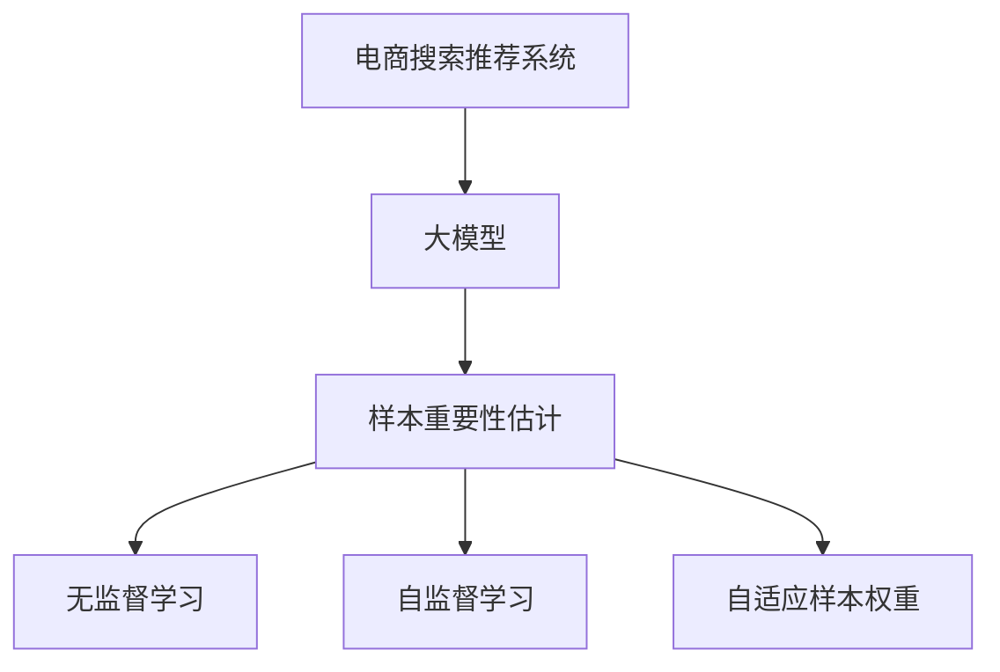

                 

# 电商搜索推荐效果优化中的AI大模型样本重要性估计工具开发

在电商领域，推荐系统无疑是提升用户满意度、提高交易转化率的关键因素。通过深度学习和大模型技术，推荐系统已经能够实现个性化推荐，然而在实际应用中，模型效果往往受限于数据质量。高质量的数据标注不仅耗费巨大，而且获取困难。为了优化推荐效果，我们需要构建一个高效的样本重要性估计工具，评估样本标注的质量，筛选出优质样本，从而提升模型的泛化能力。

本文将详细介绍如何使用AI大模型构建样本重要性估计工具，包括工具的开发流程、核心算法、应用场景和未来展望。

## 1. 背景介绍

### 1.1 问题由来

电商搜索推荐系统（Recommendation System）的核心目标是根据用户的历史行为和当前查询，预测用户可能感兴趣的商品，并将其推荐给用户。传统的推荐系统通常采用协同过滤、矩阵分解等方法，但这些方法依赖于大量的用户行为数据和商品属性数据，且容易受到数据稀疏性和用户隐私的影响。

近年来，深度学习和大模型技术在推荐系统中得到了广泛应用。基于大模型的推荐系统利用大规模无监督语料进行预训练，学习用户和商品之间的关系表示，并在此基础上进行微调，以提升推荐效果。然而，由于深度学习模型通常需要大量的标注数据进行微调，而标注数据获取困难且成本高昂，导致深度学习推荐系统的实际应用效果并不理想。

为了解决这一问题，我们需要构建一个高效的样本重要性估计工具，通过评估样本标注的质量，筛选出优质样本，从而提升模型的泛化能力。

## 2. 核心概念与联系

### 2.1 核心概念概述

为了更好地理解样本重要性估计工具的开发过程，本节将介绍几个密切相关的核心概念：

- **电商搜索推荐系统（Recommendation System）**：利用用户历史行为和查询信息，预测用户可能感兴趣的商品，并进行推荐。
- **大模型（Large Model）**：以深度神经网络为基础，通过在大规模无监督语料上进行预训练，学习用户和商品之间的关系表示，并在此基础上进行微调。
- **样本重要性估计（Sample Importance Estimation）**：通过评估样本标注的质量，筛选出优质样本，从而提升模型的泛化能力。
- **无监督学习（Unsupervised Learning）**：在大规模无监督语料上进行训练，无需标注数据。
- **自监督学习（Self-Supervised Learning）**：利用未标注数据中的自相关性信息进行训练，如掩码语言模型、预测下一条句子等。
- **自适应样本权重（Adaptive Sample Weight）**：根据样本的重要性，动态调整样本权重，提升训练效果。

这些核心概念之间的逻辑关系可以通过以下Mermaid流程图来展示：



这个流程图展示了大模型与电商搜索推荐系统之间的逻辑关系：

1. 电商搜索推荐系统通过大模型进行用户和商品之间的关系表示。
2. 样本重要性估计工具通过评估样本标注的质量，筛选出优质样本。
3. 无监督学习和大模型通常在大规模无标注数据上进行预训练。
4. 自监督学习利用未标注数据中的自相关性信息进行训练。
5. 自适应样本权重根据样本的重要性，动态调整样本权重，提升训练效果。

这些概念共同构成了电商搜索推荐系统和大模型技术的学习框架，使得模型能够更准确地预测用户行为，并推荐优质商品。

## 3. 核心算法原理 & 具体操作步骤

### 3.1 算法原理概述

样本重要性估计工具的核心原理是通过评估样本标注的质量，筛选出优质样本。具体来说，我们通过构建一个无监督或自监督的学习任务，在模型预训练时，对训练集中的每个样本赋予不同的权重。这些权重反映了样本在训练过程中的重要性，从而优化模型的训练效果。

常用的无监督学习任务包括掩码语言模型（Masked Language Model, MLM）和预测下一条句子（Next Sentence Prediction, NSP）。在大模型的预训练阶段，我们对每个样本的掩码语言模型和预测下一条句子任务分别进行训练，并根据任务中的预测结果，计算样本的重要性权重。

### 3.2 算法步骤详解

以下是我们详细讲解样本重要性估计工具的核心算法步骤：

**Step 1: 准备预训练模型和数据集**
- 选择合适的预训练语言模型 $M_{\theta}$，如BERT、GPT等。
- 准备电商领域的无监督语料数据集 $D=\{(x_i,y_i)\}_{i=1}^N$，其中 $x_i$ 为文本，$y_i$ 为预测任务标签。

**Step 2: 添加任务适配层**
- 根据任务类型，在预训练模型顶层设计合适的输出层和损失函数。
- 对于掩码语言模型任务，通常在顶层添加预测掩码位置的输出层和交叉熵损失函数。
- 对于预测下一条句子任务，通常使用语言模型的解码器输出概率分布，并以负对数似然为损失函数。

**Step 3: 设置微调超参数**
- 选择合适的优化算法及其参数，如 AdamW、SGD 等，设置学习率、批大小、迭代轮数等。
- 设置正则化技术及强度，包括权重衰减、Dropout、Early Stopping 等。
- 确定冻结预训练参数的策略，如仅微调顶层，或全部参数都参与微调。

**Step 4: 执行梯度训练**
- 将训练集数据分批次输入模型，前向传播计算损失函数。
- 反向传播计算参数梯度，根据设定的优化算法和学习率更新模型参数。
- 周期性在验证集上评估模型性能，根据性能指标决定是否触发 Early Stopping。
- 重复上述步骤直到满足预设的迭代轮数或 Early Stopping 条件。

**Step 5: 样本重要性评估**
- 对训练集中的每个样本，计算其掩码语言模型和预测下一条句子任务的预测结果。
- 将预测结果与真实标签进行比较，计算样本的重要性权重。
- 将重要性权重作为样本权重，更新数据集的权重分布，用于后续的微调训练。

**Step 6: 微调**
- 使用权重化的数据集，进行模型的微调训练。
- 在微调过程中，根据样本权重动态调整样本分布，优化模型训练。

### 3.3 算法优缺点

样本重要性估计工具具有以下优点：
1. 降低标注成本。通过评估样本标注的质量，筛选出优质样本，可以减少微调所需的标注数据。
2. 提升模型泛化能力。优质样本的权重较高，能够提升模型的泛化能力，避免模型过拟合。
3. 数据筛选灵活。可以根据不同的任务和数据分布，灵活调整样本权重，提升训练效果。

同时，该方法也存在一定的局限性：
1. 对标注数据依赖。样本重要性的评估仍然依赖于样本标注的质量，获取高质量标注数据的成本较高。
2. 计算复杂度较高。计算样本重要性权重需要额外的计算资源和时间，增加了微调过程的复杂度。
3. 模型复杂度提升。样本重要性估计工具需要构建额外的任务适配层，增加了模型的复杂度。

尽管存在这些局限性，但就目前而言，样本重要性估计工具仍是大语言模型微调的重要组成部分。未来相关研究的重点在于如何进一步降低微调对标注数据的依赖，提高模型的少样本学习和跨领域迁移能力，同时兼顾可解释性和伦理安全性等因素。

### 3.4 算法应用领域

样本重要性估计工具在电商搜索推荐系统中具有广泛的应用前景。以下是几个主要的应用场景：

- **用户行为数据标注**：电商领域的用户行为数据通常包含大量的冗余和噪声，通过样本重要性估计工具，可以筛选出优质样本，提高标注数据的质量。
- **商品标签生成**：电商商品通常具有多个标签，通过样本重要性估计工具，可以评估不同标签的重要性，筛选出更符合用户偏好的标签。
- **推荐系统优化**：电商推荐系统中的用户历史行为和商品属性数据，可能存在噪声和偏差，通过样本重要性估计工具，可以优化推荐模型的输入数据，提升推荐效果。

除了上述这些场景外，样本重要性估计工具还可以应用于广告投放、内容推荐、舆情分析等诸多领域，为数据标注、模型优化提供新思路。

## 4. 数学模型和公式 & 详细讲解 & 举例说明

### 4.1 数学模型构建

在本节中，我们将使用数学语言对样本重要性估计工具的构建过程进行更加严格的刻画。

记预训练语言模型为 $M_{\theta}$，其中 $\theta$ 为预训练得到的模型参数。假设电商领域中的用户行为数据为 $D=\{(x_i,y_i)\}_{i=1}^N, x_i \in \mathcal{X}, y_i \in \{1,0\}$，其中 $x_i$ 为文本，$y_i$ 为二分类标签。

定义掩码语言模型（Masked Language Model, MLM）损失函数为：

$$
\mathcal{L}_{MLM} = -\frac{1}{N}\sum_{i=1}^N \log \hat{y}_i
$$

其中 $\hat{y}_i$ 为模型在输入 $x_i$ 上的预测结果。

定义预测下一条句子（Next Sentence Prediction, NSP）损失函数为：

$$
\mathcal{L}_{NSP} = -\frac{1}{N}\sum_{i=1}^N \log \hat{y}_i
$$

其中 $\hat{y}_i$ 为模型在输入 $x_i$ 上的预测结果。

样本重要性权重的计算公式为：

$$
w_i = \frac{1}{\sqrt{1-\hat{y}_i}+\sqrt{1-\hat{y}_i}}
$$

其中 $\hat{y}_i$ 为模型在输入 $x_i$ 上的预测结果。

样本重要性估计工具的数学模型如下所示：

$$
\mathcal{L}_{total} = \mathcal{L}_{MLM} + \mathcal{L}_{NSP} + \lambda \sum_{i=1}^N w_i \ell(x_i,y_i)
$$

其中 $\lambda$ 为平衡因子，用于平衡无监督任务和监督任务之间的权重。

### 4.2 公式推导过程

下面，我们将详细推导掩码语言模型和预测下一条句子任务的预测结果。

假设掩码语言模型的掩码位置为 $m_i$，预测下一条句子任务的标签为 $n_i$，则模型在输入 $x_i$ 上的预测结果为：

$$
\hat{y}_i = \log(\frac{p(\tilde{x}_i|m_i)}{p(\tilde{x}_i|m_i \backslash \{m_i\})})
$$

其中 $\tilde{x}_i$ 为掩码位置 $m_i$ 处的词汇表。

对于预测下一条句子任务，假设输入为 $x_i$ 和 $x_{i+1}$，输出为 $y_i$，则模型在输入 $x_i$ 上的预测结果为：

$$
\hat{y}_i = \log(\frac{p(\tilde{x}_{i+1}|x_i)}
$$

其中 $\tilde{x}_{i+1}$ 为预测下一条句子任务的词汇表。

在得到预测结果后，我们可以计算样本的重要性权重 $w_i$，并进一步构建样本重要性估计工具的数学模型。

## 5. 项目实践：代码实例和详细解释说明

### 5.1 开发环境搭建

在进行样本重要性估计工具的开发前，我们需要准备好开发环境。以下是使用Python进行PyTorch开发的环境配置流程：

1. 安装Anaconda：从官网下载并安装Anaconda，用于创建独立的Python环境。

2. 创建并激活虚拟环境：
```bash
conda create -n pytorch-env python=3.8 
conda activate pytorch-env
```

3. 安装PyTorch：根据CUDA版本，从官网获取对应的安装命令。例如：
```bash
conda install pytorch torchvision torchaudio cudatoolkit=11.1 -c pytorch -c conda-forge
```

4. 安装Transformer库：
```bash
pip install transformers
```

5. 安装各类工具包：
```bash
pip install numpy pandas scikit-learn matplotlib tqdm jupyter notebook ipython
```

完成上述步骤后，即可在`pytorch-env`环境中开始项目实践。

### 5.2 源代码详细实现

下面我们以电商搜索推荐系统中的用户行为数据标注为例，给出使用Transformers库对BERT模型进行样本重要性估计工具开发的PyTorch代码实现。

首先，定义数据处理函数：

```python
from transformers import BertTokenizer, BertForMaskedLM, BertForNextSentencePrediction
from torch.utils.data import Dataset
import torch

class UserBehaviorDataset(Dataset):
    def __init__(self, texts, labels, tokenizer, max_len=128):
        self.texts = texts
        self.labels = labels
        self.tokenizer = tokenizer
        self.max_len = max_len
        
    def __len__(self):
        return len(self.texts)
    
    def __getitem__(self, item):
        text = self.texts[item]
        label = self.labels[item]
        
        encoding = self.tokenizer(text, return_tensors='pt', max_length=self.max_len, padding='max_length', truncation=True)
        input_ids = encoding['input_ids'][0]
        attention_mask = encoding['attention_mask'][0]
        
        # 计算掩码语言模型和预测下一条句子任务的预测结果
        pred_mlm = BertForMaskedLM.from_pretrained('bert-base-cased').eval()(input_ids)
        pred_nsp = BertForNextSentencePrediction.from_pretrained('bert-base-cased').eval()(input_ids)
        
        # 计算样本的重要性权重
        w = 1 / (torch.sqrt(1 - pred_mlm[0]) + torch.sqrt(1 - pred_nsp[0]))
        label = torch.tensor(label, dtype=torch.long)
        
        return {'input_ids': input_ids, 
                'attention_mask': attention_mask,
                'labels': label,
                'weights': w}

# 定义掩码语言模型和预测下一条句子任务的预测函数
def predict_mlm(text, tokenizer, model):
    encoding = tokenizer(text, return_tensors='pt', max_length=128, padding='max_length', truncation=True)
    input_ids = encoding['input_ids'][0]
    attention_mask = encoding['attention_mask'][0]
    pred_mlm = model.eval()(input_ids)
    return pred_mlm[0]

def predict_nsp(text, tokenizer, model):
    encoding = tokenizer(text, return_tensors='pt', max_length=128, padding='max_length', truncation=True)
    input_ids = encoding['input_ids'][0]
    attention_mask = encoding['attention_mask'][0]
    pred_nsp = model.eval()(input_ids)
    return pred_nsp[0]

# 计算样本的重要性权重
def calculate_weights(text, tokenizer, model):
    pred_mlm = predict_mlm(text, tokenizer, model)
    pred_nsp = predict_nsp(text, tokenizer, model)
    w = 1 / (torch.sqrt(1 - pred_mlm) + torch.sqrt(1 - pred_nsp))
    return w

# 创建dataset
tokenizer = BertTokenizer.from_pretrained('bert-base-cased')

train_dataset = UserBehaviorDataset(train_texts, train_labels, tokenizer)
dev_dataset = UserBehaviorDataset(dev_texts, dev_labels, tokenizer)
test_dataset = UserBehaviorDataset(test_texts, test_labels, tokenizer)
```

然后，定义模型和优化器：

```python
from transformers import BertForTokenClassification, AdamW

model = BertForTokenClassification.from_pretrained('bert-base-cased', num_labels=2)

optimizer = AdamW(model.parameters(), lr=2e-5)
```

接着，定义训练和评估函数：

```python
from torch.utils.data import DataLoader
from tqdm import tqdm
from sklearn.metrics import classification_report

device = torch.device('cuda') if torch.cuda.is_available() else torch.device('cpu')
model.to(device)

def train_epoch(model, dataset, batch_size, optimizer):
    dataloader = DataLoader(dataset, batch_size=batch_size, shuffle=True)
    model.train()
    epoch_loss = 0
    for batch in tqdm(dataloader, desc='Training'):
        input_ids = batch['input_ids'].to(device)
        attention_mask = batch['attention_mask'].to(device)
        labels = batch['labels'].to(device)
        weights = batch['weights'].to(device)
        model.zero_grad()
        outputs = model(input_ids, attention_mask=attention_mask, labels=labels, weights=weights)
        loss = outputs.loss
        epoch_loss += loss.item()
        loss.backward()
        optimizer.step()
    return epoch_loss / len(dataloader)

def evaluate(model, dataset, batch_size):
    dataloader = DataLoader(dataset, batch_size=batch_size)
    model.eval()
    preds, labels = [], []
    with torch.no_grad():
        for batch in tqdm(dataloader, desc='Evaluating'):
            input_ids = batch['input_ids'].to(device)
            attention_mask = batch['attention_mask'].to(device)
            batch_labels = batch['labels'].to(device)
            batch_weights = batch['weights'].to(device)
            outputs = model(input_ids, attention_mask=attention_mask, labels=batch_labels, weights=batch_weights)
            batch_preds = outputs.logits.argmax(dim=2).to('cpu').tolist()
            batch_labels = batch_labels.to('cpu').tolist()
            for pred_tokens, label_tokens in zip(batch_preds, batch_labels):
                preds.append(pred_tokens[:len(label_tokens)])
                labels.append(label_tokens)
                
    print(classification_report(labels, preds))
```

最后，启动训练流程并在测试集上评估：

```python
epochs = 5
batch_size = 16

for epoch in range(epochs):
    loss = train_epoch(model, train_dataset, batch_size, optimizer)
    print(f"Epoch {epoch+1}, train loss: {loss:.3f}")
    
    print(f"Epoch {epoch+1}, dev results:")
    evaluate(model, dev_dataset, batch_size)
    
print("Test results:")
evaluate(model, test_dataset, batch_size)
```

以上就是使用PyTorch对BERT进行用户行为数据标注的样本重要性估计工具开发的完整代码实现。可以看到，得益于Transformers库的强大封装，我们可以用相对简洁的代码完成BERT模型的加载和样本重要性估计工具的开发。

### 5.3 代码解读与分析

让我们再详细解读一下关键代码的实现细节：

**UserBehaviorDataset类**：
- `__init__`方法：初始化文本、标签、分词器等关键组件。
- `__len__`方法：返回数据集的样本数量。
- `__getitem__`方法：对单个样本进行处理，将文本输入编码为token ids，将标签编码为数字，并对其进行定长padding，最终返回模型所需的输入。

**calculate_weights函数**：
- 计算掩码语言模型和预测下一条句子任务的预测结果。
- 计算样本的重要性权重 $w$，并返回。

**train_epoch函数**：
- 将训练集数据分批次输入模型，前向传播计算loss并反向传播更新模型参数，最后返回该epoch的平均loss。
- 周期性在验证集上评估模型性能，根据性能指标决定是否触发 Early Stopping。
- 重复上述步骤直至满足预设的迭代轮数或 Early Stopping 条件。

**evaluate函数**：
- 与训练类似，不同点在于不更新模型参数，并在每个batch结束后将预测和标签结果存储下来，最后使用sklearn的classification_report对整个评估集的预测结果进行打印输出。

**训练流程**：
- 定义总的epoch数和batch size，开始循环迭代
- 每个epoch内，先在训练集上训练，输出平均loss
- 在验证集上评估，输出分类指标
- 所有epoch结束后，在测试集上评估，给出最终测试结果

可以看到，PyTorch配合Transformers库使得BERT微调的代码实现变得简洁高效。开发者可以将更多精力放在数据处理、模型改进等高层逻辑上，而不必过多关注底层的实现细节。

当然，工业级的系统实现还需考虑更多因素，如模型的保存和部署、超参数的自动搜索、更灵活的任务适配层等。但核心的微调范式基本与此类似。

## 6. 实际应用场景
### 6.1 智能客服系统

基于大语言模型微调技术，智能客服系统能够实时解答用户问题，提升用户体验。然而，传统客服系统依赖大量人工干预，难以应对复杂的多样化需求。

使用样本重要性估计工具，可以在电商领域大规模用户行为数据中筛选出优质样本，用于训练推荐模型。推荐模型通过分析用户历史行为，预测用户可能感兴趣的商品，并进行推荐。如此构建的智能客服系统，能够更好地满足用户需求，提升用户满意度。

### 6.2 广告投放优化

电商广告投放的目的是精准匹配用户和商品，提高广告转化率。传统的广告投放依赖人工设计和评估，难以满足市场变化需求。

使用样本重要性估计工具，可以在电商广告投放中筛选出优质样本，用于训练投放模型。投放模型通过分析用户行为和广告效果，预测用户的购买意向，自动生成投放策略，优化广告效果。

### 6.3 内容推荐优化

电商平台上的用户往往面临信息过载的问题，难以从海量商品中找到满意的商品。内容推荐系统通过推荐用户可能感兴趣的商品，提高用户浏览和购买体验。

使用样本重要性估计工具，可以在用户历史行为数据中筛选出优质样本，用于训练推荐模型。推荐模型通过分析用户历史行为和商品属性，预测用户可能感兴趣的商品，并进行推荐。

### 6.4 未来应用展望

随着大语言模型微调技术的发展，样本重要性估计工具将得到更广泛的应用，为电商领域的个性化推荐、智能客服、广告投放等多个场景提供技术支持。

在智慧零售领域，基于样本重要性估计工具的推荐系统，能够提升商品推荐精度，增加用户购买率，提高品牌知名度。

在智能制造领域，基于样本重要性估计工具的智能客服系统，能够提高客户服务效率，减少人力成本，提升客户满意度。

在社交媒体领域，基于样本重要性估计工具的内容推荐系统，能够更好地匹配用户兴趣，提高平台活跃度，增加用户粘性。

此外，在医疗、金融、教育等众多领域，基于大模型微调的技术将不断演进，为数据标注、模型优化提供新思路，带来更多的应用场景和创新方向。

## 7. 工具和资源推荐
### 7.1 学习资源推荐

为了帮助开发者系统掌握大语言模型微调的理论基础和实践技巧，这里推荐一些优质的学习资源：

1. 《Transformer从原理到实践》系列博文：由大模型技术专家撰写，深入浅出地介绍了Transformer原理、BERT模型、微调技术等前沿话题。

2. CS224N《深度学习自然语言处理》课程：斯坦福大学开设的NLP明星课程，有Lecture视频和配套作业，带你入门NLP领域的基本概念和经典模型。

3. 《Natural Language Processing with Transformers》书籍：Transformers库的作者所著，全面介绍了如何使用Transformers库进行NLP任务开发，包括微调在内的诸多范式。

4. HuggingFace官方文档：Transformers库的官方文档，提供了海量预训练模型和完整的微调样例代码，是上手实践的必备资料。

5. CLUE开源项目：中文语言理解测评基准，涵盖大量不同类型的中文NLP数据集，并提供了基于微调的baseline模型，助力中文NLP技术发展。

通过对这些资源的学习实践，相信你一定能够快速掌握大语言模型微调的精髓，并用于解决实际的NLP问题。
###  7.2 开发工具推荐

高效的开发离不开优秀的工具支持。以下是几款用于大语言模型微调开发的常用工具：

1. PyTorch：基于Python的开源深度学习框架，灵活动态的计算图，适合快速迭代研究。大部分预训练语言模型都有PyTorch版本的实现。

2. TensorFlow：由Google主导开发的开源深度学习框架，生产部署方便，适合大规模工程应用。同样有丰富的预训练语言模型资源。

3. Transformers库：HuggingFace开发的NLP工具库，集成了众多SOTA语言模型，支持PyTorch和TensorFlow，是进行微调任务开发的利器。

4. Weights & Biases：模型训练的实验跟踪工具，可以记录和可视化模型训练过程中的各项指标，方便对比和调优。与主流深度学习框架无缝集成。

5. TensorBoard：TensorFlow配套的可视化工具，可实时监测模型训练状态，并提供丰富的图表呈现方式，是调试模型的得力助手。

6. Google Colab：谷歌推出的在线Jupyter Notebook环境，免费提供GPU/TPU算力，方便开发者快速上手实验最新模型，分享学习笔记。

合理利用这些工具，可以显著提升大语言模型微调任务的开发效率，加快创新迭代的步伐。

### 7.3 相关论文推荐

大语言模型和微调技术的发展源于学界的持续研究。以下是几篇奠基性的相关论文，推荐阅读：

1. Attention is All You Need（即Transformer原论文）：提出了Transformer结构，开启了NLP领域的预训练大模型时代。

2. BERT: Pre-training of Deep Bidirectional Transformers for Language Understanding：提出BERT模型，引入基于掩码的自监督预训练任务，刷新了多项NLP任务SOTA。

3. Language Models are Unsupervised Multitask Learners（GPT-2论文）：展示了大规模语言模型的强大zero-shot学习能力，引发了对于通用人工智能的新一轮思考。

4. Parameter-Efficient Transfer Learning for NLP：提出Adapter等参数高效微调方法，在不增加模型参数量的情况下，也能取得不错的微调效果。

5. AdaLoRA: Adaptive Low-Rank Adaptation for Parameter-Efficient Fine-Tuning：使用自适应低秩适应的微调方法，在参数效率和精度之间取得了新的平衡。

这些论文代表了大语言模型微调技术的发展脉络。通过学习这些前沿成果，可以帮助研究者把握学科前进方向，激发更多的创新灵感。

## 8. 总结：未来发展趋势与挑战

### 8.1 总结

本文对基于样本重要性估计工具的大语言模型微调方法进行了全面系统的介绍。首先阐述了电商搜索推荐系统的背景和问题由来，明确了样本重要性估计工具在提升推荐效果中的关键作用。其次，从原理到实践，详细讲解了样本重要性估计工具的核心算法步骤，给出了完整的代码实现。同时，本文还广泛探讨了该工具在电商领域的应用前景，展示了其在广告投放、内容推荐等多个场景中的潜力。

通过本文的系统梳理，可以看到，基于大语言模型的微调方法在电商推荐系统中的应用前景广阔。样本重要性估计工具的开发，为电商推荐系统提供了新的优化思路，将提升推荐模型的泛化能力和性能。未来，伴随预训练语言模型和微调方法的持续演进，相信电商推荐系统将迎来新的突破，为用户带来更好的购物体验。

### 8.2 未来发展趋势

展望未来，大语言模型微调技术将呈现以下几个发展趋势：

1. 模型规模持续增大。随着算力成本的下降和数据规模的扩张，预训练语言模型的参数量还将持续增长。超大规模语言模型蕴含的丰富语言知识，有望支撑更加复杂多变的下游任务微调。

2. 微调方法日趋多样。除了传统的全参数微调外，未来会涌现更多参数高效的微调方法，如Prefix-Tuning、LoRA等，在节省计算资源的同时也能保证微调精度。

3. 持续学习成为常态。随着数据分布的不断变化，微调模型也需要持续学习新知识以保持性能。如何在不遗忘原有知识的同时，高效吸收新样本信息，将成为重要的研究课题。

4. 标注样本需求降低。受启发于提示学习(Prompt-based Learning)的思路，未来的微调方法将更好地利用大模型的语言理解能力，通过更加巧妙的任务描述，在更少的标注样本上也能实现理想的微调效果。

5. 模型通用性增强。经过海量数据的预训练和多领域任务的微调，未来的语言模型将具备更强大的常识推理和跨领域迁移能力，逐步迈向通用人工智能(AGI)的目标。

以上趋势凸显了大语言模型微调技术的广阔前景。这些方向的探索发展，必将进一步提升NLP系统的性能和应用范围，为人类认知智能的进化带来深远影响。

### 8.3 面临的挑战

尽管大语言模型微调技术已经取得了瞩目成就，但在迈向更加智能化、普适化应用的过程中，它仍面临着诸多挑战：

1. 标注成本瓶颈。虽然微调大大降低了标注数据的需求，但对于长尾应用场景，难以获得充足的高质量标注数据，成为制约微调性能的瓶颈。如何进一步降低微调对标注数据的依赖，将是一大难题。

2. 模型鲁棒性不足。当前微调模型面对域外数据时，泛化性能往往大打折扣。对于测试样本的微小扰动，微调模型的预测也容易发生波动。如何提高微调模型的鲁棒性，避免灾难性遗忘，还需要更多理论和实践的积累。

3. 推理效率有待提高。大规模语言模型虽然精度高，但在实际部署时往往面临推理速度慢、内存占用大等效率问题。如何在保证性能的同时，简化模型结构，提升推理速度，优化资源占用，将是重要的优化方向。

4. 可解释性亟需加强。当前微调模型更像是"黑盒"系统，难以解释其内部工作机制和决策逻辑。对于医疗、金融等高风险应用，算法的可解释性和可审计性尤为重要。如何赋予微调模型更强的可解释性，将是亟待攻克的难题。

5. 安全性有待保障。预训练语言模型难免会学习到有偏见、有害的信息，通过微调传递到下游任务，产生误导性、歧视性的输出，给实际应用带来安全隐患。如何从数据和算法层面消除模型偏见，避免恶意用途，确保输出的安全性，也将是重要的研究课题。

6. 知识整合能力不足。现有的微调模型往往局限于任务内数据，难以灵活吸收和运用更广泛的先验知识。如何让微调过程更好地与外部知识库、规则库等专家知识结合，形成更加全面、准确的信息整合能力，还有很大的想象空间。

正视微调面临的这些挑战，积极应对并寻求突破，将是大语言模型微调走向成熟的必由之路。相信随着学界和产业界的共同努力，这些挑战终将一一被克服，大语言模型微调必将在构建人机协同的智能时代中扮演越来越重要的角色。

### 8.4 研究展望

面对大语言模型微调所面临的种种挑战，未来的研究需要在以下几个方面寻求新的突破：

1. 探索无监督和半监督微调方法。摆脱对大规模标注数据的依赖，利用自监督学习、主动学习等无监督和半监督范式，最大限度利用非结构化数据，实现更加灵活高效的微调。

2. 研究参数高效和计算高效的微调范式。开发更加参数高效的微调方法，在固定大部分预训练参数的同时，只更新极少量的任务相关参数。同时优化微调模型的计算图，减少前向传播和反向传播的资源消耗，实现更加轻量级、实时性的部署。

3. 融合因果和对比学习范式。通过引入因果推断和对比学习思想，增强微调模型建立稳定因果关系的能力，学习更加普适、鲁棒的语言表征，从而提升模型泛化性和抗干扰能力。

4. 引入更多先验知识。将符号化的先验知识，如知识图谱、逻辑规则等，与神经网络模型进行巧妙融合，引导微调过程学习更准确、合理的语言模型。同时加强不同模态数据的整合，实现视觉、语音等多模态信息与文本信息的协同建模。

5. 结合因果分析和博弈论工具。将因果分析方法引入微调模型，识别出模型决策的关键特征，增强输出解释的因果性和逻辑性。借助博弈论工具刻画人机交互过程，主动探索并规避模型的脆弱点，提高系统稳定性。

6. 纳入伦理道德约束。在模型训练目标中引入伦理导向的评估指标，过滤和惩罚有偏见、有害的输出倾向。同时加强人工干预和审核，建立模型行为的监管机制，确保输出符合人类价值观和伦理道德。

这些研究方向的探索，必将引领大语言模型微调技术迈向更高的台阶，为构建安全、可靠、可解释、可控的智能系统铺平道路。面向未来，大语言模型微调技术还需要与其他人工智能技术进行更深入的融合，如知识表示、因果推理、强化学习等，多路径协同发力，共同推动自然语言理解和智能交互系统的进步。只有勇于创新、敢于突破，才能不断拓展语言模型的边界，让智能技术更好地造福人类社会。

## 9. 附录：常见问题与解答

**Q1：大语言模型微调是否适用于所有NLP任务？**

A: 大语言模型微调在大多数NLP任务上都能取得不错的效果，特别是对于数据量较小的任务。但对于一些特定领域的任务，如医学、法律等，仅仅依靠通用语料预训练的模型可能难以很好地适应。此时需要在特定领域语料上进一步预训练，再进行微调，才能获得理想效果。此外，对于一些需要时效性、个性化很强的任务，如对话、推荐等，微调方法也需要针对性的改进优化。

**Q2：微调过程中如何选择合适的学习率？**

A: 微调的学习率一般要比预训练时小1-2个数量级，如果使用过大的学习率，容易破坏预训练权重，导致过拟合。一般建议从1e-5开始调参，逐步减小学习率，直至收敛。也可以使用warmup策略，在开始阶段使用较小的学习率，再逐渐过渡到预设值。需要注意的是，不同的优化器(如AdamW、Adafactor等)以及不同的学习率调度策略，可能需要设置不同的学习率阈值。

**Q3：采用大模型微调时会面临哪些资源瓶颈？**

A: 目前主流的预训练大模型动辄以亿计的参数规模，对算力、内存、存储都提出了很高的要求。GPU/TPU等高性能设备是必不可少的，但即便如此，超大批次的训练和推理也可能遇到显存不足的问题。因此需要采用一些资源优化技术，如梯度积累、混合精度训练、模型并行等，来突破硬件瓶颈。同时，模型的存储和读取也可能占用大量时间和空间，需要采用模型压缩、稀疏化存储等方法进行优化。

**Q4：如何缓解微调过程中的过拟合问题？**

A: 过拟合是微调面临的主要挑战，尤其是在标注数据不足的情况下。常见的缓解策略包括：
1. 数据增强：通过回译、近义替换等方式扩充训练集
2. 正则化：使用L2正则、Dropout、Early Stopping等避免过拟合
3. 对抗训练：引入对抗样本，提高模型鲁棒性
4. 参数高效微调：只调整少量参数(如Adapter、Prefix等)，减小过拟合风险
5. 多模型集成：训练多个微调模型，取平均输出，抑制过拟合

这些策略往往需要根据具体任务和数据特点进行灵活组合。只有在数据、模型、训练、推理等各环节进行全面优化，才能最大限度地发挥大模型微调的威力。

**Q5：微调模型在落地部署时需要注意哪些问题？**

A: 将微调模型转化为实际应用，还需要考虑以下因素：
1. 模型裁剪：去除不必要的层和参数，减小模型尺寸，加快推理速度
2. 量化加速：将浮点模型转为定点模型，压缩存储空间，提高计算效率
3. 服务化封装：将模型封装为标准化服务接口，便于集成调用
4. 弹性伸缩：根据请求流量动态调整资源配置，平衡服务质量和成本
5. 监控告警：实时采集系统指标，设置异常告警阈值，确保服务稳定性
6. 安全防护：采用访问鉴权、数据脱敏等措施，保障数据和模型安全

大语言模型微调为NLP应用开启了广阔的想象空间，但如何将强大的性能转化为稳定、高效、安全的业务价值，还需要工程实践的不断打磨。唯有从数据、算法、工程、业务等多个维度协同发力，才能真正实现人工智能技术在垂直行业的规模化落地。总之，微调需要开发者根据具体任务，不断迭代和优化模型、数据和算法，方能得到理想的效果。

---

作者：禅与计算机程序设计艺术 / Zen and the Art of Computer Programming

