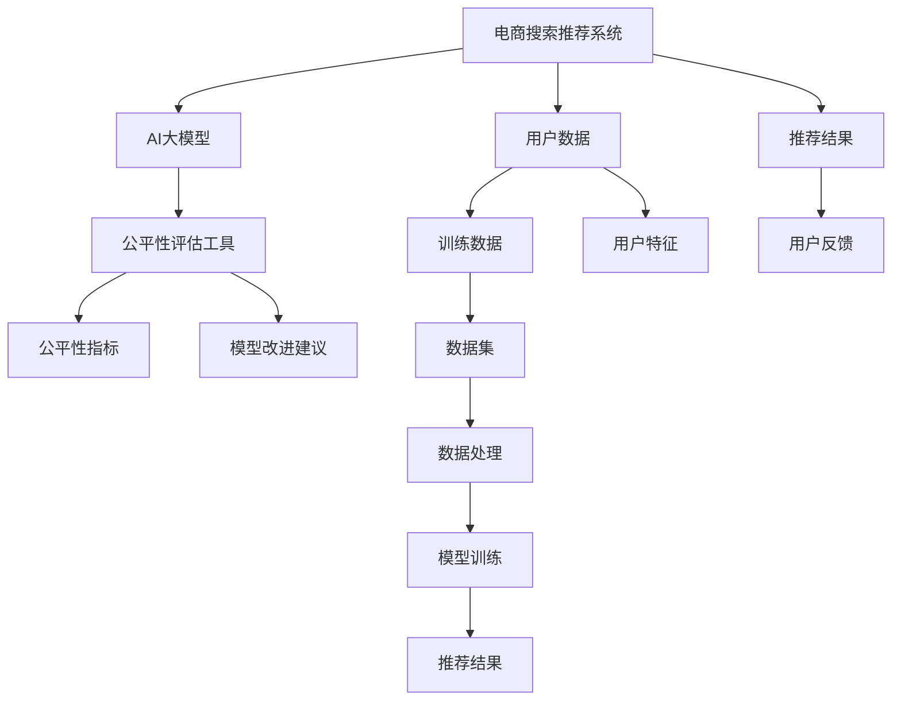

                 

# 电商搜索推荐效果评估中的AI大模型公平性评估工具选型

## 1. 背景介绍

近年来，人工智能在电商搜索推荐系统中的应用越来越广泛。通过深度学习模型，电商系统能够精准预测用户行为，提供个性化推荐，极大地提升了用户体验和商家转化率。然而，这些推荐模型通常依赖大量的用户数据进行训练，同时也存在一定的数据偏差问题。为了保障模型的公平性，需要对模型进行评估和测试，确保其在不同用户群体间不会产生歧视。

本文旨在探讨电商搜索推荐效果评估中的AI大模型公平性评估工具的选型问题，通过对当前主流工具的分析和比较，帮助电商开发者选择合适的评估方法，保证模型输出的公平性，同时优化搜索推荐系统的整体性能。

## 2. 核心概念与联系

### 2.1 核心概念概述

在进行AI大模型公平性评估时，需要了解几个关键概念：

- **公平性（Fairness）**：指的是模型在处理不同群体的数据时，不产生歧视和不公正的行为。在电商搜索推荐中，模型公平性要求推荐系统能够公平地对待所有用户，避免对某些用户群体的偏见。

- **算法偏见（Algorithmic Bias）**：指模型在训练过程中，由于训练数据的不平衡或者模型自身的缺陷，导致对某些群体产生歧视。在电商推荐中，算法偏见可能导致对某些商品类别、用户的推荐数量不足或者推荐的商品质量低下。

- **公平性评估工具（Fairness Assessment Tools）**：是用来评估AI模型在处理不同群体数据时是否公平的工具。这些工具可以检测模型偏见、分析模型输出，并给出改进建议。

### 2.2 核心概念原理和架构的 Mermaid 流程图



该图展示了电商搜索推荐系统中AI大模型公平性评估的流程。用户数据和推荐结果通过数据处理、模型训练等步骤，最终生成推荐结果。公平性评估工具会对推荐结果进行评估，检测模型公平性指标，给出改进建议。

## 3. 核心算法原理 & 具体操作步骤

### 3.1 算法原理概述

AI大模型公平性评估的核心原理是检测模型在处理不同群体数据时的行为差异。具体步骤包括：

1. **数据收集**：收集电商平台的用户数据，包括人口统计学特征（如年龄、性别、地区等）和购买行为数据。

2. **数据预处理**：对数据进行清洗、归一化等处理，确保数据的一致性和可分析性。

3. **模型训练与评估**：使用电商搜索推荐系统中的AI大模型进行训练和评估，检测模型是否产生不公平的行为。

4. **公平性指标检测**：使用公平性评估工具检测模型的公平性指标，如预测偏差、差异性等。

5. **模型改进**：根据评估结果，调整模型参数或使用公平性正则化技术，改善模型公平性。

6. **公平性验证**：再次使用公平性评估工具验证模型的改进效果，确保模型公平性。

### 3.2 算法步骤详解

以下是基于公平性评估工具的具体操作步骤：

**Step 1: 数据收集与预处理**
- 收集电商平台的交易数据、用户数据、商品数据等，提取用户的人口统计学特征和购买行为特征。
- 对数据进行清洗和归一化，如去除缺失值、处理异常值等。

**Step 2: 模型训练**
- 使用AI大模型对预处理后的数据进行训练，生成推荐模型。

**Step 3: 模型评估**
- 使用公平性评估工具对推荐模型的输出进行评估，检测模型是否对某些用户群体产生歧视。

**Step 4: 公平性指标检测**
- 通过公平性评估工具检测模型的公平性指标，如预测偏差、差异性、特征重要性等。

**Step 5: 模型改进**
- 根据评估结果，调整模型参数或引入公平性正则化技术，如公平性损失函数、公平性约束等，改善模型公平性。

**Step 6: 公平性验证**
- 再次使用公平性评估工具验证改进后的模型，确保模型公平性。

### 3.3 算法优缺点

基于公平性评估工具的AI大模型公平性评估具有以下优点：

1. **客观性**：公平性评估工具可以自动化地检测模型公平性，减少人为因素的干扰，提供客观的评估结果。
2. **全面性**：这些工具可以检测多种公平性指标，如预测偏差、差异性、特征重要性等，全面评估模型的公平性。
3. **可操作性**：提供改进建议，帮助模型开发者优化模型，改善模型公平性。

同时，这些工具也存在以下缺点：

1. **复杂性**：公平性评估工具通常比较复杂，需要一定的技术背景和知识储备。
2. **依赖数据质量**：模型的公平性检测依赖于数据的质量和数量，数据偏差会导致评估结果不准确。
3. **模型兼容性**：不同的公平性评估工具可能对不同的模型有更好的支持，需要根据具体情况选择。

### 3.4 算法应用领域

基于公平性评估工具的AI大模型公平性评估在电商搜索推荐系统中有着广泛的应用，例如：

- **用户推荐公平性**：检测模型是否对不同用户群体产生推荐偏差，确保每个用户都能获得公平的推荐服务。
- **商品推荐公平性**：检测模型是否对不同商品类别产生推荐偏差，确保商品类别的平衡性。
- **广告推荐公平性**：检测模型是否对不同广告主产生推荐偏差，确保广告主公平竞争。
- **市场公平性**：检测模型是否对不同市场区域产生推荐偏差，确保市场的公平性。

这些应用场景要求电商搜索推荐系统中的AI大模型具有高公平性，以避免对某些用户、商品、广告主或市场的歧视。

## 4. 数学模型和公式 & 详细讲解 & 举例说明

### 4.1 数学模型构建

公平性评估工具通常使用以下数学模型来检测模型的公平性：

- **预测偏差（Prediction Bias）**：检测模型对不同群体的预测结果是否存在显著差异。
- **差异性（Disparity）**：检测模型在不同群体之间的推荐结果是否存在显著差异。
- **特征重要性（Feature Importance）**：检测模型在不同特征对推荐结果的影响是否公平。

这些模型通常基于统计学和机器学习的原理，通过比较不同群体之间的预测结果、推荐结果等指标，来检测模型的公平性。

### 4.2 公式推导过程

以预测偏差为例，公式推导如下：

假设模型对群体A和B的预测结果分别为 $\hat{y}_A$ 和 $\hat{y}_B$，分别计算群体A和B的平均预测结果 $\mu_A$ 和 $\mu_B$，则预测偏差 $Bias$ 可以表示为：

$$
Bias = |\mu_A - \mu_B|
$$

类似地，差异性 $Disparity$ 可以表示为：

$$
Disparity = |\mu_A - \mu_B|
$$

特征重要性 $FeatureImportance$ 可以通过计算不同特征对预测结果的贡献度来得到：

$$
FeatureImportance = \frac{\sum_i |\frac{\partial \hat{y}}{\partial x_i}|}{\sum_i |\frac{\partial \hat{y}}{\partial x_i}|}
$$

### 4.3 案例分析与讲解

假设电商平台的推荐系统使用大模型对用户进行推荐，模型对男性用户的推荐数量比女性用户多20%，导致女性用户的使用体验较差。使用公平性评估工具检测到预测偏差后，模型开发者可以调整模型参数或引入公平性正则化技术，如公平性损失函数等，以改善模型的公平性。

## 5. 项目实践：代码实例和详细解释说明

### 5.1 开发环境搭建

在进行公平性评估的代码实现前，需要准备好开发环境。以下是Python和R等语言常用的开发环境配置：

- **Python**：
  - 安装Anaconda：
  ```bash
  conda create -n py-env python=3.8
  conda activate py-env
  ```
  - 安装必要的库：
  ```bash
  pip install numpy pandas scikit-learn
  ```

- **R**：
  - 安装RStudio：
  - 安装必要的包：
  ```r
  install.packages("tidyverse")
  install.packages("fairness")
  ```

### 5.2 源代码详细实现

以下是Python和R等语言实现公平性评估的代码示例：

#### Python代码示例：

```python
import pandas as pd
from sklearn.metrics import mean_absolute_error
from fairness import fairness_indicators

# 读取数据
df = pd.read_csv('data.csv')

# 计算预测偏差和差异性
y_hat = model.predict(df)
y_true = df['target']
bias = fairness_indicators.PredictionBias(y_hat, y_true, by='user')
disparity = fairness_indicators.Difference(y_hat, y_true, by='user')

# 计算特征重要性
feature_importance = fairness_indicators.FeatureImportance(model, X, target='user')

# 输出评估结果
print(f'Prediction Bias: {bias:.2f}')
print(f'Disparity: {disparity:.2f}')
print(f'Feature Importance: {feature_importance:.2f}')
```

#### R代码示例：

```r
library(fairness)
library(tidyverse)

# 读取数据
df <- read.csv('data.csv')

# 计算预测偏差和差异性
y_hat <- predict(model, df)
y_true <- df$target
bias <- fairness_indicators::PredictionBias(y_hat, y_true, by = 'user')
disparity <- fairness_indicators::Difference(y_hat, y_true, by = 'user')

# 计算特征重要性
feature_importance <- fairness_indicators::FeatureImportance(model, df, target = 'user')

# 输出评估结果
print(f'Prediction Bias: {bias:.2f}')
print(f'Disparity: {disparity:.2f}')
print(f'Feature Importance: {feature_importance:.2f}')
```

### 5.3 代码解读与分析

以上代码示例展示了使用Python和R语言实现公平性评估的常见方法。具体来说，代码通过调用公平性评估工具的函数，计算预测偏差、差异性和特征重要性，并输出评估结果。

在实际应用中，还需要对数据进行预处理，选择合适的评估指标，并根据评估结果调整模型参数，以改善模型的公平性。

### 5.4 运行结果展示

运行上述代码示例后，会得到模型的预测偏差、差异性和特征重要性的数值结果。这些结果可以帮助开发者检测模型的公平性，并指导后续的模型优化。

## 6. 实际应用场景

### 6.1 用户推荐公平性

电商平台的用户推荐系统需要保证对所有用户群体的推荐公平。通过公平性评估工具，可以检测模型是否对某些用户群体产生推荐偏差，确保每个用户都能获得公平的推荐服务。

### 6.2 商品推荐公平性

电商平台中不同商品类别的商品推荐需要平衡，避免某些商品类别被推荐过多或过少。通过公平性评估工具，可以检测模型是否对不同商品类别产生推荐偏差，确保商品类别的平衡性。

### 6.3 广告推荐公平性

电商平台中的广告推荐系统需要保证对不同广告主公平。通过公平性评估工具，可以检测模型是否对不同广告主产生推荐偏差，确保广告主公平竞争。

### 6.4 市场公平性

电商平台中的市场推荐系统需要保证对不同市场区域公平。通过公平性评估工具，可以检测模型是否对不同市场区域产生推荐偏差，确保市场的公平性。

## 7. 工具和资源推荐

### 7.1 学习资源推荐

为了帮助开发者系统掌握AI大模型公平性评估的理论基础和实践技巧，这里推荐一些优质的学习资源：

1. **《公平性评估：原理与实践》**：该书详细介绍了公平性评估的基本原理和应用方法，适合技术开发者学习。
2. **Fairness Indicators官网**：该网站提供了多种公平性评估工具的文档和示例代码，适合实践开发者学习。
3. **AI公平性课程**：各大在线学习平台上的AI公平性课程，适合初学者入门。

### 7.2 开发工具推荐

进行公平性评估的代码实现时，可以选用以下开发工具：

1. **Python**：
  - Jupyter Notebook：支持Python代码的交互式开发和展示。
  - TensorFlow：支持大规模深度学习模型的训练和评估。

2. **R**：
  - RStudio：支持R语言的数据分析和可视化。
  - caret：支持机器学习的模型训练和评估。

### 7.3 相关论文推荐

公平性评估工具的研究方向不断拓展，以下是几篇代表性论文，推荐阅读：

1. **"Fairness Indicators: A Model-agnostic Framework for Fairness Assessment and Model Improvement"**：该论文提出了一个模型无关的公平性评估框架，用于检测和改进机器学习模型的公平性。
2. **"Data Fairness: A Study of Statistical Disparity"**：该论文探讨了统计学和公平性之间的关系，为公平性评估提供了理论基础。
3. **"Algorithmic Fairness for Search Ads"**：该论文探讨了广告推荐系统中的公平性问题，提出了多种公平性检测和改进方法。

## 8. 总结：未来发展趋势与挑战

### 8.1 研究成果总结

本文对基于公平性评估工具的AI大模型公平性评估进行了详细探讨。通过对比和分析当前主流工具，明确了不同工具的适用场景和优缺点，为电商搜索推荐系统的开发者提供了评估和优化模型公平性的参考。

### 8.2 未来发展趋势

未来，AI大模型公平性评估工具将继续向以下几个方向发展：

1. **模型无关性**：未来的公平性评估工具将更加模型无关，支持多种机器学习模型的公平性检测。
2. **自动化检测**：通过自动化工具和算法，减少人工干预，提升公平性评估的效率和准确性。
3. **跨领域应用**：公平性评估工具将拓展到更多领域，如医疗、金融、交通等，为更多领域提供公平性检测服务。

### 8.3 面临的挑战

尽管AI大模型公平性评估工具取得了一定的进展，但在实际应用中仍面临以下挑战：

1. **数据偏见**：模型的公平性检测依赖于数据的质量和数量，数据偏差会导致评估结果不准确。
2. **模型复杂性**：复杂的模型往往难以检测和改善公平性，需要结合领域知识进行优化。
3. **资源消耗**：公平性评估工具通常需要较高的计算资源，如何优化资源消耗是一个重要问题。

### 8.4 研究展望

为了应对这些挑战，未来的研究需要在以下几个方面进行突破：

1. **数据清洗和处理**：开发更多数据清洗和处理工具，减少数据偏差的影响。
2. **模型优化和改进**：结合领域知识，开发更多公平性优化方法，提升模型的公平性。
3. **资源优化**：优化公平性评估工具的计算图，减少资源消耗，提升评估效率。

通过这些研究方向的探索和发展，未来的AI大模型公平性评估工具将更加全面、高效、可靠，为电商搜索推荐系统提供有力的支持。

## 9. 附录：常见问题与解答

**Q1: 如何选择合适的公平性评估工具？**

A: 选择合适的公平性评估工具需要考虑以下几个方面：
1. 工具的适用场景：不同的工具可能适用于不同领域和任务。
2. 工具的精度和准确性：评估结果的精度和准确性直接影响模型的优化效果。
3. 工具的易用性和可扩展性：工具的使用难度和扩展能力也是选择工具的重要因素。

**Q2: 如何检测和改善模型的公平性？**

A: 检测和改善模型的公平性需要以下步骤：
1. 数据预处理：对数据进行清洗、归一化等处理，确保数据的一致性和可分析性。
2. 公平性评估：使用公平性评估工具检测模型的公平性指标，如预测偏差、差异性等。
3. 模型调整：根据评估结果，调整模型参数或引入公平性正则化技术，改善模型公平性。
4. 公平性验证：再次使用公平性评估工具验证改进后的模型，确保模型公平性。

**Q3: 公平性评估工具如何检测预测偏差？**

A: 公平性评估工具通常使用以下步骤检测预测偏差：
1. 数据分割：将数据分为训练集和测试集。
2. 模型训练：使用模型对训练集进行训练，生成预测结果。
3. 预测偏差计算：计算不同群体之间的预测结果差异，检测预测偏差。

**Q4: 如何优化公平性评估工具的计算资源消耗？**

A: 优化公平性评估工具的计算资源消耗需要以下措施：
1. 模型剪枝：去除不必要的层和参数，减小模型尺寸。
2. 量化加速：将浮点模型转为定点模型，压缩存储空间。
3. 分布式计算：使用分布式计算框架，并行计算，减少资源消耗。

通过不断探索和优化，公平性评估工具将更加高效、可靠，为电商搜索推荐系统提供有力的支持。

