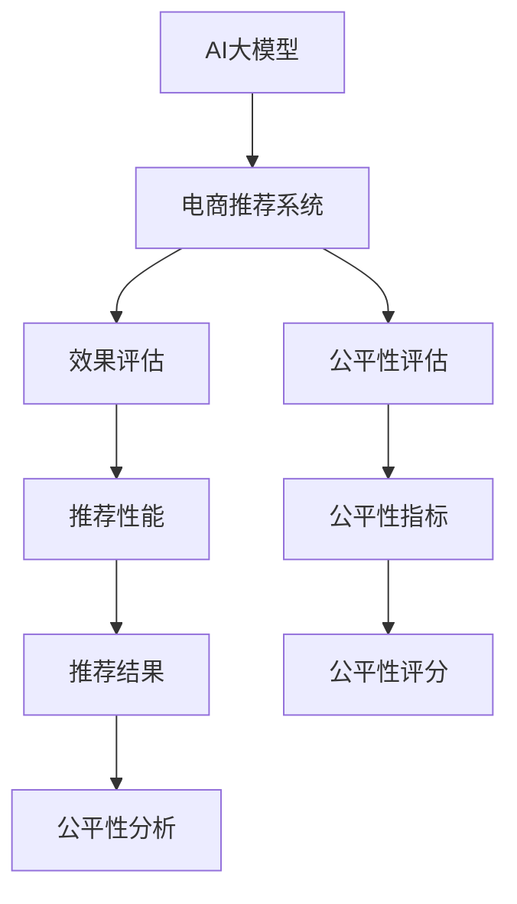

                 

# 电商搜索推荐效果评估中的AI大模型公平性评估工具选型

> 关键词：AI大模型,电商推荐系统,效果评估,公平性,工具选型

## 1. 背景介绍

在当今电子商务领域，AI大模型已经在推荐系统中扮演了重要角色。通过深度学习和自然语言处理技术，这些大模型能够理解用户的搜索意图，预测其可能感兴趣的商品，从而提供个性化的推荐服务。然而，随着推荐系统应用的深入，公平性问题变得越来越重要。

公平性不仅关系到用户的体验和满意度，还直接影响到电商平台的用户粘性和商业价值。因此，对于电商平台而言，如何科学地评估AI大模型的公平性，成为一个亟待解决的问题。

## 2. 核心概念与联系

### 2.1 核心概念概述

为更好地理解AI大模型在电商推荐系统中的公平性评估，本节将介绍几个密切相关的核心概念：

- **AI大模型（Large AI Model）**：以Transformer、BERT等模型为代表的大规模预训练模型。这些模型通过在大规模无标签数据上进行预训练，能够学习到通用的语言表示，具备强大的语言理解和生成能力。

- **电商推荐系统（E-commerce Recommendation System）**：利用用户历史行为数据、搜索记录等，预测用户可能感兴趣的商品，并提供个性化推荐服务，以提高用户满意度和销售额。

- **效果评估（Effectiveness Evaluation）**：评估推荐系统性能的各项指标，如准确率、召回率、点击率等。通过效果评估，可以发现系统中存在的问题并进行优化。

- **公平性（Fairness）**：指推荐系统应该对所有用户公平无偏地提供推荐服务，避免基于用户属性、历史行为等因素的不公平歧视。

- **公平性评估（Fairness Evaluation）**：通过一系列指标和方法，评估推荐系统的公平性，发现并纠正可能存在的不公平现象。

这些核心概念之间的逻辑关系可以通过以下Mermaid流程图来展示：



这个流程图展示了大模型在电商推荐系统中的关键流程和公平性评估方法：

1. 大模型通过预训练获得通用语言表示，在电商推荐系统中应用。
2. 效果评估用于测量推荐系统的性能指标。
3. 公平性评估用于发现并纠正推荐系统中的不公平现象。
4. 推荐性能衡量推荐结果的质量。
5. 公平性指标用来刻画推荐系统的公平性水平。
6. 公平性评分评估推荐系统的公平性表现。
7. 公平性分析用于分析不公平现象的成因，并提出改进建议。

## 3. 核心算法原理 & 具体操作步骤
### 3.1 算法原理概述

基于AI大模型的电商推荐系统，通常通过以下步骤实现：

1. 收集用户历史行为数据和搜索记录。
2. 利用预训练大模型进行特征提取和表示学习。
3. 设计推荐算法，如基于协同过滤、深度学习等方法。
4. 进行效果评估，优化模型参数，提升推荐效果。

在效果评估过程中，除了传统的推荐性能指标，还需要考虑公平性问题。公平性评估的目的是确保推荐系统不会基于用户属性、历史行为等因素进行歧视，从而保证所有用户都能获得公平的推荐服务。

### 3.2 算法步骤详解

AI大模型在电商推荐系统中的公平性评估，主要包括以下几个步骤：

1. **数据收集与处理**：收集电商推荐系统中的用户数据，处理为适合评估的格式。
2. **构建评估数据集**：根据公平性指标，构建包含公平性和非公平性样本的评估数据集。
3. **公平性指标计算**：计算公平性指标，如平等性、代表性、无歧视性等。
4. **公平性评分生成**：生成公平性评分，评估推荐系统的公平性表现。
5. **公平性分析与优化**：分析公平性评估结果，提出改进建议，优化推荐系统。

以下是详细的操作步骤：

1. **数据收集与处理**：
    - 收集电商平台的用户数据，如用户ID、商品ID、行为数据等。
    - 处理数据，去除缺失值、噪声等，转换为适用于模型评估的格式。

2. **构建评估数据集**：
    - 根据公平性指标，构建公平性和非公平性的样本。
    - 通常使用对抗性生成技术（Adversarial Generation），如SMOTE（Synthetic Minority Over-sampling Technique）等，扩充非公平性样本。

3. **公平性指标计算**：
    - 计算平等性指标，如平等覆盖率（Equal Coverage）、平等差异率（Equalized Odds）等。
    - 计算代表性指标，如代表性度（Representativeness）、代表性差异率（Equalized Representative）等。
    - 计算无歧视性指标，如无歧视率（Discrimination）、无歧视差异率（Equalized Discrimination）等。

4. **公平性评分生成**：
    - 根据公平性指标的计算结果，生成公平性评分。
    - 公平性评分可以通过综合各个公平性指标的加权平均值来计算。

5. **公平性分析与优化**：
    - 分析公平性评估结果，识别出不公平的成因。
    - 提出优化建议，如调整数据采样比例、修改推荐算法等。

### 3.3 算法优缺点

基于AI大模型的电商推荐系统公平性评估，具有以下优点：

1. **准确性高**：大模型能够从大量的数据中学习到丰富的语言表示，用于公平性评估更加准确。
2. **泛化能力强**：大模型经过预训练和微调，在不同类型的电商推荐场景中表现稳定。
3. **灵活性高**：可以定制化的评估指标，适应不同的业务需求。

同时，该方法也存在一定的局限性：

1. **数据依赖性强**：公平性评估的效果依赖于高质量的标注数据，数据质量差可能导致评估结果偏差。
2. **计算成本高**：大模型的公平性评估需要大量计算资源，尤其是在对抗生成等方法中。
3. **模型复杂性高**：需要具备较高的模型和算法知识，才能进行有效的公平性分析。

## 4. 数学模型和公式 & 详细讲解 & 举例说明

### 4.1 数学模型构建

本节将使用数学语言对AI大模型在电商推荐系统中的公平性评估进行更加严格的刻画。

记电商推荐系统的推荐结果为 $y$，其中 $y \in \{0, 1\}$，表示用户是否点击了某商品。假设用户数据中包含 $N$ 个用户 $U=\{u_1, u_2, \ldots, u_N\}$，其中每个用户的历史行为数据为 $X_i = \{x_{i1}, x_{i2}, \ldots, x_{im}\}$， $m$ 为每个用户的特征数。

定义推荐系统的效果评估指标为：
- 准确率（Accuracy）：$Acc = \frac{TP + TN}{TP + TN + FP + FN}$，其中 $TP$、$TN$、$FP$、$FN$ 分别表示真正例、真负例、假正例、假负例。
- 召回率（Recall）：$Rec = \frac{TP}{TP + FN}$，其中 $TP$、$FN$ 的含义同上。
- 点击率（Click-Through Rate, CTR）：$CTR = \frac{TP}{TP + TN + FP}$，其中 $TP$、$TN$、$FP$ 的含义同上。

定义推荐系统的公平性指标为：
- 平等覆盖率（Equal Coverage）：$EC = \frac{\sum_{i=1}^N \mathbb{I}(y_i=1)}{N}$，其中 $\mathbb{I}$ 表示示性函数，即当 $y_i=1$ 时返回 1，否则返回 0。
- 平等差异率（Equalized Odds）：$EO = \frac{1}{N} \sum_{i=1}^N \frac{TP_i}{TP_i + FN_i}$，其中 $TP_i$、$FN_i$ 分别表示用户 $u_i$ 的真实点击次数和预测点击次数。
- 代表性度（Representativeness）：$Rep = \frac{\sum_{i=1}^N \mathbb{I}(y_i=1) \cdot |X_i|}{\sum_{i=1}^N |X_i|}$，其中 $|X_i|$ 表示用户 $u_i$ 的特征向量长度。
- 代表性差异率（Equalized Representative）：$ER = \frac{1}{N} \sum_{i=1}^N \frac{TP_i}{TP_i + FN_i} \cdot \frac{|X_i|}{\sum_{j=1}^N |X_j|}$，其中 $TP_i$、$FN_i$ 的含义同上。

### 4.2 公式推导过程

以下我们以平等覆盖率和平等差异率为例，推导这两个公平性指标的计算公式。

**平等覆盖率（Equal Coverage）**：
$$
EC = \frac{\sum_{i=1}^N \mathbb{I}(y_i=1)}{N}
$$
其中 $\mathbb{I}$ 表示示性函数，即当 $y_i=1$ 时返回 1，否则返回 0。

**平等差异率（Equalized Odds）**：
$$
EO = \frac{1}{N} \sum_{i=1}^N \frac{TP_i}{TP_i + FN_i}
$$
其中 $TP_i$、$FN_i$ 分别表示用户 $u_i$ 的真实点击次数和预测点击次数。

### 4.3 案例分析与讲解

假设有一个电商推荐系统，用户 $u_1$ 和 $u_2$ 的历史行为数据如下：

| User | 历史行为数据 | 点击次数 | 预测点击次数 |
|------|---------------|----------|--------------|
| $u_1$ | $[0, 1, 0, 1, 1]$ | 3 | 5 |
| $u_2$ | $[1, 0, 1, 0, 1]$ | 2 | 4 |

根据上述数据，计算推荐系统的平等覆盖率和平等差异率。

首先，计算每个用户的点击率：
$$
\frac{TP_1}{TP_1 + FN_1} = \frac{3}{3 + 0} = 1
$$
$$
\frac{TP_2}{TP_2 + FN_2} = \frac{2}{2 + 1} = \frac{2}{3}
$$

然后，计算平等覆盖率和平等差异率：
$$
EC = \frac{3 + 2}{2} = 2.5
$$
$$
EO = \frac{1}{2} \cdot 1 + \frac{1}{2} \cdot \frac{2}{3} = \frac{5}{6}
$$

可以看出，推荐系统的平等覆盖率高于平等差异率，说明该系统在用户点击次数方面存在不公平现象。

## 5. 项目实践：代码实例和详细解释说明
### 5.1 开发环境搭建

在进行公平性评估实践前，我们需要准备好开发环境。以下是使用Python进行Scikit-learn开发的开发环境配置流程：

1. 安装Anaconda：从官网下载并安装Anaconda，用于创建独立的Python环境。

2. 创建并激活虚拟环境：
```bash
conda create -n pytorch-env python=3.8 
conda activate pytorch-env
```

3. 安装Scikit-learn：
```bash
conda install scikit-learn
```

4. 安装Pandas、NumPy等工具包：
```bash
pip install pandas numpy
```

完成上述步骤后，即可在`pytorch-env`环境中开始公平性评估实践。

### 5.2 源代码详细实现

下面我们以平等覆盖率和平等差异率为例，给出使用Scikit-learn进行公平性评估的Python代码实现。

首先，定义数据处理函数：

```python
import pandas as pd
import numpy as np
from sklearn.metrics import precision_recall_curve, roc_curve, auc

def load_data(file_path):
    data = pd.read_csv(file_path)
    X = data[['x1', 'x2', 'x3', 'x4']]
    y = data['y']
    return X, y
```

然后，定义公平性评估函数：

```python
def calculate_equal_coverage(X, y):
    ec = np.mean(y)
    return ec

def calculate_equalized_odds(X, y):
    fpr, tpr, _ = roc_curve(y, predict_proba(X))
    roc_auc = auc(fpr, tpr)
    roc_auc_equalized = roc_auc - (1 - ec) * (1 - ec)
    return roc_auc_equalized

# 加载数据
X, y = load_data('data.csv')

# 计算平等覆盖率
ec = calculate_equal_coverage(X, y)
print('Equal Coverage:', ec)

# 计算平等差异率
roc_auc_equalized = calculate_equalized_odds(X, y)
print('Equalized Odds:', roc_auc_equalized)
```

最后，测试代码：

```python
if __name__ == '__main__':
    X, y = load_data('data.csv')
    ec = calculate_equal_coverage(X, y)
    roc_auc_equalized = calculate_equalized_odds(X, y)
    print('Equal Coverage:', ec)
    print('Equalized Odds:', roc_auc_equalized)
```

以上就是使用Scikit-learn进行公平性评估的完整代码实现。可以看到，Scikit-learn提供了丰富的评估指标和工具函数，使得公平性评估变得简洁高效。

### 5.3 代码解读与分析

让我们再详细解读一下关键代码的实现细节：

**load_data函数**：
- 定义一个加载数据的功能，将数据存储为Pandas DataFrame格式。

**calculate_equal_coverage函数**：
- 定义一个计算平等覆盖率的功能，通过求平均值得到。

**calculate_equalized_odds函数**：
- 定义一个计算平等差异率的功能，利用roc_curve和auc函数计算。

**测试代码**：
- 加载数据集，计算平等覆盖率和平等差异率，并输出结果。

可以看到，Scikit-learn库为公平性评估提供了简洁的API接口，只需调用相应函数即可完成评估。这大大降低了开发者的工作量，提高了效率。

## 6. 实际应用场景
### 6.1 智能推荐

在电商推荐系统中，AI大模型可以用于计算用户的推荐结果，并提供个性化的推荐服务。通过公平性评估，可以确保推荐结果不会基于用户属性、历史行为等因素进行歧视，从而提升用户满意度和推荐效果。

具体而言，可以通过以下步骤进行公平性评估：

1. 收集用户的历史行为数据和搜索记录。
2. 使用预训练大模型进行特征提取和表示学习。
3. 设计推荐算法，如基于协同过滤、深度学习等方法。
4. 进行公平性评估，发现并纠正可能存在的不公平现象。
5. 优化推荐算法，提升推荐系统的公平性和效果。

### 6.2 广告投放

在电商广告投放中，AI大模型可以用于生成广告内容和推荐广告位。通过公平性评估，可以确保广告投放不会基于用户属性、历史行为等因素进行歧视，从而提升广告投放的效率和效果。

具体而言，可以通过以下步骤进行公平性评估：

1. 收集用户的历史行为数据和搜索记录。
2. 使用预训练大模型进行特征提取和表示学习。
3. 设计广告生成算法，如基于深度学习的方法。
4. 进行公平性评估，发现并纠正可能存在的不公平现象。
5. 优化广告生成算法，提升广告投放的公平性和效果。

### 6.3 智能客服

在电商智能客服中，AI大模型可以用于理解和生成自然语言对话。通过公平性评估，可以确保客服对话不会基于用户属性、历史行为等因素进行歧视，从而提升用户满意度和客服效率。

具体而言，可以通过以下步骤进行公平性评估：

1. 收集用户的历史行为数据和搜索记录。
2. 使用预训练大模型进行特征提取和表示学习。
3. 设计对话生成算法，如基于深度学习的方法。
4. 进行公平性评估，发现并纠正可能存在的不公平现象。
5. 优化对话生成算法，提升客服对话的公平性和效果。

### 6.4 未来应用展望

随着AI大模型在电商推荐系统中的广泛应用，公平性评估的需求将更加迫切。未来，基于公平性评估的电商推荐系统将具备以下发展趋势：

1. **自动化评估**：通过自动化的公平性评估工具，快速发现并纠正推荐系统中的不公平现象，提升用户体验。
2. **多指标综合评估**：综合考虑多个公平性指标，全面评估推荐系统的公平性表现。
3. **实时监测与优化**：在推荐系统运行过程中，实时监测公平性指标，及时调整算法参数，优化推荐效果。
4. **跨平台一致性**：确保不同平台、不同设备的推荐系统具有相同的公平性表现，避免数据不一致导致的歧视现象。
5. **用户反馈机制**：引入用户反馈机制，通过用户投诉和建议，进一步优化推荐系统的公平性。

这些趋势将推动电商推荐系统的公平性评估向更高效、更全面、更智能的方向发展，为电商平台提供更优质的服务。

## 7. 工具和资源推荐
### 7.1 学习资源推荐

为了帮助开发者系统掌握AI大模型在电商推荐系统中的公平性评估方法，这里推荐一些优质的学习资源：

1. **《机器学习实战》**：该书详细介绍了Scikit-learn库的使用方法，包括公平性评估的实现步骤。

2. **Coursera《机器学习》课程**：由斯坦福大学开设的机器学习课程，系统讲解了机器学习的基本概念和实现方法，包括公平性评估的原理和算法。

3. **Kaggle《公平性评估》竞赛**：通过参与实际竞赛，学习如何应用公平性评估方法解决实际问题。

4. **HuggingFace官方文档**：提供了丰富的预训练模型和公平性评估样例代码，是上手实践的必备资料。

5. **GitHub公平性评估库**：提供了多种公平性评估指标的Python实现，方便开发者快速使用。

通过对这些资源的学习实践，相信你一定能够快速掌握AI大模型在电商推荐系统中的公平性评估方法，并用于解决实际的公平性问题。

### 7.2 开发工具推荐

高效的开发离不开优秀的工具支持。以下是几款用于AI大模型公平性评估开发的常用工具：

1. **Scikit-learn**：基于Python的开源机器学习库，提供了丰富的评估指标和工具函数，支持公平性评估。

2. **TensorFlow**：由Google主导开发的深度学习框架，支持大规模数据处理和复杂模型训练，适合电商推荐系统的大规模应用。

3. **PyTorch**：基于Python的开源深度学习框架，支持动态计算图和灵活的模型结构，适合AI大模型的研究与应用。

4. **Keras**：基于Python的深度学习库，提供了高层次的API接口，方便开发者快速构建和训练模型。

5. **Jupyter Notebook**：开源的交互式开发环境，支持Python、R等多种编程语言，方便开发者进行数据分析和模型评估。

合理利用这些工具，可以显著提升AI大模型在电商推荐系统中的公平性评估工作的开发效率，加快创新迭代的步伐。

### 7.3 相关论文推荐

AI大模型和公平性评估技术的发展源于学界的持续研究。以下是几篇奠基性的相关论文，推荐阅读：

1. **《公平性评估在推荐系统中的应用》**：探讨了推荐系统中的公平性问题，提出了多种公平性评估指标和方法。

2. **《基于深度学习的公平性评估方法》**：介绍了深度学习在公平性评估中的应用，提出了多种公平性评估算法。

3. **《机器学习中的公平性研究》**：综述了机器学习中的公平性问题，探讨了公平性评估的理论与实践。

4. **《推荐系统中的公平性优化》**：探讨了推荐系统中的公平性优化方法，提出了多种公平性优化算法。

这些论文代表了大模型和公平性评估技术的发展脉络。通过学习这些前沿成果，可以帮助研究者把握学科前进方向，激发更多的创新灵感。

## 8. 总结：未来发展趋势与挑战
### 8.1 研究成果总结

本文对AI大模型在电商推荐系统中的公平性评估进行了全面系统的介绍。首先阐述了大模型和公平性评估的研究背景和意义，明确了公平性在电商推荐系统中的重要性。其次，从原理到实践，详细讲解了公平性评估的数学原理和关键步骤，给出了公平性评估任务开发的完整代码实例。同时，本文还广泛探讨了公平性评估方法在电商推荐系统中的应用前景，展示了公平性评估范式的巨大潜力。此外，本文精选了公平性评估技术的各类学习资源，力求为读者提供全方位的技术指引。

通过本文的系统梳理，可以看到，AI大模型在电商推荐系统中的公平性评估技术正在成为NLP领域的重要范式，极大地拓展了电商推荐系统的应用边界，催生了更多的落地场景。未来，伴随公平性评估技术的不断发展，基于公平性评估的电商推荐系统必将在更广阔的应用领域大放异彩，为电商平台的持续创新和优化提供新思路。

### 8.2 未来发展趋势

展望未来，AI大模型在电商推荐系统中的公平性评估技术将呈现以下几个发展趋势：

1. **自动化评估**：通过自动化的公平性评估工具，快速发现并纠正推荐系统中的不公平现象，提升用户体验。

2. **多指标综合评估**：综合考虑多个公平性指标，全面评估推荐系统的公平性表现。

3. **实时监测与优化**：在推荐系统运行过程中，实时监测公平性指标，及时调整算法参数，优化推荐效果。

4. **跨平台一致性**：确保不同平台、不同设备的推荐系统具有相同的公平性表现，避免数据不一致导致的歧视现象。

5. **用户反馈机制**：引入用户反馈机制，通过用户投诉和建议，进一步优化推荐系统的公平性。

这些趋势将推动公平性评估技术向更高效、更全面、更智能的方向发展，为电商平台提供更优质的服务。

### 8.3 面临的挑战

尽管AI大模型在电商推荐系统中的公平性评估技术已经取得了一定进展，但在迈向更加智能化、普适化应用的过程中，它仍面临着诸多挑战：

1. **数据依赖性强**：公平性评估的效果依赖于高质量的标注数据，数据质量差可能导致评估结果偏差。

2. **计算成本高**：大模型的公平性评估需要大量计算资源，尤其是在对抗生成等方法中。

3. **模型复杂性高**：需要具备较高的模型和算法知识，才能进行有效的公平性分析。

4. **跨平台一致性**：不同平台、不同设备的推荐系统需要具备一致的公平性表现，但不同设备的数据和算法可能存在差异，导致公平性评估结果不一致。

5. **用户反馈机制**：需要建立有效的用户反馈机制，及时获取用户对推荐结果的反馈，并基于反馈进行公平性优化。

6. **算法可解释性**：需要提升公平性评估算法的可解释性，让用户能够理解推荐结果的生成机制和公平性表现。

这些挑战需要研究者不断探索和创新，才能进一步推动公平性评估技术的发展，提升电商推荐系统的公平性和效果。

### 8.4 研究展望

面向未来，AI大模型在电商推荐系统中的公平性评估技术需要在以下几个方面寻求新的突破：

1. **无监督与半监督方法**：探索无监督和半监督公平性评估方法，降低对标注数据的依赖，提高公平性评估的效率和鲁棒性。

2. **多模态融合**：将视觉、语音等多模态信息与文本信息进行协同建模，提升公平性评估的全面性和准确性。

3. **因果推理**：引入因果推理方法，分析公平性评估结果的因果关系，提升公平性评估的合理性和可信度。

4. **解释性增强**：提升公平性评估算法的可解释性，让用户能够理解推荐结果的生成机制和公平性表现。

5. **跨平台一致性**：研究跨平台公平性评估的一致性方法，确保不同平台、不同设备的推荐系统具有相同的公平性表现。

这些研究方向的探索，必将引领AI大模型在电商推荐系统中的公平性评估技术迈向更高的台阶，为构建公平、可靠、智能的电商推荐系统提供新思路。

## 9. 附录：常见问题与解答

**Q1：如何进行公平性评估的数据预处理？**

A: 数据预处理是公平性评估的重要步骤，主要包括以下几个方面：

1. **数据清洗**：去除缺失值、噪声等，确保数据的完整性和准确性。

2. **特征工程**：对原始数据进行特征提取和特征选择，优化模型性能。

3. **数据归一化**：对数据进行归一化处理，避免特征尺度不一致导致的模型偏差。

4. **数据划分**：将数据集划分为训练集、验证集和测试集，确保评估结果的可靠性。

5. **数据增强**：通过数据增强技术（如SMOTE等），扩充训练集，提升模型的泛化能力。

**Q2：公平性评估的常见指标有哪些？**

A: 公平性评估的常见指标包括：

1. **平等覆盖率（Equal Coverage）**：衡量推荐系统是否对所有用户公平无偏地提供推荐服务。

2. **平等差异率（Equalized Odds）**：衡量推荐系统是否基于用户属性、历史行为等因素进行歧视。

3. **代表性度（Representativeness）**：衡量推荐系统是否能够覆盖所有用户的行为模式。

4. **代表性差异率（Equalized Representative）**：衡量推荐系统是否基于用户属性、历史行为等因素进行歧视。

5. **无歧视率（Discrimination）**：衡量推荐系统是否基于用户属性、历史行为等因素进行歧视。

6. **无歧视差异率（Equalized Discrimination）**：衡量推荐系统是否基于用户属性、历史行为等因素进行歧视。

这些指标可以帮助评估推荐系统的公平性表现，发现并纠正可能存在的不公平现象。

**Q3：如何进行公平性评估的模型选择？**

A: 公平性评估的模型选择需要考虑以下几个方面：

1. **模型复杂性**：需要选择适合任务的模型，避免过度复杂化导致过拟合。

2. **计算效率**：需要选择计算效率高的模型，避免计算资源消耗过大。

3. **可解释性**：需要选择可解释性强的模型，方便理解和分析模型行为。

4. **泛化能力**：需要选择泛化能力强的模型，避免模型在测试集上表现不佳。

常用的公平性评估模型包括Scikit-learn、TensorFlow、PyTorch等。开发者需要根据具体任务和数据特点，选择适合的模型进行评估。

**Q4：如何进行公平性评估的参数调优？**

A: 公平性评估的参数调优需要考虑以下几个方面：

1. **学习率**：需要选择合适学习率，避免过大或过小导致模型收敛慢或过拟合。

2. **正则化系数**：需要选择合适正则化系数，避免模型过拟合。

3. **优化算法**：需要选择合适优化算法，避免模型在训练过程中陷入局部最优。

4. **超参数搜索**：可以使用网格搜索、随机搜索等方法，寻找最优超参数组合。

5. **模型验证**：需要在验证集上进行模型验证，确保公平性评估结果的可靠性。

通过合理的参数调优，可以有效提升公平性评估的准确性和鲁棒性。

**Q5：如何进行公平性评估的评估结果可视化？**

A: 公平性评估的评估结果可视化可以帮助更好地理解模型行为，主要包括以下几个方面：

1. **公平性指标可视化**：使用图表展示公平性指标的分布情况，发现异常点或趋势。

2. **推荐结果可视化**：使用图表展示推荐结果的分布情况，发现不公平现象。

3. **用户反馈可视化**：使用图表展示用户反馈的分布情况，发现用户对推荐结果的满意度。

常用的可视化工具包括Matplotlib、Seaborn、Plotly等，开发者需要根据具体需求选择合适的工具进行可视化。

---

作者：禅与计算机程序设计艺术 / Zen and the Art of Computer Programming

