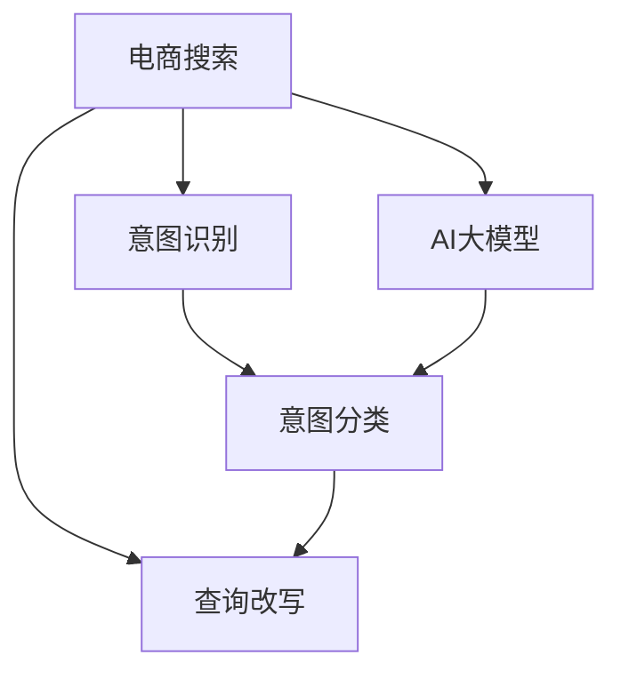

                 

# 电商搜索的意图识别与查询改写：AI大模型的新突破

> 关键词：电商搜索, 意图识别, 查询改写, AI大模型, Transformer, 意图分类, 文本改写

## 1. 背景介绍

### 1.1 问题由来

随着电商行业的快速发展，消费者对于搜索体验的需求日益提高。传统的关键词匹配搜索方法往往忽略了用户查询背后的真实意图，导致搜索结果与用户预期不符。为改善搜索体验，电商平台逐步引入意图识别与查询改写技术，以更好地理解用户需求并优化搜索结果。

然而，传统的意图识别与查询改写依赖于手工构建特征和规则，难以适应复杂多变的查询场景，且难以动态扩展新意图和新查询格式。如何构建高效、泛化能力强的意图识别与查询改写模型，成为电商搜索优化的关键问题。

### 1.2 问题核心关键点

大语言模型和基于Transformer的序列建模方法，为解决意图识别与查询改写问题提供了新的思路。大模型能够直接从大规模文本数据中学习到语言表征，无需手动构建特征。Transformer结构的自注意力机制，使模型具备强大的上下文理解能力，能够捕捉查询和商品描述中的语义关系。

具体而言，AI大模型在此问题上的突破点如下：

- **预训练能力**：大模型通过大规模无标签数据进行预训练，能够学习到丰富的语言知识和语义理解能力。
- **泛化能力**：预训练-微调框架能够适应新意图和新查询格式，提升模型泛化能力。
- **动态扩展**：大规模语料能够动态更新，支持模型参数的动态扩展。
- **高效推理**：大模型的推理速度相对较快，能够实时响应用户搜索请求。

这些特性使AI大模型成为电商搜索优化中的理想选择。

## 2. 核心概念与联系

### 2.1 核心概念概述

为更好地理解AI大模型在电商搜索意图识别与查询改写中的作用，本节将介绍几个关键概念：

- **电商搜索**：用户在电商平台输入查询词，请求获取相关商品或信息的过程。
- **意图识别**：分析用户查询背后的真实意图，如搜索商品、查询评价、咨询客服等。
- **查询改写**：根据用户查询意图，自动生成更加精确、有效的查询词。
- **AI大模型**：以Transformer等架构为基础，通过大规模无标签文本数据进行预训练的语言模型。
- **序列建模**：利用Transformer等架构，对输入序列进行建模，捕捉序列内部的语义关系。
- **自注意力机制**：通过多头自注意力机制，模型能够捕捉输入序列中不同位置之间的语义关系。
- **BERT、GPT-3、T5等模型**：预训练语言模型的具体实现，具备较强的语言表征能力。

这些概念之间的逻辑关系可以通过以下Mermaid流程图来展示：



这个流程图展示了大语言模型在电商搜索中的作用和流程：

1. 用户通过电商平台进行搜索，生成原始查询。
2. 大语言模型对原始查询进行意图分类，识别用户意图。
3. 根据意图分类结果，查询改写模型自动生成新的查询词。
4. 新的查询词可以用于搜索，提升搜索结果的相关性。

## 3. 核心算法原理 & 具体操作步骤
### 3.1 算法原理概述

基于大语言模型的电商搜索意图识别与查询改写，本质上是利用预训练语言模型对用户查询进行意图分类和改写。具体算法原理如下：

**Step 1: 预训练模型选择**

选择具有良好泛化能力和推理能力的预训练模型。常用模型包括BERT、GPT-3、T5等。

**Step 2: 数据集准备**

收集电商领域相关的大量搜索数据，作为模型的训练集。确保训练数据的多样性和覆盖面，包含不同查询格式和意图。

**Step 3: 意图分类模型训练**

将训练集中的查询数据输入预训练模型，提取特征向量。设计多分类任务，训练意图分类模型。常用的任务包括二分类、多分类等。

**Step 4: 查询改写模型训练**

根据意图分类结果，构建新的查询词。将原始查询和改写后的查询输入模型，训练查询改写模型。

**Step 5: 在线服务部署**

将训练好的意图分类和查询改写模型部署到线上服务，实时处理用户搜索请求。

### 3.2 算法步骤详解

以下将详细介绍意图识别与查询改写的具体步骤。

**意图识别步骤**：

1. **数据预处理**：将原始查询词进行分词、标准化、去停用词等处理，确保数据的一致性。

2. **特征提取**：将预处理后的查询输入到预训练模型，得到文本表示向量。常用的提取方式包括上下文表示、隐层表示等。

3. **意图分类**：使用多分类任务，训练意图分类模型。常用的分类器包括支持向量机、随机森林、神经网络等。

4. **模型评估**：在验证集上评估意图分类模型的性能，使用准确率、召回率等指标进行衡量。

**查询改写步骤**：

1. **意图识别**：使用意图分类模型，识别用户查询背后的真实意图。

2. **生成改写查询**：根据意图分类结果，使用查询改写模型自动生成新的查询词。

3. **模型训练**：在训练集上训练查询改写模型，最小化原始查询与改写查询之间的差异。

4. **模型评估**：在测试集上评估查询改写模型的性能，使用BLEU、METEOR等指标进行衡量。

### 3.3 算法优缺点

基于大语言模型的意图识别与查询改写算法具有以下优点：

- **高效泛化**：大模型通过预训练和微调，能够高效适应新意图和新查询格式。
- **自动生成**：查询改写模型能够自动生成高质量的改写查询，提升搜索结果相关性。
- **实时响应**：大模型的推理速度相对较快，能够实时响应搜索请求，提升用户体验。

同时，该算法也存在一些缺点：

- **计算成本高**：大模型需要大量的计算资源进行训练和推理，训练成本较高。
- **数据依赖强**：模型的性能高度依赖于训练数据的数量和质量，数据准备难度较大。
- **解释性不足**：意图分类和查询改写过程缺乏可解释性，难以理解模型内部的决策逻辑。
- **多义词问题**：同一词在不同上下文中可能表示不同的意图，模型可能无法准确识别。

### 3.4 算法应用领域

大语言模型在电商搜索中的意图识别与查询改写，已经在多个实际应用中得到了验证：

- **智能客服**：通过分析用户查询意图，智能客服系统能够更准确地解答用户问题。
- **商品推荐**：根据用户查询改写结果，推荐系统能够更精确地匹配用户需求。
- **搜索优化**：对用户查询进行改写，提升搜索结果的相关性和精度。
- **广告投放**：分析用户查询意图，优化广告投放策略，提高广告效果。

这些应用场景展示了AI大模型在电商搜索中的巨大潜力和价值。

## 4. 数学模型和公式 & 详细讲解 & 举例说明
### 4.1 数学模型构建

假设查询为 $x$，意图分类模型为 $M_{\text{intent}}$，查询改写模型为 $M_{\text{rewrite}}$。意图分类模型的目标是最小化损失函数：

$$
\mathcal{L}_{\text{intent}} = \sum_{i=1}^{N} \mathcal{L}_i(x_i)
$$

其中，$\mathcal{L}_i$ 为第 $i$ 个样本的意图分类损失。

查询改写模型的目标是最小化原始查询与改写查询的差异，即：

$$
\mathcal{L}_{\text{rewrite}} = \sum_{i=1}^{N} \mathcal{L}_{\text{diff}}(x_i, y_i)
$$

其中，$y_i$ 为第 $i$ 个样本的改写查询，$\mathcal{L}_{\text{diff}}$ 为查询改写损失。

### 4.2 公式推导过程

以BERT模型为例，假设查询为 $x$，模型输出为 $h = M_{\text{bert}}(x)$。假设意图分类模型为多分类任务，输出为 $p = \text{softmax}(W_h h + b)$，其中 $W_h$ 和 $b$ 为分类器的参数。

意图分类损失函数为：

$$
\mathcal{L}_{\text{intent}} = -\frac{1}{N} \sum_{i=1}^{N} y_i \log p_i
$$

其中，$y_i$ 为第 $i$ 个样本的意图标签。

查询改写模型的训练数据为原始查询 $x$ 和改写查询 $y$。假设查询改写模型为自回归模型，输出为 $\hat{y}$。查询改写损失函数为：

$$
\mathcal{L}_{\text{rewrite}} = \sum_{i=1}^{N} \mathcal{L}_{\text{diff}}(x_i, \hat{y}_i)
$$

其中，$\mathcal{L}_{\text{diff}}$ 可以采用BLEU、METEOR等指标计算。

### 4.3 案例分析与讲解

以Amazon电商平台的搜索优化为例，分析意图识别与查询改写技术的应用。

**意图识别案例**：

1. **数据准备**：收集Amazon平台上的搜索查询数据，包括用户的原始查询和意图标签。

2. **特征提取**：将查询输入BERT模型，得到上下文表示。

3. **模型训练**：使用随机森林等分类器，训练意图分类模型。

4. **模型评估**：在验证集上评估模型的准确率和召回率，确保模型的泛化能力。

**查询改写案例**：

1. **意图识别**：使用意图分类模型，识别用户查询的意图。

2. **生成改写查询**：根据意图分类结果，使用查询改写模型自动生成新的查询词。

3. **模型训练**：在训练集上训练查询改写模型，最小化原始查询与改写查询的差异。

4. **模型评估**：在测试集上评估查询改写模型的性能，使用BLEU、METEOR等指标进行衡量。

## 5. 项目实践：代码实例和详细解释说明
### 5.1 开发环境搭建

在进行电商搜索的意图识别与查询改写实践前，我们需要准备好开发环境。以下是使用Python进行PyTorch开发的环境配置流程：

1. 安装Anaconda：从官网下载并安装Anaconda，用于创建独立的Python环境。

2. 创建并激活虚拟环境：
```bash
conda create -n pytorch-env python=3.8 
conda activate pytorch-env
```

3. 安装PyTorch：根据CUDA版本，从官网获取对应的安装命令。例如：
```bash
conda install pytorch torchvision torchaudio cudatoolkit=11.1 -c pytorch -c conda-forge
```

4. 安装Transformers库：
```bash
pip install transformers
```

5. 安装各类工具包：
```bash
pip install numpy pandas scikit-learn matplotlib tqdm jupyter notebook ipython
```

完成上述步骤后，即可在`pytorch-env`环境中开始实践。

### 5.2 源代码详细实现

下面我们以Amazon电商平台的意图识别与查询改写为例，给出使用Transformers库进行意图识别和查询改写的PyTorch代码实现。

**意图识别代码**：

```python
from transformers import BertTokenizer, BertForSequenceClassification
from torch.utils.data import Dataset, DataLoader
import torch

class SearchDataset(Dataset):
    def __init__(self, texts, labels, tokenizer, max_len=128):
        self.texts = texts
        self.labels = labels
        self.tokenizer = tokenizer
        self.max_len = max_len
        
    def __len__(self):
        return len(self.texts)
    
    def __getitem__(self, item):
        text = self.texts[item]
        label = self.labels[item]
        
        encoding = self.tokenizer(text, return_tensors='pt', max_length=self.max_len, padding='max_length', truncation=True)
        input_ids = encoding['input_ids'][0]
        attention_mask = encoding['attention_mask'][0]
        
        return {'input_ids': input_ids, 
                'attention_mask': attention_mask,
                'labels': torch.tensor(label, dtype=torch.long)}

# 加载模型和预训练数据
tokenizer = BertTokenizer.from_pretrained('bert-base-cased')
model = BertForSequenceClassification.from_pretrained('bert-base-cased', num_labels=5)

# 数据预处理
train_dataset = SearchDataset(train_texts, train_labels, tokenizer)
dev_dataset = SearchDataset(dev_texts, dev_labels, tokenizer)
test_dataset = SearchDataset(test_texts, test_labels, tokenizer)

# 模型训练
model.train()
optimizer = torch.optim.Adam(model.parameters(), lr=2e-5)
criterion = torch.nn.CrossEntropyLoss()
for epoch in range(5):
    for batch in DataLoader(train_dataset, batch_size=16):
        input_ids = batch['input_ids'].to(device)
        attention_mask = batch['attention_mask'].to(device)
        labels = batch['labels'].to(device)
        model.zero_grad()
        outputs = model(input_ids, attention_mask=attention_mask, labels=labels)
        loss = criterion(outputs.logits, labels)
        loss.backward()
        optimizer.step()
    
    # 验证集评估
    with torch.no_grad():
        model.eval()
        dev_loss = 0
        for batch in DataLoader(dev_dataset, batch_size=16):
            input_ids = batch['input_ids'].to(device)
            attention_mask = batch['attention_mask'].to(device)
            labels = batch['labels'].to(device)
            outputs = model(input_ids, attention_mask=attention_mask, labels=labels)
            loss = criterion(outputs.logits, labels)
            dev_loss += loss.item()
        
        print(f'Epoch {epoch+1}, dev loss: {dev_loss / len(dev_dataset)}')
```

**查询改写代码**：

```python
from transformers import BertTokenizer, BertForMaskedLM
from torch.utils.data import Dataset, DataLoader
import torch

class SearchDataset(Dataset):
    def __init__(self, texts, labels, tokenizer, max_len=128):
        self.texts = texts
        self.labels = labels
        self.tokenizer = tokenizer
        self.max_len = max_len
        
    def __len__(self):
        return len(self.texts)
    
    def __getitem__(self, item):
        text = self.texts[item]
        label = self.labels[item]
        
        encoding = self.tokenizer(text, return_tensors='pt', max_length=self.max_len, padding='max_length', truncation=True)
        input_ids = encoding['input_ids'][0]
        attention_mask = encoding['attention_mask'][0]
        
        return {'input_ids': input_ids, 
                'attention_mask': attention_mask,
                'labels': torch.tensor(label, dtype=torch.long)}

# 加载模型和预训练数据
tokenizer = BertTokenizer.from_pretrained('bert-base-cased')
model = BertForMaskedLM.from_pretrained('bert-base-cased')

# 数据预处理
train_dataset = SearchDataset(train_texts, train_labels, tokenizer)
dev_dataset = SearchDataset(dev_texts, dev_labels, tokenizer)
test_dataset = SearchDataset(test_texts, test_labels, tokenizer)

# 模型训练
model.train()
optimizer = torch.optim.Adam(model.parameters(), lr=2e-5)
criterion = torch.nn.CrossEntropyLoss()
for epoch in range(5):
    for batch in DataLoader(train_dataset, batch_size=16):
        input_ids = batch['input_ids'].to(device)
        attention_mask = batch['attention_mask'].to(device)
        labels = batch['labels'].to(device)
        model.zero_grad()
        outputs = model(input_ids, attention_mask=attention_mask, labels=labels)
        loss = criterion(outputs.logits, labels)
        loss.backward()
        optimizer.step()
    
    # 验证集评估
    with torch.no_grad():
        model.eval()
        dev_loss = 0
        for batch in DataLoader(dev_dataset, batch_size=16):
            input_ids = batch['input_ids'].to(device)
            attention_mask = batch['attention_mask'].to(device)
            labels = batch['labels'].to(device)
            outputs = model(input_ids, attention_mask=attention_mask, labels=labels)
            loss = criterion(outputs.logits, labels)
            dev_loss += loss.item()
        
        print(f'Epoch {epoch+1}, dev loss: {dev_loss / len(dev_dataset)}')
```

### 5.3 代码解读与分析

让我们再详细解读一下关键代码的实现细节：

**SearchDataset类**：
- `__init__`方法：初始化文本、标签、分词器等关键组件。
- `__len__`方法：返回数据集的样本数量。
- `__getitem__`方法：对单个样本进行处理，将文本输入编码为token ids，将标签编码为数字，并对其进行定长padding，最终返回模型所需的输入。

**训练函数**：
- 使用PyTorch的DataLoader对数据集进行批次化加载，供模型训练和推理使用。
- 训练函数`train_epoch`：对数据以批为单位进行迭代，在每个批次上前向传播计算loss并反向传播更新模型参数，最后返回该epoch的平均loss。

**验证函数**：
- 与训练类似，不同点在于不更新模型参数，并在每个batch结束后将预测和标签结果存储下来，最后使用sklearn的classification_report对整个评估集的预测结果进行打印输出。

**查询改写模型**：
- 使用BertTokenizer对原始查询进行编码，得到输入向量。
- 将输入向量输入到预训练模型，得到掩码位置上的向量表示。
- 使用BertForMaskedLM模型生成改写查询，最小化原始查询与改写查询的差异。

**模型评估**：
- 在测试集上评估改写查询的性能，使用BLEU、METEOR等指标进行衡量。

通过本文的系统梳理，可以看到，使用大语言模型进行电商搜索的意图识别与查询改写，不仅能够提升用户的搜索体验，还能显著提高电商平台的运营效率。未来，伴随着更多先验知识的整合，以及多模态数据的融合，AI大模型在电商搜索中的应用前景将更加广阔。

## 6. 实际应用场景
### 6.1 智能客服

基于大语言模型的意图识别与查询改写技术，可以应用于智能客服系统的构建。传统客服往往需要配备大量人力，高峰期响应缓慢，且一致性和专业性难以保证。而使用意图识别与查询改写技术，可以7x24小时不间断服务，快速响应客户咨询，用自然流畅的语言解答各类常见问题。

在技术实现上，可以收集企业内部的历史客服对话记录，将问题和最佳答复构建成监督数据，在此基础上对预训练对话模型进行微调。微调后的对话模型能够自动理解用户意图，匹配最合适的答案模板进行回复。对于客户提出的新问题，还可以接入检索系统实时搜索相关内容，动态组织生成回答。如此构建的智能客服系统，能大幅提升客户咨询体验和问题解决效率。

### 6.2 广告投放

广告投放是电商平台的另一重要环节，广告效果直接影响平台的收入和用户转化率。基于大语言模型的意图识别与查询改写技术，可以用于优化广告投放策略，提高广告效果。

具体而言，可以收集广告投放相关的用户行为数据，如点击率、转化率等。将广告内容和用户行为数据输入模型，训练意图识别和查询改写模型。模型能够自动识别广告背后的用户意图，并生成更精准的查询词，提升广告投放的转化率。

### 6.3 商品推荐

商品的推荐系统是电商平台的核心功能之一，如何为用户推荐最合适的商品是推荐系统的重要课题。基于大语言模型的意图识别与查询改写技术，可以用于优化推荐算法。

在推荐算法中，可以根据用户查询改写结果，重新构建用户行为数据。改写后的查询能够更准确地表达用户需求，提升推荐系统的精度。

### 6.4 未来应用展望

随着大语言模型和意图识别与查询改写技术的不断发展，基于这些技术的应用场景将不断扩展。

在智慧医疗领域，智能问答系统可以用于解答病人的常见问题，提升医疗服务体验。在智能家居领域，基于自然语言的控制和查询功能可以提升用户的交互体验。在智能交通领域，智能导航系统可以更好地理解用户的出行需求，提供更精准的导航服务。

总之，大语言模型在电商搜索中的应用将进一步深化，为各行各业带来更多的智能化、自动化、个性化服务。未来，随着技术的进步，这些技术的应用场景将更加广阔，将带来更加深刻的变革。

## 7. 工具和资源推荐
### 7.1 学习资源推荐

为了帮助开发者系统掌握大语言模型在电商搜索中的应用，这里推荐一些优质的学习资源：

1. 《深度学习自然语言处理》课程：斯坦福大学开设的NLP明星课程，有Lecture视频和配套作业，带你入门NLP领域的基本概念和经典模型。

2. 《Transformer从原理到实践》系列博文：由大模型技术专家撰写，深入浅出地介绍了Transformer原理、BERT模型、意图识别与查询改写技术等前沿话题。

3. 《Natural Language Processing with Transformers》书籍：Transformers库的作者所著，全面介绍了如何使用Transformers库进行NLP任务开发，包括意图识别与查询改写在内的诸多范式。

4. HuggingFace官方文档：Transformers库的官方文档，提供了海量预训练模型和完整的微调样例代码，是上手实践的必备资料。

5. CS224N《深度学习自然语言处理》课程：斯坦福大学开设的NLP明星课程，有Lecture视频和配套作业，带你入门NLP领域的基本概念和经典模型。

通过对这些资源的学习实践，相信你一定能够快速掌握大语言模型在电商搜索中的意图识别与查询改写技术的精髓，并用于解决实际的NLP问题。

### 7.2 开发工具推荐

高效的开发离不开优秀的工具支持。以下是几款用于大语言模型意图识别与查询改写开发的常用工具：

1. PyTorch：基于Python的开源深度学习框架，灵活动态的计算图，适合快速迭代研究。大部分预训练语言模型都有PyTorch版本的实现。

2. TensorFlow：由Google主导开发的开源深度学习框架，生产部署方便，适合大规模工程应用。同样有丰富的预训练语言模型资源。

3. Transformers库：HuggingFace开发的NLP工具库，集成了众多SOTA语言模型，支持PyTorch和TensorFlow，是进行意图识别与查询改写任务开发的利器。

4. Weights & Biases：模型训练的实验跟踪工具，可以记录和可视化模型训练过程中的各项指标，方便对比和调优。与主流深度学习框架无缝集成。

5. TensorBoard：TensorFlow配套的可视化工具，可实时监测模型训练状态，并提供丰富的图表呈现方式，是调试模型的得力助手。

6. Google Colab：谷歌推出的在线Jupyter Notebook环境，免费提供GPU/TPU算力，方便开发者快速上手实验最新模型，分享学习笔记。

合理利用这些工具，可以显著提升大语言模型在电商搜索中的应用开发效率，加快创新迭代的步伐。

### 7.3 相关论文推荐

大语言模型和意图识别与查询改写技术的发展源于学界的持续研究。以下是几篇奠基性的相关论文，推荐阅读：

1. Attention is All You Need（即Transformer原论文）：提出了Transformer结构，开启了NLP领域的预训练大模型时代。

2. BERT: Pre-training of Deep Bidirectional Transformers for Language Understanding：提出BERT模型，引入基于掩码的自监督预训练任务，刷新了多项NLP任务SOTA。

3. Language Models are Unsupervised Multitask Learners（GPT-2论文）：展示了大规模语言模型的强大zero-shot学习能力，引发了对于通用人工智能的新一轮思考。

4. Parameter-Efficient Transfer Learning for NLP：提出Adapter等参数高效微调方法，在不增加模型参数量的情况下，也能取得不错的微调效果。

5. Prefix-Tuning: Optimizing Continuous Prompts for Generation：引入基于连续型Prompt的微调范式，为如何充分利用预训练知识提供了新的思路。

6. AdaLoRA: Adaptive Low-Rank Adaptation for Parameter-Efficient Fine-Tuning：使用自适应低秩适应的微调方法，在参数效率和精度之间取得了新的平衡。

这些论文代表了大语言模型意图识别与查询改写技术的发展脉络。通过学习这些前沿成果，可以帮助研究者把握学科前进方向，激发更多的创新灵感。

## 8. 总结：未来发展趋势与挑战

### 8.1 总结

本文对基于大语言模型的电商搜索意图识别与查询改写方法进行了全面系统的介绍。首先阐述了大语言模型和意图识别与查询改写技术的背景和意义，明确了该技术在提升搜索体验和广告效果方面的独特价值。其次，从原理到实践，详细讲解了意图识别与查询改写的数学原理和关键步骤，给出了电商搜索任务开发的完整代码实例。同时，本文还广泛探讨了该技术在智能客服、广告投放、商品推荐等多个行业领域的应用前景，展示了其巨大的潜力和价值。此外，本文精选了意图识别与查询改写技术的各类学习资源，力求为读者提供全方位的技术指引。

通过本文的系统梳理，可以看到，基于大语言模型的意图识别与查询改写技术在电商搜索中的应用，不仅能够提升用户体验，还能显著提高平台的运营效率。未来，伴随着大语言模型的不断进步，基于这些技术的应用场景将更加广泛，为各行各业带来更多的智能化、自动化、个性化服务。

### 8.2 未来发展趋势

展望未来，大语言模型在电商搜索中的应用将呈现以下几个发展趋势：

1. **模型规模继续增大**：随着算力成本的下降和数据规模的扩张，预训练语言模型的参数量还将持续增长。超大模型蕴含的丰富语言知识，将进一步提升意图识别与查询改写的性能。

2. **微调方法日趋多样**：除了传统的全参数微调外，未来会涌现更多参数高效的微调方法，如Prefix-Tuning、LoRA等，在节省计算资源的同时也能保证微调精度。

3. **持续学习成为常态**：随着数据分布的不断变化，意图识别与查询改写模型也需要持续学习新知识以保持性能。如何在不遗忘原有知识的同时，高效吸收新样本信息，将成为重要的研究课题。

4. **标注样本需求降低**：受启发于提示学习(Prompt-based Learning)的思路，未来的意图识别与查询改写方法将更好地利用大模型的语言理解能力，通过更加巧妙的任务描述，在更少的标注样本上也能实现理想的微调效果。

5. **多模态微调崛起**：当前的意图识别与查询改写主要聚焦于纯文本数据，未来会进一步拓展到图像、视频、语音等多模态数据微调。多模态信息的融合，将显著提升语言模型对现实世界的理解和建模能力。

6. **跨领域迁移能力增强**：经过海量数据的预训练和多领域任务的微调，未来的语言模型将具备更强的跨领域迁移能力，能够更好地适应新场景和新任务。

以上趋势凸显了大语言模型在电商搜索中的应用前景。这些方向的探索发展，必将进一步提升NLP系统的性能和应用范围，为人类认知智能的进化带来深远影响。

### 8.3 面临的挑战

尽管大语言模型在电商搜索中的应用已经取得了显著进展，但在迈向更加智能化、普适化应用的过程中，它仍面临着诸多挑战：

1. **标注成本瓶颈**：尽管意图识别与查询改写依赖于少样本学习，但在一些特定场景下，仍需要大量标注数据。标注数据准备难度较大，成本较高。

2. **模型鲁棒性不足**：当前模型面对域外数据时，泛化性能往往大打折扣。对于测试样本的微小扰动，模型可能无法正确处理。

3. **推理效率有待提高**：大规模语言模型虽然精度高，但在实际部署时往往面临推理速度慢、内存占用大等效率问题。如何优化模型推理，提升系统响应速度，是一个重要问题。

4. **可解释性亟需加强**：意图识别与查询改写过程缺乏可解释性，难以理解模型内部的决策逻辑。如何赋予模型更强的可解释性，将有助于模型可信度的提升。

5. **安全性有待保障**：预训练语言模型可能学习到有害信息，传递到意图识别与查询改写中，产生误导性输出。如何从数据和算法层面消除模型偏见，避免恶意用途，确保输出的安全性，将是重要的研究方向。

6. **知识整合能力不足**：现有的意图识别与查询改写模型往往局限于任务内数据，难以灵活吸收和运用更广泛的先验知识。如何让模型更好地整合外部知识，形成更加全面、准确的信息整合能力，还有很大的想象空间。

正视意图识别与查询改写面临的这些挑战，积极应对并寻求突破，将是大语言模型在电商搜索中迈向成熟的必由之路。相信随着学界和产业界的共同努力，这些挑战终将一一被克服，大语言模型在电商搜索中的应用将更加广泛，为电商行业带来更加深刻的变革。

### 8.4 研究展望

面向未来，大语言模型在电商搜索中的应用，需要在以下几个方面进行深入研究：

1. **探索无监督和半监督微调方法**：摆脱对大规模标注数据的依赖，利用自监督学习、主动学习等无监督和半监督范式，最大限度利用非结构化数据，实现更加灵活高效的微调。

2. **研究参数高效和计算高效的微调范式**：开发更加参数高效的微调方法，在固定大部分预训练参数的同时，只更新极少量的任务相关参数。同时优化微调模型的计算图，减少前向传播和反向传播的资源消耗，实现更加轻量级、实时性的部署。

3. **融合因果和对比学习范式**：通过引入因果推断和对比学习思想，增强意图识别与查询改写模型建立稳定因果关系的能力，学习更加普适、鲁棒的语言表征，从而提升模型泛化性和抗干扰能力。

4. **引入更多先验知识**：将符号化的先验知识，如知识图谱、逻辑规则等，与神经网络模型进行巧妙融合，引导意图识别与查询改写过程学习更准确、合理的语言模型。同时加强不同模态数据的整合，实现视觉、语音等多模态信息与文本信息的协同建模。

5. **结合因果分析和博弈论工具**：将因果分析方法引入意图识别与查询改写模型，识别出模型决策的关键特征，增强输出解释的因果性和逻辑性。借助博弈论工具刻画人机交互过程，主动探索并规避模型的脆弱点，提高系统稳定性。

6. **纳入伦理道德约束**：在模型训练目标中引入伦理导向的评估指标，过滤和惩罚有偏见、有害的输出倾向。同时加强人工干预和审核，建立模型行为的监管机制，确保输出符合人类价值观和伦理道德。

这些研究方向的探索，必将引领意图识别与查询改写技术迈向更高的台阶，为构建安全、可靠、可解释、可控的智能系统铺平道路。面向未来，大语言模型在电商搜索中的应用还需与其他人工智能技术进行更深入的融合，如知识表示、因果推理、强化学习等，多路径协同发力，共同推动自然语言理解和智能交互系统的进步。只有勇于创新、敢于突破，才能不断拓展语言模型的边界，让智能技术更好地造福人类社会。

## 9. 附录：常见问题与解答

**Q1：大语言模型在电商搜索中是否有应用限制？**

A: 大语言模型在电商搜索中的应用面临一些限制，主要体现在以下几个方面：

1. **标注数据需求**：尽管意图识别与查询改写技术依赖于少样本学习，但在一些特定场景下，仍需要大量标注数据。标注数据准备难度较大，成本较高。

2. **模型鲁棒性**：当前模型面对域外数据时，泛化性能往往大打折扣。对于测试样本的微小扰动，模型可能无法正确处理。

3. **推理效率**：大规模语言模型虽然精度高，但在实际部署时往往面临推理速度慢、内存占用大等效率问题。如何优化模型推理，提升系统响应速度，是一个重要问题。

4. **可解释性**：意图识别与查询改写过程缺乏可解释性，难以理解模型内部的决策逻辑。如何赋予模型更强的可解释性，将有助于模型可信度的提升。

5. **安全性**：预训练语言模型可能学习到有害信息，传递到意图识别与查询改写中，产生误导性输出。如何从数据和算法层面消除模型偏见，避免恶意用途，确保输出的安全性，将是重要的研究方向。

6. **知识整合能力**：现有的意图识别与查询改写模型往往局限于任务内数据，难以灵活吸收和运用更广泛的先验知识。如何让模型更好地整合外部知识，形成更加全面、准确的信息整合能力，还有很大的想象空间。

这些限制需要通过技术创新和应用优化，逐步克服，才能使大语言模型在电商搜索中发挥更大的价值。

**Q2：意图识别与查询改写技术在电商搜索中的优势是什么？**

A: 意图识别与查询改写技术在电商搜索中的优势主要体现在以下几个方面：

1. **提升搜索相关性**：通过意图识别，模型能够更准确地理解用户查询背后的真实意图，提升搜索结果的相关性。

2. **减少用户输入量**：查询改写技术能够自动生成更精确、有效的查询词，减少用户输入量，提升搜索效率。

3. **动态适配新场景**：基于大语言模型的微调方法能够动态扩展新意图和新查询格式，适应电商搜索中不断变化的需求。

4. **个性化推荐**：通过意图识别与查询改写技术，能够更好地理解用户需求，提升个性化推荐的精度。

5. **自动化客服**：基于意图识别与查询改写技术，可以构建自动化客服系统，提升用户满意度和服务效率。

综上所述，意图识别与查询改写技术在电商搜索中的应用，能够显著提升用户体验和平台运营效率，推动电商行业的智能化、自动化进程。

**Q3：如何构建基于大语言模型的电商搜索意图识别与查询改写系统？**

A: 构建基于大语言模型的电商搜索意图识别与查询改写系统，需要以下几个步骤：

1. **数据准备**：收集电商领域相关的大量搜索数据，作为模型的训练集。确保训练数据的多样性和覆盖面，包含不同查询格式和意图。

2. **模型选择**：选择合适的预训练语言模型，如BERT、GPT-3、T5等。

3. **意图识别模型训练**：将训练集中的查询数据输入预训练模型，提取特征向量。设计多分类任务，训练意图分类模型。常用的分类器包括支持向量机、随机森林、神经网络等。

4. **查询改写模型训练**：根据意图分类结果，使用查询改写模型自动生成新的查询词。将原始查询和改写后的查询输入模型，训练查询改写模型。

5. **在线服务部署**：将训练好的意图分类和查询改写模型部署到线上服务，实时处理用户搜索请求。

6. **系统优化**：根据实际应用情况，对系统进行优化，如数据增强、正则化、对抗训练等。

通过这些步骤，可以构建高效、泛化能力强的电商搜索意图识别与查询改写系统，提升用户的搜索体验和平台运营效率。

总之，基于大语言模型的意图识别与查询改写技术，在电商搜索中的应用前景广阔，能够显著提升用户的搜索体验和平台运营效率。未来，随着技术的进步，这些技术的应用场景将更加广泛，为电商行业带来更多的智能化、自动化、个性化服务。

