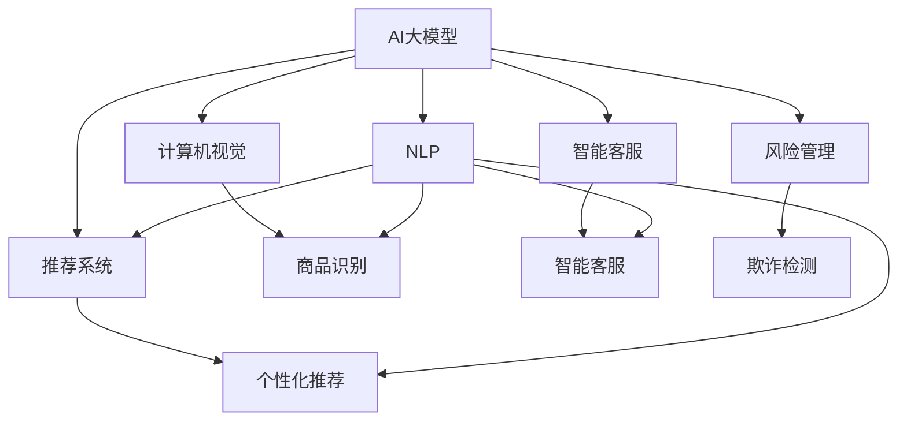
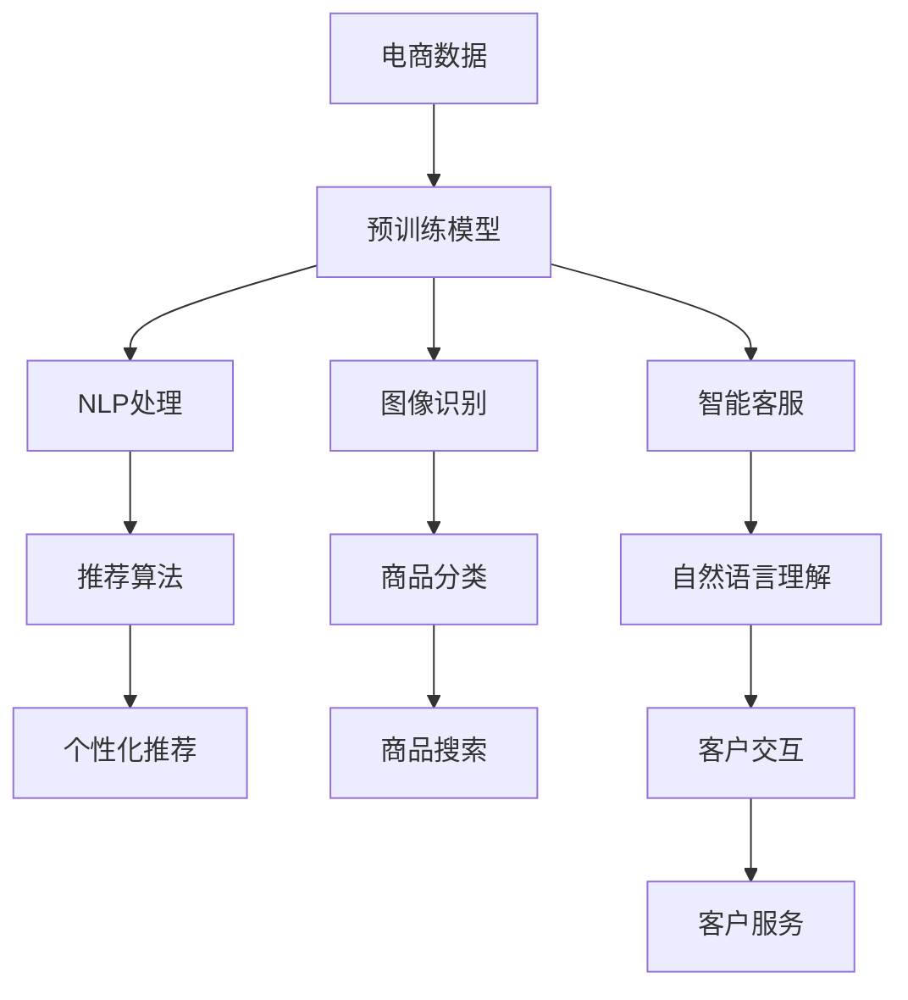

                 

# 电商行业中的AI大模型：机遇与挑战并存

> 关键词：电商、AI大模型、自然语言处理、推荐系统、计算机视觉、智能客服、风险管理

## 1. 背景介绍

### 1.1 问题由来

电商行业作为全球最大的数字经济产业之一，其数字化、智能化转型是大势所趋。随着消费者行为日益复杂多变，线上线下融合的趋势愈发明显，电商企业的竞争压力也随之增加。在这样的背景下，人工智能(AI)大模型因其强大的算法能力和数据处理能力，逐渐成为电商企业的数字化转型利器。

AI大模型在电商行业中的应用领域广泛，包括但不限于：

1. **智能客服**：通过自然语言处理(NLP)技术，提升客户服务体验，降低人力成本。
2. **推荐系统**：根据用户行为和偏好，提供个性化推荐，提升转化率和用户满意度。
3. **计算机视觉**：用于商品识别、库存管理、图像搜索等。
4. **风险管理**：通过分析交易数据和用户行为，预防和减少欺诈和风险。

### 1.2 问题核心关键点

AI大模型在电商行业的应用主要集中在以下几个方面：

- **数据驱动**：电商行业数据量庞大，AI大模型可以从中提取有价值的信息，驱动业务决策。
- **实时响应**：AI大模型可以实时处理海量数据，快速响应市场变化和客户需求。
- **个性化服务**：通过深度学习，AI大模型能够实现精准的用户画像，提供个性化推荐和服务。
- **泛化能力**：AI大模型可以处理多种类型的任务，如文本、图像、语音等，具有较强的泛化能力。

## 2. 核心概念与联系

### 2.1 核心概念概述

要全面理解AI大模型在电商行业的应用，首先需要理解以下几个核心概念：

- **AI大模型**：指基于深度学习技术构建的大规模神经网络模型，具有较强的泛化能力和自监督学习能力。
- **自然语言处理(NLP)**：涉及文本数据的处理、理解、生成等，是AI大模型在电商行业应用的重要基础。
- **推荐系统**：通过用户行为数据，预测用户偏好，提供个性化推荐。
- **计算机视觉**：涉及图像、视频数据的处理、识别等，广泛应用于电商商品的分类、搜索、营销等。
- **智能客服**：通过NLP技术，实现人机交互，提升客户服务效率和体验。
- **风险管理**：通过数据分析和模型预测，预防和减少电商交易中的欺诈和风险。

这些概念之间的逻辑关系可以通过以下Mermaid流程图来展示：



这个流程图展示了AI大模型与电商行业中的NLP、推荐系统、计算机视觉、智能客服和风险管理等概念之间的逻辑联系和应用场景。

### 2.2 核心概念原理和架构的 Mermaid 流程图

由于篇幅限制，这里只提供一个简单的示例：



## 3. 核心算法原理 & 具体操作步骤

### 3.1 算法原理概述

AI大模型在电商行业的应用通常基于以下原理：

- **自监督学习**：在无标注数据上进行预训练，学习通用的语言和视觉特征。
- **迁移学习**：利用预训练模型在特定任务上的微调，快速适应新任务。
- **强化学习**：通过与环境的交互，优化模型参数，提升推荐系统等应用的性能。
- **对抗训练**：通过引入对抗样本，提升模型的鲁棒性和泛化能力。

### 3.2 算法步骤详解

AI大模型在电商行业的应用步骤通常包括以下几个关键环节：

1. **数据准备**：收集和清洗电商相关的数据，包括用户行为数据、商品信息、交易记录等。
2. **模型预训练**：使用大规模无标注数据进行预训练，学习通用的语言和视觉特征。
3. **任务适配**：根据电商行业的具体需求，设计并训练特定任务所需的适配层。
4. **微调优化**：在标注数据上进行微调，优化模型在特定任务上的性能。
5. **模型评估**：使用测试集评估模型性能，进行必要的优化调整。
6. **部署应用**：将模型部署到电商系统中，进行实际应用。

### 3.3 算法优缺点

AI大模型在电商行业的应用具有以下优点：

- **高效性**：可以处理海量数据，快速响应市场需求变化。
- **准确性**：通过深度学习和迁移学习，提供高精度的推荐和预测。
- **灵活性**：可以适应多种任务，如智能客服、商品搜索等。

同时，也存在以下缺点：

- **资源消耗大**：需要高性能计算资源，成本较高。
- **数据依赖性高**：需要高质量、大量的标注数据。
- **模型复杂度高**：模型结构复杂，难以解释和调试。
- **隐私风险**：处理大量用户数据，需注意隐私保护和数据安全。

### 3.4 算法应用领域

AI大模型在电商行业的应用领域广泛，主要包括以下几个方面：

- **个性化推荐**：通过分析用户行为，提供个性化商品推荐。
- **智能客服**：通过NLP技术，实现智能客服，提升客户满意度。
- **欺诈检测**：通过分析交易数据，预防和减少电商欺诈。
- **库存管理**：通过计算机视觉技术，实时监测库存状态，优化库存管理。
- **商品分类与搜索**：通过图像识别和NLP技术，实现商品分类和搜索。

## 4. 数学模型和公式 & 详细讲解 & 举例说明

### 4.1 数学模型构建

AI大模型在电商行业的应用通常基于以下几个数学模型：

- **推荐系统模型**：如协同过滤、矩阵分解等。
- **自然语言处理模型**：如BERT、GPT等。
- **计算机视觉模型**：如卷积神经网络(CNN)、循环神经网络(RNN)等。

### 4.2 公式推导过程

以推荐系统中的协同过滤模型为例，其基本公式为：

$$
p(i|j) = \frac{\exp(\mathbf{u}_i^T\mathbf{v}_j)}{\sum_{k=1}^K \exp(\mathbf{u}_k^T\mathbf{v}_j)}
$$

其中，$\mathbf{u}_i$ 和 $\mathbf{v}_j$ 分别表示用户 $i$ 和商品 $j$ 的向量表示，$K$ 表示所有商品的数量。这个公式表示了用户对商品 $j$ 的兴趣评分。

### 4.3 案例分析与讲解

以电商推荐系统为例，我们可以使用矩阵分解的方法对用户和商品的评分矩阵进行分解，得到用户和商品的潜在特征表示，然后利用这些特征进行推荐。这种方法在电商推荐系统中应用广泛，取得了不错的效果。

## 5. 项目实践：代码实例和详细解释说明

### 5.1 开发环境搭建

为了进行电商行业中的AI大模型开发，我们需要安装以下开发环境：

- Python：推荐使用3.8及以上版本。
- PyTorch：用于深度学习模型的开发。
- TensorFlow：可选，用于替代PyTorch。
- scikit-learn：用于数据处理和模型评估。
- pandas：用于数据清洗和处理。
- jupyter notebook：用于编写和运行代码。

### 5.2 源代码详细实现

以电商推荐系统为例，以下是使用PyTorch实现的代码：

```python
import torch
import torch.nn as nn
import torch.optim as optim
import pandas as pd
import numpy as np
from sklearn.model_selection import train_test_split

class Net(nn.Module):
    def __init__(self, input_size, hidden_size, output_size):
        super(Net, self).__init__()
        self.fc1 = nn.Linear(input_size, hidden_size)
        self.fc2 = nn.Linear(hidden_size, output_size)
    
    def forward(self, x):
        x = self.fc1(x)
        x = torch.sigmoid(x)
        x = self.fc2(x)
        return x

# 加载数据
df = pd.read_csv('data.csv')
X = df[['item_id', 'user_id']]
y = df['rating']
X_train, X_test, y_train, y_test = train_test_split(X, y, test_size=0.2)

# 定义模型
input_size = X_train.shape[1]
hidden_size = 32
output_size = 1
model = Net(input_size, hidden_size, output_size)

# 定义损失函数和优化器
criterion = nn.MSELoss()
optimizer = optim.Adam(model.parameters(), lr=0.001)

# 训练模型
num_epochs = 100
for epoch in range(num_epochs):
    optimizer.zero_grad()
    outputs = model(X_train)
    loss = criterion(outputs, y_train)
    loss.backward()
    optimizer.step()
    
    if (epoch+1) % 10 == 0:
        print('Epoch [{}/{}], Loss: {:.4f}'.format(epoch+1, num_epochs, loss.item()))

# 评估模型
model.eval()
with torch.no_grad():
    outputs = model(X_test)
    loss = criterion(outputs, y_test)
    print('Test Loss: {:.4f}'.format(loss.item()))
```

### 5.3 代码解读与分析

上述代码实现了基本的电商推荐系统模型。其中，Net类定义了推荐模型的前向传播过程，使用sigmoid激活函数将中间层的输出映射到[0,1]区间内，最后通过一个线性层输出评分。在训练过程中，使用了均方误差损失函数和Adam优化器，通过100个epoch进行模型训练。在测试过程中，评估模型在测试集上的均方误差损失。

## 6. 实际应用场景

### 6.1 智能客服

智能客服系统可以通过NLP技术，实现自动回答用户咨询，提升客户服务效率。以电商客服为例，系统可以自动回答商品信息查询、订单状态查询等常见问题，同时可以实时监测用户情绪，识别异常情绪，进行人工干预。

### 6.2 个性化推荐

推荐系统是电商行业的重要应用之一。通过分析用户行为数据，如浏览历史、购买记录等，利用AI大模型进行推荐，能够提升用户满意度和转化率。推荐系统可以结合商品属性、用户画像等数据，提供个性化推荐。

### 6.3 商品分类与搜索

计算机视觉技术可以用于商品的分类和搜索。通过训练分类模型，系统可以对新商品进行分类，提升分类准确率。同时，基于图像的搜索功能，用户可以通过上传图片，快速找到相似的商品。

### 6.4 风险管理

AI大模型可以用于电商交易的风险管理。通过分析交易数据和用户行为，预测潜在的欺诈行为，提升交易安全性。

### 6.5 库存管理

计算机视觉技术可以用于库存管理。通过实时监控仓库中的商品，识别商品数量和位置，优化库存管理，减少库存成本。

### 6.6 未来应用展望

随着AI大模型的不断演进，其在电商行业的应用将更加广泛和深入。未来可以预见的趋势包括：

- **多模态融合**：结合文本、图像、视频等多种模态数据，提升系统的感知能力和决策能力。
- **跨领域应用**：将AI大模型应用于更多行业，如金融、医疗、教育等，提升跨领域的智能化水平。
- **模型融合与集成**：将多个AI大模型进行融合与集成，提升系统的综合性能。
- **边缘计算**：在边缘计算环境中，实现本地化数据处理和模型推理，提升响应速度和安全性。

## 7. 工具和资源推荐

### 7.1 学习资源推荐

为了掌握AI大模型在电商行业的应用，推荐以下学习资源：

- Coursera上的《Deep Learning Specialization》课程：由Andrew Ng主讲，全面介绍深度学习理论和实践。
- 《Python深度学习》书籍：Francois Chollet所著，介绍TensorFlow和Keras的使用。
- 《Hands-On Machine Learning with Scikit-Learn, Keras, and TensorFlow》书籍：Aurélien Géron所著，介绍Scikit-Learn、Keras和TensorFlow的使用。

### 7.2 开发工具推荐

为了高效开发电商行业中的AI大模型，推荐以下开发工具：

- PyTorch：深度学习模型的开发利器。
- TensorFlow：深度学习模型的开发工具。
- scikit-learn：机器学习算法的实现。
- Pandas：数据处理和清洗。
- Jupyter Notebook：编写和运行代码。

### 7.3 相关论文推荐

为了深入理解AI大模型在电商行业的应用，推荐以下相关论文：

- "Attention is All You Need" (Transformer论文)：提出Transformer结构，奠定深度学习模型研究的基础。
- "BERT: Pre-training of Deep Bidirectional Transformers for Language Understanding"：提出BERT模型，提升语言理解的精度。
- "Hierarchical Attention Networks for Document Classification"：提出层次化注意力网络，提升文本分类的效果。
- "Deep & Hierarchical Attention-based Recommender Network for E-commerce Recommendation"：提出深度和层次化注意力网络，提升电商推荐系统的效果。
- "A Unified Probabilistic Framework for Modeling Uncertainty in Recommender Systems"：提出概率框架，用于处理推荐系统中的不确定性。

## 8. 总结：未来发展趋势与挑战

### 8.1 总结

本文对AI大模型在电商行业的应用进行了全面系统的介绍。首先介绍了AI大模型和电商行业的发展背景和应用需求，然后详细讲解了AI大模型的核心概念、算法原理和具体操作步骤，最后通过代码实例和实际应用场景展示了AI大模型的强大能力。

通过本文的系统梳理，可以看到，AI大模型在电商行业的应用前景广阔，有望大幅提升电商企业的智能化水平，带来更高的效率和用户满意度。

### 8.2 未来发展趋势

未来，AI大模型在电商行业的应用将呈现以下趋势：

- **多模态融合**：结合文本、图像、视频等多种模态数据，提升系统的感知能力和决策能力。
- **跨领域应用**：将AI大模型应用于更多行业，如金融、医疗、教育等，提升跨领域的智能化水平。
- **模型融合与集成**：将多个AI大模型进行融合与集成，提升系统的综合性能。
- **边缘计算**：在边缘计算环境中，实现本地化数据处理和模型推理，提升响应速度和安全性。

### 8.3 面临的挑战

尽管AI大模型在电商行业的应用取得了显著成果，但也面临以下挑战：

- **数据隐私**：处理大量用户数据，需注意隐私保护和数据安全。
- **模型复杂性**：模型结构复杂，难以解释和调试。
- **计算资源消耗**：需要高性能计算资源，成本较高。
- **实时性要求**：需确保模型在实时环境中响应速度和准确性。

### 8.4 研究展望

未来，需要进一步研究和突破以下几个方向：

- **数据隐私保护**：研究如何在保护用户隐私的前提下，利用AI大模型进行数据分析。
- **模型解释性**：研究如何提升AI大模型的解释性和可解释性，增强用户信任。
- **计算效率优化**：研究如何优化AI大模型的计算效率，降低计算成本。
- **跨模态融合**：研究如何结合多模态数据，提升系统的感知能力和决策能力。

## 9. 附录：常见问题与解答

**Q1: AI大模型在电商行业的应用前景如何？**

A: AI大模型在电商行业的应用前景广阔。通过NLP、推荐系统、计算机视觉等技术，AI大模型可以提升客户服务效率、个性化推荐、商品分类、库存管理等方面的能力，带来更高的效率和用户满意度。

**Q2: 如何选择合适的AI大模型？**

A: 选择合适的AI大模型需要考虑以下几个因素：
- 数据类型：根据数据类型选择适合的模型，如文本数据选择BERT，图像数据选择CNN。
- 任务需求：根据任务需求选择适合的模型，如推荐系统选择协同过滤模型，智能客服选择NLP模型。
- 计算资源：根据计算资源选择合适的模型，如小规模数据选择轻量级模型，大规模数据选择大模型。

**Q3: AI大模型在电商行业的应用存在哪些挑战？**

A: AI大模型在电商行业的应用存在以下挑战：
- 数据隐私：处理大量用户数据，需注意隐私保护和数据安全。
- 模型复杂性：模型结构复杂，难以解释和调试。
- 计算资源消耗：需要高性能计算资源，成本较高。
- 实时性要求：需确保模型在实时环境中响应速度和准确性。

通过不断探索和突破，AI大模型在电商行业的应用前景将更加广阔，有望带来更高的效率和用户满意度。

