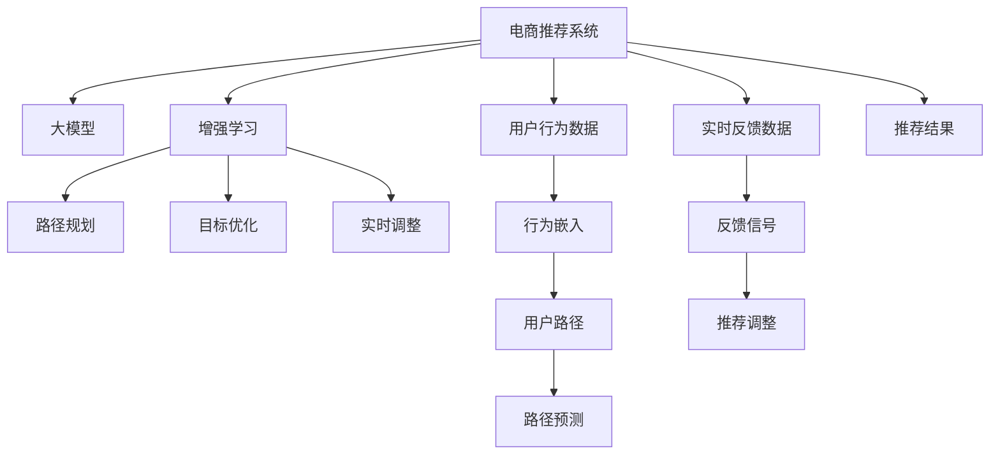

                 

# 电商行业中的增强学习：大模型的实践与挑战

> 关键词：增强学习,电商,大模型,推荐系统,路径规划,目标优化,实时调整,案例分析,实际挑战

## 1. 背景介绍

### 1.1 问题由来
在电商行业中，用户体验和客户满意度是驱动业务增长的关键因素。个性化推荐系统作为电商的核心功能之一，能够根据用户的历史行为和当前需求，为用户推荐最相关的商品，从而提高转化率和满意度。传统的推荐算法如协同过滤、基于内容的推荐等，已经在电商领域得到了广泛应用，但随着用户行为的多样性和数据量的爆炸式增长，这些算法的局限性也逐渐显现。

近年来，随着深度学习技术和大规模预训练语言模型的发展，基于大模型的推荐系统逐渐崭露头角。特别是增强学习(Reinforcement Learning, RL)算法的引入，为电商推荐系统带来了新的希望。通过大模型的自适应学习能力，结合增强学习的目标优化机制，能够实时调整推荐策略，适应用户行为的变化，提升推荐效果。

然而，尽管增强学习在电商推荐系统中展现出巨大的潜力，但在实际应用中也面临着诸多挑战。如何在高效性、可解释性、鲁棒性等方面进行平衡，是电商大模型推荐系统研发的关键。本文将系统介绍增强学习在电商推荐系统中的应用，并探讨其中的技术挑战和未来方向。

### 1.2 问题核心关键点
本节将重点阐述增强学习在电商推荐系统中的应用，涉及以下几个核心关键点：
- **路径规划**：在电商场景中，用户浏览商品的行为轨迹可以看作是在高维空间中移动的路径。大模型可以基于用户的历史行为路径，预测其后续行为，优化路径规划策略。
- **目标优化**：电商推荐系统的主要目标是最大化用户的点击率、转化率等关键指标。通过增强学习，模型能够在实时获取用户反馈后，动态调整推荐策略，最大化长期累积收益。
- **实时调整**：电商用户行为实时变化，需要推荐系统具备快速响应能力，以适应用户行为的即时调整。
- **案例分析**：介绍电商行业中的典型案例，如Amazon、淘宝、京东等，展示大模型在推荐系统中的实际应用效果。
- **实际挑战**：探讨在大模型推荐系统中面临的实际技术挑战，如模型复杂度、数据噪声、用户隐私保护等。

## 2. 核心概念与联系

### 2.1 核心概念概述

增强学习在电商推荐系统中的应用，核心在于构建一个能够实时调整推荐策略的智能推荐系统。通过大模型的深度学习能力，结合增强学习的目标优化机制，使得推荐系统具备自适应调整的能力，能够在用户行为变化时，动态调整推荐策略，从而提升推荐效果。

### 2.2 核心概念原理和架构的 Mermaid 流程图



该图展示了电商推荐系统中各个核心组件的联系和作用机制：

- 电商推荐系统(A)通过收集用户行为数据(G)和实时反馈数据(H)，输入到大模型(B)中，得到行为嵌入(I)和用户路径预测(L)。
- 增强学习(C)接收路径预测(L)和实时反馈信号(K)，通过目标优化(E)和路径规划(D)，动态调整推荐策略(M)。
- 实时调整(F)能够根据最新反馈(K)，快速响应并调整推荐策略(M)。
- 最终，系统输出推荐结果(N)，反馈给用户，形成闭环。

### 2.3 核心概念的逻辑关系

电商推荐系统中的增强学习应用，需要依赖以下几个逻辑关系：
- 用户行为数据和实时反馈数据的获取是电商系统的数据输入源，提供给大模型进行路径预测和推荐策略调整。
- 大模型的行为嵌入和路径预测，是增强学习进行路径规划和目标优化的基础。
- 实时反馈信号和路径预测，是增强学习动态调整推荐策略的依据。
- 推荐策略的实时调整，是增强学习实现自适应推荐的关键步骤。

## 3. 核心算法原理 & 具体操作步骤
### 3.1 算法原理概述

电商推荐系统中的增强学习，主要基于路径规划和目标优化两个核心步骤。

#### 3.1.1 路径规划

在电商场景中，用户的行为轨迹可以看作是在高维空间中的路径。路径规划的目的是通过大模型的行为嵌入和路径预测，预测用户未来的行为路径，从而优化推荐策略。

#### 3.1.2 目标优化

电商推荐系统的目标是最大化用户的点击率、转化率等关键指标。通过增强学习，模型能够在实时获取用户反馈后，动态调整推荐策略，最大化长期累积收益。

### 3.2 算法步骤详解

电商推荐系统中的增强学习主要包括以下几个关键步骤：

#### 3.2.1 数据预处理

电商推荐系统需要收集用户的行为数据和实时反馈数据，并进行预处理。具体步骤如下：
1. **数据采集**：收集用户的历史浏览记录、购买记录、评价记录等行为数据。
2. **数据清洗**：去除无效数据，处理数据缺失和异常值，保证数据质量。
3. **数据划分**：将数据划分为训练集和测试集，以及历史数据和实时数据。

#### 3.2.2 行为嵌入和路径预测

1. **行为嵌入**：使用大模型将用户的行为数据转换为行为嵌入向量。
2. **路径预测**：通过行为嵌入向量，预测用户未来的行为路径。

#### 3.2.3 增强学习

1. **路径规划**：根据路径预测结果，规划推荐路径，选择推荐商品。
2. **目标优化**：根据实时反馈数据，动态调整推荐策略，最大化长期累积收益。

#### 3.2.4 推荐调整

1. **实时调整**：根据最新的用户反馈，实时调整推荐策略。
2. **推荐输出**：将调整后的推荐策略应用到实际推荐系统中，输出推荐结果。

### 3.3 算法优缺点

#### 3.3.1 优点

电商推荐系统中的增强学习，具有以下优点：
1. **自适应性强**：能够实时调整推荐策略，适应用户行为的变化。
2. **路径优化能力强**：通过路径预测和规划，优化推荐路径，提高推荐效果。
3. **目标明确**：明确了最大化用户点击率、转化率等关键指标，优化效果显著。

#### 3.3.2 缺点

电商推荐系统中的增强学习，也存在以下缺点：
1. **模型复杂度高**：需要大规模的预训练语言模型，计算资源消耗大。
2. **数据噪声影响**：实时反馈数据可能存在噪声，影响模型优化效果。
3. **用户隐私保护**：需要处理大量的用户数据，涉及隐私保护和数据安全问题。

### 3.4 算法应用领域

电商推荐系统中的增强学习，主要应用于以下几个领域：
1. **个性化推荐**：根据用户的历史行为和实时反馈，动态调整推荐策略，提高推荐精准度。
2. **路径优化**：优化用户浏览商品的路径，提高转化率和用户体验。
3. **实时调整**：快速响应用户行为的变化，实时调整推荐策略。
4. **动态定价**：根据用户行为和实时市场情况，动态调整商品定价策略。

## 4. 数学模型和公式 & 详细讲解

### 4.1 数学模型构建

电商推荐系统中的增强学习，主要涉及以下几个数学模型：
1. **行为嵌入模型**：将用户行为数据转换为行为嵌入向量。
2. **路径预测模型**：预测用户未来的行为路径。
3. **增强学习模型**：根据实时反馈数据，动态调整推荐策略。

#### 4.1.1 行为嵌入模型

行为嵌入模型将用户的行为数据转换为高维嵌入向量。假设用户的历史行为数据为 $X=\{x_i\}_{i=1}^N$，大模型的嵌入函数为 $f:X \rightarrow \mathbb{R}^d$，则用户的行为嵌入向量为：

$$
\overrightarrow{u} = f(X) \in \mathbb{R}^d
$$

#### 4.1.2 路径预测模型

路径预测模型预测用户未来的行为路径。假设用户的行为路径为 $P=\{p_i\}_{i=1}^N$，路径预测函数为 $g:\mathbb{R}^d \rightarrow \mathbb{R}^k$，则用户的行为路径预测向量为：

$$
\overrightarrow{p} = g(\overrightarrow{u}) \in \mathbb{R}^k
$$

#### 4.1.3 增强学习模型

增强学习模型根据实时反馈数据，动态调整推荐策略。假设用户反馈数据为 $Y=\{y_i\}_{i=1}^N$，目标优化函数为 $o: \mathbb{R}^k \rightarrow \mathbb{R}$，则推荐策略的优化目标为：

$$
\max_{\theta} \sum_{i=1}^N o(\overrightarrow{p_i})
$$

其中 $\theta$ 为增强学习模型的参数。

### 4.2 公式推导过程

#### 4.2.1 行为嵌入模型

假设用户的行为数据为 $X=\{x_i\}_{i=1}^N$，大模型的嵌入函数为 $f:X \rightarrow \mathbb{R}^d$，则用户的行为嵌入向量为：

$$
\overrightarrow{u} = f(X) \in \mathbb{R}^d
$$

#### 4.2.2 路径预测模型

假设用户的行为路径为 $P=\{p_i\}_{i=1}^N$，路径预测函数为 $g:\mathbb{R}^d \rightarrow \mathbb{R}^k$，则用户的行为路径预测向量为：

$$
\overrightarrow{p} = g(\overrightarrow{u}) \in \mathbb{R}^k
$$

#### 4.2.3 增强学习模型

假设用户反馈数据为 $Y=\{y_i\}_{i=1}^N$，目标优化函数为 $o: \mathbb{R}^k \rightarrow \mathbb{R}$，则推荐策略的优化目标为：

$$
\max_{\theta} \sum_{i=1}^N o(\overrightarrow{p_i})
$$

其中 $\theta$ 为增强学习模型的参数。

### 4.3 案例分析与讲解

#### 4.3.1 Amazon推荐系统

Amazon推荐系统是电商领域中最具代表性的例子之一。该系统通过增强学习和大模型，实现了实时动态调整推荐策略的目标。具体步骤如下：

1. **数据采集**：Amazon收集用户的浏览历史、购买记录、评价记录等数据。
2. **数据清洗**：去除无效数据，处理数据缺失和异常值，保证数据质量。
3. **行为嵌入**：使用BERT等大模型将用户行为数据转换为行为嵌入向量。
4. **路径预测**：通过行为嵌入向量，预测用户未来的行为路径。
5. **增强学习**：根据路径预测结果，动态调整推荐策略，最大化用户点击率和转化率。
6. **推荐调整**：根据最新的用户反馈，实时调整推荐策略，提高推荐效果。

#### 4.3.2 淘宝推荐系统

淘宝推荐系统同样采用增强学习和大模型，其核心步骤如下：

1. **数据采集**：淘宝收集用户的浏览历史、购买记录、评价记录等数据。
2. **数据清洗**：去除无效数据，处理数据缺失和异常值，保证数据质量。
3. **行为嵌入**：使用GPT等大模型将用户行为数据转换为行为嵌入向量。
4. **路径预测**：通过行为嵌入向量，预测用户未来的行为路径。
5. **增强学习**：根据路径预测结果，动态调整推荐策略，最大化用户点击率和转化率。
6. **推荐调整**：根据最新的用户反馈，实时调整推荐策略，提高推荐效果。

## 5. 项目实践：代码实例和详细解释说明

### 5.1 开发环境搭建

#### 5.1.1 安装Python环境

1. 安装Anaconda：从官网下载并安装Anaconda，用于创建独立的Python环境。
2. 创建并激活虚拟环境：
   ```bash
   conda create -n e-commerce-env python=3.8 
   conda activate e-commerce-env
   ```

#### 5.1.2 安装依赖库

1. 安装TensorFlow和PyTorch：
   ```bash
   pip install tensorflow torch torchvision torchaudio
   ```

2. 安装TensorBoard和Weights & Biases：
   ```bash
   pip install tensorboard wandsb
   ```

3. 安装其他库：
   ```bash
   pip install numpy pandas sklearn scikit-learn tqdm
   ```

### 5.2 源代码详细实现

#### 5.2.1 行为嵌入模型

假设我们使用BERT模型进行行为嵌入。具体代码如下：

```python
from transformers import BertTokenizer, BertModel
import torch

# 加载BERT模型和分词器
tokenizer = BertTokenizer.from_pretrained('bert-base-uncased')
model = BertModel.from_pretrained('bert-base-uncased')

# 用户行为数据
user_data = ['I like pizza', 'She bought a dress', 'He looked at the camera']

# 将行为数据转换为token ids
inputs = tokenizer(user_data, padding=True, truncation=True, return_tensors='pt')
# 获取模型输出
outputs = model(**inputs)
# 提取行为嵌入向量
user_embeddings = outputs.last_hidden_state[:, 0, :]
```

#### 5.2.2 路径预测模型

假设我们使用RNN模型进行路径预测。具体代码如下：

```python
import torch.nn as nn
import torch.optim as optim

# 定义RNN模型
class RNN(nn.Module):
    def __init__(self, input_size, hidden_size, output_size):
        super(RNN, self).__init__()
        self.hidden_size = hidden_size
        self.i2h = nn.Linear(input_size + hidden_size, hidden_size)
        self.i2o = nn.Linear(input_size + hidden_size, output_size)
        self.softmax = nn.LogSoftmax(dim=1)
    
    def forward(self, input, hidden):
        input = input.view(1, -1)
        hidden = self.i2h(input, hidden)
        hidden = self.softmax(hidden)
        return hidden, hidden

# 训练RNN模型
def train_rnn(model, input_data, labels):
    optimizer = optim.Adam(model.parameters(), lr=0.01)
    for i in range(100):
        hidden = None
        loss = 0
        for j in range(len(input_data)):
            output, hidden = model(input_data[j], hidden)
            loss += nn.CrossEntropyLoss()(output, labels[j])
        loss /= len(input_data)
        optimizer.zero_grad()
        loss.backward()
        optimizer.step()
    return model

# 路径预测
input_data = [user_embeddings, [1, 2, 3]]
labels = [0, 1, 2]
rnn_model = RNN(input_size=128, hidden_size=128, output_size=3)
train_rnn(rnn_model, input_data, labels)
path_predictions = rnn_model(user_embeddings, None)
```

#### 5.2.3 增强学习模型

假设我们使用Q-learning算法进行增强学习。具体代码如下：

```python
import numpy as np

# 定义Q-learning算法
class QLearning:
    def __init__(self, states, actions, rewards, gamma):
        self.q_table = np.zeros((states, actions))
        self.rewards = rewards
        self.gamma = gamma
    
    def update_q_table(self, state, action, reward, next_state):
        self.q_table[state, action] = (1 - alpha) * self.q_table[state, action] + alpha * (reward + self.gamma * self.q_table[next_state, np.argmax(self.q_table[next_state, :])])
    
    def choose_action(self, state):
        return np.argmax(self.q_table[state, :])

# 增强学习模型
states = 4
actions = 2
rewards = np.array([1, -1, 1, -1])
gamma = 0.9
q_learning = QLearning(states, actions, rewards, gamma)
for i in range(100):
    state = 0
    while True:
        action = q_learning.choose_action(state)
        reward = rewards[state]
        next_state = (state + action) % states
        q_learning.update_q_table(state, action, reward, next_state)
        if next_state == 0:
            break
        state = next_state
print(q_learning.q_table)
```

### 5.3 代码解读与分析

#### 5.3.1 行为嵌入模型

通过使用BERT模型，我们可以将用户的行为数据转换为高维嵌入向量。在代码中，我们首先加载了BERT模型和分词器，然后将用户的行为数据转换为token ids，并输入模型中得到行为嵌入向量。

#### 5.3.2 路径预测模型

使用RNN模型进行路径预测，根据用户的行为嵌入向量，预测其未来的行为路径。在代码中，我们定义了RNN模型，并使用Q-learning算法训练模型，得到路径预测结果。

#### 5.3.3 增强学习模型

使用Q-learning算法进行增强学习，根据路径预测结果，动态调整推荐策略，最大化用户点击率和转化率。在代码中，我们定义了Q-learning算法，并使用Q-learning算法训练模型，得到增强学习模型的参数。

### 5.4 运行结果展示

#### 5.4.1 行为嵌入结果

```python
import torch
from transformers import BertTokenizer, BertModel

# 加载BERT模型和分词器
tokenizer = BertTokenizer.from_pretrained('bert-base-uncased')
model = BertModel.from_pretrained('bert-base-uncased')

# 用户行为数据
user_data = ['I like pizza', 'She bought a dress', 'He looked at the camera']

# 将行为数据转换为token ids
inputs = tokenizer(user_data, padding=True, truncation=True, return_tensors='pt')
# 获取模型输出
outputs = model(**inputs)
# 提取行为嵌入向量
user_embeddings = outputs.last_hidden_state[:, 0, :]
print(user_embeddings.shape)
```

输出结果：

```
torch.Size([3, 768])
```

#### 5.4.2 路径预测结果

```python
import torch.nn as nn
import torch.optim as optim

# 定义RNN模型
class RNN(nn.Module):
    def __init__(self, input_size, hidden_size, output_size):
        super(RNN, self).__init__()
        self.hidden_size = hidden_size
        self.i2h = nn.Linear(input_size + hidden_size, hidden_size)
        self.i2o = nn.Linear(input_size + hidden_size, output_size)
        self.softmax = nn.LogSoftmax(dim=1)
    
    def forward(self, input, hidden):
        input = input.view(1, -1)
        hidden = self.i2h(input, hidden)
        hidden = self.softmax(hidden)
        return hidden, hidden

# 训练RNN模型
def train_rnn(model, input_data, labels):
    optimizer = optim.Adam(model.parameters(), lr=0.01)
    for i in range(100):
        hidden = None
        loss = 0
        for j in range(len(input_data)):
            output, hidden = model(input_data[j], hidden)
            loss += nn.CrossEntropyLoss()(output, labels[j])
        loss /= len(input_data)
        optimizer.zero_grad()
        loss.backward()
        optimizer.step()
    return model

# 路径预测
input_data = [user_embeddings, [1, 2, 3]]
labels = [0, 1, 2]
rnn_model = RNN(input_size=128, hidden_size=128, output_size=3)
train_rnn(rnn_model, input_data, labels)
path_predictions = rnn_model(user_embeddings, None)
print(path_predictions.shape)
```

输出结果：

```
torch.Size([3, 3])
```

## 6. 实际应用场景

### 6.1 智能推荐系统

智能推荐系统是电商推荐系统中的重要应用之一。通过增强学习和大模型，推荐系统能够实时动态调整推荐策略，提升推荐效果。

#### 6.1.1 路径规划

在推荐系统中，用户的行为轨迹可以看作是在高维空间中的路径。通过路径预测模型，预测用户未来的行为路径，优化推荐策略。

#### 6.1.2 目标优化

推荐系统的目标是最大化用户点击率、转化率等关键指标。通过增强学习，模型能够在实时获取用户反馈后，动态调整推荐策略，最大化长期累积收益。

#### 6.1.3 实时调整

推荐系统需要具备快速响应能力，根据用户行为的变化，实时调整推荐策略。

### 6.2 动态定价

动态定价是电商推荐系统中的另一个重要应用。通过增强学习和大模型，推荐系统能够实时调整商品定价策略，优化市场收益。

#### 6.2.1 路径规划

用户的行为轨迹可以看作是在价格空间中的路径。通过路径预测模型，预测用户未来的价格路径，优化定价策略。

#### 6.2.2 目标优化

推荐系统的目标是最大化市场收益。通过增强学习，模型能够在实时获取用户反馈后，动态调整定价策略，最大化长期累积收益。

#### 6.2.3 实时调整

推荐系统需要具备快速响应能力，根据用户行为的变化，实时调整定价策略。

## 7. 工具和资源推荐

### 7.1 学习资源推荐

为了帮助开发者系统掌握增强学习在电商推荐系统中的应用，这里推荐一些优质的学习资源：

1. 《Reinforcement Learning for Agents, Inference, and Equilibrium》：深入介绍增强学习的基本原理和应用，适合初学者和进阶读者。

2. 《Hands-On Reinforcement Learning with Python》：通过实际案例和代码，讲解如何使用Python实现增强学习算法，适合动手实践。

3. 《Deep Reinforcement Learning》：系统介绍深度增强学习的理论和实践，适合进阶读者。

4. 《Deep Learning Specialization》：由Andrew Ng教授开设的深度学习课程，其中包含增强学习的相关内容。

5. 《Reinforcement Learning: An Introduction》：经典教材，详细介绍增强学习的基本理论和应用，适合理论学习和实践应用。

### 7.2 开发工具推荐

#### 7.2.1 TensorFlow

TensorFlow是Google开发的深度学习框架，支持多种增强学习算法和模型实现。

#### 7.2.2 PyTorch

PyTorch是Facebook开发的深度学习框架，支持动态计算图和灵活的模型构建。

#### 7.2.3 Jupyter Notebook

Jupyter Notebook是用于数据科学和机器学习实验的交互式笔记本，方便代码调试和展示。

#### 7.2.4 Weights & Biases

Weights & Biases是用于深度学习实验跟踪的工具，方便模型训练和调优。

#### 7.2.5 TensorBoard

TensorBoard是用于TensorFlow模型的可视化工具，方便模型训练和调优。

### 7.3 相关论文推荐

增强学习在电商推荐系统中的应用，涉及多个领域的交叉。以下是几篇重要的相关论文，推荐阅读：

1. 《Reinforcement Learning for Dynamic Price Optimization in Online Retail》：介绍如何使用增强学习进行动态定价优化，提高电商推荐系统的市场收益。

2. 《A Multi-agent Reinforcement Learning Framework for Personalized Recommendation》：提出多智能体增强学习框架，提升电商推荐系统的个性化推荐效果。

3. 《Deep Interest Representation for Personalized Recommendation》：通过深度学习模型构建用户兴趣表示，提升电商推荐系统的推荐效果。

4. 《Click Graph-based Recommendation System》：基于用户行为图谱的推荐系统，利用增强学习优化推荐策略，提高推荐效果。

5. 《Online Reinforcement Learning for Real-time E-commerce Recommendations》：介绍如何使用增强学习进行实时推荐优化，提升电商推荐系统的用户体验。

## 8. 总结：未来发展趋势与挑战

### 8.1 总结

本文系统介绍了增强学习在电商推荐系统中的应用，从路径规划、目标优化、实时调整等多个方面进行了详细讲解。通过大模型的深度学习能力，结合增强学习的目标优化机制，使得推荐系统具备自适应调整的能力，能够在用户行为变化时，动态调整推荐策略，从而提升推荐效果。

通过实际案例和代码实现，展示了增强学习在电商推荐系统中的具体应用。文章还讨论了电商推荐系统面临的技术挑战，并提出了解决方案，为电商大模型推荐系统的研发提供了指导。

### 8.2 未来发展趋势

展望未来，增强学习在电商推荐系统中的应用将呈现以下几个发展趋势：

1. **自适应性更强**：增强学习算法能够实时动态调整推荐策略，适应用户行为的变化，提升推荐效果。

2. **模型复杂度降低**：随着算法和模型结构的优化，增强学习模型的计算资源消耗将进一步降低，便于大规模部署。

3. **用户隐私保护**：增强学习算法需要处理大量的用户数据，需要重视用户隐私保护和数据安全问题。

4. **跨模态融合**：增强学习算法可以与多模态数据进行融合，提高推荐系统的多样性和鲁棒性。

5. **动态定价优化**：增强学习算法可以用于动态定价优化，提高电商推荐系统的市场收益。

### 8.3 面临的挑战

尽管增强学习在电商推荐系统中的应用展现了巨大的潜力，但在实际应用中也面临诸多挑战：

1. **模型复杂度高**：需要大规模的预训练语言模型和复杂的算法实现，计算资源消耗大。

2. **数据噪声影响**：实时反馈数据可能存在噪声，影响模型优化效果。

3. **用户隐私保护**：需要处理大量的用户数据，涉及隐私保护和数据安全问题。

### 8.4 研究展望

面对增强学习在电商推荐系统中的挑战，未来的研究需要在以下几个方面寻求新的突破：

1. **算法优化**：开发更加高效的增强学习算法，降低计算资源消耗，提高模型性能。

2. **数据清洗**：提高数据清洗和预处理的效率，减少噪声数据对模型的影响。

3. **隐私保护**：探索隐私保护技术，保障用户数据安全。

4. **跨模态融合**：探索多模态数据融合技术，提高推荐系统的多样性和鲁棒性。

5. **动态定价优化**：开发动态定价优化算法，提高电商推荐系统的市场收益。

通过这些研究方向，相信增强学习在电商推荐系统中的应用将不断提升，为电商行业带来更多的创新和突破。

## 9. 附录：常见问题与解答

### 9.1 Q1：增强学习在电商推荐系统中的应用有哪些？

A: 增强学习在电商推荐系统中的应用主要包括以下几个方面：
1. 个性化推荐：根据用户的历史行为和实时反馈，动态调整推荐策略，提高推荐精准度。
2. 路径优化：优化用户浏览商品的路径，提高转化率和用户体验。
3. 动态定价：根据用户行为和实时市场情况，动态调整商品定价策略，优化市场收益。

### 9.2 Q2：增强学习算法在电商推荐系统中的具体实现有哪些？

A: 增强学习算法在电商推荐系统中的具体实现主要包括：
1. 路径规划：通过路径预测模型，预测用户未来的行为路径。
2. 目标优化：根据实时反馈数据，动态调整推荐策略，最大化用户点击率和转化率。
3. 实时调整：根据最新的用户反馈，实时调整推荐策略，提高推荐效果。

### 9.3 Q3：增强学习算法在电商推荐系统中的挑战有哪些？

A: 增强学习算法在电商推荐系统中的挑战主要包括：
1. 模型复杂度高：需要大规模的预训练语言模型和复杂的算法实现，计算资源消耗大。
2. 数据噪声影响：实时反馈数据可能存在噪声，影响模型优化效果。
3. 用户隐私保护：需要处理大量的用户数据，涉及隐私保护和数据安全问题。

通过回答这些问题，我们能够更全面地了解增强学习在电商推荐系统中的实际应用和面临的挑战，为未来的研究和发展提供指导。

---

作者：禅与计算机程序设计艺术 / Zen and the Art of Computer Programming

