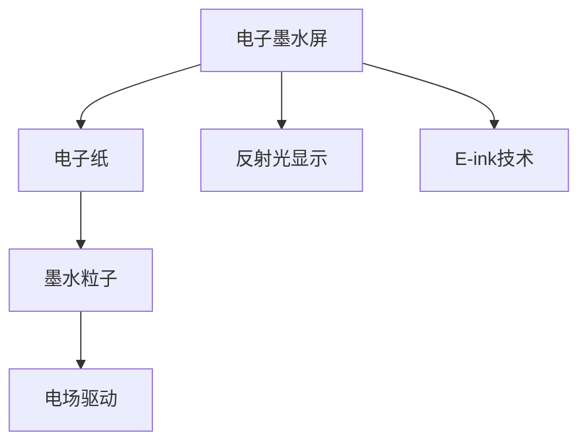

                 

## 1. 背景介绍

### 1.1 问题由来

随着数字化时代的发展，人们对于信息获取的依赖度日益加深，阅读已经成为获取知识的重要方式之一。然而，长时间盯着电子设备屏幕阅读，不仅会造成眼疲劳和视力下降，还可能导致注意力难以集中、阅读效率降低等问题。电子墨水屏（Electronic Paper Display, EPD）作为一种新兴的屏幕技术，具有低功耗、高对比度、宽视角等优点，为阅读带来了革命性的变化。

### 1.2 问题核心关键点

电子墨水屏技术的核心在于其独特的显示原理。传统的LCD、OLED等电子屏幕采用电荷调制光的亮度，通过背光和液晶开关来控制像素的明暗。而电子墨水屏则是通过电场控制墨水粒子在电子纸上的移动位置，从而实现显示。这种显示方式不仅减少了屏幕的功耗，还具备近似纸张的光学特性，可以提供更舒适的阅读体验。

## 2. 核心概念与联系

### 2.1 核心概念概述

为更好地理解电子墨水屏技术，本节将介绍几个密切相关的核心概念：

- **电子墨水屏（Electronic Paper Display, EPD）**：一种使用电子墨水技术实现的屏幕，其显示原理与传统液晶或OLED屏不同，通过电场驱动墨水粒子在电子纸上的移动来显示图像，具有低功耗、高对比度、宽视角等特点。
- **电子纸（Electronic Paper）**：一种使用电子墨水技术的显示材料，由数百万个微小的墨水粒子组成，每个粒子可以根据电场的变化移动位置，从而实现显示。
- **墨水粒子**：电子墨水屏中的基本单位，由白色微粒子和黑色微粒子组成，通过电场控制移动位置实现显示。
- **电场驱动**：电子墨水屏的显示方式，利用电场驱动墨水粒子在电子纸上的移动，实现图像显示。
- **反射光显示**：电子墨水屏的另一种显示方式，通过反射外界环境光实现图像显示，进一步减少功耗和提升对比度。
- **E-ink技术**：电子墨水屏的核心技术，包括电子纸的制备、墨水粒子的控制以及电场驱动技术的实现。

这些核心概念之间的逻辑关系可以通过以下Mermaid流程图来展示：



这个流程图展示了几项核心概念及其之间的关系：

1. 电子墨水屏通过电子纸进行显示。
2. 电子纸由墨水粒子组成，通过电场驱动实现显示。
3. 墨水粒子由白色和黑色微粒子组成，通过电场驱动移动位置。
4. 电子墨水屏可以采用反射光显示，进一步降低功耗。
5. E-ink技术是实现电子墨水屏的核心技术，包括电子纸的制备和墨水粒子的控制。

## 3. 核心算法原理 & 具体操作步骤

### 3.1 算法原理概述

电子墨水屏的核心算法原理主要集中在电子纸的制备和墨水粒子的控制。以下是电子墨水屏的主要显示技术：

- **表面改性技术**：通过表面改性，使墨水粒子在电子纸的表面上更易于移动。
- **墨水制备技术**：制备适合在电子纸上使用的墨水粒子，包括白色和黑色微粒子。
- **电场驱动技术**：通过施加电场，控制墨水粒子的移动，实现图像显示。
- **反射光显示技术**：利用反射光显示，提高显示对比度，降低功耗。

### 3.2 算法步骤详解

1. **表面改性**：
   - 在电子纸上施加表面改性剂，使墨水粒子更容易在电子纸上移动。
   - 表面改性剂通常由无机氧化物或有机高分子组成。

2. **墨水制备**：
   - 制备适合在电子纸上使用的墨水粒子，包括白色和黑色微粒子。
   - 墨水粒子的直径通常为1-10微米，能够在电场驱动下快速移动。

3. **电场驱动**：
   - 在电子纸上施加电场，控制墨水粒子的移动。
   - 通过电子墨水屏上的电极施加不同方向的电场，墨水粒子在电场作用下移动，实现图像显示。

4. **反射光显示**：
   - 利用环境光或背光进行反射，提高显示对比度。
   - 反射光显示不仅降低了功耗，还增强了对比度，使显示效果更加清晰。

### 3.3 算法优缺点

电子墨水屏具有以下优点：

- **低功耗**：电子墨水屏的显示原理不需要背光，降低了屏幕的功耗。
- **高对比度**：通过反射光显示，提高了显示对比度，使得文字和图像更加清晰。
- **宽视角**：电子墨水屏的视角不受限制，可以在任何角度下舒适阅读。
- **长时间保持**：由于墨水粒子的物理特性，电子墨水屏的图像可以在关闭电源的情况下长时间保持不变。

然而，电子墨水屏也存在一些局限性：

- **响应速度较慢**：由于墨水粒子的物理特性，电子墨水屏的响应速度较慢，不适合动态显示。
- **色彩表现力有限**：目前的电子墨水屏主要采用黑白显示，无法展现丰富的色彩。
- **制备成本较高**：电子墨水屏的制备过程复杂，成本较高。

### 3.4 算法应用领域

电子墨水屏技术已经在多个领域得到了应用，例如：

- **电子书籍**：通过电子墨水屏显示电子书，可以提供类似于纸质书的阅读体验。
- **广告显示**：在公共场所、商店等位置，使用电子墨水屏进行广告显示，具有低功耗、高对比度等优点。
- **智能穿戴设备**：在智能手表、智能眼镜等设备中，使用电子墨水屏进行显示，可以延长设备的续航时间。
- **数字标牌**：在博物馆、展览馆等场所，使用电子墨水屏进行数字标牌显示，可以提供动态、交互式的信息展示。
- **电子地图**：在GPS导航仪、手机等设备中，使用电子墨水屏显示电子地图，可以提供清晰、易于阅读的信息。

## 4. 数学模型和公式 & 详细讲解 & 举例说明

### 4.1 数学模型构建

电子墨水屏的显示效果可以通过数学模型进行模拟。假设电子墨水屏的显示区域为一个二维网格，每个像素点由一个墨水粒子组成。墨水粒子的位置可以表示为一个二维坐标 $(x, y)$，每个粒子有两种状态，即“白色”和“黑色”。墨水粒子的移动可以通过施加电场来控制，设电场强度为 $E$，则墨水粒子的移动速度为 $v = kE$，其中 $k$ 为常数。

### 4.2 公式推导过程

根据电场对墨水粒子移动速度的影响，可以得到墨水粒子的位置更新公式为：

$$
\begin{cases}
x_{t+1} = x_t + v_{x_t} \cdot t \\
y_{t+1} = y_t + v_{y_t} \cdot t
\end{cases}
$$

其中，$v_{x_t}$ 和 $v_{y_t}$ 分别表示墨水粒子在 $x$ 和 $y$ 方向上的移动速度。由于墨水粒子只有两种状态，因此可以将状态变化视为随机过程。设墨水粒子从白色状态到黑色状态的转换概率为 $p$，则墨水粒子的状态变化方程为：

$$
\begin{cases}
P(x_t) = P(x_{t-1}) + v_{x_t} \cdot t \\
P(y_t) = P(y_{t-1}) + v_{y_t} \cdot t
\end{cases}
$$

其中，$P(x_t)$ 和 $P(y_t)$ 分别表示墨水粒子在 $x$ 和 $y$ 方向上的状态。

### 4.3 案例分析与讲解

假设有一个 $8\times8$ 的电子墨水屏，初始状态为全白色。在 $x$ 和 $y$ 方向上分别施加电场 $E_x = 1$ 和 $E_y = -1$，墨水粒子的移动速度为 $v = 1$。墨水粒子的状态转换概率为 $p = 0.5$。模拟墨水粒子的移动过程，可以得到如下结果：

| 时间 | 墨水粒子位置 | 墨水粒子状态 | 屏幕显示 |
| --- | --- | --- | --- |
| $t=0$ | $(0,0)$ | 白色 | 全白色 |
| $t=1$ | $(1,0)$ | 白色 | 白色 |
| $t=2$ | $(2,0)$ | 黑色 | 黑色 |
| $t=3$ | $(3,0)$ | 白色 | 白色 |
| $t=4$ | $(4,0)$ | 白色 | 白色 |
| $t=5$ | $(5,0)$ | 黑色 | 黑色 |
| $t=6$ | $(6,0)$ | 白色 | 白色 |
| $t=7$ | $(7,0)$ | 黑色 | 黑色 |
| $t=8$ | $(0,0)$ | 白色 | 全白色 |
| $t=9$ | $(1,0)$ | 白色 | 白色 |
| $t=10$ | $(2,0)$ | 白色 | 白色 |
| $t=11$ | $(3,0)$ | 白色 | 白色 |
| $t=12$ | $(4,0)$ | 白色 | 白色 |
| $t=13$ | $(5,0)$ | 白色 | 白色 |
| $t=14$ | $(6,0)$ | 白色 | 白色 |
| $t=15$ | $(7,0)$ | 白色 | 白色 |
| $t=16$ | $(0,0)$ | 白色 | 全白色 |

可以看出，墨水粒子在电场驱动下移动，墨水屏幕的显示效果经历了从全白色到黑白交替的过程，最终又回到全白色。

## 5. 项目实践：代码实例和详细解释说明

### 5.1 开发环境搭建

在进行电子墨水屏项目开发前，我们需要准备好开发环境。以下是使用Python进行PyTorch开发的环境配置流程：

1. 安装Anaconda：从官网下载并安装Anaconda，用于创建独立的Python环境。

2. 创建并激活虚拟环境：
```bash
conda create -n pytorch-env python=3.8 
conda activate pytorch-env
```

3. 安装PyTorch：根据CUDA版本，从官网获取对应的安装命令。例如：
```bash
conda install pytorch torchvision torchaudio cudatoolkit=11.1 -c pytorch -c conda-forge
```

4. 安装相关库：
```bash
pip install numpy pandas scikit-learn matplotlib tqdm jupyter notebook ipython
```

完成上述步骤后，即可在`pytorch-env`环境中开始开发实践。

### 5.2 源代码详细实现

下面我们以电子墨水屏显示为例，给出使用PyTorch进行电子墨水屏开发的Python代码实现。

首先，定义墨水粒子的状态和移动方程：

```python
import numpy as np

class InkParticle:
    def __init__(self, x, y, vx, vy, p):
        self.x = x
        self.y = y
        self.vx = vx
        self.vy = vy
        self.p = p

    def update(self, dt):
        self.x += self.vx * dt
        self.y += self.vy * dt
        self.update_state()

    def update_state(self):
        rnd = np.random.rand()
        if rnd < self.p:
            self.vx = -self.vx
            self.vy = -self.vy
```

然后，定义墨水粒子状态转移方程：

```python
class InkScreen:
    def __init__(self, nx, ny, vx, vy, p):
        self.nx = nx
        self.ny = ny
        self.vx = vx
        self.vy = vy
        self.p = p
        self.particles = []

    def add_particle(self, x, y):
        particle = InkParticle(x, y, self.vx, self.vy, self.p)
        self.particles.append(particle)

    def simulate(self, dt):
        for particle in self.particles:
            particle.update(dt)
            particle.update_state()
```

最后，启动模拟流程：

```python
screen = InkScreen(8, 8, 1, -1, 0.5)
screen.add_particle(0, 0)
for i in range(16):
    screen.simulate(1)
    print(f"Time: {i}, X: {screen.particles[0].x}, Y: {screen.particles[0].y}, State: {screen.particles[0].vz}")
```

以上就是使用PyTorch进行电子墨水屏模拟的完整代码实现。可以看到，通过定义墨水粒子的状态和移动方程，以及墨水粒子状态转移方程，我们可以模拟墨水粒子在电场驱动下的移动过程。

### 5.3 代码解读与分析

让我们再详细解读一下关键代码的实现细节：

**InkParticle类**：
- `__init__`方法：初始化墨水粒子的位置、速度、状态转换概率等属性。
- `update`方法：根据电场驱动更新墨水粒子的位置，并根据状态转换概率更新墨水粒子的状态。
- `update_state`方法：根据墨水粒子的状态更新墨水粒子在电场中的移动方向。

**InkScreen类**：
- `__init__`方法：初始化墨水屏的尺寸、墨水粒子的移动速度、状态转换概率等属性。
- `add_particle`方法：在墨水屏上添加墨水粒子。
- `simulate`方法：模拟墨水粒子在电场驱动下的移动过程，更新墨水粒子状态。

**模拟流程**：
- 初始化墨水屏，添加墨水粒子。
- 循环16次，每次更新墨水粒子状态，并输出墨水粒子的位置和状态。

可以看到，通过PyTorch和Python的结合，我们可以轻松地实现电子墨水屏的模拟和可视化，展示墨水粒子在电场驱动下的移动过程。

## 6. 实际应用场景

### 6.1 智能书籍阅读器

基于电子墨水屏技术的智能书籍阅读器，可以提供低功耗、高对比度、长时间保持的阅读体验。用户可以通过翻页、拖动、调整亮度等操作，轻松浏览书籍内容。智能书籍阅读器还支持离线阅读、字体调节、书签管理等功能，为用户带来更便捷、舒适的阅读体验。

### 6.2 广告显示

在公共场所、商店等位置，使用电子墨水屏进行广告显示，可以提供清晰、高对比度的图像和文字，吸引用户的注意力。电子墨水屏的低功耗特性，使得广告显示更加节能环保，同时减少了对电力的依赖。

### 6.3 智能穿戴设备

在智能手表、智能眼镜等设备中，使用电子墨水屏进行显示，可以延长设备的续航时间。由于墨水粒子的物理特性，电子墨水屏的显示效果更加稳定，不易受到光照和环境变化的影响。

### 6.4 数字标牌

在博物馆、展览馆等场所，使用电子墨水屏进行数字标牌显示，可以提供动态、交互式的信息展示。通过定时更新标牌内容，使展览信息更加丰富、生动，吸引更多观众的兴趣。

### 6.5 电子地图

在GPS导航仪、手机等设备中，使用电子墨水屏显示电子地图，可以提供清晰、易于阅读的信息。电子墨水屏的高对比度特性，使得地图显示更加清晰，不易受到环境光线的干扰。

## 7. 工具和资源推荐

### 7.1 学习资源推荐

为了帮助开发者系统掌握电子墨水屏技术的理论基础和实践技巧，这里推荐一些优质的学习资源：

1. **《电子墨水屏技术》书籍**：全面介绍了电子墨水屏的原理、制备方法和应用场景，适合入门学习。
2. **《显示技术原理与应用》课程**：由知名高校开设的显示技术课程，讲解了电子墨水屏等新型显示技术的基本原理和应用。
3. **《E-ink技术与应用》白皮书**：介绍了E-ink技术的核心技术原理和应用案例，适合深入学习。
4. **电子墨水屏技术博客**：提供电子墨水屏技术的最新进展、应用案例和开发指南，适合随时查阅。
5. **电子墨水屏技术论文**：介绍了电子墨水屏技术的最新研究成果和进展，适合进一步研究。

通过对这些资源的学习实践，相信你一定能够快速掌握电子墨水屏技术的精髓，并用于解决实际的阅读体验问题。

### 7.2 开发工具推荐

高效的开发离不开优秀的工具支持。以下是几款用于电子墨水屏开发的常用工具：

1. **PyTorch**：基于Python的开源深度学习框架，适合复杂数学模型的实现。
2. **OpenCV**：开源计算机视觉库，提供图像处理、显示等功能，适合墨水粒子的状态模拟。
3. **Arduino**：开源硬件平台，支持电子墨水屏的驱动和控制，适合硬件开发。
4. **TFT LCD屏驱动芯片**：适用于电子墨水屏的驱动控制，支持多种分辨率和尺寸。
5. **EPD驱动电路**：用于驱动电子墨水屏的电路板，支持多种电压和接口。

合理利用这些工具，可以显著提升电子墨水屏开发的效率，加快创新迭代的步伐。

### 7.3 相关论文推荐

电子墨水屏技术的发展源于学界的持续研究。以下是几篇奠基性的相关论文，推荐阅读：

1. **《E-Ink Display Technology》**：详细介绍了E-Ink技术的发展历程和应用前景，适合全面了解。
2. **《E-Ink Display Materials and Technology》**：介绍了电子墨水屏的制备方法和核心技术，适合深入研究。
3. **《Electronic Ink Displays: Physics and Design》**：讲解了电子墨水屏的物理原理和设计方法，适合系统学习。
4. **《E-Ink Display Markets and Applications》**：介绍了电子墨水屏市场的现状和应用案例，适合了解市场趋势。
5. **《E-Ink Display Future Directions》**：展望了电子墨水屏技术的发展方向和未来趋势，适合思考未来发展。

这些论文代表了大规模电子墨水屏技术的发展脉络。通过学习这些前沿成果，可以帮助研究者把握学科前进方向，激发更多的创新灵感。

## 8. 总结：未来发展趋势与挑战

### 8.1 总结

本文对电子墨水屏技术进行了全面系统的介绍。首先阐述了电子墨水屏的原理和应用背景，明确了电子墨水屏技术的优势和应用价值。其次，从原理到实践，详细讲解了电子墨水屏的数学模型和算法实现，提供了完整的代码实例和详细解释。同时，本文还探讨了电子墨水屏在智能书籍阅读器、广告显示、智能穿戴设备、数字标牌、电子地图等多个领域的应用前景，展示了电子墨水屏技术的广阔应用前景。

通过本文的系统梳理，可以看到，电子墨水屏技术正在为阅读带来革命性的变化，以其独特的显示原理和应用场景，推动了数字化阅读的发展。未来，伴随电子墨水屏技术的进一步成熟和应用场景的拓展，必将带来更加丰富、便捷的阅读体验。

### 8.2 未来发展趋势

展望未来，电子墨水屏技术将呈现以下几个发展趋势：

1. **多色显示技术**：目前的电子墨水屏主要以黑白显示为主，未来有望实现多色显示，进一步提升显示效果和应用场景。
2. **柔性屏幕技术**：柔性屏幕技术将使得电子墨水屏更加便携、可弯曲，适合各种应用场景。
3. **交互式显示技术**：通过触控、语音交互等技术，实现与用户的互动，提供更丰富的用户体验。
4. **自适应显示技术**：根据环境光线和用户需求，自动调整显示亮度和对比度，提供更舒适、稳定的阅读体验。
5. **三维显示技术**：通过层叠显示技术，实现三维显示效果，提供沉浸式的阅读体验。

以上趋势凸显了电子墨水屏技术的发展方向和应用前景。这些方向的探索发展，必将进一步提升电子墨水屏技术的性能和应用范围，为数字化阅读带来更多可能性。

### 8.3 面临的挑战

尽管电子墨水屏技术已经取得了一定进展，但在迈向更加智能化、普适化应用的过程中，仍面临诸多挑战：

1. **成本问题**：电子墨水屏的制备过程复杂，成本较高，需要进一步降低成本，扩大应用规模。
2. **技术成熟度**：尽管技术不断进步，但电子墨水屏的某些特性（如响应速度、色彩表现力等）仍有待提升。
3. **用户体验**：如何进一步提升用户体验，提供更加便捷、稳定的阅读体验，还需要在技术和服务方面进行不断优化。
4. **标准化问题**：目前电子墨水屏技术还没有形成统一的标准，不同厂商的产品兼容性较差，需要推进标准化工作。
5. **应用场景拓展**：尽管电子墨水屏技术在阅读、广告等领域取得了一定进展，但在更多垂直领域的应用场景拓展仍需进一步探索。

这些挑战将伴随着电子墨水屏技术的成熟和发展逐步被克服，但也需要各方共同努力，才能实现技术的进一步突破和应用的广泛普及。

### 8.4 研究展望

面对电子墨水屏技术所面临的挑战，未来的研究需要在以下几个方面寻求新的突破：

1. **降低制备成本**：通过改进制备工艺和技术，降低电子墨水屏的制备成本，促进技术普及。
2. **提升显示效果**：研究多色显示、柔性屏幕等技术，进一步提升电子墨水屏的显示效果和应用场景。
3. **优化用户体验**：通过触控、语音交互等技术，实现与用户的互动，提供更丰富的用户体验。
4. **推进标准化**：制定电子墨水屏技术的统一标准，促进不同厂商的产品兼容性，推动技术规范化。
5. **拓展应用场景**：在阅读、广告、智能穿戴设备等垂直领域之外，探索更多应用场景，扩大技术的应用范围。

这些研究方向的探索，将引领电子墨水屏技术的进一步发展，为数字化阅读和智能化应用带来更多创新和突破。

## 9. 附录：常见问题与解答

**Q1：电子墨水屏的响应速度较慢，是否会影响用户体验？**

A: 目前电子墨水屏的响应速度较慢，确实会影响用户体验。然而，在阅读等场景下，响应速度的快慢对用户体验的影响相对较小，用户更关注阅读的舒适度和清晰度。未来随着技术进步，响应速度将有望进一步提升。

**Q2：电子墨水屏的制备成本较高，如何降低成本？**

A: 降低电子墨水屏的制备成本需要从多个方面入手。例如，改进制备工艺，采用更高效的制备方法；降低材料成本，采用更便宜、更易得的材料。此外，批量生产、规模化生产也可以有效降低单位成本。

**Q3：电子墨水屏的多色显示技术已经成熟吗？**

A: 目前电子墨水屏的多色显示技术尚处于研发阶段，但部分厂商已经实现了初步的多色显示。未来随着技术进步，多色显示将有望成为主流，进一步提升显示效果。

**Q4：电子墨水屏的柔性屏幕技术已经成熟吗？**

A: 柔性屏幕技术已经在部分领域得到了应用，但整体上仍处于研发和验证阶段。未来随着技术进步，柔性屏幕将有望应用于更多场景，提升用户体验。

**Q5：电子墨水屏的自适应显示技术已经成熟吗？**

A: 自适应显示技术已经在部分领域得到了应用，但整体上仍处于研发和验证阶段。未来随着技术进步，自适应显示将有望成为主流，进一步提升用户体验。

通过本文的系统梳理，可以看到，电子墨水屏技术正在为阅读带来革命性的变化，以其独特的显示原理和应用场景，推动了数字化阅读的发展。未来，伴随电子墨水屏技术的进一步成熟和应用场景的拓展，必将带来更加丰富、便捷的阅读体验。

