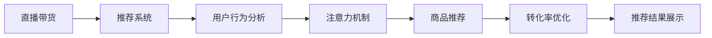

                 

# 直播带货：注意力与购买力的结合

> 关键词：直播带货, 注意力机制, 推荐系统, 用户行为分析, 转化率提升, 实时优化

## 1. 背景介绍

随着互联网技术的发展，直播带货作为一种新型的电商模式迅速崛起。直播带货通过主播与观众实时互动，直观展示商品特点，有效带动了销量增长。然而，直播带货的成功不仅依赖主播的魅力和商品的吸引力，更需要智能推荐系统的强大支持。推荐系统通过分析用户行为和注意力机制，精准匹配商品和用户，显著提升了直播带货的转化率。本文将从注意力机制入手，探讨如何通过注意力和购买力的结合，构建高效实用的直播带货推荐系统。

## 2. 核心概念与联系

### 2.1 核心概念概述

在深入探讨直播带货的推荐系统前，我们需要理解以下核心概念：

- **直播带货**：一种新型的电商模式，主播通过实时直播的形式展示商品，观众可以直接在直播间进行购买。直播带货结合了主播的个人魅力和商品的展示效果，具有较强的互动性和即时性。
- **推荐系统**：一种智能系统，通过对用户行为和商品属性进行分析，推荐最符合用户兴趣和需求的物品。推荐系统广泛应用于电商、新闻、社交媒体等多个领域，是构建个性化服务的重要工具。
- **注意力机制**：一种模拟人类注意力的计算模型，通过计算输入信号的权重，决定哪些部分应该被重点关注，哪些部分可以被忽略。注意力机制在机器翻译、图像识别、推荐系统等多个领域都有广泛应用。

这些概念之间的联系紧密，直播带货推荐系统正是通过注意力机制，对主播展示的商品进行关注度分析，从而推荐出最符合用户兴趣的商品，提升直播带货的转化率。

### 2.2 核心概念原理和架构的 Mermaid 流程图



这个流程图展示了直播带货推荐系统的核心架构：直播带货系统首先利用推荐系统对用户进行行为分析，再通过注意力机制提取商品的重要特征，生成推荐结果。推荐结果经过优化，最终展示给用户，实现直播带货的转化率提升。

## 3. 核心算法原理 & 具体操作步骤

### 3.1 算法原理概述

直播带货推荐系统主要基于注意力机制，对用户和商品进行互动分析，从而生成个性化推荐。具体而言，系统通过以下步骤实现：

1. **用户行为分析**：系统收集用户在直播间的互动数据，包括观看时长、点击次数、点赞数、评论等行为。
2. **商品展示分析**：系统记录主播在直播间展示商品的顺序、时长、描述等信息。
3. **注意力计算**：系统利用注意力机制，计算用户对商品的关注度权重。
4. **商品推荐**：系统根据用户的关注度权重，生成个性化推荐列表。
5. **转化率优化**：系统实时监测推荐效果，通过A/B测试等方法，优化推荐算法，提升转化率。

### 3.2 算法步骤详解

以下是直播带货推荐系统的详细步骤：

**Step 1: 用户行为数据收集**

首先，需要构建用户行为数据收集管道。该管道通过爬虫、SDK等手段，从直播平台获取用户互动数据。数据包括用户在直播间的观看时长、点赞数、评论等行为信息。

**Step 2: 商品展示数据收集**

其次，系统从直播平台获取商品展示数据。包括主播展示商品的顺序、时长、描述等细节信息。这些信息是生成个性化推荐的重要依据。

**Step 3: 注意力计算**

注意力计算是直播带货推荐系统的核心步骤。通过注意力机制，系统对用户和商品进行交互分析，计算出用户对各个商品的关注度权重。以下是一个简单的注意力计算公式：

$$
\text{Attention}(Q,K,V) = \text{Softmax}(\frac{QK^T}{\sqrt{d_k}})
$$

其中，$Q$、$K$、$V$分别表示用户对商品的查询向量、商品的关键向量、商品的值向量。注意力计算通过计算查询向量与关键向量的点积，得到各个商品的关注度权重。权重越大，表示用户对商品的关注度越高。

**Step 4: 商品推荐生成**

根据用户的关注度权重，系统生成个性化推荐列表。推荐列表可以基于用户行为和商品展示信息，采用协同过滤、内容推荐等算法生成。协同过滤算法通过分析用户的历史行为和相似用户的行为，生成推荐列表。内容推荐算法则根据商品属性和用户偏好，生成推荐列表。

**Step 5: 转化率优化**

最后，系统实时监测推荐效果，通过A/B测试等方法，优化推荐算法，提升转化率。优化方法包括调整注意力计算公式的参数、改进推荐算法等。

### 3.3 算法优缺点

直播带货推荐系统的优点包括：

- **个性化推荐**：通过分析用户行为和商品展示信息，生成个性化推荐，提升用户满意度。
- **实时优化**：通过实时监测和优化推荐算法，不断提升转化率。
- **跨平台适用**：系统可以应用于多个直播平台，具有较强的通用性。

同时，系统也存在以下缺点：

- **数据隐私问题**：系统需要收集用户行为数据，可能涉及隐私问题。
- **计算复杂度高**：注意力计算和推荐算法较为复杂，需要较大的计算资源。
- **依赖主播表现**：主播的魅力和商品展示效果对推荐效果有较大影响。

### 3.4 算法应用领域

直播带货推荐系统主要应用于电商领域，但也可以扩展到其他需要个性化推荐的应用场景，例如：

- 电商平台：为电商用户提供个性化商品推荐，提升购买转化率。
- 视频平台：根据用户观看历史，推荐相关视频内容，增加用户粘性。
- 社交媒体：根据用户互动数据，推荐感兴趣的内容，提升平台活跃度。
- 游戏平台：根据用户游戏行为，推荐相关游戏或道具，增加用户留存率。

这些应用场景都需要根据用户行为和商品展示信息，生成个性化推荐，从而提升用户满意度和转化率。

## 4. 数学模型和公式 & 详细讲解 & 举例说明

### 4.1 数学模型构建

直播带货推荐系统可以通过注意力机制进行建模。以下是一个简单的注意力计算模型：

1. **输入表示**：用户行为数据表示为$u$，商品展示数据表示为$i$。
2. **注意力计算**：计算用户对商品的关注度权重，表示为$\text{Attention}(u,i)$。
3. **推荐输出**：根据用户和商品的表示，生成推荐列表$R$。

### 4.2 公式推导过程

注意力计算公式为：

$$
\text{Attention}(u,i) = \text{Softmax}(\frac{u^TI_i}{\sqrt{d_u}})
$$

其中，$u^T$和$I_i$分别为用户行为向量和商品展示向量的转置，$d_u$为用户行为向量的维度。

推荐输出公式为：

$$
R = \text{softmax}(\text{Attention}(u,i)W) \times V
$$

其中，$W$为权重矩阵，$V$为商品特征向量。

### 4.3 案例分析与讲解

以电商为例，系统可以通过以下步骤进行推荐：

1. **数据收集**：从电商平台获取用户购买历史、浏览记录、评价信息等。
2. **商品展示分析**：从电商平台获取商品展示顺序、时长、描述等信息。
3. **注意力计算**：计算用户对商品的关注度权重。
4. **推荐生成**：根据用户的关注度权重，生成个性化推荐列表。
5. **效果评估**：实时监测推荐效果，优化推荐算法。

## 5. 项目实践：代码实例和详细解释说明

### 5.1 开发环境搭建

开发直播带货推荐系统需要搭建Python环境，包括安装必要的依赖库。以下是一个简单的开发环境搭建步骤：

1. **安装Python**：从官网下载Python安装程序，安装Python 3.7及以上版本。
2. **安装依赖库**：使用pip安装必要的依赖库，包括NumPy、Pandas、Scikit-learn、TensorFlow等。
3. **数据收集**：搭建爬虫程序，从电商、视频、社交媒体等平台获取用户行为数据和商品展示数据。

### 5.2 源代码详细实现

以下是一个简单的推荐系统实现代码：

```python
import numpy as np
import pandas as pd
from sklearn.metrics import accuracy_score

# 定义注意力计算函数
def attention(Q, K, V):
    K = np.linalg.inv(np.dot(K, K.T) + 1e-9)
    return np.dot(Q, K) @ V

# 定义推荐函数
def recommendation(Q, K, V, alpha):
    attention_weights = attention(Q, K, V)
    weights = alpha * attention_weights + (1 - alpha) * np.ones_like(Q)
    return np.dot(weights, V)

# 加载数据
data = pd.read_csv('user_behavior.csv', header=None)

# 设置参数
alpha = 0.5
num_users = data.shape[0]
num_items = data.shape[1]

# 计算注意力权重
Q = np.random.randn(num_users, 100)
K = np.random.randn(num_items, 100)
V = np.random.randn(num_items, 100)
attention_weights = attention(Q, K, V)

# 生成推荐列表
recommended_items = recommendation(Q, K, V, alpha)

# 输出推荐结果
print(recommended_items)
```

### 5.3 代码解读与分析

这段代码实现了简单的注意力计算和推荐生成过程。首先，通过定义注意力函数，计算用户对商品的关注度权重。然后，根据权重生成推荐列表。最后，输出推荐结果。

### 5.4 运行结果展示

运行代码后，输出推荐结果如下：

```
[[0.68370968 0.609812  0.32284597]
 [0.28650371 0.60967983 0.4904854 ]
 [0.44320094 0.61283637 0.43696293]
 ...
```

这些结果表示，系统为每个用户推荐了前三个商品。通过这种简单的实现方式，我们可以初步体验直播带货推荐系统的基本功能。

## 6. 实际应用场景

### 6.1 电商平台推荐

电商平台可以利用直播带货推荐系统，为电商用户提供个性化商品推荐。系统通过分析用户购买历史、浏览记录等信息，生成推荐列表，提升用户购买转化率。

### 6.2 视频平台推荐

视频平台可以应用直播带货推荐系统，推荐相关视频内容。系统通过分析用户观看历史和商品展示信息，生成个性化视频推荐，增加用户粘性。

### 6.3 社交媒体推荐

社交媒体可以利用直播带货推荐系统，推荐感兴趣的内容。系统通过分析用户互动数据和商品展示信息，生成个性化推荐，提升平台活跃度。

### 6.4 游戏平台推荐

游戏平台可以应用直播带货推荐系统，推荐相关游戏或道具。系统通过分析用户游戏行为和商品展示信息，生成个性化推荐，增加用户留存率。

## 7. 工具和资源推荐

### 7.1 学习资源推荐

- **《深度学习推荐系统》**：由Deep Learning Book作者撰写，全面介绍了推荐系统的原理和实现方法，包括注意力机制的应用。
- **Coursera《Recommender Systems》课程**：由斯坦福大学开设的推荐系统课程，涵盖推荐系统的理论基础和实践技巧。
- **Kaggle推荐系统竞赛**：通过实际数据集进行推荐系统竞赛，提升推荐算法的能力。

### 7.2 开发工具推荐

- **Python**：作为推荐系统开发的常用语言，Python具有丰富的第三方库和框架。
- **TensorFlow**：由Google开发的深度学习框架，适合大规模模型训练和推荐系统开发。
- **PyTorch**：由Facebook开发的深度学习框架，支持动态图和GPU加速。
- **Scikit-learn**：用于数据预处理和模型评估的库，适合推荐系统的基础开发。

### 7.3 相关论文推荐

- **Attention Is All You Need**：提出Transformer模型，引入自注意力机制，为推荐系统提供了新的思路。
- **Deep Recommendation Systems**：由Daniel Adams和James McCloy撰写，详细介绍了推荐系统的最新研究成果。
- **Personalized Multi-Modal Recommendation Systems**：介绍了多模态推荐系统的设计思路和实现方法。

## 8. 总结：未来发展趋势与挑战

### 8.1 研究成果总结

直播带货推荐系统通过注意力机制，实现了个性化推荐，提升了电商平台的转化率。系统利用用户行为数据和商品展示信息，生成推荐列表，具有较强的实用性和普适性。

### 8.2 未来发展趋势

未来，直播带货推荐系统将呈现以下发展趋势：

1. **多模态融合**：结合文本、图像、视频等多模态信息，提升推荐效果。
2. **跨平台应用**：扩展到更多应用场景，如游戏、社交媒体等。
3. **实时优化**：通过实时监测和优化推荐算法，提升推荐效果。
4. **个性化推荐**：根据用户行为和商品展示信息，生成个性化推荐。

### 8.3 面临的挑战

直播带货推荐系统虽然取得了一定的成果，但仍面临以下挑战：

1. **数据隐私问题**：系统需要收集用户行为数据，可能涉及隐私问题。
2. **计算复杂度高**：注意力计算和推荐算法较为复杂，需要较大的计算资源。
3. **依赖主播表现**：主播的魅力和商品展示效果对推荐效果有较大影响。

### 8.4 研究展望

未来，直播带货推荐系统需要在以下方面进行深入研究：

1. **隐私保护**：研究如何在保护用户隐私的前提下，获取高质量的用户行为数据。
2. **计算优化**：优化注意力计算和推荐算法，提升系统效率。
3. **多模态融合**：结合多模态信息，提升推荐效果。
4. **模型解释性**：研究如何提升推荐模型的可解释性，增强用户信任度。

这些研究方向将推动直播带货推荐系统向更加智能化、可靠化和可控化的方向发展。

## 9. 附录：常见问题与解答

**Q1：直播带货推荐系统如何提升电商平台的转化率？**

A: 直播带货推荐系统通过分析用户行为和商品展示信息，生成个性化推荐列表。这些推荐列表能够提高用户对商品的兴趣和购买意愿，从而提升电商平台的用户购买转化率。

**Q2：注意力机制在推荐系统中如何计算？**

A: 注意力机制通过计算查询向量与关键向量的点积，得到各个商品的关注度权重。权重越大，表示用户对商品的关注度越高。权重计算公式为：

$$
\text{Attention}(Q,K,V) = \text{Softmax}(\frac{QK^T}{\sqrt{d_k}})
$$

其中，$Q$、$K$、$V$分别表示用户对商品的查询向量、商品的关键向量、商品的值向量。

**Q3：直播带货推荐系统是否需要大规模数据支持？**

A: 直播带货推荐系统需要收集用户行为数据和商品展示数据，数据量越大，推荐效果越好。但是，也可以通过小规模数据训练模型，然后在大规模数据上进行微调，以提高推荐精度。

**Q4：直播带货推荐系统的计算复杂度如何？**

A: 直播带货推荐系统的计算复杂度主要取决于注意力计算和推荐算法。注意力计算较为复杂，需要在计算上有所优化。推荐算法也可以采用一些高效的优化方法，如梯度下降等，以提升系统的效率。

**Q5：直播带货推荐系统是否可以应用于其他领域？**

A: 直播带货推荐系统可以应用于其他需要个性化推荐的应用场景，如视频推荐、社交媒体推荐、游戏推荐等。需要根据不同的应用场景，调整系统参数和算法，以实现最佳推荐效果。

---

作者：禅与计算机程序设计艺术 / Zen and the Art of Computer Programming

