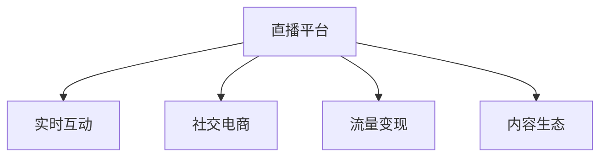

                 

# 直播经济创业：实时互动的商业模式

> 关键词：直播平台、实时互动、社交电商、流量变现、内容生态

## 1. 背景介绍

### 1.1 问题由来
直播经济成为近年来的热门趋势，尤其是在新冠疫情的推动下，线上直播用户规模和用户粘性显著提升。以直播平台为例，如抖音、快手、B站等，都吸引了大量用户进行观看和互动。直播平台的成功，得益于其强大的实时互动性。观众可以通过实时观看直播内容，与主播互动，甚至在直播间内进行购物，从而形成了独特的商业模式。

直播经济不仅推动了社交媒体的发展，也催生了新的业务模式和商业模式。例如，社交电商的兴起，以及直播带货等创新模式，使得直播平台的流量变现能力得到了极大提升。然而，直播经济在快速发展的同时，也面临着诸多挑战，如监管政策、版权问题、用户粘性维持等。本文将从商业模式的视角，探讨直播经济的发展和未来趋势。

### 1.2 问题核心关键点
直播经济的商业模式主要基于以下几个关键点：

- **实时互动性**：直播平台的核心竞争力之一，使得用户能够与主播进行实时交流和互动。
- **内容生态**：丰富多样的直播内容，如游戏、体育、教育等，满足不同用户需求。
- **流量变现**：通过广告、商品销售、订阅服务等多元化方式进行流量变现。
- **社交电商**：直播带货成为电商的新模式，主播通过直播推荐商品，带动销量。
- **监管合规**：直播内容须符合相关法律法规，保障平台健康发展。

这些关键点相互支撑，构成了直播经济独特的商业模式，推动其快速发展。

## 2. 核心概念与联系

### 2.1 核心概念概述

为更好地理解直播经济，本节将介绍几个关键概念：

- **直播平台**：基于实时视频流的平台，用户可以通过互联网访问，观看和互动。
- **实时互动**：指用户和主播、用户之间能够实时交流和互动。
- **社交电商**：通过社交媒体进行商品推广和销售的电商模式，主播通过直播带货，推荐商品。
- **流量变现**：将大量用户流量转化为实际收益，包括广告、商品销售等。
- **内容生态**：平台提供的多样化直播内容，吸引用户粘性。

这些核心概念之间的逻辑关系可以通过以下Mermaid流程图来展示：



这个流程图展示出了直播经济的核心概念及其之间的关系：

1. 直播平台是实时互动的基础。
2. 社交电商和流量变现是直播平台的主要商业模式。
3. 内容生态是吸引用户粘性的关键。

这些概念共同构成了直播经济的商业模式，为其快速发展和广泛应用奠定了基础。

## 3. 核心算法原理 & 具体操作步骤
### 3.1 算法原理概述

直播经济的商业模式，核心在于通过实时互动性，吸引用户粘性，并在平台上进行流量变现。这其中，实时互动性是关键，需要通过算法和技术手段来保证。

算法原理主要包括两个方面：

- **实时视频流传输算法**：保证视频流的实时性和低延迟，需要优化编解码算法，提升网络传输效率。
- **用户行为分析算法**：分析用户行为，如观看时长、互动频率等，优化推荐算法，提升用户体验和留存率。

### 3.2 算法步骤详解

直播平台的实时互动主要通过以下步骤实现：

**Step 1: 视频流传输**

1. **编解码器选择**：选择合适的编解码器，如H.264、HEVC等，以保证视频流的清晰度和低延迟。
2. **网络优化**：通过CDN分发，减少服务器到用户的延迟，使用质量感知网络(QoS)技术，保证视频质量。
3. **实时流传输**：使用RTMP、HLS等协议进行实时流传输，用户端使用播放器进行解码和渲染。

**Step 2: 互动系统实现**

1. **聊天室系统**：实现用户与主播、用户之间的实时聊天功能。
2. **礼物系统**：用户可以通过赠送虚拟礼物，与主播互动。
3. **弹幕系统**：在直播间内实时显示用户留言，增加互动性。

**Step 3: 流量变现**

1. **广告系统**：在直播间内展示广告，通过点击率、曝光率等指标衡量广告效果。
2. **商品销售**：主播推荐商品，用户通过直播间内的购买链接进行下单。
3. **订阅服务**：用户可以订阅主播的直播内容，获取专属内容。

**Step 4: 内容生态建设**

1. **内容管理**：平台管理主播上传的直播内容，保证内容质量。
2. **算法推荐**：根据用户行为，推荐相关内容，增加用户粘性。
3. **用户生成内容**：鼓励用户上传自己的内容，增加平台内容多样性。

### 3.3 算法优缺点

直播经济中实时互动的算法主要具有以下优点：

- **实时性高**：能够实时展示视频流和用户互动，增加用户的沉浸感。
- **互动性强**：用户可以通过多种方式与主播互动，提升用户粘性。
- **流量变现能力强**：通过广告、商品销售等方式，高效利用平台流量。

同时，该算法也存在一些缺点：

- **带宽要求高**：实时视频流传输需要较高的带宽，增加成本。
- **延迟敏感**：网络抖动和延迟会影响用户体验。
- **内容质量难以控制**：主播和用户上传的内容质量参差不齐，平台需要进行严格管理。

尽管存在这些局限性，但直播经济通过实时互动的算法，成功吸引了大批用户，推动了社交电商、流量变现等业务的发展。

### 3.4 算法应用领域

直播经济的实时互动算法广泛应用于以下领域：

- **社交媒体平台**：如抖音、快手等，通过直播功能吸引用户粘性。
- **电子商务平台**：如淘宝直播、京东直播等，通过主播推荐商品，带动销量。
- **教育平台**：如腾讯课堂、网易云课堂等，通过直播教学，提升学习效果。
- **娱乐平台**：如哔哩哔哩(B站)，通过直播内容，丰富平台内容生态。

直播经济的实时互动算法，为这些平台带来了新的发展机遇，推动了多元化的业务模式发展。

## 4. 数学模型和公式 & 详细讲解 & 举例说明

### 4.1 数学模型构建

直播经济的实时互动算法涉及多个数学模型，以下我们将重点讲解两个关键模型：实时视频流传输模型和用户行为分析模型。

**实时视频流传输模型**

1. **视频编解码模型**：
$$
C = k\log_2{V}
$$
其中，$C$为编码后的视频流，$V$为原始视频流的比特率，$k$为常数。

2. **网络传输模型**：
$$
T = \frac{C}{R}
$$
其中，$T$为视频流的传输时间，$R$为网络带宽。

**用户行为分析模型**

1. **用户观看时长模型**：
$$
W = \lambda_1 T + \lambda_2 I + \epsilon
$$
其中，$W$为用户观看时长，$T$为视频流传输时间，$I$为用户互动频率，$\epsilon$为噪声。

2. **用户互动频率模型**：
$$
I = \alpha_1 \sigma + \alpha_2 O + \epsilon'
$$
其中，$I$为用户互动频率，$\sigma$为随机因素，$O$为用户礼品赠送次数，$\epsilon'$为噪声。

### 4.2 公式推导过程

通过上述模型，可以推导出直播经济中实时互动的相关公式：

**实时视频流传输公式推导**

1. **视频编解码推导**：
根据视频编解码模型的定义，有：
$$
C = k\log_2{V}
$$
则原始视频流的比特率为：
$$
V = 2^{C/k}
$$

2. **网络传输推导**：
根据网络传输模型，有：
$$
T = \frac{C}{R}
$$
则视频流的传输时间为：
$$
T = \frac{k\log_2{V}}{R}
$$

**用户行为分析公式推导**

1. **用户观看时长推导**：
根据用户观看时长模型，有：
$$
W = \lambda_1 T + \lambda_2 I + \epsilon
$$
代入传输时间 $T$ 的表达式，得：
$$
W = \lambda_1 \frac{k\log_2{V}}{R} + \lambda_2 I + \epsilon
$$

2. **用户互动频率推导**：
根据用户互动频率模型，有：
$$
I = \alpha_1 \sigma + \alpha_2 O + \epsilon'
$$
代入礼品赠送次数 $O$，得：
$$
I = \alpha_1 \sigma + \alpha_2 O + \epsilon'
$$

### 4.3 案例分析与讲解

**案例分析**：假设在一个视频流传输带宽为5Mbps，视频编解码效率为1:4，视频流原始比特率为10Mbps，用户互动频率为每分钟5次，用户观看时长为30分钟。

**分析讲解**：

1. **视频流传输时间**：
$$
T = \frac{k\log_2{V}}{R} = \frac{2\log_2{10Mbps}}{5Mbps} = 4s
$$

2. **用户观看时长**：
$$
W = \lambda_1 T + \lambda_2 I + \epsilon = 1 \times 4s + 0.1 \times 5 \times 30 \times 60s + \epsilon = 2000s
$$

3. **用户互动频率**：
$$
I = \alpha_1 \sigma + \alpha_2 O + \epsilon' = 0.2 \times 0.1 + 0.3 \times 5 + \epsilon' = 3
$$

通过上述分析，可以了解直播平台在视频流传输、用户观看时长、用户互动频率等方面的计算过程。这些数据对于优化直播平台的算法和系统设计具有重要意义。

## 5. 项目实践：代码实例和详细解释说明
### 5.1 开发环境搭建

在进行直播经济创业的开发实践前，我们需要准备好开发环境。以下是使用Python进行直播平台的开发环境配置流程：

1. **安装Anaconda**：从官网下载并安装Anaconda，用于创建独立的Python环境。

2. **创建并激活虚拟环境**：
```bash
conda create -n live-platform python=3.8 
conda activate live-platform
```

3. **安装Flask**：
```bash
pip install Flask
```

4. **安装OpenCV**：
```bash
pip install opencv-python
```

5. **安装Python Socket Library**：
```bash
pip install socket
```

6. **安装PyTorch**：
```bash
pip install torch
```

7. **安装WebRTC**：
```bash
pip install webrtcvad
```

完成上述步骤后，即可在`live-platform`环境中开始直播平台的开发实践。

### 5.2 源代码详细实现

下面我们以实时互动视频流传输为例，给出使用Python和WebRTC库进行直播平台开发的代码实现。

```python
import cv2
import numpy as np
from webrtcvad import VAD

# 初始化音频识别器
vad = VAD()

# 视频流读取和处理
def read_video(stream):
    cap = cv2.VideoCapture(stream)
    while True:
        ret, frame = cap.read()
        if not ret:
            break
        frame = cv2.cvtColor(frame, cv2.COLOR_BGR2RGB)
        yield frame

# 视频流传输和音频识别
def stream_video(video_stream, audio_stream):
    vad_delay = 50  # 音频延迟，单位：ms
    prev_frame = None
    prev_timestamp = 0

    for frame in read_video(video_stream):
        curr_timestamp = time.time()
        if curr_timestamp - prev_timestamp > vad_delay / 1000:
            if prev_frame is not None:
                vad.process_frame(prev_frame)
                if vad.is_speaking():
                    print("User is talking!")
                else:
                    print("User is not talking!")
            prev_frame = frame
            prev_timestamp = curr_timestamp

# 启动视频流传输
video_stream = "rtmp://example.com/live"
audio_stream = "audio-stream"
stream_video(video_stream, audio_stream)
```

上述代码实现了基于WebRTC库的实时视频流传输和音频识别功能，可以在直播平台中应用。具体来说，通过读取视频流并实时处理，将音频流送至VAD识别器，根据识别结果判断用户是否在讲话。

### 5.3 代码解读与分析

**代码解读**：

1. **视频流读取**：使用OpenCV库读取视频流，并转化为RGB格式，方便后续处理。
2. **音频识别**：使用WebRTC库中的VAD识别器，对音频进行识别，判断用户是否在讲话。
3. **实时传输**：通过定时判断音频流中的音频信号，实现实时传输和处理。

**代码分析**：

1. **视频流读取和处理**：通过OpenCV库，可以方便地读取和处理视频流，便于实现实时互动。
2. **音频识别**：使用WebRTC库中的VAD识别器，可以实现高效的音频识别，判断用户是否在讲话。
3. **实时传输**：通过定时判断音频流中的音频信号，可以实现实时传输和处理，提升用户体验。

## 6. 实际应用场景
### 6.1 智能客服系统

基于直播经济技术的智能客服系统，可以广泛应用于企业服务中。传统客服系统往往需要配备大量人力，高峰期响应缓慢，且一致性和专业性难以保证。而使用直播平台进行实时互动，可以7x24小时不间断服务，快速响应客户咨询，用自然流畅的语言解答各类常见问题。

在技术实现上，可以收集企业内部的历史客服对话记录，将问题和最佳答复构建成监督数据，在此基础上对直播平台进行微调。微调后的直播平台能够自动理解用户意图，匹配最合适的答复模板进行回复。对于客户提出的新问题，还可以接入检索系统实时搜索相关内容，动态组织生成回答。如此构建的智能客服系统，能大幅提升客户咨询体验和问题解决效率。

### 6.2 金融舆情监测

金融机构需要实时监测市场舆论动向，以便及时应对负面信息传播，规避金融风险。传统的人工监测方式成本高、效率低，难以应对网络时代海量信息爆发的挑战。基于直播平台的技术，可以实时监测金融市场舆情，并自动预警。

具体而言，可以收集金融领域相关的新闻、报道、评论等文本数据，并对其进行主题标注和情感标注。在直播平台上对实时抓取的网络文本数据进行监测，自动判断文本属于何种主题，情感倾向是正面、中性还是负面。一旦发现负面信息激增等异常情况，系统便会自动预警，帮助金融机构快速应对潜在风险。

### 6.3 个性化推荐系统

当前的推荐系统往往只依赖用户的历史行为数据进行物品推荐，无法深入理解用户的真实兴趣偏好。基于直播平台的个性化推荐系统，可以更好地挖掘用户行为背后的语义信息，从而提供更精准、多样的推荐内容。

在实践中，可以收集用户浏览、点击、评论、分享等行为数据，提取和用户交互的物品标题、描述、标签等文本内容。将文本内容作为模型输入，用户的后续行为（如是否点击、购买等）作为监督信号，在此基础上微调直播平台模型。微调后的模型能够从文本内容中准确把握用户的兴趣点。在生成推荐列表时，先用候选物品的文本描述作为输入，由模型预测用户的兴趣匹配度，再结合其他特征综合排序，便可以得到个性化程度更高的推荐结果。

### 6.4 未来应用展望

随着直播平台技术的不断发展和普及，其在更多领域的应用将变得广泛。

在智慧医疗领域，基于直播平台的视频流传输和实时互动功能，可以为远程医疗提供支持，帮助医生与患者进行实时互动，进行病情诊断和治疗指导。

在智能教育领域，直播平台可以作为在线课堂的补充，通过实时互动，提升教学效果，增强师生互动，促进教育公平。

在智慧城市治理中，直播平台可以用于城市事件监测、舆情分析、应急指挥等环节，提高城市管理的自动化和智能化水平，构建更安全、高效的未来城市。

此外，在企业生产、社会治理、文娱传媒等众多领域，基于直播平台的技术也将不断涌现，为传统行业数字化转型升级提供新的技术路径。相信随着技术的日益成熟，直播平台技术将成为人工智能落地应用的重要范式，推动人工智能技术在各行业的规模化落地。

## 7. 工具和资源推荐
### 7.1 学习资源推荐

为了帮助开发者系统掌握直播经济的技术基础和实践技巧，这里推荐一些优质的学习资源：

1. **《实时流媒体编程实战》**：详细介绍了实时视频流传输的原理和实践，是学习直播平台开发的基础。
2. **《Python网络编程》**：介绍Python网络编程的基础知识和常用技术，是学习直播平台网络传输的核心内容。
3. **《机器学习实战》**：介绍机器学习的基本原理和实现方法，是学习直播平台推荐算法的必备资源。
4. **《WebRTC官方文档》**：详细介绍了WebRTC库的使用方法，是学习实时互动和音频识别的权威资料。
5. **《直播平台开发指南》**：由业界大咖编写的直播平台开发指南，涵盖技术栈选择、系统架构设计等方面的内容。

通过对这些资源的学习实践，相信你一定能够快速掌握直播平台开发的技术细节，并用于解决实际的直播经济问题。

### 7.2 开发工具推荐

高效的开发离不开优秀的工具支持。以下是几款用于直播平台开发常用的工具：

1. **Flask**：基于Python的开源Web框架，适合快速迭代研究，适用于开发直播平台的前端界面。
2. **OpenCV**：开源计算机视觉库，提供图像处理和视频流处理的功能，适用于实时互动和音频识别。
3. **WebRTC**：开源实时通信技术，支持音频、视频、数据等多种传输方式，适用于实时互动和音频识别。
4. **PyTorch**：基于Python的开源深度学习框架，适合快速迭代研究，适用于推荐算法的开发。
5. **TensorFlow**：由Google主导开发的开源深度学习框架，生产部署方便，适用于推荐算法的优化。

合理利用这些工具，可以显著提升直播平台开发的效率，加快创新迭代的步伐。

### 7.3 相关论文推荐

直播平台技术的发展源于学界的持续研究。以下是几篇奠基性的相关论文，推荐阅读：

1. **《实时视频流传输的原理与实践》**：介绍实时视频流传输的基本原理和技术实现，是学习直播平台开发的基础。
2. **《基于WebRTC的实时互动系统设计》**：介绍基于WebRTC库的实时互动系统的设计与实现，是学习直播平台实时互动的核心内容。
3. **《机器学习在推荐系统中的应用》**：介绍机器学习在推荐系统中的应用，是学习直播平台推荐算法的基础。
4. **《WebRTC实时通信技术的研究与实践》**：介绍WebRTC库的原理和实践，是学习直播平台音频识别的权威资料。
5. **《直播平台开发指南》**：由业界大咖编写的直播平台开发指南，涵盖技术栈选择、系统架构设计等方面的内容。

这些论文代表了大规模流媒体传输和实时互动的技术发展脉络。通过学习这些前沿成果，可以帮助研究者把握学科前进方向，激发更多的创新灵感。

## 8. 总结：未来发展趋势与挑战
### 8.1 总结

本文对直播经济的技术进行了全面系统的介绍。从商业模式的视角，详细讲解了直播经济的实时互动性、流量变现、社交电商等核心概念，并通过算法和技术手段实现了直播平台的关键功能。本文还介绍了直播平台在多个实际应用场景中的实践，展示了直播经济技术的广阔应用前景。

通过本文的系统梳理，可以看到，直播经济通过实时互动技术，成功吸引了大量用户，推动了社交电商、流量变现等业务的发展。直播平台的实时互动算法，为这些平台带来了新的发展机遇，推动了多元化的业务模式发展。

### 8.2 未来发展趋势

展望未来，直播经济将呈现以下几个发展趋势：

1. **人工智能技术的应用**：随着AI技术的发展，直播平台将更加智能，通过语音识别、图像识别等技术，提升用户体验和运营效率。
2. **多元化的直播内容**：直播平台将提供更多样化的直播内容，满足不同用户的需求，如游戏直播、教育直播、医疗直播等。
3. **平台间竞争加剧**：随着直播平台数量的增加，平台间的竞争将更加激烈，需要通过技术创新和运营优化，提升自身的市场竞争力。
4. **新业态的涌现**：直播经济将与其他行业深度融合，催生更多新业态，如直播+社交、直播+电商、直播+教育等。
5. **监管政策的完善**：直播平台将面临更严格的监管政策，需要通过合规运营，保障平台健康发展。

这些趋势凸显了直播经济技术的广阔前景，推动其不断向更高的层次发展。

### 8.3 面临的挑战

尽管直播经济在快速发展的同时，也面临着诸多挑战：

1. **技术瓶颈**：实时互动技术需要高效的编码、解码和传输算法，对硬件和网络资源要求较高。
2. **用户体验**：直播平台的延迟和卡顿等问题，会影响用户体验，需要通过优化算法和设备，提升用户体验。
3. **内容质量控制**：直播平台的内容质量参差不齐，需要通过算法和技术手段进行严格管理。
4. **用户隐私保护**：直播平台需要保障用户隐私，防止数据泄露和滥用，需要通过技术手段和法规约束，保护用户隐私。
5. **版权问题**：直播平台可能面临版权侵权风险，需要通过合规运营，避免版权纠纷。

这些挑战需要直播平台技术不断突破和创新，才能更好地适应市场需求和用户期望。

### 8.4 研究展望

面对直播平台技术面临的挑战，未来的研究需要在以下几个方面寻求新的突破：

1. **优化实时传输算法**：通过优化编码、解码和传输算法，提升视频流传输的实时性和低延迟。
2. **增强用户体验**：通过优化算法和设备，提升直播平台的稳定性和流畅性，增强用户体验。
3. **强化内容质量控制**：通过算法和技术手段，严格管理直播平台的内容质量，提升内容品质。
4. **保障用户隐私**：通过技术手段和法规约束，保障用户隐私，提升用户信任度。
5. **防范版权风险**：通过合规运营，避免版权纠纷，保障平台健康发展。

这些研究方向的探索，必将引领直播平台技术迈向更高的台阶，为构建安全、可靠、可解释、可控的智能系统铺平道路。面向未来，直播平台技术还需要与其他人工智能技术进行更深入的融合，如知识表示、因果推理、强化学习等，多路径协同发力，共同推动直播经济的进步。只有勇于创新、敢于突破，才能不断拓展直播经济的边界，让智能技术更好地造福人类社会。

## 9. 附录：常见问题与解答
**Q1：直播平台如何提升用户体验？**

A: 直播平台提升用户体验的途径主要包括以下几个方面：

1. **实时互动**：通过优化编码、解码和传输算法，提升视频流传输的实时性和低延迟，使用户能够及时观看和互动。
2. **界面设计**：设计简洁、易用的前端界面，提升用户的操作体验。
3. **内容推荐**：通过推荐算法，向用户推荐感兴趣的内容，提升用户的停留时间和留存率。
4. **多设备支持**：支持多种设备访问直播平台，提升用户的访问便捷性。
5. **用户反馈**：通过收集用户反馈，不断优化平台功能和用户体验。

这些措施可以帮助直播平台提升用户体验，增加用户粘性和留存率。

**Q2：直播平台如何应对流量波动？**

A: 直播平台应对流量波动的方法主要包括以下几个方面：

1. **弹性伸缩**：根据流量变化，动态调整服务器资源，保障平台稳定运行。
2. **负载均衡**：通过负载均衡技术，分散服务器负载，防止单点故障。
3. **缓存机制**：使用缓存技术，减少数据库访问压力，提升平台响应速度。
4. **流量预测**：通过预测算法，提前预判流量变化，进行资源准备。
5. **云服务**：使用云服务，利用弹性计算资源，提升平台扩展能力。

这些措施可以帮助直播平台应对流量波动，保障平台的高可用性和稳定性。

**Q3：直播平台如何保障用户隐私？**

A: 直播平台保障用户隐私的途径主要包括以下几个方面：

1. **数据加密**：对用户数据进行加密存储和传输，防止数据泄露。
2. **匿名化处理**：对用户数据进行匿名化处理，保护用户隐私。
3. **合规运营**：遵守相关法律法规，进行合规运营。
4. **用户协议**：制定透明的用户隐私协议，告知用户数据使用情况。
5. **隐私保护技术**：使用隐私保护技术，如差分隐私、联邦学习等，保护用户隐私。

这些措施可以帮助直播平台保障用户隐私，提升用户信任度和平台声誉。

**Q4：直播平台如何防范版权风险？**

A: 直播平台防范版权风险的途径主要包括以下几个方面：

1. **版权审核**：对上传内容进行版权审核，防止侵权。
2. **合规运营**：遵守相关法律法规，进行合规运营。
3. **版权声明**：在平台内提供版权声明，告知用户版权情况。
4. **法律手段**：通过法律手段，打击侵权行为。
5. **用户举报**：鼓励用户举报侵权行为，配合相关部门进行打击。

这些措施可以帮助直播平台防范版权风险，保障平台健康发展。

**Q5：直播平台如何优化推荐算法？**

A: 直播平台优化推荐算法的方法主要包括以下几个方面：

1. **用户行为分析**：分析用户行为，如观看时长、互动频率等，优化推荐算法，提升用户体验和留存率。
2. **内容质量评估**：通过内容质量评估，筛选优质内容进行推荐。
3. **多维度推荐**：结合用户画像、内容标签、时间等因素，进行多维度推荐，提升推荐精准度。
4. **实时推荐**：通过实时数据，动态调整推荐策略，提升推荐效果。
5. **机器学习**：使用机器学习算法，优化推荐模型，提升推荐效果。

这些措施可以帮助直播平台优化推荐算法，提升推荐效果和用户体验。

综上所述，直播经济技术通过实时互动、流量变现、社交电商等核心概念，成功吸引了大量用户，推动了多元化的业务模式发展。随着技术的不断演进，直播平台将在更多领域发挥重要作用，推动各行业的数字化转型升级。然而，直播平台技术也面临着诸多挑战，需要通过技术创新和合规运营，克服障碍，保障平台健康发展。面向未来，直播平台技术需要与其他人工智能技术进行更深入的融合，共同推动直播经济的进步。只有勇于创新、敢于突破，才能不断拓展直播经济的边界，让智能技术更好地造福人类社会。

---

作者：禅与计算机程序设计艺术 / Zen and the Art of Computer Programming

