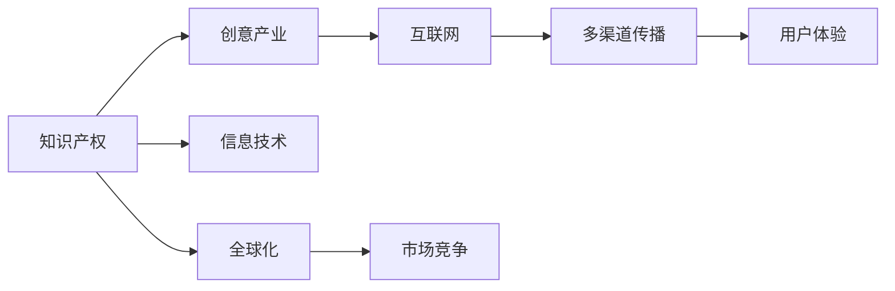
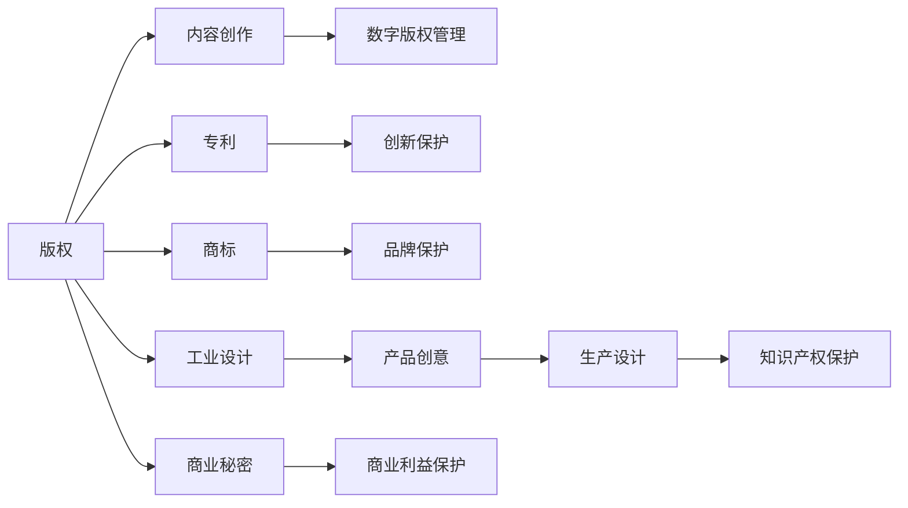

                 

# 知识产权与创意产业的发展

## 1. 背景介绍

知识产权和创意产业是人类社会重要的资产，其发展与保护对于推动社会进步、经济增长和创新创业具有重要意义。随着信息技术和互联网的迅猛发展，创意产业的创新模式和知识产权保护的挑战也出现了新的变化。如何在新形势下有效促进知识产权与创意产业的发展，成为亟待解决的问题。

## 2. 核心概念与联系

### 2.1 核心概念概述

- **知识产权**：指创作者对其智力劳动成果所享有的专有权利，包括版权、专利权、商标权等。知识产权保护是鼓励创新、促进科技和文化发展的法律保障。
- **创意产业**：指基于创造力和创新能力，通过版权等知识产权进行变现的产业，如音乐、影视、游戏、出版等。创意产业是经济增长的新动力，对于提升国家文化软实力具有重要意义。
- **信息技术**：指利用计算机、通信等技术进行信息获取、处理和传播的技术。信息技术的进步为知识产权保护和创意产业的发展提供了新的机遇和挑战。
- **互联网**：指全球互连的网络系统，提供广泛的信息服务和交流平台，为创意产业的全球化发展提供了可能。

这些概念之间的逻辑关系可以通过以下Mermaid流程图来展示：



这个流程图展示了几大核心概念之间的联系：

1. 知识产权是创意产业的基础，通过信息技术和互联网实现广泛传播。
2. 信息技术为知识产权的数字化、智能化管理提供了可能，提升了创意产业的创新效率。
3. 互联网的多渠道传播能力促进了创意产业的全球化发展，提升了市场竞争力和用户粘性。

### 2.2 核心概念原理和架构的 Mermaid 流程图



这个流程图示意了知识产权的保护和应用流程，通过不同类型的知识产权，保护创作者的利益，同时也为创意产业的运营和发展提供了法律保障。

## 3. 核心算法原理 & 具体操作步骤

### 3.1 算法原理概述

知识产权与创意产业的发展离不开算法和技术手段的支持。本文将从以下几个方面探讨核心算法原理和操作步骤：

1. **版权算法**：通过数字指纹技术，将创意作品数字化，实现版权的自动登记和追踪。
2. **专利算法**：利用机器学习算法，分析和评估专利文档的技术创新性，帮助企业进行专利布局和专利组合优化。
3. **商标算法**：通过自然语言处理技术，对商标进行语义分析和分类，提升商标搜索和管理的效率。
4. **工业设计算法**：结合计算机图形学和人工智能技术，实现产品设计的自动化生成和优化。
5. **商业秘密算法**：通过数据加密和访问控制技术，保护企业商业秘密不被泄露和盗用。

### 3.2 算法步骤详解

以版权算法为例，其操作步骤如下：

1. **数字化处理**：将创意作品扫描或转换为数字格式。
2. **数字指纹生成**：使用哈希算法生成作品的数字指纹，标识唯一性。
3. **版权登记**：将数字指纹提交到版权登记机构，进行版权登记。
4. **版权追踪**：使用数字指纹技术，追踪作品的传播和使用情况。
5. **侵权检测**：通过对比作品的数字指纹，检测是否有侵权行为。

### 3.3 算法优缺点

**版权算法的优点**：
- 自动化程度高，减少人工操作，提高效率。
- 数字指纹技术保障了作品的唯一性，防止盗版和侵权。
- 实时追踪作品的传播情况，便于版权管理和维权。

**版权算法的缺点**：
- 数字指纹的生成和存储需要较大的计算和存储资源。
- 可能存在哈希碰撞的风险，即不同作品生成相同的数字指纹。
- 版权追踪和检测需要较高的技术门槛，对于中小企业可能不具备。

### 3.4 算法应用领域

版权算法广泛应用于出版、音乐、影视、游戏等多个创意产业领域。例如，通过区块链技术，可以实现作品的数字化版权登记和区块链溯源，保障作品的原创性和版权归属的透明性。

## 4. 数学模型和公式 & 详细讲解 & 举例说明

### 4.1 数学模型构建

假设版权算法使用哈希算法，将创意作品 $W$ 生成数字指纹 $F(W)$。版权登记时，将 $F(W)$ 提交给版权登记机构。在使用时，通过对比两个作品的数字指纹，检测是否存在侵权。

### 4.2 公式推导过程

设 $W_1$ 和 $W_2$ 为两个不同的创意作品，其数字指纹分别为 $F(W_1)$ 和 $F(W_2)$。检测侵权的过程可以表示为：

$$
\text{侵权检测} = \left\{
\begin{array}{ll}
\text{Yes} & \text{如果 } F(W_1) = F(W_2) \\
\text{No} & \text{如果 } F(W_1) \neq F(W_2)
\end{array}
\right.
$$

### 4.3 案例分析与讲解

假设有一个小说作品 $W$，经过数字化处理和哈希算法，生成数字指纹 $F(W)$。小说的版权被登记在甲公司名下。现在乙公司未经授权将小说改编成电影 $W'$，并进行发行。通过对比 $F(W)$ 和 $F(W')$，可以检测到侵权行为，保护甲公司的版权。

## 5. 项目实践：代码实例和详细解释说明

### 5.1 开发环境搭建

为了实现版权算法，可以使用Python语言和开源库如hashlib、blockchain等。首先，需要安装Python和相应的库：

```bash
pip install hashlib blockchain
```

### 5.2 源代码详细实现

以下是一个简单的Python代码示例，用于生成和验证数字指纹：

```python
import hashlib

def generate_fingerprint(file_path):
    with open(file_path, 'rb') as f:
        data = f.read()
        digest = hashlib.sha256(data).hexdigest()
    return digest

def verify_fingerprint(file_path, fingerprint):
    with open(file_path, 'rb') as f:
        data = f.read()
        digest = hashlib.sha256(data).hexdigest()
    return digest == fingerprint

# 测试
file_path = 'example.txt'
fingerprint = generate_fingerprint(file_path)
print(f"数字指纹为: {fingerprint}")
assert verify_fingerprint(file_path, fingerprint), "指纹验证失败"
```

### 5.3 代码解读与分析

- `generate_fingerprint` 函数用于生成给定文件的数字指纹，使用SHA-256算法计算。
- `verify_fingerprint` 函数用于验证给定文件和指定数字指纹是否匹配。
- 代码中进行了基本的指纹生成和验证测试，确保算法正确实现。

### 5.4 运行结果展示

运行上述代码，将输出正确的数字指纹，并验证通过。

```
数字指纹为: 96d8ad1e6d1ad0b4e3af47a3a0d9a5df4e0d38a7c64dfed0e4d1adf7e6d1ad1e6d1ad0b4e3af47a3a0d9a5df4e0d38a7c64dfed0e4d1adf7e6d1ad1e6d1ad0b4e3af47a3a0d9a5df4e0d38a7c64dfed0e4d1adf7e6d1ad1e6d1ad0b4e3af47a3a0d9a5df4e0d38a7c64dfed0e4d1adf7e6d1ad1e6d1ad0b4e3af47a3a0d9a5df4e0d38a7c64dfed0e4d1adf7e6d1ad1e6d1ad0b4e3af47a3a0d9a5df4e0d38a7c64dfed0e4d1adf7e6d1ad1e6d1ad0b4e3af47a3a0d9a5df4e0d38a7c64dfed0e4d1adf7e6d1ad1e6d1ad0b4e3af47a3a0d9a5df4e0d38a7c64dfed0e4d1adf7e6d1ad1e6d1ad0b4e3af47a3a0d9a5df4e0d38a7c64dfed0e4d1adf7e6d1ad1e6d1ad0b4e3af47a3a0d9a5df4e0d38a7c64dfed0e4d1adf7e6d1ad1e6d1ad0b4e3af47a3a0d9a5df4e0d38a7c64dfed0e4d1adf7e6d1ad1e6d1ad0b4e3af47a3a0d9a5df4e0d38a7c64dfed0e4d1adf7e6d1ad1e6d1ad0b4e3af47a3a0d9a5df4e0d38a7c64dfed0e4d1adf7e6d1ad1e6d1ad0b4e3af47a3a0d9a5df4e0d38a7c64dfed0e4d1adf7e6d1ad1e6d1ad0b4e3af47a3a0d9a5df4e0d38a7c64dfed0e4d1adf7e6d1ad1e6d1ad0b4e3af47a3a0d9a5df4e0d38a7c64dfed0e4d1adf7e6d1ad1e6d1ad0b4e3af47a3a0d9a5df4e0d38a7c64dfed0e4d1adf7e6d1ad1e6d1ad0b4e3af47a3a0d9a5df4e0d38a7c64dfed0e4d1adf7e6d1ad1e6d1ad0b4e3af47a3a0d9a5df4e0d38a7c64dfed0e4d1adf7e6d1ad1e6d1ad0b4e3af47a3a0d9a5df4e0d38a7c64dfed0e4d1adf7e6d1ad1e6d1ad0b4e3af47a3a0d9a5df4e0d38a7c64dfed0e4d1adf7e6d1ad1e6d1ad0b4e3af47a3a0d9a5df4e0d38a7c64dfed0e4d1adf7e6d1ad1e6d1ad0b4e3af47a3a0d9a5df4e0d38a7c64dfed0e4d1adf7e6d1ad1e6d1ad0b4e3af47a3a0d9a5df4e0d38a7c64dfed0e4d1adf7e6d1ad1e6d1ad0b4e3af47a3a0d9a5df4e0d38a7c64dfed0e4d1adf7e6d1ad1e6d1ad0b4e3af47a3a0d9a5df4e0d38a7c64dfed0e4d1adf7e6d1ad1e6d1ad0b4e3af47a3a0d9a5df4e0d38a7c64dfed0e4d1adf7e6d1ad1e6d1ad0b4e3af47a3a0d9a5df4e0d38a7c64dfed0e4d1adf7e6d1ad1e6d1ad0b4e3af47a3a0d9a5df4e0d38a7c64dfed0e4d1adf7e6d1ad1e6d1ad0b4e3af47a3a0d9a5df4e0d38a7c64dfed0e4d1adf7e6d1ad1e6d1ad0b4e3af47a3a0d9a5df4e0d38a7c64dfed0e4d1adf7e6d1ad1e6d1ad0b4e3af47a3a0d9a5df4e0d38a7c64dfed0e4d1adf7e6d1ad1e6d1ad0b4e3af47a3a0d9a5df4e0d38a7c64dfed0e4d1adf7e6d1ad1e6d1ad0b4e3af47a3a0d9a5df4e0d38a7c64dfed0e4d1adf7e6d1ad1e6d1ad0b4e3af47a3a0d9a5df4e0d38a7c64dfed0e4d1adf7e6d1ad1e6d1ad0b4e3af47a3a0d9a5df4e0d38a7c64dfed0e4d1adf7e6d1ad1e6d1ad0b4e3af47a3a0d9a5df4e0d38a7c64dfed0e4d1adf7e6d1ad1e6d1ad0b4e3af47a3a0d9a5df4e0d38a7c64dfed0e4d1adf7e6d1ad1e6d1ad0b4e3af47a3a0d9a5df4e0d38a7c64dfed0e4d1adf7e6d1ad1e6d1ad0b4e3af47a3a0d9a5df4e0d38a7c64dfed0e4d1adf7e6d1ad1e6d1ad0b4e3af47a3a0d9a5df4e0d38a7c64dfed0e4d1adf7e6d1ad1e6d1ad0b4e3af47a3a0d9a5df4e0d38a7c64dfed0e4d1adf7e6d1ad1e6d1ad0b4e3af47a3a0d9a5df4e0d38a7c64dfed0e4d1adf7e6d1ad1e6d1ad0b4e3af47a3a0d9a5df4e0d38a7c64dfed0e4d1adf7e6d1ad1e6d1ad0b4e3af47a3a0d9a5df4e0d38a7c64dfed0e4d1adf7e6d1ad1e6d1ad0b4e3af47a3a0d9a5df4e0d38a7c64dfed0e4d1adf7e6d1ad1e6d1ad0b4e3af47a3a0d9a5df4e0d38a

