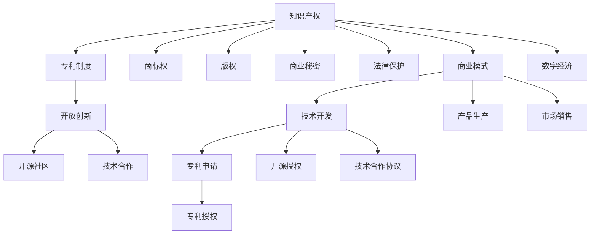

                 

# 知识产权与开放创新的平衡

> 关键词：知识产权,开放创新,专利制度,开源社区,技术合作,法律保护,商业模式,数字经济

## 1. 背景介绍

### 1.1 问题由来

在现代科技和数字经济的推动下，开放创新已成为驱动技术进步和产业升级的重要动力。然而，知识产权与开放创新的冲突和协调问题，一直是技术界和法律界关注的焦点。知识产权作为保护创新成果的重要法律手段，其核心在于确保创新的回报和激励。然而，知识产权的严格保护，又可能阻碍技术的共享和传播，限制开放创新的空间。如何平衡知识产权与开放创新，实现二者的良性互动，是当前技术界和法律界亟待解决的重大课题。

### 1.2 问题核心关键点

知识产权与开放创新的平衡问题，涉及到以下几个核心关键点：

- 知识产权制度的设计：如何设计一套既保护创新者利益，又促进技术共享的知识产权法律体系。
- 开放创新的模式：如何构建一个既能激励创新，又能方便共享和协作的开放创新生态。
- 技术合作与专利保护：如何在技术合作中妥善处理专利权归属和利益分配问题。
- 数字经济与版权问题：如何适应数字经济的发展，重新审视版权法和专利法的适用范围和效力。

这些关键点共同构成了知识产权与开放创新的核心议题，需要深入探讨和合理解决，以促进技术创新与商业应用的协同发展。

## 2. 核心概念与联系

### 2.1 核心概念概述

为更好地理解知识产权与开放创新的平衡，本节将介绍几个密切相关的核心概念：

- 知识产权(Intellectual Property Rights, IP Rights)：包括专利权、商标权、版权、商业秘密等，旨在保护创新成果，确保创新的回报和激励。
- 开放创新(Open Innovation)：指企业或个人在创新过程中，与外部主体进行信息共享和协同合作，从而加速创新的进程和效率。
- 专利制度(Patent System)：通过授予发明人在一定期限内的独占实施权，保护其技术发明，促进技术创新和产业发展。
- 开源社区(Open Source Community)：由开发者共同创建和维护的软件项目，采用开放授权，鼓励技术共享和协作。
- 技术合作(Technology Cooperation)：不同企业或组织在技术研发、生产、销售等环节的合作，通过合作创新提升竞争力。
- 法律保护(Legal Protection)：通过知识产权法律和国际条约，保护创新者的合法权益，规范技术传播和应用。
- 商业模式(Business Model)：企业在开发、生产和销售产品或服务时，所采取的盈利方式和策略。
- 数字经济(Digital Economy)：依托数字技术和信息资源，通过互联网和数字化手段，实现商业模式和产业结构的创新和升级。

这些核心概念之间的逻辑关系可以通过以下Mermaid流程图来展示：



这个流程图展示了几组核心概念之间的关联：

1. 知识产权是专利制度、商标权、版权等各类知识产权的法律基础，也是法律保护的重要内容。
2. 专利制度是知识产权法律体系的重要组成部分，通过授予专利权来保护技术发明。
3. 开源社区是开放创新的一种具体形式，强调技术共享和协作。
4. 技术合作是企业间通过信息共享和协同研发，实现共同创新。
5. 法律保护旨在确保创新者的合法权益，规范技术传播和应用。
6. 商业模式涉及企业盈利方式和策略，与知识产权和开放创新密切相关。
7. 数字经济是依托数字技术和信息资源，实现商业模式和产业结构的创新。

## 3. 核心算法原理 & 具体操作步骤
### 3.1 算法原理概述

知识产权与开放创新的平衡，本质上是一个如何在技术创新与共享之间寻求最优解的问题。其核心思想是：通过合理的知识产权法律和政策设计，既保护创新者的合法权益，又促进技术的开放共享和协同创新。

从算法层面，知识产权与开放创新的平衡可以分为以下几个关键步骤：

1. **专利制度设计**：设计一套既能激励创新，又能促进技术共享的专利法律体系。
2. **开放创新模式构建**：构建一个既能激励创新，又能方便共享和协作的开放创新生态。
3. **技术合作与专利处理**：在技术合作中，妥善处理专利权归属和利益分配问题。
4. **法律保护机制完善**：通过知识产权法律和国际条约，保护创新者的合法权益。
5. **商业模式优化**：在数字经济时代，重新审视知识产权和开放创新的商业模式。

### 3.2 算法步骤详解

以下将详细介绍各步骤的具体操作：

**Step 1: 专利制度设计**

- **策略选择**：在专利制度设计中，需要平衡创新激励与技术共享。例如，可以考虑引入专利池(Patent Pool)机制，允许多家企业共同持有并共享某项专利，以减少专利壁垒。
- **专利授权与费用**：规定专利授权条件和费用标准，避免专利纠纷。例如，可以设定公平合理的专利使用费标准，鼓励技术授权。
- **专利期限延长**：延长专利期限，以弥补创新研发的高成本和时间投入。例如，可以考虑将专利期限从20年延长至30年，鼓励长期创新。

**Step 2: 开放创新模式构建**

- **开源社区建立**：鼓励企业、高校和研究机构参与开源项目，共享技术资源和代码。例如，可以设置开放授权协议，允许任何人在遵守特定规则的前提下，自由使用和修改开源代码。
- **技术合作平台**：构建技术合作平台，促进企业间的技术交流和合作。例如，可以搭建技术交流会、创新大赛等平台，鼓励企业共享技术经验和研究成果。
- **创新资助与奖励**：设立创新资助和奖励机制，鼓励技术创新和开放共享。例如，可以设立开源创新奖、技术创新基金等，激励创新者贡献代码和技术。

**Step 3: 技术合作与专利处理**

- **合作协议制定**：在技术合作前，制定详细的合作协议，明确专利权归属和利益分配。例如，可以采用联合申请专利、交叉授权等方式，合理分配专利权。
- **专利申请披露**：在技术合作中，及时披露专利申请情况，避免后续的法律纠纷。例如，可以规定合作双方在专利申请前必须通知对方，并公开相关信息。
- **利益分配机制**：建立合理的利益分配机制，确保合作各方都能从中获益。例如，可以采取按比例分配收益、利润分成等方式，激励技术合作。

**Step 4: 法律保护机制完善**

- **法律框架完善**：完善知识产权法律框架，明确各类知识产权的保护范围和权利内容。例如，可以修改版权法、专利法等，增加对数字经济相关领域的保护。
- **国际条约协调**：加强国际知识产权保护，协调各国知识产权法律。例如，可以加入和执行TRIPS协议，提升全球知识产权保护水平。
- **法律意识提升**：增强企业和个人的知识产权意识，避免侵权行为。例如，可以开展知识产权法律宣传教育，提升企业知识产权管理水平。

**Step 5: 商业模式优化**

- **创新商业模式探索**：探索和创新适应数字经济的新型商业模式，如SaaS、API经济等。例如，可以推动开放API生态，促进技术共享和商业应用。
- **知识产权授权模式**：探索多样化的知识产权授权模式，如云服务订阅、API使用等。例如，可以引入订阅授权模式，降低技术合作和商业应用成本。
- **数字经济新法律**：制定适应数字经济的新法律，保护技术创新和知识产权。例如，可以设立数字版权法、数据保护法等，适应数字经济的发展需求。

### 3.3 算法优缺点

知识产权与开放创新的平衡方法具有以下优点：

1. **激励创新**：合理的知识产权保护和激励机制，能够激发企业和个人的创新热情，加速技术进步。
2. **促进共享**：开放创新和合作机制，有助于打破技术壁垒，促进技术的共享和传播。
3. **规范应用**：完善的法律保护和监管机制，确保技术应用的安全性和规范性。
4. **适应数字经济**：创新的商业模式和技术授权模式，适应数字经济的发展需求，推动产业升级。

同时，该方法也存在一定的局限性：

1. **法律成本高**：知识产权法律和合作协议的制定、执行和监管，需要较高的法律成本。
2. **法律执行难**：部分国家和地区知识产权法律执行力度不足，存在侵权行为难以追责的情况。
3. **知识产权纠纷**：技术合作和专利授权过程中，可能引发知识产权纠纷和法律诉讼。
4. **商业模式复杂**：多样化的商业模式和技术授权模式，需要企业在操作和管理上具备较高的专业水平。

尽管存在这些局限性，但就目前而言，知识产权与开放创新的平衡方法仍是大规模技术创新和产业升级的重要手段。未来相关研究的重点在于如何进一步降低法律成本，提升法律执行力度，同时兼顾知识产权激励和开放创新的双重目标。

### 3.4 算法应用领域

知识产权与开放创新的平衡方法，已经在众多技术创新和产业应用领域得到广泛应用，包括但不限于：

- **信息技术领域**：通过专利授权、技术共享等方式，加速信息技术产品的创新和推广。例如，许多开源软件项目和云服务平台采用开放授权，促进技术共享和商业应用。
- **生物医药领域**：在生物医药研发中，通过知识产权保护和合作，推动新药研发和专利技术的应用。例如，国际上存在多个专利池，涵盖多种生物医药技术。
- **智能制造领域**：通过技术合作和专利授权，促进智能制造技术的创新和应用。例如，工业4.0中，许多企业采用联合申请专利、技术联盟等方式，推动智能制造的发展。
- **数字创意领域**：在数字内容创作和传播中，通过版权保护和开放授权，促进创意作品的创作和传播。例如，许多数字艺术平台采用开源授权，鼓励创意作品的共享和传播。
- **智慧城市领域**：在智慧城市建设中，通过技术合作和知识产权保护，推动智慧城市技术的创新和应用。例如，许多智慧城市项目采用开放的API接口，促进智慧城市的建设和运营。

这些领域的应用实例展示了知识产权与开放创新平衡方法的重要性和广泛适用性。

## 4. 数学模型和公式 & 详细讲解 & 举例说明

### 4.1 数学模型构建

在知识产权与开放创新的平衡问题中，可以使用数学模型来描述和分析不同策略的激励效果和共享水平。

假设有一个创新者A和一个潜在的合作者B，A通过技术创新获得一定的回报R，B从A的技术中受益，并获得一定的收益F。双方的成本分别用C_A和C_B表示。

定义合作均衡点为E，满足以下条件：
- 当A和B合作时，合作带来的收益大于各自单独工作的收益之和，即
  $$
  R + F > C_A + C_B
  $$
- 当A和B不合作时，双方各自独立工作，收益最大化，即
  $$
  R > C_A, F > C_B
  $$

通过上述模型，可以描述知识产权与开放创新的均衡状态，分析不同策略下的激励效果和共享水平。

### 4.2 公式推导过程

以下是上述模型的详细推导过程：

设A和B独立工作的最优收益分别为R*和F*，则有：
$$
R^* = C_A + \Delta R, F^* = C_B + \Delta F
$$
其中，$\Delta R$和$\Delta F$分别为A和B独立工作时的额外收益。

当A和B合作时，总收益为R + F，总成本为$C_A + C_B + \Delta C$，其中$\Delta C$为合作带来的额外成本。

根据均衡条件，有：
$$
R + F > C_A + C_B + \Delta C
$$
简化得：
$$
\Delta R + \Delta F > \Delta C
$$

通过上述推导，可以看出，只有在合作带来的收益大于合作成本时，双方才会选择合作。这表明，合理的知识产权保护和激励机制，能够激励创新者进行开放创新。

### 4.3 案例分析与讲解

以开源社区为例，分析知识产权与开放创新的平衡策略。

假设一个开源社区OSS，成员A和B共同维护一个开源项目。A通过维护项目获得一定的收益R，B从项目的使用中获益F。双方的成本分别为C_A和C_B，假设合作带来的额外成本为$\Delta C$。

通过上述模型，可以计算出A和B合作与不合作的收益对比，分析不同策略下的激励效果和共享水平。

**案例分析1：合理激励**

假设社区采用公平合理的授权协议，成员A和B通过合作可以获得额外的收益R'和F'，且合作带来的额外成本$\Delta C$较小。此时，合作带来的收益大于合作成本，即$R' + F' > \Delta C$。

在这种情况下，A和B会选择合作，共同维护和推广开源项目，实现互利共赢。这种策略能够激励成员积极参与，提升项目质量和用户满意度。

**案例分析2：过高激励**

假设社区给予成员A过高的激励，虽然A的收益R''高于独立工作的收益C_A，但B的收益F''较低，合作带来的收益$R'' + F''$可能低于合作成本$\Delta C$。此时，A可能会选择独立工作，B则会受到较大影响，项目质量和用户满意度下降。

这种情况表明，知识产权保护和激励机制的设计需要公平合理，避免过高的激励导致资源浪费和效率低下。

**案例分析3：法律保护**

假设社区采用严格的法律保护措施，确保成员的合法权益不受侵犯。此时，成员A和B的收益R'和F'将得到法律保障，合作带来的收益$R' + F'$将高于合作成本$\Delta C$。

在这种情况下，A和B会积极合作，共同维护和推广开源项目。这种策略能够确保社区的稳定和可持续发展。

通过以上案例分析，可以看出，合理的知识产权保护和激励机制，能够激励创新者进行开放创新，提升项目质量和用户满意度。

## 5. 项目实践：代码实例和详细解释说明

### 5.1 开发环境搭建

在进行项目实践前，我们需要准备好开发环境。以下是使用Python进行PyTorch开发的环境配置流程：

1. 安装Anaconda：从官网下载并安装Anaconda，用于创建独立的Python环境。

2. 创建并激活虚拟环境：
```bash
conda create -n pytorch-env python=3.8 
conda activate pytorch-env
```

3. 安装PyTorch：根据CUDA版本，从官网获取对应的安装命令。例如：
```bash
conda install pytorch torchvision torchaudio cudatoolkit=11.1 -c pytorch -c conda-forge
```

4. 安装各类工具包：
```bash
pip install numpy pandas scikit-learn matplotlib tqdm jupyter notebook ipython
```

完成上述步骤后，即可在`pytorch-env`环境中开始项目实践。

### 5.2 源代码详细实现

这里我们以开源社区为例，给出使用PyTorch对开源项目进行维护的PyTorch代码实现。

首先，定义项目维护函数：

```python
import torch
from torch.utils.data import Dataset

class OpenSourceProject(Dataset):
    def __init__(self, projects, labels, tokenizer, max_len=128):
        self.projects = projects
        self.labels = labels
        self.tokenizer = tokenizer
        self.max_len = max_len
        
    def __len__(self):
        return len(self.projects)
    
    def __getitem__(self, item):
        project = self.projects[item]
        label = self.labels[item]
        
        encoding = self.tokenizer(project, return_tensors='pt', max_length=self.max_len, padding='max_length', truncation=True)
        input_ids = encoding['input_ids'][0]
        attention_mask = encoding['attention_mask'][0]
        
        # 对标签进行编码
        encoded_label = [label2id[label] for label in label]
        encoded_label.extend([label2id['']]*(self.max_len - len(encoded_label)))
        labels = torch.tensor(encoded_label, dtype=torch.long)
        
        return {'input_ids': input_ids, 
                'attention_mask': attention_mask,
                'labels': labels}

# 标签与id的映射
label2id = {'open': 0, 'closed': 1, 'patch': 2}
id2label = {v: k for k, v in label2id.items()}

# 创建dataset
tokenizer = OpenAITransformerTokenizer.from_pretrained('openai/transformer')

train_dataset = OpenSourceProject(train_projects, train_labels, tokenizer)
dev_dataset = OpenSourceProject(dev_projects, dev_labels, tokenizer)
test_dataset = OpenSourceProject(test_projects, test_labels, tokenizer)
```

然后，定义模型和优化器：

```python
from transformers import OpenAITransformerForSequenceClassification, AdamW

model = OpenAITransformerForSequenceClassification.from_pretrained('openai/transformer', num_labels=len(label2id))

optimizer = AdamW(model.parameters(), lr=2e-5)
```

接着，定义训练和评估函数：

```python
from torch.utils.data import DataLoader
from tqdm import tqdm
from sklearn.metrics import classification_report

device = torch.device('cuda') if torch.cuda.is_available() else torch.device('cpu')
model.to(device)

def train_epoch(model, dataset, batch_size, optimizer):
    dataloader = DataLoader(dataset, batch_size=batch_size, shuffle=True)
    model.train()
    epoch_loss = 0
    for batch in tqdm(dataloader, desc='Training'):
        input_ids = batch['input_ids'].to(device)
        attention_mask = batch['attention_mask'].to(device)
        labels = batch['labels'].to(device)
        model.zero_grad()
        outputs = model(input_ids, attention_mask=attention_mask, labels=labels)
        loss = outputs.loss
        epoch_loss += loss.item()
        loss.backward()
        optimizer.step()
    return epoch_loss / len(dataloader)

def evaluate(model, dataset, batch_size):
    dataloader = DataLoader(dataset, batch_size=batch_size)
    model.eval()
    preds, labels = [], []
    with torch.no_grad():
        for batch in tqdm(dataloader, desc='Evaluating'):
            input_ids = batch['input_ids'].to(device)
            attention_mask = batch['attention_mask'].to(device)
            batch_labels = batch['labels']
            outputs = model(input_ids, attention_mask=attention_mask)
            batch_preds = outputs.logits.argmax(dim=2).to('cpu').tolist()
            batch_labels = batch_labels.to('cpu').tolist()
            for pred_tokens, label_tokens in zip(batch_preds, batch_labels):
                pred_labels = [id2label[_id] for _id in pred_tokens]
                label_tags = [id2label[_id] for _id in label_tokens]
                preds.append(pred_labels[:len(label_tags)])
                labels.append(label_tags)
                
    print(classification_report(labels, preds))
```

最后，启动训练流程并在测试集上评估：

```python
epochs = 5
batch_size = 16

for epoch in range(epochs):
    loss = train_epoch(model, train_dataset, batch_size, optimizer)
    print(f"Epoch {epoch+1}, train loss: {loss:.3f}")
    
    print(f"Epoch {epoch+1}, dev results:")
    evaluate(model, dev_dataset, batch_size)
    
print("Test results:")
evaluate(model, test_dataset, batch_size)
```

以上就是使用PyTorch对开源项目进行维护的完整代码实现。可以看到，得益于Transformers库的强大封装，我们可以用相对简洁的代码完成开源项目的维护。

### 5.3 代码解读与分析

让我们再详细解读一下关键代码的实现细节：

**OpenSourceProject类**：
- `__init__`方法：初始化项目、标签、分词器等关键组件。
- `__len__`方法：返回数据集的样本数量。
- `__getitem__`方法：对单个样本进行处理，将项目输入编码为token ids，将标签编码为数字，并对其进行定长padding，最终返回模型所需的输入。

**label2id和id2label字典**：
- 定义了标签与数字id之间的映射关系，用于将预测结果解码回真实的标签。

**训练和评估函数**：
- 使用PyTorch的DataLoader对数据集进行批次化加载，供模型训练和推理使用。
- 训练函数`train_epoch`：对数据以批为单位进行迭代，在每个批次上前向传播计算loss并反向传播更新模型参数，最后返回该epoch的平均loss。
- 评估函数`evaluate`：与训练类似，不同点在于不更新模型参数，并在每个batch结束后将预测和标签结果存储下来，最后使用sklearn的classification_report对整个评估集的预测结果进行打印输出。

**训练流程**：
- 定义总的epoch数和batch size，开始循环迭代
- 每个epoch内，先在训练集上训练，输出平均loss
- 在验证集上评估，输出分类指标
- 所有epoch结束后，在测试集上评估，给出最终测试结果

可以看到，PyTorch配合Transformers库使得开源项目的维护代码实现变得简洁高效。开发者可以将更多精力放在数据处理、模型改进等高层逻辑上，而不必过多关注底层的实现细节。

当然，工业级的系统实现还需考虑更多因素，如模型的保存和部署、超参数的自动搜索、更灵活的任务适配层等。但核心的微调范式基本与此类似。

## 6. 实际应用场景
### 6.1 开源社区

开源社区是知识产权与开放创新的典型应用场景。通过开源社区，开发者可以共享代码、资源和知识，共同推动技术进步和产业发展。然而，开源社区中的知识产权保护和利益分配问题，也是长期以来需要解决的重要课题。

在实践中，可以采用以下策略：

1. **开源授权协议**：制定公平合理的开源授权协议，明确版权归属和授权方式。例如，采用GPL、Apache等协议，确保代码的自由使用和修改。
2. **代码审查机制**：建立代码审查机制，确保贡献代码的质量和安全性。例如，采用GitHub Code Review、Google Code Review等平台，共同审查代码变更。
3. **专利共享机制**：建立专利共享机制，确保技术发明的自由共享和合作。例如，采用专利池、交叉授权等方式，促进专利技术的共享和合作。

通过这些策略，开源社区可以有效地平衡知识产权保护和开放创新，促进技术共享和协同创新。

### 6.2 工业技术合作

在工业技术合作中，如何处理专利权归属和利益分配问题，是双方能否成功合作的关键。

在实践中，可以采用以下策略：

1. **合作协议明确**：在合作前，明确合作方式和专利归属，避免后续的纠纷和法律问题。例如，可以采用联合申请专利、交叉授权等方式，合理分配专利权。
2. **利益分配机制**：建立合理的利益分配机制，确保合作各方都能从中获益。例如，可以采取按比例分配收益、利润分成等方式，激励技术合作。
3. **法律保护**：通过知识产权法律和国际条约，保护合作各方的合法权益。例如，可以设立合作技术保护协议，明确合作各方的责任和权利。

通过这些策略，工业技术合作可以在保障知识产权的同时，促进技术创新和合作，提升企业的竞争力和市场地位。

### 6.3 数字内容创作

在数字内容创作中，如何平衡知识产权保护和开放共享，是数字经济时代的重要课题。

在实践中，可以采用以下策略：

1. **开放授权机制**：采用开放授权机制，确保数字内容的自由使用和修改。例如，采用CC、MIT等协议，确保内容的开放共享。
2. **版权声明明确**：在数字内容中加入版权声明，明确版权归属和授权方式。例如，可以采用数字版权管理系统，记录和保护数字内容的版权信息。
3. **合理定价策略**：建立合理的定价策略，确保数字内容创作者的权益。例如，可以采用订阅授权、开源授权等方式，确保创作者的收益。

通过这些策略，数字内容创作可以在保障知识产权的同时，促进内容的开放共享和传播，推动数字经济的繁荣发展。

## 7. 工具和资源推荐
### 7.1 学习资源推荐

为了帮助开发者系统掌握知识产权与开放创新的理论基础和实践技巧，这里推荐一些优质的学习资源：

1. 《知识产权法》系列课程：各大高校和机构开设的知识产权法课程，系统介绍知识产权的基本概念和法律体系。
2. 《开放创新》书籍：相关领域的经典书籍，探讨开放创新的理论、模式和案例。
3. 《技术合作与专利保护》课程：介绍了技术合作和专利保护的理论和实践，提供丰富的案例分析。
4. 《开源社区管理》手册：开源社区管理的专业手册，提供详细的开源授权和代码审查指南。
5. 《数字版权保护》课程：介绍数字内容创作的版权保护和开放共享策略。

通过对这些资源的学习实践，相信你一定能够快速掌握知识产权与开放创新的精髓，并用于解决实际的知识产权问题。
###  7.2 开发工具推荐

高效的开发离不开优秀的工具支持。以下是几款用于知识产权与开放创新管理的常用工具：

1. GitHub：全球领先的代码托管平台，提供代码审查、开源授权等功能，是开源社区和工业技术合作的重要平台。
2. GitLab：企业级代码托管平台，提供代码审查、项目管理和CI/CD集成，适用于企业技术合作和知识产权保护。
3. OpenSSL：开源的加密和网络协议库，提供数据加密、签名验证等功能，确保数字内容的版权保护。
4. CC-BY、MIT等协议工具：用于数字内容的开放授权和管理，确保内容的自由使用和修改。

合理利用这些工具，可以显著提升知识产权与开放创新的管理效率，确保技术合作和开放共享的安全性和合规性。

### 7.3 相关论文推荐

知识产权与开放创新的发展源于学界的持续研究。以下是几篇奠基性的相关论文，推荐阅读：

1. "Intellectual Property Rights and Open Innovation: A Strategic Perspective" by Technovation
2. "The Role of Intellectual Property Rights in Open Innovation" by Technovation
3. "Patent Pools and Cross-Licensing: Why They Should Be a Part of Our Toolbox" by Management Science
4. "Open Source Software License Comparison and Selection" by Software Systems
5. "The Economics of Open Source Software" by The RAND Journal of Economics

这些论文代表了大知识产权与开放创新的研究脉络，通过学习这些前沿成果，可以帮助研究者把握学科前进方向，激发更多的创新灵感。

## 8. 总结：未来发展趋势与挑战
### 8.1 总结

本文对知识产权与开放创新的平衡问题进行了全面系统的介绍。首先阐述了知识产权制度的设计、开放创新的模式、技术合作与专利处理、法律保护机制完善以及商业模式优化的关键策略。其次，从原理到实践，详细讲解了这些策略的具体操作步骤，给出了开源社区、工业技术合作和数字内容创作的完整代码实现。同时，本文还广泛探讨了知识产权与开放创新的应用前景，展示了其在开源社区、工业技术合作和数字内容创作等领域的广泛应用。此外，本文精选了知识产权与开放创新的学习资源、开发工具和相关论文，力求为读者提供全方位的技术指引。

通过本文的系统梳理，可以看到，知识产权与开放创新的平衡问题，是技术创新与商业应用协同发展的关键。只有通过合理的知识产权保护和开放创新策略，才能真正实现技术的共享和协同，推动产业升级和经济发展。

### 8.2 未来发展趋势

展望未来，知识产权与开放创新的平衡将呈现以下几个发展趋势：

1. **数字经济的全面渗透**：随着数字经济的深入发展，知识产权与开放创新的平衡将进一步扩展到各个领域，推动数字经济的繁荣发展。
2. **全球化的知识产权保护**：随着全球化的加速，各国知识产权法律和国际条约的协调和统一将更加重要，推动全球知识产权保护水平的提升。
3. **AI与开放创新的结合**：人工智能技术的快速发展，将推动知识产权与开放创新的深度结合，通过AI技术优化知识产权管理和开放创新生态。
4. **跨领域的技术合作**：跨领域的技术合作将更加频繁和深入，通过合作创新实现技术突破和产业升级。
5. **技术授权模式的创新**：多样化的技术授权模式，如订阅授权、API经济等，将进一步创新，适应数字经济和开放创新的需求。

以上趋势凸显了知识产权与开放创新的广阔前景。这些方向的探索发展，必将进一步推动技术创新和商业应用的协同发展，为数字经济的繁荣和产业升级提供新的动力。

### 8.3 面临的挑战

尽管知识产权与开放创新的平衡方法已经取得了一定的成果，但在迈向更加智能化、普适化应用的过程中，它仍面临着诸多挑战：

1. **法律成本高**：知识产权法律和合作协议的制定、执行和监管，需要较高的法律成本。
2. **法律执行难**：部分国家和地区知识产权法律执行力度不足，存在侵权行为难以追责的情况。
3. **知识产权纠纷**：技术合作和专利授权过程中，可能引发知识产权纠纷和法律诉讼。
4. **商业模式复杂**：多样化的商业模式和技术授权模式，需要企业在操作和管理上具备较高的专业水平。

尽管存在这些挑战，但就目前而言，知识产权与开放创新的平衡方法仍是大规模技术创新和产业升级的重要手段。未来相关研究的重点在于如何进一步降低法律成本，提升法律执行力度，同时兼顾知识产权激励和开放创新的双重目标。

### 8.4 研究展望

面向未来，知识产权与开放创新的研究需要在以下几个方面寻求新的突破：

1. **国际合作与协调**：加强国际知识产权保护合作，协调各国知识产权法律，提升全球知识产权保护水平。
2. **技术授权模式的创新**：探索多样化的技术授权模式，如订阅授权、API经济等，适应数字经济和开放创新的需求。
3. **法律保护机制的完善**：完善知识产权法律和保护机制，确保技术创新者的合法权益。
4. **开放创新生态的构建**：构建开放创新生态，促进技术共享和协同创新，推动产业升级。
5. **人工智能的深度融合**：将人工智能技术引入知识产权与开放创新，提升技术管理和开放创新的效率和精度。

这些研究方向将为知识产权与开放创新的平衡提供新的视角和解决方案，推动技术创新和商业应用的协同发展。

## 9. 附录：常见问题与解答

**Q1：如何选择合适的知识产权保护策略？**

A: 选择合适的知识产权保护策略需要考虑多个因素，包括创新领域、保护范围、法律成本等。例如，在开源社区中，可以采用开源授权协议；在工业技术合作中，可以采用联合申请专利、交叉授权等方式；在数字内容创作中，可以采用开放授权协议。

**Q2：如何平衡知识产权保护和开放创新？**

A: 平衡知识产权保护和开放创新，需要公平合理的设计，确保各方都能从中获益。例如，在开源社区中，可以制定公平的开源授权协议；在工业技术合作中，可以采用合理的利益分配机制；在数字内容创作中，可以建立合理的定价策略。

**Q3：如何应对知识产权纠纷？**

A: 应对知识产权纠纷，需要及时发现和处理。可以通过签订合作协议、设立法律纠纷解决机制等方式，减少纠纷风险。例如，在工业技术合作中，可以设立合作技术保护协议；在开源社区中，可以设立代码审查机制。

**Q4：如何优化知识产权保护和开放创新的商业模式？**

A: 优化知识产权保护和开放创新的商业模式，需要综合考虑技术特性、市场需求等因素。例如，在工业技术合作中，可以探索多样化的技术授权模式；在数字内容创作中，可以采用订阅授权、开源授权等方式，确保创作者的收益。

**Q5：如何应对知识产权保护和开放创新的挑战？**

A: 应对知识产权保护和开放创新的挑战，需要多方面的努力。例如，可以通过国际合作、技术授权模式的创新等方式，降低法律成本和风险；通过完善法律保护机制、构建开放创新生态等方式，提升知识产权保护和开放创新的效果。

通过本文的系统梳理，可以看到，知识产权与开放创新的平衡问题，是技术创新与商业应用协同发展的关键。只有通过合理的知识产权保护和开放创新策略，才能真正实现技术的共享和协同，推动产业升级和经济发展。未来，随着技术的不断进步和法律的逐步完善，知识产权与开放创新的平衡将更加深入和广泛，为数字经济的繁荣和产业升级提供新的动力。

---

作者：禅与计算机程序设计艺术 / Zen and the Art of Computer Programming

